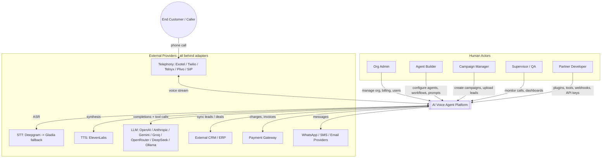
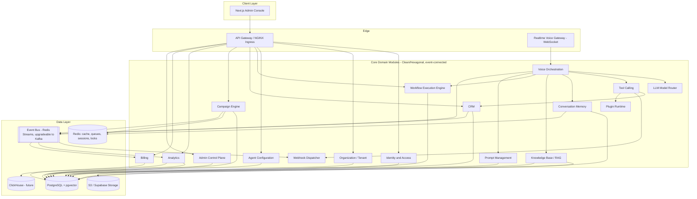
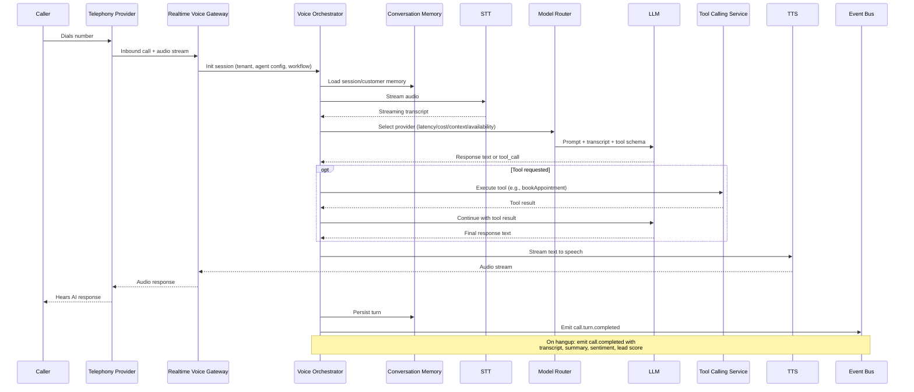
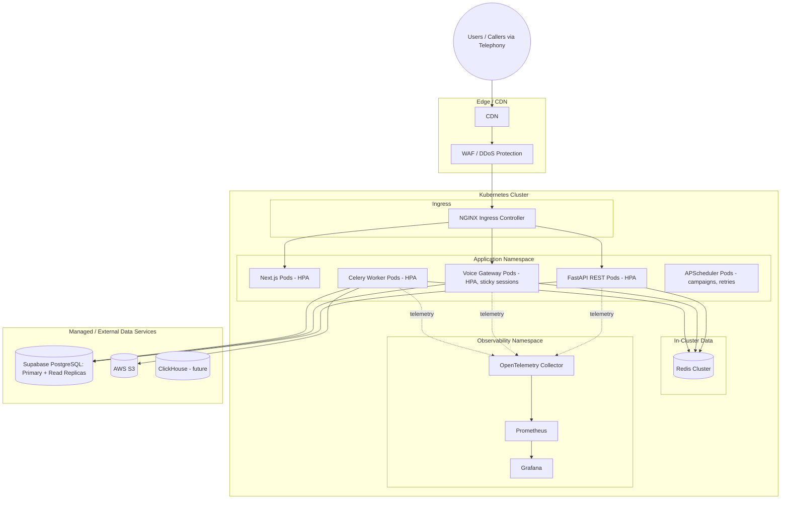

# AI Voice Agent Platform
## Phase 2 — High-Level System Architecture

## 7. Architecture Overview

### 7.1 Architectural Style & Rationale

**Chosen style:** Clean Architecture + Domain-Driven Design + Hexagonal (Ports & Adapters) + Event-Driven Design, deployed as a set of independently deployable, domain-aligned services on Kubernetes.

**Why this combination:**
- The product's core value (millions of calls, thousands of orgs, "unlimited" everything) is inseparable from *provider independence* — telephony/STT/TTS/LLM vendors change or fail. Hexagonal architecture makes vendor swap an adapter change, not a domain rewrite.
- The domain is genuinely complex and cross-cutting (voice, CRM, campaigns, workflows, billing) — DDD's bounded contexts stop this from collapsing into one tangled monolith.
- Real-time voice + async campaign/billing/analytics work naturally split into a synchronous request path (API) and an asynchronous event path (domain events, webhooks, analytics) — Event-Driven Design is the natural fit, not an add-on.

**Alternatives considered:**

| Alternative | Why not chosen (primary reason) |
|---|---|
| Single monolithic FastAPI app, layered (not hexagonal) | Fast to start, but couples business logic to specific vendor SDKs; every provider change becomes a domain-code change, violating `ARCHITECTURE_PRINCIPLES.md` "Provider Independence" directly. |
| Full microservices from day one (one deployable per bounded context) | Matches the 10-year scale target eventually, but at day one it multiplies operational overhead (24 phases of domains × separate CI/CD, service mesh, etc.) before there is load to justify it. |
| Serverless/functions-first (e.g., Lambda-per-endpoint) | Poor fit for persistent WebSocket voice streaming sessions and sub-800ms latency budgets; cold starts are directly at odds with the voice-latency NFR. |

**Trade-off accepted:** We start as a **modular monolith of bounded-context modules** inside a small number of deployable services (Voice/Realtime, Core API, Workers), each internally structured as Clean/Hexagonal/DDD, communicating internally via well-defined module boundaries and externally via domain events. This gets DDD's clarity and Hexagonal's provider independence *now*, while deferring full microservice extraction until a specific module (most likely Voice Orchestration or Analytics) demonstrably needs independent scaling/deployment cadence. This directly satisfies "Avoid tightly coupled modules" without paying full microservice tax on day one, and each module's port/adapter boundary is exactly the seam along which it would later be extracted into its own service — so the option is preserved, not foreclosed.

**Scalability implication:** Because modules are stateless and already speak to each other through events/ports, extracting the Voice Orchestration module into its own deployable later is a deployment-topology change, not a code rewrite.

**Security implication:** Ports/adapters give a single enforcement point per external system (telephony, STT, TTS, LLM, payments) where tenant context, rate limiting, and secret usage are centrally applied instead of scattered across call sites.

**Performance implication:** The Voice Gateway/Orchestrator is kept as a distinct, independently scalable component from day one (not folded into the general API) precisely because it has a different latency profile (streaming, sub-second) than CRUD/admin traffic.

**Future extensibility:** New LLM/STT/TTS/telephony providers, new tools, new workflow node types, and new CRM connectors are all designed as plug-in points (adapters, tool registrations, plugin SDK) rather than core-code changes — directly satisfying `PRODUCT_VISION.md`'s "Extensibility" and "Provider Independence" goals.

### 7.2 System Context

### 7.3 Container / Component View

### 7.4 Bounded Contexts (Domain Decomposition)

| Bounded Context | Owns | Talks to others via |
|---|---|---|
| Identity & Access | Users, roles, sessions, API keys | Events (`user.created`), sync auth check |
| Organization / Tenant | Org profile, quotas, numbers | Events (`org.created`, `quota.exceeded`) |
| Voice Orchestration | Live call state machine, turn loop | Sync calls to Model Router/Tools/Memory/RAG; emits `call.*` events |
| Agent Configuration | Agent definitions (voice, prompt ref, workflow ref, tools) | Read by Voice Orchestration at session start |
| Workflow Engine | Workflow JSON graphs, execution state | Invoked by Voice Orchestration; emits node-level events |
| Prompt Management | Prompt templates, versions, A/B assignment | Read by Voice Orchestration/Model Router |
| Conversation Memory | Session/customer/org memory, summarization | Read/write by Voice Orchestration |
| LLM Model Router | Provider selection, fallback, cost/latency scoring | Adapter calls to LLM providers |
| Tool Calling | Tool registry, execution, sandboxing | Calls CRM, Webhook, Plugin contexts |
| Knowledge Base / RAG | Documents, chunks, embeddings, search | Adapter calls to embedding/LLM providers |
| CRM | Contacts, deals, tasks, pipelines, call history | Consumes `call.completed`, `lead.*` events |
| Campaign Engine | Campaigns, leads, pacing, retries | Emits `campaign.*`; drives outbound calls |
| Analytics | Metrics, dashboards, cost analytics | Consumes nearly all events |
| Billing | Metering, plans, invoices | Consumes usage events; calls Payment adapter |
| Webhooks | Subscriptions, delivery, retries | Consumes all domain events |
| Plugin Runtime | Plugin registration, sandboxed execution | Adapter boundary for 3rd-party code |
| Admin Control Plane | Cross-tenant ops view | Reads aggregated state from all contexts |

### 7.5 Voice Pipeline — Sequence (Inbound Call)

### 7.6 Data Architecture

| Store | Role | Rationale |
|---|---|---|
| PostgreSQL (Supabase) + pgvector | Single source of truth for all transactional domain data and vector embeddings | Keeps RAG data transactionally consistent with the documents it's derived from; avoids running a separate vector DB at current scale (`TECH_STACK.md` mandates pgvector). |
| Redis | Cache, queues (Celery broker), sessions, distributed locks, WebSocket presence | Explicitly scoped in `TECH_STACK.md`/roadmap docs — never used as a system of record. |
| S3 / Supabase Storage | Call recordings, uploaded documents, exports | Object storage is cheaper and more appropriate for large binary blobs than the relational store. |
| ClickHouse (future) | Analytics/OLAP at scale | Analytics writes go through an abstracted event/write path from day one so migration doesn't touch producers, satisfying "migrate without affecting transactional workloads." |

Tenant isolation in the data layer: every table carries `tenant_id`; Postgres Row-Level Security (RLS) policies enforce isolation as a second, DB-enforced line of defense beneath application-layer checks (defense in depth per `NFR-SEC-003`). Redis keys and S3 object paths are namespaced by `tenant_id`. Detailed schema is Phase 5 (Database Design).

### 7.7 Event Architecture (Overview)

- Every bounded context publishes domain events (`call.started`, `call.completed`, `lead.created`, `campaign.completed`, etc.) to an event bus, initially Redis Streams (already in the approved stack, avoids introducing a new broker before it's needed), upgradeable to Kafka if throughput demands it — this is an adapter swap, not a domain change, by design.
- Consumers: Analytics, Billing (usage metering), Webhook Dispatcher (external subscribers), CRM (call outcome sync).
- Reliability pattern: transactional outbox from Postgres, so a domain event is only published if its originating transaction committed — avoiding the classic dual-write bug between DB and event bus.
- Full event catalog and schemas are Phase 7 (Event Architecture).

### 7.8 Multi-Tenancy Enforcement (Cross-Cutting)

| Layer | Mechanism |
|---|---|
| API | Tenant resolved from JWT/API key at the gateway; injected into every downstream call context. |
| Service | Domain services accept tenant context as a mandatory parameter, never inferred implicitly. |
| Database | `tenant_id` column + PostgreSQL RLS policy per table. |
| Cache | Redis keys namespaced `tenant:{id}:...`. |
| Storage | S3/Supabase paths namespaced `org/{id}/...`. |
| Events | Every event envelope carries `tenant_id`; consumers must filter/authorize by it. |

### 7.9 Security Architecture (Overview)

- **AuthN/AuthZ:** JWT + OAuth2 SSO for humans, scoped API keys for programmatic/partner access, RBAC evaluated at the API gateway and re-checked at the service boundary (defense in depth).
- **Secrets:** Centralized secret manager; provider credentials (telephony/STT/TTS/LLM/payment) never embedded in code, never logged.
- **Encryption:** TLS in transit; encryption at rest for Postgres, S3/Supabase Storage, and recordings.
- **Audit logging:** Every privileged action and every auth decision written to an append-only audit store, queryable by Org Admins (their own tenant) and Platform Super Admins (cross-tenant, access itself audited).
- **Prompt-injection protection:** Inputs entering the LLM context from untrusted sources (caller speech, retrieved documents, tool results) pass through a guardrail layer before being trusted for tool-invocation decisions; tool execution has its own authorization check independent of what the LLM "asked for."
- **Rate limiting:** Enforced per API key/tenant at the gateway, with stricter limits on cost-sensitive endpoints (LLM calls, outbound calling).
- Full threat model and control mapping (OWASP ASVS) is Phase 8 (AuthN/AuthZ) and revisited per-module.

### 7.10 Deployment Architecture

Deployment uses Docker images built and tested via GitHub Actions, promoted through environments, deployed to Kubernetes with blue-green rollout and horizontal pod autoscaling keyed on CPU + custom latency/queue-depth metrics. Full CI/CD and environment strategy is Phase 22 (Deployment).

### 7.11 Scalability & Performance Strategy

- **Stateless app tier:** All pods stateless; horizontal autoscaling is the primary scale lever (`ARCHITECTURE_PRINCIPLES.md` — "Horizontal Scalability").
- **Voice Gateway isolation:** Kept as its own scalable component with sticky-session routing per call, so voice traffic scaling doesn't compete with CRUD/admin traffic scaling.
- **Latency budget (indicative, refined in Phase 9):** network+STT partial ≈150ms, LLM first-token ≈250–350ms, tool call (when needed) ≈100–200ms, TTS first-audio ≈100–150ms — informing which provider/model is selected by the Model Router per agent's latency requirements.
- **Async by default off the hot path:** Anything not required to produce the next spoken word (CRM sync, analytics, billing metering, webhooks) is pushed to the event bus / Celery workers, not done inline during the call.
- **Database scaling:** Read replicas for reporting/analytics queries; connection pooling (PgBouncer-style) to protect Postgres under high concurrent-call load; partitioning strategy for high-volume tables (calls, transcripts, events) designed in Phase 5.
- **Caching:** Redis caches agent configuration, prompt templates, and frequently-read reference data to keep the per-call hot path off the primary DB where possible.

### 7.12 Observability Architecture

- **Metrics:** Prometheus scrapes per-service metrics (request rate, error rate, latency histograms, queue depth, concurrent-call count); Grafana dashboards per bounded context and a platform-wide SLO dashboard.
- **Tracing:** OpenTelemetry traces span the full call path (Gateway → Orchestrator → STT/LLM/TTS/Tools) so a single slow call can be root-caused to a specific stage.
- **Logging:** Structured JSON logs, correlation ID = call/session ID, no secrets or raw PII by default (`NFR-SEC-005`).
- **Health checks:** Liveness/readiness probes per service; synthetic call monitoring for the voice path specifically, since it's the product's core value.

### 7.13 Technology-to-Component Mapping

| Component | Primary Technology |
|---|---|
| Admin Console | Next.js (App Router), React, TypeScript, Tailwind, Shadcn UI, Zustand, TanStack Query, React Hook Form, Zod, Recharts, Framer Motion |
| Realtime Voice Gateway | FastAPI + WebSockets + AsyncIO |
| Core REST API | FastAPI, Pydantic, SQLAlchemy, Alembic |
| Background Workers | Celery + Redis broker |
| Scheduling (campaigns, retries) | APScheduler |
| Outbound HTTP to providers | httpx |
| Primary datastore | PostgreSQL (Supabase) |
| Vector search | pgvector |
| Cache / queues / locks / presence | Redis |
| Object storage | AWS S3 / Supabase Storage |
| Future OLAP | ClickHouse |
| Containers / Orchestration | Docker, Docker Compose (local), Kubernetes (prod) |
| Ingress / LB | NGINX |
| CI/CD | GitHub Actions |
| Observability | Prometheus, Grafana, OpenTelemetry |

---

## 8. Next Steps — What Each Following Phase Will Deliver

| Phase | Deliverable this document deliberately defers |
|---|---|
| 3 — Low-Level Design | Class/module-level design per bounded context, internal folder structure, interface definitions. |
| 4 — Domain-Driven Design | Full ubiquitous language, aggregates, entities, value objects, domain services per context. |
| 5 — Database Design | ERD, table definitions, indexes, partitioning, RLS policy specifics, migration strategy. |
| 6 — API Design | OpenAPI spec, versioning policy, request/response contracts, pagination/error conventions. |
| 7 — Event Architecture | Full event catalog, payload schemas, outbox implementation, delivery guarantees. |
| 8 — AuthN/AuthZ | Detailed RBAC matrix, token lifecycle, MFA flows, threat model. |
| 9 — Voice Pipeline | Exact latency budget per stage, barge-in handling, failover sequencing, recording pipeline. |
| 10–20 | Per-module deep design (RAG, CRM, Campaigns, Workflow Builder, Prompts, Memory, Model Router, Tool Framework, Integrations, Analytics, Billing) — each with its own architecture, diagrams, DB schema slice, API spec, and test strategy per `PROMPT_GUIDELINES.md`. |
| 21–23 | Observability spec, deployment/environment topology detail, full test strategy (unit/integration/contract/E2E/load/chaos). |
| 24 | Production implementation — begins only after architecture sign-off, per `PROJECT_ROADMAP.md`. |

