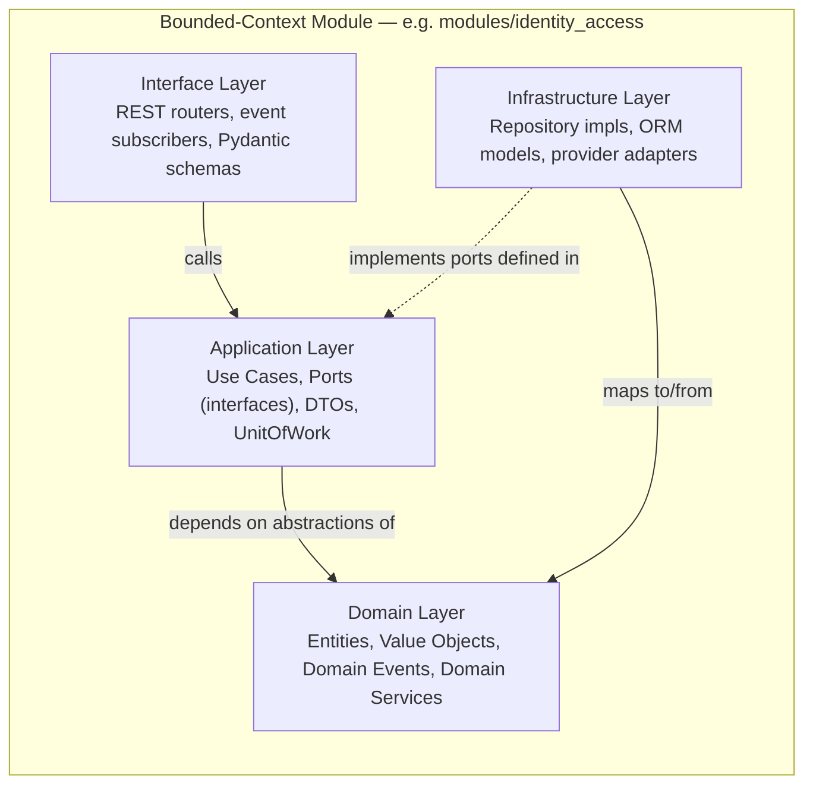
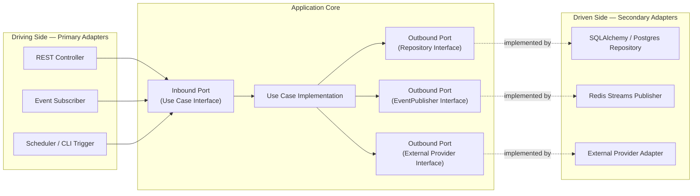
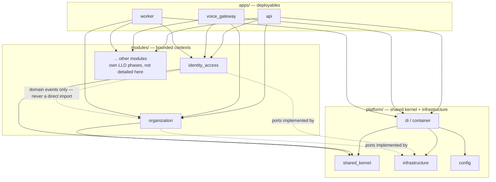
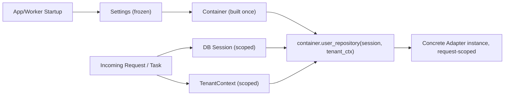
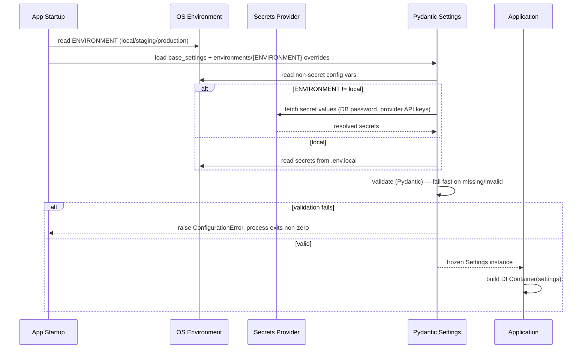
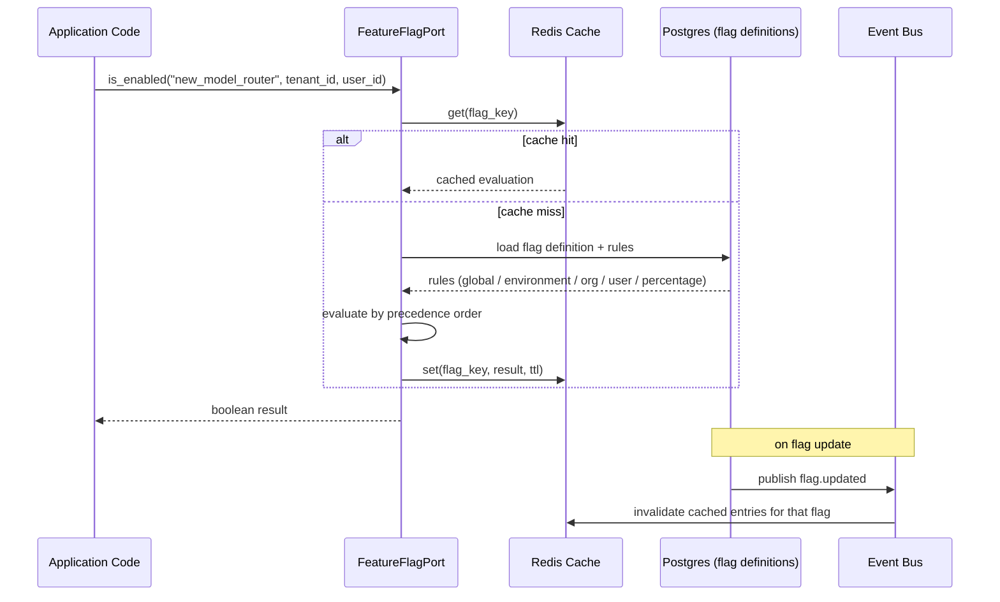
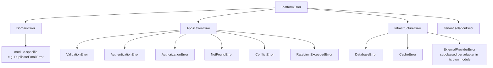
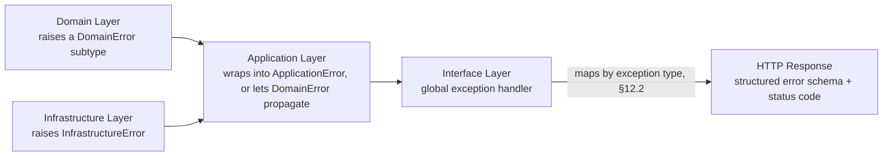

# Phase 3A — Low-Level Design: Platform Foundation

| | |
|---|---|
| **Roadmap phase** | Phase 3 (Low-Level Design) — sub-phase 3A: Platform Foundation only |
| **Status** | Draft v1.0, for review |
| **Source of truth (approved, not redesigned here)** | `Phase 1 — Software Requirements Specification`, `Phase 2 — High-Level Architecture` |
| **Explicitly out of scope for this document** | Voice Pipeline, CRM, Workflow Builder, Analytics — each gets its own LLD document per the Phase 1 roadmap table |

## 0. Scope & How to Read This Document

This document designs the **shared foundation every module and every deployable is built on top of**: folder/package structure, Clean + Hexagonal layering, the Shared Kernel, repository pattern, dependency injection, configuration/environment management, feature flags, the multi-tenant enforcement mechanism, coding/naming conventions, error hierarchy, and logging.

It does **not** design Identity & Access's full domain model, RBAC matrix, or threat model (Phase 8), the database schema (Phase 5), or the API contract (Phase 6). Where `identity_access` and `organization` modules appear below, they are **illustrative reference modules** used only to make the abstract patterns concrete — treat their entities/methods as examples of *shape*, not as final domain design.

**Traceability** — every numbered item you asked for maps to a section:

| # | Requested item | Section |
|---|---|---|
| 1 | Backend folder hierarchy | §3 |
| 2 | Frontend folder hierarchy | §4 |
| 3 | Package structure | §5 |
| 4 | Module dependency graph | §2.3 |
| 5 | Clean Architecture layers | §2.1 |
| 6 | Hexagonal Architecture layers | §2.2 |
| 7 | Repository layer | §7 |
| 8 | Dependency Injection strategy | §8 |
| 9 | Shared Kernel | §6 |
| 10 | Common utilities | §6.4 |
| 11 | Infrastructure layer | §6.3 |
| 12 | Configuration management | §9.1 |
| 13 | Environment management | §9.2 |
| 14 | Feature flag architecture | §10 |
| 15 | Multi-tenant foundation | §11 |
| 16 | Coding standards (applied) | §13.1 |
| 17 | Naming conventions | §13.2 |
| 18 | Error hierarchy | §12 |
| 19 | Logging architecture | §12.4 |
| 20 | Configuration loading | §9.3 |
| 21 | Mermaid diagrams | throughout |
| 22 | Sequence diagrams | §2.3, §9.3, §10, §11.3, §12.3 |
| 23 | Design decisions explained | inline "Why / Alternatives / Trade-off" callouts throughout |

> All code blocks in this document are **structural skeletons** (signatures, key control flow) to pin down the design — not production implementations. Full implementation is Phase 24, per `PROJECT_ROADMAP.md`.

---

## 1. Architecture Review Notes

*(Observations only — nothing below changes an approved Phase 1/2 decision. Flagged for your confirmation as this phase concretizes them.)*

1. **Event bus medium.** Phase 2 §7.7 selects Redis Streams for the domain event bus because Redis is already in the approved stack. `ARCHITECTURE_PRINCIPLES.md` scopes Redis to "caching, queues, sessions, distributed locks, websocket presence" and doesn't explicitly name "domain event bus." This document treats Streams as an extension of the "queues" use case (§6.3), but recommend an explicit confirmation land in Phase 7 (Event Architecture).
2. **Socket.IO vs. raw WebSockets.** `TECH_STACK.md` lists Socket.IO under Frontend; Phase 2 §7.13 maps the backend Realtime Voice Gateway to raw FastAPI WebSockets, not a Socket.IO server. A vanilla Socket.IO client cannot talk to a raw WebSocket server. Working assumption used here: Socket.IO on the frontend serves a **separate** channel (live dashboards/supervisor views — out of scope for this document), not the call-audio path. This needs to be pinned down explicitly by Phase 6 (API Design) / Phase 9 (Voice Pipeline).
3. **RLS enforcement mechanism.** Phase 2 §7.6/§7.8 names Postgres Row-Level Security as a tenant-isolation layer but doesn't specify how the session variable gets set. §11 of this document defines that mechanism (`SET LOCAL app.tenant_id`) — this is a foundation-phase elaboration of an already-approved decision, not a change to it.
4. **"Unlimited" vs. configurable quotas.** `PRODUCT_VISION.md` states unlimited orgs/agents/numbers/etc. as a success metric; `FR-TEN-005` requires configurable per-tenant quotas. Read together as: no platform-wide hard ceiling by default, but the mechanism to cap a given tenant (plan tiers, abuse prevention) must exist. Flagging so Phase 20 (Billing) inherits the same reading.

---

## 2. Architecture Layering (Applied)

### 2.1 Clean Architecture Layers

Every bounded-context module (`modules/<name>/`) is internally split into four layers. The Dependency Rule is absolute: **arrows point inward, only**. Domain imports nothing else in the module; Infrastructure and Interface both depend on Application/Domain, never the reverse.



**Why this split:** `ARCHITECTURE_PRINCIPLES.md` mandates business logic stay independent of frameworks, databases, vendors, APIs, and cloud providers. Clean Architecture's Dependency Rule is the concrete mechanism that guarantees it — Domain code literally cannot import SQLAlchemy or FastAPI, so it's physically impossible to leak a framework concern into a business rule.

**Alternative considered:** a conventional 3-tier split (Controller → Service → Repository) with no explicit Domain layer. **Rejected** because "Service" layers in that pattern typically absorb both business rules and orchestration, which is exactly the "God class" anti-pattern `CODING_STANDARDS.md` warns against, and it gives frameworks a way to leak in (e.g., an ORM model used directly as the "domain object").

**Trade-off accepted:** more files and more explicit mapping code (ORM model ↔ domain entity) per module than a thinner architecture would need. Justified because `PROMPT_GUIDELINES.md` explicitly asks for a 10-year, 100-engineer-maintained codebase — the mapping boilerplate is a one-time cost per module; the coupling it prevents is a compounding cost if skipped.

### 2.2 Hexagonal Architecture (Ports & Adapters)

Layered on top of Clean Architecture: the **Application layer defines Ports** (interfaces) for everything that crosses a boundary — persistence, messaging, external providers. The **Infrastructure layer supplies Adapters** implementing those ports. "Driving" adapters call *into* the core; "driven" adapters are called *by* the core.



**Why:** this is the mechanism behind Phase 2's Provider Independence requirement. Swapping Deepgram for Gladia, or Exotel for Twilio, later, means writing a new adapter behind an existing port — zero changes to any use case. It's also what makes the module boundary an eventual service-extraction seam (Phase 2 §7.1's "extract later" plan): a module's port set *is* the API its future standalone service would expose.

**Alternative considered:** letting use cases call vendor SDKs directly, with a thin wrapper for testing only. **Rejected** — this is precisely what `ARCHITECTURE_PRINCIPLES.md` "Provider Independence" forbids, and it would make Phase 2's modular-monolith-to-microservices path a rewrite rather than an extraction.

### 2.3 Module Dependency Graph



**Rule enforced (not just documented):** `modules/*` may depend on `platform/*` freely, but **never on another `modules/*` directly**. Cross-module communication happens only via domain events published to the event bus (Phase 2 §7.7) or, for synchronous needs, via a narrow published interface placed in `platform/shared_kernel` (not the other module's internals). This is enforced in CI by `scripts/check_module_boundaries.py`, an `import-linter` contract run on every PR — a broken boundary fails the build, it doesn't rely on code review catching it.

**Why enforce mechanically, not just by convention:** `CODING_STANDARDS.md` says "avoid tightly coupled modules" and `ARCHITECTURE_PRINCIPLES.md` repeats it as a top-level principle. On a 100-engineer codebase, an unenforced convention decays within a quarter. A CI gate doesn't.

---

## 3. Backend Folder Hierarchy

```text
backend/
├── pyproject.toml                       # root workspace: ruff, mypy, pytest config, workspace members
├── uv.lock                              # single lockfile — see §5 for package-management rationale
├── alembic.ini
├── docker/
│   ├── api.Dockerfile
│   ├── voice_gateway.Dockerfile
│   └── worker.Dockerfile
│
├── apps/                                # deployable units (Phase 2 §7.1: modular monolith, few deployables)
│   ├── api/                             # Core REST API deployable
│   │   ├── main.py                      # FastAPI app factory
│   │   ├── asgi.py                      # uvicorn/gunicorn entrypoint
│   │   ├── router_registry.py           # aggregates every module's interface/rest router
│   │   ├── middleware/
│   │   │   ├── tenant_resolution.py     # see §11.2
│   │   │   ├── correlation_id.py
│   │   │   ├── rate_limit.py
│   │   │   └── error_handler.py         # global exception -> HTTP mapping, see §12.3
│   │   ├── dependencies/
│   │   │   ├── auth.py                  # FastAPI Depends() wrappers over the DI container
│   │   │   └── db_session.py
│   │   └── settings.py                  # api-specific Settings(BaseSettings)
│   │
│   ├── voice_gateway/                   # Realtime Voice Gateway deployable (internals: Phase 9)
│   │   ├── main.py
│   │   ├── ws/
│   │   │   ├── connection_manager.py
│   │   │   └── session_router.py
│   │   ├── middleware/
│   │   │   └── tenant_resolution.py     # duplicated per-app deliberately, see note below
│   │   └── settings.py
│   │
│   └── worker/                          # Celery + APScheduler deployable
│       ├── celery_app.py
│       ├── scheduler.py                 # APScheduler bootstrap (job logic lives in owning modules)
│       ├── task_registry.py             # aggregates each module's application/tasks
│       └── settings.py
│
├── modules/                             # bounded-context modules (DDD, Phase 2 §7.4)
│   ├── identity_access/                 # ILLUSTRATIVE reference module — full design is Phase 8
│   │   ├── domain/
│   │   │   ├── entities.py              # User, ApiKey (AggregateRoot)
│   │   │   ├── value_objects.py         # EmailAddress, HashedPassword, Role
│   │   │   ├── events.py                # UserRegistered, ApiKeyRevoked
│   │   │   ├── exceptions.py            # module DomainError subclasses
│   │   │   └── services.py              # pure business-rule domain services
│   │   ├── application/
│   │   │   ├── use_cases/
│   │   │   │   ├── register_user.py
│   │   │   │   ├── authenticate_user.py
│   │   │   │   └── issue_api_key.py
│   │   │   ├── ports/
│   │   │   │   ├── user_repository.py
│   │   │   │   ├── password_hasher.py
│   │   │   │   └── token_issuer.py
│   │   │   └── dto.py
│   │   ├── infrastructure/
│   │   │   ├── models.py                # SQLAlchemy ORM models
│   │   │   ├── mappers.py               # ORM <-> domain entity mapping
│   │   │   ├── repositories/
│   │   │   │   └── sqlalchemy_user_repository.py
│   │   │   └── adapters/
│   │   │       ├── argon2_password_hasher.py   # example adapter — algorithm TBD Phase 8
│   │   │       └── jwt_token_issuer.py
│   │   └── interface/
│   │       ├── rest/
│   │       │   ├── router.py
│   │       │   └── schemas.py
│   │       └── events/
│   │           └── subscribers.py       # e.g. reacts to organization.created
│   │
│   ├── organization/                    # ILLUSTRATIVE reference module — multi-tenant foundation example
│   │   ├── domain/
│   │   │   ├── entities.py              # Organization (AggregateRoot), Quota (Entity)
│   │   │   ├── value_objects.py         # TenantId, PlanTier
│   │   │   ├── events.py                # OrganizationCreated, QuotaExceeded
│   │   │   └── exceptions.py
│   │   ├── application/
│   │   │   ├── use_cases/create_organization.py
│   │   │   └── ports/organization_repository.py
│   │   ├── infrastructure/
│   │   │   ├── models.py
│   │   │   └── repositories/sqlalchemy_organization_repository.py
│   │   └── interface/rest/router.py
│   │
│   ├── _module_template/                # scaffold used by scripts/new_module.py
│   │   ├── domain/__init__.py
│   │   ├── application/__init__.py
│   │   ├── infrastructure/__init__.py
│   │   └── interface/__init__.py
│   │
│   └── RESERVED — folder created, contents designed in their own LLD phase, not detailed here:
│       agent_configuration/  prompt_management/   conversation_memory/  model_router/
│       tool_calling/         knowledge_base/       crm/                  campaign_engine/
│       workflow_engine/      voice_orchestration/  analytics/            billing/
│       webhooks/             plugin_runtime/        admin_control_plane/
│
├── platform/                            # Shared Kernel + cross-cutting infrastructure — this doc's core deliverable
│   ├── shared_kernel/
│   │   ├── domain/
│   │   │   ├── entity.py                # Entity, AggregateRoot base classes
│   │   │   ├── value_object.py          # ValueObject base (frozen, value equality)
│   │   │   ├── domain_event.py          # DomainEvent base + envelope
│   │   │   └── specification.py         # Specification pattern base
│   │   ├── application/
│   │   │   ├── use_case.py              # UseCase[TRequest, TResponse] base
│   │   │   ├── result.py                # Result/Either type, see §7.3
│   │   │   └── unit_of_work.py          # UnitOfWork port
│   │   ├── tenancy/
│   │   │   ├── tenant_context.py        # contextvar-based TenantContext, see §11.1
│   │   │   └── tenant_id.py
│   │   ├── errors/
│   │   │   ├── base.py                  # PlatformError root, see §12
│   │   │   ├── domain_errors.py
│   │   │   ├── application_errors.py
│   │   │   └── infrastructure_errors.py
│   │   └── types/
│   │       ├── email.py
│   │       ├── phone_number.py
│   │       └── money.py
│   │
│   ├── infrastructure/
│   │   ├── db/
│   │   │   ├── engine.py                # async SQLAlchemy engine factory
│   │   │   ├── session.py               # session factory + tenant-scoped context manager
│   │   │   ├── base_repository.py       # generic tenant-scoped repository base, see §7
│   │   │   └── rls.py                   # SET LOCAL app.tenant_id per transaction, see §11.2
│   │   ├── cache/
│   │   │   └── redis_client.py          # namespaced Redis client wrapper
│   │   ├── eventbus/
│   │   │   ├── publisher.py             # Redis Streams publisher + outbox writer
│   │   │   ├── consumer.py              # Redis Streams consumer-group base
│   │   │   └── outbox.py                # transactional outbox access
│   │   ├── secrets/
│   │   │   ├── secrets_provider.py      # port
│   │   │   ├── env_secrets_provider.py  # local/dev adapter
│   │   │   └── cloud_secrets_provider.py# staging/prod adapter
│   │   ├── observability/
│   │   │   ├── logging.py               # structured logging config, see §12.4
│   │   │   ├── tracing.py               # OpenTelemetry SDK init
│   │   │   └── metrics.py               # Prometheus client wiring
│   │   └── featureflags/
│   │       ├── feature_flag_port.py
│   │       ├── feature_flag_service.py  # evaluation engine, see §10
│   │       └── postgres_redis_flag_provider.py
│   │
│   ├── config/
│   │   ├── base_settings.py             # shared Pydantic BaseSettings
│   │   ├── environments/
│   │   │   ├── local.py
│   │   │   ├── staging.py
│   │   │   └── production.py
│   │   └── loader.py                    # env resolution + fail-fast validation, see §9.3
│   │
│   ├── di/
│   │   └── container.py                 # composition root, see §8
│   │
│   └── utils/                           # narrowly-scoped, single-purpose files only — see §13.2
│       ├── id_generator.py              # UUIDv7/ULID generation, see §6.4
│       ├── clock.py                     # Clock port + system/fake implementations
│       ├── pagination.py
│       └── retry.py                     # backoff/retry decorator
│
├── migrations/versions/                 # Alembic — schema detail is Phase 5
├── tests/
│   ├── unit/                            # mirrors modules/ and platform/
│   ├── integration/
│   ├── contract/                        # e.g. tenant-isolation contract tests, see §11.4
│   └── conftest.py
└── scripts/
    ├── new_module.py                    # scaffolds a module from _module_template
    └── check_module_boundaries.py       # import-linter contract runner (CI gate)
```

**Why `apps/voice_gateway/middleware/tenant_resolution.py` duplicates logic that also lives in `apps/api`:** each deployable resolves tenant context from a different transport (HTTP headers/JWT for the API, a call-setup payload for the Voice Gateway), so the *resolution* logic is necessarily app-specific — but both call the same `platform/shared_kernel/tenancy` primitives underneath, so only the "how do I extract a tenant_id from this transport" sliver is duplicated, not the enforcement mechanism itself.

---

## 4. Frontend Folder Hierarchy

```text
frontend/
├── pnpm-workspace.yaml
├── turbo.json
├── package.json                          # root workspace
├── tsconfig.base.json
├── .eslintrc.cjs
│
├── apps/
│   └── web/                              # Next.js Admin Console — the one deployable UI (Phase 2 §7.13)
│       ├── package.json
│       ├── next.config.ts
│       ├── middleware.ts                 # edge-level tenant/auth resolution
│       ├── app/
│       │   ├── layout.tsx
│       │   ├── providers.tsx             # TanStack Query, Zustand, theme providers
│       │   ├── globals.css
│       │   ├── (public)/
│       │   │   ├── login/page.tsx
│       │   │   └── signup/page.tsx
│       │   ├── (dashboard)/
│       │   │   ├── layout.tsx            # role-aware nav shell
│       │   │   ├── page.tsx              # org home
│       │   │   ├── organization/
│       │   │   │   ├── settings/page.tsx
│       │   │   │   ├── users/page.tsx
│       │   │   │   └── api-keys/page.tsx
│       │   │   ├── agents/
│       │   │   │   ├── page.tsx
│       │   │   │   └── [agentId]/page.tsx
│       │   │   ├── feature-flags/page.tsx   # foundation-level admin surface only
│       │   │   └── RESERVED/               # voice, crm, campaigns, workflows, analytics
│       │   │                                # routes — own phases, not detailed here
│       │   └── admin/                    # Platform Super Admin console (cross-tenant)
│       │       ├── layout.tsx
│       │       └── organizations/page.tsx
│       ├── features/                      # feature-sliced, mirrors backend bounded contexts
│       │   ├── identity-access/
│       │   │   ├── api/                   # TanStack Query hooks over packages/api-client
│       │   │   ├── components/
│       │   │   └── stores/
│       │   └── organization/
│       │       ├── api/
│       │       ├── components/
│       │       └── stores/
│       ├── components/                    # app-specific shared components
│       ├── lib/
│       │   ├── tenant-context.ts
│       │   └── query-client.ts
│       ├── hooks/
│       └── public/
│
├── packages/
│   ├── ui/                                # Shadcn-based shared component library
│   │   ├── package.json
│   │   └── src/
│   ├── api-client/                        # typed client generated from the OpenAPI spec (Phase 6)
│   │   ├── package.json
│   │   └── src/
│   │       ├── generated/                 # openapi-typescript output — never hand-edited
│   │       └── client.ts                  # TanStack Query-friendly wrapper
│   ├── types/                             # hand-maintained cross-cutting TS types
│   ├── config/                            # shared eslint/tsconfig/tailwind presets
│   └── feature-flags/                     # thin client mirroring the backend FeatureFlagPort
│
└── e2e/                                   # Playwright E2E tests spanning apps/web
```

**Why feature-sliced (`features/identity-access/`) rather than type-sliced (`components/`, `hooks/`, `stores/` at the root holding everything):** mirrors the backend's bounded-context split, so a change to one domain (e.g., Organization) touches one feature folder on both sides of the stack, not a scattered set of files across generic buckets — directly serving `CODING_STANDARDS.md`'s "Single Responsibility" at the folder level, and making it obvious where new domain UI belongs as more modules (CRM, Campaigns, Workflows...) land in later phases.

---

## 5. Package & Dependency Management Strategy

**Backend — single repository, single lockfile, multiple deployables.** Phase 2 §7.1 chose a modular monolith over microservices specifically to avoid multi-repo coordination overhead before there's load to justify it. Packaging should mirror that: one `pyproject.toml` at the repo root, one lockfile (`uv.lock`), workspace members for `apps/api`, `apps/voice_gateway`, `apps/worker`. Each app's Docker image installs only the dependency groups it needs (e.g., `voice_gateway` doesn't need Celery; `worker` doesn't need FastAPI's ASGI server), keeping images slim without splitting the repo.

> **Requires sign-off — not in `TECH_STACK.md`.** The specific package manager (`uv`, workspace-capable and fast) is a build-tooling choice, not a new runtime dependency, but per `ARCHITECTURE_PRINCIPLES.md` §"Design and Implementation Constraints," anything outside the approved stack needs explicit confirmation. Poetry is a viable alternative if preferred; the folder/module design in this document doesn't depend on which one is chosen.

| Alternative | Why not chosen |
|---|---|
| One pip package per module, published internally | Reintroduces versioning/release coordination overhead across 15+ modules before any module has demonstrated it needs independent release cadence — contradicts the "modular monolith first" decision. |
| Multiple repos (one per app) | Same reasoning as Phase 2 §7.1's microservices rejection: coordination cost up front, no current load that requires it. |

**Frontend — pnpm workspaces + Turborepo.** Enables `apps/web` and `packages/ui` / `packages/api-client` to share code with a single install and incremental, cacheable builds — relevant given `PROMPT_GUIDELINES.md`'s 100-engineer, 10-year framing, where CI time compounds into real cost quickly.

> **Requires sign-off — not in `TECH_STACK.md`.** Same caveat as above: pnpm/Turborepo are workspace tooling, not new product dependencies, but are additions to the approved list and should be explicitly confirmed alongside `import-linter` (Python module-boundary enforcement) and `structlog` (structured logging, §12.4).

**Import path convention:**
```python
from platform.shared_kernel.domain import AggregateRoot
from platform.shared_kernel.tenancy import TenantContext
from modules.identity_access.application.use_cases import RegisterUserUseCase
```
```ts
import { Button } from "@platform/ui";
import { useOrganization } from "@platform/api-client";
```

---

## 6. Shared Kernel, Infrastructure Layer, Common Utilities

### 6.1 Shared Kernel — What Belongs Here (and What Doesn't)

The Shared Kernel (`platform/shared_kernel/`) holds only concepts that are **genuinely universal across every bounded context** and **stable** — DDD's own definition of a Shared Kernel warns that anything placed here becomes hard to change later because every module depends on it, so the bar for inclusion is deliberately high.

| Belongs in Shared Kernel | Does not belong |
|---|---|
| `Entity`, `AggregateRoot`, `ValueObject` base classes | Any concrete domain entity (`User`, `Organization` live in their own modules) |
| `DomainEvent` base + envelope | Concrete event payloads (`UserRegistered` lives in `identity_access`) |
| `TenantId`, `TenantContext` | Org-specific business rules (quota logic lives in `organization`) |
| `Result`/`Either`, `UseCase` base, `UnitOfWork` port | Any specific use case |
| `Email`, `PhoneNumber`, `Money` value objects (used by 3+ modules) | A value object only one module needs — keep it local until reuse is proven |
| `PlatformError` root + layer-level subclasses | Module-specific exception subclasses |

**Why guard the boundary this tightly:** `CODING_STANDARDS.md` explicitly warns against "God classes." A Shared Kernel with no admission criteria becomes a god-*module* — the same anti-pattern at folder scope. The rule applied here: a type only moves into the Shared Kernel once at least two unrelated modules need it identically; until then it stays local and gets promoted later (a mechanical, low-risk move given the layering in §2).

### 6.2 Shared Kernel — Core Type Skeletons

```python
# platform/shared_kernel/domain/entity.py
class Entity:
    def __init__(self, id: EntityId) -> None:
        self.id = id
    def __eq__(self, other: object) -> bool:
        return isinstance(other, Entity) and self.id == other.id

class AggregateRoot(Entity):
    def __init__(self, id: EntityId) -> None:
        super().__init__(id)
        self._domain_events: list[DomainEvent] = []
    def record_event(self, event: "DomainEvent") -> None:
        self._domain_events.append(event)
    def pull_events(self) -> list["DomainEvent"]:
        events, self._domain_events = self._domain_events, []
        return events
```

```python
# platform/shared_kernel/application/result.py
@dataclass(frozen=True)
class Result(Generic[T, E]):
    _value: T | None
    _error: E | None
    @staticmethod
    def ok(value: T) -> "Result[T, E]": ...
    @staticmethod
    def fail(error: E) -> "Result[T, E]": ...
    def is_ok(self) -> bool: ...
    def unwrap(self) -> T: ...          # raises if called on a failure
    def unwrap_error(self) -> E: ...
```

**Why a `Result` type in Application, alongside real exceptions in Infrastructure/Domain:** `CODING_STANDARDS.md` requires functions be "deterministic" and "testable," and forbids swallowing exceptions. Expected business outcomes (e.g., "email already registered") are not exceptional — they're a normal branch a caller must handle — so representing them as a typed `Result` failure keeps that branch visible in the function signature and in tests, rather than hidden in a `try/except`. True exceptions (`InfrastructureError`, unrecoverable `DomainError`) stay exceptions, because a database timeout genuinely is exceptional. At the Interface layer boundary, both paths converge on the same exception→HTTP mapping (§12.3), so callers of the API never see the internal distinction.

**Alternative considered:** exceptions-only, "ask forgiveness" style throughout. **Rejected** as the sole mechanism because it makes expected-failure paths invisible at the call site and in type signatures, which works against `CODING_STANDARDS.md`'s testability requirement. **Trade-off accepted:** slightly more ceremony (`Result.fail(...)` vs. `raise`) for use-case-level expected failures.

### 6.3 Infrastructure Layer

| Component | Responsibility | Adapter for |
|---|---|---|
| `db/engine.py`, `db/session.py` | Async SQLAlchemy engine + session factory, one session per request/task | Postgres |
| `db/base_repository.py` | Generic CRUD with tenant filtering baked in | — (base for all module repositories, §7) |
| `db/rls.py` | Sets the Postgres session variable RLS policies key off | Postgres RLS (§11.2) |
| `cache/redis_client.py` | Namespaced wrapper (`tenant:{id}:...` key prefixing) | Redis (cache/session use cases) |
| `eventbus/publisher.py`, `consumer.py`, `outbox.py` | Transactional outbox write + Streams publish; consumer-group base for subscribers | Redis Streams (domain events) |
| `secrets/*` | `SecretsProvider` port; env-based adapter for local dev, cloud secret manager adapter for staging/prod | Secret storage |
| `observability/*` | Structured logging, OpenTelemetry tracing, Prometheus metrics setup | Prometheus / Grafana / OpenTelemetry (already approved) |
| `featureflags/*` | Flag evaluation engine + Postgres/Redis-backed provider | Feature flag storage (§10) |

**Why Redis is accessed only through a single namespaced wrapper, never directly:** `ARCHITECTURE_PRINCIPLES.md` scopes Redis to five specific uses (cache, queues, sessions, locks, presence). A single adapter is where key-prefix-per-usage (`cache:`, `session:`, `lock:`, `presence:`, `stream:`) is enforced mechanically, so a future engineer can't accidentally use Redis as a system of record — the wrapper's API surface simply doesn't expose an unscoped `SET` without a namespace.

### 6.4 Common Utilities

Deliberately small, and every file is single-purpose — a direct response to `CODING_STANDARDS.md`'s explicit "Bad: Helper, Manager, Util, Temp" naming guidance. `utils/` here is a *folder* (organizational), not a class name; each file inside does exactly one thing.

| File | Purpose | Why |
|---|---|---|
| `id_generator.py` | Generates UUIDv7/ULID primary keys | At "millions of calls" scale (`NFR-SCALE-001`), random UUIDv4 primary keys fragment B-tree indexes badly on high-insert tables (calls, events, transcripts). UUIDv7/ULID are time-sortable, keeping inserts index-friendly while remaining globally unique across tenants — chosen over auto-increment integers specifically because integers leak row-count/sequence information across a multi-tenant system and complicate sharding later. |
| `clock.py` | `Clock` port + `SystemClock`/`FixedClock` adapters | `CODING_STANDARDS.md` requires deterministic, testable functions; anything that calls `datetime.now()` directly can't be tested deterministically. All time reads go through this port. |
| `pagination.py` | Cursor-based pagination helper | Offset pagination degrades at scale on large tables; cursor-based (keyed on the sortable ID above) stays O(1) regardless of offset depth. |
| `retry.py` | Backoff/retry decorator for transient infrastructure failures | Centralizes retry policy so every external-provider adapter doesn't reinvent it — supports `NFR-AVAIL-002` (automatic provider failover). |

---

## 7. Repository Layer

**Rule:** only Aggregate Roots get a repository (standard DDD constraint) — child entities are only ever reached through their aggregate root, never loaded independently. This keeps transactional consistency boundaries explicit and prevents the "load anything from anywhere" pattern that erodes aggregate invariants over time.

```python
# platform/infrastructure/db/base_repository.py
class TenantScopedRepository(Generic[TAggregate]):
    def __init__(self, session: AsyncSession, tenant_context: TenantContext) -> None:
        self._session = session
        self._tenant_id = tenant_context.tenant_id     # never optional — see §11.1

    async def _scoped(self, stmt: Select) -> Select:
        return stmt.where(self.model.tenant_id == self._tenant_id)
```

```python
# modules/identity_access/application/ports/user_repository.py   (the PORT)
class UserRepository(Protocol):
    async def get_by_id(self, user_id: UserId) -> User | None: ...
    async def get_by_email(self, email: EmailAddress) -> User | None: ...
    async def save(self, user: User) -> None: ...
```

```python
# modules/identity_access/infrastructure/repositories/sqlalchemy_user_repository.py   (the ADAPTER)
class SqlAlchemyUserRepository(TenantScopedRepository[User], UserRepository):
    model = UserModel
    async def get_by_email(self, email: EmailAddress) -> User | None:
        stmt = await self._scoped(select(UserModel).where(UserModel.email == str(email)))
        row = (await self._session.execute(stmt)).scalar_one_or_none()
        return _to_domain(row) if row else None
    async def save(self, user: User) -> None:
        self._session.add(_to_model(user))
```

**Why tenant scoping lives in the base class, not repeated per repository:** repeating `WHERE tenant_id = ...` by hand in every query method is exactly the kind of thing that gets forgotten once, on one query, by one engineer, on a 100-engineer team — and a forgotten tenant filter is a cross-tenant data leak (`NFR-SEC-003`). Baking it into `TenantScopedRepository._scoped()` makes the *safe* path the *only* path; combined with Postgres RLS (§11.2) as a second, database-enforced layer, a single missed filter is not sufficient to leak data.

**Why the port is a `Protocol`, not an ABC:** structural typing keeps test doubles trivial to write (any object with matching methods satisfies the port, no inheritance required) and avoids Python ABC's metaclass friction — consistent with `CODING_STANDARDS.md`'s KISS guidance.

---

## 8. Dependency Injection Strategy

**Two mechanisms, one composition root:**

1. **FastAPI's native `Depends()`** for the `apps/api` request lifecycle — it's already provided by the framework, request-scoped by default, and sufficient for HTTP-triggered use cases. No need to add a heavier DI framework on top for this path.
2. **A small composition root** (`platform/di/container.py`) for everywhere `Depends()` doesn't apply — Celery tasks, the Voice Gateway's WebSocket handlers, APScheduler jobs — which wires each Port to its concrete Adapter once, based on the loaded `Settings` (§9).

```python
# platform/di/container.py
class Container:
    def __init__(self, settings: Settings) -> None:
        self._settings = settings

    def user_repository(self, session: AsyncSession, tenant_ctx: TenantContext) -> UserRepository:
        return SqlAlchemyUserRepository(session, tenant_ctx)

    def event_publisher(self) -> EventPublisher:
        return RedisStreamsPublisher(self._redis_client())

    def feature_flag_port(self) -> FeatureFlagPort:
        return PostgresRedisFeatureFlagProvider(self._redis_client(), self._settings)
```

```python
# apps/api/dependencies/auth.py — FastAPI-layer glue over the same container
def get_user_repository(
    session: AsyncSession = Depends(get_db_session),
    tenant_ctx: TenantContext = Depends(get_tenant_context),
    container: Container = Depends(get_container),
) -> UserRepository:
    return container.user_repository(session, tenant_ctx)
```

**Why not a full DI framework (e.g. `dependency-injector`, `punq`) everywhere:** `CODING_STANDARDS.md`'s KISS principle — FastAPI's `Depends()` already solves 80% of the wiring (the HTTP path, which is the majority of call sites), and the remaining 20% (workers, WebSocket handlers) is a handful of factory methods on one class. Adding a second DI framework on top of FastAPI's own would mean two different wiring idioms in one codebase for marginal benefit at current scale. **Revisit trigger:** if `Container` grows past roughly 30–40 factory methods or wiring conditionals become deeply nested, switch to a framework — noted here explicitly so it's a deliberate future decision, not scope creep now.

**Why one `Container` per process, not per-request:** the container itself is stateless (it only holds `Settings` and knows how to build things); the objects it *builds* are request/task-scoped (a `session` and `tenant_ctx` are passed in, not held by the container). This keeps the container safe to build once at process startup and reuse across every request/task, satisfying the stateless-services principle (`ARCHITECTURE_PRINCIPLES.md`) at the DI layer too.



---

## 9. Configuration, Environment & Loading

### 9.1 Configuration Management

Every app (`api`, `voice_gateway`, `worker`) has its own `Settings(BaseSettings)` class composing a shared `platform/config/base_settings.py`. Config values are grouped by concern (database, redis, secrets provider, observability, feature flags), each concern's block reusable across apps.

```python
# platform/config/base_settings.py
class BaseAppSettings(BaseSettings):
    environment: Literal["local", "staging", "production"]
    database: DatabaseSettings
    redis: RedisSettings
    observability: ObservabilitySettings
    model_config = SettingsConfigDict(env_nested_delimiter="__", frozen=True)
```

**Why `frozen=True`:** configuration is read once at startup and never mutated afterward — a mutable, globally-reachable settings object is a common source of "which value was actually in effect when this bug happened" debugging pain. Freezing makes accidental runtime mutation a type error, not a 2am incident.

### 9.2 Environment Management

| Environment | Purpose | Secrets source |
|---|---|---|
| `local` | Developer machines, docker-compose | `.env.local` (git-ignored, never committed — per `CODING_STANDARDS.md` "Never hardcode credentials") |
| `staging` | Pre-production, mirrors prod topology at smaller scale | Cloud secret manager |
| `production` | Live tenants | Cloud secret manager, stricter access control |

`ENVIRONMENT` is the single source of truth for which behavior applies — read once at process start, never re-evaluated mid-process (reinforces the frozen-settings decision above).

### 9.3 Configuration Loading — Order & Fail-Fast



**Why fail-fast at startup rather than lazily on first use:** a misconfigured secret discovered on the first live phone call (rather than at deploy time) is exactly the kind of failure the `NFR-AVAIL-001` voice-path availability target can't absorb. Validating every required setting before the process accepts any traffic converts a runtime incident into a failed deployment — caught in CI/CD, not in production.

---

## 10. Feature Flag Architecture

Satisfies `FR-FLAG-001` (organization/user/environment scope, percentage rollout). Built as a platform-foundation service because nearly every module will eventually gate behavior behind a flag (e.g., a new Model Router strategy, a new workflow node type) — it doesn't belong to any single bounded context.

**Storage:** flag definitions and rules in Postgres (`feature_flags`, `feature_flag_rules` — full schema is Phase 5); evaluated results cached in Redis for hot-path reads.

**Precedence order (most specific wins):** `user override → organization override → environment default → global default`.



**Why cache-then-invalidate-on-write rather than always reading the DB:** flag checks sit on hot paths (potentially every call setup, every workflow node evaluation later). Reading Postgres on every check would add latency exactly where `NFR-PERF-001` (sub-800ms voice response) can least afford it. Invalidating via the event bus on write keeps staleness bounded to the time between a flag change and its event being consumed — acceptable for a feature flag, unacceptable for a payment amount.

**Out of scope here:** the full flag-management CRUD API and admin UI belong to the Admin Control Plane module; this section designs only the evaluation engine every module will call.

---

## 11. Multi-Tenant Foundation

### 11.1 TenantContext

```python
# platform/shared_kernel/tenancy/tenant_context.py
_current_tenant: ContextVar[TenantId | None] = ContextVar("current_tenant", default=None)

class TenantContext:
    @staticmethod
    def set(tenant_id: TenantId) -> None:
        _current_tenant.set(tenant_id)
    @property
    def tenant_id(self) -> TenantId:
        tid = _current_tenant.get()
        if tid is None:
            raise TenantIsolationError("No tenant context set for this operation")
        return tid
```

**Why a `contextvar`, not a thread-local or a function parameter threaded through every call:** AsyncIO (the approved async runtime) doesn't guarantee one thread per request, so thread-locals are unsafe here; `contextvar` is asyncio-aware and correctly isolated per concurrent request/task. Threading `tenant_id` through every function signature by hand was considered and rejected — it's mechanically safer but adds a parameter to nearly every function in the codebase, which `CODING_STANDARDS.md`'s KISS principle argues against once a safe implicit mechanism exists. The `TenantContext.tenant_id` property raising rather than returning `None` when unset is deliberate: **an operation that forgot to set tenant context fails loudly, immediately, instead of silently running unscoped.**

### 11.2 Enforcement at Every Layer (concrete mechanisms)

| Layer | Mechanism |
|---|---|
| API / Voice Gateway | Middleware resolves `tenant_id` from JWT/API key (API) or call-setup payload (Voice Gateway), calls `TenantContext.set()` before any handler runs. |
| Application | Every use case receives tenant implicitly via `TenantContext`, never as an optional parameter — enforced by the repository requiring it at construction (§7). |
| Database | Two layers: (a) app-layer `WHERE tenant_id = ...` baked into `TenantScopedRepository`; (b) Postgres RLS policy per table, keyed off a session variable set by `db/rls.py` at the start of every transaction: `SET LOCAL app.tenant_id = '<tenant_id>'`. |
| Cache | Redis keys namespaced `tenant:{id}:...` by the wrapper in §6.3 — no call site can construct an unnamespaced key. |
| Storage | Object paths namespaced `org/{id}/...`. |
| Events | Every event envelope (`DomainEvent` base, §6.1) carries `tenant_id`; consumers must filter/authorize by it before acting. |

```mermaid
sequenceDiagram
    participant Client
    participant MW as Tenant Resolution Middleware
    participant CTX as TenantContext
    participant DB as DB Session
    participant RLS as Postgres RLS
    participant UC as Use Case
    participant Repo as Tenant-Scoped Repository

    Client->>MW: request (JWT / API key)
    MW->>MW: resolve tenant_id from token
    MW->>CTX: set(tenant_id)
    MW->>DB: acquire session for this request
    DB->>RLS: BEGIN; SET LOCAL app.tenant_id = :tenant_id
    MW->>UC: invoke use case
    UC->>Repo: find/save(...)
    Repo->>Repo: WHERE tenant_id = CTX.tenant_id  (app layer)
    Repo->>RLS: query executes under RLS policy (db layer)
    RLS-->>Repo: rows — only this tenant's, enforced twice
    Repo-->>UC: domain entities
    UC-->>Client: response
```

**Why enforce it twice (app-layer filter *and* RLS), not just once:** this is defense-in-depth specifically because a cross-tenant leak is one of the few classes of bug in this system severe enough to warrant redundancy that would otherwise look like over-engineering. A single missed `WHERE` clause (app layer) is caught by RLS; a misconfigured or missing RLS policy on a new table (db layer) is still caught by the app-layer filter. Both would have to fail on the same table, at the same time, for a leak to occur.

### 11.3 Break-Glass Access (`FR-TEN-004`)

Platform Super Admin cross-tenant access does not bypass `TenantContext` — it explicitly sets it to the target tenant for the duration of the operation, and that act is itself an audited event (`admin.tenant_access.granted`) distinct from ordinary tenant-scoped audit entries, satisfying `NFR-SEC-004` and the "audited" requirement in `FR-TEN-004` without needing a separate code path that skips isolation.

### 11.4 Testing the Guarantee

A dedicated contract test suite (`tests/contract/tenant_isolation/`) asserts, for every repository, that a query executed under Tenant A's context returns zero rows belonging to Tenant B — run in CI against every new repository as a required check, not a manual review item. This operationalizes `ARCHITECTURE_PRINCIPLES.md`'s "Tenant isolation is enforced at every layer" as something CI verifies rather than something a human has to remember to check.

---

## 12. Error Hierarchy & Handling

### 12.1 Hierarchy



```python
# platform/shared_kernel/errors/base.py
class PlatformError(Exception):
    code: str                     # stable, machine-readable (e.g. "duplicate_email")
    def __init__(self, message: str, *, context: dict[str, Any] | None = None) -> None:
        super().__init__(message)
        self.context = context or {}   # structured, goes straight into logs — never into the client response
```

**Why every exception carries a `context` dict:** `CODING_STANDARDS.md` requires "structured logging" and "meaningful errors." A bare exception message forces whoever debugs an incident to reconstruct context from surrounding log lines; attaching structured context (e.g., `{"user_id": ..., "attempted_email": ...}`) at the point of failure makes the error self-contained in logs — while `context` is explicitly never serialized into the client-facing response (§12.3), avoiding information disclosure (OWASP).

### 12.2 Exception → HTTP Mapping

| Exception | Layer | HTTP Status | Notes |
|---|---|---|---|
| `ValidationError` | Application | 400 | Input failed use-case validation |
| `AuthenticationError` | Application | 401 | |
| `AuthorizationError` | Application | 403 | |
| `NotFoundError` | Application | 404 | |
| `ConflictError` | Application | 409 | e.g. duplicate email |
| `DomainError` (generic/unmapped subclass) | Domain | 422 | Business-rule violation not otherwise categorized |
| `TenantIsolationError` | Shared Kernel / security-critical | 403 + alert | Always logged at CRITICAL; triggers a security alert, never just a 4xx |
| `RateLimitExceededError` | Application | 429 | |
| `ExternalProviderError` | Infrastructure | 502 / 503 | Wrapped — raw provider error text never reaches the client |
| `InfrastructureError` (generic/unmapped) | Infrastructure | 500 | Full context logged; client receives a generic message only |

### 12.3 Propagation Flow



**Why never swallow, and never let a raw exception reach the client:** `CODING_STANDARDS.md` explicitly forbids swallowing exceptions; OWASP guidance (`NFR-SEC-008`) forbids leaking stack traces or internal details. The global exception handler in `apps/*/middleware/error_handler.py` is the single place both rules are enforced — every exception is caught once, logged with full `context`, and translated into the minimal structured response the mapping table defines. No handler downstream of it is allowed to `except Exception: pass`.

### 12.4 Logging Architecture

- **Format:** structured JSON via `structlog`, one processor pipeline shared by every app.
- **Correlation:** a `correlation_id` (= request ID for API calls, call/session ID for voice) is set in a contextvar at the entry middleware and injected into every subsequent log line automatically — so a single call's full log trail is one `grep`/query away, feeding directly into the OpenTelemetry tracing already approved in `TECH_STACK.md`.
- **PII/secret redaction:** a dedicated `structlog` processor strips fields matching a deny-list (email, phone, raw tokens) before a log line is emitted, enforcing `NFR-SEC-005` at the logging layer itself rather than trusting every call site to remember.
- **`print()` is banned, mechanically:** `CODING_STANDARDS.md` says "never use print()." Enforced via a `ruff`/flake8 lint rule in CI, not a style-guide sentence — a `print(` call fails the build.
- **Levels:** `DEBUG` (local only), `INFO` (state changes, business events), `WARNING` (recovered failures, e.g. a successful provider failover), `ERROR` (unrecovered request-scoped failure), `CRITICAL` (security-relevant — `TenantIsolationError`, auth bypass attempts).

> **Requires sign-off — not in `TECH_STACK.md`.** `structlog` is proposed here as the structured-logging library; Python's standard `logging` module with a JSON formatter is a lighter-weight alternative if you'd rather not add the dependency. Either satisfies the correlation-ID and redaction design above.

---

## 13. Coding Standards & Naming Conventions (Applied to This Codebase)

### 13.1 Coding Standards — Concrete Application

| `CODING_STANDARDS.md` rule | How this design enforces it |
|---|---|
| Single Responsibility | One layer, one concern, per file (§2.1); use cases do one thing (§7, §8) |
| Open/Closed | New providers/tools/flags are adapters or registrations, never core-code edits (§2.2) |
| Dependency Inversion | Ports defined in Application, implemented in Infrastructure (§2.2, §7) |
| DRY | Shared Kernel for genuinely cross-cutting concepts only (§6.1) — not a place to dump "might reuse someday" code |
| KISS | FastAPI-native DI over a second framework (§8); `Protocol` ports over ABCs (§7) |
| No God classes | Module boundary enforced by CI (§2.3); Shared Kernel admission criteria (§6.1) |
| Never swallow exceptions | Single global handler, explicit mapping table, no bare `except: pass` anywhere (§12.3) |
| Structured logging, no `print()` | `structlog` + lint-enforced ban (§12.4) |
| Config from environment only | `BaseSettings`, no hardcoded values, fail-fast validation (§9) |
| Tests: unit/integration/contract | Folder structure mirrors this exactly (§3 `tests/`); tenant isolation as a required contract test (§11.4) |

### 13.2 Naming Conventions

| Concept | Convention | Example |
|---|---|---|
| Python module/package | `snake_case` | `identity_access`, `shared_kernel` |
| Python class | `PascalCase` | `RegisterUserUseCase` |
| Domain entity / aggregate root | `PascalCase` noun, no suffix | `User`, `Organization` |
| Value object | `PascalCase` noun | `EmailAddress`, `TenantId` |
| Domain event | `PascalCase`, past tense | `UserRegistered`, `OrganizationCreated` |
| Application use case | `<Verb><Noun>UseCase` | `RegisterUserUseCase` |
| Port (interface) | `<Noun>Repository` / `<Noun>Port` / role name | `UserRepository`, `TokenIssuer`, `FeatureFlagPort` |
| Adapter (implementation) | `<Technology><Port>` | `SqlAlchemyUserRepository`, `PostgresRedisFeatureFlagProvider` |
| Exception | `<Reason>Error` | `DuplicateEmailError`, `TenantIsolationError` |
| **Forbidden as a class name** | `Helper`, `Manager`, `Util`, `Temp` (per `CODING_STANDARDS.md` explicitly) | A `utils/` *folder* is fine only if every file inside is single-purpose (§6.4) — no `UtilsService` class, ever |
| TS component | `PascalCase` file + component | `AgentCard.tsx` |
| TS hook | `camelCase`, `use` prefix | `useFeatureFlag.ts` |
| TS non-component utility | `camelCase` file | `formatPhoneNumber.ts` |
| Next.js route segment | `kebab-case` | `api-keys/` |

---

## 14. Open Items for Phase 4+

| Item | Needed from | Feeds into |
|---|---|---|
| Confirm Redis Streams as the approved event-bus mechanism (Review Note 1) | Architecture sign-off | Phase 7 |
| Clarify Socket.IO's actual channel vs. the raw-WebSocket Voice Gateway (Review Note 2) | Product/Architecture | Phase 6, Phase 9 |
| Confirm `uv`, pnpm/Turborepo, `import-linter`, `structlog` as approved additions to `TECH_STACK.md` | Architecture sign-off | This document's implementation, Phase 24 |
| Full entity/aggregate list per bounded context | — | Phase 4 (DDD) |
| `feature_flags` / `feature_flag_rules` schema, RLS policy DDL for every table | — | Phase 5 (Database Design) |
| OpenAPI contract for `identity_access`/`organization` example endpoints shown here | — | Phase 6 (API Design) |
| Full domain event catalog + payload schemas | — | Phase 7 (Event Architecture) |
| Full RBAC matrix, MFA flow, threat model (Identity & Access is illustrative only in this document) | — | Phase 8 |

**This document is the gate for Phase 3B onward** (whatever module-level LLD you sequence next). Please confirm §1's Architecture Review Notes and §5/§12.4's "requires sign-off" tooling additions before they're relied on elsewhere.
