# Phase 3B — Low-Level Design: Voice Platform

| | |
|---|---|
| **Roadmap phase** | Phase 3 (Low-Level Design) — sub-phase 3B: Voice Platform only |
| **Status** | Draft v1.0, for review |
| **Source of truth (approved, not redesigned here)** | `Phase 1 — SRS`, `Phase 2 — High-Level Architecture`, `Phase 3A — Platform Foundation LLD` |
| **Builds on** | 3A's Clean/Hexagonal layering, Shared Kernel, TenantContext, error hierarchy, DI container, repository pattern, Redis wrapper, event bus, feature flags |
| **Explicitly out of scope** | CRM, Campaign Engine, Billing — each is its own document |

## 0. Scope & Traceability

This document designs everything needed to implement real-time voice call handling: the Voice Gateway (WS ingress), Voice Orchestrator (turn-loop coordinator), Telephony/STT/TTS/LLM provider abstractions, the streaming pipeline connecting them, session/state management, retry/fallback behavior, and the background workers that support the call lifecycle without sitting on its hot path.

It does not design Workflow Builder's node/graph format (Phase 13), Conversation Memory's storage/summarization internals (Phase 15), the Tool Calling Framework's registry/SDK (Phase 17), Prompt Management (Phase 14), or Knowledge Base/RAG (Phase 10) — where the Voice Platform depends on those, it depends through a **port**, defined here, with the implementation on the other side of that port left to its own phase.

| # | Requested item | Section |
|---|---|---|
| 1 | Voice Gateway | §8 |
| 2 | Voice Orchestrator | §9 |
| 3 | Telephony Adapter | §10.1 |
| 4 | STT | §10.2 |
| 5 | TTS | §10.3 |
| 6 | LLM | §10.4, §11 |
| 7 | Streaming Pipeline | §12 |
| 8 | Redis | §16 |
| 9 | WebSockets | §17 |
| 10 | Provider Abstraction | §10 |
| 11 | Session Manager | §7 |
| 12 | Call State Machine | §5 |
| 13 | Call Lifecycle | §6 |
| 14 | Retry Strategy | §19 |
| 15 | Fallback Strategy | §20 |
| 16 | Latency Budget | §21 |
| 17 | Sequence Diagrams | §6, §12, §13, §20 |
| 18 | Class Diagrams | §4, §10.5, §9.1 |
| 19 | Interfaces | §15 |
| 20 | DTOs | §15 |
| 21 | Background Workers | §18 |
| 22 | Internal Services | §18 |
| 23 | Threading Model | §18.1 |
| 24 | AsyncIO | §18.1 |
| 25 | Celery | §18.2 |
| 26 | WebSocket Flow | §17 |
| 27 | Streaming Flow | §12 |
| 28 | Provider Failover | §20 |
| 29 | Memory Access | §14 |
| 30 | Tool Calling Flow | §13 |

> Code blocks are structural skeletons — signatures and key control flow to pin down the design — not production implementations (Phase 24).

---

## 1. Architecture Review Notes

*(Observations flagged for confirmation — nothing here changes an approved Phase 1/2/3A decision.)*

1. **Workflow Engine's role per turn is under-specified upstream.** Phase 2's container diagram (§7.3) lists `VoiceOrchestrator → WorkflowEngine` as a dependency, but its per-turn sequence diagram (§7.5) doesn't show it being called. This document treats Workflow consultation as optional-per-turn (an agent with a configured workflow consults it via `WorkflowExecutionPort`; an agent without one runs pure prompt-driven conversation) — §9 and §13. Recommend confirming this when Phase 13 is designed, since it affects exactly where in the turn loop the workflow gets consulted.
2. **Barge-in mechanism is new detail, not previously specified.** `FR-VOICE-007` requires barge-in-capable streaming but Phase 1/2 don't define the mechanism. §5 and §12 define one (interrupt detection → TTS cancel → state transition) as a foundation-phase elaboration — needs validation against ElevenLabs' actual stream-cancellation API before implementation.
3. **Latency budget is a proposed per-stage breakdown, not a previously approved figure.** `NFR-PERF-001` sets an end-to-end <800ms p50 target only. §21's per-stage allocation is this document's engineering proposal and should be validated against real provider benchmarks before being treated as binding SLOs.
4. **No fallback TTS vendor is named anywhere upstream.** `FR-STT-001` and `FR-TEL-002` both name explicit fallback vendors (Gladia, Twilio/Telnyx/Plivo/SIP); `FR-TTS-001`/`TECH_STACK.md` name only ElevenLabs for TTS. §20 designs the adapter interface so a fallback is a drop-in adapter if one is ever approved, but as it stands ElevenLabs is a single point of failure for the TTS leg by omission, not by explicit decision — recommend a product/architecture call on whether that's acceptable.
5. **Redis Streams reused here for in-pod coordination, not audio transport.** Continuing Review Note 1 from 3A: this document uses Redis only for session/health/coordination metadata (§16), never for the raw media path (§12 keeps the entire per-call audio pipeline in-process) — narrowing, not resolving, the open question of Streams' exact approved scope from 3A.
6. **Cross-module synchronous calls (Tool Calling, Memory) need a stated reconciliation with 3A's module-boundary rule.** 3A requires modules never import each other's internals, communicating via domain events. In-call tool execution and memory load are latency-sensitive and can't wait on an event round-trip. §13 states the reconciliation explicitly: these ports' adapters call the target module's own public **application-layer use case**, never its domain/infrastructure internals — the synchronous analogue of the same Hexagonal boundary already used for external providers, not an exception to the rule.

---

## 2. Foundation Reused From 3A (Not Redesigned)

| From 3A | Used here as |
|---|---|
| Clean + Hexagonal layering per module | `modules/voice_orchestration/` follows the exact `domain/application/infrastructure/interface` template |
| `AggregateRoot`, `ValueObject`, `DomainEvent` base classes | `CallSession` extends `AggregateRoot`; `CallId`/`TenantPhoneNumber` extend `ValueObject` |
| `TenantContext` (contextvar) | Set by Voice Gateway middleware at call setup (§8), read throughout the turn loop |
| `PlatformError` hierarchy | Extended with Voice-specific subclasses (§22) |
| `TenantScopedRepository` | Base for `SqlAlchemyCallSessionRepository` (durable storage, §7) |
| DI `Container` | Extended with Voice-specific factories (telephony/STT/TTS/LLM adapters, Model Router) |
| Namespaced Redis wrapper | Backing store for hot session state, presence, provider health, locks (§16) |
| `retry.py` backoff utility | Base for the provider-category retry policies (§19) |
| `id_generator.py` (UUIDv7/ULID) | `CallId`, `SessionId`, `TurnId` — sortable at the "millions of calls" insert volume `NFR-SCALE-001` targets |
| Redis Streams event publisher/outbox | Publishes `call.started`, `call.completed`, `call.failed` etc. (`FR-EVT-001`) |
| `FeatureFlagPort` | Gates rollout of new Model Router strategies, new provider adapters, barge-in tuning |

---

## 3. Voice Bounded Context — Folder Structure

3A left `modules/voice_orchestration/` as a reserved placeholder. This is that design.

```text
modules/voice_orchestration/
├── domain/
│   ├── entities.py            # CallSession (AggregateRoot), Turn, ToolInvocation
│   ├── value_objects.py       # CallId, SessionId, TurnId, CallDirection, ProviderName, E164PhoneNumber
│   ├── state_machine.py       # CallState enum + CallStateMachine transition table (§5)
│   ├── events.py              # CallStarted, CallAnswered, TurnCompleted, ToolInvoked,
│   │                          # CallTransferred, CallEnded, CallFailed, ProviderFailedOver
│   ├── exceptions.py          # InvalidStateTransitionError, BargeInConflictError
│   └── services.py            # pure rules: can_barge_in(), is_terminal_state()
├── application/
│   ├── use_cases/
│   │   ├── handle_inbound_call.py
│   │   ├── initiate_outbound_call.py
│   │   ├── process_turn.py            # per-turn streaming pipeline orchestration (§12)
│   │   ├── handle_barge_in.py
│   │   ├── execute_tool_call.py
│   │   ├── transfer_call.py
│   │   └── end_call.py
│   ├── services/
│   │   ├── model_router.py            # LLM provider selection (§11)
│   │   ├── turn_assembler.py          # VAD/endpointing -> finalized user turn
│   │   ├── sentence_splitter.py       # LLM text delta -> TTS-ready chunks
│   │   └── provider_health_monitor.py # reads/writes Redis health store
│   ├── ports/
│   │   ├── telephony_port.py
│   │   ├── stt_port.py
│   │   ├── tts_port.py
│   │   ├── llm_port.py
│   │   ├── tool_execution_port.py     # §13 boundary note
│   │   ├── memory_port.py             # §14
│   │   ├── workflow_execution_port.py # thin — Review Note 1, full design Phase 13
│   │   └── recording_port.py
│   └── dto.py                         # §15
├── infrastructure/
│   ├── telephony/
│   │   ├── exotel_adapter.py          # primary (FR-TEL-001)
│   │   ├── twilio_adapter.py          # future (FR-TEL-002)
│   │   ├── telnyx_adapter.py          # future
│   │   ├── plivo_adapter.py           # future
│   │   └── sip_adapter.py             # future
│   ├── stt/
│   │   ├── deepgram_adapter.py        # primary (FR-STT-001)
│   │   └── gladia_adapter.py          # fallback
│   ├── tts/
│   │   └── elevenlabs_adapter.py      # FR-TTS-001 — see Review Note 4
│   ├── llm/
│   │   ├── openai_adapter.py
│   │   ├── anthropic_adapter.py
│   │   ├── gemini_adapter.py
│   │   ├── groq_adapter.py
│   │   ├── openrouter_adapter.py
│   │   ├── deepseek_adapter.py
│   │   └── ollama_adapter.py
│   ├── tool_calling/
│   │   └── tool_execution_adapter.py  # calls Tool Calling module's public use case
│   ├── memory/
│   │   └── memory_adapter.py          # calls Conversation Memory module's public use case
│   ├── recording/
│   │   └── s3_recording_adapter.py
│   ├── session_store.py               # Redis-backed hot session state
│   ├── models.py                      # SQLAlchemy: call_sessions, turns, tool_invocations
│   ├── mappers.py
│   └── repositories/
│       └── sqlalchemy_call_session_repository.py
└── interface/
    ├── rest/
    │   └── router.py                  # place outbound call, get status, fetch transcript (contract: Phase 6)
    └── events/
        └── subscribers.py             # e.g. reacts to agent-config / feature-flag changes
```

The `apps/voice_gateway/` deployable (scaffolded in 3A) is filled in as:

```text
apps/voice_gateway/
├── main.py
├── settings.py
├── ws/
│   ├── connection_manager.py     # live WS connections + Redis presence (§8, §16)
│   ├── session_router.py         # routes an inbound WS to HandleInboundCallUseCase
│   ├── media_codec.py            # provider wire-format <-> internal AudioChunk (§17)
│   └── control_frame_handler.py  # non-audio control messages: start/stop/mark/dtmf
└── middleware/
    └── tenant_resolution.py      # resolves tenant from the called number in the setup payload
```

---

## 4. Domain Model

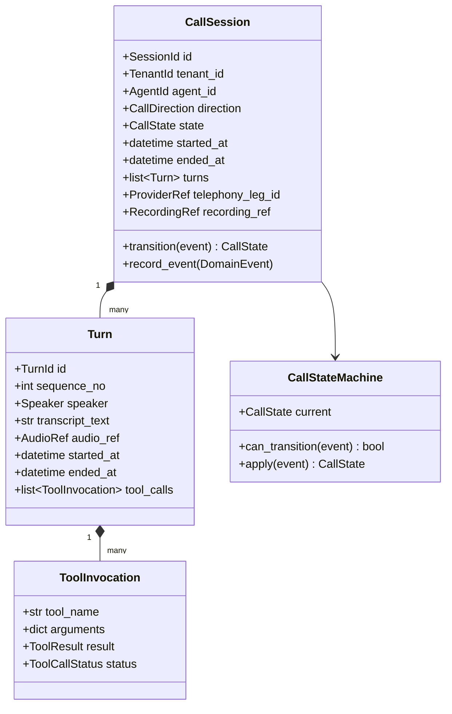

**Why `CallSession` is the aggregate root and `Turn`/`ToolInvocation` are not independently addressable:** a turn only ever makes sense in the context of its call, and a tool invocation only in the context of its turn — standard DDD aggregate consistency boundary (3A §7). All writes go through `CallSession`; there is no `TurnRepository`.

---

## 5. Call State Machine

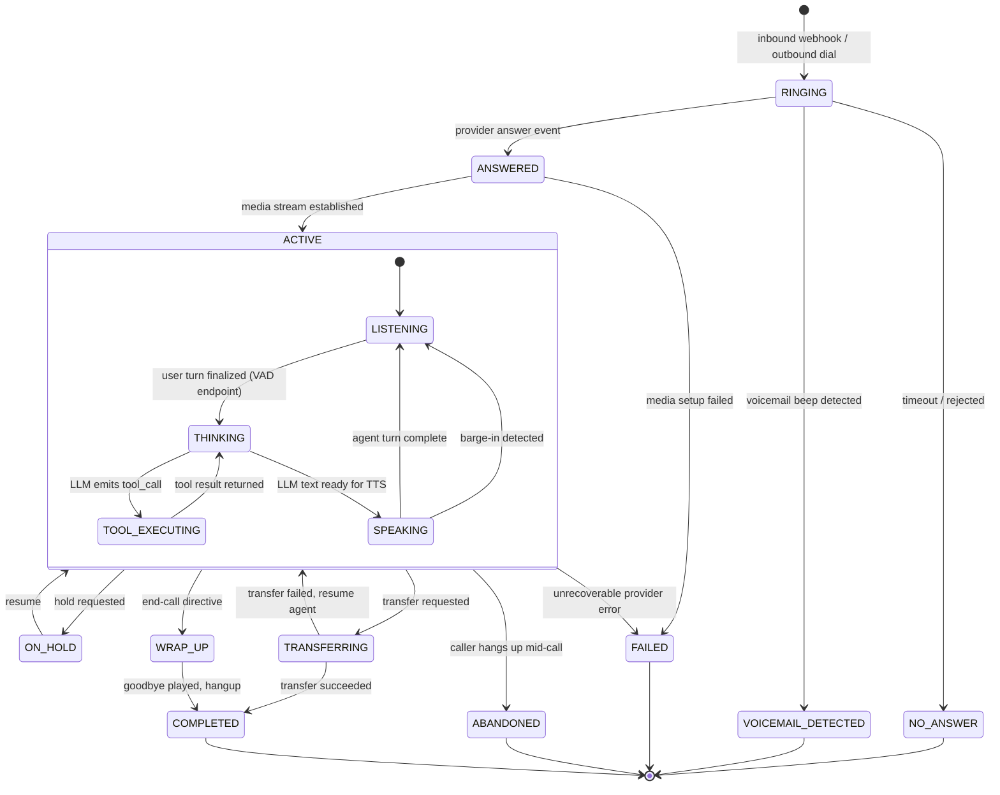

```python
# modules/voice_orchestration/domain/state_machine.py
_TRANSITIONS: dict[CallState, set[CallState]] = {
    CallState.RINGING: {CallState.ANSWERED, CallState.NO_ANSWER, CallState.VOICEMAIL_DETECTED},
    CallState.ANSWERED: {CallState.ACTIVE, CallState.FAILED},
    CallState.ACTIVE: {CallState.ON_HOLD, CallState.TRANSFERRING, CallState.WRAP_UP,
                        CallState.FAILED, CallState.ABANDONED},
    # ACTIVE substates (LISTENING/THINKING/TOOL_EXECUTING/SPEAKING) transition among
    # themselves via a nested table — omitted here, same enforcement pattern.
    CallState.ON_HOLD: {CallState.ACTIVE},
    CallState.TRANSFERRING: {CallState.COMPLETED, CallState.ACTIVE},
    CallState.WRAP_UP: {CallState.COMPLETED},
}

class CallStateMachine:
    def __init__(self, initial: CallState) -> None:
        self._current = initial

    def can_transition(self, target: CallState) -> bool:
        return target in _TRANSITIONS.get(self._current, set())

    def apply(self, target: CallState) -> CallState:
        if not self.can_transition(target):
            raise InvalidStateTransitionError(self._current, target)
        self._current = target
        return self._current
```

**Why an explicit transition table rather than ad-hoc `if` checks scattered through the orchestrator:** this is exactly the kind of invariant `CODING_STANDARDS.md`'s "deterministic, testable" functions requirement is for — the full set of legal transitions is unit-testable in isolation from any I/O, and an illegal transition (e.g., trying to `SPEAKING → TRANSFERRING` directly) fails loudly as `InvalidStateTransitionError` instead of silently corrupting call state.

---

## 6. Call Lifecycle

### 6.1 Inbound Call Setup

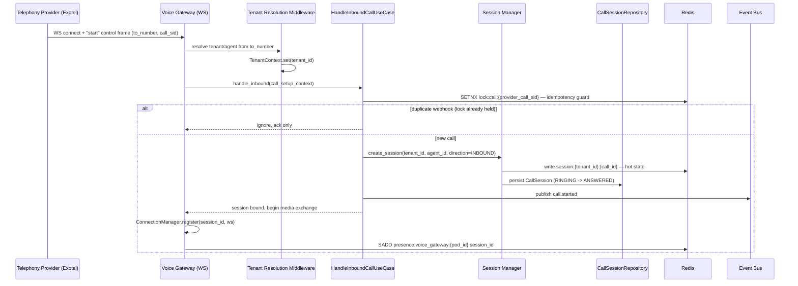

### 6.2 Call Teardown

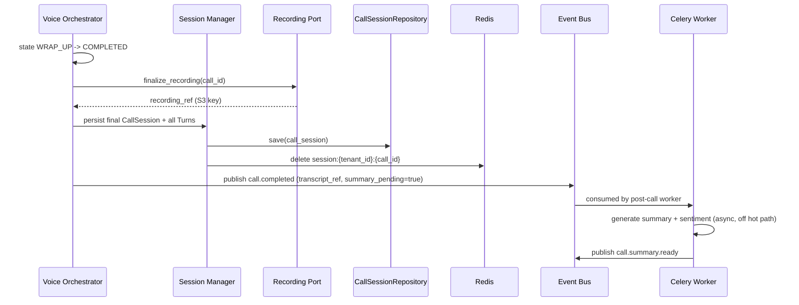

**Scope boundary:** `call.completed` and `call.summary.ready` are where the Voice Platform's responsibility ends. What CRM/Analytics do with a summary, sentiment, or transcript is out of scope for this document by design.

### 6.3 Outbound Call Initiation

The Voice Platform exposes the mechanism (`FR-VOICE-002`); *deciding* when to place a call (pacing, retries-across-attempts, lead selection) is the Campaign Engine's job and is out of scope here.

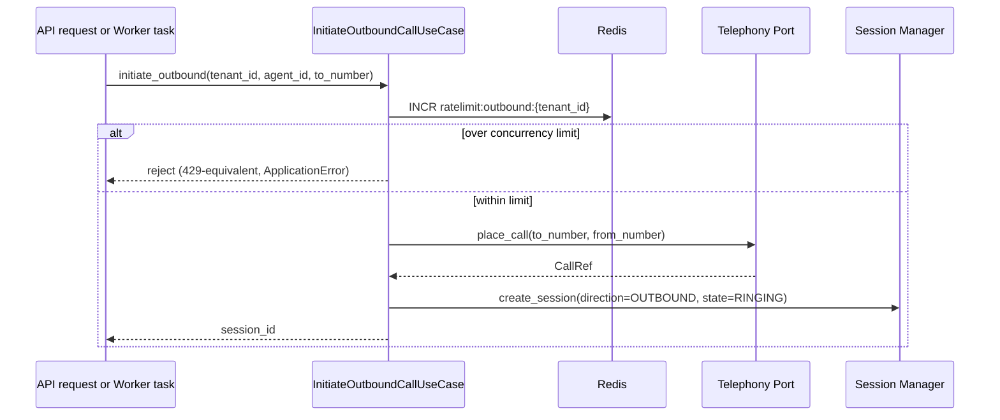

The `ratelimit:outbound:{tenant_id}` counter is a Voice Platform primitive (it gates actual calls placed through `TelephonyPort`); Campaign Engine consumes it, but doesn't own it.

---

## 7. Session Manager

Two-tier storage, consistent with 3A's Data Architecture (Postgres = source of truth, Redis = cache/session):

| Tier | Store | Contents | Why |
|---|---|---|---|
| Hot | Redis (`session:{tenant_id}:{call_id}`) | Current state, in-flight turn buffer, agent config snapshot, provider handles in use | The turn loop touches session state many times per call; a Postgres round-trip on every touch would eat directly into the latency budget (§21) |
| Durable | PostgreSQL (via `SqlAlchemyCallSessionRepository`, extends 3A's `TenantScopedRepository`) | Full `CallSession` + `Turn` + `ToolInvocation` history | System of record — survives Redis eviction, pod restarts, and is what CRM/Analytics later read |

**Checkpointing policy:** durable write on call start, on each completed turn, and on call end — not on every partial transcript fragment. **Why:** partial STT fragments arrive many times per second; persisting each to Postgres would be both wasted work (most are superseded within milliseconds) and a needless load spike at "tens of thousands of concurrent calls" (`NFR-SCALE-001`). Turn-level checkpointing is the coarsest granularity that still guarantees no more than one in-flight turn is lost on an ungraceful pod death.

```python
# modules/voice_orchestration/infrastructure/session_store.py
class RedisSessionStore:
    def __init__(self, redis: NamespacedRedisClient) -> None:
        self._redis = redis

    async def write(self, session: CallSessionSnapshot) -> None:
        await self._redis.set(f"session:{session.tenant_id}:{session.call_id}",
                               session.to_json(), ttl=CALL_TTL_SECONDS)

    async def read(self, tenant_id: TenantId, call_id: CallId) -> CallSessionSnapshot | None: ...
    async def delete(self, tenant_id: TenantId, call_id: CallId) -> None: ...
```

---

## 8. Voice Gateway

The WS ingress deployable. Responsibilities: accept the telephony provider's media-stream WS connection, resolve tenant/agent, bind the connection to a `CallSession`, translate provider wire-format frames into internal DTOs at the edge, and relay outbound audio back.

```python
# apps/voice_gateway/ws/connection_manager.py
class ConnectionManager:
    def __init__(self, redis: NamespacedRedisClient, pod_id: str) -> None:
        self._connections: dict[SessionId, WebSocket] = {}   # pod-local — see trade-off below
        self._redis = redis
        self._pod_id = pod_id

    async def register(self, session_id: SessionId, ws: WebSocket) -> None:
        self._connections[session_id] = ws
        await self._redis.sadd(f"presence:voice_gateway:{self._pod_id}", str(session_id))

    async def unregister(self, session_id: SessionId) -> None:
        self._connections.pop(session_id, None)
        await self._redis.srem(f"presence:voice_gateway:{self._pod_id}", str(session_id))
```

**Why the live socket handle is pod-local memory, when `ARCHITECTURE_PRINCIPLES.md` says never rely on local memory:** a WebSocket's underlying TCP connection is inherently pinned to the pod that accepted it — there is no way to hand a live socket to another process. The *statelessness* principle is satisfied one level up: everything that matters if the pod dies (`CallSession`, turns so far, agent config) lives in Redis/Postgres, not in `ConnectionManager`. If the pod dies, the call itself is lost (a phone call, unlike an HTTP request, can't be transparently replayed on another pod mid-stream) — that call is marked `FAILED` by the stale-session reaper (§18.2) and `call.failed` is emitted. The Redis presence set exists purely for *discovery* (which pod owns a live call, for ops/future live-monitoring use), not for failover — there is deliberately no cross-pod call handoff mechanism, because none is possible at the media layer.

---

## 9. Voice Orchestrator

The turn-loop coordinator — the component that actually runs the conversation.

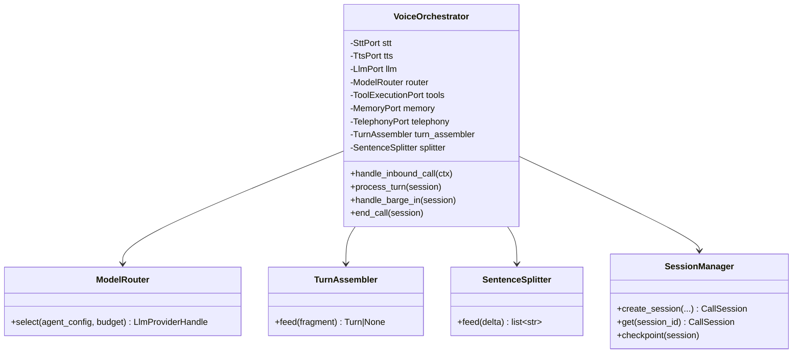

### 9.1 Why the Orchestrator Depends on Ports, Never Adapters, Directly

Every collaborator on `VoiceOrchestrator` above is a **port type** (`SttPort`, `TtsPort`, `LlmPort`, `TelephonyPort`, `ToolExecutionPort`, `MemoryPort`), injected by the DI container (3A §8) using the concrete adapter chosen for that tenant/agent/environment. The orchestrator's own code never imports `DeepgramAdapter` or `OpenAiAdapter` — this is the mechanism that makes provider swaps (§20) and A/B testing between providers (via feature flags) a wiring change, not an orchestrator code change.

---

## 10. Provider Abstraction Layer

### 10.1 Telephony Adapter

```python
# modules/voice_orchestration/application/ports/telephony_port.py
class TelephonyPort(Protocol):
    async def answer(self, call_ref: ProviderCallRef) -> MediaStreamHandle: ...
    async def place_call(self, to: E164PhoneNumber, from_: E164PhoneNumber) -> ProviderCallRef: ...
    async def transfer(self, call_ref: ProviderCallRef, target: E164PhoneNumber) -> None: ...
    async def hangup(self, call_ref: ProviderCallRef) -> None: ...
    async def send_dtmf(self, call_ref: ProviderCallRef, digits: str) -> None: ...
```

`ExotelAdapter` is primary (`FR-TEL-001`); `TwilioAdapter`/`TelnyxAdapter`/`PlivoAdapter`/`SipAdapter` are scaffolded but not implemented until `FR-TEL-002` is prioritized. Per-org, per-number provider selection (`FR-TEL-003`) is a DI-container wiring decision keyed off `Organization`'s number configuration (owned by the `organization` module, read via its public use case — same pattern as §13).

### 10.2 STT

```python
# modules/voice_orchestration/application/ports/stt_port.py
class SttPort(Protocol):
    async def stream(self, audio_chunks: AsyncIterator[AudioChunk]) -> AsyncIterator[TranscriptFragment]: ...
    async def close(self) -> None: ...
```

`DeepgramAdapter` primary, `GladiaAdapter` fallback (`FR-STT-001`) — selection/failover mechanics in §20.

### 10.3 TTS

```python
# modules/voice_orchestration/application/ports/tts_port.py
class TtsPort(Protocol):
    async def synthesize(self, text_stream: AsyncIterator[str], voice_config: VoiceConfig) -> AsyncIterator[AudioChunk]: ...
    async def cancel(self, stream_id: StreamId) -> None: ...
```

`cancel()` exists specifically to support barge-in (§5, §12) — it is not optional plumbing; without a cancellable stream, an interrupted agent keeps talking over the caller.

### 10.4 LLM

```python
# modules/voice_orchestration/application/ports/llm_port.py
class LlmPort(Protocol):
    async def complete(self, request: LlmCompletionRequest) -> AsyncIterator[LlmCompletionChunk]: ...
```

Seven adapters per `FR-LLM-001`/`TECH_STACK.md` (OpenAI, Anthropic, Gemini, Groq, OpenRouter, DeepSeek, Ollama). Each adapter is responsible for translating that provider's native tool-calling wire format into a single **canonical internal tool-call schema** (`LlmCompletionChunk.tool_call: CanonicalToolCall | None`) before it ever reaches the orchestrator.

**Why a canonical tool-call schema, not provider-native formats passed through:** OpenAI, Anthropic, Gemini, etc. each define function/tool-calling slightly differently (field names, streaming delta shape, parallel-call support). Without a canonical schema, every place downstream that handles a tool call (`ToolExecutionPort`, §13) would need provider-aware branching — a direct violation of Provider Independence (`ARCHITECTURE_PRINCIPLES.md`). Normalizing at the adapter boundary means `execute_tool_call.py` is written once, against one schema, forever.

### 10.5 Provider Abstraction — Class Diagram

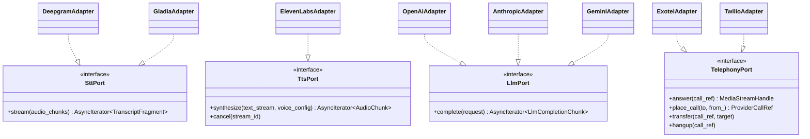

---

## 11. Model Router

Implements `FR-LLM-002`: select provider/model by latency, cost, context window, and availability, with per-agent override.

```python
# modules/voice_orchestration/application/services/model_router.py
@dataclass(frozen=True)
class ProviderScore:
    provider: str
    model: str
    score: float

class ModelRouter:
    def __init__(self, health: ProviderHealthPort, weights: RouterWeights) -> None:
        self._health = health
        self._weights = weights

    def select(self, agent_config: AgentLlmConfig, budget: LatencyBudget) -> LlmProviderHandle:
        candidates = agent_config.allowed_providers or self._default_providers
        scored = [
            ProviderScore(
                provider=c.provider, model=c.model,
                score=(self._weights.latency * self._normalize_latency(c, budget)
                       + self._weights.cost * self._normalize_cost(c)
                       + self._weights.context_fit * self._context_fit(c, agent_config)),
            )
            for c in candidates
            if self._health.is_available(c)     # circuit-open providers are excluded entirely
        ]
        if not scored:
            raise AllProvidersUnavailableError(agent_config.agent_id)
        return LlmProviderHandle.from_score(max(scored, key=lambda s: s.score))
```

**Why a weighted-scoring function rather than a learned/ML-based router:** KISS (`CODING_STANDARDS.md`) — a transparent, debuggable formula is preferable while the provider mix and traffic volume don't yet justify the complexity of a trained model, and every input (health, cost, context fit) is already available as static/near-static data. **Revisit trigger, stated explicitly:** if the provider list grows large enough that hand-tuned weights stop generalizing, or cost/latency tradeoffs need to vary per traffic segment in ways a linear formula can't express.

`select()` is pure (no I/O) — it reads pre-computed health data from `ProviderHealthPort`, itself backed by the Redis health store (§16), so a routing decision never blocks on a live network call — this is why §21's latency budget allocates Model Router selection under 10ms.

---

## 12. Streaming Pipeline

```mermaid
flowchart LR
    Telephony[Telephony Media Stream] -->|audio chunks, 20-100ms| InQueue["asyncio.Queue
inbound_audio"]
    InQueue --> STTTask[STT streaming task]
    STTTask -->|TranscriptFragment stream| TurnAssembler["Turn Assembler
VAD + endpointing"]
    TurnAssembler -->|finalized user turn| LLMTask[LLM streaming completion task]
    LLMTask -->|text delta chunks| Splitter[Sentence/Clause Splitter]
    Splitter -->|text chunks| TTSTask[TTS streaming task]
    TTSTask -->|audio chunks| OutQueue["asyncio.Queue
outbound_audio"]
    OutQueue --> Telephony2[Telephony Media Stream]
    LLMTask -. tool_call detected .-> ToolTask[Tool Execution Task]
    ToolTask -. result .-> LLMTask
```

**Why `asyncio.Queue` as the inter-stage primitive, not direct function calls:** each stage (STT, LLM, TTS) runs as its own concurrent task so that, e.g., TTS can start speaking the first sentence while the LLM is still generating the rest of the response (streaming, not batch — required for the latency budget in §21). `asyncio.Queue` gives backpressure for free: if the telephony leg consumes outbound audio slower than TTS produces it, `queue.put()` naturally blocks the TTS task until the consumer drains — no custom flow-control logic needed.

**Why the entire pipeline stays in one process (Review Note 5):** routing audio chunks between pods via Redis pub/sub was considered and rejected — it would add a network hop, and therefore latency, to every single audio chunk in a budget that's already tight (§21). Keeping STT→LLM→TTS in-process, connected by in-memory queues, is strictly faster and simpler; the trade-off is the pod-pinning already discussed in §8.

### 12.1 Per-Turn Sequence (With Tool Call)

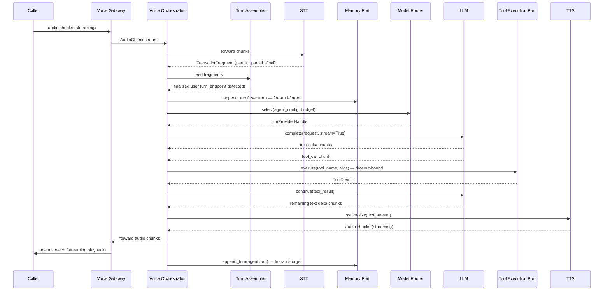

### 12.2 Barge-In

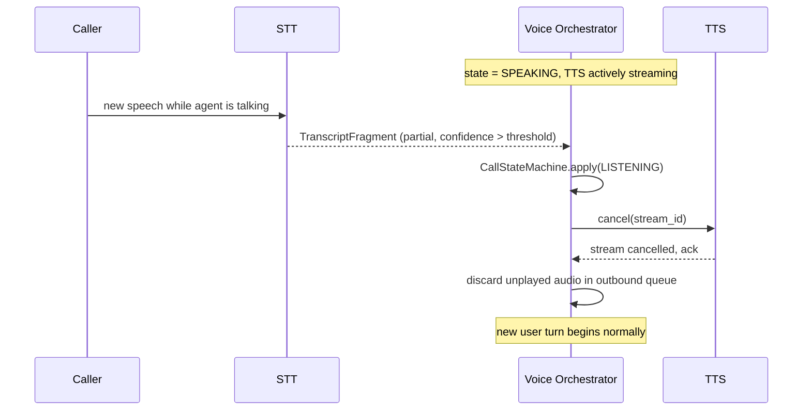

**Why a confidence threshold gates barge-in, not any detected sound:** background noise or a brief acknowledgment ("mm-hm") shouldn't cut the agent off mid-sentence. The threshold is a tunable per-agent parameter (feature-flaggable, 3A §10), not hardcoded — this is called out because it's a genuine UX/product tuning decision, not a pure engineering constant.

---

## 13. Tool Calling Flow

```python
# modules/voice_orchestration/application/ports/tool_execution_port.py
class ToolExecutionPort(Protocol):
    async def execute(self, tool_name: str, arguments: dict, context: ToolCallContext) -> ToolResult: ...
```

`ToolCallContext` carries `tenant_id`, `session_id`, `agent_id` — everything the Tool Calling module needs to authorize and scope the call, without the Voice module knowing anything about the tool registry itself (`FR-TOOL-003`'s Custom Tool SDK lives entirely on the other side of this port).

**Timeout-bound, per `FR-TOOL-004`:** `execute()` is wrapped with a bounded timeout (default drawn from `LatencyBudget`, §21); a timeout raises `ToolCallTimeoutError` (§22), which the orchestrator handles by informing the LLM the tool failed (so it can respond gracefully) rather than hanging the call.

**Sequential by default:** if an LLM response requests multiple tool calls in one turn, this design executes them sequentially, not in parallel. **Why:** side-effecting tools (anything that writes state) can have ordering dependencies or race conditions the Voice module has no visibility into — parallelizing safely requires per-tool idempotency guarantees that are the Tool Calling Framework's concern (Phase 17), not this module's to assume. Parallel execution is a documented future optimization, gated on that guarantee existing.

**Module-boundary reconciliation (Review Note 6):** `tool_execution_adapter.py` (the concrete adapter behind this port) calls the Tool Calling module's own public application-layer use case — its front door — never its domain or infrastructure internals. This keeps the sync call compliant with 3A's "no direct module-to-module imports" rule: the dependency is on a published interface, exactly as it would be on an external provider.

---

## 14. Memory Access

```python
# modules/voice_orchestration/application/ports/memory_port.py
class MemoryPort(Protocol):
    async def load(self, tenant_id: TenantId, customer_ref: CustomerRef) -> ConversationMemory: ...
    async def append_turn(self, session_id: SessionId, turn: Turn) -> None: ...
```

**Call pattern:**
- `load()` — called once at session creation, **blocking**: the loaded memory feeds the system prompt for the very first LLM call, so the turn loop cannot start without it.
- `append_turn()` — called after every turn, **fire-and-forget** relative to the caller-facing response: the platform doesn't make the customer wait for a memory write before speaking.

Storage schema, summarization strategy, and context-compression logic (`FR-MEM-002`) are Phase 15's responsibility — this document only fixes the contract the Voice Platform depends on.

---

## 15. Interfaces & DTOs — Consolidated Reference

### 15.1 Ports

| Port | Key methods | Adapters (this doc) |
|---|---|---|
| `TelephonyPort` | `answer`, `place_call`, `transfer`, `hangup`, `send_dtmf` | Exotel (primary), Twilio/Telnyx/Plivo/SIP (scaffolded) |
| `SttPort` | `stream`, `close` | Deepgram (primary), Gladia (fallback) |
| `TtsPort` | `synthesize`, `cancel` | ElevenLabs |
| `LlmPort` | `complete` | OpenAI, Anthropic, Gemini, Groq, OpenRouter, DeepSeek, Ollama |
| `ToolExecutionPort` | `execute` | Adapter → Tool Calling module's public use case |
| `MemoryPort` | `load`, `append_turn` | Adapter → Conversation Memory module's public use case |
| `WorkflowExecutionPort` | `next_directive` | Adapter → Workflow Engine module's public use case (thin, Phase 13 owns detail) |
| `RecordingPort` | `start`, `finalize_recording` | S3-backed adapter |
| `ProviderHealthPort` | `is_available`, `p50_latency`, `report_failure`, `report_success` | Redis-backed |

### 15.2 DTOs

| DTO | Fields (representative) | Purpose |
|---|---|---|
| `AudioChunk` | `bytes`, `sample_rate`, `sequence_no`, `codec` | Unit of streamed audio, internal standard format post-edge-translation |
| `TranscriptFragment` | `text`, `is_final`, `confidence`, `start_ms`, `end_ms` | Streaming STT output |
| `LlmCompletionRequest` | `messages`, `tools`, `model_hint`, `max_tokens`, `stream=True` | Input to `LlmPort.complete` |
| `LlmCompletionChunk` | `delta_text \| tool_call: CanonicalToolCall \| None`, `finish_reason` | Streaming LLM output, normalized (§10.4) |
| `VoiceConfig` | `voice_id`, `stability`, `emotion` | TTS synthesis parameters |
| `ToolResult` | `success`, `data`, `error` | Result of a tool invocation |
| `WorkflowDirective` | `kind: SPEAK\|TRANSFER\|END_CALL\|EXECUTE_TOOL\|CONTINUE`, `payload` | Output of `WorkflowExecutionPort` (Phase 13 detail) |
| `CallSetupContext` | `to_number`, `from_number`, `provider_call_sid`, `direction` | Input to call-handling use cases |
| `LatencyBudget` | per-stage target ms (§21) | Input to `ModelRouter.select` |

---

## 16. Redis Usage in the Voice Platform

| Key pattern | Purpose | Lifetime |
|---|---|---|
| `session:{tenant_id}:{call_id}` | Hot call/session state: current state, turn buffer, agent config snapshot | Call duration + 5 min grace |
| `presence:voice_gateway:{pod_id}` | Session IDs currently owned by this pod — discovery only, not failover (§8) | Pod lifetime |
| `lock:call:{provider_call_sid}` | Idempotency guard against duplicate provider webhooks (`SETNX`) | 30s |
| `providerhealth:{provider_name}` | Rolling latency/error-rate + circuit-breaker state, shared cluster-wide | Sliding window (e.g. 60s buckets) |
| `ratelimit:outbound:{tenant_id}` | Per-tenant outbound concurrency counter, enforced at `TelephonyPort.place_call()` | Rolling |

**Why `providerhealth:*` lives in Redis, shared cluster-wide, rather than in each pod's memory:** a circuit breaker whose state is pod-local rediscovers every outage independently on every pod — with tens of thousands of concurrent calls spread across many pods (`NFR-SCALE-001`), that means the same failing provider gets hammered repeatedly instead of being avoided platform-wide after the first few failures. Centralizing health state in Redis means one pod's bad experience with a provider immediately informs every other pod's routing decisions.

---

## 17. WebSocket Architecture & Flow

**Connection lifecycle:** `CONNECTING → AUTHENTICATED → BOUND (session attached) → STREAMING → CLOSING → CLOSED`.

**Message framing:**

| Frame type | Encoding | Examples |
|---|---|---|
| Media | Binary | Raw audio chunks (provider codec in, internal PCM16 standard after `media_codec.py` translation) |
| Control | JSON text | `start` (call metadata), `media` (metadata alongside binary), `mark`, `stop`, `dtmf`, `error` |

**Why translation to a standard internal codec happens immediately at the WS edge (`media_codec.py`), not deeper in the pipeline:** this is the Provider Abstraction principle applied to the media format itself — every stage downstream (STT adapters, the pipeline queues) works against one internal audio representation regardless of which telephony provider or codec is in play, so adding a new telephony provider means writing one codec translation function, not touching the pipeline.

**No reconnect/resume for dropped call media — a stated hard boundary.** Unlike a chat WebSocket, a phone call's media stream can't be transparently resumed after a drop; if the WS connection drops mid-call, the call is over from the platform's perspective. The stale-session reaper (§18.2) detects this (heartbeat/TTL expiry on `session:*`), force-transitions the session to `FAILED`, and emits `call.failed`. This is a deliberate scope boundary, not an oversight — building call-resumption would mean re-establishing a telephony media leg, which is a provider-level capability question, not something the Voice Gateway can engineer around alone.

**Backpressure:** handled entirely by `asyncio.Queue`'s natural blocking behavior (§12) — no bespoke flow-control code.

---

## 18. Threading Model, AsyncIO, Celery, Background Workers, Internal Services

### 18.1 Threading Model / AsyncIO

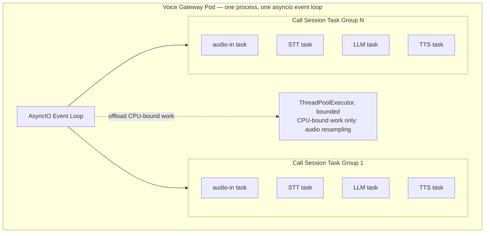

**Why AsyncIO coroutines per call, not one OS thread (or process) per call:** the workload is overwhelmingly I/O-bound — waiting on network round-trips to STT/LLM/TTS/telephony — which is precisely what `TECH_STACK.md`'s choice of AsyncIO is for. OS threads carry real per-thread overhead (stack memory, context-switch cost) that doesn't scale to `NFR-SCALE-001`'s tens-of-thousands-of-concurrent-calls target on realistic hardware; lightweight coroutines do. Genuinely CPU-bound work (e.g., audio resampling if a provider's codec needs it) is explicitly offloaded to a bounded `ThreadPoolExecutor` via `loop.run_in_executor` so it can't block the event loop and stall every other concurrent call on the pod.

### 18.2 Celery Background Workers

| Worker | Trigger | Responsibility | Why off the hot path |
|---|---|---|---|
| Post-call summary & sentiment | `call.completed` event | Batch LLM call over the full transcript | Seconds of LLM latency — irrelevant once the call has ended, unacceptable inline |
| Recording finalization | `call.completed` event | Move buffered audio to durable S3 object, generate signed URL | I/O-heavy, not needed until after the call |
| Provider health polling | APScheduler, periodic (~10s) | Synthetic pings to each provider category, update `providerhealth:*` | Keeps failover (§20) a fast Redis read instead of a live probe on every call |
| Outbound call dispatch | API/worker task | Executes `TelephonyPort.place_call()`; Campaign Engine decides *when*, this performs *how* | Keeps the module boundary clean — this module never imports Campaign logic |
| Stale session reaper | APScheduler, periodic | Force-transitions abandoned `session:*` entries to `FAILED`, emits `call.failed` | Handles ungraceful pod death (§8, §17) |

### 18.3 Internal (In-Process) Services

Distinct from the Celery workers above — these run **inside** the Voice Orchestrator's own asyncio tasks, on the real-time hot path: `TurnAssembler` (VAD/endpointing), `SentenceSplitter` (LLM delta → TTS-ready chunks), `ModelRouter` (§11), `ProviderHealthMonitor`'s read-side (writes come from the Celery health-polling worker; reads happen inline via the Redis-backed `ProviderHealthPort`).

---

## 19. Retry Strategy

**Scope boundary, stated explicitly:** this section covers retrying *provider request/connection failures* (a timed-out LLM call, a dropped STT connection attempt). It does **not** cover campaign-level "call this lead again in two hours" retries — that's Campaign Engine, out of scope here.

| Provider category | Max attempts | Backoff | Rationale |
|---|---|---|---|
| Telephony (place/transfer/hangup) | 2 | Exponential, jitter, base 200ms | Call-setup latency is less time-critical than mid-call turns; still bounded to avoid stacking delay before a caller even connects |
| STT connection establishment | 1 retry, then fail over (§20) | Immediate retry, then fallback | A second consecutive failure is more likely provider-wide than transient — fail over rather than keep retrying the same provider |
| LLM completion request | 1 retry on the *same* provider, then Model Router re-selects | Immediate | The 800ms budget (§21) can't absorb multiple full retry cycles; a second failure escalates to fallback provider selection, not another retry |
| TTS synthesis request | 1 retry | Immediate | Same latency reasoning as LLM |
| Post-call background work (summary, recording upload) | Up to 5, Celery's own retry/backoff | Exponential | Off the hot path — no latency budget pressure, correctness matters more than speed here |

**Circuit breaker, shared via Redis (§16):** after N consecutive failures for a given provider (tracked in `providerhealth:{provider_name}`), the breaker opens for a cooldown window — the provider is excluded from `ModelRouter.select()`'s candidate set and from STT/TTS adapter selection entirely until it closes again, rather than every call re-attempting a provider that's already known to be down.

---

## 20. Fallback Strategy & Provider Failover

| Category | Fallback defined | When it applies |
|---|---|---|
| Telephony | `FR-TEL-004` — secondary provider for outbound calling | Call-setup time only; telephony vendor can't be swapped mid-call |
| STT | `FR-STT-001` — Deepgram → Gladia | Session start (preferred) or hot-swapped mid-call on a dropped connection (brief transcription gap, rest of the turn loop unaffected) |
| TTS | None named upstream — Review Note 4 | N/A until a fallback vendor is approved |
| LLM | `FR-LLM-003` — Model Router re-selects from the agent's ordered candidate list on error/timeout | Per-request; can happen turn-to-turn without disrupting the call |

```mermaid
sequenceDiagram
    participant Orch as Voice Orchestrator
    participant Health as Provider Health Monitor
    participant Redis
    participant Primary as Deepgram Adapter
    participant Fallback as Gladia Adapter

    Orch->>Primary: open streaming session
    Primary--xOrch: connection error / timeout
    Orch->>Health: report_failure(deepgram)
    Health->>Redis: increment providerhealth:deepgram error count
    alt threshold exceeded
        Health->>Redis: set providerhealth:deepgram = OPEN (cooldown)
    end
    Orch->>Redis: read providerhealth:deepgram
    Orch->>Fallback: open streaming session
    Fallback-->>Orch: session established
    Note over Orch: transcription resumes;<br/>brief gap logged, call continues uninterrupted
```

---

## 21. Latency Budget

Per Review Note 3: **proposed**, not a previously approved figure — allocates `NFR-PERF-001`'s end-to-end <800ms p50 target across stages.

| Stage | Target p50 | Target p95 | Notes |
|---|---|---|---|
| Network: caller → telephony → gateway | 50ms | 120ms | Outside platform control |
| VAD / endpoint detection | 150ms | 300ms | Tunable per agent — responsiveness vs. cutting off slow speakers |
| STT finalization (post-endpoint) | 100ms | 200ms | Partials stream continuously before this |
| Model Router selection | <5ms | <10ms | Pure in-memory scoring against cached health data (§11) |
| LLM time-to-first-token | 250ms | 500ms | Largest variable; provider/model dependent |
| Tool execution (only if invoked) | 150ms | 400ms | Adds to total only on turns needing a tool; timeout-bound (§13) |
| TTS time-to-first-audio-byte | 120ms | 250ms | ElevenLabs streaming synthesis |
| Network: gateway → telephony → caller | 50ms | 120ms | Symmetric with inbound leg |
| **Total (no tool call)** | **~725ms** | **~1500ms** | Against the 800ms p50 target — VAD tuning and LLM provider/model choice are the two largest levers available |

---

## 22. Error Hierarchy Extensions (Voice-Specific)

Extends, does not replace, 3A's `PlatformError` hierarchy.

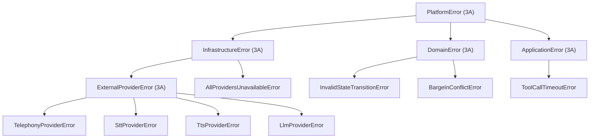

These plug directly into 3A's exception→HTTP mapping table (3A §12.2) via their base classes — `TelephonyProviderError` etc. map to 502/503 as an `ExternalProviderError`; `InvalidStateTransitionError` maps to 422 as a `DomainError`; no new mapping rules are needed.

---

## 23. Open Items for Later Phases

| Item | Needed from | Feeds into |
|---|---|---|
| Confirm barge-in confidence threshold and TTS cancellation support against ElevenLabs' real API (Review Note 2) | Provider API validation | Phase 24 |
| Validate the per-stage latency budget against real provider benchmarks (Review Note 3) | Load testing | Phase 23 (Testing Strategy), Phase 24 |
| Decide whether a fallback TTS vendor is needed (Review Note 4) | Product/Architecture sign-off | `TECH_STACK.md` amendment if approved |
| Full `call_sessions`/`turns`/`tool_invocations` schema, indexes, partitioning strategy | — | Phase 5 (Database Design) |
| Full domain event payload schemas for `call.*` events | — | Phase 7 (Event Architecture) |
| Full Workflow Engine node/graph design and exactly where `WorkflowExecutionPort` sits in the turn loop (Review Note 1) | — | Phase 13 |
| Full Tool Calling Framework registry, SDK, sandboxing model | — | Phase 17 |
| Full Conversation Memory storage/summarization design | — | Phase 15 |
| Full Model Router weight tuning, cost data sourcing | — | Phase 16 |

**This document is the gate for whatever module-level LLD you sequence next.** Please confirm §1's Architecture Review Notes — particularly #2 (barge-in), #3 (latency budget), and #4 (no TTS fallback) — before they're relied on in Phase 24 implementation.
