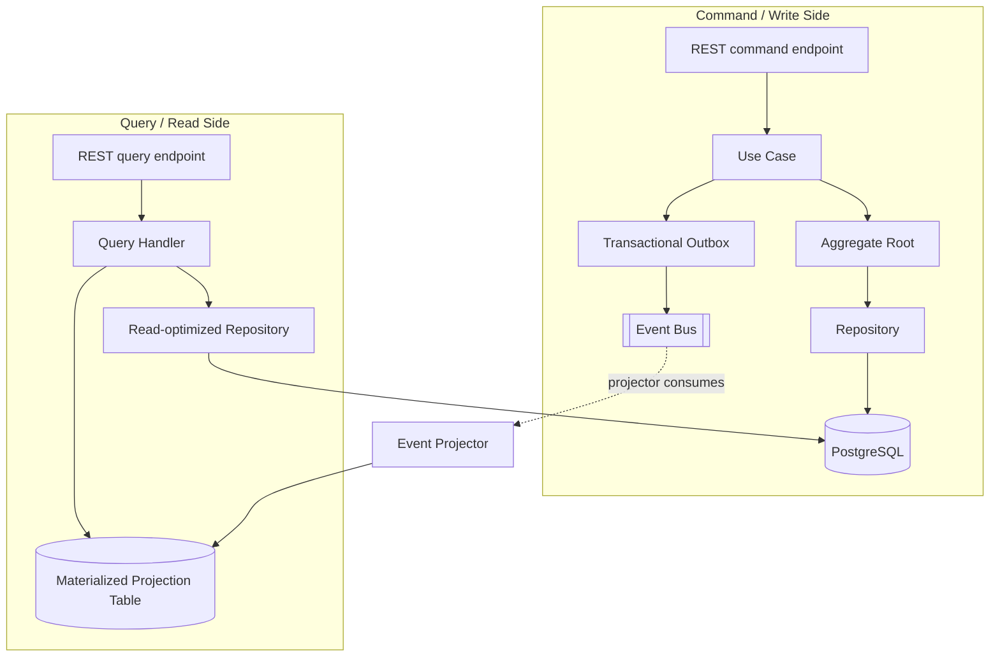
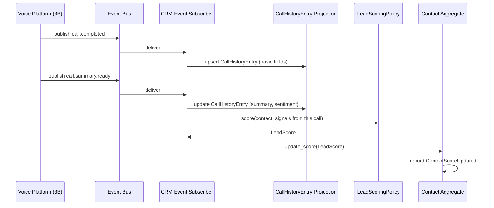
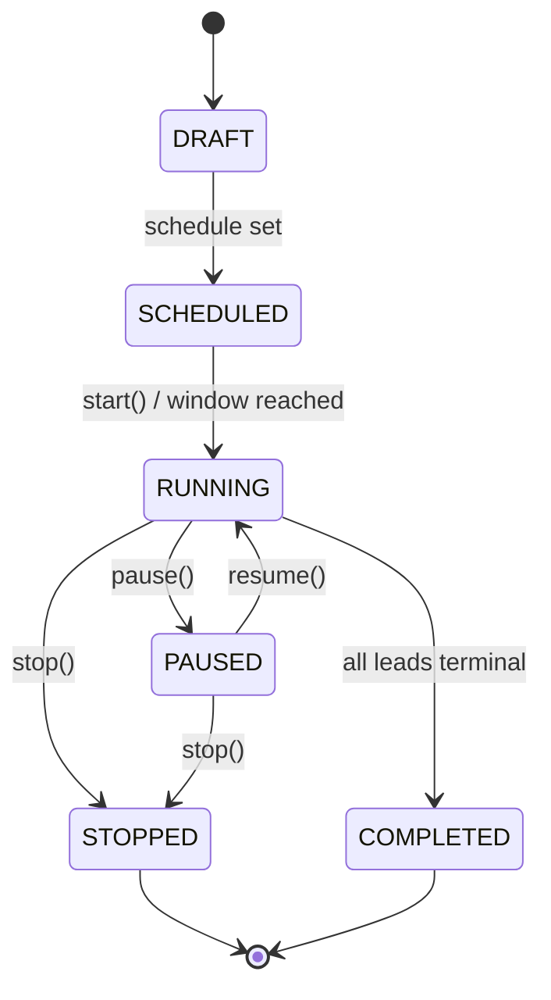
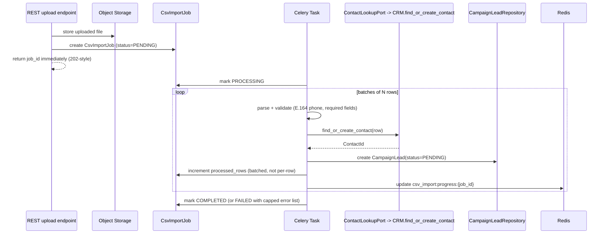
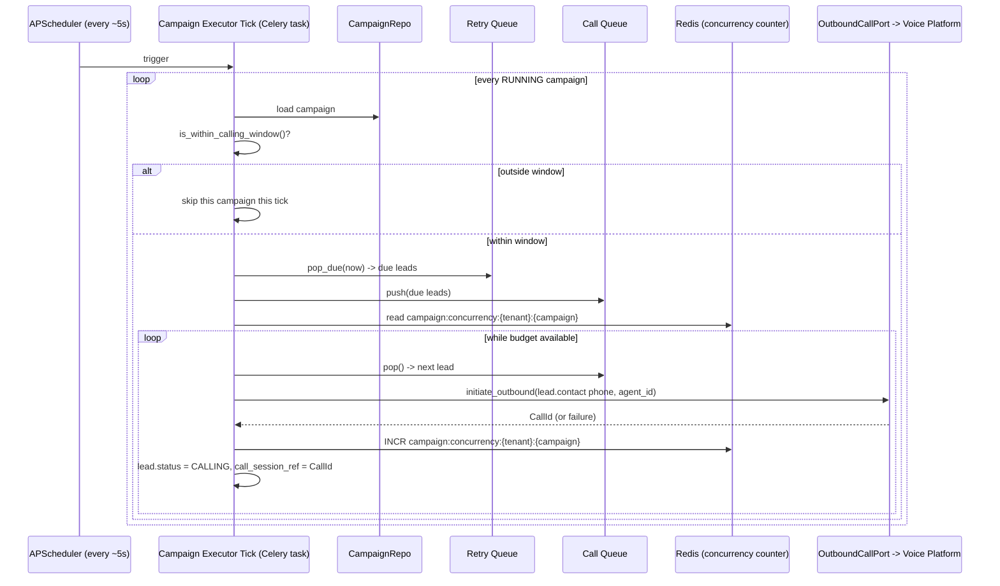
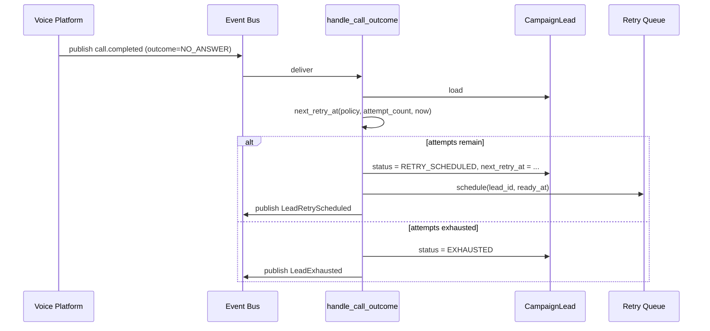
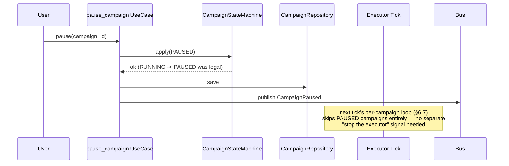
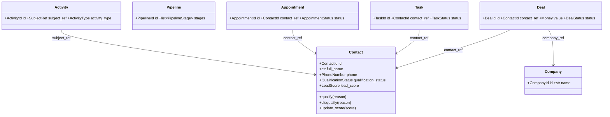
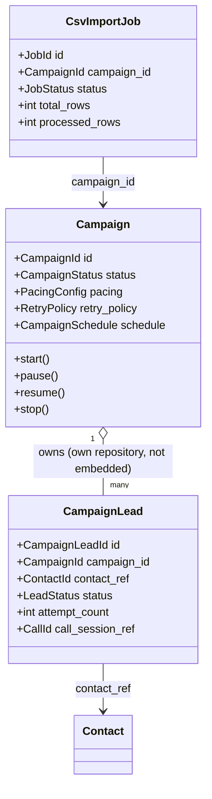
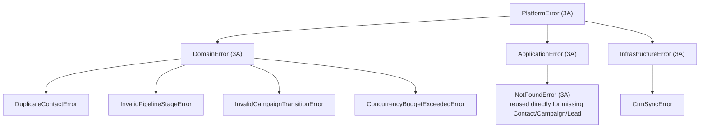

# Phase 3C — Low-Level Design: CRM & Campaign Engine

| | |
|---|---|
| **Roadmap phase** | Phase 3 (Low-Level Design) — sub-phase 3C: CRM & Campaign Engine only |
| **Status** | Draft v1.0, for review |
| **Source of truth (approved, not redesigned here)** | `Phase 1 — SRS`, `Phase 2 — High-Level Architecture`, `Phase 3A — Platform Foundation LLD`, `Phase 3B — Voice Platform LLD` |
| **Explicitly out of scope** | Billing, Workflow Builder internals, Tool Calling Framework internals, Plugin Runtime internals — each is its own document |

## 0. Scope & Traceability

This document designs the CRM and Campaign Engine bounded contexts: contact/company/deal/pipeline management, lead qualification and scoring, call-summary ingestion from the Voice Platform, CSV-driven lead import, the campaign executor and its call/retry queues, and CRM sync. It reuses 3A's Clean/Hexagonal template and 3B's cross-module integration pattern (a port whose adapter calls another module's public use case) rather than redefining either.

| # | Requested item | Section |
|---|---|---|
| 1 | CRM | §5 |
| 2 | Campaign Engine | §6 |
| 3 | Lead Management | §5.4 |
| 4 | Contact Management | §5.1 |
| 5 | Scheduling | §6.4 |
| 6 | Campaign Executor | §6.7 |
| 7 | CSV Import | §6.3 |
| 8 | Call Queue | §6.5 |
| 9 | Retry Queue | §6.6 |
| 10 | Lead Qualification | §5.4 |
| 11 | Call Summary | §5.6 |
| 12 | Lead Scoring | §5.5 |
| 13 | CRM Sync | §5.7 |
| 14 | Background Jobs | §11 |
| 15 | Redis | §10 |
| 16 | Celery | §11 |
| 17 | Repository Pattern | §9 |
| 18 | DTOs | §8 |
| 19 | CQRS | §4 |
| 20 | Interfaces | §7 |
| 21 | Sequence Diagrams | §12 |
| 22 | Everything required for implementation | throughout |

> Code blocks are structural skeletons, not production implementations (Phase 24).

---

## 1. Architecture Review Notes

*(Observations flagged for confirmation — nothing here changes an approved Phase 1/2/3A/3B decision.)*

1. **"Lead" vs. "Contact" is not disambiguated upstream.** `FR-CRM-001` names Contacts as the core object; `FR-CAMP-005` talks about "lead qualification" without defining a separate Lead entity. This document treats a lead as *a Contact whose `qualification_status` has not yet reached `CONVERTED`* (§5.4) rather than modeling Lead and Contact as two synced objects. Flagging because product-facing UI language may still want to say "leads" even though the data model is unified — confirm before Phase 6 (API Design) names endpoints.
2. **The CRM ↔ Voice Platform call-history mechanism is new detail.** `FR-CRM-003` and `FR-VOICE-008` together imply CRM needs call outcomes, but neither Phase 1 nor Phase 2 specify how. §5.6 defines it as an event-driven read-model projection off `call.completed`/`call.summary.ready` — consistent with Phase 2's Event-Driven Design principle, but a new mechanism, not a previously approved one.
3. **Campaign-level pacing is advisory; the Voice Platform's tenant-wide concurrency limit (3B §16, `ratelimit:outbound:{tenant_id}`) is the hard backstop.** A campaign operating under its own concurrency budget can still be throttled if other outbound activity shares the tenant's limit. This is consistent with 3B's design but worth confirming as the intended relationship, especially once Billing/plan-tier quotas (Phase 20) are layered on top.
4. **No Do-Not-Call/consent registry exists anywhere upstream.** Phase 1's NFRs mention recording consent (`NFR-COMPLY-001`) but not a broader outbound-calling consent/DNC registry, despite "thousands of orgs" and "unlimited campaigns" being explicit scale targets where this is very likely a real compliance requirement. §6.5 includes a `DNC_SKIPPED` lead status and a `DncRegistryPort` stub as a forward-looking hook only — the registry itself is not designed here. Recommend product/legal input before Phase 24.

---

## 2. Foundation Reused From 3A / 3B (Not Redesigned)

| From | Used here as |
|---|---|
| 3A Clean + Hexagonal template | `modules/crm/` and `modules/campaign_engine/` follow the same `domain/application/infrastructure/interface` structure |
| 3A `AggregateRoot`, `ValueObject`, `DomainEvent`, `Money`, `EmailAddress`, `PhoneNumber` | Reused directly — no new base types needed for CRM's value objects |
| 3A `TenantScopedRepository` | Base for every CRM/Campaign repository |
| 3A `Result` type | Used for expected outcomes (e.g., "phone number already belongs to another contact") in use cases |
| 3A `PlatformError` hierarchy | Extended with CRM/Campaign-specific subclasses (§14) |
| 3A namespaced Redis wrapper, `retry.py`, `id_generator.py` | Backing for Call Queue, Retry Queue, and sortable `CampaignId`/`CampaignLeadId` (§10) |
| 3A DI `Container` | Extended with CRM/Campaign factories |
| 3B's cross-module synchronous pattern (§13: a port's adapter calls the target module's *public use case*, never its internals) | Reused three times here: Campaign Engine → Voice Platform's outbound-call use case (§6.7), Campaign Engine → CRM's `find_or_create_contact` use case (§6.3), and (conceptually) Tool Calling Framework → CRM's `book_appointment` use case (§6.4) |
| 3B's event-driven, off-hot-path async pattern | Lead scoring, CSV import processing, and campaign execution ticks all run as Celery/APScheduler background work, never inline on a request |

---

## 3. Bounded Context Folder Structure

Both modules follow 3A's reserved-placeholder pattern, now filled in.

```text
modules/crm/
├── domain/
│   ├── entities.py            # Contact, Company, Deal, Pipeline, Task, Appointment, Note, Activity
│   ├── value_objects.py       # QualificationStatus, LeadScore, PipelineStage, SubjectRef, DealStatus
│   ├── events.py              # ContactCreated, ContactQualified, ContactDisqualified,
│   │                          # ContactScoreUpdated, ContactMerged, DealCreated, DealStageChanged,
│   │                          # AppointmentBooked, TaskCreated, NoteAdded
│   ├── exceptions.py          # DuplicateContactError, InvalidPipelineStageError
│   └── services.py            # LeadScoringPolicy (pure rule evaluation, no I/O)
├── application/
│   ├── use_cases/
│   │   ├── find_or_create_contact.py   # public front door for cross-module callers (§6.3)
│   │   ├── qualify_contact.py
│   │   ├── disqualify_contact.py
│   │   ├── merge_contacts.py
│   │   ├── create_deal.py
│   │   ├── move_deal_stage.py
│   │   ├── book_appointment.py         # tool-callable via Tool Calling Framework (§6.4 seam)
│   │   ├── create_task.py
│   │   └── add_note.py
│   ├── queries/                        # CQRS read side (§4)
│   │   ├── list_contacts.py
│   │   ├── get_contact_detail.py
│   │   ├── get_call_history.py         # reads the CallHistoryEntry projection (§5.6)
│   │   └── get_pipeline_board.py
│   ├── ports/
│   │   ├── contact_repository.py
│   │   ├── deal_repository.py
│   │   ├── pipeline_repository.py
│   │   ├── task_repository.py
│   │   ├── appointment_repository.py
│   │   ├── note_repository.py
│   │   ├── activity_repository.py
│   │   ├── lead_scoring_port.py        # pluggable strategy — see §5.5
│   │   └── crm_sync_port.py            # external CRM sync — Phase 18 detail
│   └── dto.py
├── infrastructure/
│   ├── models.py
│   ├── mappers.py
│   ├── repositories/                   # one SQLAlchemy repository per aggregate root
│   │   ├── sqlalchemy_contact_repository.py
│   │   ├── sqlalchemy_deal_repository.py
│   │   └── ...
│   ├── read_models/
│   │   ├── call_history_projection.py  # table + event projector, §5.6
│   │   └── contact_read_repository.py  # lean read-only queries, §4
│   ├── scoring/
│   │   └── rule_based_lead_scorer.py   # v1 LeadScoringPort implementation
│   └── sync/                           # external CRM adapters — Phase 18
└── interface/
    ├── rest/router.py
    └── events/subscribers.py           # call.completed, call.summary.ready (§5.6)

modules/campaign_engine/
├── domain/
│   ├── entities.py            # Campaign, CampaignLead, CsvImportJob
│   ├── value_objects.py       # PacingConfig, RetryPolicy, CampaignSchedule, TimeWindow, LeadOutcome
│   ├── state_machine.py       # CampaignStateMachine, §6.1
│   ├── events.py              # CampaignCreated/Started/Paused/Resumed/Stopped/Completed,
│   │                          # LeadQueued, LeadCallAttempted, LeadRetryScheduled, LeadExhausted
│   ├── exceptions.py          # InvalidCampaignTransitionError, ConcurrencyBudgetExceededError
│   └── services.py            # is_within_calling_window(), next_retry_at()
├── application/
│   ├── use_cases/
│   │   ├── create_campaign.py
│   │   ├── start_campaign.py
│   │   ├── pause_campaign.py
│   │   ├── resume_campaign.py
│   │   ├── stop_campaign.py
│   │   ├── import_csv.py               # §6.3
│   │   ├── enqueue_ready_leads.py      # executor tick, step 1 — §6.7
│   │   ├── dequeue_and_dial.py         # executor tick, step 2 — §6.7
│   │   ├── handle_call_outcome.py      # reacts to call.completed for campaign-originated calls
│   │   └── process_due_retries.py      # §6.6
│   ├── queries/
│   │   ├── get_campaign_stats.py       # reads CampaignOutcomeSummary projection
│   │   └── list_campaign_leads.py
│   ├── ports/
│   │   ├── campaign_repository.py
│   │   ├── campaign_lead_repository.py
│   │   ├── csv_import_job_repository.py
│   │   ├── outbound_call_port.py       # -> Voice Platform's public use case, §6.7
│   │   ├── contact_lookup_port.py      # -> CRM's public use case, §6.3
│   │   └── dnc_registry_port.py        # stub — Review Note 4
│   └── dto.py
├── infrastructure/
│   ├── models.py
│   ├── mappers.py
│   ├── repositories/
│   │   ├── sqlalchemy_campaign_repository.py
│   │   └── sqlalchemy_campaign_lead_repository.py
│   ├── queue/
│   │   ├── redis_call_queue.py         # §6.5
│   │   └── redis_retry_queue.py        # §6.6
│   ├── read_models/
│   │   └── campaign_outcome_projection.py
│   ├── voice/
│   │   └── outbound_call_adapter.py    # implements OutboundCallPort
│   └── crm/
│       └── contact_lookup_adapter.py   # implements ContactLookupPort
└── interface/
    ├── rest/router.py
    └── events/subscribers.py           # call.completed -> handle_call_outcome
```

---

## 4. CQRS Strategy

**Why CQRS here specifically, when 3A/3B didn't need it:** CRM and Campaigns have a read pattern that's genuinely different in shape from the Voice Platform's — dashboards, pipeline boards, campaign outcome funnels, and paginated contact lists are read far more often than the underlying aggregates are written, and several of the most useful views (call history per contact, campaign outcome stats) span data owned by a *different* module (Voice Platform) that this module cannot query directly (3A's module-boundary rule). Neither problem existed in 3B, where reads were almost entirely "load the one `CallSession` this turn is about."

**The design — CQRS-lite, not full event sourcing:**



| Read need | Mechanism | Why |
|---|---|---|
| Contact list, pipeline board, task list | Lean `Query Handler` reading the *same* Postgres tables via a read-only repository that selects only list-view columns — never hydrates a full aggregate | Most CRM reads are simple filters/pagination over live data; full aggregate hydration (all value objects, all invariant-checking machinery) is wasted work for a list row |
| Call history per contact | Materialized `CallHistoryEntry` projection, built by an event subscriber (§5.6) | The source data (`CallSession`/`Turn`) lives in the Voice Platform's own database — 3A's module boundary forbids querying it directly, so the *only* way to read it here is a local, event-fed copy |
| Campaign outcome stats/funnel | Materialized `CampaignOutcomeSummary` projection, incrementally updated as campaign events fire | Avoids a live `COUNT`/`GROUP BY` over potentially millions of `CampaignLead` rows (`PRODUCT_VISION.md`'s "unlimited" scale) on every dashboard load |

**Alternative considered:** full event sourcing (aggregates rebuilt from an event log, every read a projection). **Rejected** — KISS (`CODING_STANDARDS.md`): the write side here doesn't need event-sourcing's audit/replay benefits badly enough to justify rebuilding every aggregate's persistence around it; a conventional aggregate + repository write side, with projections used only where the read pattern specifically demands them, gets nearly all the benefit for a fraction of the complexity.

**Trade-off accepted:** projection tables can lag their source by the time it takes an event to be published and consumed (typically sub-second, per 3A's outbox pattern) — acceptable for a dashboard or a call-history tab, not used anywhere a real-time guarantee is required.

---

## 5. CRM Domain Model & Aggregate Design

**A cross-cutting sizing principle, applied throughout this section and the next:** entities with potentially unbounded growth over their parent's lifetime — activities on a contact, leads in a campaign — are modeled as independent, separately-repository-addressable aggregate roots referencing their parent by ID, never as an embedded collection. Entities that are small and bounded — a pipeline's stages — *are* embedded. This is the same reasoning 3B used to embed `Turn` inside `CallSession` (bounded, one call's worth) while this document does the opposite for `Activity` (unbounded, a contact's entire lifetime).

### 5.1 Contact Management

```python
# modules/crm/domain/entities.py
class Contact(AggregateRoot):
    id: ContactId
    tenant_id: TenantId
    full_name: str
    phone: PhoneNumber              # reused from 3A shared_kernel/types — E.164
    email: EmailAddress | None
    company_ref: CompanyId | None
    qualification_status: QualificationStatus
    lead_score: LeadScore | None
    pipeline_stage_ref: PipelineStageRef | None
    tags: list[str]

    def qualify(self, reason: str) -> None:
        self.qualification_status = QualificationStatus.QUALIFIED
        self.record_event(ContactQualified(self.id, reason))

    def disqualify(self, reason: str) -> None:
        self.qualification_status = QualificationStatus.DISQUALIFIED
        self.record_event(ContactDisqualified(self.id, reason))

    def update_score(self, score: LeadScore) -> None:
        self.lead_score = score
        self.record_event(ContactScoreUpdated(self.id, score))
```

**Deduplication:** `find_or_create_contact` (the module's public front door, §3) looks up an existing `Contact` by `(tenant_id, phone)` before creating a new one — phone number is the dedup key because it's the one field guaranteed present from both a CSV import row and a live inbound/outbound call. Email-based secondary matching and manual `merge_contacts` (emitting `ContactMerged`) exist for the cases phone-matching misses.

### 5.2 Company, Deal, Pipeline

```python
class Company(AggregateRoot):
    id: CompanyId; tenant_id: TenantId; name: str; domain: str | None; industry: str | None

class Deal(AggregateRoot):
    id: DealId; tenant_id: TenantId
    contact_ref: ContactId; company_ref: CompanyId | None
    pipeline_id: PipelineId; stage_ref: PipelineStageId
    value: Money                    # reused from 3A
    status: DealStatus              # OPEN | WON | LOST

class Pipeline(AggregateRoot):
    id: PipelineId; tenant_id: TenantId; name: str
    stages: list[PipelineStage]     # embedded — small, bounded, always read/written together
```

`Company` and `Deal` reference `Contact` (and each other) **by ID only** — never an embedded object graph — so loading a `Deal` never implicitly loads its `Contact`'s entire history. This is the standard DDD "aggregates reference each other by identity" rule, and it's what keeps `find_or_create_contact` cheap to call from another module (§6.3): the caller gets back a `ContactId`, not a hydrated graph.

### 5.3 Task, Appointment, Note, Activity

```python
class Task(AggregateRoot):
    id: TaskId; tenant_id: TenantId; contact_ref: ContactId | None; deal_ref: DealId | None
    title: str; due_at: datetime; status: TaskStatus; assigned_to: UserId

class Appointment(AggregateRoot):
    id: AppointmentId; tenant_id: TenantId; contact_ref: ContactId
    owner_ref: UserId; start_at: datetime; end_at: datetime
    status: AppointmentStatus       # SCHEDULED | CONFIRMED | CANCELLED | COMPLETED | NO_SHOW
    source: AppointmentSource       # BOOKED_BY_VOICE_AGENT | MANUAL

class Note(AggregateRoot):
    id: NoteId; tenant_id: TenantId; subject_ref: SubjectRef  # polymorphic: Contact|Deal|Company
    author_ref: UserId; body: str; created_at: datetime

class Activity(AggregateRoot):
    id: ActivityId; tenant_id: TenantId; subject_ref: SubjectRef
    activity_type: ActivityType     # CALL | EMAIL | NOTE | STAGE_CHANGE | SCORE_CHANGE
    payload: dict; occurred_at: datetime
```

Each is its own aggregate root (own repository) per the sizing principle above — an active contact can accumulate years of activities and notes; embedding them in `Contact` would make every contact load pay for that entire history.

### 5.4 Lead Management & Qualification

**Design decision: no separate `Lead` entity.** A lead is simply a `Contact` whose `qualification_status` is not yet `CONVERTED` (Review Note 1). **Alternative considered:** a distinct `Lead` object, converted into a `Contact` on qualification — the common pattern in Salesforce-style CRMs. **Rejected** because it introduces a conversion step and a synchronization surface (which fields carry over, what happens to a lead's call history on conversion) that this platform's single-channel-in (mostly calls), single-object-model doesn't need — a straightforward application of KISS.

```python
class QualificationStatus(Enum):
    NEW = "new"
    CONTACTED = "contacted"
    QUALIFIED = "qualified"
    DISQUALIFIED = "disqualified"
    NURTURING = "nurturing"
    CONVERTED = "converted"
```

Transitions are asserted, not free-form (same discipline as 3B's `CallStateMachine`, applied at value-object level here rather than a full state-machine class, since the legal-transition set is small and mostly monotonic).

### 5.5 Lead Scoring

Implements `FR-CRM-002`. Named `LeadScoringPolicy` — the exact example `CODING_STANDARDS.md`-aligned name previewed in 3A §13.2's naming conventions table.

```python
# modules/crm/application/ports/lead_scoring_port.py
class LeadScoringPort(Protocol):
    async def score(self, contact: Contact, signals: LeadSignals) -> LeadScore: ...
```

```python
# modules/crm/infrastructure/scoring/rule_based_lead_scorer.py
class RuleBasedLeadScorer(LeadScoringPort):
    async def score(self, contact: Contact, signals: LeadSignals) -> LeadScore:
        value = (
            WEIGHT_CALL_ANSWERED * signals.call_answered
            + WEIGHT_CALL_DURATION * _normalize(signals.call_duration_seconds)
            + WEIGHT_SENTIMENT * signals.sentiment_score
            + WEIGHT_QUALIFICATION_ANSWERS * signals.qualification_answer_score
        )
        return LeadScore(value=value, computed_at=Clock.now(), model_version="rules-v1")
```

**Why a port, not a hardcoded scoring function:** this is Provider Independence (`ARCHITECTURE_PRINCIPLES.md`) applied to an *internal algorithm* rather than an external vendor — the same reasoning that put `SttPort` behind an interface in 3B applies here, because a rule-based v1 scorer is very likely to be replaced by (or run alongside, behind a feature flag) a model-based scorer later, and neither `qualify_contact` nor anything else calling `LeadScoringPort.score()` should have to change when that happens.

**Trigger:** recomputed on `call.summary.ready` (sentiment/duration now known), on qualification answers being submitted, and on manual override — all via the event subscriber (§5.6), never inline on a request, since scoring may itself involve an LLM call for qualitative signals and has no place on any latency-sensitive path.

### 5.6 Call Summary & Call History

**The read model:**

```python
# modules/crm/infrastructure/read_models/call_history_projection.py
class CallHistoryEntry:          # not an AggregateRoot — write-only via the projector below
    contact_id: ContactId; tenant_id: TenantId; call_id: CallId
    direction: CallDirection; started_at: datetime; duration_seconds: int
    summary: str | None; sentiment: str | None; outcome: str | None
```



**Why this is a projection and not a live cross-module query (Review Note 2):** 3A's module-boundary rule forbids `crm` from querying the Voice Platform's `call_sessions` table directly. The event-driven projection is exactly what Phase 2's Event-Driven Design principle is for — CRM subscribes to the two events Voice already publishes (3B §6.2) and maintains its own lightweight, tenant-scoped copy of what it needs, at the cost of the eventual-consistency lag noted in §4.

### 5.7 CRM Sync

Implements `FR-CRM-004`. Two distinct directions, both behind ports:

| Direction | Port | Detail owned by |
|---|---|---|
| Internal, automatic (Voice → CRM) | Event subscriber (§5.6) | This document |
| External (CRM ↔ third-party CRM/ERP) | `CrmSyncPort.push_contact()` / `push_deal()` | Phase 18 (Integrations) — this document fixes only the port contract |

```python
# modules/crm/application/ports/crm_sync_port.py
class CrmSyncPort(Protocol):
    async def push_contact(self, contact: Contact) -> SyncResult: ...
    async def push_deal(self, deal: Deal) -> SyncResult: ...
```

Sync direction policy, conflict resolution, and field mapping are explicitly Phase 18's design — including them here would mean designing the Plugin Runtime module, which is out of scope.

---

## 6. Campaign Engine Domain Model

### 6.1 Campaign Aggregate & State Machine

```python
class Campaign(AggregateRoot):
    id: CampaignId; tenant_id: TenantId; name: str; agent_id: AgentId
    status: CampaignStatus
    pacing: PacingConfig            # max_concurrency, calls_per_minute
    retry_policy: RetryPolicy       # max_attempts, backoff_schedule: list[timedelta]
    schedule: CampaignSchedule      # start_at, end_at, calling_windows, timezone

    def start(self) -> None: ...    # asserts legal transition, emits CampaignStarted
    def pause(self) -> None: ...
    def resume(self) -> None: ...
    def stop(self) -> None: ...
```



Same explicit-transition-table discipline as 3B's `CallStateMachine` (3B §5), applied to a new `CampaignStateMachine` — reused as a pattern, not as shared code, since the legal states are entirely different.

### 6.2 CampaignLead Aggregate

```python
class CampaignLead(AggregateRoot):
    id: CampaignLeadId; campaign_id: CampaignId; tenant_id: TenantId
    contact_ref: ContactId                       # set by import — §6.3
    status: LeadStatus                            # PENDING|QUEUED|CALLING|COMPLETED|FAILED|
                                                    # RETRY_SCHEDULED|EXHAUSTED|DNC_SKIPPED
    attempt_count: int
    last_attempt_at: datetime | None
    next_retry_at: datetime | None
    call_session_ref: CallId | None
    outcome: CallOutcome | None                    # ANSWERED|NO_ANSWER|BUSY|VOICEMAIL|FAILED|DNC
```

Its own aggregate/repository per the §5 sizing principle — a campaign can carry an "unlimited" (`PRODUCT_VISION.md`) number of leads.

### 6.3 CSV Import

**Two-module collaboration, respecting boundaries:** Campaign Engine owns *"is this phone number in this campaign, and what's its call-attempt state"*; CRM owns *"who is this person."* Import calls CRM's `find_or_create_contact` public use case (via `ContactLookupPort`) per row, then creates a `CampaignLead` referencing the returned `ContactId` — never touching CRM's `Contact` internals directly.



**Why batched progress updates, not per-row:** same reasoning as 3B's Session Manager checkpointing (3B §7) — writing Postgres on every single CSV row is wasted work at scale and needless load; batching (e.g., every 500 rows) is the coarsest granularity that still gives a responsive progress bar.

### 6.4 Scheduling

Two distinct meanings, both covered:

**Appointment scheduling** — `CRM.book_appointment` (§5.3) is the use case a live call's `bookAppointment` tool invocation (`FR-TOOL-002`) ultimately resolves to. The Tool Calling Framework (Phase 17) owns *routing* a tool name to a use case; this document fixes only that CRM exposes a tool-callable, idempotent `book_appointment(contact_ref, start_at, end_at)` use case as the seam Phase 17 wires into.

**Campaign calling-window scheduling** — `CampaignSchedule` (start/end date, per-day allowed time ranges, timezone) is checked by the Campaign Executor (§6.7) *before* dequeuing any lead, not just once at campaign start:

```python
# modules/campaign_engine/domain/services.py
def is_within_calling_window(schedule: CampaignSchedule, now: datetime) -> bool:
    local_now = now.astimezone(schedule.timezone)
    return any(window.contains(local_now) for window in schedule.calling_windows)
```

This is a compliance-adjacent check (many jurisdictions restrict outbound calling hours), ties to `NFR-COMPLY-001`'s broader theme, and is deliberately a pure, easily-unit-tested function per `CODING_STANDARDS.md`.

### 6.5 Call Queue

A per-campaign, tenant-namespaced Redis list of leads ready to dial right now.

```python
# modules/campaign_engine/infrastructure/queue/redis_call_queue.py
class RedisCallQueue:
    def __init__(self, redis: NamespacedRedisClient) -> None:
        self._redis = redis

    async def push(self, tenant_id: TenantId, campaign_id: CampaignId, lead_id: CampaignLeadId) -> None:
        await self._redis.rpush(f"campaign:queue:{tenant_id}:{campaign_id}", str(lead_id))

    async def pop(self, tenant_id: TenantId, campaign_id: CampaignId) -> CampaignLeadId | None:
        raw = await self._redis.lpop(f"campaign:queue:{tenant_id}:{campaign_id}")
        return CampaignLeadId(raw) if raw else None
```

`DncRegistryPort.is_blocked(phone)` (Review Note 4 — stub only) is checked before a lead is pushed onto this queue; a blocked lead transitions straight to `DNC_SKIPPED` and is never queued.

### 6.6 Retry Queue

The gap 3B's Retry Strategy explicitly scoped out (3B §19: *"does not cover campaign-level 'call this lead again in two hours' retries"*) — this is that mechanism.

A Redis **sorted set**, scored by `next_retry_at` as a unix timestamp — the standard Redis delayed-queue pattern.

```python
# modules/campaign_engine/infrastructure/queue/redis_retry_queue.py
class RedisRetryQueue:
    async def schedule(self, tenant_id, campaign_id, lead_id, ready_at: datetime) -> None:
        key = f"campaign:retry_queue:{tenant_id}:{campaign_id}"
        await self._redis.zadd(key, {str(lead_id): ready_at.timestamp()})

    async def pop_due(self, tenant_id, campaign_id, now: datetime) -> list[CampaignLeadId]:
        key = f"campaign:retry_queue:{tenant_id}:{campaign_id}"
        due = await self._redis.zrangebyscore(key, 0, now.timestamp())
        if due:
            await self._redis.zrem(key, *due)
        return [CampaignLeadId(x) for x in due]
```

```python
# modules/campaign_engine/domain/services.py
def next_retry_at(policy: RetryPolicy, attempt_count: int, now: datetime) -> datetime | None:
    if attempt_count >= policy.max_attempts:
        return None                      # caller transitions the lead to EXHAUSTED
    return now + policy.backoff_schedule[attempt_count]
```

### 6.7 Campaign Executor

**Design decision: a tick-based executor (APScheduler + Celery, reusing `apps/worker` from 3A), not a persistent per-campaign process.**



**Why tick-based over a persistent per-campaign async loop.** Alternative considered: a long-running async executor process, one per active campaign, reacting to freed concurrency slots immediately. **Rejected** — it requires a new deployable (or a supervisor distributing campaign-executor instances across pods), plus recovery logic for an executor crashing mid-campaign; a tick means every campaign's state (queue contents, concurrency counters, retry schedule) already lives in Redis/Postgres, so a crashed tick simply doesn't run — the next scheduled tick picks up exactly where state says to, no special recovery code needed. **Trade-off accepted:** up to ~tick-interval latency (e.g., 5s) between a concurrency slot freeing up and the next call filling it — negligible next to how long a phone call itself takes to set up and run.

`OutboundCallPort`'s adapter calls Voice Platform's `InitiateOutboundCallUseCase` (3B §6.3) — the third application in this document of 3B §13's cross-module pattern (adapter → target module's public use case, never its internals).

`call.completed` (published by Voice, consumed by `handle_call_outcome`) is what tells the executor a lead's attempt finished — outcome mapped to either `COMPLETED` (answered) or, via `next_retry_at()`, either `RETRY_SCHEDULED` (pushed to the Retry Queue) or `EXHAUSTED`.

---

## 7. Interfaces & Ports — Consolidated Reference

| Port | Module | Key methods | Adapter |
|---|---|---|---|
| `ContactRepository`, `DealRepository`, `PipelineRepository`, `TaskRepository`, `AppointmentRepository`, `NoteRepository`, `ActivityRepository` | CRM | `get_by_id`, `save` | SQLAlchemy, tenant-scoped (3A) |
| `LeadScoringPort` | CRM | `score(contact, signals)` | `RuleBasedLeadScorer` (v1) |
| `CrmSyncPort` | CRM | `push_contact`, `push_deal` | Phase 18 |
| `CampaignRepository`, `CampaignLeadRepository`, `CsvImportJobRepository` | Campaign Engine | `get_by_id`, `save` | SQLAlchemy, tenant-scoped |
| `OutboundCallPort` | Campaign Engine | `initiate_outbound(contact, agent_id)` | → Voice Platform's public use case (3B §6.3) |
| `ContactLookupPort` | Campaign Engine | `find_or_create(row)` | → CRM's public use case (§6.3) |
| `DncRegistryPort` | Campaign Engine | `is_blocked(phone)` | Stub — Review Note 4 |

**Note on what is *not* a port:** CSV parsing itself is not behind a port — it's an internal, pure utility with no vendor or module boundary to abstract, so making it a "pluggable CsvParserPort" would be over-applying the Hexagonal pattern where 3A's KISS principle argues against it. Ports exist for real external/vendor boundaries and real cross-module boundaries only.

---

## 8. DTOs — Consolidated Reference

| DTO | Fields (representative) | Purpose |
|---|---|---|
| `ContactSummaryDTO` | `id, full_name, phone, qualification_status, lead_score, updated_at` | List-view read model, §4 |
| `CsvRowDTO` | raw parsed row fields | Input to `import_csv` before validation |
| `ImportRowError` | `row_number, reason` | Capped list on `CsvImportJob` |
| `CampaignLeadDTO` | `id, phone, status, attempt_count, outcome` | Campaign lead list views |
| `CallOutcomeDTO` | `call_id, outcome, duration_seconds, summary, sentiment` | Carried on `call.completed`/`call.summary.ready`, consumed by both CRM and Campaign Engine subscribers |
| `LeadSignals` | `call_answered, call_duration_seconds, sentiment_score, qualification_answer_score` | Input to `LeadScoringPort.score` |
| `CampaignStatsDTO` | `total_leads, completed, failed, exhausted, answer_rate, avg_attempts` | Reads `CampaignOutcomeSummary` projection |

---

## 9. Repository Layer

Both modules extend 3A's `TenantScopedRepository` exactly as 3B did — no new base pattern. One addition specific to this document:

```python
# modules/crm/infrastructure/read_models/contact_read_repository.py
class ContactReadRepository:
    """CQRS read side — deliberately NOT a TenantScopedRepository subtype:
    it returns DTOs, not domain aggregates, and never goes through save()."""
    async def list_summaries(self, tenant_id: TenantId, filters: ContactFilter, page: Page) -> Page[ContactSummaryDTO]: ...
```

**Why the read repository is a separate class, not a method bolted onto `ContactRepository`:** keeping write-side repositories (aggregate in, aggregate out, full invariant loading) and read-side repositories (DTO out, no aggregate hydration) as distinct types is what makes the CQRS split in §4 real rather than cosmetic — a `ContactRepository.list()` returning full `Contact` aggregates for a paginated table view would silently reintroduce the exact cost CQRS exists to avoid here.

---

## 10. Redis Usage

Extends 3B §16's table with CRM/Campaign-specific keys, following the same tenant-namespacing convention.

| Key pattern | Purpose | Lifetime |
|---|---|---|
| `campaign:queue:{tenant_id}:{campaign_id}` | Call Queue — leads ready to dial now (§6.5) | Campaign lifetime |
| `campaign:retry_queue:{tenant_id}:{campaign_id}` | Retry Queue — sorted set scored by `next_retry_at` (§6.6) | Campaign lifetime |
| `campaign:concurrency:{tenant_id}:{campaign_id}` | In-flight call counter, checked/incremented by the Executor tick (§6.7) | Rolling, decremented on `call.completed` |
| `campaign:ratelimit:{tenant_id}:{campaign_id}` | Token bucket for calls/minute pacing | Rolling |
| `csv_import:progress:{job_id}` | Hot progress counter, checkpointed to Postgres in batches (§6.3) | Job lifetime |

**Relationship to 3B's `ratelimit:outbound:{tenant_id}`:** that key is the tenant-wide hard limit enforced at `TelephonyPort.place_call()` itself — it doesn't know or care which campaign a call came from. The keys in this table are campaign-scoped *pacing*, checked by the Executor before it even attempts a call. A campaign can be well within its own concurrency budget and still have a call rejected if the tenant-wide limit is exhausted by other activity — the two are intentionally layered, not merged (Review Note 3).

---

## 11. Background Jobs (Celery)

| Job | Trigger | Responsibility |
|---|---|---|
| CSV import processing | API upload → `CsvImportJob` created | Parse, validate, dedupe/create contacts, create `CampaignLead`s, batched progress updates (§6.3) |
| Campaign Executor tick | APScheduler, ~5s | Calling-window check, retry-due pop, queue dequeue, dial via `OutboundCallPort` (§6.7) |
| Lead scoring recompute | `call.summary.ready` event (and manual trigger) | Runs `LeadScoringPolicy`, may include an LLM call for qualitative signals — never inline (§5.5) |
| Call-history projection update | `call.completed`, `call.summary.ready` events | Upserts `CallHistoryEntry` (§5.6) |
| Campaign outcome projection update | `LeadCallAttempted`, `LeadExhausted`, etc. | Incrementally maintains `CampaignOutcomeSummary`, avoiding live aggregation queries (§4) |
| Stale `CsvImportJob` reaper | APScheduler, periodic | Marks a job `FAILED` if no progress update within a timeout — same "detect ungraceful worker death" pattern as 3B's stale-session reaper |

All of these reuse `apps/worker` from 3A — no new deployable is introduced by this document.

---

## 12. Sequence Diagrams

The diagrams embedded above cover: CSV import (§6.3), the Campaign Executor tick (§6.7), and call-summary-to-CRM-sync-and-scoring (§5.6). Two more, consolidated here:

### 12.1 Call Outcome → Retry Scheduling



### 12.2 Campaign Pause / Resume



**Why pause needs no special executor-side handling:** the tick loop (§6.7) already iterates only `RUNNING` campaigns; a `PAUSED` campaign is simply skipped on the next tick onward. In-flight calls (already dialed) are unaffected — pause stops *new* dials, it doesn't hang up calls in progress.

---

## 13. Class Diagrams





---

## 14. Error Hierarchy Extensions

Extends 3A's `PlatformError` hierarchy (same pattern as 3B §22).



All plug into 3A's exception→HTTP mapping table via their base classes — no new mapping rules required.

---

## 15. Open Items for Later Phases

| Item | Needed from | Feeds into |
|---|---|---|
| Confirm Lead/Contact unification is acceptable at the UI/product-language level (Review Note 1) | Product | Phase 6 (API Design) |
| Full `call_history_projection`/`campaign_outcome_projection` schema and indexing | — | Phase 5 (Database Design) |
| DNC/consent registry design (Review Note 4) | Product/Legal | Before Phase 24 |
| Full external CRM sync adapters, field mapping, conflict resolution | — | Phase 18 (Integrations) |
| Tool Calling Framework's routing of `bookAppointment` to `CRM.book_appointment` | — | Phase 17 |
| Confirm campaign-level vs. tenant-level concurrency relationship once Billing quotas exist (Review Note 3) | — | Phase 20 (Billing) |

**This document is the gate for whatever module-level LLD you sequence next.** Please confirm §1's Architecture Review Notes — particularly #1 (Lead/Contact unification) and #4 (no DNC registry) — before Phase 24 implementation relies on them.
