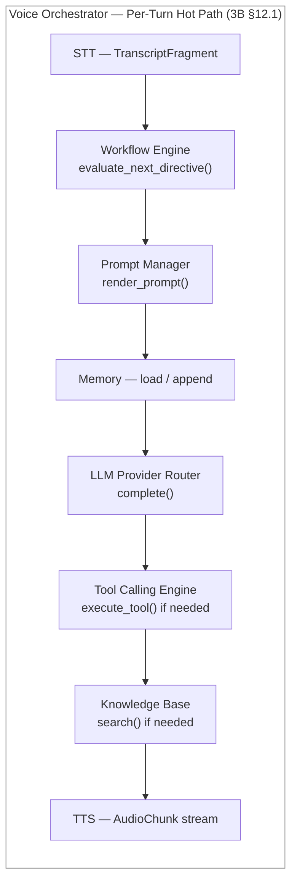
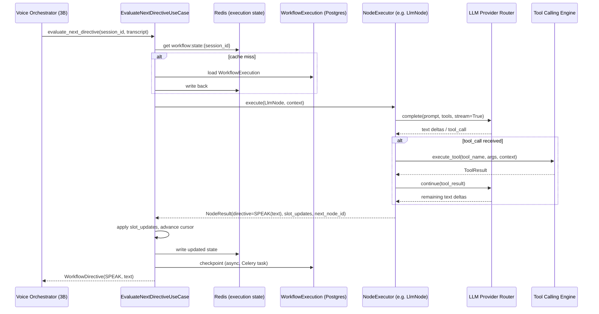
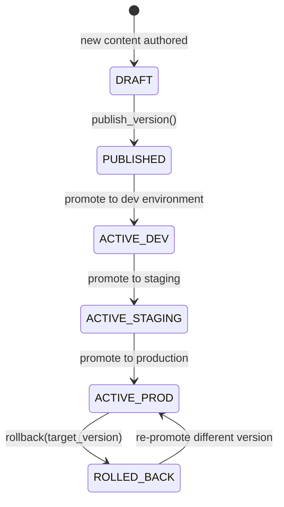
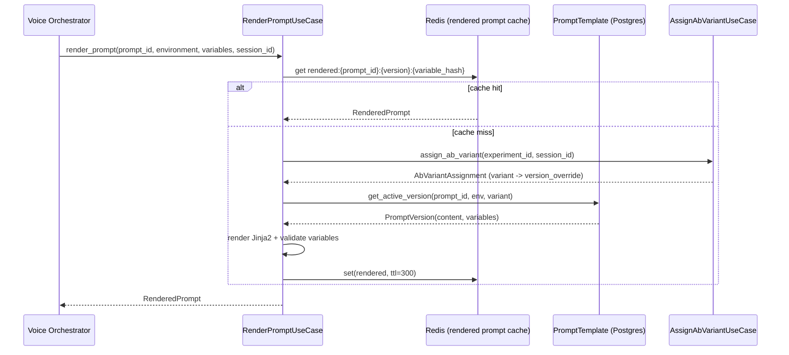
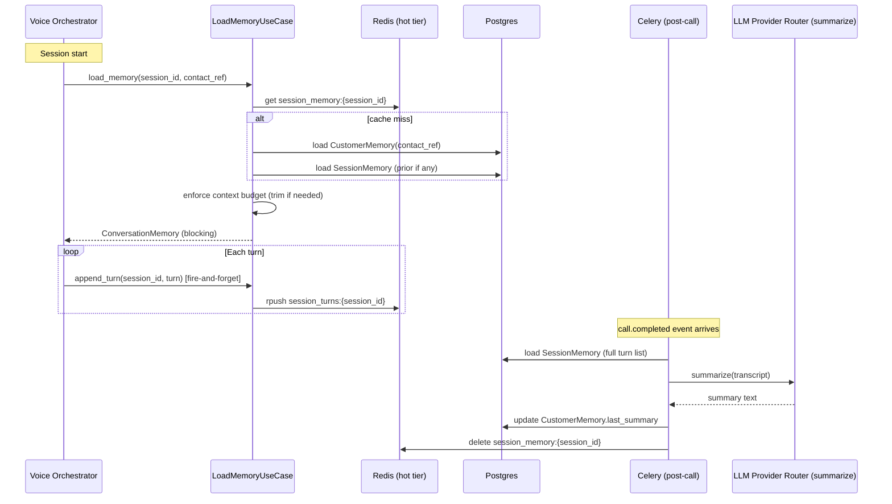
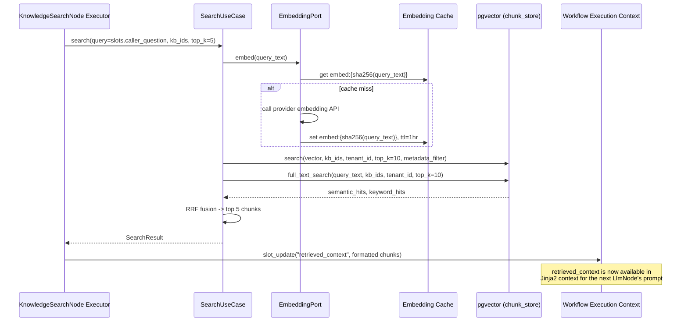
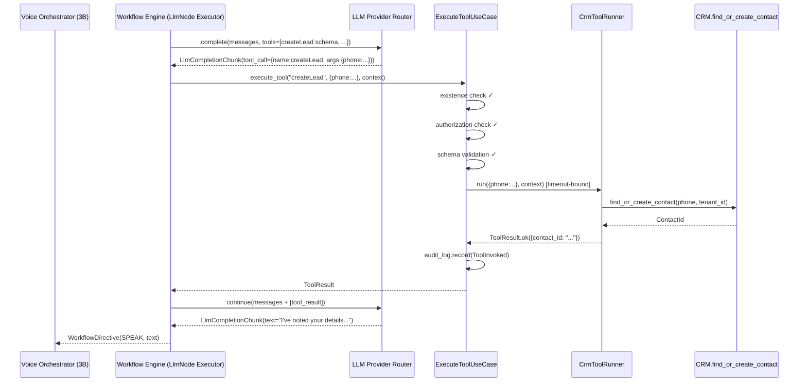
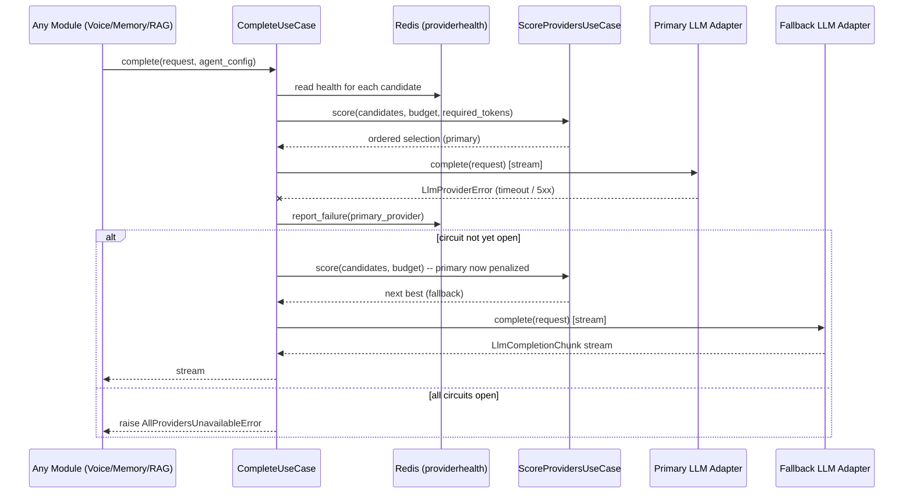
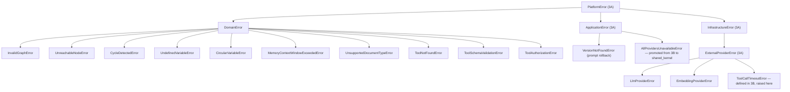

# Phase 3D — Low-Level Design: Workflow, RAG, Prompt, Memory & LLM Framework

| | |
|---|---|
| **Roadmap phase** | Phase 3 (Low-Level Design) — sub-phase 3D |
| **Status** | Draft v1.0, for review |
| **Source of truth (approved, not redesigned here)** | Phase 1 SRS, Phase 2 HLA, Phase 3A Platform Foundation, Phase 3B Voice Platform, Phase 3C CRM & Campaigns |
| **Explicitly out of scope** | Billing, Analytics, Integrations, Admin Control Plane, Testing Strategy — own phases |

## 0. Scope and Traceability

This document designs six tightly-related bounded contexts that sit at the cognitive core of every voice call: how a conversation is *directed* (Workflow Builder + Runtime), how agent instructions are *managed* (Prompt Management), how context is *remembered* (Conversation Memory), how external knowledge is *retrieved* (Knowledge Base / RAG), how *functions* are *invoked* at LLM request (Tool Calling Engine), and which *LLM provider* handles each request (LLM Provider Router). All six depend on patterns already fixed in 3A–3C and extend them consistently.

| # | Requested item | Section |
|---|---|---|
| 1 | Workflow Builder | §5 |
| 2 | Workflow Runtime | §6 |
| 3 | JSON Graph | §5.3 |
| 4 | Workflow Execution Engine | §6 |
| 5 | Prompt Manager | §7 |
| 6 | Conversation Memory | §8 |
| 7 | Knowledge Base | §9 |
| 8 | RAG | §9.5 |
| 9 | Embedding Service | §9.3 |
| 10 | Vector Search | §9.4 |
| 11 | Tool Calling Engine | §10 |
| 12 | LLM Provider Router | §11 |
| 13 | Prompt Versioning | §7.2 |
| 14 | A/B Testing | §7.4 |
| 15 | Provider Abstraction | §11.2 |
| 16 | Interfaces | §12 |
| 17 | DTOs | §13 |
| 18 | Sequence Diagrams | §6.5, §7.5, §8.5, §9.6, §10.4, §11.4 |
| 19 | Repository Layer | §14 |
| 20 | Everything required to implement | throughout |

> Code blocks are structural skeletons — signatures and key control flow — not production implementations (Phase 24).

---

## 1. Architecture Review Notes

*(Observations flagged for confirmation — nothing here changes an approved Phase 1/2/3A/3B/3C decision.)*

1. **Workflow execution per-turn vs. per-call.** 3B Review Note 1 (unresolved from 3B) left the per-turn vs. call-level workflow invocation ambiguous. This document resolves it concretely: the Workflow Engine is invoked **once per turn**, returning a `WorkflowDirective` that tells the orchestrator what to do next (speak, invoke a tool, transfer, end). The engine itself maintains execution state between turns via its own state in `WorkflowExecutionState` — a persisted cursor into the graph (§6.3). This interpretation satisfies both Phase 2's container diagram (dependency exists) and Phase 1's `FR-WF-003` ("Workflow execution engine must interpret JSON") and is flagged for confirmation.

2. **pgvector is the approved vector store at this scale.** `TECH_STACK.md` mandates pgvector. This is an intentional choice with real trade-offs documented in §9.4 — flagging so the team is aware before Phase 5 (Database Design) sets the index parameters.

3. **Embedding provider is not named anywhere upstream.** `FR-RAG-002` says "embed (pgvector)" but names no embedding vendor. `TECH_STACK.md` names LLMs (OpenAI, Anthropic, etc.) but not a dedicated embedding endpoint. This document treats embedding as a sub-capability of the configured LLM provider (OpenAI's `text-embedding-3-small` etc.) behind a standalone `EmbeddingPort` — which makes swapping providers straightforward — but the specific provider choice is left as a configuration decision to be made before Phase 24.

4. **Tool Calling and the Voice Platform's `ToolExecutionPort` (3B §13) are the same seam, viewed from both sides.** 3B defined the port; this document defines the engine that implements it. Confirming they are intentionally symmetric rather than accidental duplication.

5. **A/B testing in Prompt Management generates an experiment assignment that must be correlated back to call outcomes for measurement.** The assignment is stored on the `CallSession` (a field on the turn that's already persisted by Voice Platform). The measurement itself (which variant produced better conversion/CSAT) is an Analytics concern (Phase 19), not a Prompt Management concern — this document only defines the assignment side.

6. **Conversation Memory's summarization uses an LLM call.** This means Memory depends on the LLM Provider Router (§11), creating a circular-looking dependency: the Voice Orchestrator calls Memory which calls the Router. It's not circular — the summarization job is an *async, off-hot-path Celery task*, not an inline call in the turn loop. The Memory Port contract (§8.2) the Orchestrator uses is read-only at call time; summarization happens in background. Flagging because any future attempt to make summarization synchronous would introduce the actual circular dependency.

---

## 2. Foundation Reused From 3A / 3B / 3C

| From | Used here as |
|---|---|
| 3A Clean + Hexagonal template | All six modules follow the same `domain/application/infrastructure/interface` structure |
| 3A `AggregateRoot`, `ValueObject`, `DomainEvent` | `WorkflowDefinition`, `PromptTemplate`, `KnowledgeDocument`, `ToolDefinition` extend these |
| 3A `TenantScopedRepository` | Base for all six modules' repositories |
| 3A namespaced Redis wrapper | Execution state cursor caching (§6.3), embedding cache (§9.3), provider health (§11.3) |
| 3A DI Container | Extended with new factories per module |
| 3A `FeatureFlagPort` | A/B variant assignment (§7.4), provider rollout gating (§11.3) |
| 3A `Result` type | Expected business failures throughout (e.g., "no matching chunks found") |
| 3A `retry.py` | Embedding API retries (§9.3), LLM provider retries (§11.3) |
| 3B `LlmPort`, `ToolExecutionPort`, `MemoryPort`, `WorkflowExecutionPort` | This document implements the adapters behind those ports |
| 3B `LatencyBudget` DTO | Passed into the Router's provider selection (§11.2) |
| 3B per-turn sequence | All six modules slot into the existing turn loop via their ports — they don't change the loop shape |
| 3C cross-module port pattern | Tool Calling Engine → CRM's `book_appointment` use case follows same boundary discipline |

---

## 3. Module Folder Structure

```text
modules/
├── workflow_engine/
│   ├── domain/
│   │   ├── entities.py           # WorkflowDefinition (AR), WorkflowExecution (AR)
│   │   ├── value_objects.py      # WorkflowId, NodeId, NodeType, DirectiveKind
│   │   ├── graph.py              # WorkflowGraph — parsed + validated in-memory graph
│   │   ├── nodes/                # one file per node type — §5.2
│   │   │   ├── base_node.py
│   │   │   ├── greeting_node.py
│   │   │   ├── prompt_node.py
│   │   │   ├── llm_node.py
│   │   │   ├── decision_node.py
│   │   │   ├── condition_node.py
│   │   │   ├── branch_node.py
│   │   │   ├── knowledge_search_node.py
│   │   │   ├── tool_call_node.py
│   │   │   ├── webhook_node.py
│   │   │   ├── api_call_node.py
│   │   │   ├── delay_node.py
│   │   │   ├── transfer_node.py
│   │   │   ├── human_transfer_node.py
│   │   │   └── end_call_node.py
│   │   ├── events.py             # WorkflowExecutionStarted, NodeEntered, NodeExited,
│   │   │                         # WorkflowCompleted, WorkflowFailed
│   │   └── exceptions.py         # InvalidGraphError, UnreachableNodeError, CycleDetectedError
│   ├── application/
│   │   ├── use_cases/
│   │   │   ├── create_workflow.py
│   │   │   ├── publish_workflow.py
│   │   │   ├── evaluate_next_directive.py   # the per-turn entry point
│   │   │   └── validate_graph.py
│   │   ├── ports/
│   │   │   ├── workflow_definition_repository.py
│   │   │   ├── workflow_execution_repository.py
│   │   │   └── node_executor_registry.py    # pluggable node execution — §6.2
│   │   └── dto.py
│   ├── infrastructure/
│   │   ├── models.py
│   │   ├── repositories/
│   │   │   ├── sqlalchemy_workflow_definition_repository.py
│   │   │   └── sqlalchemy_workflow_execution_repository.py
│   │   ├── execution_state_cache.py     # Redis — §6.3
│   │   └── node_executors/              # concrete executor per node type — §6.2
│   └── interface/
│       ├── rest/router.py
│       └── events/subscribers.py
│
├── prompt_management/
│   ├── domain/
│   │   ├── entities.py           # PromptTemplate (AR), PromptVersion (Entity)
│   │   ├── value_objects.py      # PromptId, VersionTag, Environment, VariableSet
│   │   ├── events.py             # PromptPublished, PromptRolledBack, ExperimentAssigned
│   │   └── exceptions.py         # UndefinedVariableError, CircularVariableError
│   ├── application/
│   │   ├── use_cases/
│   │   │   ├── create_prompt.py
│   │   │   ├── publish_version.py
│   │   │   ├── rollback_version.py
│   │   │   ├── render_prompt.py          # the hot-path entry point
│   │   │   └── assign_ab_variant.py
│   │   ├── ports/
│   │   │   ├── prompt_template_repository.py
│   │   │   └── ab_assignment_store.py    # Redis — §7.4
│   │   └── dto.py
│   ├── infrastructure/
│   │   ├── models.py
│   │   ├── repositories/sqlalchemy_prompt_template_repository.py
│   │   └── ab_store/redis_ab_assignment_store.py
│   └── interface/
│       ├── rest/router.py
│       └── events/subscribers.py
│
├── conversation_memory/
│   ├── domain/
│   │   ├── entities.py           # CustomerMemory (AR), SessionMemory (AR), MemoryFact (Entity)
│   │   ├── value_objects.py      # MemoryId, MemoryScope, CompressionLevel
│   │   ├── events.py             # MemoryFactStored, MemorySummarized, MemoryRetrieved
│   │   └── exceptions.py         # MemoryContextWindowExceededError
│   ├── application/
│   │   ├── use_cases/
│   │   │   ├── load_memory.py          # blocking hot-path: loads for turn-1 system prompt
│   │   │   ├── append_turn.py          # fire-and-forget: called after each turn
│   │   │   └── summarize_session.py    # async: called on call.completed
│   │   ├── ports/
│   │   │   ├── customer_memory_repository.py
│   │   │   ├── session_memory_repository.py
│   │   │   └── memory_llm_port.py      # LLM port specifically for summarization — §8.3
│   │   └── dto.py
│   ├── infrastructure/
│   │   ├── models.py
│   │   ├── repositories/
│   │   │   ├── sqlalchemy_customer_memory_repository.py
│   │   │   └── sqlalchemy_session_memory_repository.py
│   │   └── llm/memory_llm_adapter.py   # wraps LLM Provider Router's public use case
│   └── interface/
│       ├── rest/router.py
│       └── events/subscribers.py        # call.completed -> summarize_session
│
├── knowledge_base/
│   ├── domain/
│   │   ├── entities.py           # KnowledgeBase (AR), KnowledgeDocument (AR),
│   │   │                         # DocumentChunk (Entity — embedded in Document)
│   │   ├── value_objects.py      # KnowledgeBaseId, DocumentId, ChunkId, EmbeddingVector,
│   │   │                         # ChunkMetadata, DocumentSource (type + uri)
│   │   ├── events.py             # DocumentIngested, DocumentDeleted, KnowledgeBaseReindexed
│   │   └── exceptions.py         # UnsupportedDocumentTypeError, ChunkingError
│   ├── application/
│   │   ├── use_cases/
│   │   │   ├── ingest_document.py      # triggers async pipeline — §9.2
│   │   │   ├── delete_document.py
│   │   │   ├── search.py               # retrieval hot-path — §9.5
│   │   │   └── reindex_knowledge_base.py
│   │   ├── ports/
│   │   │   ├── knowledge_base_repository.py
│   │   │   ├── document_repository.py
│   │   │   ├── chunk_store.py          # pgvector read/write — §9.4
│   │   │   ├── embedding_port.py       # §9.3
│   │   │   ├── document_parser_port.py # §9.2 — pluggable per MIME type
│   │   │   └── object_store_port.py    # S3/Supabase — raw document storage
│   │   └── dto.py
│   ├── infrastructure/
│   │   ├── models.py
│   │   ├── repositories/
│   │   │   ├── sqlalchemy_knowledge_base_repository.py
│   │   │   └── sqlalchemy_document_repository.py
│   │   ├── vector/pgvector_chunk_store.py
│   │   ├── embedding/openai_embedding_adapter.py     # primary — §9.3
│   │   ├── parsers/
│   │   │   ├── pdf_parser.py          # pdfplumber
│   │   │   ├── docx_parser.py         # python-docx
│   │   │   ├── csv_parser.py
│   │   │   ├── txt_parser.py
│   │   │   └── web_crawler_parser.py  # httpx + BeautifulSoup
│   │   └── storage/s3_object_store_adapter.py
│   └── interface/
│       ├── rest/router.py
│       └── events/subscribers.py
│
├── tool_calling/
│   ├── domain/
│   │   ├── entities.py           # ToolDefinition (AR), CustomToolDefinition (AR)
│   │   ├── value_objects.py      # ToolName, ToolSchema (JSON Schema), ToolCallStatus
│   │   ├── events.py             # ToolInvoked, ToolSucceeded, ToolFailed, ToolTimedOut
│   │   └── exceptions.py         # ToolNotFoundError, ToolSchemaValidationError,
│   │                             # ToolAuthorizationError
│   ├── application/
│   │   ├── use_cases/
│   │   │   ├── register_tool.py
│   │   │   ├── execute_tool.py         # public front door — implements 3B ToolExecutionPort
│   │   │   └── list_tools_for_agent.py # returns schemas for LLM function-calling spec
│   │   ├── ports/
│   │   │   ├── tool_definition_repository.py
│   │   │   └── tool_runner_registry.py  # maps ToolName -> BuiltInToolRunner | CustomToolRunner
│   │   └── dto.py
│   ├── infrastructure/
│   │   ├── models.py
│   │   ├── repositories/sqlalchemy_tool_definition_repository.py
│   │   ├── runners/
│   │   │   ├── crm_tool_runner.py      # createLead, updateLead, bookAppointment, ...
│   │   │   ├── messaging_tool_runner.py # sendWhatsApp, sendSMS, sendEmail
│   │   │   ├── call_tool_runner.py     # transferCall, hangup
│   │   │   ├── knowledge_tool_runner.py # lookupKnowledge
│   │   │   ├── task_tool_runner.py     # createTask, scheduleFollowup
│   │   │   └── custom_tool_runner.py   # Plugin SDK HTTP callout — Phase 17/18
│   │   └── adapters/
│   │       └── voice_tool_execution_adapter.py  # implements 3B ToolExecutionPort
│   └── interface/
│       ├── rest/router.py           # register/list custom tools
│       └── events/subscribers.py
│
└── llm_provider_router/
    ├── domain/
    │   ├── entities.py           # ProviderConfig (AR), ModelSpec (Entity)
    │   ├── value_objects.py      # ProviderId, ModelId, TokenCost, ContextWindow
    │   ├── events.py             # ProviderSelected, ProviderFailed, ProviderFailedOver
    │   └── exceptions.py         # AllProvidersUnavailableError — promoted to shared kernel
    ├── application/
    │   ├── use_cases/
    │   │   ├── complete.py         # primary public use case: route + stream completion
    │   │   └── score_providers.py  # pure scoring function, also unit-tested standalone
    │   ├── ports/
    │   │   ├── provider_config_repository.py
    │   │   └── provider_health_port.py    # Redis-backed, same as 3B §16
    │   └── dto.py
    ├── infrastructure/
    │   ├── models.py
    │   ├── repositories/sqlalchemy_provider_config_repository.py
    │   ├── health/redis_provider_health.py
    │   └── adapters/                      # one per approved LLM — §11.2
    │       ├── openai_adapter.py
    │       ├── anthropic_adapter.py
    │       ├── gemini_adapter.py
    │       ├── groq_adapter.py
    │       ├── openrouter_adapter.py
    │       ├── deepseek_adapter.py
    │       └── ollama_adapter.py
    └── interface/
        ├── rest/router.py           # admin: configure org-level provider preferences
        └── events/subscribers.py
```

---

## 4. How These Six Modules Fit the Turn Loop

Before designing each module independently, their relationships to one another and to the Voice Platform turn loop (3B §12.1) need to be explicit — particularly because all six are invoked, in sequence, during a single conversational turn.



**Invocation discipline:**
- `WorkflowEngine.evaluate_next_directive()` — first, because it determines *what the agent should do* before the LLM is even consulted.
- `PromptManager.render_prompt()` — second, constructs the exact system prompt the LLM will receive, incorporating the workflow directive.
- `Memory.load()` — at session start (blocking, §8.2); `append_turn()` is fire-and-forget *after* the agent responds.
- `LLMProviderRouter.complete()` — streams the LLM response, including tool-call deltas.
- `ToolCallingEngine.execute_tool()` — when the LLM emits a `tool_call` chunk.
- `KnowledgeBase.search()` — either as a tool runner within Tool Calling, or as a direct node execution inside the Workflow Engine — it is never invoked "just in case"; a workflow node or a tool call must trigger it.

---

## 5. Workflow Builder

### 5.1 Domain Model

```python
# modules/workflow_engine/domain/entities.py
class WorkflowDefinition(AggregateRoot):
    id: WorkflowId
    tenant_id: TenantId
    name: str
    description: str
    graph: WorkflowGraph              # in-memory parsed/validated graph
    published_version: int | None
    draft_version: int
    is_published: bool

    def publish(self) -> None:
        if not self.graph.validate():
            raise InvalidGraphError(self.id, self.graph.validation_errors)
        self.published_version = self.draft_version
        self.is_published = True
        self.record_event(WorkflowPublished(self.id, self.published_version))
```

**Versions are integers, not semver.** The invariant is: `draft_version >= published_version`. A live call always runs the `published_version`'s pinned JSON (`FR-WF-004`). Editing the draft never touches a running call — the execution cursor (§6.3) stores a snapshot of the graph at the time the call started, not a live reference.

### 5.2 Node Types

Each node type is modeled as a dataclass (the *definition*) separate from its *executor* (§6.2) — open/closed principle (`CODING_STANDARDS.md`): adding a new node type means adding one file to `domain/nodes/` and one to `infrastructure/node_executors/`, nothing else.

```python
# modules/workflow_engine/domain/nodes/base_node.py
@dataclass(frozen=True)
class BaseNode:
    node_id: NodeId
    node_type: NodeType
    label: str
    metadata: dict[str, Any]           # arbitrary builder-authored metadata

# modules/workflow_engine/domain/nodes/llm_node.py
@dataclass(frozen=True)
class LlmNode(BaseNode):
    prompt_ref: PromptId | None        # None = use agent's default prompt
    tools_enabled: bool
    knowledge_base_ids: list[KnowledgeBaseId]
    max_turns: int | None              # None = unlimited

# modules/workflow_engine/domain/nodes/decision_node.py
@dataclass(frozen=True)
class DecisionNode(BaseNode):
    condition_expression: str          # safe expression — see §5.4
    true_edge: NodeId
    false_edge: NodeId

# modules/workflow_engine/domain/nodes/tool_call_node.py
@dataclass(frozen=True)
class ToolCallNode(BaseNode):
    tool_name: ToolName
    argument_template: dict            # Jinja2 fragments mapping call context to tool args
    on_success_edge: NodeId
    on_failure_edge: NodeId
```

Full node catalogue (15 types from `FR-WF-002`):

| Node | Directive produced | Key fields |
|---|---|---|
| `GreetingNode` | `SPEAK(greeting_text)` | `greeting_template` |
| `PromptNode` | `CONTINUE` (sets system context) | `prompt_ref`, `inject_position` |
| `LlmNode` | `SPEAK(llm_response)` or `EXECUTE_TOOL` | `prompt_ref`, `tools_enabled`, `knowledge_base_ids` |
| `DecisionNode` | `CONTINUE` to `true_edge` or `false_edge` | `condition_expression` |
| `ConditionNode` | `CONTINUE` to matched branch | `conditions: list[ConditionBranch]` |
| `BranchNode` | `CONTINUE` to selected branch | `slot_variable`, `branches` |
| `KnowledgeSearchNode` | `CONTINUE` + injects retrieved context | `knowledge_base_ids`, `query_template` |
| `ToolCallNode` | `EXECUTE_TOOL` | `tool_name`, `argument_template` |
| `WebhookNode` | `CONTINUE` after HTTP POST | `url_template`, `payload_template`, `timeout_ms` |
| `ApiCallNode` | `CONTINUE` after HTTP GET/POST | `method`, `url_template`, `headers` |
| `DelayNode` | `DELAY(ms)` | `duration_ms` |
| `TransferNode` | `TRANSFER(number)` | `transfer_number_expression` |
| `HumanTransferNode` | `TRANSFER_TO_HUMAN` | `queue_id`, `announcement_template` |
| `EndCallNode` | `END_CALL` | `farewell_template`, `status` |

### 5.3 JSON Graph Schema

The authoritative format stored in `workflow_definitions.graph_json`. Designed to be the minimal representation a Visual Workflow Builder UI needs to serialize and that the Execution Engine needs to run — nothing more.

```json
{
  "schema_version": "1.0",
  "entry_node_id": "node_001",
  "nodes": [
    {
      "node_id": "node_001",
      "node_type": "greeting",
      "label": "Welcome Caller",
      "config": {
        "greeting_template": "Hello, I'm {{ agent.name }}. How can I help you today?"
      }
    },
    {
      "node_id": "node_002",
      "node_type": "llm",
      "label": "Main Conversation",
      "config": {
        "prompt_ref": "prompt_abc123",
        "tools_enabled": true,
        "knowledge_base_ids": ["kb_xyz"],
        "max_turns": null
      }
    },
    {
      "node_id": "node_003",
      "node_type": "decision",
      "label": "Qualify?",
      "config": {
        "condition_expression": "slots.intent == 'buy'",
        "true_edge": "node_004",
        "false_edge": "node_005"
      }
    },
    {
      "node_id": "node_004",
      "node_type": "tool_call",
      "label": "Create Lead",
      "config": {
        "tool_name": "createLead",
        "argument_template": {
          "name": "{{ slots.caller_name }}",
          "phone": "{{ session.from_number }}"
        },
        "on_success_edge": "node_006",
        "on_failure_edge": "node_005"
      }
    },
    {
      "node_id": "node_006", "node_type": "end_call",
      "label": "Goodbye",
      "config": { "farewell_template": "Thank you, {{ slots.caller_name }}. Goodbye!" }
    },
    {
      "node_id": "node_005", "node_type": "end_call",
      "label": "Not Qualified",
      "config": { "farewell_template": "Thank you for calling. Goodbye!" }
    }
  ]
}
```

**`slots`** is the engine's runtime key-value store for named values extracted during the call (caller name, intent, etc.) — analogous to dialog-act slots in classical dialog systems. `session` exposes read-only call metadata. Both namespaces are available in every template/expression context within the graph.

### 5.4 Graph Validation

Run on `publish()` and also on API `POST /workflows/{id}/validate`.

```python
# modules/workflow_engine/application/use_cases/validate_graph.py
class ValidateGraphUseCase:
    def execute(self, definition: WorkflowDefinition) -> ValidationResult:
        graph = definition.graph
        errors: list[str] = []
        errors += self._check_entry_node_exists(graph)
        errors += self._check_all_edge_targets_exist(graph)
        errors += self._check_no_unreachable_nodes(graph)          # DFS from entry
        errors += self._check_no_unconstrained_cycles(graph)       # cycle allowed only with a max_turns guard
        errors += self._check_condition_expressions_safe(graph)    # whitelist-based eval — §5.5
        return ValidationResult(valid=len(errors) == 0, errors=errors)
```

### 5.5 Expression Safety in Condition Nodes

**Problem:** `condition_expression` is a user-authored string that gets evaluated at runtime — an injection surface if evaluated with `eval()`. **Solution:** a whitelist-based safe evaluator (e.g., `simpleeval` or a hand-rolled recursive descent parser over a grammar that allows only: field access on `slots`/`session`/`tool_results`, string/numeric comparison operators, `and`/`or`/`not`, parentheses, string/numeric literals). **What is explicitly forbidden:** imports, function calls not on the whitelist, assignment, and any access to Python builtins. This is evaluated at validation time AND at runtime — a tampered graph that bypasses the validation API still hits the same check at execution time.

---

## 6. Workflow Runtime (Execution Engine)

### 6.1 WorkflowExecution Aggregate

```python
class WorkflowExecution(AggregateRoot):
    id: WorkflowExecutionId
    session_id: SessionId
    tenant_id: TenantId
    workflow_id: WorkflowId
    pinned_graph_json: str             # snapshot at call start — never mutated mid-call
    current_node_id: NodeId
    slots: dict[str, Any]             # named values accumulated during the call
    turn_count_at_node: dict[NodeId, int]   # enforces LlmNode.max_turns
    status: ExecutionStatus            # ACTIVE | COMPLETED | FAILED
```

### 6.2 Node Executor Registry

Open/closed extension mechanism. Every node type has a corresponding executor registered in the `NodeExecutorRegistry` port.

```python
# modules/workflow_engine/application/ports/node_executor_registry.py
class NodeExecutorRegistry(Protocol):
    def get(self, node_type: NodeType) -> NodeExecutor: ...

# modules/workflow_engine/infrastructure/node_executors/base.py
class NodeExecutor(Protocol):
    async def execute(self, node: BaseNode, context: ExecutionContext) -> NodeResult: ...

# ExecutionContext carries:
#   - session: CallSessionSnapshot (read-only)
#   - slots: dict (mutable by executors — slot-filling)
#   - last_transcript: str
#   - tool_results: dict[ToolName, ToolResult]
#   - tenant_id, agent_id
```

Each executor in `infrastructure/node_executors/` is registered at DI container build time — no factory `if/elif` chains in the registry itself.

### 6.3 Execution State — Two-Tier (Same Pattern as 3B Session)

| Tier | Store | Content | TTL |
|---|---|---|---|
| Hot | Redis `workflow:state:{session_id}` | `current_node_id`, `slots`, `turn_count_at_node` | Call duration + 10 min grace |
| Durable | PostgreSQL `workflow_executions` | Full `WorkflowExecution`, checkpointed per turn | Permanent (audit trail) |

**Rationale:** same reasoning as 3B §7 — the execution cursor is read/written on every turn (potentially many times per call) so Redis is mandatory for latency. Postgres is mandatory for correctness if the pod dies mid-call.

### 6.4 Per-Turn Directive Evaluation

```python
# modules/workflow_engine/application/use_cases/evaluate_next_directive.py
class EvaluateNextDirectiveUseCase:
    async def execute(self, session_id: SessionId, transcript: str) -> WorkflowDirective:
        execution = await self._load_from_cache_or_db(session_id)
        node = execution.graph.get_node(execution.current_node_id)
        executor = self._registry.get(node.node_type)

        result: NodeResult = await executor.execute(node, self._build_context(execution, transcript))
        # NodeResult carries: directive, slot_updates, next_node_id | None

        execution.slots.update(result.slot_updates)
        if result.next_node_id:
            execution.current_node_id = result.next_node_id
        await self._checkpoint(execution)
        return result.directive
```

### 6.5 Sequence — Inbound Turn With Workflow



---

## 7. Prompt Management

### 7.1 Domain Model

```python
class PromptTemplate(AggregateRoot):
    id: PromptId
    tenant_id: TenantId
    name: str
    current_version: int
    versions: list[PromptVersion]      # all version history — bounded, rarely > 50
    active_version_per_environment: dict[Environment, int]

    def publish_version(self, content: str, variables: VariableSet, author: UserId) -> int:
        new_version = self.current_version + 1
        self.versions.append(PromptVersion(version=new_version, content=content,
                                           variables=variables, authored_by=author))
        self.current_version = new_version
        self.record_event(PromptPublished(self.id, new_version))
        return new_version

    def rollback(self, target_version: int, environment: Environment) -> None:
        if not any(v.version == target_version for v in self.versions):
            raise VersionNotFoundError(self.id, target_version)
        self.active_version_per_environment[environment] = target_version
        self.record_event(PromptRolledBack(self.id, target_version, environment))
```

`PromptVersion` is embedded in `PromptTemplate` — bounded collection (version history per prompt). `versions` list is lazy-loaded on write operations; the read-path (`render_prompt`) fetches only the specific active version.

### 7.2 Prompt Versioning



Each environment (`local`, `staging`, `production`) independently pins a version. A rollback in production doesn't affect staging. This is enforced by `active_version_per_environment: dict[Environment, int]` — a simple key-value on the aggregate, not a separate state machine.

### 7.3 Prompt Rendering

Variable substitution is strict-by-default: any variable referenced in the template (`{{ variable_name }}`) that is not supplied in the `render_prompt` call raises `UndefinedVariableError` (not silently replaced with an empty string) — because a silently empty variable in an agent system prompt is more dangerous than a failed render.

```python
# modules/prompt_management/application/use_cases/render_prompt.py
class RenderPromptUseCase:
    async def execute(self, prompt_id: PromptId, environment: Environment,
                      variables: dict[str, Any], ab_context: AbContext | None = None) -> RenderedPrompt:
        template = await self._repository.get_active_version(prompt_id, environment, ab_context)
        missing = template.variables.required - set(variables)
        if missing:
            raise UndefinedVariableError(prompt_id, missing)
        rendered = self._jinja_env.from_string(template.content).render(**variables)
        return RenderedPrompt(text=rendered, version=template.version, prompt_id=prompt_id)
```

**Jinja2, not f-strings.** Jinja2 is used deliberately because it supports: conditional blocks (``), loops, filters, and whitespace control — all of which appear in real agent prompts. f-strings require the template to be Python source; Jinja2 keeps the template as data (stored in Postgres, user-editable in the builder UI). The `jinja_env` is configured with `undefined=StrictUndefined` (raises rather than silently substituting) and with the autoescaping of dangerous characters on.

### 7.4 A/B Testing

Implements `FR-PROMPT-004`. Assignment is deterministic per `(session_id, experiment_id)` — the same session always gets the same variant, which matters because a turn-1 assignment must hold for turn-N of the same call.

```python
# modules/prompt_management/application/use_cases/assign_ab_variant.py
class AssignAbVariantUseCase:
    async def execute(self, experiment_id: ExperimentId, session_id: SessionId,
                      tenant_id: TenantId) -> AbVariantAssignment:
        # 1. Check Redis for existing assignment (determinism within a session)
        cached = await self._assignment_store.get(experiment_id, session_id)
        if cached:
            return cached
        # 2. Load experiment config (variant weights from DB)
        experiment = await self._repo.get_experiment(experiment_id, tenant_id)
        # 3. Deterministic hash assignment (no randomness in the hot path)
        variant = self._hash_assign(session_id, experiment.variants)
        assignment = AbVariantAssignment(experiment_id, session_id, variant)
        # 4. Persist to Redis (TTL = max call duration) and DB (for analytics)
        await self._assignment_store.set(assignment)
        return assignment

    def _hash_assign(self, session_id: SessionId, variants: list[Variant]) -> Variant:
        bucket = int(hashlib.md5(str(session_id).encode()).hexdigest(), 16) % 100
        cumulative = 0
        for variant in variants:
            cumulative += variant.weight_percent
            if bucket < cumulative:
                return variant
        return variants[-1]
```

Measurement (which variant produced better conversion/CSAT) is Phase 19 (Analytics) — Review Note 5. The assignment record written to the DB here is what Phase 19 joins against call outcomes.

### 7.5 Sequence — Prompt Render at Turn Start



**Rendered prompt cache key includes `variable_hash`** because variables change per session (caller name, current date, agent name) — an identical template rendered with different variables must not share a cache entry.

---

## 8. Conversation Memory

### 8.1 Three Memory Scopes

| Scope | Entity | Persistence | What it holds |
|---|---|---|---|
| Session | `SessionMemory` | PostgreSQL + Redis hot-tier | Transcript turns of the current call; flushed after summarization |
| Customer | `CustomerMemory` | PostgreSQL | Persistent facts about this specific contact: name, expressed preferences, prior call outcomes, extracted facts |
| Organization | (a special `CustomerMemory` with `scope=ORG`) | PostgreSQL | Global facts for the org's agents: business hours, product details that don't belong in the KB |

**Why not a single `Memory` table with a `scope` column?** Session memory has a completely different write pattern (append-only per turn, high frequency, short retention), query pattern (ordered, full list retrieval), and TTL than Customer memory (point lookups, long-term, rarely written). Mixing them in one table optimizes for neither. Organization-scoped memory is rare enough that reusing the `CustomerMemory` table with a `contact_ref = NULL` + a `scope` discriminator is the KISS choice — it doesn't need its own table.

### 8.2 Domain Model

```python
class SessionMemory(AggregateRoot):
    id: MemoryId
    session_id: SessionId
    tenant_id: TenantId
    turns: list[MemoryTurn]              # bounded by call length — embedded safely
    compression_level: CompressionLevel  # NONE | SUMMARIZED | COMPRESSED
    summary: str | None                  # populated after summarization

class CustomerMemory(AggregateRoot):
    id: MemoryId
    contact_ref: ContactId | None        # None = organization-scoped
    tenant_id: TenantId
    scope: MemoryScope
    facts: list[MemoryFact]              # named key-value facts with confidence + source
    last_call_summary: str | None
```

```python
@dataclass(frozen=True)
class MemoryFact:
    key: str
    value: str
    confidence: float                    # 0.0–1.0; allows soft-override by newer evidence
    source: str                          # e.g. "call:session_abc" or "manual_entry"
    recorded_at: datetime
```

### 8.3 Memory Load — What Gets Injected Into the System Prompt

The output of `load_memory()` is a `ConversationMemory` DTO carrying three optional blocks the Prompt Manager injects as `{{ memory.customer_facts }}`, `{{ memory.last_summary }}`, and `{{ memory.session_turns }}` variables:

```python
@dataclass(frozen=True)
class ConversationMemory:
    customer_facts: str | None       # formatted key-value facts
    last_summary: str | None         # summary of the previous call (if any)
    session_turns: str | None        # recent turn history (compressed if > context budget)
```

**Context budget enforcement:** before returning, `load_memory` measures the token count of the assembled memory block (using the same tokenizer as the selected LLM — passed in as a parameter). If it exceeds a configured `max_memory_tokens`, the oldest session turns are dropped first (they're most redundant given the running transcript), then customer facts are summarized further. This is the `MemoryContextWindowExceededError`-avoidance path — the error is never raised at turn time, only if even after compression the memory exceeds the hard ceiling.

### 8.4 Summarization — Async, Off Hot Path (Review Note 6)

```python
# modules/conversation_memory/application/use_cases/summarize_session.py
class SummarizeSessionUseCase:
    async def execute(self, session_id: SessionId) -> None:
        session_memory = await self._session_repo.get(session_id)
        full_transcript = "\n".join(f"{t.speaker}: {t.text}" for t in session_memory.turns)
        summary = await self._memory_llm.summarize(full_transcript)
        await self._customer_repo.update_last_summary(session_memory.contact_ref, summary)
        await self._session_repo.mark_summarized(session_memory.id, summary)
```

`_memory_llm` is a `MemoryLlmPort` whose adapter calls the LLM Provider Router's public `complete()` use case with a fixed "summarize this transcript" system prompt — a concrete application of the same cross-module port pattern used throughout 3B/3C.

### 8.5 Sequence — Memory Lifecycle



---

## 9. Knowledge Base & RAG

### 9.1 Domain Model

```python
class KnowledgeBase(AggregateRoot):
    id: KnowledgeBaseId
    tenant_id: TenantId
    name: str
    version: int                         # incremented on each full reindex

class KnowledgeDocument(AggregateRoot):
    id: DocumentId
    knowledge_base_id: KnowledgeBaseId
    tenant_id: TenantId
    source: DocumentSource               # (type=PDF|DOCX|TXT|CSV|URL|FAQ, uri=s3://...)
    status: DocumentStatus               # PENDING | PROCESSING | INDEXED | FAILED
    chunks: list[DocumentChunk]          # embedded — bounded by document length
    chunk_count: int
```

`DocumentChunk` is embedded (not a separate repository) because chunks are only ever created, read, or deleted as a unit alongside their parent document — there is no use case that loads a `DocumentChunk` without loading the `KnowledgeDocument`.

### 9.2 Ingestion Pipeline

```mermaid
flowchart LR
    Upload["API: upload file / submit URL"] --> Store["S3 / Supabase Storage"]
    Store --> Job["Create KnowledgeDocument (status=PENDING)"]
    Job --> Queue["Celery task: process_document"]
    Queue --> Parser["DocumentParserPort.parse() -> list~TextChunk~"]
    Parser --> Chunker["Chunker: fixed/semantic split"]
    Chunker --> Embedder["EmbeddingPort.embed_batch()"]
    Embedder --> VStore["pgvector chunk_store.upsert()"]
    VStore --> Doc["KnowledgeDocument status=INDEXED"]
    Doc --> Event["DocumentIngested event"]
```



**Why a persistent job record, not just a Celery task?** At "unlimited documents" scale, a task ID alone gives no way to query the ingestion status, resume after a worker crash, or retry a specific document. A `KnowledgeDocument` with `status=PROCESSING/FAILED/INDEXED` plus `error_message` gives the Admin UI a queryable, auditable, retryable ingestion state — the same reasoning as 3C's `CsvImportJob`.

### 9.3 Embedding Service

```python
# modules/knowledge_base/application/ports/embedding_port.py
class EmbeddingPort(Protocol):
    async def embed(self, text: str) -> EmbeddingVector: ...
    async def embed_batch(self, texts: list[str]) -> list[EmbeddingVector]: ...
    def dimensions(self) -> int: ...
    def model_name(self) -> str: ...
```

`embed_batch()` is the critical method for ingestion — batching embedding calls to the provider reduces API round-trips, cost, and wall-clock time dramatically vs. `embed()` per chunk.

**Embedding cache (Redis):** `embed_single()` responses are cached keyed on `sha256(text)` — query embeddings (§9.5) are usually short repeated phrases ("What are your business hours?") that hit cache often; document chunk embeddings are written once and never re-computed unless the document is re-indexed.

**Why embedding is a port and not a direct LLM adapter call:** the model used for embedding must be **consistent** — a document's stored vectors must match the query vector's dimensionality and model. Changing the embedding model requires a full reindex. Making this explicit at the port level means the provider's `model_name()` and `dimensions()` are first-class values stored on the `KnowledgeBase`, so a mismatch between query-time and index-time model is a detectable error rather than a silent dimensionality mismatch. (Review Note 3 — embedding provider not yet named; this port is where the decision is enforced once made.)

### 9.4 Vector Search — pgvector

```python
# modules/knowledge_base/infrastructure/vector/pgvector_chunk_store.py
class PgvectorChunkStore:
    async def upsert_chunks(self, document: KnowledgeDocument, vectors: list[EmbeddingVector]) -> None: ...

    async def search(self, query_vector: EmbeddingVector, knowledge_base_ids: list[KnowledgeBaseId],
                     tenant_id: TenantId, top_k: int, metadata_filter: dict | None) -> list[ScoredChunk]:
        # Uses pgvector cosine similarity operator `<=>`
        # WHERE tenant_id = :tenant_id AND knowledge_base_id = ANY(:ids)
        #   AND (:metadata_filter IS NULL OR metadata @> :metadata_filter)
        # ORDER BY embedding <=> :query_vector
        # LIMIT :top_k
        ...
```

**pgvector trade-offs (Review Note 2), stated explicitly for Phase 5 design:**

| Consideration | pgvector behaviour | Implication |
|---|---|---|
| Index type | HNSW (approximate) or IVFFlat (exact at small scale) | HNSW is the right choice at "millions of documents" scale; Phase 5 must decide `m` and `ef_construction` parameters |
| Concurrent writes | pgvector's HNSW index rebuild is expensive per-insert at scale | Bulk ingestion should use unindexed inserts + periodic `VACUUM`/index rebuild, not per-chunk index maintenance |
| Dimensionality | Fixed at table creation (`vector(1536)` for OpenAI ada-002, `vector(3072)` for text-embedding-3-large) | Changing models requires schema migration + full reindex; this cost is why `model_name()` + `dimensions()` are first-class |
| Tenant isolation | `tenant_id` filter applied before ANN scan via a partial index | Phase 5 must create `CREATE INDEX ON document_chunks (tenant_id, knowledge_base_id)` separately from the vector index |

### 9.5 RAG Retrieval — Hybrid Search

Implements `FR-RAG-003`. The retrieval result is a combination of semantic (vector) and keyword (BM25-style full-text) search, with reciprocal rank fusion to merge the two result lists.

```python
# modules/knowledge_base/application/use_cases/search.py
class SearchUseCase:
    async def execute(self, request: SearchRequest) -> SearchResult:
        # 1. Embed the query (cached — §9.3)
        query_vector = await self._embedding.embed(request.query_text)
        # 2. Parallel semantic + keyword search
        semantic_hits, keyword_hits = await asyncio.gather(
            self._chunk_store.search(query_vector, request.knowledge_base_ids,
                                     request.tenant_id, top_k=request.top_k * 2,
                                     metadata_filter=request.metadata_filter),
            self._chunk_store.full_text_search(request.query_text,
                                               request.knowledge_base_ids,
                                               request.tenant_id, top_k=request.top_k * 2),
        )
        # 3. Reciprocal Rank Fusion
        fused = self._rrf(semantic_hits, keyword_hits, k=60)[:request.top_k]
        return SearchResult(chunks=fused, query=request.query_text)
```

**Reciprocal Rank Fusion formula:** `score(d) = Σ 1 / (k + rank(d))` across all result lists — a standard, parameter-light fusion function that outperforms naive score normalization on mixed-relevance lists without requiring calibrated similarity thresholds.

**Why hybrid, not semantic-only?** Semantic search (embedding cosine similarity) handles paraphrases and conceptual matches well but struggles with exact-match terms (product codes, proper names, numeric identifiers) that are critical in a business knowledge base. Keyword search handles those precisely. Hybrid fuses both strengths with a simple, auditable function.

### 9.6 Sequence — RAG During a Call Turn



---

## 10. Tool Calling Engine

### 10.1 Design Decision — A Unified Registry, Not N Separate Services

**Alternative considered:** separate deployable microservices per tool category (CRM tools, messaging tools, call tools). **Rejected** — the Tool Calling Engine's value is a *single, audited, schema-validated execution path* for any tool the LLM requests; splitting it means duplicating that path's auth check, timeout enforcement, result logging, and error handling across N services. A unified registry with pluggable `ToolRunner` implementations is the cleaner application of DRY + Hexagonal.

### 10.2 Tool Registration

A `ToolDefinition` aggregate describes the schema the LLM sees. The Engine provides this schema list to `list_tools_for_agent()` — the Voice Orchestrator passes it to the `LlmPort.complete()` call so the LLM knows what functions it can call.

```python
class ToolDefinition(AggregateRoot):
    name: ToolName                         # globally unique within a tenant
    display_name: str
    description: str                       # what the LLM reads to decide whether to call this tool
    input_schema: JsonSchema               # JSON Schema object — validated against on every invocation
    output_schema: JsonSchema
    is_built_in: bool
    requires_confirmation: bool            # if True, Orchestrator must get human approval (Phase 17)
    timeout_ms: int                        # per FR-TOOL-004
    allowed_agent_ids: list[AgentId]       # empty = available to all agents in the tenant
```

### 10.3 Execution — Schema Validation + Audit Trail

```python
# modules/tool_calling/application/use_cases/execute_tool.py
class ExecuteToolUseCase:
    async def execute(self, tool_name: ToolName, arguments: dict,
                      context: ToolCallContext) -> ToolResult:
        definition = await self._tool_repo.get(tool_name, context.tenant_id)
        if definition is None:
            raise ToolNotFoundError(tool_name)
        if not self._is_authorized(definition, context):
            raise ToolAuthorizationError(tool_name, context.agent_id)
        validation_errors = self._json_schema_validator.validate(arguments, definition.input_schema)
        if validation_errors:
            raise ToolSchemaValidationError(tool_name, validation_errors)
        runner = self._runner_registry.get(tool_name)
        try:
            result = await asyncio.wait_for(
                runner.run(arguments, context),
                timeout=definition.timeout_ms / 1000,
            )
        except TimeoutError:
            raise ToolCallTimeoutError(tool_name, definition.timeout_ms)
        await self._audit_log.record(ToolInvoked(tool_name, context.session_id, result.success))
        return result
```

**Four enforcement points baked into the single execution path:**
1. Existence check — the LLM can hallucinate a tool name; the registry is the authoritative list.
2. Authorization — a tool may not be available to every agent in the tenant.
3. Schema validation — protects tool runners from malformed LLM output.
4. Timeout — enforces `FR-TOOL-004`'s "timeout-bound" requirement; 3B's `ToolCallTimeoutError` is raised here.

All four steps are skipped by no runner — they're in the single use case, not delegated to individual runners, so a runner added later gets them for free.

### 10.4 Built-In Tool Runners

```python
# modules/tool_calling/infrastructure/runners/crm_tool_runner.py
class CrmToolRunner:
    _SUPPORTED: frozenset[ToolName] = frozenset({
        "createLead", "updateLead", "bookAppointment", "createTask", "scheduleFollowup"
    })
    async def run(self, arguments: dict, context: ToolCallContext) -> ToolResult:
        match arguments.get("_tool_name"):
            case "createLead":
                result = await self._find_or_create_contact.execute(...)
                return ToolResult.ok({"contact_id": str(result.contact_id)})
            case "bookAppointment":
                result = await self._book_appointment.execute(...)
                return ToolResult.ok({"appointment_id": str(result.appointment_id)})
            ...
```

**Pattern:** each runner calls its target module's *public use case* — never the module's repositories directly. Same discipline as 3B §13 and 3C §6.7.

### 10.5 Sequence — Tool Calling Flow Within a Turn



---

## 11. LLM Provider Router

### 11.1 Module Role Relative to 3B §11

3B §9's `ModelRouter` was an *application service* inside the Voice Orchestration module — designed with skeletal intent. This document replaces that skeleton with a proper bounded context (`llm_provider_router/`) that owns provider configurations, health state, and the routing algorithm, and exposes a public `CompleteUseCase` that any module (Voice, Memory's summarizer, RAG's reranker) calls.

**Why promote it to its own bounded context?** Three different modules need LLM completions by the time this document is done: Voice Orchestration (turn generation), Conversation Memory (summarization), and potentially RAG (reranking). Leaving the router inside Voice Orchestration would make Memory and RAG depend on the Voice module — a direct violation of 3A's module-boundary rule. A separate module with a public use case is the correct Hexagonal solution.

### 11.2 Provider Abstraction — Canonical Wire Protocol

All seven adapters normalize to the same internal `LlmCompletionRequest` / `LlmCompletionChunk` types defined in 3B §15.2. Each adapter is responsible for:

1. Translating `LlmCompletionRequest.tools` to the provider's function-calling format (OpenAI: `tools=[...]`, Anthropic: `tools=[...]` with different schema, Gemini: `function_declarations=[...]`).
2. Normalizing streaming response deltas to `LlmCompletionChunk.delta_text` or `LlmCompletionChunk.tool_call: CanonicalToolCall`.
3. Mapping provider-specific error types to `LlmProviderError` (a subclass of 3A's `ExternalProviderError`).

```python
# modules/llm_provider_router/infrastructure/adapters/openai_adapter.py
class OpenAiAdapter(LlmPort):
    async def complete(self, request: LlmCompletionRequest) -> AsyncIterator[LlmCompletionChunk]:
        payload = self._to_openai_format(request)
        async with self._client.stream("POST", "/v1/chat/completions", json=payload) as response:
            async for raw_chunk in response.aiter_lines():
                if raw_chunk.startswith("data: "):
                    yield self._normalize_chunk(raw_chunk[6:])
```

### 11.3 Routing Algorithm — Extends 3B §11

The `ModelRouter` service is now the `ScoreProvidersUseCase`, a pure function (no I/O) that reads pre-computed health data:

```python
@dataclass(frozen=True)
class ProviderCandidate:
    provider_id: ProviderId
    model_id: ModelId
    context_window: int
    cost_per_token: TokenCost
    p50_latency_ms: int               # read from Redis health store
    is_circuit_open: bool             # read from Redis health store

class ScoreProvidersUseCase:
    def execute(self, candidates: list[ProviderCandidate],
                budget: LatencyBudget, required_context_tokens: int) -> ProviderCandidate:
        eligible = [c for c in candidates
                    if not c.is_circuit_open
                    and c.context_window >= required_context_tokens]
        if not eligible:
            raise AllProvidersUnavailableError([c.provider_id for c in candidates])
        return max(eligible, key=lambda c: self._score(c, budget))

    def _score(self, c: ProviderCandidate, budget: LatencyBudget) -> float:
        latency_fit = max(0, budget.llm_target_ms - c.p50_latency_ms) / budget.llm_target_ms
        cost_fit = 1.0 - (c.cost_per_token.value / self._max_cost_per_token)
        return (self._weights.latency * latency_fit
              + self._weights.cost * cost_fit)
```

**Circuit breaker:** the `RedisProviderHealth` store (shared with 3B's voice path) tracks consecutive failures per provider. When a threshold is exceeded, `is_circuit_open = True` — the provider is excluded from `eligible` entirely until a health-polling worker (3B §18.2, reused, runs in the shared `apps/worker` deployable) resets it after a cooldown. This is the same Redis key (`providerhealth:{provider_name}`) already defined in 3B §16 — not a new key, and intentionally shared so that Voice Platform failures and Memory/RAG LLM failures affect the same circuit state.

### 11.4 Fallback Sequence



---

## 12. Interfaces & Ports — Consolidated Reference

| Port | Module | Key methods | Concrete adapters |
|---|---|---|---|
| `WorkflowDefinitionRepository` | Workflow Engine | `get_published(id, tenant_id)`, `save` | SQLAlchemy |
| `WorkflowExecutionRepository` | Workflow Engine | `get_by_session(session_id)`, `save` | SQLAlchemy |
| `NodeExecutorRegistry` | Workflow Engine | `get(node_type) -> NodeExecutor` | In-memory registry, built at DI container startup |
| `PromptTemplateRepository` | Prompt Management | `get_active_version(id, env, variant)`, `save` | SQLAlchemy |
| `AbAssignmentStore` | Prompt Management | `get(experiment_id, session_id)`, `set(assignment)` | Redis |
| `CustomerMemoryRepository` | Conversation Memory | `get_by_contact(contact_ref, tenant_id)`, `save` | SQLAlchemy |
| `SessionMemoryRepository` | Conversation Memory | `get(session_id)`, `append_turn`, `mark_summarized` | SQLAlchemy + Redis hot-tier |
| `MemoryLlmPort` | Conversation Memory | `summarize(transcript) -> str` | Adapter → `llm_provider_router.complete` public use case |
| `KnowledgeBaseRepository` | Knowledge Base | `get(id, tenant_id)`, `save` | SQLAlchemy |
| `DocumentRepository` | Knowledge Base | `get(id, tenant_id)`, `save` | SQLAlchemy |
| `ChunkStore` | Knowledge Base | `upsert_chunks`, `search`, `full_text_search`, `delete_by_document` | pgvector (PostgreSQL) |
| `EmbeddingPort` | Knowledge Base | `embed(text)`, `embed_batch(texts)`, `dimensions()`, `model_name()` | OpenAI (primary) — Review Note 3 |
| `DocumentParserPort` | Knowledge Base | `parse(raw_bytes, mime_type) -> list~TextChunk~` | Per-type parsers (PDF, DOCX, CSV, TXT, URL) |
| `ObjectStorePort` | Knowledge Base | `put(key, bytes)`, `get(key)`, `delete(key)` | S3 adapter |
| `ToolDefinitionRepository` | Tool Calling | `get(name, tenant_id)`, `list_for_agent(agent_id, tenant_id)`, `save` | SQLAlchemy |
| `ToolRunnerRegistry` | Tool Calling | `get(tool_name) -> ToolRunner` | In-memory registry |
| `ProviderConfigRepository` | LLM Router | `get_candidates(agent_id, tenant_id)` | SQLAlchemy |
| `ProviderHealthPort` | LLM Router | `is_circuit_open(provider)`, `p50_latency(provider)`, `report_failure`, `report_success` | Redis (shared with 3B) |

---

## 13. DTOs — Consolidated Reference

| DTO | Key fields | Purpose |
|---|---|---|
| `WorkflowDirective` | `kind: SPEAK\|EXECUTE_TOOL\|TRANSFER\|TRANSFER_TO_HUMAN\|DELAY\|END_CALL\|CONTINUE`, `payload` | Output of `evaluate_next_directive` — consumed by Voice Orchestrator |
| `NodeResult` | `directive, slot_updates: dict, next_node_id: NodeId \| None` | Internal result between node executor and execution engine |
| `ExecutionContext` | `session, slots, last_transcript, tool_results, tenant_id, agent_id` | Passed to every node executor |
| `RenderedPrompt` | `text, version, prompt_id, variant_id \| None` | Output of `render_prompt` |
| `AbContext` | `session_id, experiment_ids: list[ExperimentId]` | Input to `assign_ab_variant` |
| `AbVariantAssignment` | `experiment_id, session_id, variant_id, version_override` | Stored in Redis + DB |
| `ConversationMemory` | `customer_facts: str\|None, last_summary: str\|None, session_turns: str\|None` | Output of `load_memory` — injected into prompt as variables |
| `MemoryTurn` | `speaker, text, timestamp` | Append-only, stored per turn |
| `SearchRequest` | `query_text, knowledge_base_ids, tenant_id, top_k, metadata_filter` | Input to `SearchUseCase` |
| `SearchResult` | `chunks: list[ScoredChunk], query` | Output — chunks formatted as `retrieved_context` slot |
| `ScoredChunk` | `chunk_id, document_id, text, score, metadata` | Individual retrieval hit |
| `ToolCallContext` | `tenant_id, session_id, agent_id, call_direction` | Authorization + scoping context for tool execution |
| `ToolResult` | `success: bool, data: dict \| None, error: str \| None` | Canonical tool result — 3B §15.2, owned here |
| `LlmCompletionRequest` | `messages, tools: list[ToolSchema]\|None, model_hint, max_tokens, stream=True` | Input to `LlmPort.complete` — defined in 3B, implemented here |
| `LlmCompletionChunk` | `delta_text: str\|None, tool_call: CanonicalToolCall\|None, finish_reason` | Streaming output — normalized by every adapter |
| `CanonicalToolCall` | `call_id, name: ToolName, arguments: dict` | Provider-independent tool call — §10.4 |
| `ProviderCandidate` | `provider_id, model_id, context_window, cost_per_token, p50_latency_ms, is_circuit_open` | Input to `ScoreProvidersUseCase` |

---

## 14. Repository Layer — Consolidated Summary

All repositories extend 3A's `TenantScopedRepository`. CQRS-style read repositories (returning DTOs, not aggregates) are provided by Workflow Engine and Knowledge Base where query patterns are significantly different from write patterns. Following exactly the same pattern established in 3C §9 — no new base pattern is introduced.

| Aggregate Root | Write Repository | Read Repository (CQRS) |
|---|---|---|
| `WorkflowDefinition` | `SqlAlchemyWorkflowDefinitionRepository` | — (reads return the full graph for the builder UI) |
| `WorkflowExecution` | `SqlAlchemyWorkflowExecutionRepository` | — |
| `PromptTemplate` | `SqlAlchemyPromptTemplateRepository` | — |
| `CustomerMemory` | `SqlAlchemyCustomerMemoryRepository` | — |
| `SessionMemory` | `SqlAlchemySessionMemoryRepository` + Redis hot-tier | — |
| `KnowledgeBase` | `SqlAlchemyKnowledgeBaseRepository` | — |
| `KnowledgeDocument` | `SqlAlchemyDocumentRepository` | `DocumentListReadRepository` (ingestion status, paginated) |
| Chunk (not AR) | via `PgvectorChunkStore` (not a `TenantScopedRepository` — it's a `ChunkStore` port directly) | via `PgvectorChunkStore.search` |
| `ToolDefinition` | `SqlAlchemyToolDefinitionRepository` | — |
| `ProviderConfig` | `SqlAlchemyProviderConfigRepository` | — |

---

## 15. Error Hierarchy Extensions

Extends 3A's hierarchy; picks up where 3B §22 and 3C §14 left off.



**`AllProvidersUnavailableError` promoted to shared kernel** — previously it lived only in 3B's Voice module as a local exception. Now that the LLM Router is a separate module and three callers can raise it, it belongs in `platform/shared_kernel/errors/` so all three callers can import it without breaking the module-boundary rule.

---

## 16. Open Items for Later Phases

| Item | Needed from | Feeds into |
|---|---|---|
| Confirm per-turn Workflow Engine invocation model (Review Note 1) | Architecture sign-off | Phase 13 (Workflow Builder full design) |
| pgvector HNSW index parameters (`m`, `ef_construction`, partial index strategy) | — | Phase 5 (Database Design) |
| Named embedding provider (Review Note 3) | Product/Architecture | Phase 24, embedding migration path if provider changes |
| A/B experiment outcome measurement and joining to call outcomes | — | Phase 19 (Analytics) |
| `AllProvidersUnavailableError` promotion to shared_kernel requires 3A amendment | — | Before Phase 24; trivial change, noted here formally |
| Memory LLM call: which provider/model is used for summarization, and is it the same circuit as voice-turn LLM? | Architecture sign-off | Phase 24 |
| Custom Tool SDK HTTP callout sandboxing model for Plugin Runtime | — | Phase 17/18 |
| Full schema for `workflow_executions`, `document_chunks`, `memory_facts`, `prompt_versions`, `tool_definitions`, `ab_assignments` | — | Phase 5 (Database Design) |
| Full domain event payload schemas for `WorkflowCompleted`, `DocumentIngested`, `ToolInvoked`, `ProviderFailedOver` | — | Phase 7 (Event Architecture) |

**This document is the gate for Phase 3E onward.** Please confirm Review Notes 1 (workflow per-turn model), 3 (embedding provider), and the `AllProvidersUnavailableError` shared-kernel promotion before implementation planning begins.
