# Phase 3E — Low-Level Design: Platform Services

| | |
|---|---|
| **Roadmap phase** | Phase 3 (Low-Level Design) — sub-phase 3E: Platform Services |
| **Status** | Draft v1.0, for review |
| **Source of truth (approved, not redesigned here)** | Phase 1 SRS, Phase 2 HLA, Phase 3A Platform Foundation, Phase 3B Voice Platform, Phase 3C CRM & Campaigns, Phase 3D Workflow/RAG |
| **Explicitly out of scope** | Voice Pipeline internals, Workflow Builder internals, CRM/Campaign internals — own documents |

## 0. Scope and Traceability

This document designs the platform-wide services that wrap around every bounded context already designed: how calls/tokens/minutes are **metered** (Analytics + Usage Metering), how tenants are **charged** (Billing + Cost Tracking), how external systems are **notified** (Webhook Engine + Notifications), how developers **extend** the platform (Plugin SDK), how the platform is **administered** (Admin Panel, Org Management, RBAC, API Keys, Audit Logs), and how the platform is **observed** internally (Monitoring, Prometheus, Grafana, OpenTelemetry).

| # | Requested item | Section |
|---|---|---|
| 1 | Analytics | §5 |
| 2 | Billing | §6 |
| 3 | Cost Tracking | §6.4 |
| 4 | Webhook Engine | §7 |
| 5 | Plugin SDK | §8 |
| 6 | Admin Panel | §9 |
| 7 | Organization Management | §9.2 |
| 8 | RBAC | §10 |
| 9 | Audit Logs | §11 |
| 10 | API Keys | §12 |
| 11 | Usage Metering | §6.3 |
| 12 | Notifications | §13 |
| 13 | Monitoring | §14 |
| 14 | Observability | §14 |
| 15 | Prometheus | §14.2 |
| 16 | Grafana | §14.3 |
| 17 | OpenTelemetry | §14.1 |
| 18 | Everything required to implement | throughout |

> Code blocks are structural skeletons — signatures and key control flow — not production implementations (Phase 24).

---

## 1. Architecture Review Notes

*(Observations flagged for confirmation — nothing here changes an approved Phase 1/2/3A–3D decision.)*

1. **ClickHouse is listed in `TECH_STACK.md` as "Future Analytics" with no activation trigger defined.** This document designs an analytics write-path that is abstracted behind an `AnalyticsWritePort` — the current adapter writes event projections to Postgres, and the port is the seam along which ClickHouse is activated without touching any producer. The trigger for migration (volume threshold, query latency SLO breach) needs a product decision before Phase 22 (Deployment) to avoid ad-hoc migration under production load.

2. **Billing's payment-gateway integration is not in `TECH_STACK.md`.** Phase 1 `FR-BILL-003` says "integrate with a payment gateway via the Plugin SDK abstraction." This document honors that: the `PaymentGatewayPort` is defined here, its adapter is a plugin, and no specific vendor (Stripe, Razorpay, etc.) is selected. The port contract must be confirmed before Phase 24.

3. **Plugin SDK sandboxing model is new, not previously specified.** Phase 1 `FR-PLUG-002` requires plugins "never bypass tenant isolation." §8 proposes HTTP-callout sandboxing (plugins run as external services, not in-process) as the isolation mechanism. The alternative (in-process execution with a restricted Python sandbox) was considered and rejected — documented in §8.2. Needs confirmation before any Plugin SDK documentation is published externally.

4. **RBAC custom roles (`FR-AUTH-002`) require a role-compilation step.** The platform ships predefined roles; custom roles are user-composed combinations of permissions. §10.4 defines the compilation and caching strategy. This is new detail not previously specified.

5. **Audit log immutability mechanism is new detail.** Phase 1 `NFR-SEC-004` says "immutable, queryable audit trail" without specifying the mechanism. §11.3 defines append-only Postgres + periodic hash-chaining as the mechanism. Alternative (dedicated audit log service / WORM storage) is documented and rejected for current scale — flagged for re-evaluation at Phase 22.

6. **Notification provider selection is not in `TECH_STACK.md`.** WhatsApp (likely via Meta Cloud API or Twilio), SMS, and Email are listed as tool actions in Phase 1 but no specific vendor is approved. §13 defines a `NotificationPort` per channel behind which any vendor is wired — same Hexagonal pattern as all provider adapters throughout 3A–3D.

---

## 2. Foundation Reused From 3A–3D

| From | Used here |
|---|---|
| 3A Clean + Hexagonal template | All modules follow `domain/application/infrastructure/interface` structure |
| 3A `TenantScopedRepository` | Every repository in this document |
| 3A Redis wrapper, namespaced keys | Usage counters, webhook delivery state, API key cache, RBAC permission cache |
| 3A event bus (transactional outbox → Redis Streams) | Analytics and Billing are the primary *consumers* of every domain event produced by 3B–3D modules |
| 3A `PlatformError` hierarchy | Extended with service-specific subclasses (§15) |
| 3A `FeatureFlagPort` | Admin-controlled flag management; its own UI surface in §9 |
| 3A `id_generator.py` (UUIDv7/ULID) | `WebhookDeliveryId`, `AuditEventId`, `ApiKeyId`, `PluginId`, `InvoiceId` |
| 3A DI Container | Extended with factories for all modules in this document |
| 3B provider-health Redis keys | Consumed by §14 (Observability) for Prometheus metrics |
| 3D `ToolExecutionPort` | Notification runners, payment gateway, Plugin callout runners — all are `ToolRunner` implementations in 3D's registry |

---

## 3. Module Folder Structure

```text
modules/
├── analytics/
│   ├── domain/
│   │   ├── entities.py            # AnalyticsEvent (AR), MetricSnapshot (AR)
│   │   ├── value_objects.py       # MetricName, Dimension, TimeWindow, EventKind
│   │   ├── events.py              # (analytics module consumes events; it does not produce domain events)
│   │   └── exceptions.py
│   ├── application/
│   │   ├── use_cases/
│   │   │   └── record_event.py    # write-path — called by event projectors
│   │   ├── queries/               # CQRS read side — all dashboards go here
│   │   │   ├── executive_dashboard.py
│   │   │   ├── call_funnel.py
│   │   │   ├── campaign_dashboard.py
│   │   │   ├── agent_dashboard.py
│   │   │   └── cost_dashboard.py
│   │   ├── ports/
│   │   │   ├── analytics_write_port.py   # §5.3 — ClickHouse migration seam
│   │   │   └── analytics_read_port.py
│   │   └── dto.py
│   ├── infrastructure/
│   │   ├── models.py
│   │   ├── projectors/            # one file per event type — §5.2
│   │   │   ├── call_event_projector.py
│   │   │   ├── campaign_event_projector.py
│   │   │   ├── tool_event_projector.py
│   │   │   └── cost_event_projector.py
│   │   ├── write/
│   │   │   └── postgres_analytics_write_adapter.py   # current
│   │   └── read/
│   │       └── postgres_analytics_read_adapter.py
│   └── interface/
│       ├── rest/router.py
│       └── events/subscribers.py  # subscribes to ALL domain events from 3B–3D
│
├── billing/
│   ├── domain/
│   │   ├── entities.py            # Subscription (AR), Invoice (AR), UsageRecord (AR),
│   │   │                          # CostEntry (AR)
│   │   ├── value_objects.py       # PlanTier, UsageMetric, BillingCycle, Money, CostCategory
│   │   ├── events.py              # SubscriptionCreated, InvoiceGenerated, PaymentSucceeded,
│   │   │                          # PaymentFailed, OverageDetected, QuotaExceeded
│   │   └── exceptions.py          # InsufficientBalanceError, InvalidPlanTransitionError
│   ├── application/
│   │   ├── use_cases/
│   │   │   ├── meter_usage.py     # hot path — called from event subscriber (§6.3)
│   │   │   ├── generate_invoice.py
│   │   │   ├── process_payment.py
│   │   │   ├── check_quota.py     # called by API Gateway before expensive ops
│   │   │   └── record_cost.py     # cost tracking — §6.4
│   │   ├── queries/
│   │   │   ├── get_usage_summary.py
│   │   │   └── get_invoice_history.py
│   │   ├── ports/
│   │   │   ├── subscription_repository.py
│   │   │   ├── invoice_repository.py
│   │   │   ├── usage_record_repository.py
│   │   │   ├── cost_entry_repository.py
│   │   │   └── payment_gateway_port.py   # §6.5
│   │   └── dto.py
│   ├── infrastructure/
│   │   ├── models.py
│   │   ├── repositories/
│   │   │   ├── sqlalchemy_subscription_repository.py
│   │   │   ├── sqlalchemy_invoice_repository.py
│   │   │   ├── sqlalchemy_usage_record_repository.py
│   │   │   └── sqlalchemy_cost_entry_repository.py
│   │   └── payment/
│   │       └── plugin_payment_gateway_adapter.py  # Review Note 2
│   └── interface/
│       ├── rest/router.py
│       └── events/subscribers.py  # metering triggers
│
├── webhook_engine/
│   ├── domain/
│   │   ├── entities.py            # WebhookSubscription (AR), WebhookDelivery (AR)
│   │   ├── value_objects.py       # WebhookUrl, EventTopic, DeliveryStatus, HmacSecret
│   │   ├── events.py              # DeliverySucceeded, DeliveryFailed, DeliveryExhausted
│   │   └── exceptions.py
│   ├── application/
│   │   ├── use_cases/
│   │   │   ├── create_subscription.py
│   │   │   ├── delete_subscription.py
│   │   │   └── dispatch_event.py      # §7.3
│   │   ├── ports/
│   │   │   ├── subscription_repository.py
│   │   │   ├── delivery_repository.py
│   │   │   └── http_client_port.py
│   │   └── dto.py
│   ├── infrastructure/
│   │   ├── models.py
│   │   ├── repositories/
│   │   │   └── sqlalchemy_webhook_repositories.py
│   │   └── http/httpx_delivery_adapter.py
│   └── interface/
│       ├── rest/router.py
│       └── events/subscribers.py  # all domain events -> dispatch_event
│
├── plugin_sdk/
│   ├── domain/
│   │   ├── entities.py            # Plugin (AR), PluginVersion (Entity)
│   │   ├── value_objects.py       # PluginId, PluginCapability, PluginStatus
│   │   ├── events.py              # PluginInstalled, PluginDisabled
│   │   └── exceptions.py          # PluginCalloutError, PluginCapabilityDeniedError
│   ├── application/
│   │   ├── use_cases/
│   │   │   ├── register_plugin.py
│   │   │   ├── install_plugin.py
│   │   │   ├── invoke_plugin.py       # §8.4
│   │   │   └── disable_plugin.py
│   │   ├── ports/
│   │   │   ├── plugin_repository.py
│   │   │   └── plugin_callout_port.py
│   │   └── dto.py
│   ├── infrastructure/
│   │   ├── models.py
│   │   ├── repositories/sqlalchemy_plugin_repository.py
│   │   └── callout/http_plugin_callout_adapter.py
│   └── interface/
│       └── rest/router.py
│
├── identity_access/               # previously illustrative in 3A — now fully filled in
│   ├── domain/
│   │   ├── entities.py            # User (AR), ApiKey (AR), Role (AR — per §10)
│   │   ├── value_objects.py       # UserId, EmailAddress, HashedPassword, Permission,
│   │   │                          # RoleId, ApiKeyHash, ApiKeyPrefix
│   │   ├── events.py              # UserRegistered, UserDeactivated, RoleAssigned,
│   │   │                          # ApiKeyIssued, ApiKeyRevoked
│   │   └── exceptions.py          # InvalidCredentialsError, PermissionDeniedError,
│   │                              # ApiKeyNotFoundError, RoleNotFoundError
│   ├── application/
│   │   ├── use_cases/
│   │   │   ├── register_user.py
│   │   │   ├── authenticate_user.py
│   │   │   ├── authenticate_api_key.py
│   │   │   ├── issue_api_key.py
│   │   │   ├── revoke_api_key.py
│   │   │   ├── assign_role.py
│   │   │   └── check_permission.py   # §10.3
│   │   ├── ports/
│   │   │   ├── user_repository.py
│   │   │   ├── api_key_repository.py
│   │   │   ├── role_repository.py
│   │   │   ├── password_hasher.py
│   │   │   └── token_issuer.py
│   │   └── dto.py
│   ├── infrastructure/
│   │   ├── models.py
│   │   ├── repositories/
│   │   │   ├── sqlalchemy_user_repository.py
│   │   │   ├── sqlalchemy_api_key_repository.py
│   │   │   └── sqlalchemy_role_repository.py
│   │   └── adapters/
│   │       ├── argon2_password_hasher.py
│   │       └── jwt_token_issuer.py
│   └── interface/
│       ├── rest/router.py
│       └── events/subscribers.py
│
├── organization/                  # previously illustrative in 3A — now fully filled in
│   ├── domain/
│   │   ├── entities.py            # Organization (AR), Quota (Entity embedded)
│   │   ├── value_objects.py       # TenantId, PlanTier, QuotaMetric, QuotaLimit
│   │   ├── events.py              # OrganizationCreated, QuotaExceeded, OrgSuspended
│   │   └── exceptions.py
│   ├── application/
│   │   ├── use_cases/
│   │   │   ├── create_organization.py
│   │   │   ├── update_organization.py
│   │   │   ├── suspend_organization.py
│   │   │   └── enforce_quota.py
│   │   ├── ports/
│   │   │   └── organization_repository.py
│   │   └── dto.py
│   ├── infrastructure/
│   │   ├── models.py
│   │   └── repositories/sqlalchemy_organization_repository.py
│   └── interface/
│       ├── rest/router.py
│       └── events/subscribers.py
│
├── audit/
│   ├── domain/
│   │   ├── entities.py            # AuditEvent (append-only, no mutations) — §11
│   │   ├── value_objects.py       # AuditEventId, Actor, ActionKind, ResourceRef
│   │   └── exceptions.py
│   ├── application/
│   │   ├── use_cases/
│   │   │   ├── record_audit_event.py
│   │   │   └── query_audit_log.py
│   │   ├── ports/
│   │   │   └── audit_repository.py
│   │   └── dto.py
│   ├── infrastructure/
│   │   ├── models.py
│   │   └── repositories/sqlalchemy_audit_repository.py
│   └── interface/
│       └── rest/router.py
│
└── notification/
    ├── domain/
    │   ├── entities.py            # NotificationRecord (AR)
    │   ├── value_objects.py       # Channel, NotificationStatus, TemplateRef
    │   ├── events.py              # NotificationSent, NotificationFailed
    │   └── exceptions.py
    ├── application/
    │   ├── use_cases/
    │   │   └── send_notification.py
    │   ├── ports/
    │   │   ├── whatsapp_port.py
    │   │   ├── sms_port.py
    │   │   ├── email_port.py
    │   │   └── notification_record_repository.py
    │   └── dto.py
    ├── infrastructure/
    │   ├── models.py
    │   ├── repositories/sqlalchemy_notification_repository.py
    │   └── adapters/
    │       ├── whatsapp_adapter.py   # Review Note 6
    │       ├── sms_adapter.py
    │       └── email_adapter.py
    └── interface/
        └── rest/router.py
```

---

## 4. How These Modules Relate to One Another

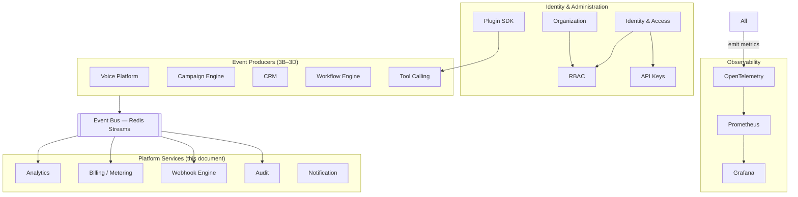

---

## 5. Analytics

### 5.1 Design Approach — Event Projection into Read Models

Analytics in this platform is purely a **consumer** of domain events already defined by producers (3B–3D). It never calls producer modules directly and never owns any source data — it is a read-optimized projection layer.

**Why no live aggregation queries against source tables:** at "millions of phone calls" and "unlimited campaigns" scale (`NFR-SCALE-001`), a `GROUP BY` call over a live `call_sessions` table is a full-table scan with every dashboard refresh. Projections maintained incrementally by event subscribers answer the same question in O(1). Same reasoning 3C §4 applied to `CampaignOutcomeSummary` — generalized here to all analytics.

**Alternative considered:** a dedicated analytics database (ClickHouse) from day one. **Deferred** — as Review Note 1 states, the write path is already abstracted behind `AnalyticsWritePort`, so this is a swap-the-adapter decision, not a redesign. Running Postgres-based projections until the query-latency SLO is breached is the KISS-compliant starting position.

### 5.2 Projection Tables

Each projector subscribes to one or more domain events and maintains one or more of these tables.

| Projection Table | Fed by events | Answers |
|---|---|---|
| `call_metrics_hourly` | `call.started`, `call.completed`, `call.failed` | Call volume, duration distribution, failure rate per agent/org/hour |
| `call_latency_by_stage` | Custom latency events emitted by 3B Voice Orchestrator per turn | STT/LLM/TTS latency percentiles per provider, per agent |
| `campaign_outcome_summary` | `campaign.*`, `lead.*` events (3C) | Answer rate, exhaustion rate, ROI per campaign |
| `tool_invocation_summary` | `ToolInvoked`, `ToolSucceeded`, `ToolFailed` (3D) | Tool usage frequency and failure rate |
| `cost_summary_daily` | `CostEntryRecorded` (§6.4) | Cost per org per category per day |
| `agent_utilization_hourly` | `call.started`, `call.completed` | Concurrent call count, busy %, idle % per agent |
| `llm_token_usage` | `LlmCompletionRecorded` (emitted by 3D LLM Router) | Tokens consumed per org/model/day |

### 5.3 Analytics Write Port — ClickHouse Migration Seam

```python
# modules/analytics/application/ports/analytics_write_port.py
class AnalyticsWritePort(Protocol):
    async def write_event(self, event: AnalyticsEvent) -> None: ...
    async def write_batch(self, events: list[AnalyticsEvent]) -> None: ...
```

Current adapter writes to Postgres projection tables. The ClickHouse adapter will implement the same port — **producers are not touched on migration**, satisfying `FR-AN-004`.

### 5.4 Dashboard Queries — CQRS Read Side

Each dashboard query handler reads exactly the projection tables it needs, with no joins to source-of-record tables. Queries are constructed with explicit `tenant_id` filters first (before any metric filter), enforcing 3A's tenant isolation at the analytics layer.

```python
# modules/analytics/application/queries/executive_dashboard.py
class ExecutiveDashboardQuery:
    async def execute(self, tenant_id: TenantId, window: TimeWindow) -> ExecutiveDashboardDTO:
        call_stats = await self._read.call_metrics(tenant_id, window)
        cost_stats = await self._read.cost_summary(tenant_id, window)
        campaign_stats = await self._read.campaign_outcomes(tenant_id, window)
        return ExecutiveDashboardDTO(calls=call_stats, cost=cost_stats, campaigns=campaign_stats)
```

### 5.5 Sequence — Analytics Event Flow

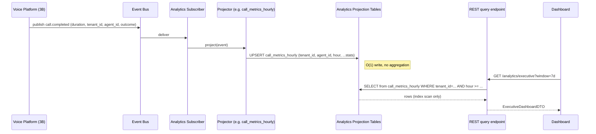

---

## 6. Billing, Cost Tracking & Usage Metering

### 6.1 Domain Model

```python
class Subscription(AggregateRoot):
    id: SubscriptionId
    tenant_id: TenantId
    plan_tier: PlanTier             # FREE | STARTER | GROWTH | ENTERPRISE
    billing_cycle: BillingCycle     # MONTHLY | ANNUAL
    status: SubscriptionStatus      # ACTIVE | PAST_DUE | SUSPENDED | CANCELLED
    current_period_start: date
    current_period_end: date
    quotas: dict[QuotaMetric, int]  # per-plan limits, enforced by check_quota

class Invoice(AggregateRoot):
    id: InvoiceId; tenant_id: TenantId
    period_start: date; period_end: date
    line_items: list[InvoiceLineItem]
    total: Money; status: InvoiceStatus

class UsageRecord(AggregateRoot):
    id: UsageRecordId; tenant_id: TenantId
    metric: UsageMetric             # CALL_MINUTES | LLM_TOKENS | STT_SECONDS | TTS_CHARS |
                                    # KNOWLEDGE_DOCS | STORAGE_GB | API_CALLS
    quantity: Decimal
    recorded_at: datetime
    source_ref: str                 # e.g. "call:session_abc123"

class CostEntry(AggregateRoot):
    id: CostEntryId; tenant_id: TenantId
    category: CostCategory          # LLM | TELEPHONY | STT | TTS | STORAGE | EMBEDDING | BANDWIDTH
    provider: str
    amount: Money
    unit_count: Decimal
    recorded_at: datetime
    source_ref: str
```

### 6.2 Plan & Quota Enforcement

`check_quota` is called at the API Gateway (via a FastAPI `Depends()`) **before** any operation that consumes a metered resource — placing an outbound call, creating an agent, importing a CSV.

```python
# modules/billing/application/use_cases/check_quota.py
class CheckQuotaUseCase:
    async def execute(self, tenant_id: TenantId, metric: QuotaMetric, requested: int = 1) -> None:
        subscription = await self._subscription_repo.get_active(tenant_id)
        limit = subscription.quotas.get(metric)
        if limit is None:
            return                  # unlimited for this plan tier
        current = await self._redis.get(f"quota:usage:{tenant_id}:{metric.value}")
        if int(current or 0) + requested > limit:
            raise QuotaExceededError(tenant_id, metric, limit)
```

**Why Redis for current usage, not Postgres:** quota checks happen on every API call that places a call, creates an agent, uploads a document, etc. — they are on the hot path. A Postgres query per check under concurrent load would dominate connection-pool pressure. Redis INCR is O(1) and sub-millisecond. The Redis counter is the **enforcement layer**; Postgres `UsageRecord` is the **audit layer** — written asynchronously after the operation succeeds.

### 6.3 Usage Metering — Event-Driven

```python
# modules/billing/interface/events/subscribers.py
class BillingEventSubscriber:
    async def on_call_completed(self, event: CallCompleted) -> None:
        await self._meter_usage.execute(
            tenant_id=event.tenant_id,
            metric=UsageMetric.CALL_MINUTES,
            quantity=Decimal(event.duration_seconds) / 60,
            source_ref=f"call:{event.session_id}",
        )

    async def on_llm_completion_recorded(self, event: LlmCompletionRecorded) -> None:
        await self._meter_usage.execute(
            tenant_id=event.tenant_id,
            metric=UsageMetric.LLM_TOKENS,
            quantity=Decimal(event.total_tokens),
            source_ref=f"turn:{event.turn_id}",
        )
```

`meter_usage` does two things atomically: increments the Redis quota counter and appends a `UsageRecord` to Postgres (via the transactional write pattern — Redis INCR is not transactional with Postgres, so the Postgres write is the authoritative record; if a pod dies between them, a nightly reconciliation job (§6.6) recomputes Redis from Postgres).

### 6.4 Cost Tracking

Distinct from usage metering — cost is what the **platform pays its providers**; usage is what the platform **charges tenants**. Both are tracked per call/turn with `source_ref` so they can be joined.

```python
# modules/billing/application/use_cases/record_cost.py
class RecordCostUseCase:
    async def execute(self, tenant_id: TenantId, category: CostCategory,
                      provider: str, unit_count: Decimal, unit_price: Money,
                      source_ref: str) -> None:
        cost = CostEntry(
            id=id_generator.new(), tenant_id=tenant_id,
            category=category, provider=provider,
            amount=unit_price * unit_count,
            unit_count=unit_count, recorded_at=Clock.now(),
            source_ref=source_ref,
        )
        await self._cost_repo.save(cost)
        await self._event_bus.publish(CostEntryRecorded(cost))   # consumed by analytics §5.2
```

**Margin calculation** (profit per org per campaign per `FR-AN-003`): answered by the `cost_dashboard` analytics query that joins `cost_summary_daily` (what platform spent) with `usage_summary_daily` (what tenant was charged) per the same `tenant_id` + period.

### 6.5 Payment Gateway Port

```python
# modules/billing/application/ports/payment_gateway_port.py
class PaymentGatewayPort(Protocol):
    async def charge(self, invoice: Invoice, payment_method_ref: str) -> ChargeResult: ...
    async def refund(self, charge_ref: str, amount: Money) -> RefundResult: ...
    async def create_customer(self, tenant_id: TenantId, email: str) -> GatewayCustomerRef: ...
```

The adapter is a plugin (Review Note 2) — `plugin_payment_gateway_adapter.py` calls the Plugin SDK's `invoke_plugin` use case (§8.4) with the plugin's registered endpoint and the serialized invoice.

### 6.6 Billing Background Workers

| Celery Task | Schedule | Responsibility |
|---|---|---|
| `generate_invoices` | Monthly, per billing cycle | Creates `Invoice` from accumulated `UsageRecord`s, fires `InvoiceGenerated` |
| `process_payments` | On `InvoiceGenerated` event | Calls `PaymentGatewayPort.charge()`, updates invoice status |
| `check_overages` | Daily | Flags orgs near/over their plan quota, emits `OverageDetected` |
| `reconcile_redis_counters` | Nightly | Rebuilds Redis quota counters from `UsageRecord` Postgres table — idempotent recovery |
| `suspend_past_due` | Daily | Orgs `PAST_DUE` beyond grace period → `OrgSuspended` event |

### 6.7 Sequence — Usage Metering Flow

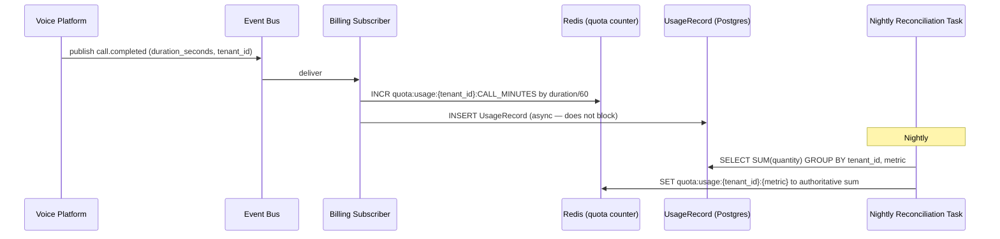

---

## 7. Webhook Engine

### 7.1 Design Principles

- **Every domain event can have webhook subscribers** — the Webhook Engine subscribes to the entire event bus and dispatches to registered endpoints.
- **At-least-once delivery with idempotent consumer guidance** — webhooks are delivered at least once; the payload includes a `delivery_id` (`UUIDv7`, sortable) so consumers can use it as an idempotency key.
- **HMAC-SHA256 signature on every delivery** — receivers verify the signature to reject spoofed requests.
- **Exponential backoff retry with a dead-letter state** — failed deliveries are retried up to a configurable maximum; exhausted deliveries enter `DEAD_LETTER` state and are surfaced in the Admin Panel for manual inspection.

### 7.2 Domain Model

```python
class WebhookSubscription(AggregateRoot):
    id: WebhookSubscriptionId
    tenant_id: TenantId
    url: WebhookUrl                     # HTTPS required, validated on creation
    topics: list[EventTopic]            # e.g. ["call.completed", "lead.qualified"]
    secret: HmacSecret                  # stored hashed; used to sign deliveries
    is_active: bool
    created_by: UserId

class WebhookDelivery(AggregateRoot):
    id: WebhookDeliveryId
    subscription_id: WebhookSubscriptionId
    tenant_id: TenantId
    topic: EventTopic
    payload_json: str
    status: DeliveryStatus              # PENDING | DELIVERED | FAILED | RETRYING | DEAD_LETTER
    attempt_count: int
    next_attempt_at: datetime | None
    last_response_code: int | None
    last_response_body: str | None      # capped — first 2KB only, to avoid storage abuse
```

### 7.3 Dispatch Use Case

```python
class DispatchEventUseCase:
    async def execute(self, event: DomainEvent) -> None:
        subscriptions = await self._subscription_repo.find_by_topic(
            event.topic, event.tenant_id
        )
        for sub in subscriptions:
            payload = self._serialize_event(event)
            delivery = WebhookDelivery(
                id=id_generator.new(), subscription_id=sub.id,
                tenant_id=event.tenant_id, topic=event.topic,
                payload_json=payload, status=DeliveryStatus.PENDING,
            )
            await self._delivery_repo.save(delivery)
            # Actual HTTP callout is async via Celery — never inline
            await self._task_queue.enqueue(deliver_webhook_task, delivery.id)
```

### 7.4 Delivery Worker

```python
# Celery task
async def deliver_webhook_task(delivery_id: WebhookDeliveryId) -> None:
    delivery = await repo.get(delivery_id)
    subscription = await sub_repo.get(delivery.subscription_id)
    signature = hmac.new(subscription.secret.raw_bytes, delivery.payload_json.encode(), sha256).hexdigest()
    headers = {
        "X-Platform-Signature": f"sha256={signature}",
        "X-Delivery-Id": str(delivery.id),
        "Content-Type": "application/json",
    }
    try:
        response = await http_client.post(subscription.url.value, content=delivery.payload_json,
                                          headers=headers, timeout=10.0)
        if response.status_code < 300:
            delivery.status = DeliveryStatus.DELIVERED
        else:
            raise WebhookDeliveryError(response.status_code)
    except (httpx.TimeoutException, WebhookDeliveryError) as exc:
        delivery.attempt_count += 1
        if delivery.attempt_count >= MAX_ATTEMPTS:
            delivery.status = DeliveryStatus.DEAD_LETTER
        else:
            delivery.next_attempt_at = Clock.now() + backoff(delivery.attempt_count)
            delivery.status = DeliveryStatus.RETRYING
            await task_queue.enqueue_at(deliver_webhook_task, delivery.id, delivery.next_attempt_at)
    await repo.save(delivery)
```

### 7.5 Sequence — Webhook Delivery

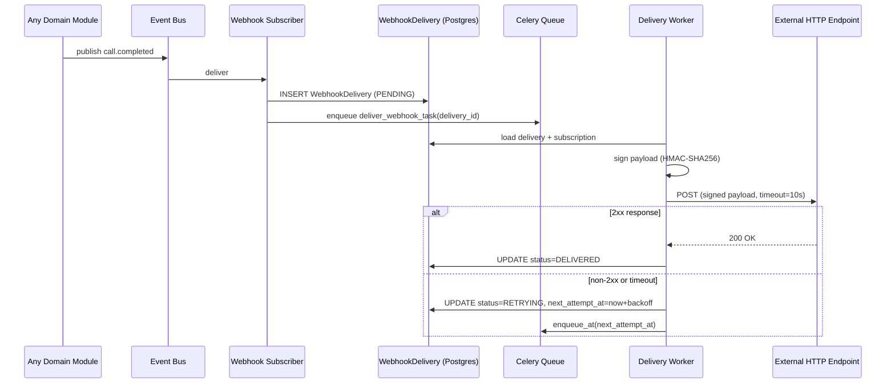

---

## 8. Plugin SDK

### 8.1 Design Philosophy

Plugins are **external HTTP services**, not in-process Python code. The platform calls them over HTTPS with a signed request; they respond with a structured JSON result. This is the sandbox: a plugin can crash, be slow, or return garbage — none of these can affect the platform's own process, memory, or data isolation guarantees (`FR-PLUG-002`).

**Alternative considered:** in-process execution with a restricted Python sandbox (e.g., `RestrictedPython` or WebAssembly via wasmtime). **Rejected** because: (a) no sandbox is proven fully secure against a determined adversary with arbitrary code execution; (b) a poorly-written plugin consuming CPU/memory inside the platform's process affects other tenants on the same pod — violating multi-tenancy at the infrastructure level in a way that is very hard to detect and bound; (c) HTTP callout gives a hard timeout, hard memory isolation, and a clear audit trail with almost no framework complexity. **Trade-off accepted:** plugin roundtrip adds latency (10–500ms typical) — acceptable for tool invocations and notification calls, not for anything on the per-millisecond voice hot path. Plugins are explicitly prohibited from being registered as synchronous nodes in the latency-sensitive turn loop (§8.3).

### 8.2 Plugin Registration & Capability Model

```python
class Plugin(AggregateRoot):
    id: PluginId
    tenant_id: TenantId
    name: str
    base_url: HttpsUrl              # must be HTTPS — enforced on registration
    capabilities: list[PluginCapability]   # CRM_CONNECTOR | PAYMENT_GATEWAY |
                                            # NOTIFICATION_PROVIDER | KNOWLEDGE_PROVIDER |
                                            # CUSTOM_TOOL
    shared_secret: str              # HMAC key for request signing (platform → plugin)
    status: PluginStatus            # REGISTERED | ACTIVE | DISABLED
    rate_limit: int                 # max calls/minute to this plugin from this tenant
```

Capabilities act as a coarse permission scope — a `CUSTOM_TOOL` plugin cannot access payment endpoints, a `PAYMENT_GATEWAY` plugin cannot register new tool names. Enforced by the `invoke_plugin` use case before the HTTP callout.

### 8.3 Capability Restrictions by Context

| Capability | Can be used in | Cannot be used in |
|---|---|---|
| `CUSTOM_TOOL` | Tool Calling Engine (§10), Workflow `ApiCallNode` | Voice turn hot path directly |
| `PAYMENT_GATEWAY` | Billing background worker only | API endpoints, voice turns |
| `NOTIFICATION_PROVIDER` | Notification service (§13) | Voice turn hot path directly |
| `CRM_CONNECTOR` | CRM Sync background worker (3D §5.7) | Any inline call path |
| `KNOWLEDGE_PROVIDER` | Knowledge Base ingestion pipeline | Live RAG retrieval (latency) |

### 8.4 Plugin Invocation

```python
# modules/plugin_sdk/application/use_cases/invoke_plugin.py
class InvokePluginUseCase:
    async def execute(self, plugin_id: PluginId, endpoint: str,
                      payload: dict, context: PluginCallContext) -> PluginResult:
        plugin = await self._repo.get(plugin_id, context.tenant_id)
        if plugin is None or plugin.status != PluginStatus.ACTIVE:
            raise PluginCapabilityDeniedError(plugin_id)
        if not self._capability_allowed(plugin, context.calling_context):
            raise PluginCapabilityDeniedError(plugin_id, context.calling_context)
        request_id = str(id_generator.new())
        signature = self._sign(plugin.shared_secret, payload, request_id)
        try:
            response = await asyncio.wait_for(
                self._callout.post(
                    url=f"{plugin.base_url}/{endpoint}",
                    payload=payload,
                    headers={
                        "X-Platform-Request-Id": request_id,
                        "X-Platform-Tenant-Id": str(context.tenant_id),
                        "X-Platform-Signature": signature,
                    },
                ),
                timeout=PLUGIN_TIMEOUT_SECONDS,
            )
        except TimeoutError:
            raise PluginCalloutError(plugin_id, "timeout")
        await self._audit.record(PluginInvoked(plugin_id, endpoint, context.tenant_id))
        return PluginResult.from_response(response)
```

Every plugin invocation is: capability-checked, signed, timeout-bounded, and audit-logged. The audit record exists even if the plugin returns an error — critical for billing plugins where the platform needs to know whether a charge attempt was made regardless of outcome.

---

## 9. Admin Panel & Organization Management

### 9.1 Two Admin Surfaces

| Surface | Accessible to | Scope |
|---|---|---|
| **Org Admin Console** | Organization Admin role | Their own tenant: users, roles, API keys, quota usage, feature flags, plugin installs, webhook subscriptions, audit log |
| **Platform Super Admin Console** | Platform staff only (elevated IAM role) | Cross-tenant: org list, suspension, quota override, system health, all audit events, break-glass access (3A §11.3) |

Both surfaces are served from the same `apps/web` Next.js deployable, behind separate role-gated route segments: `/(dashboard)/...` (org scope) and `/admin/...` (platform scope), with server-side RBAC verification on every route segment via Next.js middleware.

### 9.2 Organization Management

```python
class Organization(AggregateRoot):
    id: TenantId
    name: str; slug: str              # slug = URL-safe subdomain identifier
    owner_user_id: UserId
    plan_tier: PlanTier
    status: OrgStatus                 # ACTIVE | SUSPENDED | DELETED
    quotas: dict[QuotaMetric, int]
    settings: OrgSettings             # timezone, default language, recording policy, etc.
    phone_numbers: list[TenantPhoneNumber]
    created_at: datetime
```

`suspend_organization` transitions `status → SUSPENDED` and emits `OrgSuspended` — consumed by the API Gateway middleware, which begins returning `403 OrgSuspendedError` for all requests from that tenant without any per-endpoint logic.

### 9.3 Sequence — Break-Glass Access

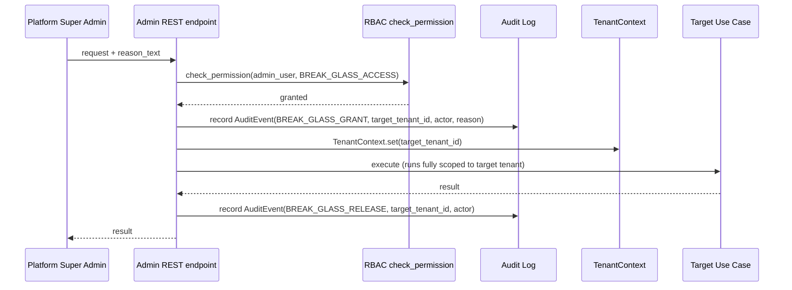

---

## 10. RBAC

### 10.1 Permission Model

Permissions are fine-grained action strings: `<resource>:<action>`. Resources match domain boundaries; actions are one of `create`, `read`, `update`, `delete`, `execute`.

Examples: `call:read`, `campaign:create`, `agent:update`, `api_key:delete`, `audit_log:read`, `quota:override`, `break_glass:access`.

### 10.2 Predefined Roles (Ship at Launch)

| Role | Key permissions |
|---|---|
| `platform_super_admin` | All permissions including `quota:override`, `break_glass:access`, `org:suspend` |
| `org_admin` | All permissions within their tenant except `quota:override` and `break_glass:access` |
| `agent_builder` | `agent:*`, `workflow:*`, `prompt:*`, `knowledge_base:*` |
| `campaign_manager` | `campaign:*`, `contact:*`, `crm:read` |
| `supervisor` | `call:read`, `transcript:read`, `analytics:read` |
| `billing_admin` | `billing:*`, `invoice:read`, `usage:read` |
| `developer` | `api_key:*`, `webhook:*`, `plugin:*` |
| `read_only` | `*.read` across all non-admin resources |

### 10.3 Permission Check — In-Process, Cached

```python
# modules/identity_access/application/use_cases/check_permission.py
class CheckPermissionUseCase:
    async def execute(self, user_id: UserId, tenant_id: TenantId,
                      permission: Permission) -> None:
        permissions = await self._get_cached_permissions(user_id, tenant_id)
        if permission not in permissions:
            raise PermissionDeniedError(user_id, permission)

    async def _get_cached_permissions(self, user_id: UserId,
                                       tenant_id: TenantId) -> frozenset[Permission]:
        cache_key = f"rbac:permissions:{tenant_id}:{user_id}"
        cached = await self._redis.get(cache_key)
        if cached:
            return frozenset(json.loads(cached))
        roles = await self._role_repo.get_user_roles(user_id, tenant_id)
        permissions = frozenset(p for role in roles for p in role.permissions)
        await self._redis.set(cache_key, json.dumps(list(permissions)), ttl=300)
        return permissions
```

**Why Redis cache with a 5-minute TTL:** RBAC checks happen on every API request. Even a 10ms Postgres query per check doubles API latency at p99. Redis sub-millisecond reads are the right trade-off. A 5-minute TTL means a revoked permission takes at most 5 minutes to propagate — acceptable for this use case; if immediate revocation is required for a specific role (e.g., `platform_super_admin`), the use case that removes that role explicitly invalidates the Redis key.

### 10.4 Custom Roles — Compilation

Custom roles are user-defined sets of predefined permissions. On `save`, a `compile_role` step validates that all specified permission strings exist in the platform's permission registry and caches the compiled `frozenset[Permission]` alongside the role entity. This prevents a custom role from referencing a permission that has been removed in a platform update.

```python
class Role(AggregateRoot):
    id: RoleId; tenant_id: TenantId; name: str
    permissions: frozenset[Permission]         # compiled on save, never a raw string list at runtime
    is_system: bool                             # system roles cannot be deleted or modified
```

### 10.5 RBAC in FastAPI — Depends() Integration

```python
# apps/api/dependencies/auth.py
def require_permission(permission: Permission):
    async def _check(
        current_user: UserClaims = Depends(get_current_user),
        tenant_ctx: TenantContext = Depends(get_tenant_context),
        check: CheckPermissionUseCase = Depends(get_check_permission),
    ) -> None:
        await check.execute(current_user.user_id, tenant_ctx.tenant_id, permission)
    return Depends(_check)

# Usage in a router:
@router.post("/campaigns", dependencies=[require_permission(Permission.CAMPAIGN_CREATE)])
async def create_campaign(...): ...
```

---

## 11. Audit Logs

### 11.1 Design Principles

- **Append-only** — `AuditEvent` rows are never updated or deleted, only inserted.
- **Immutability enforcement** — Postgres-level: `REVOKE UPDATE, DELETE ON audit_events FROM application_role`. The application role used by the platform's service user has insert-only access to `audit_events`.
- **Hash-chaining** (Review Note 5) — a nightly Celery task computes `SHA-256(previous_hash || event_json)` per tenant per day, storing the daily digest in a separate `audit_chain` table. This makes bulk deletion detectable (the chain breaks) without requiring a separate WORM storage service at current scale.
- **Queryable** — Org Admins can query their own tenant's audit log; Platform Super Admins can query any tenant's (itself an audited operation).

### 11.2 AuditEvent Model

```python
class AuditEvent(AggregateRoot):
    id: AuditEventId                # UUIDv7 — sortable by insertion time
    tenant_id: TenantId
    actor: Actor                    # (actor_type=USER|SYSTEM|PLUGIN, actor_id, actor_name)
    action: ActionKind              # CREATED | UPDATED | DELETED | ACCESSED | EXECUTED |
                                    # AUTH_SUCCESS | AUTH_FAILURE | BREAK_GLASS_GRANT |
                                    # BREAK_GLASS_RELEASE | API_KEY_ISSUED | API_KEY_REVOKED
    resource: ResourceRef           # (resource_type, resource_id)
    outcome: AuditOutcome           # SUCCESS | FAILURE
    context: dict                   # IP address, user agent, correlation_id — PII masked by default
    occurred_at: datetime
```

**`occurred_at` indexed with a partial index** per `(tenant_id, occurred_at)` — the dominant query pattern is "give me all audit events for this org in this time range," never a full-table scan.

### 11.3 What Is Always Audited (Non-Negotiable List)

| Event | Actor | Trigger |
|---|---|---|
| User login (success/failure) | User | `authenticate_user` |
| API key issued/revoked | User | `issue_api_key`, `revoke_api_key` |
| Role assigned/removed | User/System | `assign_role` |
| Plugin installed/disabled | User | `install_plugin` |
| Org suspended/activated | Super Admin/System | `suspend_organization` |
| Break-glass access grant/release | Super Admin | Admin endpoint |
| Prompt published/rolled back | User | `publish_version`, `rollback_version` |
| Webhook subscription created/deleted | User | `create_subscription` |
| Payment attempted | System | `process_payment` |
| Tool invoked (per call) | System | `execute_tool` |

### 11.4 Sequence — Audit Write

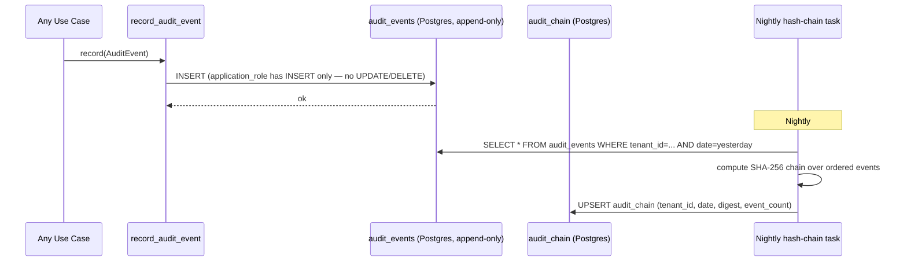

---

## 12. API Keys

### 12.1 Security Design

- **Never store the raw key** — only a `SHA-256` hash is stored in Postgres. The raw key is returned exactly once (on creation) and never again.
- **Short prefix stored in plaintext** — `prefix: str` (first 8 chars, e.g., `pk_live_`) stored for display in the UI ("your key ending in …abc12345") without exposing the secret.
- **Scoped** — every key carries a `frozenset[Permission]` representing its maximum authority; it cannot grant more than the issuing user's own permissions (`FR-AUTH-003`, "least-privilege").
- **Revocable immediately** — revocation deletes the Postgres row and explicitly invalidates the Redis auth cache key, not relying on TTL expiry.

```python
class ApiKey(AggregateRoot):
    id: ApiKeyId; tenant_id: TenantId
    name: str                           # human label: "Production webhook receiver"
    prefix: str                         # displayed, never secret
    key_hash: str                       # SHA-256(raw_key), stored
    permissions: frozenset[Permission]  # scoped subset of issuing user's permissions
    expires_at: datetime | None         # None = never expires
    last_used_at: datetime | None
    created_by: UserId
    is_active: bool
```

### 12.2 API Key Authentication Flow

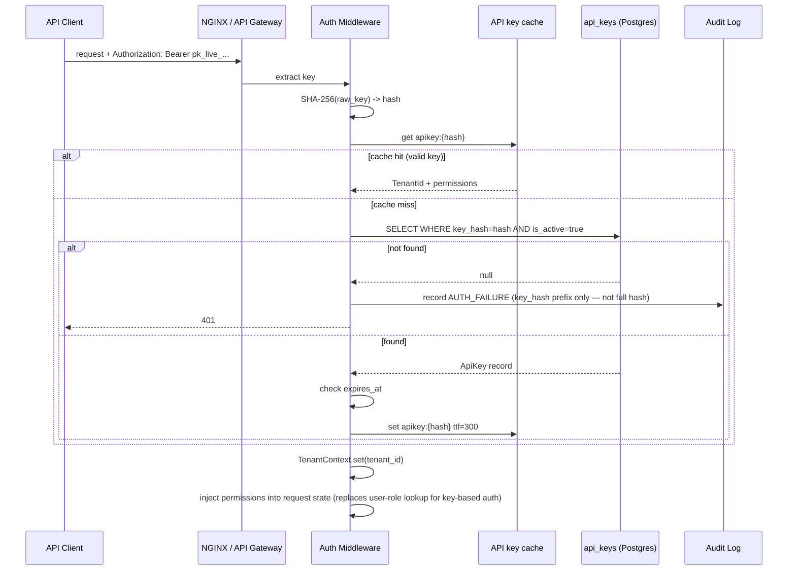

### 12.3 Key Rotation

Key rotation is implemented as **create-new then revoke-old** — not an in-place update of the hash. This ensures no window where a key is temporarily invalid between rotation steps. The `last_used_at` timestamp (updated lazily, via a Redis incr + background sync to avoid Postgres write on every API request) lets the UI warn about keys unused for N days.

---

## 13. Notifications

### 13.1 Channel Ports

```python
# Three separate ports — one per channel — not a single "NotificationPort"
class WhatsAppPort(Protocol):
    async def send(self, to: PhoneNumber, template_id: str, variables: dict) -> SendResult: ...

class SmsPort(Protocol):
    async def send(self, to: PhoneNumber, body: str) -> SendResult: ...

class EmailPort(Protocol):
    async def send(self, to: EmailAddress, subject: str, html_body: str,
                   text_body: str) -> SendResult: ...
```

**Why separate ports rather than a unified `NotificationPort(channel, ...):`** channel-specific parameters (WhatsApp template IDs with Meta API requirements, SMS character limits, email HTML vs text bodies) are genuinely different enough that a unified interface either leaks channel-specific fields into a shared DTO or uses a discriminated union that every caller must pattern-match. Three clean ports is the KISS/ISP-compliant solution (`CODING_STANDARDS.md` — Interface Segregation Principle).

### 13.2 Send Notification Use Case

```python
class SendNotificationUseCase:
    async def execute(self, request: NotificationRequest) -> NotificationRecord:
        record = NotificationRecord(
            id=id_generator.new(), tenant_id=request.tenant_id,
            channel=request.channel, status=NotificationStatus.PENDING,
        )
        await self._record_repo.save(record)
        # Always async — never inline on a voice turn
        await self._task_queue.enqueue(send_notification_task, record.id, request)
        return record
```

**Retry policy:** same exponential backoff as webhook delivery (§7.4) — notifications are also at-least-once, with a `DEAD_LETTER` status after max attempts.

### 13.3 Integration With Tool Calling

`sendWhatsApp`, `sendSMS`, `sendEmail` tools (`FR-TOOL-002`) are `ToolRunner` implementations in `modules/tool_calling/infrastructure/runners/messaging_tool_runner.py` (§3D §10.4 runner catalogue). Each runner calls `SendNotificationUseCase.execute()` — the tool boundary is clear, the notification internals are not exposed to the LLM.

---

## 14. Monitoring & Observability

### 14.1 OpenTelemetry — Instrumentation Strategy

All six deployables (`apps/api`, `apps/voice_gateway`, `apps/worker`, and three in staging/future) are instrumented with the OpenTelemetry Python SDK, initialized in `platform/infrastructure/observability/tracing.py` (3A §6.3). Every HTTP request, WebSocket session, Celery task, and database query is wrapped in a span.

**Trace propagation across async boundaries:**

```python
# platform/infrastructure/observability/tracing.py
from opentelemetry import trace
from opentelemetry.sdk.trace import TracerProvider
from opentelemetry.sdk.trace.export import BatchSpanProcessor
from opentelemetry.exporter.otlp.proto.grpc.trace_exporter import OTLPSpanExporter

def init_tracing(service_name: str, settings: ObservabilitySettings) -> None:
    provider = TracerProvider(resource=Resource.create({"service.name": service_name}))
    provider.add_span_processor(BatchSpanProcessor(OTLPSpanExporter(
        endpoint=settings.otlp_endpoint
    )))
    trace.set_tracer_provider(provider)
```

**Mandatory span attributes on every span:**

| Attribute | Value | Purpose |
|---|---|---|
| `tenant.id` | `TenantContext.tenant_id` | Filter traces by tenant in Jaeger/Tempo |
| `session.id` | `CallSession.id` (when in call context) | Reconstruct full call trace |
| `correlation.id` | From 3A correlation-id contextvar | Link to structured log lines |
| `service.name` | Per-deployable (e.g. `voice_gateway`) | Service map in Grafana |

**PII protection in spans:** `tenant.id`, `session.id`, and `correlation.id` are safe identifiers. Raw phone numbers, email addresses, and transcript text are **never** set as span attributes — same rule as 3A §12.4's log redaction, applied to traces.

### 14.2 Prometheus — Metrics Catalogue

All metrics are defined in `platform/infrastructure/observability/metrics.py` and registered at process startup. Modules add to this file via a thin registration API — they do not create Prometheus objects directly in domain or application code (which would couple domain code to a monitoring framework, violating Clean Architecture).

#### Core Platform Metrics

| Metric | Type | Labels | Purpose |
|---|---|---|---|
| `platform_http_requests_total` | Counter | `method`, `endpoint`, `status_code`, `tenant_id` | Request rate and error rate per endpoint |
| `platform_http_request_duration_seconds` | Histogram | `method`, `endpoint` | API latency distribution |
| `platform_active_calls` | Gauge | `tenant_id`, `agent_id` | Concurrent call count for autoscaling decisions |
| `platform_call_duration_seconds` | Histogram | `tenant_id`, `direction` | Call length distribution |
| `platform_celery_task_duration_seconds` | Histogram | `task_name`, `queue` | Worker task latency |
| `platform_celery_queue_depth` | Gauge | `queue_name` | Queue backlog — autoscaling signal |

#### Voice Pipeline Metrics (Stage-Level — NFR-OBS-002)

| Metric | Type | Labels | Purpose |
|---|---|---|---|
| `voice_stt_latency_seconds` | Histogram | `provider`, `tenant_id` | STT finalization time per provider |
| `voice_llm_first_token_seconds` | Histogram | `provider`, `model`, `tenant_id` | LLM TTFT per provider/model |
| `voice_tts_first_audio_seconds` | Histogram | `provider`, `tenant_id` | TTS first audio chunk latency |
| `voice_tool_call_duration_seconds` | Histogram | `tool_name`, `tenant_id` | Per-tool latency |
| `voice_turn_e2e_seconds` | Histogram | `tenant_id`, `agent_id` | Full end-to-end turn latency vs. 800ms SLO |
| `voice_barge_in_total` | Counter | `tenant_id` | Barge-in frequency |
| `voice_provider_failover_total` | Counter | `from_provider`, `to_provider`, `category` | Failover frequency per provider |

#### Provider Health Metrics

| Metric | Type | Labels | Purpose |
|---|---|---|---|
| `provider_circuit_open` | Gauge | `provider`, `category` | 1 = circuit open, 0 = closed — alert on sustained open |
| `provider_error_rate` | Gauge | `provider`, `category` | Rolling error rate from Redis health store |
| `llm_tokens_total` | Counter | `provider`, `model`, `tenant_id`, `token_type` | Token consumption for cost analytics |

#### Business Metrics (From Event Projectors)

| Metric | Type | Labels | Purpose |
|---|---|---|---|
| `campaign_leads_dialed_total` | Counter | `tenant_id`, `campaign_id` | Campaign pacing visibility |
| `campaign_answer_rate` | Gauge | `tenant_id`, `campaign_id` | Outcome quality signal |
| `webhook_delivery_success_rate` | Gauge | `tenant_id` | Webhook reliability |
| `plugin_invocation_duration_seconds` | Histogram | `plugin_id`, `tenant_id` | Plugin performance |

### 14.3 Grafana — Dashboard Catalogue

Each dashboard is a versioned JSON file in `infra/grafana/dashboards/`, committed to the repo and provisioned automatically via Grafana's dashboard-as-code (`grafana-cli` or Terraform provider).

| Dashboard | Primary panels | Audience |
|---|---|---|
| **Platform SLO** | `voice_turn_e2e_seconds` p50/p95/p99 vs. 800ms budget; `platform_http_request_duration_seconds`; error rate | On-call engineering |
| **Voice Pipeline** | Per-stage latency heatmaps (STT/LLM/TTS); active calls gauge; barge-in rate; provider failover rate | Voice engineering |
| **Provider Health** | Circuit-open gauge per provider; error rate per provider; TTFT trend by model | AI/infra |
| **Campaign Operations** | Active campaigns; leads dialed/hour; answer rate; Celery queue depth | Ops |
| **Cost & Usage** | LLM tokens/day by model; STT seconds/day; TTS chars/day; telephony minutes/day | FinOps |
| **Security** | Auth failure rate; API key auth failures; RBAC permission denials; audit event volume | Security |
| **Tenant Utilization** | Quota usage %; concurrent calls by tenant; storage by tenant | Platform ops |

### 14.4 Alerting Rules

Defined as Prometheus alerting rules in `infra/prometheus/alerts/`, loaded by Prometheus at startup.

```yaml
# infra/prometheus/alerts/voice_slo.yaml
groups:
  - name: voice_slo
    rules:
      - alert: VoiceTurnLatencyP95Breach
        expr: histogram_quantile(0.95, rate(voice_turn_e2e_seconds_bucket[5m])) > 1.2
        for: 2m
        labels: { severity: warning }
        annotations:
          summary: "Voice turn p95 latency above 1.2s — approaching SLO breach"

      - alert: VoiceTurnLatencyP50Breach
        expr: histogram_quantile(0.50, rate(voice_turn_e2e_seconds_bucket[5m])) > 0.8
        for: 5m
        labels: { severity: critical }
        annotations:
          summary: "Voice turn p50 latency above 800ms SLO — active breach"

      - alert: ProviderCircuitOpen
        expr: provider_circuit_open == 1
        for: 1m
        labels: { severity: critical }
        annotations:
          summary: "Provider {{ $labels.provider }} circuit open for category {{ $labels.category }}"

      - alert: WebhookDeadLetterAccumulating
        expr: increase(platform_webhook_dead_letter_total[10m]) > 10
        for: 0m
        labels: { severity: warning }
        annotations:
          summary: "Webhook dead-letter queue growing — possible subscriber outage"
```

### 14.5 Observability Sequence — Per-Request Trace

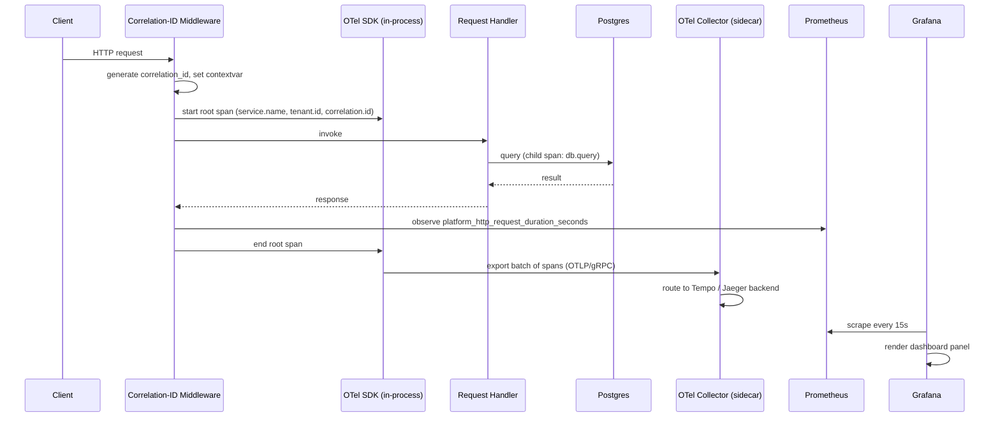

### 14.6 Health Checks

Every deployable exposes two endpoints:

| Endpoint | Returns | Checked by |
|---|---|---|
| `GET /health/live` | `200 OK` if the process is running (no external checks) | Kubernetes liveness probe — restart if this fails |
| `GET /health/ready` | `200 OK` only if Postgres + Redis are reachable, migrations up-to-date, and config valid | Kubernetes readiness probe — remove from load balancer until ready |

The readiness check uses short-circuiting: it fails fast on the first failing dependency rather than checking all dependencies in sequence — critical at startup where a slow DB connection should not be masked by a fast Redis connection making the check appear partially healthy.

---

## 15. Error Hierarchy Extensions

Extends 3A's hierarchy; completes the full platform error tree across all 3A–3E documents.

```mermaid
flowchart TB
    PE["PlatformError (3A)"] --> DE["DomainError (3A)"]
    DE --> QEE[QuotaExceededError]
    DE --> IPT[InvalidPlanTransitionError]
    DE --> OSE[OrgSuspendedError]
    DE --> WDE[WebhookDeliveryError]
    DE --> PCE[PluginCapabilityDeniedError]
    DE --> POE[PluginCalloutError]

    PE --> AE["ApplicationError (3A)"]
    AE --> PDE["PermissionDeniedError (RBAC)"]
    AE --> ICA[InvalidCredentialsError]
    AE --> AKN[ApiKeyNotFoundError]
    AE --> RNF[RoleNotFoundError]
    AE --> INB[InsufficientBalanceError]

    PE --> IE["InfrastructureError (3A)"]
    IE --> CSE[CrmSyncError]
    IE --> PGE[PaymentGatewayError]
    IE --> WDX[WebhookDeliveryExhaustedError]
    IE --> NotE[NotificationDeliveryError]
```

All subclasses plug into 3A §12.2's exception→HTTP mapping without new mapping rules — `PermissionDeniedError` → 403, `QuotaExceededError` → 429, `OrgSuspendedError` → 403, `PaymentGatewayError` → 502, etc.

---

## 16. Redis Usage Extensions

Extends 3B §16 and 3C §10 with platform-service keys, all following the same tenant-namespacing conventions.

| Key pattern | Module | Purpose | Lifetime |
|---|---|---|---|
| `rbac:permissions:{tenant_id}:{user_id}` | RBAC | Compiled permission set for a user | 5 min TTL; invalidated on role change |
| `apikey:{sha256_hash}` | API Keys | Auth cache: hash → TenantId + permissions | 5 min TTL; invalidated on revocation |
| `quota:usage:{tenant_id}:{metric}` | Billing / Usage Metering | Current period usage counter | Billing cycle; reset on new period |
| `audit:chain:latest:{tenant_id}` | Audit | Most recent chain digest, for incremental chaining | Permanent (updated nightly) |
| `notification:dedupe:{hash}` | Notification | Idempotency key to suppress duplicate sends | 24 hr TTL |
| `plugin:ratelimit:{tenant_id}:{plugin_id}` | Plugin SDK | Token bucket for plugin invocation rate limit | Rolling 60s window |
| `feature_flag:{flag_key}:{tenant_id}` | Feature Flags (3A) | Cached flag evaluation result | Short TTL; invalidated on flag.updated event |

---

## 17. Sequence Diagrams — Cross-Module Flows

### 17.1 API Request — Full Auth + RBAC + Quota Stack

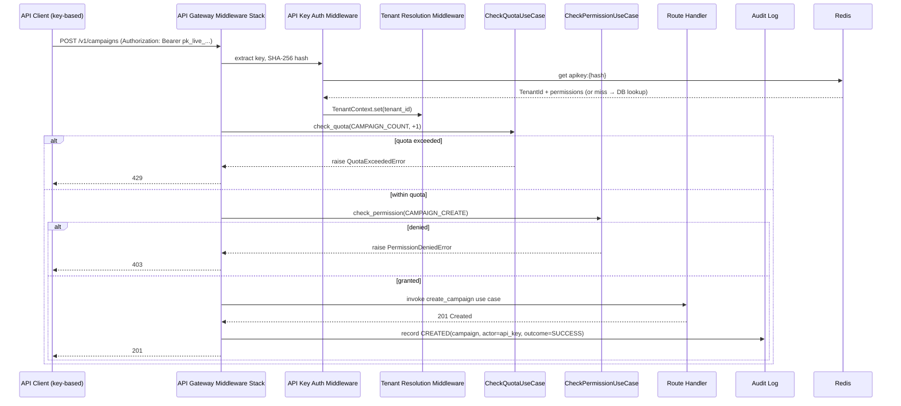

### 17.2 New Tenant Onboarding

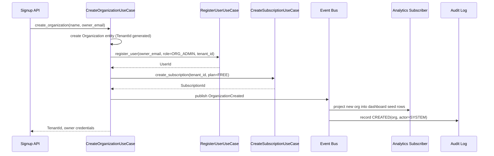

---

## 18. Complete LLD Scope Summary

With this document, all 3A–3E sub-phases are complete. Below is a full cross-reference of every bounded context across the five LLD documents:

| Module | Designed in | Status |
|---|---|---|
| Platform Foundation (Clean/Hex layers, DI, Shared Kernel, Config, Logging, Feature Flags, Multi-tenancy, Errors) | 3A | Done |
| Voice Gateway, Voice Orchestrator, Session Manager, Call State Machine, STT/TTS/Telephony/LLM adapters, Streaming Pipeline, Retry/Fallback | 3B | Done |
| CRM (Contact/Company/Deal/Task/Appointment/Note/Activity), Lead Scoring, Campaign Engine, CSV Import, Call Queue, Retry Queue, CRM Sync | 3C | Done |
| Workflow Engine (Builder + Runtime + Graph), Prompt Management (Versioning + A/B), Conversation Memory, Knowledge Base (RAG + Embedding + Vector Search), Tool Calling Engine, LLM Provider Router | 3D | Done |
| Analytics, Billing, Cost Tracking, Webhook Engine, Plugin SDK, Organization Management, RBAC, Audit Logs, API Keys, Usage Metering, Notifications, Monitoring/Prometheus/Grafana/OpenTelemetry | 3E (this document) | Done |

Remaining phases per the roadmap:

| Phase | Deliverable |
|---|---|
| 4 | Full DDD — ubiquitous language, aggregate/entity/value-object catalogue per context |
| 5 | Database Design — ERD, DDL, indexes, partitioning, RLS policies, Alembic migration strategy |
| 6 | API Design — OpenAPI spec, versioning, pagination, error contracts |
| 7 | Event Architecture — full event catalogue, payload schemas, outbox, ordering guarantees |
| 8 | AuthN/AuthZ — full threat model, MFA, OAuth SSO, token lifecycle |
| 9–20 | Per-module deep design phases |
| 21–23 | Observability spec, deployment topology, test strategy |
| 24 | Production implementation (begins after architecture approval) |

---

## 19. Open Items for Later Phases

| Item | Needed from | Feeds into |
|---|---|---|
| ClickHouse activation trigger — volume threshold or latency SLO breach (Review Note 1) | Product/Architecture | Phase 22 (Deployment) |
| Payment gateway vendor selection (Review Note 2) | Product | Phase 20 (Billing), Phase 24 |
| Plugin HTTP-callout sandbox confirmation (Review Note 3) | Architecture sign-off | Plugin SDK external documentation, Phase 24 |
| WhatsApp/SMS/Email vendor selection (Review Note 6) | Product | Phase 18 (Integrations), Phase 24 |
| Audit log immutability: confirm hash-chaining is sufficient vs. WORM storage (Review Note 5) | Security/Compliance | Phase 22 (Deployment) |
| Full RBAC permission string catalogue (all resources × all actions) | — | Phase 6 (API Design) |
| Full `audit_events`, `subscriptions`, `invoices`, `usage_records`, `cost_entries`, `plugins` schema | — | Phase 5 (Database Design) |
| Full domain event payloads for billing/webhook/plugin events | — | Phase 7 (Event Architecture) |
| OAuth2/SSO flow design (FR-AUTH-001) — only API-key and password auth designed here | — | Phase 8 (AuthN/AuthZ) |

**This completes Phase 3 (Low-Level Design) across all sub-phases 3A–3E.** Please review §18's scope summary and confirm all five documents before Phase 4 (Domain-Driven Design) begins.
