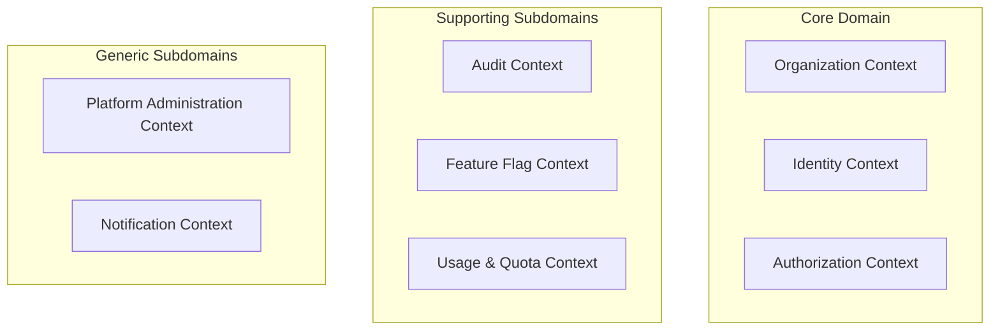
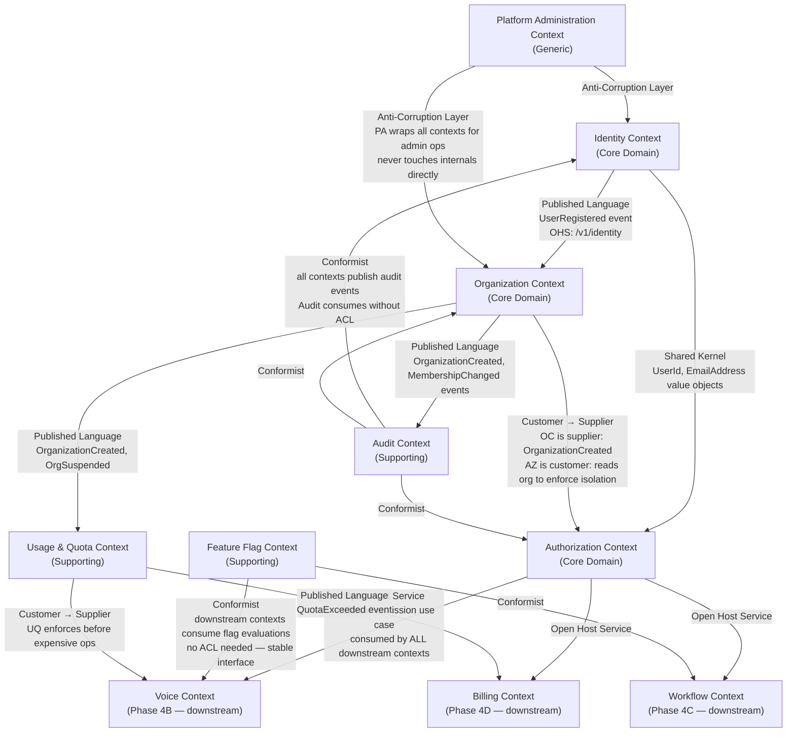
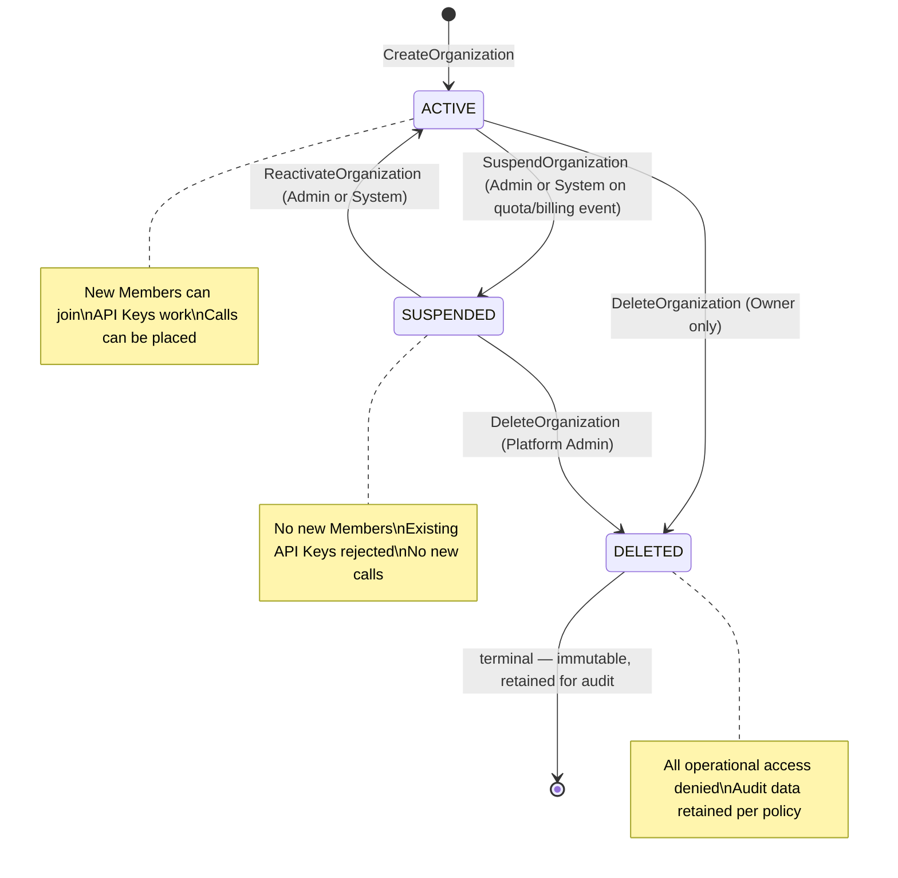
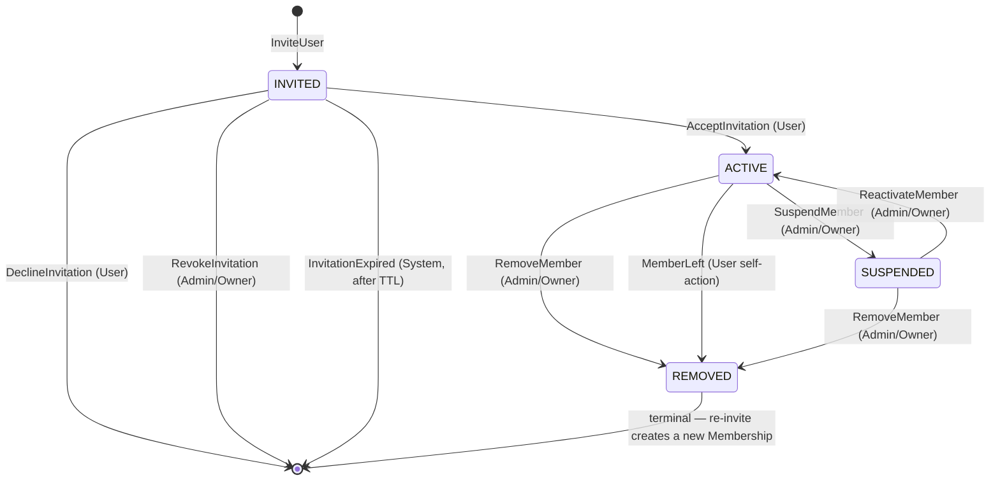
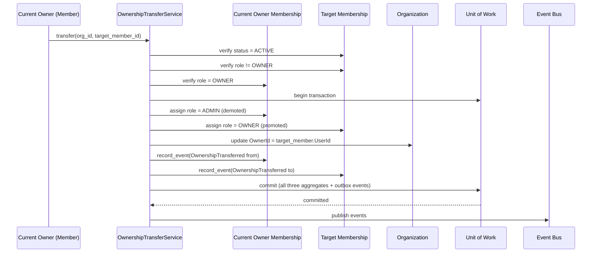
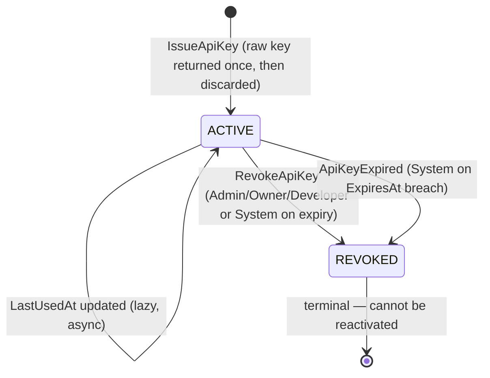
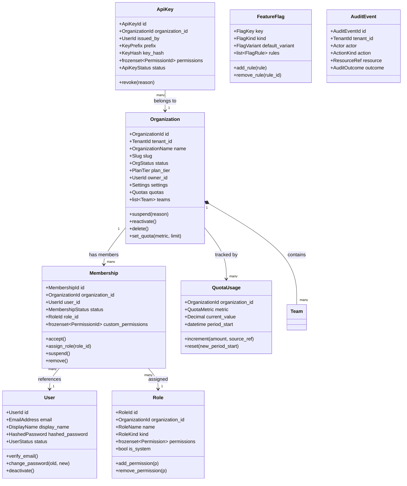
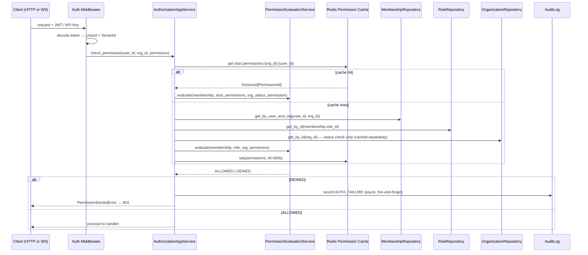
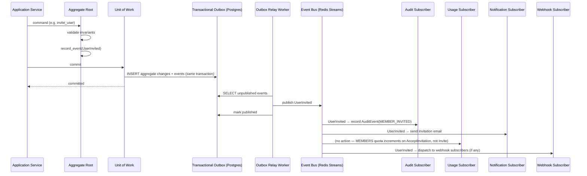
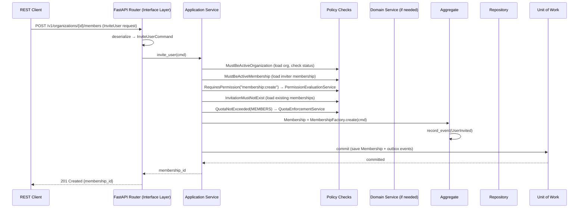

# Phase 4A — Domain-Driven Design: Core / Identity / Multi-Tenancy

| | |
|---|---|
| **Roadmap phase** | Phase 4 (Domain-Driven Design) — sub-phase 4A: Core Domains |
| **Status** | Draft v1.0, for review |
| **Source of truth (approved, not redesigned here)** | Phase 1 SRS, Phase 2 HLA, Phase 3A Platform Foundation LLD, Phase 3E Platform Services LLD, Phase 3F Deployment Internals LLD |
| **Scope** | Organization, Identity, Authorization, Audit, Feature Flags, Usage/Quota, Platform Administration bounded contexts only |
| **Explicitly out of scope** | Voice, CRM, Campaign, RAG, Workflow, Billing, Analytics — own Phase 4 sub-phases |

---

## 0. How to Read This Document

This document is the authoritative domain design for the platform's identity and tenancy foundation. It is written for engineers across all disciplines — backend, frontend, database, AI, QA, DevOps, and product. Each section is self-contained but cross-referenced so readers can follow any thread (e.g., "how does a permission check work end-to-end?") without reading everything.

**Relationship to Phase 3:** Phase 3A and 3E designed the *structural* foundation — folder layout, Clean/Hexagonal layering, DI, error hierarchy, RBAC at the infrastructure level. This document designs the *domain* — the business concepts, rules, invariants, and language that the Phase 3 structure exists to express. Phase 3 tells engineers *where* things go; Phase 4A tells them *what* those things mean and *why*.

---

## 1. Ubiquitous Language

The ubiquitous language is the shared vocabulary used identically in code, conversations, documentation, and UI copy. Using different terms for the same concept in different places is the primary source of bugs that "should not be possible." Every term below is defined once and used everywhere without synonym substitution.

| Term | Definition | Never call it |
|---|---|---|
| **Platform** | The AI Voice Agent SaaS product operated by us — the vendor | "system", "application", "backend" |
| **Organization** | A tenant on the Platform — a single company or team that signs up and uses the Platform | "account", "company", "client", "customer" |
| **Tenant** | Synonym for Organization when speaking in infrastructure/isolation terms. In domain language, always prefer "Organization" | "account", "workspace" |
| **TenantId** | The stable, immutable unique identifier for an Organization — used in every data record for isolation | "orgId", "accountId" |
| **Member** | A User who has accepted an invitation and belongs to an Organization | "employee", "staff", "user" (when context is membership) |
| **Membership** | The relationship between a User and an Organization, carrying a Role — not the User itself | "user-org relation", "org user" |
| **User** | A human identity (email address + credentials) that may be a Member of one or more Organizations | "account", "login", "person" |
| **Owner** | The Membership role with supreme authority within an Organization — exactly one Owner per Organization at all times | "admin" (Owner is distinct from Admin) |
| **Admin** | A Membership role with broad but not unlimited authority — cannot transfer Ownership or delete the Organization | "super user" |
| **Manager** | A Membership role with operational authority over a scoped subset of resources (agents, campaigns, etc.) | "supervisor" (Supervisor is a read-only role) |
| **Agent Builder** | A Membership role with authority to create and modify AI Agents, Workflows, and Prompts | "developer", "creator" |
| **Campaign Manager** | A Membership role with authority to create and run Campaigns | "marketing user" |
| **Supervisor** | A Membership role with read-only access to live and historical calls | "monitor", "listener" |
| **Billing Admin** | A Membership role with authority over billing settings, plan selection, and invoices | "finance user" |
| **Developer** | A Membership role with authority to manage API Keys, Webhooks, and Plugins | "integrator" |
| **Read-Only** | A Membership role with read access across all non-administrative resources | "viewer", "guest" |
| **Platform Admin** | A special User class operated by the Platform vendor — cross-tenant authority, never an Organization Member | "super admin", "root" |
| **Team** | A named grouping of Members within an Organization for organizational clarity — does not independently grant permissions | "group", "department" |
| **Role** | A named collection of Permissions assigned to a Membership — defines what a Member may do | "access level", "user type" |
| **Permission** | An atomic, named capability: `<resource>:<action>` — e.g., `campaign:create` | "right", "privilege" |
| **API Key** | A long-lived, scoped credential issued to a Member or a service integration, carrying a subset of Permissions | "token", "secret", "access key" |
| **Feature Flag** | A named boolean or variant toggle controlling Platform feature availability, scopeable to Organization, User, or Environment | "toggle", "switch", "kill switch" |
| **Quota** | A numeric ceiling on a measurable resource (e.g., maximum concurrent calls, maximum Organizations) enforced by the Platform | "limit", "cap", "tier limit" |
| **Audit Event** | An immutable, structured record of a state-changing or security-relevant action — written once, never modified | "log entry", "audit log", "event log" |
| **Invitation** | A pending offer for a User (by email) to join an Organization with a specified Role — not a Membership until accepted | "invite", "request" |
| **Break-Glass Access** | A Platform Admin accessing a specific Organization's data under explicit justification — always audited | "admin impersonation", "support access" |
| **Slug** | A URL-safe, human-readable identifier for an Organization (e.g., `acme-corp`) — mutable, unique across Platform | "handle", "username" |
| **Plan** | The subscription tier an Organization is on — determines default Quota values | "tier", "package" |

---

## 2. Bounded Contexts

### 2.1 Context Identification and Classification



| Context | Classification | Rationale |
|---|---|---|
| **Organization** | **Core Domain** | Tenant isolation is the Platform's primary differentiator and the most complex, custom domain logic — no off-the-shelf solution models it exactly as needed |
| **Identity** | **Core Domain** | User identity tied to multi-tenant membership is custom and central — standard identity libraries (Auth0, Keycloak) are adapters behind this domain, not its replacement |
| **Authorization** | **Core Domain** | Fine-grained, multi-tenant RBAC with custom roles is non-trivial business logic with invariants that must be owned by the domain, not delegated to middleware |
| **Audit** | **Supporting Subdomain** | Important and custom to compliance requirements, but secondary to the above — its rules are simpler (append, never modify) |
| **Feature Flags** | **Supporting Subdomain** | Necessary for the platform's rollout strategy, but the rules are relatively simple — the complexity is in the evaluation engine (infrastructure), not the domain |
| **Usage & Quota** | **Supporting Subdomain** | Directly enables Billing (Phase 4D) and protects system health — more coordination logic than true business rules |
| **Platform Administration** | **Generic Subdomain** | Cross-tenant operational tooling — the patterns are well-understood; the complexity is access control, not novel business logic |
| **Notification** | **Generic Subdomain** | Sending emails/SMS for invitations and alerts — the domain logic is trivial; the complexity is in provider adapters (Phase 18) |

### 2.2 Why These Are Separate Contexts (Not One Mega-Context)

The single strongest signal for a bounded context boundary is: **different experts would disagree about the meaning of the same word.** In this domain:

- The word "User" means something different to the Identity team ("a verified email address with credentials") and the Organization team ("a person with a role and membership status"). Separate contexts solve the definitional conflict by giving each context its own `User` model — in Identity, a `User` is a principal; in Organization, a `Member` (holding a `UserId` reference) is the entity that makes sense.
- "Permission" in the Authorization context is a first-class domain object with invariants; in the Feature Flag context it's just a gate — same word, different semantics.

---

## 3. Context Map



### 3.1 Relationship Types — Explained

| Relationship | Pair | Meaning in this Platform |
|---|---|---|
| **Shared Kernel** | Identity ↔ Authorization | `UserId`, `EmailAddress`, `TenantId` value objects are defined once in `platform/shared_kernel` and imported by both — changes to these are joint decisions requiring both context owners to agree |
| **Customer / Supplier** | Organization → Authorization | Organization is the supplier (it defines what a Membership is); Authorization is the customer (it queries Membership to enforce isolation). Organization does not conform to Authorization's model — it drives it |
| **Open Host Service (OHS)** | Authorization → Voice, Workflow, Billing | Authorization exposes a stable, versioned `CheckPermission` use case that all downstream contexts call — they conform to its Published Language and never import Authorization internals |
| **Conformist** | All contexts → Audit | Every context publishes audit events in the standard `AuditEvent` schema — they conform to Audit's schema rather than Audit adapting to each producer |
| **Anti-Corruption Layer (ACL)** | Platform Administration → Organization, Identity | Platform Admin operations translate admin intent (e.g., "suspend this tenant") into the owning context's commands via an ACL layer — Platform Admin code never manipulates Organization or Identity aggregates directly |

---

## 4. Subdomains in Detail

### 4.1 Organization Subdomain — Core

**What it owns:** the concept of a Tenant on the Platform. Creating, configuring, suspending, and deleting an Organization. Managing the membership of Users in an Organization, including invitations, roles, and teams.

**Why it is Core:** without Organization, there is no tenant isolation, and without tenant isolation the Platform cannot safely serve multiple customers. Every feature built later depends on it. The rules are bespoke — no library or vendor provides "Organization with exactly-one-Owner invariant, invitation lifecycle, team groupings, and quota scaffolding."

**What it does NOT own:** it does not authenticate users (Identity does), enforce permissions on API calls (Authorization does), or track usage (Usage/Quota does). It publishes events that those contexts react to — it does not call them synchronously.

### 4.2 Identity Subdomain — Core

**What it owns:** User registration, credential management (password hash storage, future MFA state), JWT issuance, API Key lifecycle (creation, hashing, revocation), and session management.

**Why it is Core:** the authentication mechanism is a first-class security surface. Its invariants (passwords never stored in plaintext, API keys stored only as hashes, tokens with finite lifetimes) are critical business rules, not implementation details.

**What it does NOT own:** what a User is *allowed* to do (Authorization), which Organization they belong to (Organization), or what actions they have taken (Audit). Identity is deliberately narrow.

### 4.3 Authorization Subdomain — Core

**What it owns:** the evaluation of "can this principal perform this action on this resource in this tenant context?" This includes the Role catalogue, Permission definitions, custom Role composition, permission cache management, and the `CheckPermission` use case consumed by all downstream contexts.

**Why it is Core:** this is where multi-tenant security is enforced at the application level. The invariants (a Member cannot have more permissions than their Role allows, a custom Role cannot include permissions outside the predefined set) protect against privilege escalation across tenant boundaries.

### 4.4 Audit Subdomain — Supporting

**What it owns:** the immutable record of state-changing and security-relevant actions. Enforcing append-only semantics at the database level. Providing queryable audit trails per tenant and cross-tenant (for Platform Admins).

**Why Supporting:** the domain rules are simple (write once, never modify, query by tenant+time). The complexity is in the surrounding security guarantees (append-only Postgres permissions, hash-chaining) — infrastructure concerns, not domain rules.

### 4.5 Feature Flag Subdomain — Supporting

**What it owns:** Flag definitions, scope rules (org/user/environment/percentage), assignment evaluation, and cache invalidation.

**Why Supporting:** the evaluation algorithm is straightforward; the complexity is in the caching and invalidation infrastructure (Redis, event bus). The domain rule is simple: "given a flag definition and a scope context, return the evaluated variant."

### 4.6 Usage & Quota Subdomain — Supporting

**What it owns:** Quota definitions (the ceilings), current usage counters, quota enforcement checks, and overage detection. It does not own billing logic — it only tracks numbers and raises events when ceilings are approached or exceeded.

**Why Supporting:** directly enables the Core domains to function without over-consuming resources, and enables Billing to charge accurately. Its own business rules are simple; it is a coordination layer.

### 4.7 Platform Administration Subdomain — Generic

**What it owns:** cross-tenant operational views, break-glass access coordination, system-health commands, and cross-tenant quota overrides. It is the only context that can operate across tenant boundaries by design.

**Why Generic:** the patterns are standard SaaS admin-panel patterns. It contains little novel business logic — it orchestrates the other contexts via their public use cases, translated through an ACL.

---

## 5. Aggregates

### 5.1 Organization Aggregate

**Aggregate Root:** `Organization`

**Rationale for boundary:** everything that must be consistent as a unit — the Organization's identity, its status, its owner reference, and its quota configuration — must change together. Team definitions and Quota limits are embedded. Memberships are *not* embedded — they are a separate aggregate because the invariants governing a Membership (role validity, permission scope) require their own transaction boundary and can change independently of the Organization's core state.

```
Organization (AggregateRoot)
├── OrganizationId           (Value Object — immutable, platform-assigned UUIDv7)
├── TenantId                 (Value Object — alias of OrganizationId, used in isolation layer)
├── OrganizationName         (Value Object — 2–100 chars, no leading/trailing whitespace)
├── Slug                     (Value Object — URL-safe, globally unique, 3–63 chars, [a-z0-9-])
├── OrgStatus                (Value Object — ACTIVE | SUSPENDED | DELETED)
├── PlanTier                 (Value Object — FREE | STARTER | GROWTH | ENTERPRISE)
├── OwnerId                  (Value Object — UserId reference, exactly one at all times)
├── Settings                 (Entity — mutable org-wide configuration)
│   ├── Timezone             (Value Object)
│   ├── DefaultLanguage      (Value Object — BCP 47 language tag)
│   ├── RecordingPolicy      (Value Object — ENABLED | DISABLED | REQUIRES_CONSENT)
│   └── SsoConfig            (Value Object — nullable, SSO provider configuration)
├── Quotas                   (Entity — embedded, quota ceilings per metric)
│   ├── QuotaMetric          (Value Object — per metric enum)
│   └── QuotaLimit           (Value Object — nullable ceiling, null = platform-unlimited)
└── Teams                    (list[Team] — embedded, bounded, < ~100 per org)
    └── Team (Entity)
        ├── TeamId           (Value Object)
        ├── TeamName         (Value Object)
        └── MemberRefs       (list[MembershipId] — references, not embedded Memberships)
```

**Invariants:**
1. `OwnerId` must reference a `Membership` that exists and has role `OWNER` within this Organization — always. If the Owner is removed, Ownership must be transferred first.
2. `Slug` must be globally unique across all Organizations on the Platform.
3. `OrgStatus` can only transition: `ACTIVE → SUSPENDED`, `SUSPENDED → ACTIVE`, `ACTIVE → DELETED`, `SUSPENDED → DELETED`. Deleted Organizations are never removed from storage (audit requirements) but are treated as non-existent by all operational queries.
4. An Organization in `DELETED` state cannot transition to any other state.
5. `Teams` list cannot contain duplicate `TeamId` values.
6. A `Team.MemberRef` must reference a `MembershipId` that belongs to this Organization.

**Business Rules:**
- The last Owner cannot be removed — Ownership must be transferred to another Member before the current Owner can leave.
- An Organization with `OrgStatus = SUSPENDED` cannot have new Memberships created. Existing Memberships remain but Members cannot authenticate to the Organization's resources.
- Slug changes are permitted (subject to global uniqueness) but generate an `OrganizationSlugChanged` event so dependent systems (CDN, external integrations) can update.
- Free plan organizations have a system-enforced Quota on maximum Members (e.g., 5). Enterprise plan organizations have no Member quota.

**Commands handled by this aggregate:**
`CreateOrganization`, `UpdateOrganizationName`, `ChangeSlug`, `SuspendOrganization`, `ReactivateOrganization`, `DeleteOrganization`, `TransferOwnership`, `UpdateSettings`, `SetQuota`, `CreateTeam`, `RenameTeam`, `DeleteTeam`, `AddMemberToTeam`, `RemoveMemberFromTeam`

**Domain Events emitted:**
`OrganizationCreated`, `OrganizationNameUpdated`, `SlugChanged`, `OrganizationSuspended`, `OrganizationReactivated`, `OrganizationDeleted`, `OwnershipTransferred`, `SettingsUpdated`, `QuotaSet`, `TeamCreated`, `TeamRenamed`, `TeamDeleted`, `MemberAddedToTeam`, `MemberRemovedFromTeam`

**Repository:** `OrganizationRepository` — one aggregate root per persistence unit, tenant-scoped per 3A's `TenantScopedRepository` base.

**Transaction boundary:** all mutations to the Organization aggregate (including nested Settings, Quotas, Teams) are committed in a single database transaction. Events are written to the transactional outbox within the same transaction.

---

### 5.2 Membership Aggregate

**Aggregate Root:** `Membership`

**Rationale for separate aggregate:** a Membership's lifecycle (invited → active → suspended → removed) has its own invariants that are independent of the Organization's lifecycle. A single transaction that touches both an Organization and all its Memberships simultaneously would be impractical at scale ("all Memberships" can be thousands). Memberships reference the Organization by `OrganizationId` but are their own consistency boundary.

```
Membership (AggregateRoot)
├── MembershipId             (Value Object — UUIDv7)
├── OrganizationId           (Value Object — parent reference, immutable after creation)
├── UserId                   (Value Object — the Member's identity)
├── MembershipStatus         (Value Object — INVITED | ACTIVE | SUSPENDED | REMOVED)
├── RoleId                   (Value Object — reference to a Role in Authorization context)
├── InvitedBy                (Value Object — UserId of the inviting Member)
├── InvitedAt                (Value Object — datetime)
├── JoinedAt                 (Value Object — nullable datetime, set on acceptance)
├── RemovedAt                (Value Object — nullable datetime)
└── CustomPermissions        (Value Object — frozenset[PermissionId], additive grant on top of Role)
    — nullable, advanced use case: per-member permission additions within Role's ceiling
```

**Invariants:**
1. `UserId` must be unique within an `OrganizationId` — one user, one membership per organization.
2. A Membership in `REMOVED` state is immutable — it cannot be reactivated; a new Invitation must be created.
3. `CustomPermissions` cannot include any Permission not in the Permission registry — validated at domain service level before assignment.
4. `CustomPermissions` cannot elevate a Member above their Role's maximum authority — a `Developer` role Member cannot be granted `quota:override` via `CustomPermissions` because that Permission is outside their Role's ceiling.
5. A Membership can only exist for an Organization in `ACTIVE` status.
6. The `OWNER` role can have at most one Membership per Organization simultaneously (enforced by the `OrganizationMembershipPolicy` domain service, which crosses the two aggregates in a consistency check before the Membership is saved).

**Business Rules:**
- Invitations expire after 7 days (configurable via Feature Flag per organization). An expired Invitation cannot be accepted; a new one must be sent.
- A Member suspended by an Admin can only be reactivated by an Admin or Owner.
- Role changes are audited — the previous role is preserved in the `MembershipRoleChanged` event payload.
- A Member removing themselves ("leaving the Organization") and an Admin removing a Member trigger the same state transition but different domain events (`MemberLeft` vs. `MemberRemoved`) for distinct downstream behaviour (e.g., Audit display).

**Commands handled:** `InviteUser`, `AcceptInvitation`, `DeclineInvitation`, `RevokeInvitation`, `AssignRole`, `GrantCustomPermission`, `RevokeCustomPermission`, `SuspendMember`, `ReactivateMember`, `RemoveMember`, `TransferOwnership` *(co-owned with Organization aggregate — see §8.3)*

**Domain Events emitted:** `UserInvited`, `InvitationAccepted`, `InvitationDeclined`, `InvitationRevoked`, `InvitationExpired`, `MemberRoleChanged`, `CustomPermissionGranted`, `CustomPermissionRevoked`, `MemberSuspended`, `MemberReactivated`, `MemberRemoved`, `MemberLeft`, `OwnershipTransferred`

**Repository:** `MembershipRepository` — queries by `OrganizationId` always include `tenant_id` filter.

**Transaction boundary:** each Membership command touches one Membership aggregate. The `TransferOwnership` operation is the only case requiring two Membership records to change atomically — handled by a Domain Service (§6.1) that issues both changes within a single Unit of Work.

---

### 5.3 User Aggregate

**Aggregate Root:** `User`

**Rationale for separate context:** User identity is shared across all Organizations a User belongs to. It must not be owned by any single Organization — its ownership is the Platform itself. A User's credentials, email address, and MFA state are global, not tenant-scoped.

```
User (AggregateRoot)
├── UserId                   (Value Object — UUIDv7, platform-assigned, immutable)
├── EmailAddress             (Value Object — RFC 5322, lowercase-normalized, globally unique)
├── DisplayName              (Value Object — 1–100 chars)
├── HashedPassword           (Value Object — Argon2id hash, opaque to domain logic)
├── UserStatus               (Value Object — PENDING_VERIFICATION | ACTIVE | DEACTIVATED)
├── EmailVerifiedAt          (Value Object — nullable datetime)
├── MfaConfig                (Entity — nullable, MFA configuration)
│   ├── MfaMethod            (Value Object — TOTP | SMS — Phase 8 full design)
│   └── MfaSecret            (Value Object — opaque, encrypted at rest)
└── PasswordResetToken       (Value Object — nullable, short-lived, hashed on storage)
```

**Invariants:**
1. `EmailAddress` is globally unique across all Users on the Platform.
2. A User in `PENDING_VERIFICATION` state cannot authenticate — cannot receive a JWT.
3. A `DEACTIVATED` User cannot authenticate and cannot be a Member of any active Organization (their Memberships must be suspended or removed before deactivation).
4. `HashedPassword` is never exposed outside the Identity context — it is write-only from the domain's perspective (set by commands, verified by the `PasswordHasher` domain service, never read into a DTO).
5. `PasswordResetToken` expires and is single-use — verified and cleared atomically.

**Commands handled:** `RegisterUser`, `VerifyEmail`, `ChangePassword`, `ResetPassword` (request + complete), `DeactivateUser`, `ReactivateUser`, `EnableMfa`, `DisableMfa`

**Domain Events emitted:** `UserRegistered`, `EmailVerified`, `PasswordChanged`, `PasswordResetRequested`, `UserDeactivated`, `UserReactivated`, `MfaEnabled`, `MfaDisabled`

**Repository:** `UserRepository` — **not** tenant-scoped (a User is platform-global). Queried by `UserId` or `EmailAddress`.

**Transaction boundary:** single User aggregate per transaction. No coordination with Organization or Membership within the same transaction — coordination happens via domain events.

---

### 5.4 ApiKey Aggregate

**Aggregate Root:** `ApiKey`

**Rationale:** API Key lifecycle (issuance, scoping, rotation, revocation) has distinct invariants from User credentials and is bound to a specific Organization (tenant-scoped). A User may issue multiple API Keys within an Organization, each with its own permission scope. Keys are owned by the Organization, not the User — if the User leaves, their Keys remain (and can be managed by an Admin).

```
ApiKey (AggregateRoot)
├── ApiKeyId                 (Value Object — UUIDv7)
├── OrganizationId           (Value Object — owner, tenant-scoped)
├── IssuedByUserId           (Value Object — the Member who created it)
├── Name                     (Value Object — human label, 1–100 chars)
├── KeyPrefix                (Value Object — first 8 chars of raw key, stored plaintext for display)
├── KeyHash                  (Value Object — SHA-256 of raw key, stored — raw key never persisted)
├── Permissions              (Value Object — frozenset[PermissionId] — subset of issuing User's permissions)
├── ApiKeyStatus             (Value Object — ACTIVE | REVOKED)
├── ExpiresAt                (Value Object — nullable datetime)
└── LastUsedAt               (Value Object — nullable datetime — updated lazily, not per-request)
```

**Invariants:**
1. `KeyHash` is immutable after creation — a key cannot be "rotated" in place; rotation means revoking the old key and creating a new one.
2. `Permissions` cannot exceed the Permissions of the issuing User at the time of issuance — least-privilege creation. An Admin cannot create a key with `platform_admin` permissions.
3. A `REVOKED` `ApiKey` is immutable — status can only go `ACTIVE → REVOKED`, never back.
4. `ExpiresAt` cannot be set in the past at creation time.
5. An API Key belongs to exactly one Organization — it cannot be shared across tenants.

**Commands handled:** `IssueApiKey`, `RevokeApiKey`, `RenameApiKey`, `SetKeyExpiry`

**Domain Events emitted:** `ApiKeyIssued`, `ApiKeyRevoked`, `ApiKeyExpired` *(generated by a scheduled process, not a direct command)*

**Repository:** `ApiKeyRepository` — tenant-scoped; queries by `KeyHash` for authentication (the raw key is hashed on receipt, never stored).

**Transaction boundary:** single ApiKey aggregate per transaction.

---

### 5.5 Role Aggregate

**Aggregate Root:** `Role`

**Rationale:** Roles are tenant-scoped named collections of Permissions. System Roles (Owner, Admin, Manager, etc.) are immutable seeds; Custom Roles are mutable within invariant constraints. A Role is an aggregate because it encapsulates the Permission set as a whole — adding/removing a permission must validate the entire set's consistency.

```
Role (AggregateRoot)
├── RoleId                   (Value Object — UUIDv7 for custom; stable string for system roles)
├── OrganizationId           (Value Object — nullable: null = system role, non-null = custom role)
├── RoleName                 (Value Object — unique within scope: system globally, custom per org)
├── RoleKind                 (Value Object — SYSTEM | CUSTOM)
├── Permissions              (Value Object — frozenset[Permission])
├── IsSystem                 (Value Object — boolean — system roles cannot be deleted or modified)
└── Description              (Value Object — 0–500 chars)
```

**System Roles and Their Default Permissions:**

| Role | Key Permissions (non-exhaustive) |
|---|---|
| `OWNER` | All permissions within the organization including `org:delete`, `ownership:transfer` |
| `ADMIN` | All permissions except `org:delete`, `ownership:transfer` |
| `MANAGER` | `agent:*`, `campaign:*`, `crm:*`, `workflow:*`, `prompt:*`, `analytics:read` |
| `AGENT_BUILDER` | `agent:*`, `workflow:*`, `prompt:*`, `knowledge_base:*` |
| `CAMPAIGN_MANAGER` | `campaign:*`, `contact:*`, `crm:read`, `analytics:read` |
| `SUPERVISOR` | `call:read`, `transcript:read`, `recording:read`, `analytics:read` |
| `BILLING_ADMIN` | `billing:*`, `invoice:read`, `usage:read`, `plan:update` |
| `DEVELOPER` | `api_key:*`, `webhook:*`, `plugin:*` |
| `READ_ONLY` | `*.read` across all non-admin resources |

**Invariants:**
1. System Roles (`IsSystem = true`) cannot be deleted, renamed, or have their Permissions modified.
2. Custom Role Permissions must be a strict subset of the Permission registry — unknown permission strings are rejected at the domain service level.
3. Custom Role names must be unique within an Organization.
4. A Custom Role cannot be named identically to any System Role.
5. Deleting a Custom Role that is currently assigned to one or more Memberships is forbidden — the Memberships must be reassigned first.

**Commands handled:** `CreateCustomRole`, `RenameCustomRole`, `AddPermissionToRole`, `RemovePermissionFromRole`, `DeleteCustomRole`

**Domain Events emitted:** `CustomRoleCreated`, `RolePermissionsUpdated`, `CustomRoleDeleted`

**Repository:** `RoleRepository` — system roles are seeded at boot and cached; custom roles are tenant-scoped.

---

### 5.6 FeatureFlag Aggregate

```
FeatureFlag (AggregateRoot)
├── FlagKey                  (Value Object — globally unique string key, e.g. "new_model_router")
├── FlagKind                 (Value Object — BOOLEAN | VARIANT)
├── DefaultVariant           (Value Object — the value when no scope rule matches)
├── Rules                    (list[FlagRule] — ordered, first-match wins)
│   └── FlagRule (Entity)
│       ├── RuleId           (Value Object)
│       ├── Scope            (Value Object — ORGANIZATION | USER | ENVIRONMENT | PERCENTAGE)
│       ├── ScopeTarget      (Value Object — nullable OrganizationId / UserId / env string)
│       ├── Variant          (Value Object — the value when this rule matches)
│       └── RuleOrder        (Value Object — integer, determines evaluation priority)
└── Description              (Value Object)
```

**Invariants:**
1. `FlagKey` is globally unique — no two flags share a key.
2. Rules with `Scope = PERCENTAGE` must have a `ScopeTarget` that is a valid integer 0–100.
3. Rule ordering must be consistent — no two rules in the same flag have the same `RuleOrder`.
4. A flag deletion that is referenced by a deployed Workflow or Agent Config raises a `FlagInUseError` — the references must be removed first (or the deletion must be forced by a Platform Admin with a warning).

**Domain Events emitted:** `FeatureFlagCreated`, `FeatureFlagRuleAdded`, `FeatureFlagRuleRemoved`, `FeatureFlagDefaultChanged`, `FeatureFlagDeleted`

---

### 5.7 Quota Aggregate

**Rationale:** Quota ceilings are embedded in the Organization aggregate (§5.1). The `Quota` aggregate here represents the **current usage measurement** — a running counter per metric per Organization. It is separate from the ceiling so that usage can be updated frequently (many times per minute during active campaigns) without touching the Organization aggregate and triggering its full invariant checks.

```
QuotaUsage (AggregateRoot)
├── QuotaUsageId             (Value Object — composite: OrganizationId + QuotaMetric)
├── OrganizationId           (Value Object)
├── Metric                   (Value Object — CONCURRENT_CALLS | AGENTS | MEMBERS | PHONE_NUMBERS | ...)
├── CurrentValue             (Value Object — non-negative integer or decimal)
├── PeriodStart              (Value Object — start of the current billing/quota period)
└── LastUpdatedAt            (Value Object — datetime)
```

**Invariants:**
1. `CurrentValue` cannot be negative.
2. `QuotaUsageId` is unique per `(OrganizationId, Metric)` pair — one counter per metric per org.
3. Usage updates are idempotent when provided a `source_ref` — the same call/token emission cannot be counted twice.

**Domain Events emitted:** `QuotaUsageIncremented`, `QuotaThresholdApproached` *(at 80% of ceiling)*, `QuotaExceeded`, `QuotaUsageReset` *(on period rollover)*

---

### 5.8 AuditEvent Aggregate

**Aggregate Root:** `AuditEvent` — append-only, no mutations.

```
AuditEvent (AggregateRoot — write-once)
├── AuditEventId             (Value Object — UUIDv7, sortable)
├── TenantId                 (Value Object — nullable: null = platform-level event)
├── Actor                    (Value Object — compound: ActorType [USER|SYSTEM|API_KEY|PLATFORM_ADMIN], ActorId, ActorName)
├── Action                   (Value Object — ActionKind enum — see §5.8.1)
├── Resource                 (Value Object — compound: ResourceType, ResourceId)
├── Outcome                  (Value Object — SUCCESS | FAILURE)
├── Context                  (Value Object — compound: IpAddress [masked], UserAgent, CorrelationId, SessionRef)
└── OccurredAt               (Value Object — datetime, microsecond precision)
```

**§5.8.1 ActionKind Enumeration:**
```
AUTH_SUCCESS, AUTH_FAILURE, API_KEY_AUTH_SUCCESS, API_KEY_AUTH_FAILURE,
ORG_CREATED, ORG_UPDATED, ORG_SUSPENDED, ORG_REACTIVATED, ORG_DELETED,
USER_REGISTERED, USER_DEACTIVATED, USER_REACTIVATED,
MEMBER_INVITED, MEMBER_JOINED, MEMBER_REMOVED, MEMBER_LEFT, MEMBER_SUSPENDED,
ROLE_ASSIGNED, ROLE_CHANGED, CUSTOM_PERMISSION_GRANTED, CUSTOM_PERMISSION_REVOKED,
API_KEY_ISSUED, API_KEY_REVOKED,
BREAK_GLASS_GRANTED, BREAK_GLASS_RELEASED,
FEATURE_FLAG_CHANGED, QUOTA_SET, QUOTA_EXCEEDED,
OWNERSHIP_TRANSFERRED, CUSTOM_ROLE_CREATED, CUSTOM_ROLE_DELETED
```

**Invariants:**
1. An `AuditEvent` is written once and never modified. The repository exposes only `save(event)` — no `update()` method exists.
2. `OccurredAt` must be the actual system time at the moment of the action — it cannot be set retroactively.
3. `Context.IpAddress` is stored in masked form (`192.168.x.x` — last octet replaced) by default, unless the tenant has opted into full IP storage.

---

## 6. Domain Services

Domain Services contain business logic that does not naturally belong to a single aggregate — typically logic that spans multiple aggregates or requires coordination.

### 6.1 OwnershipTransferService

**Why a Domain Service:** transferring Ownership requires simultaneously verifying and modifying two Membership aggregates (the current Owner's Membership and the new Owner's Membership). Neither aggregate can own this logic because each only has visibility into itself.

```python
class OwnershipTransferService:
    """
    Transfers Organization ownership from current Owner to a target Member.

    Invariants enforced:
    - Target Member must have ACTIVE Membership in the Organization.
    - Target Member must not already be the Owner.
    - The transfer is atomic: current Owner's role changes, new Owner's role changes,
      or neither change happens.
    """
    def transfer(
        self,
        organization: Organization,
        current_owner_membership: Membership,
        target_membership: Membership,
        unit_of_work: UnitOfWork,
    ) -> tuple[Membership, Membership]: ...
```

### 6.2 PermissionEvaluationService

**Why a Domain Service:** permission evaluation is a pure business rule (given a Role's permissions + a Membership's custom permissions + the requested permission, return allowed/denied) that no single aggregate owns and that must be independently testable.

```python
class PermissionEvaluationService:
    """
    Evaluates whether a Membership has a given Permission.
    Pure function — no I/O. Injected with the compiled Role.

    Resolution order:
    1. If Membership is REMOVED or SUSPENDED → DENIED, always.
    2. If Organization is SUSPENDED → DENIED, always.
    3. If Permission is in Role.Permissions → ALLOWED.
    4. If Permission is in Membership.CustomPermissions → ALLOWED (additive grant).
    5. Otherwise → DENIED.
    """
    def evaluate(
        self,
        membership: Membership,
        role: Role,
        organization: Organization,
        permission: Permission,
    ) -> AuthorizationDecision: ...
```

### 6.3 InvitationExpiryService

Scans for `INVITED` Memberships whose `InvitedAt` exceeds the org-configured expiry window and emits `InvitationExpired` events. Pure domain logic — the scheduling is an infrastructure concern (APScheduler, 3F).

### 6.4 FeatureFlagEvaluationService

```python
class FeatureFlagEvaluationService:
    """
    Evaluates a FeatureFlag for a given EvaluationContext.
    Pure function — receives the FeatureFlag aggregate, returns the matching variant.
    Resolution order matches FlagRule.RuleOrder ascending (lowest order = highest priority).
    """
    def evaluate(self, flag: FeatureFlag, context: FlagEvaluationContext) -> FlagVariant: ...
```

`FlagEvaluationContext` is a value object carrying `(tenant_id, user_id, environment)` — it is the only input besides the flag definition itself. No I/O.

### 6.5 QuotaEnforcementService

```python
class QuotaEnforcementService:
    """
    Checks whether an Organization may consume additional units of a metric.
    Does NOT increment the counter — increment happens after the operation succeeds.
    Returns QuotaCheckResult(allowed: bool, current: int, ceiling: int | None).
    """
    def check(
        self,
        organization: Organization,     # carries the ceiling (Quotas entity)
        usage: QuotaUsage,              # carries current value
        metric: QuotaMetric,
        requested_increment: int = 1,
    ) -> QuotaCheckResult: ...
```

### 6.6 SlugUniquenessService

Validates a proposed Slug against all existing Organizations before the `CreateOrganization` or `ChangeSlug` command commits. Cannot be an invariant on the aggregate itself (aggregates cannot query sibling aggregates). Implemented as a domain service backed by the `OrganizationRepository.slug_exists()` query.

---

## 7. Value Objects — Complete Catalogue

All value objects are immutable, compared by value (not identity), and validated at construction. Construction failure raises a domain exception — no "invalid" value object instances exist.

| Value Object | Type | Validation Rules |
|---|---|---|
| `OrganizationId` | UUIDv7 wrapper | Valid UUID format |
| `TenantId` | Type alias for `OrganizationId` — same underlying value | Same |
| `UserId` | UUIDv7 wrapper | Valid UUID format |
| `MembershipId` | UUIDv7 wrapper | Valid UUID format |
| `TeamId` | UUIDv7 wrapper | Valid UUID format |
| `RoleId` | String or UUIDv7 | System roles: predefined string; Custom roles: UUIDv7 |
| `PermissionId` | String | Format: `<resource>:<action>` — resource and action from whitelist |
| `Permission` | `frozenset[PermissionId]` | Each member must be a valid `PermissionId` |
| `ApiKeyId` | UUIDv7 wrapper | Valid UUID format |
| `FlagKey` | String | `[a-z][a-z0-9_]{1,63}` — snake_case, no leading digit |
| `AuditEventId` | UUIDv7 wrapper | Valid UUID format |
| `QuotaUsageId` | Composite | `(OrganizationId, QuotaMetric)` |
| `EmailAddress` | String | RFC 5322, lowercase-normalized, max 254 chars |
| `OrganizationName` | String | 2–100 chars, printable, trimmed |
| `Slug` | String | `[a-z0-9][a-z0-9-]{1,61}[a-z0-9]` — 3–63 chars |
| `DisplayName` | String | 1–100 chars, printable, trimmed |
| `HashedPassword` | Opaque string | Non-empty; domain never inspects format (hasher's concern) |
| `KeyPrefix` | String | Exactly 8 chars, alphanumeric |
| `KeyHash` | String | SHA-256 hex digest (64 chars) |
| `QuotaMetric` | Enum | `CONCURRENT_CALLS \| AGENTS \| MEMBERS \| PHONE_NUMBERS \| API_KEYS \| STORAGE_GB \| CAMPAIGNS` |
| `QuotaLimit` | Integer or None | Non-negative integer; None = unlimited |
| `OrgStatus` | Enum | `ACTIVE \| SUSPENDED \| DELETED` |
| `MembershipStatus` | Enum | `INVITED \| ACTIVE \| SUSPENDED \| REMOVED` |
| `UserStatus` | Enum | `PENDING_VERIFICATION \| ACTIVE \| DEACTIVATED` |
| `ApiKeyStatus` | Enum | `ACTIVE \| REVOKED` |
| `PlanTier` | Enum | `FREE \| STARTER \| GROWTH \| ENTERPRISE` |
| `ActorType` | Enum | `USER \| SYSTEM \| API_KEY \| PLATFORM_ADMIN` |
| `ActionKind` | Enum | Full set in §5.8.1 |
| `AuditOutcome` | Enum | `SUCCESS \| FAILURE` |
| `FlagVariant` | String or boolean | Depends on `FlagKind` |
| `FlagScope` | Enum | `ORGANIZATION \| USER \| ENVIRONMENT \| PERCENTAGE` |
| `AuthorizationDecision` | Enum | `ALLOWED \| DENIED` |
| `QuotaCheckResult` | Compound | `(allowed: bool, current: int, ceiling: int \| None)` |
| `RoleKind` | Enum | `SYSTEM \| CUSTOM` |
| `RecordingPolicy` | Enum | `ENABLED \| DISABLED \| REQUIRES_CONSENT` |
| `MfaMethod` | Enum | `TOTP \| SMS` |
| `Timezone` | String | IANA timezone database string |
| `LanguageCode` | String | BCP 47 language tag |
| `IpAddress` | String | IPv4 or IPv6, masked per §5.8 invariant 3 |
| `CorrelationId` | UUIDv7 wrapper | Valid UUID format |

---

## 8. Aggregate Lifecycles

### 8.1 Organization Lifecycle



### 8.2 User Membership Lifecycle



### 8.3 Ownership Transfer Lifecycle



### 8.4 API Key Lifecycle



---

## 9. Domain Events — Full Catalogue

### 9.1 Event Envelope (Shared Kernel — from 3A)

```python
@dataclass(frozen=True)
class DomainEvent:
    event_id: UUIDv7           # globally unique
    event_type: str            # e.g. "organization.created"
    aggregate_id: str          # the root's ID
    aggregate_type: str        # e.g. "Organization"
    tenant_id: TenantId | None # None for platform-level events
    occurred_at: datetime      # microsecond precision
    causation_id: UUIDv7       # event_id of the command that caused this
    correlation_id: UUIDv7     # trace correlation (3A §12.4)
    payload: dict              # event-specific data — see below
    schema_version: int        # for forward-compatibility
```

### 9.2 Organization Context Events

| Event | Payload fields | Consumed by |
|---|---|---|
| `organization.created` | `org_id, name, slug, plan_tier, owner_user_id` | Audit, Usage/Quota (seed counters), Billing (create subscription), Platform Admin (register) |
| `organization.name_updated` | `org_id, old_name, new_name` | Audit |
| `organization.slug_changed` | `org_id, old_slug, new_slug` | Audit, CDN (cache invalidation) |
| `organization.suspended` | `org_id, reason, suspended_by` | Audit, Auth (invalidate sessions), Billing |
| `organization.reactivated` | `org_id, reactivated_by` | Audit, Billing |
| `organization.deleted` | `org_id, deleted_by` | Audit, Billing (final invoice), all downstream |
| `organization.ownership_transferred` | `org_id, from_user_id, to_user_id` | Audit |
| `organization.quota_set` | `org_id, metric, old_limit, new_limit, set_by` | Audit, Usage/Quota |
| `organization.settings_updated` | `org_id, changed_fields` | Audit |

### 9.3 Membership Context Events

| Event | Payload fields | Consumed by |
|---|---|---|
| `membership.user_invited` | `org_id, membership_id, invited_user_email, role_id, invited_by` | Audit, Notification (send invite email) |
| `membership.invitation_accepted` | `org_id, membership_id, user_id` | Audit, Usage/Quota (increment MEMBERS counter) |
| `membership.invitation_declined` | `org_id, membership_id, user_id` | Audit |
| `membership.invitation_revoked` | `org_id, membership_id, revoked_by` | Audit |
| `membership.invitation_expired` | `org_id, membership_id` | Audit |
| `membership.role_changed` | `org_id, membership_id, user_id, old_role_id, new_role_id, changed_by` | Audit, Auth (invalidate permission cache) |
| `membership.custom_permission_granted` | `org_id, membership_id, permission_id, granted_by` | Audit, Auth (invalidate permission cache) |
| `membership.custom_permission_revoked` | `org_id, membership_id, permission_id, revoked_by` | Audit, Auth (invalidate permission cache) |
| `membership.member_suspended` | `org_id, membership_id, user_id, suspended_by` | Audit, Auth (invalidate sessions for org) |
| `membership.member_reactivated` | `org_id, membership_id, user_id, reactivated_by` | Audit |
| `membership.member_removed` | `org_id, membership_id, user_id, removed_by` | Audit, Usage/Quota (decrement MEMBERS counter) |
| `membership.member_left` | `org_id, membership_id, user_id` | Audit, Usage/Quota |

### 9.4 Identity Context Events

| Event | Payload fields | Consumed by |
|---|---|---|
| `user.registered` | `user_id, email` | Audit, Notification (verification email) |
| `user.email_verified` | `user_id, email` | Audit |
| `user.password_changed` | `user_id` *(no password data — ever)* | Audit, Notification (security alert) |
| `user.password_reset_requested` | `user_id, email` | Notification (reset email) |
| `user.deactivated` | `user_id, deactivated_by` | Audit, Auth (invalidate all sessions) |
| `user.reactivated` | `user_id, reactivated_by` | Audit |
| `user.mfa_enabled` | `user_id, method` | Audit |
| `user.mfa_disabled` | `user_id, disabled_by` | Audit, Notification (security alert) |

### 9.5 Authorization Context Events

| Event | Payload fields | Consumed by |
|---|---|---|
| `apikey.issued` | `org_id, api_key_id, name, prefix, issued_by, permissions, expires_at` | Audit |
| `apikey.revoked` | `org_id, api_key_id, prefix, revoked_by, reason` | Audit, Auth (invalidate key cache immediately) |
| `apikey.expired` | `org_id, api_key_id, prefix` | Audit |
| `role.custom_created` | `org_id, role_id, name, permissions, created_by` | Audit |
| `role.permissions_updated` | `org_id, role_id, added, removed, updated_by` | Audit, Auth (invalidate permission cache for all members with this role) |
| `role.custom_deleted` | `org_id, role_id, deleted_by` | Audit |

### 9.6 Feature Flag and Quota Events

| Event | Payload fields | Consumed by |
|---|---|---|
| `feature_flag.created` | `flag_key, default_variant, created_by` | Audit |
| `feature_flag.rule_added` | `flag_key, rule_id, scope, target, variant` | Audit, Feature Flag cache invalidation |
| `feature_flag.rule_removed` | `flag_key, rule_id` | Audit, Feature Flag cache invalidation |
| `feature_flag.deleted` | `flag_key, deleted_by` | Audit |
| `quota.threshold_approached` | `org_id, metric, current, ceiling, pct` | Notification (warning to Billing Admin), Billing |
| `quota.exceeded` | `org_id, metric, current, ceiling` | Notification (alert), Billing, Platform Admin |
| `quota.usage_reset` | `org_id, metric, period_start` | Audit |

### 9.7 Audit Context Events

The Audit context consumes events but produces only one event from the domain perspective:

| Event | Payload fields | Consumed by |
|---|---|---|
| `audit.event_recorded` | `audit_event_id, tenant_id, action, outcome` | (internal only — not published externally unless requested by webhook subscription) |

---

## 10. Commands — Full Catalogue

Commands are imperative, intent-expressing messages directed at a specific aggregate or domain service. They carry all data needed to perform one atomic operation.

### 10.1 Organization Commands

```python
@dataclass(frozen=True)
class CreateOrganization:
    command_id: UUIDv7
    issuer_user_id: UserId          # the User becoming the first Owner
    name: OrganizationName
    slug: Slug
    plan_tier: PlanTier
    timezone: Timezone
    default_language: LanguageCode

@dataclass(frozen=True)
class UpdateOrganizationName:
    command_id: UUIDv7
    organization_id: OrganizationId
    issuer_membership_id: MembershipId
    new_name: OrganizationName

@dataclass(frozen=True)
class SuspendOrganization:
    command_id: UUIDv7
    organization_id: OrganizationId
    issuer_user_id: UserId          # Platform Admin or system process
    reason: str

@dataclass(frozen=True)
class SetQuota:
    command_id: UUIDv7
    organization_id: OrganizationId
    issuer_user_id: UserId          # Platform Admin only
    metric: QuotaMetric
    new_limit: QuotaLimit

@dataclass(frozen=True)
class TransferOwnership:
    command_id: UUIDv7
    organization_id: OrganizationId
    current_owner_membership_id: MembershipId
    target_membership_id: MembershipId
```

*Full command set (abbreviated for non-repeated patterns):* `UpdateOrganizationName`, `ChangeSlug`, `ReactivateOrganization`, `DeleteOrganization`, `UpdateSettings`, `CreateTeam`, `RenameTeam`, `DeleteTeam`, `AddMemberToTeam`, `RemoveMemberFromTeam`

### 10.2 Membership Commands

```python
@dataclass(frozen=True)
class InviteUser:
    command_id: UUIDv7
    organization_id: OrganizationId
    inviter_membership_id: MembershipId
    invitee_email: EmailAddress
    role_id: RoleId

@dataclass(frozen=True)
class AcceptInvitation:
    command_id: UUIDv7
    membership_id: MembershipId
    user_id: UserId
    # user must match the email the invitation was sent to — verified by app service

@dataclass(frozen=True)
class AssignRole:
    command_id: UUIDv7
    organization_id: OrganizationId
    issuer_membership_id: MembershipId
    target_membership_id: MembershipId
    new_role_id: RoleId
```

*Full set:* `DeclineInvitation`, `RevokeInvitation`, `GrantCustomPermission`, `RevokeCustomPermission`, `SuspendMember`, `ReactivateMember`, `RemoveMember`, `MemberLeave`

### 10.3 Identity Commands

```python
@dataclass(frozen=True)
class RegisterUser:
    command_id: UUIDv7
    email: EmailAddress
    display_name: DisplayName
    raw_password: str              # application service hashes before passing to domain

@dataclass(frozen=True)
class ChangePassword:
    command_id: UUIDv7
    user_id: UserId
    current_raw_password: str
    new_raw_password: str
```

*Full set:* `VerifyEmail`, `RequestPasswordReset`, `CompletePasswordReset`, `DeactivateUser`, `ReactivateUser`, `EnableMfa`, `DisableMfa`

### 10.4 Authorization Commands

```python
@dataclass(frozen=True)
class IssueApiKey:
    command_id: UUIDv7
    organization_id: OrganizationId
    issuer_membership_id: MembershipId
    name: str
    permissions: frozenset[PermissionId]  # must be subset of issuer's permissions
    expires_at: datetime | None

@dataclass(frozen=True)
class RevokeApiKey:
    command_id: UUIDv7
    api_key_id: ApiKeyId
    organization_id: OrganizationId
    revoker_membership_id: MembershipId
    reason: str
```

*Full set:* `RenameApiKey`, `SetKeyExpiry`, `CreateCustomRole`, `RenameCustomRole`, `AddPermissionToRole`, `RemovePermissionFromRole`, `DeleteCustomRole`

### 10.5 Feature Flag Commands

```python
@dataclass(frozen=True)
class CreateFeatureFlag:
    command_id: UUIDv7
    flag_key: FlagKey
    flag_kind: FlagKind
    default_variant: FlagVariant
    description: str
    created_by: UserId             # Platform Admin only

@dataclass(frozen=True)
class AddFlagRule:
    command_id: UUIDv7
    flag_key: FlagKey
    scope: FlagScope
    scope_target: str | None
    variant: FlagVariant
    rule_order: int
    added_by: UserId
```

---

## 11. Queries — Full Catalogue

Queries are read-only, always tenant-scoped (or Platform-Admin-scoped), and return DTOs — never domain aggregates directly. This enforces the CQRS boundary established in 3C §4.

```python
# Organization
GetOrganization(org_id: OrganizationId) -> OrganizationDTO
GetOrganizationBySlug(slug: Slug) -> OrganizationDTO
ListOrganizations(page: Page) -> Page[OrganizationSummaryDTO]   # Platform Admin only

# Membership
GetOrganizationMembers(org_id: OrganizationId, filters: MemberFilter, page: Page) -> Page[MemberDTO]
GetMembership(membership_id: MembershipId, org_id: OrganizationId) -> MemberDTO
GetMyMemberships(user_id: UserId) -> list[MembershipSummaryDTO]  # all orgs a user belongs to
GetPendingInvitations(org_id: OrganizationId) -> list[InvitationDTO]

# Authorization
GetUserPermissions(user_id: UserId, org_id: OrganizationId) -> frozenset[PermissionId]
GetRoles(org_id: OrganizationId) -> list[RoleDTO]   # system + custom
GetRole(role_id: RoleId, org_id: OrganizationId) -> RoleDTO

# API Keys
GetApiKeys(org_id: OrganizationId, page: Page) -> Page[ApiKeySummaryDTO]  # never returns KeyHash

# Audit
GetAuditLogs(org_id: OrganizationId, filters: AuditFilter, page: Page) -> Page[AuditEventDTO]
GetPlatformAuditLogs(filters: AuditFilter, page: Page) -> Page[AuditEventDTO]  # PA only

# Usage
GetOrganizationUsage(org_id: OrganizationId) -> UsageSummaryDTO
GetOrganizationQuotas(org_id: OrganizationId) -> QuotaConfigDTO

# Feature Flags
GetFeatureFlags(page: Page) -> Page[FeatureFlagDTO]   # PA only — management view
EvaluateFlag(flag_key: FlagKey, context: FlagEvaluationContext) -> FlagVariant  # used by all
```

---

## 12. Policies

Policies are named, composable business rules that guard command execution. They are invoked in Application Services before commands reach the domain layer.

| Policy | Enforces |
|---|---|
| `MustBeActiveOrganization` | `OrgStatus = ACTIVE` before any non-admin command |
| `MustBeActiveMembership` | `MembershipStatus = ACTIVE` before the issuer can act |
| `RequiresPermission(permission)` | `PermissionEvaluationService.evaluate() = ALLOWED` |
| `MustNotBeLastOwner` | Prevents the only Owner from leaving or being removed |
| `InvitationMustNotExist` | A pending Invitation for the same email in the same org blocks a new one |
| `InvitationMustNotBeExpired` | Acceptance of an expired Invitation is rejected |
| `ApiKeyPermissionsMustBeSubset` | `IssueApiKey.permissions ⊆ issuer's resolved permissions` |
| `CustomRolePermissionsInRegistry` | All permissions in a custom role exist in the Permission registry |
| `RoleInUseBeforeDelete` | A Role with active Memberships cannot be deleted |
| `SlugGloballyUnique` | No two Organizations may share a Slug |
| `PlatformAdminOnly` | Only `ActorType = PLATFORM_ADMIN` may execute this command |
| `QuotaNotExceeded(metric)` | `QuotaEnforcementService.check().allowed = True` before the operation |

---

## 13. Specifications

Specifications are composable predicate objects used in repository queries and domain validations.

```python
class ActiveOrganizationSpecification(Specification[Organization]):
    def is_satisfied_by(self, org: Organization) -> bool:
        return org.status == OrgStatus.ACTIVE

class MemberWithRoleSpecification(Specification[Membership]):
    def __init__(self, role_id: RoleId) -> None:
        self._role_id = role_id
    def is_satisfied_by(self, membership: Membership) -> bool:
        return membership.role_id == self._role_id and membership.status == MembershipStatus.ACTIVE

class ApiKeyNotExpiredSpecification(Specification[ApiKey]):
    def __init__(self, now: datetime) -> None:
        self._now = now
    def is_satisfied_by(self, key: ApiKey) -> bool:
        return key.status == ApiKeyStatus.ACTIVE and (key.expires_at is None or key.expires_at > self._now)

class PermissionSubsetSpecification(Specification[frozenset[PermissionId]]):
    def __init__(self, ceiling: frozenset[PermissionId]) -> None:
        self._ceiling = ceiling
    def is_satisfied_by(self, proposed: frozenset[PermissionId]) -> bool:
        return proposed.issubset(self._ceiling)
```

---

## 14. Repositories — Interface Definitions

All repositories are Protocol types (structural typing, no ABC) per 3A §7.

```python
class OrganizationRepository(Protocol):
    async def get_by_id(self, org_id: OrganizationId) -> Organization | None: ...
    async def get_by_slug(self, slug: Slug) -> Organization | None: ...
    async def slug_exists(self, slug: Slug) -> bool: ...
    async def save(self, organization: Organization) -> None: ...

class MembershipRepository(Protocol):
    async def get_by_id(self, membership_id: MembershipId, org_id: OrganizationId) -> Membership | None: ...
    async def get_by_user_and_org(self, user_id: UserId, org_id: OrganizationId) -> Membership | None: ...
    async def find_by_org(self, org_id: OrganizationId, spec: Specification | None = None) -> list[Membership]: ...
    async def save(self, membership: Membership) -> None: ...

class UserRepository(Protocol):
    async def get_by_id(self, user_id: UserId) -> User | None: ...
    async def get_by_email(self, email: EmailAddress) -> User | None: ...
    async def save(self, user: User) -> None: ...

class ApiKeyRepository(Protocol):
    async def get_by_id(self, api_key_id: ApiKeyId, org_id: OrganizationId) -> ApiKey | None: ...
    async def get_by_hash(self, key_hash: KeyHash) -> ApiKey | None: ...  # cross-tenant lookup for auth
    async def find_by_org(self, org_id: OrganizationId) -> list[ApiKey]: ...
    async def save(self, api_key: ApiKey) -> None: ...

class RoleRepository(Protocol):
    async def get_by_id(self, role_id: RoleId, org_id: OrganizationId | None) -> Role | None: ...
    async def find_system_roles(self) -> list[Role]: ...
    async def find_custom_roles(self, org_id: OrganizationId) -> list[Role]: ...
    async def save(self, role: Role) -> None: ...

class FeatureFlagRepository(Protocol):
    async def get_by_key(self, flag_key: FlagKey) -> FeatureFlag | None: ...
    async def find_all(self) -> list[FeatureFlag]: ...
    async def save(self, flag: FeatureFlag) -> None: ...

class QuotaUsageRepository(Protocol):
    async def get(self, org_id: OrganizationId, metric: QuotaMetric) -> QuotaUsage | None: ...
    async def save(self, usage: QuotaUsage) -> None: ...
    async def increment(self, org_id: OrganizationId, metric: QuotaMetric, amount: int, source_ref: str) -> QuotaUsage: ...  # idempotent

class AuditEventRepository(Protocol):
    async def save(self, event: AuditEvent) -> None: ...     # insert-only, no update/delete
    async def find_by_org(self, org_id: OrganizationId, filters: AuditFilter, page: Page) -> Page[AuditEvent]: ...
    async def find_platform(self, filters: AuditFilter, page: Page) -> Page[AuditEvent]: ...
```

---

## 15. Factories

Factories encapsulate complex aggregate creation logic — the `__init__` is kept simple; the factory validates inputs, resolves dependencies, and constructs the aggregate in a valid initial state.

```python
class OrganizationFactory:
    def __init__(self, slug_service: SlugUniquenessService, id_gen: IdGenerator) -> None: ...

    def create(self, cmd: CreateOrganization) -> tuple[Organization, Membership]:
        """
        Creates an Organization AND the Owner's Membership as a pair.
        Both must be saved together in one Unit of Work.
        The Owner Membership is returned separately because it is a separate aggregate.
        """
        org_id = OrganizationId(self._id_gen.new())
        owner_membership_id = MembershipId(self._id_gen.new())
        if self._slug_service.slug_exists(cmd.slug):
            raise SlugAlreadyTakenError(cmd.slug)
        org = Organization(
            id=org_id, name=cmd.name, slug=cmd.slug,
            plan_tier=cmd.plan_tier, status=OrgStatus.ACTIVE,
            owner_id=cmd.issuer_user_id,
            settings=Settings(timezone=cmd.timezone, default_language=cmd.default_language),
            quotas=Quotas.from_plan_tier(cmd.plan_tier),
        )
        owner_membership = Membership(
            id=owner_membership_id, organization_id=org_id,
            user_id=cmd.issuer_user_id, status=MembershipStatus.ACTIVE,
            role_id=RoleId("OWNER"), invited_by=cmd.issuer_user_id,
            joined_at=Clock.now(),
        )
        org.record_event(OrganizationCreated(...))
        owner_membership.record_event(InvitationAccepted(...))
        return org, owner_membership
```

```python
class ApiKeyFactory:
    def create(self, cmd: IssueApiKey, raw_key: str) -> ApiKey:
        """
        raw_key is generated by the application service using a CSPRNG.
        The factory hashes it and discards the raw value after returning.
        The caller is responsible for returning the raw_key to the issuing User
        exactly once — the factory itself does not store or return it.
        """
        ...
```

---

## 16. Application Services

Application Services orchestrate commands using domain objects, ports, and domain services. They contain no business logic — that belongs in aggregates and domain services.

```python
class OrganizationApplicationService:
    async def create_organization(self, cmd: CreateOrganization) -> OrganizationId:
        # 1. Policy: user must exist and be ACTIVE (cross-context via UserRepository)
        # 2. Factory: create org + owner membership pair
        # 3. Unit of Work: save org, save owner membership, publish events (transactional outbox)
        # 4. Return org_id

    async def suspend_organization(self, cmd: SuspendOrganization) -> None:
        # 1. Policy: issuer must be Platform Admin (ActorType check)
        # 2. Load Organization
        # 3. Organization.suspend() — state machine validates transition
        # 4. Save + publish OrganizationSuspended

class MembershipApplicationService:
    async def invite_user(self, cmd: InviteUser) -> MembershipId:
        # 1. Policy: MustBeActiveOrganization
        # 2. Policy: MustBeActiveMembership (inviter)
        # 3. Policy: RequiresPermission("membership:create")
        # 4. Policy: InvitationMustNotExist (same email in org)
        # 5. Policy: QuotaNotExceeded(MEMBERS)
        # 6. Factory: create Membership(INVITED)
        # 7. Save + publish UserInvited → triggers Notification (email)

    async def accept_invitation(self, cmd: AcceptInvitation) -> None:
        # 1. Load Membership by ID
        # 2. Policy: InvitationMustNotBeExpired
        # 3. Verify cmd.user_id email matches the invitation's email
        #    (cross-context: load User from UserRepository, compare email)
        # 4. Membership.accept()
        # 5. Save + publish InvitationAccepted → triggers QuotaUsage increment

class AuthorizationApplicationService:
    async def check_permission(self, user_id: UserId, org_id: OrganizationId,
                                permission: Permission) -> AuthorizationDecision:
        # Hot path — checked on every API request
        # 1. Load Membership (from cache if available)
        # 2. Load Role (from cache — system roles never change)
        # 3. Load Organization (from cache — status check)
        # 4. PermissionEvaluationService.evaluate()
        # Returns decision — never raises, always returns ALLOWED or DENIED
        # Caller is responsible for raising PermissionDeniedError on DENIED
```

---

## 17. Domain Model — Mermaid



---

## 18. Authorization Flow



---

## 19. Domain Event Flow



---

## 20. Command Flow



---

## 21. Domain Layer Python Package Structure

Based on the DDD analysis — not a copy of the 3A scaffold, but the correct structure derived from bounded context boundaries and aggregate groupings.

```text
modules/
├── organization/
│   ├── domain/
│   │   ├── aggregates/
│   │   │   ├── organization.py        # Organization AggregateRoot
│   │   │   └── membership.py          # Membership AggregateRoot
│   │   ├── entities/
│   │   │   ├── settings.py            # OrgSettings Entity (embedded in Organization)
│   │   │   ├── quota_config.py        # Quotas Entity (embedded in Organization)
│   │   │   ├── team.py                # Team Entity (embedded in Organization)
│   │   │   └── flag_rule.py           # FlagRule Entity (embedded in FeatureFlag)
│   │   ├── value_objects/
│   │   │   ├── identifiers.py         # OrganizationId, TenantId, MembershipId, TeamId
│   │   │   ├── org_name.py
│   │   │   ├── slug.py
│   │   │   ├── status.py              # OrgStatus, MembershipStatus enums + transitions
│   │   │   └── plan_tier.py
│   │   ├── events/
│   │   │   ├── org_events.py          # OrganizationCreated, Suspended, ...
│   │   │   └── membership_events.py   # UserInvited, InvitationAccepted, ...
│   │   ├── commands/
│   │   │   ├── org_commands.py
│   │   │   └── membership_commands.py
│   │   ├── services/
│   │   │   ├── ownership_transfer_service.py
│   │   │   ├── slug_uniqueness_service.py
│   │   │   └── invitation_expiry_service.py
│   │   ├── factories/
│   │   │   └── organization_factory.py
│   │   ├── specifications/
│   │   │   └── org_specifications.py
│   │   └── policies/
│   │       └── org_policies.py        # MustBeActiveOrganization, MustNotBeLastOwner, ...
│   ├── application/
│   │   ├── use_cases/
│   │   │   ├── create_organization.py
│   │   │   ├── invite_user.py
│   │   │   ├── accept_invitation.py
│   │   │   ├── assign_role.py
│   │   │   ├── transfer_ownership.py
│   │   │   └── ...
│   │   ├── queries/
│   │   │   ├── get_organization.py
│   │   │   ├── get_members.py
│   │   │   └── ...
│   │   └── ports/
│   │       ├── organization_repository.py
│   │       └── membership_repository.py
│   ├── infrastructure/
│   │   ├── models.py
│   │   ├── mappers.py
│   │   └── repositories/
│   │       ├── sqlalchemy_organization_repository.py
│   │       └── sqlalchemy_membership_repository.py
│   └── interface/
│       ├── rest/router.py
│       └── events/subscribers.py
│
├── identity/
│   ├── domain/
│   │   ├── aggregates/user.py
│   │   ├── value_objects/
│   │   │   ├── identifiers.py         # UserId
│   │   │   ├── email_address.py
│   │   │   ├── hashed_password.py
│   │   │   ├── user_status.py
│   │   │   └── mfa_method.py
│   │   ├── events/user_events.py
│   │   ├── commands/user_commands.py
│   │   └── services/password_hasher_service.py   # domain service wrapping HasherPort
│   ├── application/
│   │   ├── use_cases/
│   │   │   ├── register_user.py
│   │   │   ├── authenticate_user.py
│   │   │   ├── authenticate_api_key.py
│   │   │   └── ...
│   │   ├── queries/get_user.py
│   │   └── ports/
│   │       ├── user_repository.py
│   │       ├── password_hasher.py
│   │       └── token_issuer.py
│   ├── infrastructure/
│   │   ├── models.py
│   │   ├── mappers.py
│   │   └── repositories/sqlalchemy_user_repository.py
│   └── interface/
│       ├── rest/router.py
│       └── events/subscribers.py
│
├── authorization/
│   ├── domain/
│   │   ├── aggregates/
│   │   │   ├── api_key.py
│   │   │   └── role.py
│   │   ├── value_objects/
│   │   │   ├── identifiers.py         # ApiKeyId, RoleId, PermissionId
│   │   │   ├── permission.py          # Permission, frozenset[PermissionId]
│   │   │   ├── api_key_status.py
│   │   │   ├── role_kind.py
│   │   │   └── authorization_decision.py
│   │   ├── events/
│   │   │   ├── api_key_events.py
│   │   │   └── role_events.py
│   │   ├── commands/
│   │   │   ├── api_key_commands.py
│   │   │   └── role_commands.py
│   │   ├── services/
│   │   │   └── permission_evaluation_service.py
│   │   ├── factories/
│   │   │   └── api_key_factory.py
│   │   └── specifications/
│   │       └── auth_specifications.py
│   ├── application/
│   │   ├── use_cases/
│   │   │   ├── check_permission.py    # public front door for all downstream contexts
│   │   │   ├── issue_api_key.py
│   │   │   ├── revoke_api_key.py
│   │   │   └── ...
│   │   ├── queries/
│   │   │   ├── get_roles.py
│   │   │   └── get_api_keys.py
│   │   └── ports/
│   │       ├── api_key_repository.py
│   │       └── role_repository.py
│   ├── infrastructure/
│   │   ├── models.py
│   │   ├── mappers.py
│   │   └── repositories/
│   │       ├── sqlalchemy_api_key_repository.py
│   │       └── sqlalchemy_role_repository.py
│   └── interface/
│       ├── rest/router.py
│       └── events/subscribers.py     # membership.role_changed → invalidate permission cache
│
├── audit/
│   ├── domain/
│   │   ├── aggregates/audit_event.py
│   │   ├── value_objects/
│   │   │   ├── identifiers.py         # AuditEventId
│   │   │   ├── actor.py
│   │   │   ├── action_kind.py
│   │   │   └── audit_outcome.py
│   │   └── commands/record_audit_event.py
│   ├── application/
│   │   ├── use_cases/record_audit_event.py
│   │   └── queries/get_audit_logs.py
│   └── infrastructure/
│       ├── models.py
│       └── repositories/sqlalchemy_audit_repository.py  # INSERT only
│
├── feature_flags/
│   ├── domain/
│   │   ├── aggregates/feature_flag.py
│   │   ├── entities/flag_rule.py
│   │   ├── value_objects/
│   │   │   ├── flag_key.py
│   │   │   ├── flag_kind.py
│   │   │   ├── flag_variant.py
│   │   │   └── flag_scope.py
│   │   ├── events/flag_events.py
│   │   ├── commands/flag_commands.py
│   │   └── services/flag_evaluation_service.py
│   ├── application/
│   │   ├── use_cases/
│   │   │   ├── create_feature_flag.py
│   │   │   ├── add_flag_rule.py
│   │   │   └── evaluate_flag.py       # public front door — all contexts call this
│   │   └── ports/feature_flag_repository.py
│   └── infrastructure/
│       ├── models.py
│       ├── repositories/sqlalchemy_feature_flag_repository.py
│       └── cache/redis_flag_cache.py
│
└── usage/
    ├── domain/
    │   ├── aggregates/quota_usage.py
    │   ├── value_objects/
    │   │   ├── quota_metric.py
    │   │   ├── quota_limit.py
    │   │   └── quota_check_result.py
    │   ├── events/quota_events.py
    │   └── services/quota_enforcement_service.py
    ├── application/
    │   ├── use_cases/
    │   │   ├── check_quota.py         # public front door — called before expensive ops
    │   │   ├── increment_usage.py
    │   │   └── reset_usage_period.py
    │   └── ports/quota_usage_repository.py
    └── infrastructure/
        ├── models.py
        └── repositories/sqlalchemy_quota_usage_repository.py
```

---

## 22. Persistence Model vs. Domain Model — Boundary

This document does not define database schema (Phase 5). However, identifying the translation boundary now prevents Phase 5 from accidentally coupling the persistence model to the domain model.

| Domain Concept | Domain Model (this doc) | Persistence Model (Phase 5) | API DTO (Phase 6) |
|---|---|---|---|
| `Organization` | Rich aggregate with invariant methods | `organizations` table with flat columns | `OrganizationDTO` — no OwnerId embedded (security) |
| `Settings` | Embedded entity in Organization | JSONB column `settings` on `organizations` | Nested object in `OrganizationDTO` |
| `Quotas` | Embedded entity, `dict[QuotaMetric, QuotaLimit]` | JSONB `quotas` on `organizations` | `QuotaConfigDTO` |
| `Teams` | Embedded list of Team entities | `teams` table with FK to `organizations` | `TeamDTO` |
| `Membership` | Separate AggregateRoot | `memberships` table | `MemberDTO` (role name, not RoleId) |
| `CustomPermissions` on Membership | `frozenset[PermissionId]` value object | Array column or JSONB | list of permission strings |
| `User` | Separate AggregateRoot, no tenant scope | `users` table, global | `UserProfileDTO` |
| `HashedPassword` | Opaque value object | Column `password_hash` | **Never in any DTO** |
| `ApiKey` | Separate AggregateRoot | `api_keys` table | `ApiKeySummaryDTO` (prefix, name, status only — no hash) |
| `Role` | Separate AggregateRoot | `roles` table + system roles seeded | `RoleDTO` |
| `FeatureFlag` | Separate AggregateRoot | `feature_flags` + `flag_rules` tables | `FeatureFlagDTO` |
| `QuotaUsage` | Separate AggregateRoot | `quota_usages` table | `UsageSummaryDTO` |
| `AuditEvent` | Write-once AggregateRoot | `audit_events` table, append-only | `AuditEventDTO` |

**Key rules at the boundary:**
1. Domain objects are constructed from the persistence model via explicit **mappers** (`infrastructure/mappers.py` per module) — ORM models are never used as domain objects.
2. API DTOs are constructed from domain objects or directly from read-model queries — domain objects are never serialized to JSON directly.
3. The `HashedPassword` value object has no `__str__` or `__repr__` that reveals the hash — it cannot accidentally leak into a log or a DTO.

---

## 23. Cross-Domain Communication

| From | To | Mechanism | What passes |
|---|---|---|---|
| Organization | Audit | Domain Event (async, event bus) | `OrganizationCreated`, `OrganizationSuspended`, etc. |
| Organization | Usage/Quota | Domain Event | `OrganizationCreated` → seed usage counters |
| Membership | Audit | Domain Event | All membership lifecycle events |
| Membership | Notification | Domain Event | `UserInvited` → send email |
| Membership | Usage/Quota | Domain Event | `InvitationAccepted` → increment MEMBERS counter |
| Identity | Audit | Domain Event | All user lifecycle events |
| Identity | Notification | Domain Event | `UserRegistered`, `PasswordResetRequested` |
| Authorization | Auth (cache) | Synchronous invalidation via Redis | `ApiKeyRevoked` → delete key cache immediately |
| Authorization | Audit | Domain Event | API key and role lifecycle events |
| Feature Flags | All contexts | Synchronous port call | `FeatureFlagEvaluationService.evaluate()` — read-only, no mutation |
| Usage/Quota | Billing | Domain Event | `QuotaExceeded`, `QuotaThresholdApproached` |
| All | Webhooks | Domain Event → Webhook Engine (3E §7) | All events above pass through webhook dispatcher |
| Voice (Phase 4B) | Authorization | Synchronous OHS call | `CheckPermission` use case |
| CRM (Phase 4C) | Authorization | Synchronous OHS call | `CheckPermission` use case |

**Anti-Corruption Layers (where needed):**

The Platform Administration context wraps commands to Organization and Identity through an ACL translation layer (`AdminOrganizationAcl`, `AdminIdentityAcl`). Platform Admin UI sends admin-intent commands (`SuspendTenantForNonPayment`) which the ACL translates to the Organization domain's own commands (`SuspendOrganization`) — the Organization domain never knows it was triggered by an admin operation vs. a billing system event.

---

## 24. Invariant Summary — Quick Reference

| Invariant | Aggregate | What breaks it |
|---|---|---|
| Exactly one Owner per Organization | Organization + Membership | Removing last Owner without transfer; creating second Owner |
| Slug is globally unique | Organization | Two orgs with identical slug |
| DELETED Organization is immutable | Organization | Any status transition from DELETED |
| REMOVED Membership is immutable | Membership | Any command on a REMOVED Membership |
| Invitation email must match accepting User's email | Membership | User with different email accepting an invitation |
| API Key permissions ⊆ issuer's permissions | ApiKey | Privilege escalation via key issuance |
| System Roles cannot be modified | Role | Any edit to a system role's permissions or name |
| AuditEvent is write-once | AuditEvent | Any UPDATE or DELETE on audit_events table |
| HashedPassword never appears in logs/DTOs | User | Any serialisation of HashedPassword |
| CustomPermissions ⊆ Role's permission ceiling | Membership | Granting a permission the Role doesn't include |

---

## 25. Domain Decision Record

### DDR-4A-001: Membership is a Separate Aggregate from Organization

**Decision:** `Membership` is its own Aggregate Root, not an embedded entity in `Organization`.

**Rationale:** An Organization with thousands of Members cannot have all Memberships loaded into memory every time the Organization aggregate is modified. The consistency invariants for a Membership (role validity, custom permission ceiling) require their own transaction boundary that is independent of the Organization's transaction boundary.

**Alternative rejected:** Embed Membership as a collection inside Organization. Rejected because it violates the aggregate sizing principle (unbounded collection) and makes every Organization command pay the cost of loading all Memberships.

**Trade-off:** The `OrganizationFactory.create()` method must save two aggregates in one Unit of Work. This is explicitly handled and is a single occurrence (Organisation creation), not a recurring pattern.

---

### DDR-4A-002: Role is a Separate Aggregate, Not Embedded in Membership

**Decision:** `Role` is its own Aggregate Root, shared (by reference via `RoleId`) across all Memberships that use it.

**Rationale:** A Role change (adding a permission to a custom Role) must propagate to all Members who have that Role simultaneously. If Roles were embedded per Membership, this would require updating every Membership — an unbounded write operation. With Roles as shared aggregates, a Role change plus cache invalidation propagates instantly.

**Trade-off:** Permission resolution requires loading both the Membership and its referenced Role — two repository calls. Mitigated by the Redis permission cache (5-minute TTL, immediate invalidation on Role change).

---

### DDR-4A-003: System Roles Are Seeded, Not Hardcoded

**Decision:** System Roles (Owner, Admin, Manager, etc.) are seeded into the `roles` table at application startup (via a migration or a bootstrap task), not hardcoded as Python constants.

**Rationale:** Seeding allows system roles to be referenced via `RoleId` with the same lookup path as custom roles. It enables future additions of system roles without code changes to the permission evaluation logic. It also allows Platform Admins to query the full Role catalogue via the admin API without special-casing system roles.

**Alternative rejected:** Hardcoded Python enums for system roles, lookup by name. Rejected because it creates two different code paths for role resolution and makes the role catalogue non-queryable via the repository.

---

### DDR-4A-004: Audit Events Are a Separate Bounded Context, Not a Shared Concern

**Decision:** All audit writing goes through the `audit` bounded context's `RecordAuditEventUseCase`. No module writes directly to the `audit_events` table.

**Rationale:** Audit-writing is a cross-cutting concern but its rules (write-once, structured schema, PII masking) are important enough to warrant a single enforcement point. A shared table written by all modules would have no central invariant enforcement.

**Trade-off:** Every state-changing use case that needs to be audited must call the Audit context (or publish an event that the Audit subscriber picks up). This adds one async operation per audited action. The event-driven subscriber pattern (§23) means this is fire-and-forget from the producing context's perspective — no latency cost on the critical path.

---

### DDR-4A-005: Platform Admin Is Not an Organization Member

**Decision:** Platform Admins are a separate User classification (`ActorType = PLATFORM_ADMIN`), not a Member of any Organization with a special role.

**Rationale:** Platform Admins must operate across all tenant boundaries. An Organization Membership always belongs to exactly one Organization — making Platform Admin a super-role on a specific Membership would either require them to be a Member of every Organization (impractical) or bypass the membership check entirely (inconsistent). A separate actor type with explicit ACL translation is cleaner and more auditable.

**Invariant this enables:** Every Break-Glass access by a Platform Admin is detectable because the `ActorType = PLATFORM_ADMIN` on the AuditEvent is structurally distinct from `ActorType = USER` — it cannot be spoofed by a regular user.

---

## 26. Architectural Trade-offs

| Trade-off | Choice made | Cost | Benefit |
|---|---|---|---|
| Separate aggregates for Org + Membership | Two saves per Org creation | Slightly more complex `OrganizationFactory` | Unbounded Membership collection doesn't block Org operations |
| Event-driven Audit writes | Async — slight eventual consistency | Audit record may lag action by milliseconds | Audit writes never block the operation being audited |
| Redis permission cache (5-min TTL) | Immediate revocation takes ≤5 min | Slight access-control lag | Permission checks are sub-millisecond, not a Postgres round-trip |
| System roles seeded in DB, not hardcoded | Boot-time seed step required | Operational complexity (seed must run before app) | Uniform role resolution, queryable catalogue |
| `HashedPassword` opaque value object | Cannot introspect hash algorithm in domain | Requires algorithm metadata in the hasher service | Domain never accidentally exposes a password |
| Slug globally unique (not per-plan-tier) | Simpler uniqueness check | Premium org names "used up" by free-tier orgs | Predictable, user-friendly URLs |

---

## 27. Risks

| Risk | Likelihood | Impact | Mitigation |
|---|---|---|---|
| Permission cache stale after role change | Low (5-min TTL + explicit invalidation) | Medium (brief over-permission) | Explicit cache key deletion on `role.permissions_updated` event |
| Two-aggregate transaction (Org + Membership) in `OrganizationFactory` fails midway | Low (single DB transaction via UoW) | Medium (org created without Owner) | UoW rolls back atomically; compensating event not needed |
| Slug race condition (two concurrent `CreateOrganization` with same slug) | Low (DB unique constraint as final guard) | Low (one request gets a validation error) | Unique index on `slug` column is the last-mile guard; `SlugUniquenessService` is the first-mile guard |
| Audit subscriber lag during traffic spike | Medium | Low (audit is always eventual) | Celery queue backpressure alert; audit is explicitly eventual-consistent |
| Break-glass access not audited if audit service is down | Low | High | Break-glass access is synchronous audit write (not event-driven) — the one exception to the async audit pattern |

---

## 28. Open Questions

| # | Question | Owner | Blocks |
|---|---|---|---|
| OQ-4A-01 | What is the exact invitation expiry window? (default 7 days — confirm) | Product | `InvitationExpiryService`, Phase 6 API spec |
| OQ-4A-02 | Should a Platform Admin be able to impersonate an org-level session (not just break-glass read)? | Product / Legal | Phase 8 (AuthN/AuthZ full design) |
| OQ-4A-03 | Does SSO (OAuth2) replace password-based auth for enterprise org members, or coexist? | Product | Phase 8 — `SsoConfig` value object is a placeholder |
| OQ-4A-04 | Should `CustomPermissions` on a Membership be additive-only (grant beyond Role) or also subtractive (restrict below Role)? | Product | `PermissionEvaluationService` algorithm, Phase 6 API spec |
| OQ-4A-05 | Is a `Team` purely organisational (for display/grouping) or does it eventually carry its own permission grants? | Product | Phase 4A is designed with Teams as display-only; adding permission grants to Teams would require a new aggregate |
| OQ-4A-06 | What is the retention period for `AuditEvent` records per plan tier? | Legal / Product | Phase 5 (Database Design) — partition retention policy |
| OQ-4A-07 | Should API Key `LastUsedAt` be updated synchronously (adds a write per API request) or asynchronously (eventally consistent, current design)? | Architecture | Phase 5, Phase 24 |

---

## 29. Dependencies on Other Bounded Contexts

| Dependency | Direction | What Phase 4A needs from it |
|---|---|---|
| Billing (Phase 4D) | Phase 4A → Billing | Publishes `OrganizationCreated` (triggers subscription creation), `OrgSuspended`, `OrgDeleted`, `QuotaExceeded` — Billing is downstream |
| Notification (Phase 4D/18) | Phase 4A → Notification | Consumes `UserInvited`, `UserRegistered`, `PasswordResetRequested`, `QuotaThresholdApproached` — Notification is downstream |
| Voice (Phase 4B) | Authorization → Voice | Voice calls `CheckPermission` use case — Voice is a customer of Authorization |
| Workflow (Phase 4C) | Authorization → Workflow | Same — Workflow is a customer |
| CRM/Campaigns (Phase 4C) | Authorization → CRM | Same |
| LLM Router (Phase 4D) | Feature Flags → LLM Router | LLM Router consumes `EvaluateFlag` use case for new provider rollout |

---

## 30. What Phase 4B Must Use From This Design

Phase 4B (Voice Domain DDD) must:

1. Use `TenantId` (alias of `OrganizationId`) from the Shared Kernel — not define its own tenant identifier.
2. Use `UserId` from the Shared Kernel for any agent-builder or user reference.
3. Call `AuthorizationApplicationService.check_permission()` (the Open Host Service) — never define its own permission logic.
4. Call `FeatureFlagEvaluationService.evaluate()` for any feature-gated voice capability.
5. Call `QuotaEnforcementService.check()` before placing an outbound call (checking `CONCURRENT_CALLS` quota).
6. Publish domain events using the `DomainEvent` envelope defined in this document's §9.1 (Shared Kernel).
7. Produce `AuditEvent` records (or publish domain events consumed by the Audit subscriber) for all state-changing voice operations.
8. Never import `Organization`, `Membership`, `User`, or `Role` domain objects directly — reference them only by their value-object identifiers (`OrganizationId`, `UserId`).

---

## 31. Consistency Checks Against Phase 3 LLD

| Phase 3 design | Phase 4A DDD | Consistent? | Notes |
|---|---|---|---|
| 3A §10 — `RBAC` as a FastAPI Depends() pattern using Redis cache | §18 Authorization Flow — same pattern, now formally described as a domain service | ✅ | Domain service (`PermissionEvaluationService`) is pure; infrastructure (Redis) is adapter |
| 3A §10.4 — Custom role compilation at save time | §5.5 Role aggregate `Permissions: frozenset[Permission]` — compiled at construction | ✅ | Consistent — `frozenset` at domain level maps to the compiled set in 3A |
| 3E §11 — Audit append-only Postgres + `REVOKE UPDATE/DELETE` | §5.8 `AuditEvent` aggregate — write-once invariant, `save()` only on repository | ✅ | Infrastructure enforcement (SQL REVOKE) backs the domain invariant |
| 3E §12.1 — API Key: raw key never stored, hash stored | §5.4 `ApiKey` aggregate — `KeyHash` value object + `ApiKeyFactory` generates+hashes | ✅ | Consistent |
| 3E §10.3 — Permission check with 5-min Redis TTL, explicit invalidation on role change | §18 Authorization Flow + §9.5 `role.permissions_updated` event → cache invalidation | ✅ | Event produced by Role aggregate → consumed by Authorization subscriber |
| 3B §8 — TenantContext set from JWT at Voice Gateway | §14 `AuthorizationApplicationService` resolves TenantId from token | ✅ | Same token carries TenantId; domain service reads it |
| 3A §11.3 — Break-glass: TenantContext.set(target_tenant_id) + audit | §5.7.1 Break-Glass = `ActorType = PLATFORM_ADMIN` + synchronous audit write | ✅ | Synchronous audit (not event-driven) for break-glass is explicit here and consistent with 3A §11.4 |
| 3E §10.4 — Custom roles compiled at save, cached | DDR-4A-002 — Role as separate aggregate, resolved from cache | ✅ | |
| 3A §6.4 — `id_generator.py` uses UUIDv7 | All identifiers in §7 are UUIDv7 wrappers | ✅ | |
| 3F §21.3 — DB migrations run before deploy, no breaking schema during slot switch | Phase 4A's multi-aggregate transaction design (Org + Membership in one UoW) requires both tables to exist before first operation | ✅ | Migration ordering is a Phase 5 concern, noted here for awareness |
