# Phase 4B — Domain-Driven Design: Voice & AI Domain

| | |
|---|---|
| **Roadmap phase** | Phase 4 (Domain-Driven Design) — sub-phase 4B: Voice & AI Domain |
| **Status** | Draft v1.0, for review |
| **Source of truth (approved, not redesigned here)** | Phase 1 SRS, Phase 2 HLA, Phase 3A–3F LLD, Phase 4A Core Domains DDD |
| **Scope** | Call, Conversation, AI Agent, Speech, LLM, Tool Execution, Recording, Transcript bounded contexts |
| **Explicitly out of scope** | CRM internals, Campaign Engine internals, Billing internals, Analytics internals — referenced as downstream consumers only |

---

## 0. How to Read This Document

This document is the authoritative domain design for the Voice & AI platform. It is written for all engineering disciplines. It is not implementation — it is the shared understanding that all implementation must honour.

**Relationship to prior phases:** Phase 3B designed the structural voice pipeline (folder layout, streaming queues, session manager, state machine skeleton). This document designs the *domain* — what a Call *is*, what invariants it holds, what events it emits, what domain logic is non-negotiable regardless of infrastructure. Where this document and Phase 3B appear to conflict, this document is authoritative for domain rules; Phase 3B is authoritative for infrastructure mechanics.

**Relationship to Phase 4A:** this document consumes `TenantId`, `UserId`, `OrganizationId`, `Permission`, `AuthorizationDecision`, `FeatureFlagEvaluationService`, `QuotaEnforcementService`, and the `DomainEvent` envelope defined in Phase 4A. It never re-defines them.

---

## 1. Ubiquitous Language

| Term | Definition | Never call it |
|---|---|---|
| **Agent** | A configured AI persona — a named, versioned combination of Voice Configuration, Prompt, Workflow reference, Tool set, and LLM configuration — that handles one side of a phone conversation | "bot", "AI", "chatbot", "virtual assistant" |
| **Agent Version** | An immutable snapshot of an Agent's configuration at a specific point in time. A live Call always runs a pinned Agent Version | "agent config", "agent snapshot" |
| **Call** | A single telephone connection lifecycle — from the moment the platform learns of it (inbound ring or outbound dial) to its terminal state. One Call may span multiple Conversation Sessions if placed on hold and resumed | "call session", "phone call", "leg" |
| **Call Session** | A period of active audio exchange within a Call — ends when the Call is placed on hold or transferred; a new one begins on resume. Most Calls contain exactly one Call Session | "session", "call leg" |
| **Conversation** | The complete record of all exchanges between the caller and the Agent across all Call Sessions of a Call — including Turns, Tool Executions, and the final Summary | "chat", "dialog", "session" |
| **Turn** | One complete exchange: the caller speaks (or is silent) → the Agent produces a response (text or tool call). A Turn begins when the caller's utterance is detected and ends when the Agent's response audio is fully delivered or the caller barges in | "utterance", "exchange", "round trip" |
| **Utterance** | The raw audio or transcript of what the caller said within a Turn — the input side of a Turn | "speech", "user message" |
| **Agent Response** | The text generated by the LLM and delivered as audio by TTS, or the directive (Transfer, End, etc.) returned by the Workflow Engine — the output side of a Turn | "AI message", "bot response" |
| **Transcript** | The ordered, timestamped record of all Utterances and Agent Responses in a Conversation, including partial and final STT segments | "log", "chat history" |
| **Transcript Segment** | One timestamped piece of the Transcript — either a speaker-attributed text block (CALLER or AGENT) or a tool-invocation record | "transcript line", "message" |
| **Recording** | The stored audio of a Call Session — a binary artifact stored in object storage, referenced by the domain via a `RecordingRef` | "audio", "call audio", "voice recording" |
| **Utterance Detection** | The process by which the platform determines that the caller has finished speaking and the Agent should process the input — also called endpointing | "VAD", "voice activity detection", "silence detection" |
| **Barge-In** | The caller speaking while the Agent's audio is still playing, causing the Agent's current response to be interrupted | "interrupt", "override", "cutoff" |
| **Tool** | A named, schema-defined function that the LLM may invoke during a Turn to perform an action (e.g., create a lead, book an appointment, look up knowledge) | "function", "plugin", "skill" |
| **Tool Execution** | One invocation of a Tool within a Turn — carries arguments, result, status, and timing | "function call", "tool call" |
| **Conversation Memory** | The mechanism by which prior Call facts (customer name, expressed preferences, prior outcomes) are injected into the Agent's system prompt for a new Call | "memory", "context", "history" |
| **Voice Configuration** | The combination of TTS voice identity, language, speaking rate, emotion settings, and barge-in sensitivity configured for an Agent | "voice settings", "TTS config" |
| **Model Configuration** | The LLM provider selection, model name, temperature, max tokens, and tool-calling mode configured for an Agent | "LLM config", "model settings" |
| **Provider** | Any external system the platform routes to for telephony, STT, TTS, or LLM capability — abstracted behind a Port | "vendor", "service", "API" |
| **Provider Health** | The current assessed state of a Provider — available, degraded, or unavailable — computed from recent error rates and latency | "provider status", "health check" |
| **Failover** | Automatic selection of an alternative Provider when the primary Provider's health falls below threshold | "fallback", "failback", "retry" |
| **Sentiment** | A computed score and label representing the emotional tone of the caller's Utterances across the Conversation — a domain-level signal, not a provider detail | "emotion", "mood" |
| **Qualification** | The determination, by the Agent, that a caller meets criteria defined in the Agent configuration (e.g., "interested buyer", "valid lead") — expressed as a `QualificationOutcome` | "lead scoring", "lead qualification" |
| **Call Summary** | A concise, structured narrative of a Conversation generated after the Call ends — includes key outcomes, action items, and sentiment | "transcript summary", "call notes" |
| **Human Transfer** | A directed transition that hands the call's audio leg to a human agent — the platform's involvement ends at the audio handoff | "warm transfer", "cold transfer", "transfer to agent" |
| **Hold** | A Call state in which audio exchange is paused — the caller hears hold music (managed by the Telephony Provider) while the Agent awaits resumption | "on hold", "muted" |
| **Voicemail** | A terminal Call state in which the platform detects an answering machine and either plays a pre-recorded message or ends the Call | "AMD result", "answering machine" |
| **Latency Budget** | The defined per-stage allocation of milliseconds within the end-to-end voice response SLO (sub-800ms p50, per Phase 1 NFR-PERF-001) | "response time", "latency target" |
| **Tamil Code-Switching** | A caller alternating between Tamil and English within a single utterance — a domain-level requirement that providers must handle, not a domain concept itself | "bilingual", "mixed language" |

---

## 2. Subdomain Classification

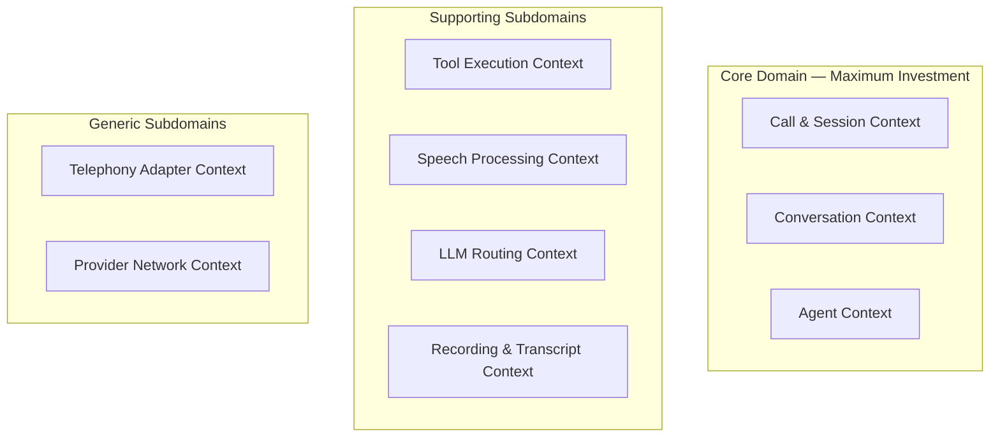

| Context | Classification | Rationale |
|---|---|---|
| **Call & Session** | **Core** | The Call lifecycle — its states, transitions, invariants, and events — is the platform's primary product surface. No off-the-shelf model captures it. |
| **Conversation** | **Core** | Managing multi-turn, context-aware, tool-interspersed dialogue with memory injection and barge-in handling is the platform's central differentiation. |
| **Agent** | **Core** | An Agent's versioned configuration, its capability grants, and the rules governing which Agent Version a live Call runs are bespoke business logic. |
| **Tool Execution** | **Supporting** | Tool calling is essential but its rules (schema validation, timeout enforcement, authorization, audit) are well-bounded and secondary to the call itself. |
| **Speech Processing** | **Supporting** | STT/TTS are provider-backed. The domain's role is defining what speech input/output *means*, not how it is produced. |
| **LLM Routing** | **Supporting** | Provider selection, circuit breaking, and cost/latency scoring are important but their business rules are relatively mechanical once the scoring function is defined. |
| **Recording & Transcript** | **Supporting** | Recording policy and transcript persistence are required but their rules are simple (record if policy says so, persist every segment). |
| **Telephony Adapter** | **Generic** | Pure infrastructure adapter — the domain defines what a Call is; Telephony Adapter is how the audio leg is established with a specific carrier. |
| **Provider Network** | **Generic** | Health polling, circuit breaking, and provider configuration are cross-cutting infrastructure concerns. |

### 2.1 Why These Are Not All Separate Deployable Services

Following Phase 3B's modular-monolith-first decision, all contexts above run as modules within two deployables (`apps/voice_gateway` and `apps/worker`). The context boundaries are **module boundaries with enforced import rules** (3A §2.3), not service boundaries. The seams are designed so that `Call & Session`, `Conversation`, and `Agent` could each be extracted into its own service independently without changing their domain models — the extraction would be a deployment topology change, not a domain redesign.

**Why Call & Session and Conversation are not merged:** a Call that is placed on Hold and resumed has one Call aggregate but starts a new Call Session. The Conversation aggregate accumulates Turns across all Call Sessions of the Call. Merging them would force the Conversation aggregate to own call-status-transition logic that belongs to the Call — violating SRP and creating a giant aggregate. They reference each other by ID but maintain independent transaction boundaries.

---

## 3. Context Map

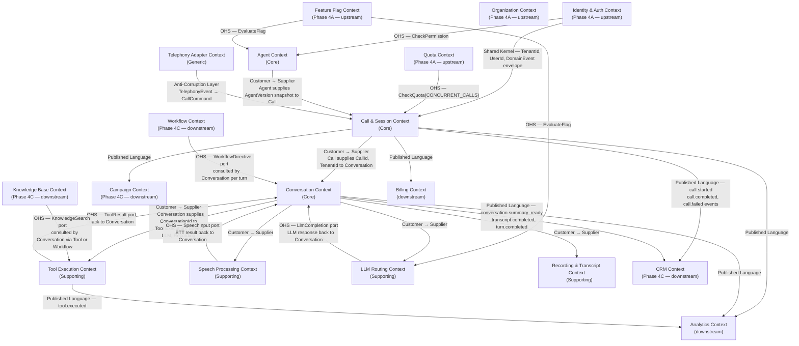

---

## 4. Bounded Context Descriptions

### 4.1 Call & Session Context — Core

**What it owns:** the Call aggregate (its state machine, lifecycle events, and the business rules governing what transitions are legal under what conditions). The Call Session sub-concept (a period of active audio within a Call). Phone Number assignment. Call Direction. Call Outcome. Concurrency quota enforcement. Transfer commands.

**What it does NOT own:** audio content (Speech Processing), conversation logic (Conversation Context), which Agent is used (Agent Context supplies a snapshot at session start).

**Published Language:** `call.initiated`, `call.answered`, `call.ended`, `call.failed`, `call.transferred`, `call.held`, `call.resumed`, `call.voicemail_detected` — consumed by CRM, Campaign, Billing, Analytics.

### 4.2 Conversation Context — Core

**What it owns:** the Turn loop — detecting utterances, assembling user speech into a Turn, driving LLM completion, driving Tool Execution, assembling the Agent Response, and updating the Transcript. The Conversation aggregate and its accumulated Turns. Barge-in detection rules. Context window management. Conversation Summary production.

**What it does NOT own:** the actual STT/TTS/LLM network calls (those are provider ports). Tool execution logic (Tool Execution Context). Recording (Recording & Transcript Context, though Conversation triggers it).

### 4.3 Agent Context — Core

**What it owns:** the Agent aggregate (name, capabilities, Voice Configuration, Model Configuration, Tool permissions, Workflow reference, Knowledge Base references). Agent Versioning — creating and publishing Agent Versions. The rule that a live Call always runs a pinned Agent Version. Agent lifecycle (draft, published, deprecated).

**What it does NOT own:** the Workflow graph itself (Workflow Context, Phase 4C). The prompt template itself (Prompt Management, Phase 4C). The Tools' implementations (Tool Execution Context).

### 4.4 Tool Execution Context — Supporting

**What it owns:** the Tool Definition aggregate (schema, permissions, timeout), the Tool Execution aggregate (one invocation record per use of a Tool within a Turn), the authorization check before execution, timeout enforcement, and the execution result.

**Relationship to Phase 4A:** Tool Execution checks `Permission` via the Authorization OHS before running any Tool.

### 4.5 Speech Processing Context — Supporting

**What it owns:** the domain concepts of SpeechInput (a completed STT result), SpeechOutput (a TTS synthesis request and its streamed result), and UtteranceDetectionConfig (endpointing and barge-in sensitivity parameters). Provider selection for STT and TTS is delegated to the Provider Network Context.

### 4.6 LLM Routing Context — Supporting

**What it owns:** the ProviderConfig aggregate, the ModelSpec entity, the routing and scoring algorithm, and the circuit-breaker state. Determines which LLM provider/model handles a given completion request.

### 4.7 Recording & Transcript Context — Supporting

**What it owns:** the Recording aggregate (reference to stored audio, policy enforcement), the Transcript aggregate (ordered, versioned list of TranscriptSegments), and the Sentiment computation.

### 4.8 Telephony Adapter Context — Generic

**What it owns:** translation of telephony-provider-specific webhook events and media-stream control signals into domain commands understood by the Call & Session Context. Acts as the Anti-Corruption Layer between the platform domain and the carrier network.

---

## 5. Aggregates

### 5.1 Call Aggregate

**Aggregate Root:** `Call`

**Rationale for boundary:** the Call's state machine is the consistency nucleus — every audio-path operation (transfer, hold, resume, end) must be serialised against the Call's current state. The Call Session (the active audio period) is an embedded entity because a Call never has more than a handful of sessions, and a session only makes sense in the context of its Call. Recording and Transcript are **not** embedded — they are separate aggregates (§5.6, §5.7) that reference the Call by ID.

```
Call (AggregateRoot)
├── CallId                    (Value Object — UUIDv7, immutable)
├── TenantId                  (Value Object — from Phase 4A Shared Kernel)
├── Direction                 (Value Object — INBOUND | OUTBOUND)
├── CallStatus                (Value Object — state machine node — see §7.1)
├── From                      (Value Object — E164PhoneNumber)
├── To                        (Value Object — E164PhoneNumber)
├── TenantPhoneNumberRef      (Value Object — the platform number involved)
├── AgentVersionRef           (Value Object — AgentVersionId, pinned at call start)
├── ConversationRef           (Value Object — ConversationId, set when conversation starts)
├── ProviderCallRef           (Value Object — opaque carrier leg ID)
├── CampaignLeadRef           (Value Object — nullable, set for campaign-originated calls)
├── Sessions                  (list[CallSession], embedded — bounded ~1–3 per call)
│   └── CallSession (Entity)
│       ├── SessionId         (Value Object — UUIDv7)
│       ├── StartedAt         (Value Object — datetime)
│       ├── EndedAt           (Value Object — nullable datetime)
│       └── SessionOutcome    (Value Object — ACTIVE | COMPLETED | TRANSFERRED | ABANDONED)
├── TransferTarget            (Value Object — nullable E164PhoneNumber or QueueId)
├── Outcome                   (Value Object — CallOutcome — set at terminal state)
├── StartedAt                 (Value Object — datetime)
├── AnsweredAt                (Value Object — nullable datetime)
├── EndedAt                   (Value Object — nullable datetime)
└── LatencyProfile            (Value Object — per-stage p50 latency in ms, updated per turn)
    ├── SttP50Ms
    ├── LlmFirstTokenP50Ms
    ├── TtsFirstAudioP50Ms
    └── TurnE2EP50Ms
```

**Invariants:**
1. `AgentVersionRef` is set at Call creation and **never changes** for the lifetime of the Call — even if the Agent's published version is updated mid-call.
2. A Call in any terminal state (`COMPLETED`, `FAILED`, `CANCELLED`, `VOICEMAIL`) is immutable — no further commands are accepted.
3. Only one `CallSession` may have `SessionOutcome = ACTIVE` at any time — at most one active audio session per Call.
4. `From` and `To` are never null — if they are unknown at creation, Call creation must fail.
5. `ConversationRef` is set exactly once — when the Conversation is created after the Call is answered. It cannot be changed afterward.
6. `CampaignLeadRef` is set at creation for campaign-originated calls and null for all others — it is immutable.

**Business Rules:**
- An outbound Call that is not answered within the platform's configured ring timeout transitions to `NO_ANSWER`.
- A Call on HOLD that is not resumed within the hold timeout transitions to `ABANDONED`.
- A Call may be transferred at most once — after transfer, the Call transitions to `TRANSFERRED` (terminal). A second transfer is not a new transfer on the same Call; it is a new call leg originated by the receiving party.
- `LatencyProfile` is updated after each Turn as a running percentile — it never blocks the turn loop (fire-and-forget update).

**Commands:** `InitiateCall`, `AnswerCall`, `StartConversation`, `HoldCall`, `ResumeCall`, `TransferCall`, `EndCall`, `MarkVoicemail`, `RecordOutcome`

**Domain Events:** `CallInitiated`, `CallRinging`, `CallAnswered`, `ConversationStarted`, `CallHeld`, `CallResumed`, `CallTransferred`, `CallEnded`, `CallFailed`, `VoicemailDetected`, `CallOutcomeRecorded`

**Repository:** `CallRepository` — tenant-scoped; queries by `CallId`, by `TenantPhoneNumberRef`, by `CampaignLeadRef`.

**Transaction boundary:** single Call aggregate per transaction. The `StartConversation` command sets `ConversationRef` and the Conversation aggregate is saved in the same Unit of Work — the one case where two aggregates are saved together (analogous to the `OrganizationFactory` pattern in 4A).

---

### 5.2 Conversation Aggregate

**Aggregate Root:** `Conversation`

**Rationale for boundary:** the Conversation is the cognitive record of the interaction — every Turn, every Tool invocation reference, and the final Summary. Its transaction boundary is the Turn loop: each completed Turn is a consistent unit that must be checkpointed atomically. The Conversation is separate from the Call because Conversations have their own lifecycle events (summarization, sentiment computation) that occur after the Call ends.

**Why Turns are embedded (as entities), not separate aggregates:** a Turn only makes sense within its Conversation — there is no use case that loads a Turn without its Conversation context. Turns are bounded (a conversation rarely exceeds ~50 turns even for long calls) and always written together with their parent Conversation in a checkpoint. This is the same reasoning that keeps `CallSession` embedded in `Call`.

```
Conversation (AggregateRoot)
├── ConversationId            (Value Object — UUIDv7)
├── CallRef                   (Value Object — CallId, immutable)
├── TenantId                  (Value Object)
├── AgentVersionRef           (Value Object — same pin as the Call, copied for locality)
├── ContactRef                (Value Object — nullable ContactId, set if CRM match found)
├── Status                    (Value Object — ACTIVE | COMPLETED | SUMMARIZED)
├── Turns                     (list[Turn], embedded, ordered — see below)
├── ActiveMemoryRef           (Value Object — nullable ConversationMemoryRef)
├── QualificationOutcome      (Value Object — nullable — QUALIFIED | DISQUALIFIED | INCONCLUSIVE)
├── Sentiment                 (Value Object — nullable SentimentScore — computed post-call)
├── Summary                   (Value Object — nullable ConversationSummary — generated post-call)
├── TokensUsed                (Value Object — cumulative TokenUsage — updated per turn)
├── StartedAt                 (Value Object — datetime)
└── CompletedAt               (Value Object — nullable datetime)

Turn (Entity — embedded in Conversation)
├── TurnId                    (Value Object — UUIDv7, ordered by sequence_number)
├── SequenceNumber            (Value Object — integer, monotonically increasing)
├── Utterance                 (Entity)
│   ├── RawTranscript         (Value Object — final STT text)
│   ├── Confidence            (Value Object — ConfidenceScore 0.0–1.0)
│   ├── DetectedLanguage      (Value Object — BCP 47 + script code)
│   ├── UtteranceStartMs      (Value Object — milliseconds from call start)
│   └── UtteranceEndMs        (Value Object — milliseconds from call start)
├── AgentResponse             (Entity — nullable, set when LLM produces output)
│   ├── ResponseText          (Value Object — the generated text)
│   ├── DirectiveKind         (Value Object — SPEAK | TRANSFER | END_CALL | TOOL_CALL | WAIT)
│   └── WorkflowNodeRef       (Value Object — nullable, which workflow node drove this)
├── ToolExecutionRefs         (list[ToolExecutionId] — references, not embedded)
├── LlmProvider               (Value Object — which provider handled this turn)
├── SttProvider               (Value Object — which provider handled this turn)
├── Latency                   (Value Object — TurnLatency — STT, LLM, TTS, E2E ms)
├── BargeInOccurred           (Value Object — boolean)
└── CompletedAt               (Value Object — nullable datetime)
```

**Invariants:**
1. `SequenceNumber` is monotonically increasing within a Conversation — no gaps, no duplicates.
2. A Turn may not be added after the Conversation's `Status = COMPLETED`.
3. `QualificationOutcome` is set at most once — it is immutable once set. The Agent may qualify or disqualify a caller, but cannot un-qualify.
4. `TokensUsed` accumulates across all Turns — it is never decremented.
5. `ContactRef` is set at most once — if a CRM match is found mid-conversation, it is set then; it cannot be changed to a different Contact within the same Conversation.

**Business Rules:**
- A Conversation without any completed Turns at Call end is still valid — it represents a call where the caller hung up before speaking.
- `QualificationOutcome = QUALIFIED` is only valid if the Agent's configuration includes qualification criteria.
- Summarization (`Status → SUMMARIZED`) happens asynchronously after `Status → COMPLETED`, always in a background worker. The domain event `ConversationSummarizationCompleted` signals completion.
- If context window compression is needed (accumulated token count approaching the model's limit), the domain signals this via a `ContextWindowApproaching` domain event — the infrastructure's Memory adapter reacts by summarizing older turns and injecting the summary. The Conversation aggregate does not itself call any LLM.

**Commands:** `BeginConversation`, `RecordUtterance`, `RecordAgentResponse`, `RecordToolExecutionRef`, `SetQualificationOutcome`, `SetContactRef`, `CompleteConversation`, `SetSentiment`, `SetSummary`

**Domain Events:** `ConversationStarted`, `TurnCompleted`, `BargeInOccurred`, `QualificationOutcomeSet`, `ContactMatched`, `ContextWindowApproaching`, `ConversationCompleted`, `SentimentComputed`, `ConversationSummarizationCompleted`

**Repository:** `ConversationRepository` — tenant-scoped; queries by `ConversationId`, by `CallRef`, by `ContactRef`.

**Transaction boundary:** checkpointed per completed Turn (one Postgres write per turn, ~every few seconds). Partial STT fragments are never checkpointed — only the final, complete Turn is written. Redis hot-tier carries the in-flight turn state between checkpoints.

---

### 5.3 Agent Aggregate

**Aggregate Root:** `Agent`

**Rationale for boundary:** the Agent's configuration is the controlling document for a Call. Its version-pinning invariant is critical — a live Call must not be affected by an Agent configuration change published after the Call started. Versioning requires the entire configuration to be snapshotted atomically.

```
Agent (AggregateRoot)
├── AgentId                   (Value Object — UUIDv7)
├── TenantId                  (Value Object)
├── Name                      (Value Object — AgentName, 2–100 chars)
├── Description               (Value Object — 0–500 chars)
├── Status                    (Value Object — DRAFT | PUBLISHED | DEPRECATED)
├── PublishedVersionRef       (Value Object — nullable AgentVersionId)
├── DraftConfig               (Entity — the current editable configuration)
│   ├── VoiceConfig           (Entity — see §5.3.1)
│   ├── ModelConfig           (Entity — see §5.3.2)
│   ├── PromptRef             (Value Object — PromptId from Prompt Management)
│   ├── WorkflowRef           (Value Object — nullable WorkflowId from Workflow Context)
│   ├── KnowledgeBaseRefs     (list[KnowledgeBaseId] — from KB Context)
│   ├── ToolPermissions       (list[ToolPermission] — which Tools this Agent may invoke)
│   ├── QualificationCriteria (Value Object — nullable structured criteria)
│   └── CallingHours          (Value Object — nullable TimeWindow)
└── Versions                  (list[AgentVersion], embedded — bounded, ~< 50 per agent)
    └── AgentVersion (Entity)
        ├── AgentVersionId    (Value Object — UUIDv7)
        ├── VersionNumber     (Value Object — integer, monotonically increasing)
        ├── SnapshotJson      (Value Object — immutable JSON snapshot of DraftConfig at publish time)
        ├── PublishedAt       (Value Object — datetime)
        └── PublishedBy       (Value Object — UserId)
```

**§5.3.1 VoiceConfig Entity:**
```
VoiceConfig
├── VoiceId             (Value Object — provider-agnostic voice identity)
├── Language            (Value Object — BCP 47, includes Tamil: "ta" | "ta-IN")
├── SpeakingRate        (Value Object — 0.5–2.0 normalized)
├── Emotion             (Value Object — NEUTRAL | FRIENDLY | PROFESSIONAL | EMPATHETIC)
├── BargeInSensitivity  (Value Object — LOW | MEDIUM | HIGH)
└── TamilCodeSwitching  (Value Object — boolean — enables mixed Tamil-English handling)
```

**§5.3.2 ModelConfig Entity:**
```
ModelConfig
├── PreferredProvider   (Value Object — ProviderId — nullable, Router selects if null)
├── FallbackProviders   (list[ProviderId] — ordered failover list)
├── LatencyBias         (Value Object — 0.0–1.0, 1.0 = always pick fastest)
├── CostBias            (Value Object — 0.0–1.0, 1.0 = always pick cheapest)
└── MaxTokensPerTurn    (Value Object — nullable integer)
```

**Invariants:**
1. An `Agent` in `DEPRECATED` status cannot be published again — the only forward transition is deletion (soft delete).
2. `PublishedVersionRef` always points to a `VersionNumber` that exists in `Versions` — it is never dangling.
3. `AgentVersion.SnapshotJson` is immutable once written — the entity has no setter.
4. A `ToolPermission` listed in `DraftConfig.ToolPermissions` must reference a Tool that exists in the Tool Execution Context (validated at publish time by an Application Service that calls `ToolExecutionContext.tool_exists()`).
5. `VoiceConfig.Language` must be a valid BCP 47 code from the platform's supported language list (validated at domain level against a Value Object whitelist).

**Business Rules:**
- `publish()` creates a new `AgentVersion`, increments `VersionNumber`, serialises `DraftConfig` to `SnapshotJson`, and sets `PublishedVersionRef` to the new version's ID — all within one transaction on the Agent aggregate.
- A DRAFT Agent cannot handle calls — the platform's Call initiation logic rejects a `CallConfiguration` that references a DRAFT Agent.
- `TamilCodeSwitching = true` in `VoiceConfig` is a domain-level capability flag. STT and TTS providers that do not support Tamil code-switching must not be selected when this flag is set — this constraint is enforced by the Speech Processing Context's provider selection, which consults `VoiceConfig.TamilCodeSwitching`.

**Commands:** `CreateAgent`, `UpdateDraftConfig`, `PublishAgent`, `DeprecateAgent`, `CloneAgent`

**Domain Events:** `AgentCreated`, `AgentConfigUpdated`, `AgentPublished`, `AgentDeprecated`

**Repository:** `AgentRepository` — tenant-scoped; queries by `AgentId`, by `Status`.

---

### 5.4 ToolDefinition Aggregate

**Aggregate Root:** `ToolDefinition`

**Rationale:** already designed in Phase 3D and Phase 4A context. Reproduced here for Voice domain completeness, with Voice-specific invariants called out.

```
ToolDefinition (AggregateRoot)
├── ToolId                    (Value Object — UUIDv7 or stable string for built-ins)
├── TenantId                  (Value Object — null for platform built-ins)
├── ToolName                  (Value Object — unique within scope, snake_case)
├── Description               (Value Object — what the LLM reads to decide whether to call)
├── InputSchema               (Value Object — JSON Schema object)
├── OutputSchema              (Value Object — JSON Schema object)
├── IsBuiltIn                 (Value Object — boolean)
├── TimeoutMs                 (Value Object — integer, 100–30000)
├── RequiresConfirmation      (Value Object — boolean — human must approve before execution)
└── MaxRetriesOnTimeout       (Value Object — 0–2)
```

---

### 5.5 ToolExecution Aggregate

**Aggregate Root:** `ToolExecution`

**Rationale for separate aggregate (not embedded in Turn):** a ToolExecution may itself trigger asynchronous work (e.g., `bookAppointment` calls an external calendar API). It has its own lifecycle (PENDING → RUNNING → SUCCEEDED / FAILED / TIMED_OUT) independent of the Turn that triggered it. Embedding it in the Turn would make the Turn aggregate responsible for the ToolExecution's own state machine — violating SRP.

```
ToolExecution (AggregateRoot)
├── ToolExecutionId           (Value Object — UUIDv7)
├── ConversationRef           (Value Object — ConversationId)
├── TurnRef                   (Value Object — TurnId)
├── TenantId                  (Value Object)
├── ToolRef                   (Value Object — ToolId)
├── ToolName                  (Value Object — denormalized for audit readability)
├── Arguments                 (Value Object — validated dict, immutable after creation)
├── Status                    (Value Object — PENDING | RUNNING | SUCCEEDED | FAILED | TIMED_OUT)
├── Result                    (Value Object — nullable ToolResult — set on terminal state)
├── AttemptCount              (Value Object — integer)
├── AuthorizedBy              (Value Object — AuthorizationDecision record)
├── StartedAt                 (Value Object — datetime)
└── CompletedAt               (Value Object — nullable datetime)
```

**Invariants:**
1. `Arguments` are validated against `ToolDefinition.InputSchema` at creation — a ToolExecution with invalid arguments cannot be created.
2. `Status` transitions are monotonic: PENDING → RUNNING → (SUCCEEDED | FAILED | TIMED_OUT). No backward transitions.
3. `AttemptCount` never exceeds `ToolDefinition.MaxRetriesOnTimeout + 1`.
4. A ToolExecution can only be created if the `AuthorizedBy` decision is `ALLOWED` — a DENIED authorization is a domain error, not a retry case.

**Commands:** `AuthorizeAndStartToolExecution`, `RecordToolResult`, `RecordToolTimeout`, `RecordToolFailure`

**Domain Events:** `ToolExecutionStarted`, `ToolExecutionSucceeded`, `ToolExecutionFailed`, `ToolExecutionTimedOut`

---

### 5.6 Recording Aggregate

```
Recording (AggregateRoot)
├── RecordingId               (Value Object — UUIDv7)
├── CallRef                   (Value Object — CallId)
├── TenantId                  (Value Object)
├── StorageRef                (Value Object — S3/Supabase object path — opaque to domain)
├── RecordingStatus           (Value Object — PENDING | IN_PROGRESS | STORED | FAILED | DELETED)
├── DurationSeconds           (Value Object — nullable integer, set when stored)
├── FileSizeBytes             (Value Object — nullable integer)
├── RecordingPolicy           (Value Object — from OrgSettings — ENABLED | DISABLED | REQUIRES_CONSENT)
├── ConsentObtained           (Value Object — nullable boolean)
└── RetentionPolicy           (Value Object — DeleteAfterDays — from plan tier)
```

**Invariants:**
1. A Recording cannot transition to `IN_PROGRESS` unless `RecordingPolicy = ENABLED` or (`RecordingPolicy = REQUIRES_CONSENT` and `ConsentObtained = true`).
2. A `DELETED` Recording is immutable — its `StorageRef` is cleared but the Recording aggregate itself is retained for audit purposes.
3. `RetentionPolicy` is copied from the Organisation's plan at recording creation time — it does not update if the plan changes mid-recording.

---

### 5.7 Transcript Aggregate

```
Transcript (AggregateRoot)
├── TranscriptId              (Value Object — UUIDv7)
├── ConversationRef           (Value Object — ConversationId)
├── TenantId                  (Value Object)
├── Segments                  (list[TranscriptSegment], ordered, append-only)
│   └── TranscriptSegment (Entity)
│       ├── SegmentId         (Value Object — UUIDv7)
│       ├── SequenceNumber    (Value Object — integer)
│       ├── Speaker           (Value Object — CALLER | AGENT | SYSTEM)
│       ├── Text              (Value Object — final STT or TTS text)
│       ├── IsPartial         (Value Object — boolean — partial segments are overwritten by final)
│       ├── StartMs           (Value Object — ms from call start)
│       ├── EndMs             (Value Object — ms from call start)
│       └── SegmentMetadata   (Value Object — language, confidence for STT; tool_name for SYSTEM)
├── Status                    (Value Object — IN_PROGRESS | COMPLETED)
└── CompletedAt               (Value Object — nullable datetime)
```

**Invariants:**
1. `Segments` are append-only — a final segment cannot be deleted. A partial segment (`IsPartial = true`) may be overwritten by a subsequent segment with the same `SequenceNumber` and `IsPartial = false`.
2. `SequenceNumber` is monotonically increasing within a Transcript.
3. A `COMPLETED` Transcript accepts no new Segments.

**Why Recording and Transcript are separate aggregates (not embedded in Conversation):** Transcript is append-only and written at very high frequency (every STT partial fragment). Embedding it in Conversation would make every partial STT update lock the Conversation aggregate. Recording has its own lifecycle (it may be deleted independently of the Conversation). Both reference the Conversation by ID but maintain independent transaction boundaries.

---

### 5.8 ProviderConfig Aggregate

```
ProviderConfig (AggregateRoot)
├── ProviderConfigId          (Value Object — UUIDv7)
├── TenantId                  (Value Object — nullable: null = platform-default)
├── Category                  (Value Object — TELEPHONY | STT | TTS | LLM | EMBEDDING)
├── ProviderId                (Value Object — stable string, e.g. "deepgram", "openai")
├── ModelId                   (Value Object — nullable string, e.g. "gpt-4o")
├── IsActive                  (Value Object — boolean)
├── Priority                  (Value Object — integer, lower = preferred)
├── HealthState               (Value Object — AVAILABLE | DEGRADED | UNAVAILABLE)
├── LastHealthCheckAt         (Value Object — datetime)
├── P50LatencyMs              (Value Object — nullable integer)
├── ErrorRatePct              (Value Object — 0.0–100.0)
└── CircuitState              (Value Object — CLOSED | OPEN | HALF_OPEN)
```

**Invariants:**
1. A `ProviderConfig` with `CircuitState = OPEN` is never selected by the routing algorithm.
2. `Priority` is unique within `(TenantId, Category)` — no two active providers in the same category for the same tenant share a priority.
3. `HealthState` is derived from `ErrorRatePct` and `P50LatencyMs` by the `ProviderHealthEvaluationService` — it is never set directly by commands.

---

## 6. Value Objects — Complete Catalogue

| Value Object | Type | Validation |
|---|---|---|
| `CallId` | UUIDv7 wrapper | Valid UUID |
| `ConversationId` | UUIDv7 wrapper | Valid UUID |
| `AgentId` | UUIDv7 wrapper | Valid UUID |
| `AgentVersionId` | UUIDv7 wrapper | Valid UUID |
| `ToolId` | String or UUIDv7 | Valid UUID for custom, non-empty string for built-ins |
| `ToolExecutionId` | UUIDv7 wrapper | Valid UUID |
| `RecordingId` | UUIDv7 wrapper | Valid UUID |
| `TranscriptId` | UUIDv7 wrapper | Valid UUID |
| `ProviderConfigId` | UUIDv7 wrapper | Valid UUID |
| `TurnId` | UUIDv7 wrapper | Valid UUID |
| `SessionId` | UUIDv7 wrapper | Valid UUID |
| `E164PhoneNumber` | String | E.164 format — `+[country][subscriber]`, 7–15 digits |
| `TenantPhoneNumber` | Compound | `(TenantId, E164PhoneNumber)` |
| `CallDirection` | Enum | `INBOUND \| OUTBOUND` |
| `CallStatus` | Enum | Full state machine — §7.1 |
| `CallOutcome` | Enum | `ANSWERED_COMPLETED \| ANSWERED_TRANSFERRED \| NO_ANSWER \| VOICEMAIL \| FAILED \| CANCELLED` |
| `SessionOutcome` | Enum | `ACTIVE \| COMPLETED \| TRANSFERRED \| ABANDONED` |
| `ConversationStatus` | Enum | `ACTIVE \| COMPLETED \| SUMMARIZED` |
| `AgentStatus` | Enum | `DRAFT \| PUBLISHED \| DEPRECATED` |
| `ToolExecutionStatus` | Enum | `PENDING \| RUNNING \| SUCCEEDED \| FAILED \| TIMED_OUT` |
| `RecordingStatus` | Enum | `PENDING \| IN_PROGRESS \| STORED \| FAILED \| DELETED` |
| `DirectiveKind` | Enum | `SPEAK \| TRANSFER \| END_CALL \| TOOL_CALL \| WAIT` |
| `ProviderId` | String | Non-empty, lowercase, snake_case |
| `ModelId` | String | Non-empty string |
| `ProviderCategory` | Enum | `TELEPHONY \| STT \| TTS \| LLM \| EMBEDDING` |
| `CircuitState` | Enum | `CLOSED \| OPEN \| HALF_OPEN` |
| `HealthState` | Enum | `AVAILABLE \| DEGRADED \| UNAVAILABLE` |
| `Speaker` | Enum | `CALLER \| AGENT \| SYSTEM` |
| `ConfidenceScore` | Decimal | 0.0–1.0 |
| `SentimentScore` | Compound | `(label: POSITIVE\|NEUTRAL\|NEGATIVE, score: 0.0–1.0)` |
| `QualificationOutcome` | Enum | `QUALIFIED \| DISQUALIFIED \| INCONCLUSIVE` |
| `Language` | String | BCP 47 language tag |
| `VoiceId` | String | Provider-agnostic voice identifier |
| `Emotion` | Enum | `NEUTRAL \| FRIENDLY \| PROFESSIONAL \| EMPATHETIC` |
| `BargeInSensitivity` | Enum | `LOW \| MEDIUM \| HIGH` |
| `ToolName` | String | `[a-z][a-zA-Z0-9]{1,63}` — camelCase |
| `ToolResult` | Compound | `(success: bool, data: dict \| None, error: str \| None)` |
| `TokenUsage` | Compound | `(prompt_tokens: int, completion_tokens: int, total_tokens: int)` |
| `TurnLatency` | Compound | `(stt_ms: int, llm_first_token_ms: int, tts_first_audio_ms: int, e2e_ms: int)` |
| `ConversationSummary` | String | LLM-generated narrative, max 2000 chars |
| `LatencyBudget` | Compound | Per-stage ms targets — matches §21 of Phase 3B |
| `StorageRef` | String | Opaque S3/Supabase object path |
| `ProviderCallRef` | String | Opaque carrier-issued call identifier |
| `RetentionPolicy` | Compound | `(delete_after_days: int \| None)` |

---

## 7. State Machines

### 7.1 Call Lifecycle

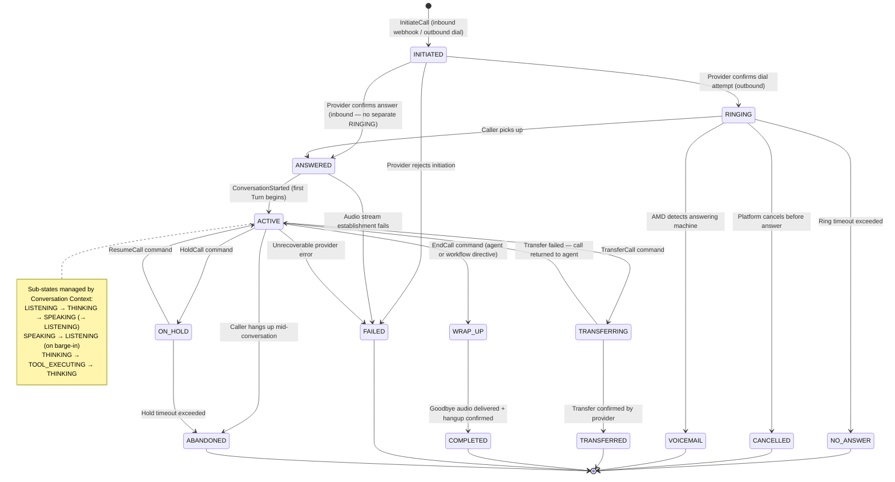

**Transition Guards:**
- `ACTIVE → TRANSFERRING`: `TransferTarget` must be non-null; `CallStatus` must be ACTIVE (not ON_HOLD).
- `ON_HOLD → ACTIVE`: hold duration must be within the configured hold timeout.
- `ACTIVE → WRAP_UP`: allowed only by an `EndCall` command from the Workflow Engine directive, an explicit caller hang-up, or a platform timeout.
- `INITIATED → ANSWERED` (inbound): only via telephony provider's answer webhook — not directly commandable.

### 7.2 Conversation Lifecycle

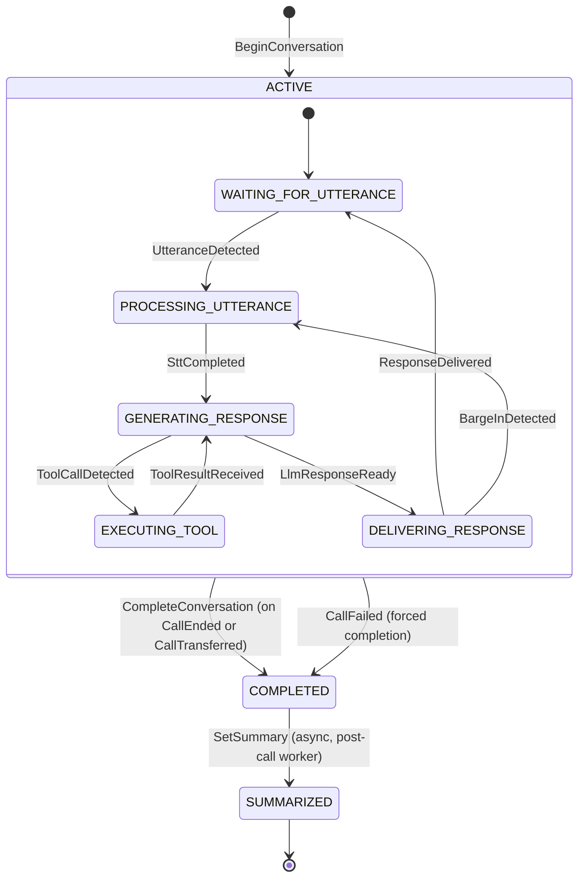

### 7.3 Agent Lifecycle

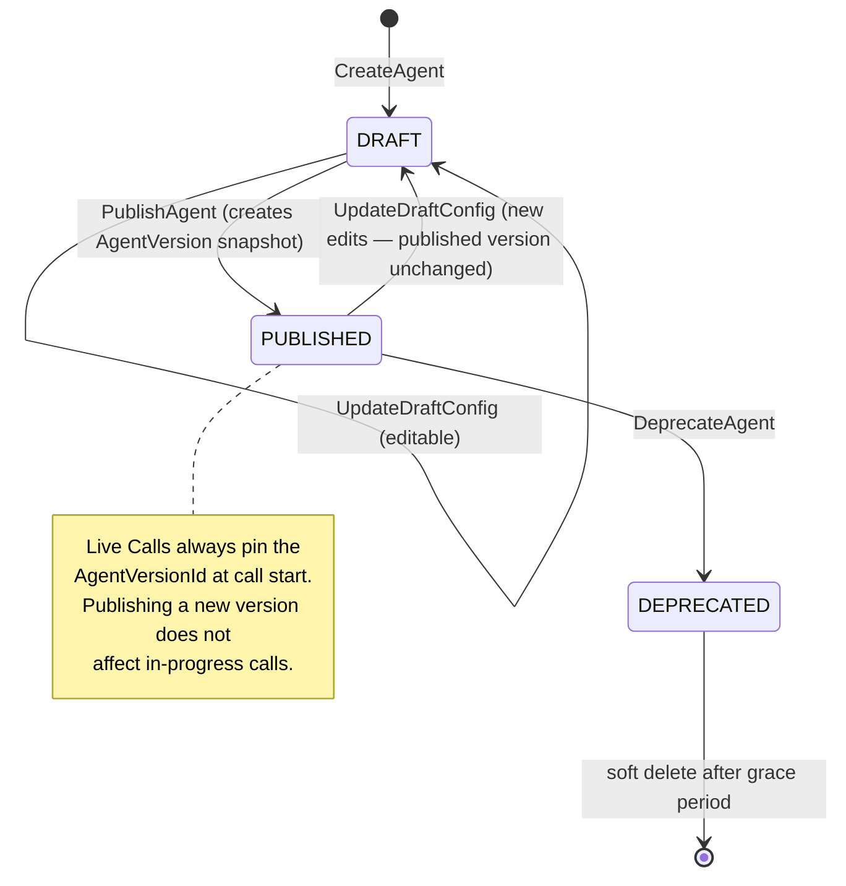

### 7.4 Tool Execution Lifecycle

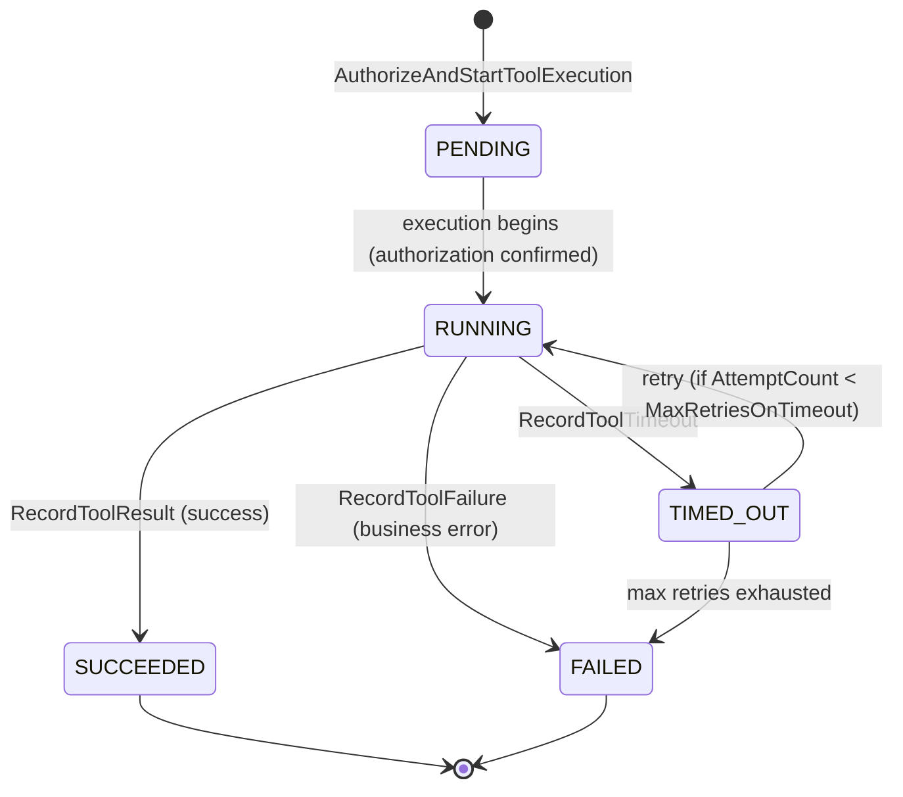

### 7.5 Provider Failover Lifecycle

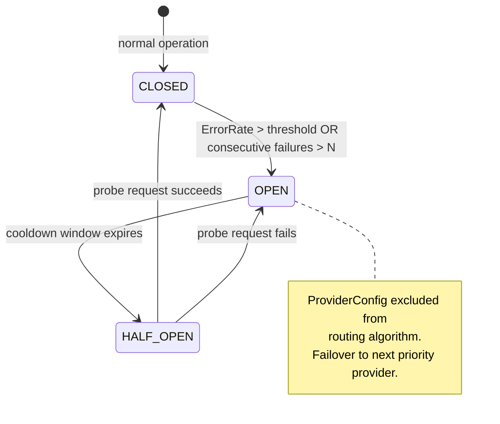

---

## 8. Domain Services

### 8.1 CallRoutingService

Determines which `TenantPhoneNumber` and `AgentVersionRef` to associate with an inbound call based on the called number.

```python
class CallRoutingService:
    """
    Given an inbound call's To number, resolve the correct Agent.
    Invariant: a number not associated with any published Agent causes CallFailed.
    Pure lookup — no mutation.
    """
    def resolve(self, to_number: E164PhoneNumber, tenant_id: TenantId) -> AgentVersionRef: ...
```

### 8.2 ProviderSelectionService

Selects the best available provider for a given category and request context, respecting the Agent's `ModelConfig.PreferredProvider` and circuit-breaker state.

```python
class ProviderSelectionService:
    """
    Pure scoring function — no I/O. Receives pre-loaded ProviderConfig list.
    Returns the highest-scoring provider whose CircuitState = CLOSED.
    Raises AllProvidersUnavailableError if all configs are OPEN.
    """
    def select(
        self,
        candidates: list[ProviderConfig],
        model_config: ModelConfig,
        latency_budget: LatencyBudget,
        voice_config: VoiceConfig,       # includes TamilCodeSwitching flag
    ) -> ProviderConfig: ...
```

**Tamil code-switching constraint:** when `VoiceConfig.TamilCodeSwitching = true`, the scoring function penalises (or fully excludes) providers whose `ModelId` does not support Tamil — this is a domain rule (the domain knows the requirement) but not a domain enforcement of a vendor API (the provider list's Tamil support flag is set by platform configuration, not hardcoded in domain logic).

### 8.3 BargeInDetectionService

Evaluates a stream of partial STT confidence events and returns a `BargeInDecision` based on the Agent's `VoiceConfig.BargeInSensitivity`.

```python
class BargeInDetectionService:
    """
    Pure function — receives a partial transcript confidence value and
    the current BargeInSensitivity setting.
    Returns BARGE_IN_DETECTED | CONTINUE_SPEAKING.
    """
    def evaluate(
        self,
        partial_confidence: ConfidenceScore,
        sensitivity: BargeInSensitivity,
        agent_speaking_duration_ms: int,
    ) -> BargeInDecision: ...
```

**Why a domain service, not application code:** the threshold mapping (`BargeInSensitivity.HIGH → confidence > 0.4`) is a business decision (too sensitive interrupts on noise; too insensitive makes the agent feel robotic). It belongs in the domain, not in infrastructure code.

### 8.4 ProviderHealthEvaluationService

Derives `HealthState` from raw telemetry, and determines whether to trip/reset the circuit.

```python
class ProviderHealthEvaluationService:
    """
    Given recent error rate and p50 latency for a provider, returns
    the derived HealthState and whether the circuit should transition.
    Pure function — receives pre-computed metrics.
    """
    def evaluate(
        self,
        error_rate_pct: float,
        p50_latency_ms: int,
        current_circuit_state: CircuitState,
    ) -> tuple[HealthState, CircuitState]: ...
```

### 8.5 ConversationContextService

Determines how much of the Conversation's Turn history fits within the LLM context window given the current token budget, and signals when summarization is needed.

```python
class ConversationContextService:
    """
    Checks whether TokensUsed + estimated_next_turn_tokens exceeds the model's context limit.
    If so, signals ContextWindowApproaching.
    Does NOT perform summarization — that is an infrastructure concern.
    """
    def check_context_budget(
        self,
        conversation: Conversation,
        model_config: ModelConfig,
        estimated_next_tokens: int,
    ) -> ContextBudgetResult: ...
```

---

## 9. Policies

| Policy | Enforces |
|---|---|
| `AgentMustBePublished` | A Call cannot start on a DRAFT Agent — checked at `InitiateCall` |
| `ConcurrentCallQuotaNotExceeded` | `QuotaEnforcementService.check(CONCURRENT_CALLS)` before `InitiateCall` |
| `RecordingConsentRequired` | `RecordingPolicy = REQUIRES_CONSENT` → `ConsentObtained = true` before `IN_PROGRESS` |
| `ToolMustBePermitted` | Tool's `ToolId` must be in the Agent's `ToolPermissions` list |
| `ToolAuthorizationRequired` | `Permission("tool:<tool_name>:execute")` checked before any ToolExecution |
| `CallingWindowEnforced` | Outbound calls are rejected if outside `AgentConfig.CallingHours` |
| `TransferOnlyOncePerCall` | A Call that has already been `TRANSFERRED` cannot be transferred again |
| `ProvidersNotAllOpen` | At least one provider per category must have `CircuitState = CLOSED` |
| `TamilProviderRequired` | When `TamilCodeSwitching = true`, a Tamil-capable STT + TTS provider must be available |

---

## 10. Specifications

```python
class PublishedAgentSpecification(Specification[Agent]):
    def is_satisfied_by(self, agent: Agent) -> bool:
        return agent.status == AgentStatus.PUBLISHED and agent.published_version_ref is not None

class ActiveCallSpecification(Specification[Call]):
    def is_satisfied_by(self, call: Call) -> bool:
        return call.status == CallStatus.ACTIVE

class ToolPermittedSpecification(Specification[ToolExecution]):
    def __init__(self, agent_version: AgentVersion) -> None:
        self._permitted = {tp.tool_id for tp in agent_version.tool_permissions}
    def is_satisfied_by(self, execution: ToolExecution) -> bool:
        return execution.tool_ref in self._permitted

class TamilCapableProviderSpecification(Specification[ProviderConfig]):
    def is_satisfied_by(self, config: ProviderConfig) -> bool:
        return config.supports_tamil  # a platform-configuration flag on ProviderConfig
```

---

## 11. Domain Events — Full Catalogue

### 11.1 Event Envelope

Reuses the `DomainEvent` envelope defined in Phase 4A §9.1. All voice events carry `tenant_id` and `correlation_id` (the call's correlation_id from the first webhook). `aggregate_type` is the name of the emitting aggregate.

### 11.2 Call & Session Events

| Event | Key Payload Fields | Consumed by |
|---|---|---|
| `call.initiated` | `call_id, tenant_id, direction, from, to, agent_version_id, campaign_lead_ref` | Audit, Analytics, Campaign (for outbound) |
| `call.ringing` | `call_id, provider_call_ref` | Audit |
| `call.answered` | `call_id, answered_at` | Audit, Analytics, Billing (start metering) |
| `call.conversation_started` | `call_id, conversation_id` | Conversation Context (begin Turn loop), CRM |
| `call.held` | `call_id, session_id, held_at` | Audit |
| `call.resumed` | `call_id, session_id, resumed_at` | Audit |
| `call.transferring` | `call_id, transfer_target, transfer_type` | Audit, Telephony Adapter |
| `call.transferred` | `call_id, transfer_confirmed_at` | Audit, CRM, Campaign |
| `call.ended` | `call_id, ended_at, duration_seconds, outcome` | Audit, CRM, Campaign, Billing, Analytics |
| `call.failed` | `call_id, failure_reason, failed_at` | Audit, Campaign (trigger retry), Analytics |
| `call.voicemail_detected` | `call_id, voicemail_drop_played` | Audit, Campaign |
| `call.outcome_recorded` | `call_id, outcome` | CRM, Analytics |
| `call.abandoned` | `call_id, abandoned_at` | Audit, Analytics |

### 11.3 Conversation Events

| Event | Key Payload Fields | Consumed by |
|---|---|---|
| `conversation.started` | `conversation_id, call_id, agent_version_id` | Recording Context (start if policy=ENABLED), Transcript Context |
| `conversation.turn_completed` | `conversation_id, turn_id, seq_no, utterance_text, response_text, latency, tool_execution_ids` | Transcript Context (append segments), Analytics, Billing (token usage) |
| `conversation.barge_in_occurred` | `conversation_id, turn_id` | Analytics |
| `conversation.qualification_set` | `conversation_id, outcome, criteria_matched` | CRM (qualify lead), Campaign, Analytics |
| `conversation.contact_matched` | `conversation_id, contact_ref` | CRM |
| `conversation.context_window_approaching` | `conversation_id, tokens_used, model_limit` | Memory service (trigger summarization) |
| `conversation.completed` | `conversation_id, total_turns, total_tokens_used` | Recording Context (finalize), Transcript Context (complete), Billing, Analytics |
| `conversation.sentiment_computed` | `conversation_id, sentiment_score` | CRM, Analytics |
| `conversation.summarization_completed` | `conversation_id, summary_text` | CRM (save to contact notes), Analytics |

### 11.4 Agent Events

| Event | Key Payload Fields | Consumed by |
|---|---|---|
| `agent.created` | `agent_id, tenant_id, name` | Audit, Analytics |
| `agent.config_updated` | `agent_id, changed_fields` | Audit |
| `agent.published` | `agent_id, version_id, version_number` | Audit, Feature Flags (cache invalidation for agent-scoped flags) |
| `agent.deprecated` | `agent_id` | Audit |

### 11.5 Tool Execution Events

| Event | Key Payload Fields | Consumed by |
|---|---|---|
| `tool_execution.started` | `execution_id, conversation_id, turn_id, tool_name, arguments_hash` | Audit, Analytics |
| `tool_execution.succeeded` | `execution_id, result_summary, duration_ms` | Audit, Analytics, Billing (if tool incurs cost) |
| `tool_execution.failed` | `execution_id, error_message, attempt_count` | Audit, Analytics |
| `tool_execution.timed_out` | `execution_id, timeout_ms, attempt_count` | Audit, Analytics |

### 11.6 Provider Events

| Event | Key Payload Fields | Consumed by |
|---|---|---|
| `provider.failed` | `provider_id, category, error_reason, tenant_id` | Provider Network (update health, maybe trip circuit) |
| `provider.failover_triggered` | `from_provider, to_provider, category, tenant_id` | Audit, Analytics |
| `provider.circuit_opened` | `provider_id, category` | Audit, Analytics, PagerDuty (via Alertmanager) |
| `provider.circuit_closed` | `provider_id, category` | Audit |

### 11.7 Recording & Transcript Events

| Event | Key Payload Fields | Consumed by |
|---|---|---|
| `recording.started` | `recording_id, call_id` | Audit |
| `recording.stored` | `recording_id, storage_ref, duration_seconds, size_bytes` | Audit, CRM (attach to contact), Analytics |
| `recording.failed` | `recording_id, failure_reason` | Audit, Analytics |
| `recording.deleted` | `recording_id, deleted_at, deleted_by` | Audit |
| `transcript.segment_added` | `transcript_id, segment_id, speaker, is_partial` | (internal — high frequency, not published to event bus) |
| `transcript.completed` | `transcript_id, conversation_id, total_segments` | Audit, CRM (attach to contact), Analytics |

---

## 12. Commands — Full Catalogue

### 12.1 Call Commands

```python
@dataclass(frozen=True)
class InitiateCall:
    command_id: UUIDv7
    tenant_id: TenantId
    direction: CallDirection
    from_number: E164PhoneNumber
    to_number: E164PhoneNumber
    agent_id: AgentId               # resolved to AgentVersionId by application service
    campaign_lead_ref: str | None

@dataclass(frozen=True)
class AnswerCall:
    command_id: UUIDv7
    call_id: CallId
    provider_call_ref: ProviderCallRef
    answered_at: datetime

@dataclass(frozen=True)
class StartConversation:
    command_id: UUIDv7
    call_id: CallId
    memory_ref: ConversationMemoryRef | None   # pre-loaded by app service

@dataclass(frozen=True)
class HoldCall:
    command_id: UUIDv7
    call_id: CallId
    issued_by: UserId | None        # None if system-initiated

@dataclass(frozen=True)
class ResumeCall:
    command_id: UUIDv7
    call_id: CallId

@dataclass(frozen=True)
class TransferCall:
    command_id: UUIDv7
    call_id: CallId
    transfer_target: E164PhoneNumber
    transfer_type: TransferType     # WARM | COLD

@dataclass(frozen=True)
class EndCall:
    command_id: UUIDv7
    call_id: CallId
    initiated_by: EndCallInitiator  # AGENT_DIRECTIVE | CALLER_HANGUP | SYSTEM_TIMEOUT | ADMIN

@dataclass(frozen=True)
class RecordOutcome:
    command_id: UUIDv7
    call_id: CallId
    outcome: CallOutcome
```

### 12.2 Conversation Commands

```python
@dataclass(frozen=True)
class BeginConversation:
    command_id: UUIDv7
    call_ref: CallId
    tenant_id: TenantId
    agent_version_ref: AgentVersionId

@dataclass(frozen=True)
class RecordUtterance:
    command_id: UUIDv7
    conversation_id: ConversationId
    turn_id: TurnId
    raw_transcript: str
    confidence: ConfidenceScore
    detected_language: Language
    start_ms: int
    end_ms: int

@dataclass(frozen=True)
class RecordAgentResponse:
    command_id: UUIDv7
    conversation_id: ConversationId
    turn_id: TurnId
    response_text: str
    directive_kind: DirectiveKind
    llm_provider: ProviderId
    token_usage: TokenUsage
    latency: TurnLatency

@dataclass(frozen=True)
class SetQualificationOutcome:
    command_id: UUIDv7
    conversation_id: ConversationId
    outcome: QualificationOutcome
    criteria_matched: list[str]

@dataclass(frozen=True)
class CompleteConversation:
    command_id: UUIDv7
    conversation_id: ConversationId
```

### 12.3 Agent Commands

```python
@dataclass(frozen=True)
class CreateAgent:
    command_id: UUIDv7
    tenant_id: TenantId
    name: str
    description: str
    created_by: UserId

@dataclass(frozen=True)
class PublishAgent:
    command_id: UUIDv7
    agent_id: AgentId
    published_by: UserId
    # draft config snapshot is taken from Agent.DraftConfig at publish time
    # not passed in the command — ensures the exact saved draft is published

@dataclass(frozen=True)
class UpdateDraftConfig:
    command_id: UUIDv7
    agent_id: AgentId
    updated_by: UserId
    voice_config: VoiceConfig | None
    model_config: ModelConfig | None
    prompt_ref: str | None
    workflow_ref: str | None
    knowledge_base_refs: list[str] | None
    tool_permissions: list[ToolPermission] | None
    qualification_criteria: dict | None
    calling_hours: dict | None
```

### 12.4 Tool Execution Commands

```python
@dataclass(frozen=True)
class AuthorizeAndStartToolExecution:
    command_id: UUIDv7
    conversation_id: ConversationId
    turn_id: TurnId
    tenant_id: TenantId
    tool_name: ToolName
    arguments: dict                 # pre-validated by application service against schema
    agent_version_ref: AgentVersionId

@dataclass(frozen=True)
class RecordToolResult:
    command_id: UUIDv7
    execution_id: ToolExecutionId
    result: ToolResult
    duration_ms: int

@dataclass(frozen=True)
class RecordToolTimeout:
    command_id: UUIDv7
    execution_id: ToolExecutionId
    elapsed_ms: int
```

---

## 13. Queries — Full Catalogue

```python
# Call
GetCall(call_id: CallId, tenant_id: TenantId) -> CallDTO
GetActiveCallsForTenant(tenant_id: TenantId, page: Page) -> Page[CallSummaryDTO]
GetCallsByContact(contact_ref: ContactId, tenant_id: TenantId, page: Page) -> Page[CallSummaryDTO]
GetCallMetrics(tenant_id: TenantId, window: TimeWindow) -> CallMetricsDTO

# Conversation
GetConversation(conversation_id: ConversationId, tenant_id: TenantId) -> ConversationDTO
GetConversationByCall(call_id: CallId, tenant_id: TenantId) -> ConversationDTO
GetConversationSummary(conversation_id: ConversationId, tenant_id: TenantId) -> SummaryDTO

# Transcript
GetTranscript(transcript_id: TranscriptId, tenant_id: TenantId) -> TranscriptDTO
GetTranscriptByConversation(conversation_id: ConversationId, tenant_id: TenantId) -> TranscriptDTO

# Recording
GetRecording(recording_id: RecordingId, tenant_id: TenantId) -> RecordingDTO
# Note: recording URL is a signed, time-limited URL — never a direct storage path in the DTO

# Agent
GetAgent(agent_id: AgentId, tenant_id: TenantId) -> AgentDTO
GetAgentVersion(version_id: AgentVersionId, agent_id: AgentId, tenant_id: TenantId) -> AgentVersionDTO
ListAgents(tenant_id: TenantId, status: AgentStatus | None, page: Page) -> Page[AgentSummaryDTO]

# Tools
GetToolDefinition(tool_id: ToolId, tenant_id: TenantId) -> ToolDefinitionDTO
ListToolsForAgent(agent_version_id: AgentVersionId, tenant_id: TenantId) -> list[ToolDefinitionDTO]

# Provider Health
GetProviderHealth(tenant_id: TenantId, category: ProviderCategory) -> list[ProviderHealthDTO]
```

---

## 14. Application Services

### 14.1 CallApplicationService

```python
class CallApplicationService:
    async def initiate_call(self, cmd: InitiateCall) -> CallId:
        # 1. Policy: AgentMustBePublished (load agent, check status)
        # 2. Policy: ConcurrentCallQuotaNotExceeded (call QuotaEnforcementService)
        # 3. Policy: CallingWindowEnforced (outbound only)
        # 4. Resolve agent to AgentVersionRef
        # 5. Call.create() via factory
        # 6. For outbound: call TelephonyPort.place_call() — adapter call
        # 7. Save Call + publish CallInitiated via outbox

    async def process_inbound_webhook(self, webhook: TelephonyWebhookPayload) -> None:
        # Called by the Telephony Adapter ACL
        # 1. Map provider event to InitiateCall or AnswerCall command
        # 2. Dispatch to appropriate use case

    async def start_conversation(self, cmd: StartConversation) -> ConversationId:
        # 1. Load Call, verify ANSWERED state
        # 2. Pre-load ConversationMemory (from Memory port — blocking)
        # 3. BeginConversation command → new Conversation aggregate
        # 4. Save Call (update ConversationRef) + Conversation — same UoW
        # 5. Publish ConversationStarted
```

### 14.2 ConversationApplicationService

```python
class ConversationApplicationService:
    async def process_turn(self, session_id: SessionId) -> WorkflowDirective:
        # Hot path — must complete within LatencyBudget
        # 1. Load Conversation from Redis hot-tier (or DB on miss)
        # 2. Load AgentVersion snapshot
        # 3. Consult WorkflowExecutionPort.next_directive()
        # 4. Render prompt (PromptManagementPort)
        # 5. Select provider (ProviderSelectionService — pure, no I/O)
        # 6. Stream LLM completion (LlmPort)
        # 7. If tool_call: AuthorizeAndStartToolExecution → await result → continue LLM
        # 8. RecordAgentResponse command on Conversation
        # 9. Checkpoint to DB (async — Celery task, not blocking the turn)
        # 10. Return directive to Voice Gateway / Orchestrator
```

---

## 15. Repositories — Interface Definitions

```python
class CallRepository(Protocol):
    async def get_by_id(self, call_id: CallId, tenant_id: TenantId) -> Call | None: ...
    async def get_by_provider_ref(self, ref: ProviderCallRef, tenant_id: TenantId) -> Call | None: ...
    async def find_active_by_tenant(self, tenant_id: TenantId) -> list[Call]: ...
    async def save(self, call: Call) -> None: ...

class ConversationRepository(Protocol):
    async def get_by_id(self, conversation_id: ConversationId, tenant_id: TenantId) -> Conversation | None: ...
    async def get_by_call(self, call_id: CallId, tenant_id: TenantId) -> Conversation | None: ...
    async def save(self, conversation: Conversation) -> None: ...

class AgentRepository(Protocol):
    async def get_by_id(self, agent_id: AgentId, tenant_id: TenantId) -> Agent | None: ...
    async def get_published_version(self, agent_id: AgentId, tenant_id: TenantId) -> AgentVersion | None: ...
    async def find_by_phone_number(self, number: E164PhoneNumber, tenant_id: TenantId) -> Agent | None: ...
    async def save(self, agent: Agent) -> None: ...

class ToolDefinitionRepository(Protocol):
    async def get_by_name(self, name: ToolName, tenant_id: TenantId) -> ToolDefinition | None: ...
    async def list_for_agent_version(self, version: AgentVersion, tenant_id: TenantId) -> list[ToolDefinition]: ...
    async def save(self, tool: ToolDefinition) -> None: ...

class ToolExecutionRepository(Protocol):
    async def get_by_id(self, execution_id: ToolExecutionId, tenant_id: TenantId) -> ToolExecution | None: ...
    async def find_by_turn(self, turn_id: TurnId, conversation_id: ConversationId) -> list[ToolExecution]: ...
    async def save(self, execution: ToolExecution) -> None: ...

class RecordingRepository(Protocol):
    async def get_by_id(self, recording_id: RecordingId, tenant_id: TenantId) -> Recording | None: ...
    async def get_by_call(self, call_id: CallId, tenant_id: TenantId) -> Recording | None: ...
    async def save(self, recording: Recording) -> None: ...

class TranscriptRepository(Protocol):
    async def get_by_id(self, transcript_id: TranscriptId, tenant_id: TenantId) -> Transcript | None: ...
    async def get_by_conversation(self, conversation_id: ConversationId, tenant_id: TenantId) -> Transcript | None: ...
    async def save(self, transcript: Transcript) -> None: ...
    async def append_segment(self, transcript_id: TranscriptId, segment: TranscriptSegment) -> None: ...

class ProviderConfigRepository(Protocol):
    async def list_by_category(self, category: ProviderCategory, tenant_id: TenantId) -> list[ProviderConfig]: ...
    async def get_by_provider_id(self, provider_id: ProviderId, category: ProviderCategory, tenant_id: TenantId) -> ProviderConfig | None: ...
    async def save(self, config: ProviderConfig) -> None: ...
```

---

## 16. Provider Ports (Infrastructure Interfaces)

Provider ports are the domain's outbound boundaries — they define what the domain needs from external systems without specifying how.

```python
class TelephonyPort(Protocol):
    """Port for the carrier network — answers, dials, transfers, hangs up."""
    async def place_call(self, from_: E164PhoneNumber, to: E164PhoneNumber,
                          call_id: CallId) -> ProviderCallRef: ...
    async def answer(self, call_ref: ProviderCallRef) -> MediaStreamHandle: ...
    async def hold(self, call_ref: ProviderCallRef) -> None: ...
    async def resume(self, call_ref: ProviderCallRef) -> None: ...
    async def transfer(self, call_ref: ProviderCallRef,
                        target: E164PhoneNumber, transfer_type: TransferType) -> None: ...
    async def hangup(self, call_ref: ProviderCallRef) -> None: ...

class SpeechToTextPort(Protocol):
    """Port for real-time speech recognition."""
    async def stream(
        self,
        audio_chunks: AsyncIterator[AudioChunk],
        language: Language,
        tamil_code_switching: bool,
    ) -> AsyncIterator[SpeechInputFragment]: ...
    async def close(self) -> None: ...

class TextToSpeechPort(Protocol):
    """Port for real-time speech synthesis."""
    async def synthesize(
        self,
        text_stream: AsyncIterator[str],
        voice_config: VoiceConfig,
    ) -> AsyncIterator[AudioChunk]: ...
    async def cancel(self, stream_id: StreamId) -> None: ...

class LlmPort(Protocol):
    """Port for LLM completion — streaming, tool-call aware."""
    async def complete(
        self,
        request: LlmCompletionRequest,
    ) -> AsyncIterator[LlmCompletionChunk]: ...

class WorkflowExecutionPort(Protocol):
    """Port to the Workflow Engine (Phase 4C) — consulted per turn."""
    async def next_directive(
        self,
        workflow_ref: str,
        conversation_snapshot: ConversationSnapshot,
        latest_utterance: str,
    ) -> WorkflowDirective: ...

class PromptRenderPort(Protocol):
    """Port to Prompt Management (Phase 4C) — renders the system prompt."""
    async def render(
        self,
        prompt_ref: str,
        variables: dict,
        session_id: str,
    ) -> RenderedPrompt: ...

class ConversationMemoryPort(Protocol):
    """Port to Conversation Memory (Phase 4C) — loads/appends memory."""
    async def load(self, tenant_id: TenantId, contact_ref: ContactId | None) -> ConversationMemory: ...
    async def append_turn(self, conversation_id: ConversationId, turn: TurnSnapshot) -> None: ...

class KnowledgeSearchPort(Protocol):
    """Port to Knowledge Base (Phase 4C) — used by lookupKnowledge tool."""
    async def search(self, query: str, kb_ids: list[str], tenant_id: TenantId, top_k: int) -> SearchResult: ...

class RecordingStoragePort(Protocol):
    """Port to object storage for recording audio."""
    async def start_stream(self, call_id: CallId, tenant_id: TenantId) -> RecordingStreamHandle: ...
    async def finalize(self, handle: RecordingStreamHandle) -> StorageRef: ...
    async def delete(self, storage_ref: StorageRef) -> None: ...
```

**Why these ports, not others:** the Voice domain needs to affect the external world (place a call, synthesize speech) and be affected by it (receive STT results, receive an LLM response). Everything the domain needs from the outside world is expressed as an async method on a `Protocol`. The domain never imports `httpx`, `asyncio.Queue`, `redis`, or any provider SDK — those are in adapter implementations.

---

## 17. Tamil Voice — Domain Treatment

Tamil voice is a domain-level requirement, not a provider-level detail. The domain's responsibility:

1. `Language = "ta-IN"` (or `"ta"`) is a valid `Language` value object — the domain understands that Tamil is a supported language.
2. `VoiceConfig.TamilCodeSwitching = true` is a first-class flag on the Agent's configuration.
3. `BargeInDetectionService` is aware that Tamil speech may have different cadence patterns that affect silence detection — the `BargeInSensitivity` setting accommodates this without hard-coding Tamil-specific thresholds.
4. `ProviderSelectionService` enforces the `TamilCapableProviderSpecification` when `TamilCodeSwitching = true` — selecting a provider that does not support Tamil is a domain invariant violation.

**What the domain does NOT own:** the specific Deepgram model name for Tamil, the ElevenLabs voice ID for Tamil, or any provider API parameter. These are provider-configuration values in `ProviderConfig` entities — the domain only knows "Tamil-capable: yes/no."

---

## 18. Sequence Diagrams

### 18.1 Inbound Call — Full Lifecycle

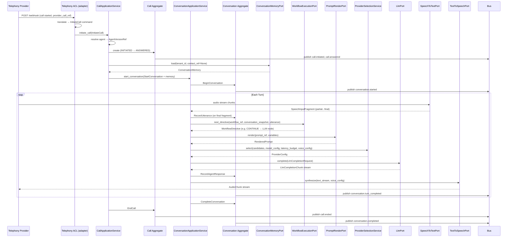

### 18.2 Outbound Call

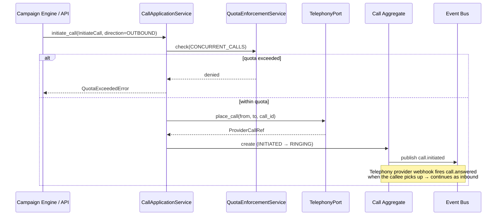

### 18.3 Tool Calling Flow

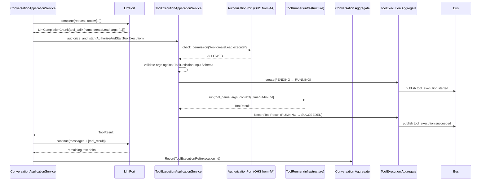

### 18.4 Human Transfer

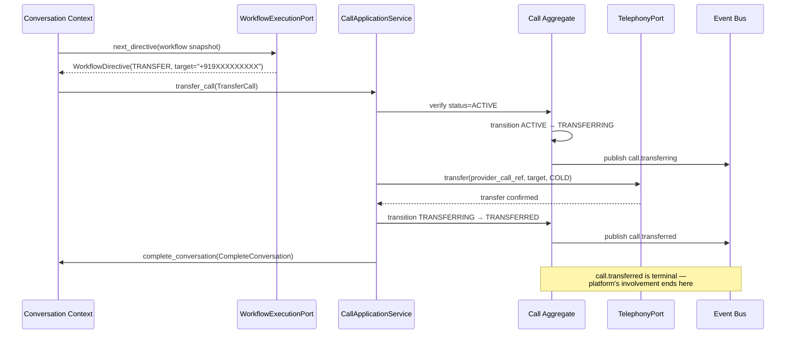

### 18.5 Provider Failure & STT Failover

```mermaid
sequenceDiagram
    participant ConvSvc as ConversationApplicationService
    participant Router as ProviderSelectionService
    participant Health as ProviderHealthEvaluationService
    participant Primary as Deepgram (SttPort impl)
    participant Fallback as Gladia (SttPort impl)
    participant Config as ProviderConfig Aggregate
    participant Bus as Event Bus

    ConvSvc->>Router: select(candidates, model_config, latency_budget)
    Router-->>ConvSvc: Deepgram (priority=1, circuit=CLOSED)
    ConvSvc->>Primary: stream(audio_chunks, language, tamil_cs)
    Primary--xConvSvc: ConnectionError (provider down)
    ConvSvc->>Health: evaluate(error_rate=100, latency=0, state=CLOSED)
    Health-->>ConvSvc: (UNAVAILABLE, → OPEN)
    ConvSvc->>Config: update circuit_state=OPEN, health_state=UNAVAILABLE
    Config->>Bus: publish provider.circuit_opened
    ConvSvc->>Bus: publish provider.failover_triggered (deepgram → gladia)
    ConvSvc->>Router: select(candidates, ...) [deepgram now excluded]
    Router-->>ConvSvc: Gladia (priority=2, circuit=CLOSED)
    ConvSvc->>Fallback: stream(audio_chunks, language, tamil_cs)
    Fallback-->>ConvSvc: SpeechInputFragment stream resumes
    Note over ConvSvc: Brief transcription gap is logged<br/>as a TurnLatency anomaly; call continues
```

### 18.6 Call Completion — Post-Call Pipeline

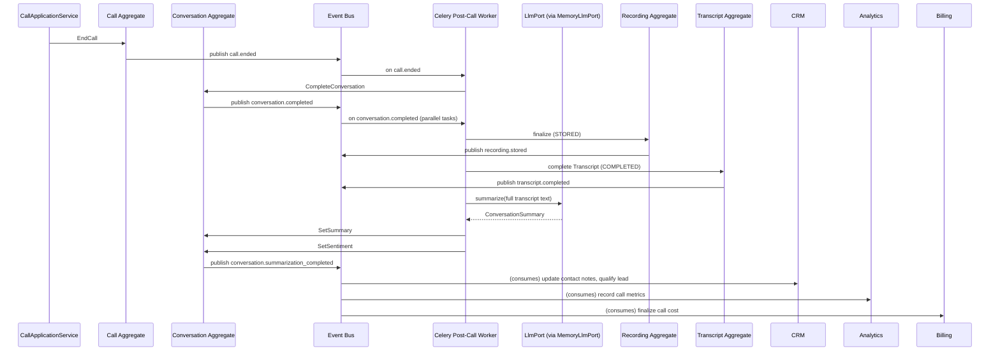

---

## 19. Domain Package Structure

Derived from the DDD analysis — not copied from Phase 3B's folder structure.

```text
modules/
├── voice/                              # Call & Session Context
│   ├── domain/
│   │   ├── aggregates/
│   │   │   └── call.py                # Call, CallSession
│   │   ├── value_objects/
│   │   │   ├── identifiers.py         # CallId, SessionId
│   │   │   ├── phone_number.py        # E164PhoneNumber, TenantPhoneNumber
│   │   │   ├── call_status.py         # CallStatus + transition table
│   │   │   ├── call_direction.py
│   │   │   ├── call_outcome.py
│   │   │   ├── transfer_type.py
│   │   │   ├── latency_profile.py
│   │   │   └── provider_call_ref.py
│   │   ├── events/
│   │   │   └── call_events.py
│   │   ├── commands/
│   │   │   └── call_commands.py
│   │   ├── services/
│   │   │   └── call_routing_service.py
│   │   ├── factories/
│   │   │   └── call_factory.py
│   │   ├── policies/
│   │   │   └── call_policies.py
│   │   └── specifications/
│   │       └── call_specifications.py
│   ├── application/
│   │   ├── use_cases/
│   │   │   ├── initiate_call.py
│   │   │   ├── answer_call.py
│   │   │   ├── start_conversation.py
│   │   │   ├── hold_call.py
│   │   │   ├── resume_call.py
│   │   │   ├── transfer_call.py
│   │   │   └── end_call.py
│   │   ├── queries/
│   │   │   ├── get_call.py
│   │   │   └── get_active_calls.py
│   │   └── ports/
│   │       ├── call_repository.py
│   │       └── telephony_port.py
│   ├── infrastructure/
│   │   ├── models.py
│   │   ├── mappers.py
│   │   ├── repositories/
│   │   │   └── sqlalchemy_call_repository.py
│   │   └── adapters/
│   │       ├── exotel_telephony_adapter.py
│   │       ├── twilio_telephony_adapter.py
│   │       └── acl/
│   │           └── telephony_webhook_acl.py    # translates provider webhooks → commands
│   └── interface/
│       ├── rest/router.py
│       └── events/subscribers.py
│
├── conversation/                       # Conversation Context
│   ├── domain/
│   │   ├── aggregates/
│   │   │   └── conversation.py        # Conversation, Turn, Utterance, AgentResponse
│   │   ├── value_objects/
│   │   │   ├── identifiers.py         # ConversationId, TurnId
│   │   │   ├── conversation_status.py
│   │   │   ├── directive_kind.py
│   │   │   ├── turn_latency.py
│   │   │   ├── token_usage.py
│   │   │   ├── qualification_outcome.py
│   │   │   ├── sentiment_score.py
│   │   │   └── conversation_summary.py
│   │   ├── events/
│   │   │   └── conversation_events.py
│   │   ├── commands/
│   │   │   └── conversation_commands.py
│   │   ├── services/
│   │   │   ├── barge_in_detection_service.py
│   │   │   └── conversation_context_service.py
│   │   ├── factories/
│   │   │   └── conversation_factory.py
│   │   └── policies/
│   │       └── conversation_policies.py
│   ├── application/
│   │   ├── use_cases/
│   │   │   ├── begin_conversation.py
│   │   │   ├── process_turn.py
│   │   │   ├── set_qualification_outcome.py
│   │   │   └── complete_conversation.py
│   │   ├── queries/
│   │   │   ├── get_conversation.py
│   │   │   └── get_conversation_summary.py
│   │   └── ports/
│   │       ├── conversation_repository.py
│   │       ├── speech_to_text_port.py
│   │       ├── text_to_speech_port.py
│   │       ├── llm_port.py
│   │       ├── workflow_execution_port.py
│   │       ├── prompt_render_port.py
│   │       └── conversation_memory_port.py
│   ├── infrastructure/
│   │   ├── models.py
│   │   ├── mappers.py
│   │   ├── repositories/
│   │   │   └── sqlalchemy_conversation_repository.py
│   │   ├── session_cache.py           # Redis hot-tier
│   │   └── adapters/
│   │       ├── deepgram_stt_adapter.py
│   │       ├── gladia_stt_adapter.py
│   │       ├── elevenlabs_tts_adapter.py
│   │       ├── openai_llm_adapter.py
│   │       ├── anthropic_llm_adapter.py
│   │       ├── gemini_llm_adapter.py
│   │       ├── groq_llm_adapter.py
│   │       └── ollama_llm_adapter.py
│   └── interface/
│       ├── ws/session_handler.py      # WebSocket handler — not REST
│       └── events/subscribers.py
│
├── agent/                              # Agent Context
│   ├── domain/
│   │   ├── aggregates/
│   │   │   └── agent.py               # Agent, AgentVersion (embedded)
│   │   ├── entities/
│   │   │   ├── draft_config.py
│   │   │   ├── voice_config.py
│   │   │   └── model_config.py
│   │   ├── value_objects/
│   │   │   ├── identifiers.py         # AgentId, AgentVersionId
│   │   │   ├── agent_status.py
│   │   │   ├── agent_name.py
│   │   │   ├── tool_permission.py
│   │   │   ├── voice_id.py
│   │   │   ├── emotion.py
│   │   │   ├── barge_in_sensitivity.py
│   │   │   └── qualification_criteria.py
│   │   ├── events/agent_events.py
│   │   ├── commands/agent_commands.py
│   │   ├── factories/agent_factory.py
│   │   └── services/agent_snapshot_service.py
│   ├── application/
│   │   ├── use_cases/
│   │   │   ├── create_agent.py
│   │   │   ├── update_draft_config.py
│   │   │   ├── publish_agent.py
│   │   │   └── deprecate_agent.py
│   │   ├── queries/
│   │   │   ├── get_agent.py
│   │   │   └── list_agents.py
│   │   └── ports/
│   │       └── agent_repository.py
│   ├── infrastructure/
│   │   ├── models.py
│   │   ├── mappers.py
│   │   └── repositories/
│   │       └── sqlalchemy_agent_repository.py
│   └── interface/
│       ├── rest/router.py
│       └── events/subscribers.py
│
├── tool_execution/                     # Tool Execution Context
│   ├── domain/
│   │   ├── aggregates/
│   │   │   ├── tool_definition.py
│   │   │   └── tool_execution.py
│   │   ├── value_objects/
│   │   │   ├── identifiers.py
│   │   │   ├── tool_name.py
│   │   │   ├── tool_result.py
│   │   │   └── tool_execution_status.py
│   │   ├── events/
│   │   │   └── tool_events.py
│   │   ├── commands/
│   │   │   └── tool_commands.py
│   │   └── specifications/
│   │       └── tool_specifications.py
│   ├── application/
│   │   ├── use_cases/
│   │   │   ├── authorize_and_start_tool_execution.py
│   │   │   └── record_tool_result.py
│   │   └── ports/
│   │       ├── tool_definition_repository.py
│   │       └── tool_execution_repository.py
│   └── infrastructure/
│       ├── models.py
│       ├── repositories/
│       │   ├── sqlalchemy_tool_definition_repository.py
│       │   └── sqlalchemy_tool_execution_repository.py
│       └── runners/
│           ├── crm_tool_runner.py
│           ├── messaging_tool_runner.py
│           ├── call_tool_runner.py
│           └── knowledge_tool_runner.py
│
├── recording_transcript/               # Recording & Transcript Context (combined — small, cohesive)
│   ├── domain/
│   │   ├── aggregates/
│   │   │   ├── recording.py
│   │   │   └── transcript.py
│   │   ├── value_objects/
│   │   │   ├── identifiers.py
│   │   │   ├── recording_status.py
│   │   │   ├── speaker.py
│   │   │   └── transcript_segment.py
│   │   └── events/
│   │       └── recording_transcript_events.py
│   ├── application/
│   │   ├── use_cases/
│   │   │   ├── start_recording.py
│   │   │   ├── finalize_recording.py
│   │   │   └── append_transcript_segment.py
│   │   ├── queries/
│   │   │   ├── get_recording.py
│   │   │   └── get_transcript.py
│   │   └── ports/
│   │       ├── recording_repository.py
│   │       ├── transcript_repository.py
│   │       └── recording_storage_port.py
│   └── infrastructure/
│       ├── models.py
│       ├── repositories/
│       │   ├── sqlalchemy_recording_repository.py
│       │   └── sqlalchemy_transcript_repository.py
│       └── adapters/
│           └── s3_recording_storage_adapter.py
│
└── provider_network/                   # Provider Network Context (Generic)
    ├── domain/
    │   ├── aggregates/
    │   │   └── provider_config.py
    │   ├── value_objects/
    │   │   ├── provider_id.py
    │   │   ├── circuit_state.py
    │   │   ├── health_state.py
    │   │   └── provider_category.py
    │   ├── events/
    │   │   └── provider_events.py
    │   └── services/
    │       ├── provider_selection_service.py
    │       └── provider_health_evaluation_service.py
    ├── application/
    │   ├── use_cases/
    │   │   ├── update_provider_health.py
    │   │   └── trip_circuit.py
    │   ├── queries/
    │   │   └── get_provider_health.py
    │   └── ports/
    │       └── provider_config_repository.py
    └── infrastructure/
        ├── models.py
        ├── repositories/
        │   └── sqlalchemy_provider_config_repository.py
        └── health/
            └── redis_provider_health_cache.py
```

---

## 20. Persistence Identification

| Aggregate | Persistence store | Access pattern | Note |
|---|---|---|---|
| `Call` | PostgreSQL + Redis hot-tier | By `CallId`, by `ProviderCallRef` | Hot-tier holds `CallStatus` and `AgentVersionRef` for sub-ms access during active calls |
| `Conversation` | PostgreSQL + Redis hot-tier | By `ConversationId`, by `CallRef` | Hot-tier holds current turn state; DB checkpointed per completed turn |
| `Turn` (embedded) | Persisted with Conversation | Read as part of Conversation | Partial fragments in Redis only — never persisted |
| `AgentVersion.SnapshotJson` | PostgreSQL | Read-heavy at call start — cached in Redis per AgentVersionId | Immutable after write — cache TTL can be long (1 hour) |
| `ToolExecution` | PostgreSQL | By `ExecutionId`, by `TurnRef` | Auditable; never hot-tier |
| `Recording` | PostgreSQL (metadata) + S3 (audio) | By `CallRef` | Binary audio never in PostgreSQL |
| `Transcript` | PostgreSQL (segments) | Append-heavy; query by `ConversationRef` | Partition by month — see Phase 5 note |
| `ProviderConfig` | PostgreSQL + Redis | Read-heavy; write rare | Health state in Redis; circuit state in PostgreSQL (authoritative) |

**Latency-critical read paths (must not touch PostgreSQL):**
- Agent Version resolution at call start → Redis cache by `AgentVersionId`
- Provider health / circuit state during turn → Redis
- Conversation current state during turn → Redis hot-tier

---

## 21. Cross-Domain Communication

| This domain | Other domain | Direction | Mechanism | What passes |
|---|---|---|---|---|
| Voice (Call) | Identity (4A) | Consumes | OHS `CheckPermission` | Verify API caller has `call:create` permission |
| Voice (Call) | Quota (4A) | Consumes | OHS `CheckQuota` | `CONCURRENT_CALLS` before `InitiateCall` |
| Voice (Conversation) | Workflow (Phase 4C) | Consumes | OHS `WorkflowExecutionPort` | `next_directive(workflow_ref, snapshot, utterance)` |
| Voice (Conversation) | Prompt Management (Phase 4C) | Consumes | OHS `PromptRenderPort` | `render(prompt_ref, variables)` |
| Voice (Conversation) | Memory (Phase 4C) | Consumes | OHS `ConversationMemoryPort` | `load()` at call start; `append_turn()` fire-and-forget |
| Voice (ToolExecution) | Knowledge Base (Phase 4C) | Consumes | OHS `KnowledgeSearchPort` | Used by `lookupKnowledge` tool runner |
| Voice (ToolExecution) | CRM (Phase 4C) | Consumes | Port → CRM public use case | `createLead`, `bookAppointment`, `createTask` tool runners |
| Voice (Call) | CRM (Phase 4C) | Publishes | Domain Event | `call.ended` → CRM updates contact's call history |
| Voice (Conversation) | CRM (Phase 4C) | Publishes | Domain Event | `conversation.qualification_set` → CRM qualifies lead |
| Voice (Conversation) | Analytics (downstream) | Publishes | Domain Event | `conversation.turn_completed` (token usage, latency) |
| Voice (Call) | Billing (downstream) | Publishes | Domain Event | `call.answered` (start metering), `call.ended` (duration) |
| Voice (Call) | Campaign (Phase 4C) | Publishes | Domain Event | `call.ended`, `call.failed` → campaign updates lead status |
| Feature Flags (4A) | Voice (LLM Routing) | Upstream | OHS `EvaluateFlag` | Gate new model router strategy |
| Audit (4A) | Voice (all) | Upstream (Audit is consumer) | Domain Event | All call/conversation events are consumed by Audit subscriber |

**Anti-Corruption Layer:** the `telephony_webhook_acl.py` in `voice/infrastructure/adapters/acl/` is the only place that parses provider-specific JSON payloads. Every field mapping from Exotel/Twilio/Telnyx wire format to `InitiateCall`/`AnswerCall`/`CallEnded` commands lives here — never in domain or application code.

---

## 22. Domain Decision Records

### DDR-4B-001: Call and Conversation Are Separate Aggregates

**Decision:** `Call` and `Conversation` are independent aggregates with separate transaction boundaries, referencing each other by ID.

**Rationale:** The Call's lifecycle (held, transferred, on hold) is independent of the Conversation's Turn loop. A call on hold still has a `Call` aggregate in `ON_HOLD` state, but the `Conversation` is simply not receiving new turns — it doesn't change state. Merging them would mean the Conversation aggregate must understand telephony state transitions, which violates SRP and creates a god aggregate.

**Alternative rejected:** One `CallConversation` aggregate. Rejected because the Transcript is append-only and written at very high frequency — locking one aggregate for every STT partial fragment would serialize the entire turn loop on a single row lock.

---

### DDR-4B-002: Transcript Is a Separate Aggregate From Conversation

**Decision:** `Transcript` is its own aggregate, written to via `append_segment()` independently of the `Conversation` aggregate.

**Rationale:** Transcript segments are appended many times per second (partial STT fragments). If the Transcript were embedded in the Conversation, every fragment would lock the Conversation row, serializing turn processing. A separate aggregate allows append-only writes to the Transcript with no contention on the Conversation.

**Trade-off accepted:** joining Transcript and Conversation data requires a cross-aggregate join. Mitigated by the read model (transcript is queried by `ConversationRef`, which is an indexed column).

---

### DDR-4B-003: AgentVersion Snapshot Is Immutable and Pinned at Call Start

**Decision:** when a Call starts, the Agent's `PublishedVersionRef` is resolved to an `AgentVersionId` and pinned to the Call aggregate. The `AgentVersion.SnapshotJson` is loaded from that version and never refreshed for the duration of the Call.

**Rationale:** a configuration change mid-call (different prompt, different tools, different LLM model) would produce unpredictable, potentially inconsistent conversation behaviour. An agent builder should be able to publish a new Agent version without affecting the 200 calls currently in progress.

**Alternative rejected:** live config reference — the Call always reads the Agent's current published version. Rejected because it creates a temporal coupling between agent configuration changes and live call behaviour.

---

### DDR-4B-004: ToolExecution Is a Separate Aggregate From Turn

**Decision:** `ToolExecution` is its own aggregate root, referenced from the `Turn` by `ToolExecutionId`, not embedded.

**Rationale:** a ToolExecution has its own state machine (PENDING → RUNNING → SUCCEEDED / FAILED / TIMED_OUT), its own retry logic, and its own audit trail. Embedding it in the Turn would make the Turn aggregate responsible for a separate lifecycle, violating SRP. A `ToolExecution` may also need to be queried independently (e.g., "show me all `createLead` tool executions for this org today") — impossible if embedded.

---

### DDR-4B-005: Provider Selection Is a Pure Domain Service, Not an Infrastructure Concern

**Decision:** `ProviderSelectionService.select()` is a pure function in the domain layer — it receives a list of `ProviderConfig` aggregates (pre-loaded from Redis/DB by the application service) and returns the best `ProviderConfig`. No I/O.

**Rationale:** the scoring algorithm (latency bias, cost bias, Tamil capability, circuit state) is a business rule, not an infrastructure rule. Testing it must not require a live Redis connection. Placing it in infrastructure would make it untestable in isolation and would couple the scoring logic to a specific cache implementation.

---

### DDR-4B-006: Tamil Code-Switching Is a First-Class Domain Concept

**Decision:** `VoiceConfig.TamilCodeSwitching` is a boolean value object on the Agent configuration. `TamilCapableProviderSpecification` is a domain Specification. The domain enforces that a Tamil-enabled Agent uses a Tamil-capable provider.

**Rationale:** Tamil support is a platform capability requirement (`PRODUCT_VISION.md`, Phase 1). If it were only a provider-configuration detail, the domain would have no way to enforce the invariant "Tamil calls must use a Tamil-capable provider." Making it a domain concept gives the enforcement point authority.

**What the domain does NOT own:** which specific Deepgram model supports Tamil, or which ElevenLabs voice ID sounds natural in Tamil. These are `ProviderConfig` data fields, not domain rules.

---

## 23. Architectural Trade-offs

| Trade-off | Choice | Cost | Benefit |
|---|---|---|---|
| Conversation hot-tier in Redis + checkpoint per turn | Redis-first reads, DB writes per turn | Redis failure loses in-flight turn data (< 1 turn) | Sub-millisecond turn-state access; DB not on the per-fragment hot path |
| Transcript append-only separate aggregate | Cross-aggregate join needed for conversation+transcript view | Two repository calls per query | No row contention between turn processing and transcript writes |
| AgentVersion immutable snapshot in JSON | `SnapshotJson` stored as JSONB | Storage overhead per version | Live calls unaffected by config changes; rollback trivial |
| ToolExecution separate aggregate | References from Turn by ID | Requires join for turn+tool view | Independent lifecycle, independent audit trail, queryable directly |
| Recording & Transcript in one module | Single deployable for both | Slightly larger module | Cohesion: both are post-call artifacts triggered by the same events |
| Tamil as a domain concept, not just provider config | Domain logic for Tamil enforcement | Domain must maintain a list of Tamil-capable providers | Provider substitution is enforced at domain level, not left to chance |

---

## 24. Risks

| Risk | Likelihood | Impact | Mitigation |
|---|---|---|---|
| Redis hot-tier loss mid-turn (pod OOM, eviction) | Low | Medium — up to one turn lost | Conversation is checkpointed per completed turn; at most one in-flight turn is lost; call can continue from last checkpoint |
| Provider circuit open for all providers simultaneously | Very low | Critical — no LLM/STT/TTS available | `AllProvidersUnavailableError` → Call transitions to `FAILED`; alert fires (3E §14.4) |
| Tamil STT accuracy poor for code-switching | Medium | Medium — caller experience degraded | Domain designs the requirement; provider capability is an operational selection decision — if no provider meets it, the platform flags it at agent publish time |
| Barge-in false positives (noise detected as speech) | Medium | Low-Medium — agent interrupted unnecessarily | `BargeInSensitivity` is configurable per agent; `BargeInDetectionService` is a pure function that can be unit-tested and tuned without infrastructure |
| AgentVersion snapshot JSON schema evolution | Low | High — if schema changes break old snapshots | `schema_version` field in the snapshot envelope; migration path through a versioned deserialiser |
| ToolExecution timeout blocking the turn | Medium | Medium — caller waits | Timeout is bounded by `ToolDefinition.TimeoutMs`; LLM is notified of failure and produces a graceful response |
| Call held beyond timeout and abandoned | Low | Low — caller hangs up | `ON_HOLD → ABANDONED` transition with event; Campaign Engine retries if campaign-originated |

---

## 25. Open Questions

| # | Question | Owner | Blocks |
|---|---|---|---|
| OQ-4B-01 | What is the platform-default ring timeout for outbound calls before NO_ANSWER? | Product | `CallRoutingService` configuration |
| OQ-4B-02 | What is the default hold timeout before ABANDONED? | Product | Call state machine guard |
| OQ-4B-03 | Should voicemail drop (leaving a pre-recorded message) be a domain action on the Call, or handled entirely by the Telephony Adapter? | Architecture | Voicemail state machine transition |
| OQ-4B-04 | Can a single Call be transferred more than once if the first transfer fails and the call returns to the agent? | Product | Transfer invariant (currently: transfer-once per Call) |
| OQ-4B-05 | Should `QualificationOutcome` be settable by the Workflow Engine directly, or only via the LLM extracting qualification signals? | Product | `SetQualificationOutcome` command authorization |
| OQ-4B-06 | What is the minimum Tamil support bar for STT providers? (e.g., monolingual Tamil, code-switching, digit recognition) | Product / AI | `TamilCapableProviderSpecification` criteria |
| OQ-4B-07 | Should partial STT fragments be published to the event bus, or only final segments? | Architecture | Transcript segment event volume vs. real-time supervisor display needs |
| OQ-4B-08 | Is call conferencing (three-way) in scope for Phase 24 MVP? | Product | Call state machine — CONFERENCING state not currently designed |

---

## 26. Dependencies on Other Bounded Contexts

| Dependency | Direction | What Phase 4B needs |
|---|---|---|
| Identity / Authorization (Phase 4A) | Upstream | `TenantId`, `UserId`, `Permission`, `CheckPermission` OHS, `TenantContext` |
| Quota (Phase 4A) | Upstream | `CheckQuota(CONCURRENT_CALLS)` before `InitiateCall` |
| Feature Flags (Phase 4A) | Upstream | `EvaluateFlag` for gating new model router strategies, new provider rollouts |
| Audit (Phase 4A) | Phase 4B publishes → Audit consumes | All call, conversation, tool events consumed by Audit subscriber |
| Workflow Engine (Phase 4C) | Phase 4C supplies → Phase 4B consumes | `WorkflowExecutionPort.next_directive()` per turn |
| Prompt Management (Phase 4C) | Phase 4C supplies → Phase 4B consumes | `PromptRenderPort.render()` per turn |
| Conversation Memory (Phase 4C) | Phase 4C supplies → Phase 4B consumes | `ConversationMemoryPort.load()` at call start |
| Knowledge Base (Phase 4C) | Phase 4C supplies → Phase 4B consumes | `KnowledgeSearchPort.search()` via `lookupKnowledge` tool |
| CRM (Phase 4C) | Bidirectional | Phase 4B publishes `call.ended`, `conversation.qualification_set`; CRM tool runners call CRM use cases |
| Campaign Engine (Phase 4C) | Phase 4B publishes → Campaign consumes | `call.ended`, `call.failed` → campaign updates lead status |
| Billing (downstream) | Phase 4B publishes → Billing consumes | `call.answered` (start), `call.ended` (duration for metering) |
| Analytics (downstream) | Phase 4B publishes → Analytics consumes | All call, conversation, tool events |
| Notification (Phase 4A/18) | Phase 4B publishes → Notification consumes | (no current voice-domain notification triggers — flagged for Phase 18) |

---

## 27. What Phase 4C Must Consume From This Design

Phase 4C (Workflow, Prompt, Memory, CRM, Campaign DDD) must:

1. **Implement `WorkflowExecutionPort`** — the port is defined in Phase 4B (`conversation/application/ports/workflow_execution_port.py`). Phase 4C's Workflow Engine must implement `next_directive(workflow_ref, conversation_snapshot, latest_utterance) -> WorkflowDirective` exactly as typed here.

2. **Implement `PromptRenderPort`** — Phase 4C's Prompt Management must implement `render(prompt_ref, variables, session_id) -> RenderedPrompt`.

3. **Implement `ConversationMemoryPort`** — Phase 4C's Memory module must implement `load(tenant_id, contact_ref) -> ConversationMemory` and `append_turn(conversation_id, turn_snapshot)`.

4. **Implement `KnowledgeSearchPort`** — Phase 4C's Knowledge Base must implement `search(query, kb_ids, tenant_id, top_k) -> SearchResult`.

5. **Consume `call.ended`** for CRM call-history projection (defined in Phase 4A §23).

6. **Consume `conversation.qualification_set`** for CRM lead qualification.

7. **Consume `call.ended` and `call.failed`** for Campaign Engine lead status updates.

8. Use `ConversationId`, `CallId`, `TurnId`, `AgentVersionId`, `ToolExecutionId` from this document's Shared Value Objects — never define parallel identifiers.

9. Never import `Call`, `Conversation`, `Agent`, or `Turn` domain objects directly — reference them only by their ID value objects.

---

## 28. Consistency Checks Against Phase 3 LLD

| Phase 3 design | Phase 4B DDD | Consistent? | Notes |
|---|---|---|---|
| 3B §5 — `CallStateMachine` with explicit transition table | §7.1 Call Lifecycle state machine — same states, same transitions, now fully specified with guards | ✅ | Phase 4B adds explicit transition guards and ABANDONED state that was implicit in 3B |
| 3B §7 — Two-tier session state (Redis + Postgres, checkpoint per turn) | §20 Persistence identification — same two-tier for Call and Conversation | ✅ | |
| 3B §9 — `VoiceOrchestrator` depends on ports, never adapters | §16 Provider Ports — all ports defined as Protocols, adapters in infrastructure | ✅ | |
| 3B §10 — Seven LLM adapters behind `LlmPort` | §16 `LlmPort` protocol defined; seven adapters in `conversation/infrastructure/adapters/` | ✅ | |
| 3B §11 — `ModelRouter` as application service, pure scoring | §8.2 `ProviderSelectionService` — pure domain service, no I/O | ✅ | Promoted from application service to domain service — pure function, appropriate level |
| 3B §12 — Streaming pipeline: `asyncio.Queue` between stages | Not modelled in domain (infrastructure concern) — domain defines the Turn; infrastructure defines the queue | ✅ | Correct separation |
| 3B §13 — `ToolExecutionPort` with timeout, audit, authorization | §5.5 `ToolExecution` aggregate + §12.4 commands + §8 — same invariants | ✅ | |
| 3B §14 — `MemoryPort.load()` blocking, `append_turn()` fire-and-forget | §16 `ConversationMemoryPort` — same contract | ✅ | |
| 3D §5.4 — `AgentVersion.SnapshotJson` immutable | §5.3 Agent aggregate — `SnapshotJson` is a `Value Object` (frozen, no setter) | ✅ | |
| 3D §10.3 — Tool execution: existence, authorization, schema, timeout | §5.5 ToolExecution invariants + `AuthorizeAndStartToolExecution` command | ✅ | |
| 3E §14.2 — `platform_active_calls` gauge metric | `Call.status = ACTIVE` is the domain signal; infrastructure reads this to emit the Prometheus gauge | ✅ | Domain doesn't emit metrics; infrastructure observes state |
| 3B Review Note 1 — Workflow Engine per-turn vs. call-level | §18.1 — Workflow is consulted per turn via `WorkflowExecutionPort.next_directive()` | ✅ Resolved | Explicitly resolves 3B Review Note 1 |
| 3B Review Note 2 — Barge-in confidence threshold | `BargeInDetectionService` in §8.3, `BargeInSensitivity` in §5.3.1 | ✅ Designed | Threshold is now a domain concept, not a magic number |
| 3B Review Note 4 — No TTS fallback vendor | §7.5 provider failover lifecycle — TTS has `CircuitState` mechanism; if all TTS circuits open, `AllProvidersUnavailableError`. Domain is ready; vendor selection is an operational decision | ⚠️ Partially resolved | Domain handles the mechanism; vendor selection still open (see OQ not repeated here) |
