# Phase 4C — Domain-Driven Design: CRM & Lead Management Domain

| | |
|---|---|
| **Roadmap phase** | Phase 4 (Domain-Driven Design) — sub-phase 4C: CRM & Lead Management |
| **Status** | Draft v1.0, for review |
| **Source of truth (approved, not redesigned here)** | Phase 1 SRS, Phase 2 HLA, Phase 3A–3F LLD, Phase 4A Core Domains DDD, Phase 4B Voice & AI DDD |
| **Scope** | Contact, Company, Lead, Deal, Pipeline, Activity, Task, Appointment, Lead Scoring, Lead Qualification |
| **Explicitly out of scope** | Campaign Engine mechanics (Phase 4D), Workflow Builder internals (Phase 4D), Analytics internals (Phase 4D), Billing (Phase 4D) |

---

## 0. How to Read This Document

This document is the authoritative domain design for the CRM and Lead Management bounded contexts. It is written for all engineering disciplines. It does not generate code — it defines the shared understanding that code must honour.

**Relationship to Phase 4A:** this document inherits `TenantId`, `UserId`, `OrganizationId`, `Permission`, `AuthorizationDecision`, `EmailAddress`, `PhoneNumber`, `Money` from Phase 4A's Shared Kernel. It uses the `DomainEvent` envelope from Phase 4A §9.1. It never redefines them.

**Relationship to Phase 4B:** the CRM domain is a primary *consumer* of voice events — `call.ended`, `conversation.qualification_set`, `conversation.summarization_completed`. The CRM domain is also the *provider* behind tool runners (`createLead`, `updateLead`, `bookAppointment`, `createTask`) that Phase 4B's Tool Execution Context invokes. Both sides of that relationship are fully specified here.

---

## 1. Ubiquitous Language

| Term | Definition | Never call it |
|---|---|---|
| **Contact** | A specific individual person tracked in the CRM — the primary unit of customer identity. May be associated with a Company and may have one or more active Deals | "user", "customer", "lead" (when context is CRM record) |
| **Company** | An organisation that one or more Contacts work for — tracked independently for account-level relationships | "account", "organisation", "client" |
| **Lead** | A Contact that has not yet converted into a customer — carries a `LeadStatus` that progresses through a qualification lifecycle. A Contact is always a Lead until they convert; a converted Lead remains a Contact | "prospect", "opportunity" |
| **LeadStatus** | The lifecycle position of a Contact as a Lead — e.g., NEW, CONTACTED, QUALIFIED, etc. | "lead stage", "lead state" |
| **Deal** | A specific commercial opportunity — a potential sale — linked to a Contact and optionally a Company, tracked through Pipeline Stages | "opportunity", "quote", "proposal" |
| **Pipeline** | An ordered set of Stages that a Deal progresses through, representing the organisation's sales process | "funnel", "sales process" |
| **Pipeline Stage** | One step in a Pipeline — has a name, an order, and a probability-of-close hint | "funnel stage", "step" |
| **Activity** | An immutable, timestamped record of something that happened in relation to a Contact, Deal, or Company — calls, emails, WhatsApp messages, meetings | "interaction", "event", "touchpoint" |
| **Task** | A future action to be taken in relation to a Contact, Deal, or Company — has a due date and can be completed or cancelled | "to-do", "follow-up", "reminder" |
| **Note** | A free-text observation attached to a Contact, Deal, or Company — authored by a human or the AI agent | "comment", "observation" |
| **Appointment** | A scheduled meeting between a Contact and one or more Members — created manually or by an AI Agent during a call | "meeting", "booking", "calendar event" |
| **LeadScore** | A numeric value (0–100) representing the platform's confidence that a Contact is a high-value lead — computed by a scoring engine from signals | "score", "rating" |
| **ScoringSignal** | One piece of evidence that contributes to a LeadScore — e.g., call answered, appointment booked, positive sentiment | "scoring factor", "signal" |
| **QualificationStatus** | A binary or ternary outcome of the qualification evaluation — QUALIFIED, DISQUALIFIED, or INCONCLUSIVE | "qualification outcome", "lead grade" |
| **QualificationCriteria** | The agent-configured rules that determine what constitutes a qualified lead — stored on the Agent (Phase 4B) and evaluated during a conversation | "qualification rules", "criteria" |
| **LeadTemperature** | A qualitative label derived from LeadScore — HOT (≥ 70), WARM (40–69), COLD (< 40) | "lead heat", "lead status" |
| **CustomerProfile** | The aggregated view of a Contact's relationship with the organisation — their LeadStatus, LeadScore, call history, deals, activities | "contact profile", "360 view" |
| **CRMField** | A custom field definition configured per Organisation — extends the standard Contact/Company/Deal schema with tenant-specific attributes | "custom field", "attribute" |
| **CRMFieldValue** | The value of a specific CRMField for a specific Contact, Company, or Deal | "field value", "custom attribute value" |
| **Call History** | The ordered list of Calls (from Phase 4B) associated with a Contact, projected from voice domain events into the CRM as Activities | "call log", "call records" |
| **Subject** | The entity (Contact, Deal, or Company) that an Activity, Task, Note, or Appointment is attached to — expressed as a polymorphic reference `(SubjectType, SubjectId)` | "related to", "linked entity" |
| **Conversion** | The transition of a Contact's `LeadStatus` to CONVERTED — indicating they have become a customer | "close", "win" (Conversion is contact-level; Deal-level outcomes are WON/LOST) |
| **AI-Assisted Score** | A LeadScore contribution that was computed by the AI platform (sentiment, qualification answers) rather than by manual entry or simple rule matching | "AI score", "ML score" |

---

## 2. Subdomain Classification

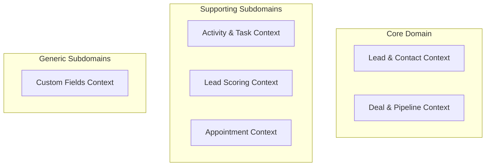

| Context | Classification | Rationale |
|---|---|---|
| **Lead & Contact** | **Core Domain** | The Contact/Lead lifecycle — qualification, conversion, profile — is the platform's primary CRM value. The rules are bespoke to AI-assisted voice-driven sales: qualification from call outcomes, AI-generated scoring signals, voice-driven status updates. |
| **Deal & Pipeline** | **Core Domain** | Tracking commercial opportunities through a configurable pipeline is the CRM's second primary value surface. Pipeline configuration, stage transitions, and deal outcomes involve non-trivial business rules. |
| **Activity & Task** | **Supporting** | Activities and Tasks are important but structurally simple (append-only Activities, lifecycle-managed Tasks). Their value comes from richness and completeness, not novel business rules. |
| **Lead Scoring** | **Supporting** | Scoring logic is important and must support both AI-generated signals and rule-based signals, but the scoring computation itself is a well-bounded service. |
| **Appointment** | **Supporting** | Appointment booking is significant (it is directly callable by AI Agents) but its domain rules are straightforward — the complexity is in calendar integration (future Phase 18), not the domain itself. |
| **Custom Fields** | **Generic** | Custom field definitions are a standard CRM extension mechanism. The rules are simple; the complexity is in rendering and querying them. |

### 2.1 Why Lead and Contact Are One Context, Not Two

The "lead vs. contact" split is a common CRM modelling decision. Phase 3C §5.4 established the foundational reasoning: a lead is a Contact whose `LeadStatus` has not yet reached CONVERTED. Separating them into two entities with a conversion step (Salesforce-style) introduces a synchronization surface (which fields copy over on conversion?) that this platform's single inbound channel (phone calls) doesn't need. A Contact is always the unit; `LeadStatus` is one of its properties.

This decision is revisited explicitly in DDR-4C-001.

---

## 3. Context Map

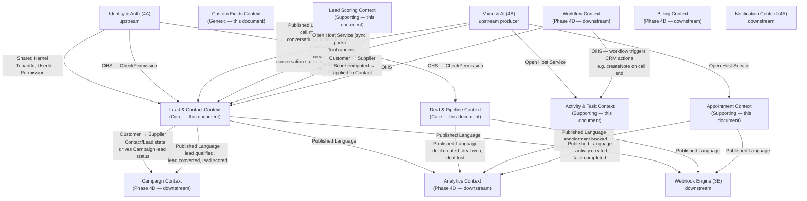

---

## 4. Aggregates

### 4.1 Contact Aggregate

**Aggregate Root:** `Contact`

**Rationale for boundary:** the Contact is the CRM's atom of customer identity. Its LeadStatus transitions, LeadScore, QualificationStatus, and custom field values must all be consistent as a unit — they represent the current truth about a customer relationship. Activities, Deals, Tasks, and Notes are separate aggregates because they grow without bound over a Contact's lifetime and have independent transaction boundaries.

```
Contact (AggregateRoot)
├── ContactId                (Value Object — UUIDv7)
├── TenantId                 (Value Object — Phase 4A Shared Kernel)
├── FullName                 (Value Object — 1–200 chars, trimmed)
├── PrimaryPhone             (Value Object — E164PhoneNumber — required)
├── SecondaryPhone           (Value Object — nullable E164PhoneNumber)
├── PrimaryEmail             (Value Object — nullable EmailAddress)
├── CompanyRef               (Value Object — nullable CompanyId — by reference only)
├── OwnedByRef               (Value Object — nullable UserId — assigned CRM owner)
├── LeadStatus               (Value Object — LeadStatus enum — see §7.1)
├── QualificationStatus      (Value Object — QUALIFIED | DISQUALIFIED | INCONCLUSIVE | UNSET)
├── QualificationReason      (Value Object — nullable string — why qualified/disqualified)
├── LeadScore                (Value Object — nullable LeadScore — current score 0–100)
├── LeadTemperature          (Value Object — derived: HOT | WARM | COLD | UNSCORED)
├── Tags                     (Value Object — frozenset[Tag] — max 20 tags per contact)
├── Address                  (Value Object — nullable PostalAddress)
├── CustomFieldValues        (list[CRMFieldValue] — mutable, max 50 custom fields)
├── Source                   (Value Object — ContactSource — how this contact entered the CRM)
├── CampaignRef              (Value Object — nullable CampaignId — originating campaign)
├── DoNotCall                (Value Object — boolean — DNC flag)
├── ConsentStatus            (Value Object — ConsentStatus enum — recording/marketing consent)
├── LastContactedAt          (Value Object — nullable datetime)
├── ConvertedAt              (Value Object — nullable datetime — set when LeadStatus → CONVERTED)
└── CreatedAt                (Value Object — datetime)
```

**Invariants:**
1. `PrimaryPhone` is globally unique within a Tenant — no two active Contacts in the same Organisation share the same primary phone number. Deduplication is enforced by the `ContactDeduplicationService` before creation.
2. `LeadStatus` transitions must follow the defined state machine (§7.1) — no arbitrary jumps.
3. `QualificationStatus` may only be QUALIFIED or DISQUALIFIED if `LeadStatus` is in `{CONTACTED, QUALIFIED, DISQUALIFIED, NURTURING, CONVERTED}` — setting a qualification status on a NEW contact with no prior contact is a domain error.
4. `LeadTemperature` is always derived from `LeadScore` — it has no independent setter. If `LeadScore` is null, `LeadTemperature = UNSCORED`.
5. `DoNotCall = true` blocks any campaign-originated outbound call to this contact — enforced by the Campaign Engine checking `ContactLookupPort.is_dnc()`.
6. `ConvertedAt` is set exactly once when `LeadStatus → CONVERTED` and cannot be changed.
7. `CustomFieldValues` may not reference a `CRMField` that does not belong to this `TenantId`.

**Business Rules:**
- When a voice call ends and `conversation.qualification_set` is consumed, the Contact's `QualificationStatus` and `LeadStatus` are updated by a domain event handler — not by a direct UI command. The AI agent's determination is authoritative unless manually overridden by a human with `contact:update` permission.
- A Contact with `DoNotCall = true` cannot have `LeadStatus` advanced by a Campaign — only a human with explicit permission can reset the DNC flag.
- The `Source` is set at creation and never changes — it records where the contact came from (INBOUND_CALL, OUTBOUND_CALL, CSV_IMPORT, MANUAL, API, WEBHOOK).
- `LastContactedAt` is updated whenever an Activity of type CALL, EMAIL, WHATSAPP, SMS, or MEETING is created for this contact.

**Commands:** `CreateContact`, `UpdateContactDetails`, `AssignOwner`, `UpdateLeadStatus`, `SetQualificationStatus`, `UpdateLeadScore`, `AddTag`, `RemoveTag`, `SetCustomFieldValue`, `MarkDoNotCall`, `ClearDoNotCall`, `UpdateConsentStatus`, `ConvertLead`, `MergeContacts`

**Domain Events:** `ContactCreated`, `ContactUpdated`, `OwnerAssigned`, `LeadStatusChanged`, `QualificationStatusSet`, `LeadScoreUpdated`, `TagAdded`, `TagRemoved`, `CustomFieldValueSet`, `MarkedDoNotCall`, `ConsentUpdated`, `LeadConverted`, `ContactsMerged`

**Repository:** `ContactRepository` — tenant-scoped; queries by `ContactId`, by `PrimaryPhone`, by `PrimaryEmail`, by `LeadStatus`, by `CampaignRef`.

**Transaction boundary:** single Contact aggregate per transaction. `MergeContacts` is the one exception — it touches two Contact aggregates and a `ContactsMergeService` (§8.2) handles the dual-aggregate coordination in a single UoW.

---

### 4.2 Company Aggregate

**Aggregate Root:** `Company`

```
Company (AggregateRoot)
├── CompanyId                (Value Object — UUIDv7)
├── TenantId                 (Value Object)
├── CompanyName              (Value Object — 1–200 chars)
├── Domain                   (Value Object — nullable EmailDomain — e.g. "acme.com")
├── Industry                 (Value Object — nullable Industry enum)
├── Size                     (Value Object — nullable CompanySize enum — STARTUP | SMB | MID_MARKET | ENTERPRISE)
├── Website                  (Value Object — nullable URL)
├── Address                  (Value Object — nullable PostalAddress)
├── OwnedByRef               (Value Object — nullable UserId)
├── CustomFieldValues        (list[CRMFieldValue])
└── CreatedAt                (Value Object — datetime)
```

**Invariants:**
1. `Domain` must be unique within a Tenant if provided — used for auto-association of Contacts whose email domain matches.
2. A Company cannot be deleted while it has active Contacts referencing it — the Contacts must be disassociated first.

**Why Company is not a simple entity inside Contact:** multiple Contacts can belong to the same Company, and the Company has its own Activities, Notes, Deals, and Custom Fields. Embedding it would either duplicate Company data across Contacts or prevent Company-level records from having their own history. Company is an independently valuable entity with its own aggregate boundary.

**Commands:** `CreateCompany`, `UpdateCompanyDetails`, `AssignCompanyOwner`, `SetCustomFieldValue`
**Domain Events:** `CompanyCreated`, `CompanyUpdated`
**Repository:** `CompanyRepository` — tenant-scoped; queries by `CompanyId`, by `Domain`.

---

### 4.3 Deal Aggregate

**Aggregate Root:** `Deal`

**Rationale:** a Deal has its own lifecycle (pipeline stage progression, won/lost outcome), its own value (Money), and can outlive the individual conversation that created it. It references Contact and Company by ID but maintains its own transaction boundary.

```
Deal (AggregateRoot)
├── DealId                   (Value Object — UUIDv7)
├── TenantId                 (Value Object)
├── Title                    (Value Object — 1–200 chars)
├── ContactRef               (Value Object — ContactId — required)
├── CompanyRef               (Value Object — nullable CompanyId)
├── PipelineRef              (Value Object — PipelineId — required)
├── CurrentStageRef          (Value Object — PipelineStageId)
├── Value                    (Value Object — Money — nullable, deal monetary value)
├── Currency                 (Value Object — ISO 4217 currency code)
├── Status                   (Value Object — DealStatus — OPEN | WON | LOST | ABANDONED)
├── CloseDate                (Value Object — nullable date — expected or actual close)
├── OwnedByRef               (Value Object — nullable UserId)
├── WonAt                    (Value Object — nullable datetime)
├── LostAt                   (Value Object — nullable datetime)
├── LostReason               (Value Object — nullable string)
├── CustomFieldValues        (list[CRMFieldValue])
└── CreatedAt                (Value Object — datetime)
```

**Invariants:**
1. `CurrentStageRef` must reference a Stage that belongs to the Pipeline referenced by `PipelineRef`.
2. A Deal in `WON` or `LOST` status is terminal — no further stage moves are permitted, only Note/Activity additions.
3. `CloseDate` for a LOST deal must be set to the date it was lost — cannot be null on a terminal deal.
4. `Value` is nullable (some organisations track deals without a monetary value), but if set must be non-negative.
5. `Currency` must match the Organisation's configured base currency when `Value` is set — currency conversion is not performed by the CRM domain.

**Business Rules:**
- Moving a Deal to the final OPEN stage of a Pipeline does not automatically mark it WON — a `WinDeal` command must be issued explicitly.
- A `LoseDeal` command must provide a `LostReason` (free text, no enum — organisations have varied reasons).
- AI Agents cannot directly win or lose a Deal — they can only create Deals and advance stages through tool calls (`createDeal`, `advanceDealStage`) — the WON/LOST terminal commands require human permission (`deal:close`).

**Commands:** `CreateDeal`, `UpdateDealDetails`, `MoveDealStage`, `WinDeal`, `LoseDeal`, `AbandonDeal`, `AssignDealOwner`, `SetCustomFieldValue`
**Domain Events:** `DealCreated`, `DealStageChanged`, `DealWon`, `DealLost`, `DealAbandoned`, `DealValueUpdated`
**Repository:** `DealRepository` — tenant-scoped; queries by `DealId`, by `ContactRef`, by `PipelineRef`, by `Status`.

---

### 4.4 Pipeline Aggregate

**Aggregate Root:** `Pipeline`

**Rationale:** a Pipeline's Stages must be consistent as a unit — adding, removing, or reordering a Stage must be atomic. Stages are embedded entities (bounded collection, always read/written together with the Pipeline).

```
Pipeline (AggregateRoot)
├── PipelineId               (Value Object — UUIDv7)
├── TenantId                 (Value Object)
├── Name                     (Value Object — 1–100 chars, unique within tenant)
├── IsDefault                (Value Object — boolean — at most one default per tenant)
├── Stages                   (list[PipelineStage] — embedded, ordered, 1–20 stages)
│   └── PipelineStage (Entity)
│       ├── StageId          (Value Object — UUIDv7)
│       ├── Name             (Value Object — 1–50 chars)
│       ├── Order            (Value Object — integer, unique within pipeline)
│       ├── ProbabilityPct   (Value Object — 0–100 — close probability hint)
│       └── IsTerminalWin    (Value Object — boolean — only one per pipeline)
└── CreatedAt                (Value Object — datetime)
```

**Invariants:**
1. A Pipeline must have at least one Stage.
2. `Stage.Order` values are unique within a Pipeline.
3. At most one Stage per Pipeline may have `IsTerminalWin = true`.
4. A Stage cannot be deleted if any Deal is currently in that Stage — Deals must be moved first.
5. Exactly one Pipeline per Tenant may have `IsDefault = true`.

**Commands:** `CreatePipeline`, `RenamePipeline`, `AddStage`, `RenameStage`, `ReorderStages`, `RemoveStage`, `SetDefaultPipeline`
**Domain Events:** `PipelineCreated`, `StageAdded`, `StageRemoved`, `StagesReordered`, `DefaultPipelineChanged`
**Repository:** `PipelineRepository` — tenant-scoped.

---

### 4.5 Activity Aggregate

**Aggregate Root:** `Activity`

**Rationale for separate aggregate:** Activities are append-only, written frequently, and queried independently. Embedding them in Contact would make the Contact aggregate enormous over time (a contact can accumulate hundreds of Activities). Each Activity is independently meaningful as an audit record.

```
Activity (AggregateRoot)
├── ActivityId               (Value Object — UUIDv7)
├── TenantId                 (Value Object)
├── ActivityType             (Value Object — ActivityType enum — see §4.5.1)
├── Subject                  (Value Object — SubjectRef — (SubjectType, SubjectId))
├── OccurredAt               (Value Object — datetime — when the activity happened)
├── CreatedAt                (Value Object — datetime — when it was recorded)
├── Actor                    (Value Object — ActivityActor — (ActorType, ActorRef, ActorName))
│   — ActorType: HUMAN | AI_AGENT | SYSTEM
├── Summary                  (Value Object — 0–1000 chars — brief description)
├── Payload                  (Value Object — ActivityPayload — type-specific fields, see §4.5.2)
└── CallRef                  (Value Object — nullable CallId — for CALL activity type)
```

**§4.5.1 ActivityType Enumeration:**
`CALL | EMAIL | SMS | WHATSAPP | MEETING | NOTE | TASK_COMPLETED | STAGE_CHANGE | SCORE_CHANGE | QUALIFICATION_CHANGE | AI_INTERACTION | CAMPAIGN_CONTACT`

**§4.5.2 ActivityPayload — Type-Specific:**
- `CALL`: `{duration_seconds, direction, outcome, recording_ref, transcript_ref}`
- `EMAIL`: `{subject, direction, provider_message_id}`
- `SMS` / `WHATSAPP`: `{direction, message_preview_hash}` — no full message content stored in CRM (privacy)
- `MEETING`: `{appointment_id, attendees_count}`
- `AI_INTERACTION`: `{conversation_id, turn_count, qualification_outcome}`

**Invariants:**
1. `OccurredAt` cannot be in the future at creation time (for system-created Activities; human-created manual activities may be backdated up to 90 days).
2. An Activity is immutable once created — no update commands exist. Corrections are expressed as new Activities.
3. `Subject.SubjectType` must be one of `CONTACT | DEAL | COMPANY`.

**Commands:** `RecordActivity`
**Domain Events:** `ActivityRecorded`
**Repository:** `ActivityRepository` — tenant-scoped; append-only queries by `Subject`, ordered by `OccurredAt`.

---

### 4.6 Task Aggregate

**Aggregate Root:** `Task`

```
Task (AggregateRoot)
├── TaskId                   (Value Object — UUIDv7)
├── TenantId                 (Value Object)
├── Title                    (Value Object — 1–200 chars)
├── Subject                  (Value Object — SubjectRef)
├── AssignedToRef            (Value Object — nullable UserId)
├── DueAt                    (Value Object — datetime)
├── Priority                 (Value Object — Priority enum — LOW | MEDIUM | HIGH | URGENT)
├── Status                   (Value Object — TaskStatus — OPEN | COMPLETED | CANCELLED)
├── CreatedByRef             (Value Object — UserId or AI_AGENT marker)
├── CompletedAt              (Value Object — nullable datetime)
└── CreatedAt                (Value Object — datetime)
```

**Invariants:**
1. `DueAt` must be in the future at creation time.
2. A COMPLETED or CANCELLED Task is terminal — no further status changes.
3. `CompletedAt` is set exactly once when `Status → COMPLETED`.

**Commands:** `CreateTask`, `AssignTask`, `CompleteTask`, `CancelTask`, `UpdateTaskPriority`, `SnoozeTask`
**Domain Events:** `TaskCreated`, `TaskAssigned`, `TaskCompleted`, `TaskCancelled`
**Repository:** `TaskRepository` — tenant-scoped; queries by `Subject`, by `AssignedToRef`, by `Status`, by `DueAt` range.

---

### 4.7 Note Aggregate

**Aggregate Root:** `Note`

```
Note (AggregateRoot)
├── NoteId                   (Value Object — UUIDv7)
├── TenantId                 (Value Object)
├── Subject                  (Value Object — SubjectRef)
├── Body                     (Value Object — 0–10000 chars)
├── AuthorRef                (Value Object — UserId or AI_AGENT marker)
├── NoteSource               (Value Object — HUMAN | AI_SUMMARY | AI_INTERACTION | SYSTEM)
├── PinnedAt                 (Value Object — nullable datetime — pinned notes appear first)
└── CreatedAt                (Value Object — datetime)
```

**Invariants:**
1. AI-generated Notes (`NoteSource = AI_SUMMARY`) are never editable by humans — they carry the AI's verbatim output. A human may pin or unpin them.
2. A Note can only be deleted by its author or by a user with `crm:admin` permission within the Organisation.

**Commands:** `AddNote`, `PinNote`, `UnpinNote`, `DeleteNote`
**Domain Events:** `NoteAdded`, `NotePinned`, `NoteDeleted`
**Repository:** `NoteRepository` — tenant-scoped; queries by `Subject`.

---

### 4.8 Appointment Aggregate

**Aggregate Root:** `Appointment`

```
Appointment (AggregateRoot)
├── AppointmentId            (Value Object — UUIDv7)
├── TenantId                 (Value Object)
├── ContactRef               (Value Object — ContactId — required)
├── OrganizerRef             (Value Object — UserId — the Member who owns the appointment)
├── AttendeesRef             (list[UserId] — optional additional attendees)
├── Title                    (Value Object — 1–200 chars)
├── ScheduledStart           (Value Object — datetime)
├── ScheduledEnd             (Value Object — datetime)
├── Location                 (Value Object — nullable AppointmentLocation — VIRTUAL | IN_PERSON + details)
├── Status                   (Value Object — AppointmentStatus — SCHEDULED | CONFIRMED | CANCELLED | COMPLETED | NO_SHOW)
├── Source                   (Value Object — AppointmentSource — MANUAL | AI_AGENT | WORKFLOW)
├── ConversationRef          (Value Object — nullable ConversationId — if booked by AI Agent)
├── CancellationReason       (Value Object — nullable string)
└── CreatedAt                (Value Object — datetime)
```

**Invariants:**
1. `ScheduledEnd` must be after `ScheduledStart` — zero-duration appointments are not allowed.
2. An CANCELLED or COMPLETED Appointment is terminal.
3. `NO_SHOW` can only be set on an Appointment whose `ScheduledStart` is in the past.
4. `OrganizerRef` must be an active Member of the Tenant's Organisation.

**Why Appointment is not embedded in Contact:** an Appointment may have multiple attendees (UserId list), has its own status lifecycle, and will eventually integrate with calendar providers (Phase 18). It is too complex and independently meaningful to embed.

**Commands:** `BookAppointment`, `ConfirmAppointment`, `CancelAppointment`, `MarkCompleted`, `MarkNoShow`, `RescheduleAppointment`
**Domain Events:** `AppointmentBooked`, `AppointmentConfirmed`, `AppointmentCancelled`, `AppointmentCompleted`, `AppointmentNoShow`, `AppointmentRescheduled`
**Repository:** `AppointmentRepository` — tenant-scoped; queries by `ContactRef`, by `OrganizerRef`, by `Status`, by date range.

---

### 4.9 LeadScore Aggregate

**Aggregate Root:** `LeadScoreRecord`

**Rationale for separate aggregate:** the score history — every time a score was computed and why — is an independently valuable audit trail that should not bloat the Contact aggregate. The Contact stores only the current score (a derived summary); `LeadScoreRecord` stores the full scoring history.

```
LeadScoreRecord (AggregateRoot)
├── ScoreRecordId            (Value Object — UUIDv7)
├── ContactRef               (Value Object — ContactId)
├── TenantId                 (Value Object)
├── Score                    (Value Object — LeadScore — 0–100)
├── PreviousScore            (Value Object — nullable LeadScore)
├── ScoreVersion             (Value Object — string — which scoring model version ran)
├── Signals                  (list[ScoringSignal] — what contributed)
│   └── ScoringSignal (Entity)
│       ├── SignalType       (Value Object — SignalType enum — see §4.9.1)
│       ├── Weight           (Value Object — 0.0–1.0)
│       ├── RawValue         (Value Object — numeric or boolean signal value)
│       └── Source           (Value Object — AI_AGENT | RULE | MANUAL)
├── ComputedAt               (Value Object — datetime)
└── ComputedBy               (Value Object — ScorerType — RULE_ENGINE | AI_AGENT | MANUAL)
```

**§4.9.1 SignalType Enumeration:**
`CALL_ANSWERED | CALL_DURATION | SENTIMENT_SCORE | QUALIFICATION_ANSWER | APPOINTMENT_BOOKED | EMAIL_OPENED | DEAL_CREATED | MANUAL_OVERRIDE | CAMPAIGN_RESPONSE | INBOUND_INITIATED`

**Invariants:**
1. `Score` is always in [0, 100].
2. `Signals` weights must sum to ≤ 1.0 (no signal can have outsized weight alone).
3. A score computed by `MANUAL` override requires a `UserId` in `ComputedBy` — anonymous manual overrides are not permitted.

**Repository:** `LeadScoreRepository` — tenant-scoped; queries by `ContactRef` ordered by `ComputedAt` (history). Only the most recent record is loaded for the Contact's `LeadScore` field.

---

### 4.10 CRMField and CRMFieldValue

**CRMField** is a tenant-level configuration object defining a custom attribute. It is not an aggregate root — it is owned by a `CRMFieldDefinitionSet` aggregate (one per Organisation, embeds all field definitions). **CRMFieldValue** is a value object stored as part of Contact, Deal, or Company aggregates.

```
CRMFieldDefinitionSet (AggregateRoot — one per Organisation)
├── TenantId                 (Value Object)
├── Fields                   (list[CRMField] — max 50 fields per tenant)
│   └── CRMField (Entity)
│       ├── FieldId          (Value Object — UUIDv7)
│       ├── FieldName        (Value Object — unique within tenant)
│       ├── FieldType        (Value Object — TEXT | NUMBER | DATE | BOOLEAN | SELECT | MULTISELECT)
│       ├── AppliesTo        (Value Object — CONTACT | DEAL | COMPANY | ALL)
│       ├── IsRequired       (Value Object — boolean)
│       ├── SelectOptions    (list[string] — for SELECT/MULTISELECT types only)
│       └── IsActive         (Value Object — boolean)
└── UpdatedAt                (Value Object — datetime)
```

```
CRMFieldValue (Value Object — embedded in Contact/Deal/Company)
├── FieldId                  (Value Object — references CRMField.FieldId)
└── Value                    (Value Object — typed per FieldType — string | number | date | bool | list[string])
```

**Invariants:**
1. A `CRMFieldValue.FieldId` must reference an active `CRMField` that `AppliesTo` the correct entity type.
2. A required `CRMField` must have a value set before a Contact/Deal/Company can be considered "complete" — enforced at the application service layer as a policy, not a hard invariant (to allow partial records from AI-driven creation).

---

## 5. Value Objects — Complete Catalogue

| Value Object | Type | Validation |
|---|---|---|
| `ContactId` | UUIDv7 wrapper | Valid UUID |
| `CompanyId` | UUIDv7 wrapper | Valid UUID |
| `DealId` | UUIDv7 wrapper | Valid UUID |
| `PipelineId` | UUIDv7 wrapper | Valid UUID |
| `PipelineStageId` | UUIDv7 wrapper | Valid UUID |
| `ActivityId` | UUIDv7 wrapper | Valid UUID |
| `TaskId` | UUIDv7 wrapper | Valid UUID |
| `NoteId` | UUIDv7 wrapper | Valid UUID |
| `AppointmentId` | UUIDv7 wrapper | Valid UUID |
| `ScoreRecordId` | UUIDv7 wrapper | Valid UUID |
| `FieldId` | UUIDv7 wrapper | Valid UUID |
| `LeadStatus` | Enum | see §7.1 |
| `QualificationStatus` | Enum | `QUALIFIED \| DISQUALIFIED \| INCONCLUSIVE \| UNSET` |
| `DealStatus` | Enum | `OPEN \| WON \| LOST \| ABANDONED` |
| `AppointmentStatus` | Enum | `SCHEDULED \| CONFIRMED \| CANCELLED \| COMPLETED \| NO_SHOW` |
| `TaskStatus` | Enum | `OPEN \| COMPLETED \| CANCELLED` |
| `ActivityType` | Enum | §4.5.1 |
| `SignalType` | Enum | §4.9.1 |
| `LeadScore` | Integer | 0–100 |
| `LeadTemperature` | Enum (derived) | `HOT \| WARM \| COLD \| UNSCORED` |
| `ContactSource` | Enum | `INBOUND_CALL \| OUTBOUND_CALL \| CSV_IMPORT \| MANUAL \| API \| WEBHOOK` |
| `AppointmentSource` | Enum | `MANUAL \| AI_AGENT \| WORKFLOW` |
| `NoteSource` | Enum | `HUMAN \| AI_SUMMARY \| AI_INTERACTION \| SYSTEM` |
| `Priority` | Enum | `LOW \| MEDIUM \| HIGH \| URGENT` |
| `SubjectType` | Enum | `CONTACT \| DEAL \| COMPANY` |
| `SubjectRef` | Compound | `(SubjectType, SubjectId: UUID)` |
| `ActorType` | Enum | `HUMAN \| AI_AGENT \| SYSTEM` |
| `ActivityActor` | Compound | `(ActorType, ActorRef: UserId \| AgentId \| null, ActorName: string)` |
| `Tag` | String | `[a-z0-9_-]{1,30}` |
| `PostalAddress` | Compound | `(line1, line2, city, state, postal_code, country_code)` |
| `Money` | Compound | Reused from Phase 4A Shared Kernel |
| `EmailAddress` | String | Reused from Phase 4A Shared Kernel |
| `E164PhoneNumber` | String | Reused from Phase 4B |
| `ConsentStatus` | Enum | `UNKNOWN \| GIVEN \| WITHDRAWN` |
| `CompanySize` | Enum | `STARTUP \| SMB \| MID_MARKET \| ENTERPRISE` |
| `Industry` | Enum | Standard SIC-aligned list — configurable |
| `ScorerType` | Enum | `RULE_ENGINE \| AI_AGENT \| MANUAL` |
| `AppointmentLocation` | Compound | `(type: VIRTUAL \| IN_PERSON, url \| address: string)` |
| `CRMFieldType` | Enum | `TEXT \| NUMBER \| DATE \| BOOLEAN \| SELECT \| MULTISELECT` |

---

## 6. Domain Services

### 6.1 ContactDeduplicationService

```python
class ContactDeduplicationService:
    """
    Before creating a new Contact, checks whether a Contact with the same
    PrimaryPhone (and optionally PrimaryEmail) already exists in this Tenant.

    Returns:
      - ExistingContactRef if a match is found (caller may update rather than create)
      - None if no match (safe to create)

    Invariant enforced:
      PrimaryPhone must be unique within a Tenant.
    """
    def find_duplicate(
        self,
        phone: E164PhoneNumber,
        email: EmailAddress | None,
        tenant_id: TenantId,
    ) -> ContactId | None: ...
```

**Why a domain service:** deduplication is a cross-aggregate lookup (it must query the repository), so it cannot be an invariant on the Contact aggregate itself. The rule ("unique phone per tenant") is a business invariant — it belongs in the domain, not in application code.

### 6.2 ContactsMergeService

```python
class ContactsMergeService:
    """
    Merges two Contact aggregates: primary (kept) and secondary (merged into primary).

    Merge rules:
    - All Activities, Tasks, Notes, Appointments, and Deals referencing secondary
      are re-pointed to primary (via domain events, not direct mutation).
    - Fields from secondary fill nulls in primary; primary wins on conflicts.
    - secondary.LeadStatus is applied to primary if secondary is further along
      the LeadStatus state machine than primary.
    - secondary is then set to ContactStatus.MERGED (a terminal status distinct
      from ACTIVE or CONVERTED).
    - ContactsMerged event carries both IDs and the merge mapping.
    """
    def merge(
        self,
        primary: Contact,
        secondary: Contact,
        unit_of_work: UnitOfWork,
    ) -> Contact: ...
```

### 6.3 LeadScoringService

```python
class LeadScoringService:
    """
    Computes a new LeadScore for a Contact from a set of ScoringSignals.
    Pure function — receives signals and scoring weights configuration.
    Returns a LeadScoreRecord (not persisted here — caller persists).

    Signal weighting:
      score = Σ (signal.weight * normalize(signal.raw_value)) * 100
    Clamped to [0, 100].

    AI signals and rule-based signals are treated identically at the computation
    level — the Source field on each ScoringSignal records the provenance.
    """
    def compute(
        self,
        contact: Contact,
        signals: list[ScoringSignal],
        weights_config: ScoringWeightsConfig,
        scorer_type: ScorerType,
    ) -> LeadScoreRecord: ...
```

**Why scoring is a domain service, not infrastructure:** the scoring formula is a business rule — which signals count, how they are weighted, and what ranges define HOT/WARM/COLD — belongs in the domain. The AI model that produces the `sentiment_score` signal is infrastructure (a provider behind a port); the rule that `sentiment_score` contributes 20% of the total score is domain logic.

### 6.4 LeadQualificationService

```python
class LeadQualificationService:
    """
    Evaluates a set of QualificationAnswers (from the AI conversation) against
    the QualificationCriteria configured on the AgentVersion.

    Returns QualificationStatus: QUALIFIED | DISQUALIFIED | INCONCLUSIVE.

    Rules:
    - QUALIFIED: all required criteria met, no blocking criteria violated.
    - DISQUALIFIED: at least one blocking criterion violated.
    - INCONCLUSIVE: required criteria partially met, no blocking violation.
    """
    def evaluate(
        self,
        criteria: QualificationCriteria,
        answers: list[QualificationAnswer],
    ) -> tuple[QualificationStatus, str]: ...
        # Returns (status, reason_text)
```

### 6.5 DealStageValidationService

```python
class DealStageValidationService:
    """
    Validates that a Deal stage move is legal given the Pipeline's stage order.
    Prevents backward stage moves when the Pipeline is configured as forward-only.
    Pure function.
    """
    def can_move(
        self,
        pipeline: Pipeline,
        current_stage_id: PipelineStageId,
        target_stage_id: PipelineStageId,
        allow_backward: bool,
    ) -> bool: ...
```

---

## 7. State Machines

### 7.1 Lead (Contact) Lifecycle

```mermaid
stateDiagram-v2
    [*] --> NEW: CreateContact

    NEW --> CONTACTED: first Activity recorded (CALL, EMAIL, SMS, WHATSAPP, MEETING)
    NEW --> DISQUALIFIED: SetQualificationStatus(DISQUALIFIED) — early DQ without contact

    CONTACTED --> QUALIFIED: SetQualificationStatus(QUALIFIED) [QualificationReason required]
    CONTACTED --> DISQUALIFIED: SetQualificationStatus(DISQUALIFIED)
    CONTACTED --> NURTURING: UpdateLeadStatus(NURTURING) — not ready, keep warm

    QUALIFIED --> NURTURING: UpdateLeadStatus(NURTURING) — back to nurturing
    QUALIFIED --> DISQUALIFIED: SetQualificationStatus(DISQUALIFIED) — re-evaluation
    QUALIFIED --> CONVERTED: ConvertLead [requires Deal with WON status OR explicit command]

    DISQUALIFIED --> NURTURING: UpdateLeadStatus(NURTURING) [reason for re-engagement required]
    DISQUALIFIED --> CONTACTED: new outreach attempt

    NURTURING --> CONTACTED: new Activity recorded
    NURTURING --> QUALIFIED: SetQualificationStatus(QUALIFIED)
    NURTURING --> DISQUALIFIED: SetQualificationStatus(DISQUALIFIED)

    CONVERTED --> [*]: terminal — Contact remains; LeadStatus is frozen

    note right of QUALIFIED
        AI Agent may set QUALIFIED via
        conversation.qualification_set event.
        Human may override with explicit command.
    end note

    note right of CONVERTED
        ConvertedAt is set; contact record
        persists. New deals still possible.
    end note
```

**Transition Guards:**
- `CONTACTED → QUALIFIED`: requires at least one Activity of a qualifying type (CALL or MEETING).
- `DISQUALIFIED → NURTURING`: requires a `reason_for_re_engagement` — prevents accidental DISQUALIFIED→NURTURING without reflection.
- `QUALIFIED → CONVERTED`: requires a Deal in `WON` status linked to this Contact, OR an explicit `ConvertLead` command with permission `contact:convert`.

### 7.2 Deal Lifecycle

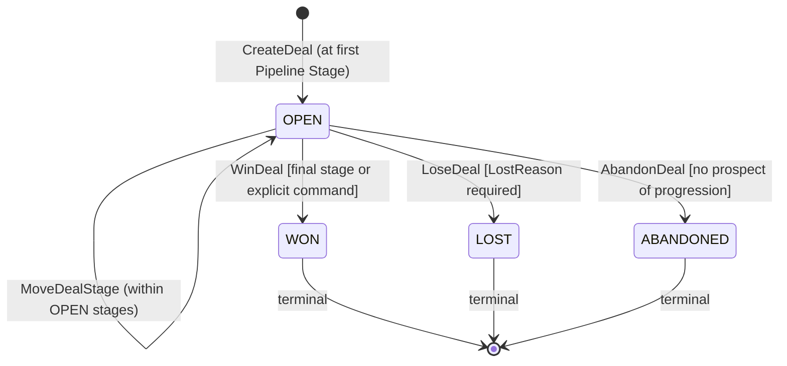

### 7.3 Appointment Lifecycle

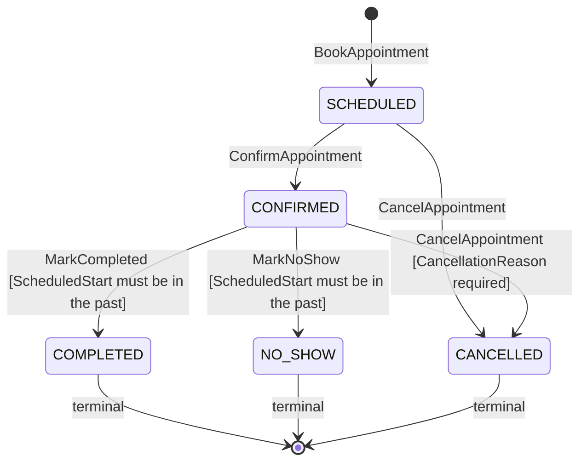

### 7.4 Task Lifecycle

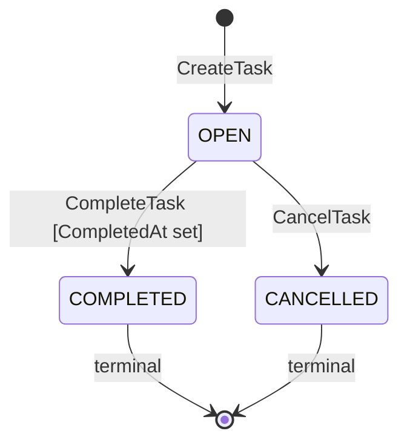

---

## 8. Policies

| Policy | Enforces |
|---|---|
| `PhoneMustBeUniqueInTenant` | `ContactDeduplicationService` checks before `CreateContact` |
| `DNCContactCannotBeCampaignDialed` | `DoNotCall = true` → Campaign Engine rejects outbound dial |
| `QualificationRequiresContact` | `QualificationStatus` change requires at least one Activity |
| `DealStageMustBelongToPipeline` | `DealStageValidationService.can_move()` before `MoveDealStage` |
| `TerminalDealIsImmutable` | WON, LOST, ABANDONED deals cannot have `MoveDealStage` called |
| `AINotesAreReadOnly` | `NoteSource = AI_*` notes cannot be edited by any human command |
| `ManualScoreRequiresPermission` | `contact:score_override` permission required for `MANUAL` scorer type |
| `LeadConversionRequiresDeal` | `ConvertLead` must find a WON Deal for this Contact (configurable: can be bypassed by Owner with `contact:force_convert`) |
| `RequiresPermission(permission)` | Authorization OHS from Phase 4A — checked for all write commands |
| `AppointmentEndAfterStart` | `ScheduledEnd > ScheduledStart` — checked at construction |
| `BookingWindowEnforced` | Appointments cannot be booked more than 90 days in advance (configurable) |

---

## 9. Specifications

```python
class QualifiedLeadSpecification(Specification[Contact]):
    def is_satisfied_by(self, contact: Contact) -> bool:
        return contact.qualification_status == QualificationStatus.QUALIFIED

class HotLeadSpecification(Specification[Contact]):
    def is_satisfied_by(self, contact: Contact) -> bool:
        return contact.lead_temperature == LeadTemperature.HOT

class DNCFreeContactSpecification(Specification[Contact]):
    def is_satisfied_by(self, contact: Contact) -> bool:
        return not contact.do_not_call

class OpenDealSpecification(Specification[Deal]):
    def is_satisfied_by(self, deal: Deal) -> bool:
        return deal.status == DealStatus.OPEN

class OverdueTasSpecification(Specification[Task]):
    def __init__(self, now: datetime) -> None:
        self._now = now
    def is_satisfied_by(self, task: Task) -> bool:
        return task.status == TaskStatus.OPEN and task.due_at < self._now
```

---

## 10. Domain Events — Full Catalogue

### 10.1 Event Envelope

Reuses Phase 4A §9.1 `DomainEvent` envelope. All CRM events carry `tenant_id` and `correlation_id`.

### 10.2 Contact & Lead Events

| Event | Key Payload Fields | Consumed by |
|---|---|---|
| `contact.created` | `contact_id, tenant_id, phone, source, campaign_ref` | Audit, Analytics, Webhook Engine, Campaign (if campaign_ref set) |
| `contact.updated` | `contact_id, changed_fields` | Audit, Analytics |
| `contact.lead_status_changed` | `contact_id, old_status, new_status, changed_by` | Audit, Analytics, Campaign, Webhook |
| `contact.qualified` | `contact_id, qualification_reason, qualified_by: AI_AGENT\|USER` | Audit, Analytics, Campaign, Webhook |
| `contact.disqualified` | `contact_id, qualification_reason, disqualified_by` | Audit, Analytics, Campaign |
| `contact.score_updated` | `contact_id, old_score, new_score, new_temperature, scorer_type, signal_count` | Audit, Analytics, Webhook |
| `contact.converted` | `contact_id, converted_at, triggering_deal_id` | Audit, Analytics, Billing, Webhook |
| `contact.merged` | `primary_id, secondary_id, field_merge_map` | Audit, Activity/Task/Deal re-pointing |
| `contact.dnc_flagged` | `contact_id, flagged_by` | Audit, Campaign (remove from active queues) |
| `contact.owner_assigned` | `contact_id, old_owner, new_owner` | Audit, Notification (to new owner) |

### 10.3 Deal Events

| Event | Key Payload Fields | Consumed by |
|---|---|---|
| `deal.created` | `deal_id, contact_ref, pipeline_id, stage_id, value, currency` | Audit, Analytics, Webhook |
| `deal.stage_changed` | `deal_id, from_stage, to_stage, changed_by` | Audit, Analytics |
| `deal.won` | `deal_id, contact_ref, value, closed_at` | Audit, Analytics, Billing, Webhook, Contact (triggers ConvertLead if configured) |
| `deal.lost` | `deal_id, contact_ref, lost_reason, closed_at` | Audit, Analytics, Webhook |
| `deal.abandoned` | `deal_id, contact_ref, abandoned_at` | Audit, Analytics |

### 10.4 Activity and Task Events

| Event | Key Payload Fields | Consumed by |
|---|---|---|
| `activity.recorded` | `activity_id, subject, activity_type, actor_type, occurred_at` | Audit, Analytics |
| `task.created` | `task_id, subject, assigned_to, due_at, created_by_type` | Audit, Notification (to assignee) |
| `task.completed` | `task_id, subject, completed_at` | Audit, Analytics |
| `task.cancelled` | `task_id, subject, cancelled_by` | Audit |

### 10.5 Appointment Events

| Event | Key Payload Fields | Consumed by |
|---|---|---|
| `appointment.booked` | `appointment_id, contact_ref, organizer_ref, start, end, source` | Audit, Analytics, Webhook, Notification (to organizer + contact) |
| `appointment.confirmed` | `appointment_id, confirmed_at` | Audit, Notification |
| `appointment.cancelled` | `appointment_id, cancellation_reason, cancelled_by` | Audit, Notification, Analytics |
| `appointment.completed` | `appointment_id, completed_at` | Audit, Analytics |
| `appointment.no_show` | `appointment_id, marked_by` | Audit, Analytics, (re-schedule task may be auto-created by Workflow) |
| `appointment.rescheduled` | `appointment_id, old_start, new_start, rescheduled_by` | Audit, Notification |

### 10.6 Note Events

| Event | Key Payload Fields | Consumed by |
|---|---|---|
| `note.added` | `note_id, subject, author_type, note_source` | Audit |
| `note.deleted` | `note_id, subject, deleted_by` | Audit |

---

## 11. Commands — Full Catalogue

### 11.1 Contact Commands

```python
@dataclass(frozen=True)
class CreateContact:
    command_id: UUIDv7
    tenant_id: TenantId
    full_name: str
    primary_phone: E164PhoneNumber
    primary_email: EmailAddress | None
    company_ref: CompanyId | None
    source: ContactSource
    campaign_ref: str | None
    created_by: UserId | None        # None if created by AI Agent / system

@dataclass(frozen=True)
class UpdateLeadStatus:
    command_id: UUIDv7
    contact_id: ContactId
    tenant_id: TenantId
    new_status: LeadStatus
    changed_by: UserId
    reason: str | None

@dataclass(frozen=True)
class SetQualificationStatus:
    command_id: UUIDv7
    contact_id: ContactId
    tenant_id: TenantId
    status: QualificationStatus
    reason: str
    set_by_type: ActorType           # AI_AGENT | HUMAN
    set_by_ref: str | None           # UserId or AgentId

@dataclass(frozen=True)
class MergeContacts:
    command_id: UUIDv7
    tenant_id: TenantId
    primary_contact_id: ContactId
    secondary_contact_id: ContactId
    merged_by: UserId
```

### 11.2 Deal Commands

```python
@dataclass(frozen=True)
class CreateDeal:
    command_id: UUIDv7
    tenant_id: TenantId
    title: str
    contact_ref: ContactId
    company_ref: CompanyId | None
    pipeline_ref: PipelineId
    initial_stage_ref: PipelineStageId
    value: Money | None
    currency: str | None
    close_date: date | None
    created_by: UserId | None

@dataclass(frozen=True)
class MoveDealStage:
    command_id: UUIDv7
    deal_id: DealId
    tenant_id: TenantId
    target_stage_id: PipelineStageId
    moved_by: UserId

@dataclass(frozen=True)
class WinDeal:
    command_id: UUIDv7
    deal_id: DealId
    tenant_id: TenantId
    won_by: UserId

@dataclass(frozen=True)
class LoseDeal:
    command_id: UUIDv7
    deal_id: DealId
    tenant_id: TenantId
    lost_reason: str
    lost_by: UserId
```

### 11.3 Activity, Task, Note, Appointment Commands

```python
@dataclass(frozen=True)
class RecordActivity:
    command_id: UUIDv7
    tenant_id: TenantId
    activity_type: ActivityType
    subject: SubjectRef
    occurred_at: datetime
    actor: ActivityActor
    summary: str
    payload: dict                    # type-specific fields
    call_ref: str | None

@dataclass(frozen=True)
class CreateTask:
    command_id: UUIDv7
    tenant_id: TenantId
    title: str
    subject: SubjectRef
    assigned_to_ref: UserId | None
    due_at: datetime
    priority: Priority
    created_by_ref: str              # UserId or AgentId

@dataclass(frozen=True)
class AddNote:
    command_id: UUIDv7
    tenant_id: TenantId
    subject: SubjectRef
    body: str
    author_ref: str
    note_source: NoteSource

@dataclass(frozen=True)
class BookAppointment:
    command_id: UUIDv7
    tenant_id: TenantId
    contact_ref: ContactId
    organizer_ref: UserId
    title: str
    scheduled_start: datetime
    scheduled_end: datetime
    location: AppointmentLocation | None
    source: AppointmentSource
    conversation_ref: str | None
```

---

## 12. Queries — Full Catalogue

```python
# Contacts
GetContact(contact_id: ContactId, tenant_id: TenantId) -> ContactDTO
GetContactByPhone(phone: E164PhoneNumber, tenant_id: TenantId) -> ContactDTO | None
GetCustomerProfile(contact_id: ContactId, tenant_id: TenantId) -> CustomerProfileDTO
    # returns: Contact + recent Activities + open Tasks + open Deals + LeadScore history
ListContacts(tenant_id: TenantId, filters: ContactFilter, page: Page) -> Page[ContactSummaryDTO]
    # filters: lead_status, qualification_status, lead_temperature, owner_ref, tag, source

# Companies
GetCompany(company_id: CompanyId, tenant_id: TenantId) -> CompanyDTO
ListCompanies(tenant_id: TenantId, filters: CompanyFilter, page: Page) -> Page[CompanySummaryDTO]

# Deals
GetDeal(deal_id: DealId, tenant_id: TenantId) -> DealDTO
ListDealsForContact(contact_id: ContactId, tenant_id: TenantId) -> list[DealSummaryDTO]
GetPipelineBoard(pipeline_id: PipelineId, tenant_id: TenantId) -> PipelineBoardDTO
    # returns: all stages + deal counts + deal values per stage

# Activities, Tasks, Notes, Appointments
GetActivitiesForSubject(subject: SubjectRef, tenant_id: TenantId, page: Page) -> Page[ActivityDTO]
GetTasksForSubject(subject: SubjectRef, tenant_id: TenantId, status: TaskStatus | None) -> list[TaskDTO]
GetNotesForSubject(subject: SubjectRef, tenant_id: TenantId) -> list[NoteDTO]
GetAppointmentsForContact(contact_id: ContactId, tenant_id: TenantId) -> list[AppointmentDTO]
GetUpcomingTasks(assigned_to: UserId, tenant_id: TenantId, page: Page) -> Page[TaskDTO]

# Scoring
GetLeadScoreHistory(contact_id: ContactId, tenant_id: TenantId) -> list[LeadScoreRecordDTO]

# Pipelines
GetPipeline(pipeline_id: PipelineId, tenant_id: TenantId) -> PipelineDTO
ListPipelines(tenant_id: TenantId) -> list[PipelineSummaryDTO]
```

---

## 13. Application Services

### 13.1 ContactApplicationService

```python
class ContactApplicationService:
    async def create_contact(self, cmd: CreateContact) -> ContactId:
        # 1. Policy: RequiresPermission("contact:create")
        # 2. ContactDeduplicationService.find_duplicate(phone, email, tenant_id)
        #    → if found, return existing ContactId (caller decides create vs update)
        # 3. ContactFactory.create(cmd)
        # 4. UoW: save Contact, publish ContactCreated via outbox

    async def set_qualification_status(self, cmd: SetQualificationStatus) -> None:
        # 1. Policy: RequiresPermission("contact:qualify") if HUMAN actor
        # 2. Policy: QualificationRequiresContact (at least one Activity)
        # 3. Contact.set_qualification_status(status, reason, by)
        # 4. If QUALIFIED: LeadScoringService.compute(signals=[QUALIFICATION_ANSWER...])
        #    → LeadScoreRecord saved; Contact.update_lead_score(new_score)
        # 5. If QUALIFIED and LeadStatus < QUALIFIED: auto-advance LeadStatus
        # 6. UoW: save Contact, save LeadScoreRecord, publish events

    async def handle_call_completed(self, event: CallCompletedEvent) -> None:
        # Consumes call.ended from Voice Platform
        # 1. GetContactByPhone(event.from_number or event.to_number)
        #    → creates a new Contact if not found (source=INBOUND_CALL or OUTBOUND_CALL)
        # 2. RecordActivity(type=CALL, actor=AI_AGENT, payload={duration, outcome, ...})
        # 3. Contact.update_last_contacted_at()
        # 4. UoW: save Contact, save Activity

    async def handle_qualification_set(self, event: ConversationQualificationEvent) -> None:
        # Consumes conversation.qualification_set from Voice Platform
        # 1. Load Contact by ContactRef from event
        # 2. SetQualificationStatus(status, reason, set_by_type=AI_AGENT)
        # Already covered above

    async def handle_summary_ready(self, event: ConversationSummarizationEvent) -> None:
        # Consumes conversation.summarization_completed
        # 1. Load Contact
        # 2. AddNote(body=event.summary, source=AI_SUMMARY, author_ref=event.agent_version_id)
```

### 13.2 Tool-Callable Entry Points (for Phase 4B Tool Runners)

These are the public use cases that Phase 4B's CRM tool runners invoke directly (§§ of 3B §13, the cross-module port pattern):

```python
class FindOrCreateContact:
    """Called by createLead tool runner. Idempotent."""
    async def execute(self, phone: E164PhoneNumber, name: str | None,
                      tenant_id: TenantId, source: ContactSource,
                      campaign_ref: str | None) -> ContactId: ...

class UpdateContactFromCall:
    """Called by updateLead tool runner. Applies LLM-extracted fields."""
    async def execute(self, contact_id: ContactId, updates: ContactFieldUpdates,
                      conversation_ref: str, tenant_id: TenantId) -> None: ...

class BookAppointmentFromCall:
    """Called by bookAppointment tool runner. Source=AI_AGENT."""
    async def execute(self, contact_id: ContactId, organizer_ref: UserId,
                      start: datetime, end: datetime, title: str,
                      conversation_ref: str, tenant_id: TenantId) -> AppointmentId: ...

class CreateTaskFromCall:
    """Called by createTask / scheduleFollowup tool runners."""
    async def execute(self, subject: SubjectRef, title: str, due_at: datetime,
                      assigned_to: UserId | None, priority: Priority,
                      agent_version_ref: str, tenant_id: TenantId) -> TaskId: ...
```

---

## 14. Repositories — Interface Definitions

```python
class ContactRepository(Protocol):
    async def get_by_id(self, contact_id: ContactId, tenant_id: TenantId) -> Contact | None: ...
    async def get_by_phone(self, phone: E164PhoneNumber, tenant_id: TenantId) -> Contact | None: ...
    async def get_by_email(self, email: EmailAddress, tenant_id: TenantId) -> Contact | None: ...
    async def find(self, tenant_id: TenantId, spec: Specification, page: Page) -> Page[Contact]: ...
    async def save(self, contact: Contact) -> None: ...

class CompanyRepository(Protocol):
    async def get_by_id(self, company_id: CompanyId, tenant_id: TenantId) -> Company | None: ...
    async def get_by_domain(self, domain: str, tenant_id: TenantId) -> Company | None: ...
    async def save(self, company: Company) -> None: ...

class DealRepository(Protocol):
    async def get_by_id(self, deal_id: DealId, tenant_id: TenantId) -> Deal | None: ...
    async def find_by_contact(self, contact_id: ContactId, tenant_id: TenantId) -> list[Deal]: ...
    async def find_by_pipeline(self, pipeline_id: PipelineId, tenant_id: TenantId) -> list[Deal]: ...
    async def save(self, deal: Deal) -> None: ...

class PipelineRepository(Protocol):
    async def get_by_id(self, pipeline_id: PipelineId, tenant_id: TenantId) -> Pipeline | None: ...
    async def get_default(self, tenant_id: TenantId) -> Pipeline | None: ...
    async def save(self, pipeline: Pipeline) -> None: ...

class ActivityRepository(Protocol):
    async def save(self, activity: Activity) -> None: ...  # append-only
    async def find_by_subject(self, subject: SubjectRef, tenant_id: TenantId, page: Page) -> Page[Activity]: ...

class TaskRepository(Protocol):
    async def get_by_id(self, task_id: TaskId, tenant_id: TenantId) -> Task | None: ...
    async def find_by_subject(self, subject: SubjectRef, tenant_id: TenantId, status: TaskStatus | None) -> list[Task]: ...
    async def find_overdue(self, tenant_id: TenantId, now: datetime) -> list[Task]: ...
    async def save(self, task: Task) -> None: ...

class NoteRepository(Protocol):
    async def save(self, note: Note) -> None: ...
    async def delete(self, note_id: NoteId, tenant_id: TenantId) -> None: ...
    async def find_by_subject(self, subject: SubjectRef, tenant_id: TenantId) -> list[Note]: ...

class AppointmentRepository(Protocol):
    async def get_by_id(self, appointment_id: AppointmentId, tenant_id: TenantId) -> Appointment | None: ...
    async def find_by_contact(self, contact_id: ContactId, tenant_id: TenantId) -> list[Appointment]: ...
    async def find_by_organizer(self, organizer_ref: UserId, tenant_id: TenantId, from_dt: datetime) -> list[Appointment]: ...
    async def save(self, appointment: Appointment) -> None: ...

class LeadScoreRepository(Protocol):
    async def get_latest(self, contact_id: ContactId, tenant_id: TenantId) -> LeadScoreRecord | None: ...
    async def find_history(self, contact_id: ContactId, tenant_id: TenantId) -> list[LeadScoreRecord]: ...
    async def save(self, record: LeadScoreRecord) -> None: ...

class CRMFieldDefinitionRepository(Protocol):
    async def get_by_tenant(self, tenant_id: TenantId) -> CRMFieldDefinitionSet: ...
    async def save(self, definition_set: CRMFieldDefinitionSet) -> None: ...
```

---

## 15. Factories

### 15.1 ContactFactory

```python
class ContactFactory:
    def create_from_call(
        self,
        phone: E164PhoneNumber,
        direction: CallDirection,
        tenant_id: TenantId,
        campaign_ref: str | None,
    ) -> Contact:
        """
        Creates a minimal Contact from a call event.
        Source is INBOUND_CALL or OUTBOUND_CALL.
        FullName defaults to the phone number string until updated by AI or human.
        LeadStatus starts at NEW.
        """
        ...

    def create_from_csv(
        self,
        row: CsvContactRow,
        tenant_id: TenantId,
        campaign_ref: str | None,
    ) -> Contact:
        """
        Creates a Contact from a validated CSV row.
        Source = CSV_IMPORT. LeadStatus starts at NEW.
        """
        ...
```

### 15.2 DealFactory

```python
class DealFactory:
    def create(
        self,
        cmd: CreateDeal,
        pipeline: Pipeline,
    ) -> Deal:
        """
        Resolves the initial stage from the pipeline.
        If cmd.initial_stage_ref is not provided, uses the first stage (order=1).
        """
        ...
```

---

## 16. Lead Scoring — Domain Model Detail

### 16.1 How AI-Generated Scores Interact With Business Rules

The AI Agent (Phase 4B) produces scoring *signals* — it does not produce a final score. The `LeadScoringService` (§6.3) receives these signals and applies the domain's weighting rules. This separation is critical:

- The AI produces a `sentiment_score` signal (0.0–1.0 from the conversation).
- The domain rule says `sentiment_score` contributes 20% to the total score.
- A `MANUAL` override by a human contributes 100% (replaces all signal-derived scoring).

This means:
1. The AI cannot unilaterally determine a Lead is HOT — it can only push the score toward HOT via positive signals.
2. A human can always override the AI's assessment.
3. The scoring history (every `LeadScoreRecord`) shows exactly which signals contributed and whether they came from AI or rules, satisfying the audit requirement.

### 16.2 Scoring Triggers

| Trigger event | Signals produced | Scorer type |
|---|---|---|
| `call.ended` with `outcome = ANSWERED_COMPLETED` | `CALL_ANSWERED`, `CALL_DURATION` | RULE_ENGINE |
| `conversation.qualification_set` with `QUALIFIED` | `QUALIFICATION_ANSWER` | AI_AGENT |
| `conversation.sentiment_computed` | `SENTIMENT_SCORE` | AI_AGENT |
| `appointment.booked` | `APPOINTMENT_BOOKED` | RULE_ENGINE |
| `deal.created` | `DEAL_CREATED` | RULE_ENGINE |
| Manual override via UI | `MANUAL_OVERRIDE` | MANUAL (requires `contact:score_override` permission) |

All scoring events are processed by a Celery background worker that loads the latest signals, calls `LeadScoringService.compute()`, saves the `LeadScoreRecord`, and updates `Contact.LeadScore` — never inline on the event handler.

### 16.3 Score History and Temperature Thresholds

```
HOT:  score >= 70
WARM: score in [40, 69]
COLD: score in [0, 39]
UNSCORED: score is null (never been computed)
```

These thresholds are configurable per Organisation via a platform feature flag — the defaults above are the platform-wide starting values. The domain enforces that `LeadTemperature` is always derived from the current `LeadScore` — it is not independently settable.

---

## 17. Sequence Diagrams

### 17.1 Lead Creation from Inbound Call

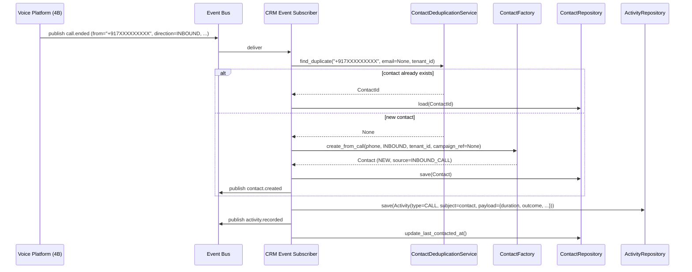

### 17.2 AI Call → Lead Creation → Qualification

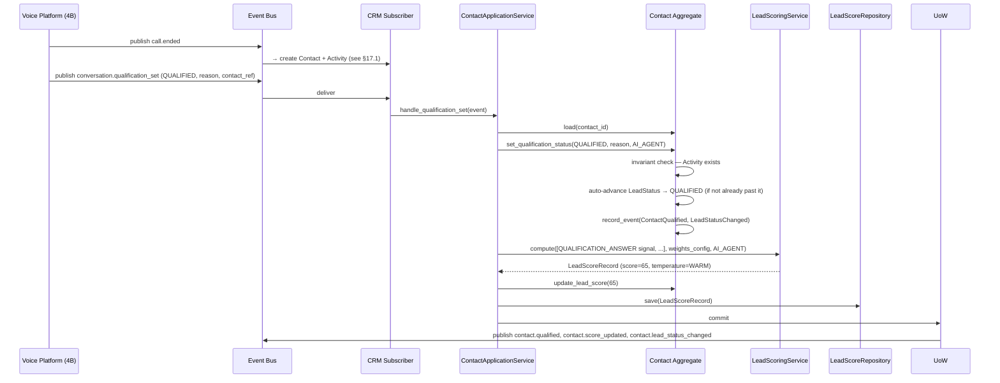

### 17.3 Lead Scoring from Multiple Signals

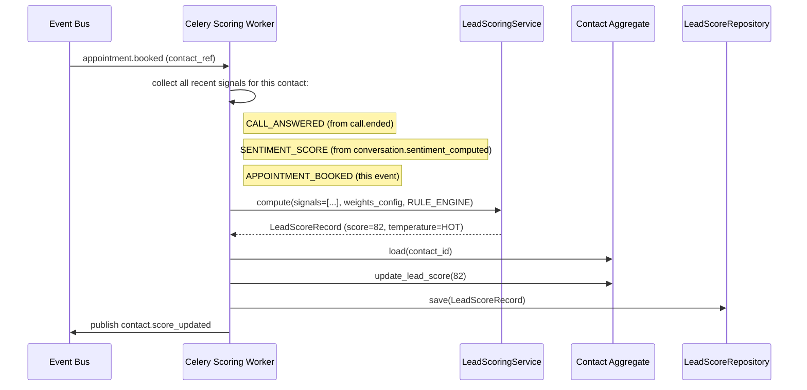

### 17.4 Deal Creation from Call (Tool Runner)

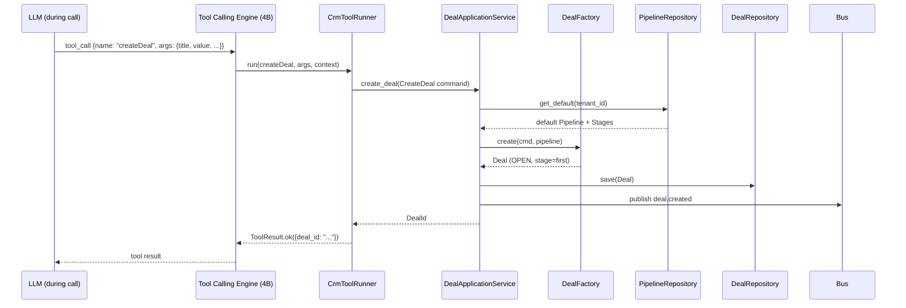

### 17.5 Lead Conversion

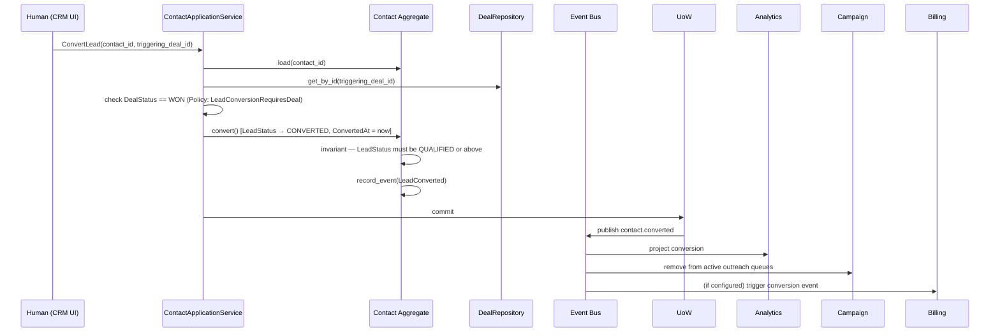

### 17.6 Appointment Booking via AI Tool

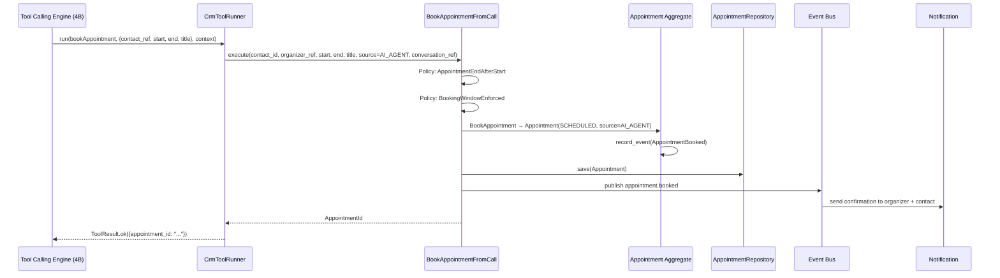

### 17.7 CRM Activity Creation from Call Summary

```mermaid
sequenceDiagram
    participant Voice as Voice Platform (4B)
    participant Bus as Event Bus
    participant Sub as CRM Subscriber
    participant AppSvc as ContactApplicationService
    participant NoteRepo as NoteRepository

    Voice->>Bus: publish conversation.summarization_completed (conversation_id, summary_text, contact_ref)
    Bus->>Sub: deliver
    Sub->>AppSvc: handle_summary_ready(event)
    AppSvc->>NoteRepo: save(Note(
        subject=SubjectRef(CONTACT, contact_ref),
        body=summary_text,
        source=AI_SUMMARY,
        author_ref=agent_version_id
    ))
    AppSvc->>Bus: publish note.added
```

### 17.8 Manual Lead Status Update

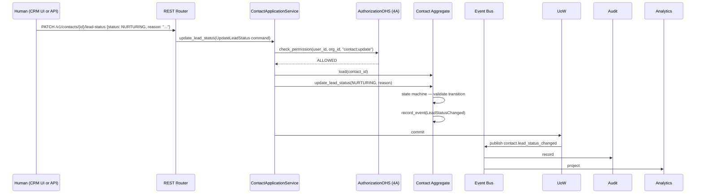

---

## 18. Domain Package Structure

```text
modules/
├── crm/                               # Lead & Contact + Company Context
│   ├── domain/
│   │   ├── aggregates/
│   │   │   ├── contact.py             # Contact AggregateRoot
│   │   │   └── company.py             # Company AggregateRoot
│   │   ├── value_objects/
│   │   │   ├── identifiers.py         # ContactId, CompanyId
│   │   │   ├── lead_status.py         # LeadStatus + transition table
│   │   │   ├── qualification_status.py
│   │   │   ├── lead_score.py          # LeadScore, LeadTemperature (derived)
│   │   │   ├── contact_source.py
│   │   │   ├── consent_status.py
│   │   │   ├── postal_address.py
│   │   │   ├── tag.py
│   │   │   └── subject_ref.py         # SubjectRef, SubjectType
│   │   ├── events/
│   │   │   ├── contact_events.py
│   │   │   └── company_events.py
│   │   ├── commands/
│   │   │   ├── contact_commands.py
│   │   │   └── company_commands.py
│   │   ├── services/
│   │   │   ├── contact_deduplication_service.py
│   │   │   ├── contacts_merge_service.py
│   │   │   └── lead_qualification_service.py
│   │   ├── factories/
│   │   │   └── contact_factory.py
│   │   ├── specifications/
│   │   │   └── contact_specifications.py
│   │   └── policies/
│   │       └── crm_policies.py
│   ├── application/
│   │   ├── use_cases/
│   │   │   ├── create_contact.py
│   │   │   ├── update_contact.py
│   │   │   ├── find_or_create_contact.py   # tool-callable public entry point
│   │   │   ├── set_qualification_status.py
│   │   │   ├── convert_lead.py
│   │   │   ├── merge_contacts.py
│   │   │   └── update_contact_from_call.py # tool-callable
│   │   ├── queries/
│   │   │   ├── get_contact.py
│   │   │   ├── get_customer_profile.py
│   │   │   └── list_contacts.py
│   │   └── ports/
│   │       ├── contact_repository.py
│   │       └── company_repository.py
│   ├── infrastructure/
│   │   ├── models.py
│   │   ├── mappers.py
│   │   └── repositories/
│   │       ├── sqlalchemy_contact_repository.py
│   │       └── sqlalchemy_company_repository.py
│   └── interface/
│       ├── rest/router.py
│       └── events/
│           └── subscribers.py         # call.ended, conversation.qualification_set, summary.ready
│
├── deals/                             # Deal & Pipeline Context
│   ├── domain/
│   │   ├── aggregates/
│   │   │   ├── deal.py
│   │   │   └── pipeline.py
│   │   ├── value_objects/
│   │   │   ├── identifiers.py
│   │   │   ├── deal_status.py
│   │   │   └── pipeline_stage.py      # PipelineStage entity, PipelineStageId VO
│   │   ├── events/
│   │   │   ├── deal_events.py
│   │   │   └── pipeline_events.py
│   │   ├── commands/
│   │   │   ├── deal_commands.py
│   │   │   └── pipeline_commands.py
│   │   ├── services/
│   │   │   └── deal_stage_validation_service.py
│   │   └── factories/
│   │       └── deal_factory.py
│   ├── application/
│   │   ├── use_cases/
│   │   │   ├── create_deal.py         # tool-callable
│   │   │   ├── move_deal_stage.py
│   │   │   ├── win_deal.py
│   │   │   └── lose_deal.py
│   │   ├── queries/
│   │   │   ├── get_deal.py
│   │   │   └── get_pipeline_board.py
│   │   └── ports/
│   │       ├── deal_repository.py
│   │       └── pipeline_repository.py
│   ├── infrastructure/
│   │   ├── models.py
│   │   └── repositories/
│   │       ├── sqlalchemy_deal_repository.py
│   │       └── sqlalchemy_pipeline_repository.py
│   └── interface/
│       ├── rest/router.py
│       └── events/subscribers.py     # deal.won → trigger contact.converted if configured
│
├── activities/                        # Activity, Task, Note Context
│   ├── domain/
│   │   ├── aggregates/
│   │   │   ├── activity.py
│   │   │   ├── task.py
│   │   │   └── note.py
│   │   ├── value_objects/
│   │   │   ├── identifiers.py
│   │   │   ├── activity_type.py
│   │   │   ├── activity_actor.py
│   │   │   ├── activity_payload.py
│   │   │   ├── task_status.py
│   │   │   ├── priority.py
│   │   │   └── note_source.py
│   │   ├── events/
│   │   │   ├── activity_events.py
│   │   │   ├── task_events.py
│   │   │   └── note_events.py
│   │   └── commands/
│   │       ├── activity_commands.py
│   │       ├── task_commands.py
│   │       └── note_commands.py
│   ├── application/
│   │   ├── use_cases/
│   │   │   ├── record_activity.py
│   │   │   ├── create_task.py         # tool-callable
│   │   │   ├── complete_task.py
│   │   │   ├── add_note.py
│   │   │   └── add_ai_summary_note.py # tool-callable (post-call, from summary event)
│   │   ├── queries/
│   │   │   ├── get_activities.py
│   │   │   ├── get_tasks.py
│   │   │   └── get_notes.py
│   │   └── ports/
│   │       ├── activity_repository.py
│   │       ├── task_repository.py
│   │       └── note_repository.py
│   ├── infrastructure/
│   │   ├── models.py
│   │   └── repositories/
│   │       ├── sqlalchemy_activity_repository.py
│   │       ├── sqlalchemy_task_repository.py
│   │       └── sqlalchemy_note_repository.py
│   └── interface/
│       ├── rest/router.py
│       └── events/subscribers.py
│
├── appointments/                      # Appointment Context
│   ├── domain/
│   │   ├── aggregates/appointment.py
│   │   ├── value_objects/
│   │   │   ├── identifiers.py
│   │   │   ├── appointment_status.py
│   │   │   ├── appointment_source.py
│   │   │   └── appointment_location.py
│   │   ├── events/appointment_events.py
│   │   └── commands/appointment_commands.py
│   ├── application/
│   │   ├── use_cases/
│   │   │   ├── book_appointment.py    # tool-callable public entry point
│   │   │   ├── confirm_appointment.py
│   │   │   ├── cancel_appointment.py
│   │   │   ├── mark_completed.py
│   │   │   └── mark_no_show.py
│   │   ├── queries/get_appointments.py
│   │   └── ports/appointment_repository.py
│   ├── infrastructure/
│   │   ├── models.py
│   │   └── repositories/sqlalchemy_appointment_repository.py
│   └── interface/
│       ├── rest/router.py
│       └── events/subscribers.py
│
├── lead_scoring/                      # Lead Scoring Context
│   ├── domain/
│   │   ├── aggregates/lead_score_record.py
│   │   ├── value_objects/
│   │   │   ├── identifiers.py
│   │   │   ├── scoring_signal.py      # ScoringSignal entity (embedded), SignalType VO
│   │   │   ├── scorer_type.py
│   │   │   └── scoring_weights_config.py
│   │   └── services/lead_scoring_service.py
│   ├── application/
│   │   ├── use_cases/
│   │   │   ├── compute_and_apply_score.py
│   │   │   └── manual_score_override.py
│   │   ├── queries/get_score_history.py
│   │   └── ports/lead_score_repository.py
│   ├── infrastructure/
│   │   ├── models.py
│   │   └── repositories/sqlalchemy_lead_score_repository.py
│   └── interface/
│       └── events/subscribers.py     # appointment.booked, call.ended, conversation.sentiment_computed
│
└── custom_fields/                     # Custom Fields Context (Generic)
    ├── domain/
    │   ├── aggregates/crm_field_definition_set.py
    │   ├── value_objects/
    │   │   ├── field_id.py
    │   │   ├── field_type.py
    │   │   └── crm_field_value.py
    │   └── events/custom_field_events.py
    ├── application/
    │   ├── use_cases/
    │   │   ├── create_field.py
    │   │   ├── update_field.py
    │   │   └── deactivate_field.py
    │   └── ports/crm_field_definition_repository.py
    └── infrastructure/
        ├── models.py
        └── repositories/sqlalchemy_crm_field_definition_repository.py
```

---

## 19. Persistence Identification

| Aggregate | Store | Access Patterns | Notes |
|---|---|---|---|
| `Contact` | PostgreSQL | By phone (unique per tenant), by ContactId, by LeadStatus, by score range | Tenant-scoped, indexed on `primary_phone` with partial index per tenant |
| `Company` | PostgreSQL | By CompanyId, by email domain | Tenant-scoped |
| `Deal` | PostgreSQL | By DealId, by ContactRef, by PipelineRef, by Status | Pipeline board query needs aggregation — read model projection recommended |
| `Pipeline` | PostgreSQL | By PipelineId, by tenant (max ~20 pipelines per org) | Stages embedded as JSONB |
| `Activity` | PostgreSQL | Append-only; by Subject ordered by OccurredAt | Partition by month — high-volume table |
| `Task` | PostgreSQL | By Subject, by AssignedToRef, by Status, by DueAt | Index on `due_at` for overdue queries |
| `Note` | PostgreSQL | By Subject ordered by CreatedAt | Notes table; AI notes distinguishable by NoteSource |
| `Appointment` | PostgreSQL | By ContactRef, by OrganizerRef, by date range | Future: calendar provider sync metadata |
| `LeadScoreRecord` | PostgreSQL | By ContactRef ordered by ComputedAt | History table; current score denormalized on Contact |
| `CRMFieldDefinitionSet` | PostgreSQL | One row per tenant (JSONB) | Cached in Redis, short TTL |

**Denormalization decisions:**
- `Contact.LeadScore` and `Contact.LeadTemperature` are denormalized from `LeadScoreRecord` for fast filtering/sorting — the `LeadScoreRecord` is the system of record.
- `Contact.LastContactedAt` is denormalized from `Activity` — updated by event handler, not recalculated on every read.
- Pipeline board (deal counts + values per stage) is a materialized projection (CQRS read model) — see Phase 3C §4's reasoning.

---

## 20. Cross-Domain Communication

| This domain | Other domain | Direction | Mechanism |
|---|---|---|---|
| CRM | Voice Platform (4B) | CRM consumes | `call.ended` → create/update Contact, record Activity |
| CRM | Voice Platform (4B) | CRM consumes | `conversation.qualification_set` → SetQualificationStatus |
| CRM | Voice Platform (4B) | CRM consumes | `conversation.summarization_completed` → AddNote(AI_SUMMARY) |
| CRM | Voice Platform (4B) | CRM supplies | `FindOrCreateContact`, `BookAppointment`, `CreateTask`, `CreateDeal` use cases (via tool runners) |
| CRM | Campaign Engine (Phase 4D) | CRM publishes | `contact.lead_status_changed`, `contact.qualified`, `contact.dnc_flagged` |
| CRM | Campaign Engine (Phase 4D) | Campaign consumes CRM | `contact.is_dnc()` check before outbound dial |
| CRM | Workflow Engine (Phase 4D) | Workflow triggers CRM | `BookAppointment`, `CreateTask` via workflow node executors |
| CRM | Analytics (Phase 4D) | CRM publishes | All CRM domain events consumed by analytics projectors |
| CRM | Billing (Phase 4D) | CRM publishes | `contact.converted` (if conversion is a billable event) |
| CRM | Webhook Engine (3E) | CRM publishes | All events above routed through webhook dispatcher for external integrations |
| CRM | Audit (Phase 4A) | All commands audited | Via domain event → Audit subscriber |
| CRM | Identity/Auth (Phase 4A) | CRM consumes OHS | `CheckPermission` before all write commands |

---

## 21. Domain Decision Records

### DDR-4C-001: Lead Is Not a Separate Entity from Contact

**Decision:** A "lead" in this platform is a `Contact` with `LeadStatus != CONVERTED`. There is no separate `Lead` entity.

**Rationale:** Phase 3C §5.4 established this decision and this document confirms it. The platform's primary inbound channel (phone calls) creates Contacts directly — there is no separate "lead intake form" that creates a Lead object later converted to a Contact. The single-entity model eliminates: (a) field-mapping questions on conversion, (b) the dual timeline (lead history vs. contact history), and (c) a duplicate deduplication surface.

**Alternative rejected:** Salesforce-style dual entity (Lead → converted to Contact + Account + Opportunity). Rejected because it doubles the data model complexity for a problem (inbound-call-based CRM) that doesn't require the separation.

**Risk:** If the product later needs to support an inbound web form "lead capture" flow distinct from a CRM Contact, the distinction may matter. The `ContactSource` value object accommodates different entry points; a future "web_form" source would simply be a Contact with `Source = WEB_FORM`.

---

### DDR-4C-002: Activity Is Append-Only and Immutable

**Decision:** `Activity` aggregates are created once and never modified. Corrections appear as new Activities.

**Rationale:** Activities are the audit trail of what happened. Modifying them would undermine their purpose. This is the same reasoning that governs `AuditEvent` in Phase 4A — events happened; they cannot un-happen.

**Alternative rejected:** mutable Activity with an update command for corrections. Rejected because it opens a surface for retroactive falsification of CRM records, which creates compliance and trust issues for enterprise buyers.

---

### DDR-4C-003: AI-Generated Notes Are Read-Only for Humans

**Decision:** Notes with `NoteSource = AI_SUMMARY` or `AI_INTERACTION` cannot be edited by human commands. They can be pinned or deleted, but not modified.

**Rationale:** AI-generated notes are the verbatim output of the platform's AI — modifying them would corrupt the record of what the AI actually said/summarised. If a human disagrees with an AI summary, they add a new human Note. This preserves auditability.

---

### DDR-4C-004: LeadTemperature Is Always Derived, Never Directly Set

**Decision:** `LeadTemperature` (HOT/WARM/COLD/UNSCORED) has no setter on the `Contact` aggregate. It is computed from `LeadScore` on every score update.

**Rationale:** allowing a human to set `LeadTemperature` independently of `LeadScore` would create inconsistency — a "HOT" contact with a score of 10. Derivation ensures the two are always consistent.

---

### DDR-4C-005: Pipeline Stage Ordering Allows Backward Moves by Default

**Decision:** by default, a Deal can be moved to any stage in its Pipeline (forward or backward). An org can configure a Pipeline to be "forward-only" via a Pipeline-level flag (not designed in detail — flagged as OQ-4C-02).

**Rationale:** real sales processes are non-linear. A deal that seemed won may slip back to negotiation. Enforcing forward-only by default would frustrate real-world use. Forward-only is an optional constraint for organisations that have strict stage governance.

---

### DDR-4C-006: Scoring Is Always Asynchronous

**Decision:** `LeadScoreRecord` computation always happens in a Celery background worker — never inline in a request handler or event handler synchronously.

**Rationale:** scoring may involve an LLM call (for qualitative signal analysis), which is latency-sensitive and should not block the event handler that processes `call.ended`. The Contact's score may lag the trigger event by up to a few seconds — acceptable for a scoring use case.

---

## 22. Architectural Trade-offs

| Trade-off | Choice | Cost | Benefit |
|---|---|---|---|
| Lead = Contact (unified entity) | Single `Contact` with `LeadStatus` | Less flexibility for web-lead flows | No synchronization surface, no conversion complexity |
| Activity is immutable | No update command | Corrections require new Activity | Full audit trail integrity |
| LeadScore denormalized on Contact | Two places to update (Contact + LeadScoreRecord) | Event handler must update both | Fast filtering/sorting by score without joining |
| Scoring always async | Score may lag trigger by seconds | Slightly delayed score visibility | LLM-based scoring doesn't block event processing |
| Appointment status lifecycle is strict | `NO_SHOW` requires past start time | Cannot pre-mark no-shows | Prevents date errors from corrupting appointment records |
| Pipeline Stages embedded in Pipeline | Stage changes lock the Pipeline aggregate | Large stage changes (reorder all) need one transaction | Always-consistent stage ordering; no orphan stages |

---

## 23. Risks

| Risk | Likelihood | Impact | Mitigation |
|---|---|---|---|
| Phone number deduplication misses (same person, different number) | Medium | Medium — duplicate Contact records | `ContactsMergeService` + UI duplicate detection view |
| AI qualification override frustrates human operators | Medium | Low — operator override always available with `contact:qualify` permission | Audit trail shows AI vs. human decision; human always wins on explicit command |
| LeadScore staleness on high-frequency signal events (many calls in quick succession) | Low | Low — scores converge within seconds | Celery task deduplication: if score already queued for this contact, skip duplicate enqueue |
| Pipeline stage removal with active Deals | Low | Medium | Invariant enforced at domain level: stage deletion blocked if Deals exist in that stage |
| Custom field proliferation (100+ fields) | Low | Medium — query and rendering performance | Hard limit of 50 fields per tenant at domain level |
| Activity volume on high-traffic contacts | Medium | Medium — query latency | Partition `activities` table by month (Phase 5); cursor pagination on all Activity queries |

---

## 24. Open Questions

| # | Question | Owner | Blocks |
|---|---|---|---|
| OQ-4C-01 | Should `DealWon` automatically trigger `ConvertLead` for the linked Contact, or must that be an explicit human command? (Current design: configurable, default=explicit) | Product | `deal.won` event handler design |
| OQ-4C-02 | Should Pipeline "forward-only" stage enforcement be a Pipeline-level flag or a per-Stage flag (i.e., certain stages can be skipped but not rolled back to)? | Product | `DealStageValidationService` |
| OQ-4C-03 | What is the maximum retention period for Activity records? (They are currently unbounded — partition rotation policy TBD in Phase 5) | Legal / Product | Phase 5 Database Design |
| OQ-4C-04 | Should the LeadScore thresholds (HOT ≥ 70 / WARM ≥ 40) be configurable per Organisation, or platform-wide only? | Product | `LeadScoringService` configuration |
| OQ-4C-05 | Should `bookAppointment` via AI tool require explicit organizer availability checking? (Phase 18 calendar integration — currently not checked, just creates the record) | Product | Phase 18 Integrations |
| OQ-4C-06 | Is there a requirement for recurring/scheduled Tasks (e.g., "follow up every Monday")? | Product | Task domain model — currently one-off only |
| OQ-4C-07 | Should Contacts be hard-deletable or only soft-deleted? (GDPR implications — "right to erasure") | Legal | Phase 5 — soft delete is the current assumption |
| OQ-4C-08 | Should the Activity message preview for SMS/WhatsApp be stored as a hash only (privacy) or as a truncated plaintext? | Legal / Product | `ActivityPayload` for SMS/WHATSAPP type |

---

## 25. Dependencies on Other Bounded Contexts

| Dependency | Direction | What Phase 4C needs |
|---|---|---|
| Identity / Authorization (Phase 4A) | Upstream | `TenantId`, `UserId`, `EmailAddress`, `Money`, `Permission`, `CheckPermission` OHS |
| Voice Platform (Phase 4B) | Upstream (produces events) | `call.ended`, `conversation.qualification_set`, `conversation.summarization_completed` |
| Voice Platform (Phase 4B) | Phase 4B consumes CRM (sync) | `FindOrCreateContact`, `BookAppointment`, `CreateTask` use cases |
| Audit (Phase 4A) | Phase 4C publishes → Audit consumes | All CRM domain events |
| Webhook Engine (Phase 3E) | Phase 4C publishes → Webhook dispatches | All CRM events available for external subscriptions |
| Notification (Phase 4A/18) | Phase 4C publishes → Notification consumes | `appointment.booked`, `task.created`, `contact.owner_assigned` |
| Campaign Engine (Phase 4D) | Phase 4C publishes → Campaign consumes | `contact.qualified`, `contact.dnc_flagged` |
| Analytics (Phase 4D) | Phase 4C publishes → Analytics consumes | All events |
| Billing (Phase 4D) | Phase 4C publishes → Billing consumes | `contact.converted` (conversion event) |

---

## 26. What Phase 4D Must Consume From This Design

Phase 4D (Campaign Engine, Workflow Builder, Analytics, Billing DDD) must:

1. **Consume `contact.qualified`, `contact.lead_status_changed`, `contact.dnc_flagged`** from the CRM event bus — Campaign Engine lead management depends on these.

2. **Call `FindOrCreateContact` use case** when a campaign lead's outbound call creates or matches a Contact — the Campaign Engine does not create Contact records directly; it calls CRM's public use case.

3. **Respect `DoNotCall` flag** — the Campaign Engine must call `ContactLookupPort.is_dnc(phone, tenant_id)` before placing any outbound call; the CRM owns this check.

4. **Use `ContactId`, `DealId`, `AppointmentId`, `TaskId`, `ActivityId`** from this document as foreign-key references — never define parallel identifiers.

5. **Workflow Engine node executors** for `bookAppointment`, `createTask`, `createDeal`, `createNote` must call this document's public use cases — never manipulate CRM aggregates directly.

6. **Analytics projectors** must consume the full CRM event catalogue from §10 — not invent parallel event structures.

7. **Never import `Contact`, `Deal`, `Pipeline`, `Appointment` domain objects directly** — reference them by ID value objects only.

---

## 27. Consistency Checks Against Phase 3 LLD and Phase 4A/4B

| Prior design | Phase 4C DDD | Consistent? | Notes |
|---|---|---|---|
| 3C §5.1 — Contact dedup by phone, `find_or_create_contact` public use case | §13.2 `FindOrCreateContact` use case + `ContactDeduplicationService` | ✅ | Domain service formalises what 3C designed as an application-layer pattern |
| 3C §5.4 — Lead = Contact with `QualificationStatus` field | §4.1 Contact aggregate + §7.1 LeadStatus state machine | ✅ | Consistent. State machine makes transitions explicit |
| 3C §5.5 — `LeadScoringPort` with rule-based v1 adapter | §6.3 `LeadScoringService` (domain service, pure) + `LeadScoreRecord` aggregate | ✅ | Promoted from infrastructure port to domain service — scoring is domain logic |
| 3C §5.6 — Call history as event-driven projection off `call.completed` | §17.1 sequence diagram — `call.ended` → Activity record | ✅ | `call.completed` renamed `call.ended` per 4B §11.2 — consistent |
| 3C §5.6 — `CallHistoryEntry` read model | §19 Persistence — Activity table + CQRS read repository | ✅ | `CallHistoryEntry` read model replaced by `ActivityRepository.find_by_subject` — cleaner, avoids a separate projection table |
| 3C §6.4 — `book_appointment` tool-callable from Tool Calling | §13.2 `BookAppointmentFromCall` use case — public entry point | ✅ | |
| 3C §6.4 — Appointment as own aggregate | §4.8 Appointment AggregateRoot | ✅ | |
| 3C §9 — `TenantScopedRepository` base for all CRM repos | §14 Repository interfaces — all tenant-scoped | ✅ | |
| 4A §9.1 — `DomainEvent` envelope | §10.1 — reused | ✅ | |
| 4B §11.2 — `call.ended` event with `outcome, duration_seconds` | §17.1 — consumed with these fields | ✅ | |
| 4B §11.3 — `conversation.qualification_set` with `outcome, contact_ref` | §13.1 `handle_qualification_set` | ✅ | |
| 4B §11.3 — `conversation.summarization_completed` with `summary_text, contact_ref` | §13.1 `handle_summary_ready` | ✅ | |
| 4B §13.2 `AuthorizeAndStartToolExecution` — tool authorization before CRM calls | §11.3 CRM commands are never called without going through the tool authorization layer | ✅ | CRM does not perform its own tool authorization — it trusts that the Tool Execution Context has already authorized |
| 4B OQ-4B-05 — Qualification outcome authority | §6.4 `LeadQualificationService` — AI sets, human can override with `contact:qualify` permission | ✅ Resolved | AI is authoritative on initial set; human override always available |
