# Phase 4D — Domain-Driven Design: Campaign & Outbound Calling Domain

| | |
|---|---|
| **Roadmap phase** | Phase 4 (Domain-Driven Design) — sub-phase 4D: Campaign & Outbound Calling |
| **Status** | Draft v1.0, for review |
| **Source of truth (approved, not redesigned here)** | Phase 1 SRS, Phase 2 HLA, Phase 3A–3F LLD, Phase 4A Core Domains, Phase 4B Voice & AI, Phase 4C CRM |
| **Scope** | Campaign lifecycle, CSV import, call queuing, scheduling, retry, concurrency, rate limiting, campaign outcomes, ROI |
| **Explicitly out of scope** | Workflow Builder internals, Analytics internals, Billing internals — referenced as downstream consumers only |

---

## 0. How to Read This Document

This document is the authoritative domain design for the Campaign & Outbound Calling platform. It does not generate code — it defines the shared language and invariants that all implementation must honour.

**Relationship to Phase 4A:** inherits `TenantId`, `UserId`, `OrganizationId`, `Permission`, `QuotaEnforcementService`, `DomainEvent` envelope.

**Relationship to Phase 4B:** the Campaign Engine is the primary *initiator* of outbound calls. It calls `Voice Platform's InitiateOutboundCallUseCase` as the boundary between campaign scheduling and actual call execution. All call lifecycle events (`call.ended`, `call.failed`) flow back to the Campaign Engine as integration events.

**Relationship to Phase 4C:** the Campaign Engine reads Contact records (via `ContactLookupPort`) and updates them indirectly through events (`campaign.contact.call_attempted`) that the CRM consumes. It never writes to Contact aggregates directly.

---

## 1. Ubiquitous Language

| Term | Definition | Never call it |
|---|---|---|
| **Campaign** | A configured, scheduled programme of outbound calls targeting a list of Contacts — the unit of management for outbound calling activity | "blast", "dialer job", "auto-dialer run" |
| **CampaignContact** | The record of a single Contact's participation in a Campaign — carries call attempt history, current status, and outcome within this campaign context | "campaign lead", "dialer record", "lead" |
| **ContactList** | A reusable, named set of Contact references — built from CSV import or CRM filter — that can be attached to one or more Campaigns | "lead list", "dialing list", "contact pool" |
| **CsvImportJob** | A background job that parses an uploaded CSV file and creates or resolves Contacts in the CRM and CampaignContacts in the Campaign | "CSV upload", "import task" |
| **CallAttempt** | One dial attempt to reach a specific CampaignContact — carries outcome (ANSWERED, NO_ANSWER, BUSY, FAILED, VOICEMAIL), timestamp, and duration | "call record", "dial attempt", "retry" |
| **CallJob** | A work item placed in the Call Queue representing the intent to place one outbound call for a specific CampaignContact — the unit of queue processing | "dial task", "queue item", "call task" |
| **Call Queue** | The bounded, ordered set of pending CallJobs for a running Campaign — managed in Redis, drained by the Campaign Executor | "dialer queue", "outbound queue" |
| **Campaign Executor** | The background process (tick-based, APScheduler + Celery) that drains the Call Queue, enforces concurrency and rate limits, and invokes the Voice Platform | "dialer", "outbound engine", "executor" |
| **Retry Queue** | The time-ordered set of CampaignContacts whose last attempt was non-terminal (NO_ANSWER, BUSY) and who are eligible for rescheduled dial attempts | "callback queue", "retry list" |
| **Dead Letter** | A CampaignContact that has exhausted all retry attempts without a terminal outcome — it is marked EXHAUSTED and removed from all active queues | "dead contact", "exhausted lead" |
| **SchedulingPolicy** | The rules governing when a Campaign may run — start date/time, end date/time, permitted calling windows (days and hours), timezone, and holiday exclusions | "campaign schedule", "call windows" |
| **ConcurrencyPolicy** | The maximum number of simultaneous live calls a Campaign may maintain at any moment | "concurrency limit", "parallel calls", "slots" |
| **RateLimitPolicy** | The maximum number of calls a Campaign may initiate within a rolling time window (e.g., 60 calls per minute) | "rate limit", "call rate", "pacing" |
| **RetryPolicy** | The rules governing how many re-attempts are made for non-terminal call outcomes and how long to wait between them | "retry rules", "callback rules", "backoff" |
| **CallingWindow** | A specific day-of-week + time-of-day range within which the Campaign may place calls — expressed in the Campaign's configured timezone | "calling hours", "dial window", "call time" |
| **CampaignOutcome** | The aggregate result of a Campaign — total contacts attempted, conversion rate, qualified leads, cost, and ROI — computed from CampaignContact records | "campaign result", "campaign report" |
| **Qualification Result** | The per-CampaignContact record of whether the AI Agent qualified, disqualified, or reached an inconclusive outcome for this Contact in this Campaign | "lead grade", "call outcome" |
| **Campaign ROI** | The ratio of business value (qualified leads × estimated conversion value) to total campaign cost (telephony + LLM + STT/TTS costs) | "return", "campaign profitability" |
| **Idempotency Key** | A value used to ensure that a CallJob is not placed in the queue more than once for the same (Campaign, CampaignContact, AttemptNumber) triple | "dedup key", "unique key" |
| **Executor Tick** | One cycle of the Campaign Executor — initiated by APScheduler every N seconds — that checks calling windows, drains the Retry Queue, fills the Call Queue, and dispatches available CallJobs | "heartbeat", "polling cycle", "executor run" |

---

## 2. Subdomain Classification

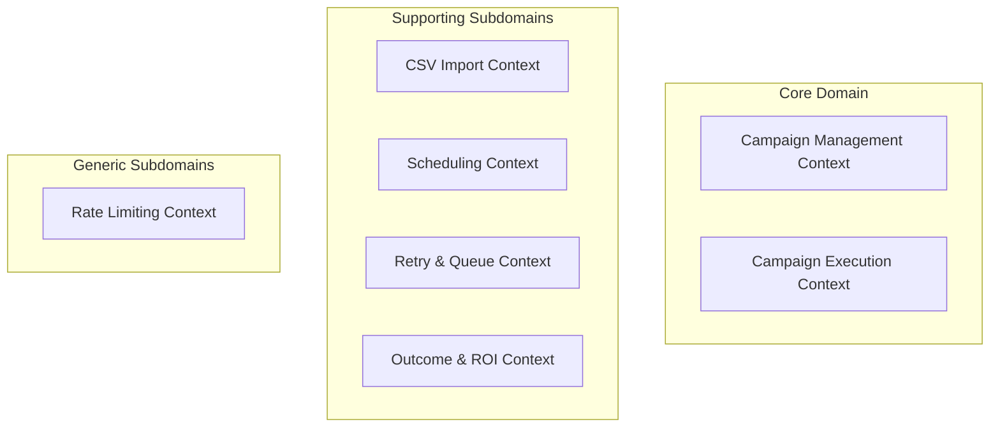

| Context | Classification | Rationale |
|---|---|---|
| **Campaign Management** | **Core Domain** | Creating, configuring, pausing, and cancelling campaigns is the operator's primary control surface. The lifecycle state machine and invariants are bespoke. |
| **Campaign Execution** | **Core Domain** | The execution engine — deciding *which* contact to call *when*, enforcing concurrency, and handling outcomes — is the platform's primary differentiator over manual dialing. |
| **CSV Import** | **Supporting** | Valuable but mechanically straightforward — parse, validate, deduplicate, create CampaignContacts. The complexity is in CRM deduplication (owned by Phase 4C). |
| **Scheduling** | **Supporting** | Scheduling rules (calling windows, timezone, holidays) are important constraints but their logic is well-bounded. |
| **Retry & Queue** | **Supporting** | Retry logic has real business rules (backoff schedule, max attempts, window restrictions) but they are secondary to the campaign lifecycle itself. |
| **Outcome & ROI** | **Supporting** | Aggregating outcomes and computing ROI involves no novel business rules — the complexity is in data aggregation (handled by the read model / CQRS). |
| **Rate Limiting** | **Generic** | Token-bucket rate limiting is a well-understood pattern; the business rules are simple (max N per time window). |

---

## 3. Context Map

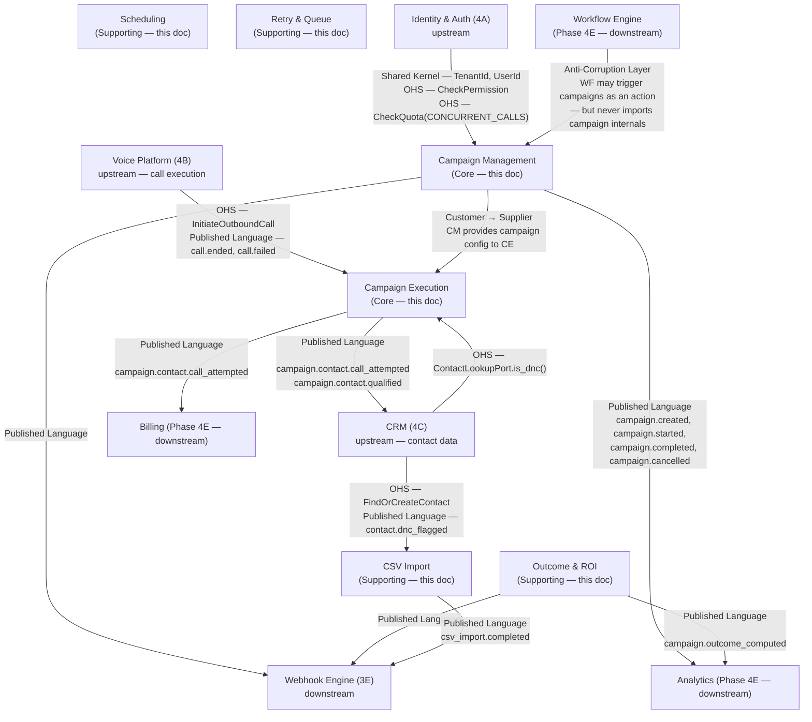

---

## 4. Aggregates

### 4.1 Campaign Aggregate

**Aggregate Root:** `Campaign`

**Rationale for boundary:** the Campaign is the management unit — its configuration, status, scheduling policy, and concurrency policy must all be consistent as a unit. CampaignContacts (which may number in the millions) are a separate aggregate because no operation on the Campaign itself requires loading all its contacts.

```
Campaign (AggregateRoot)
├── CampaignId                  (Value Object — UUIDv7)
├── TenantId                    (Value Object — Phase 4A Shared Kernel)
├── Name                        (Value Object — CampaignName — 1–200 chars)
├── Description                 (Value Object — 0–1000 chars)
├── Status                      (Value Object — CampaignStatus — see §7.1)
├── AgentRef                    (Value Object — AgentId — must be PUBLISHED Agent from Phase 4B)
├── AgentVersionRef             (Value Object — AgentVersionId — pinned at campaign start)
├── PhoneNumberRef              (Value Object — TenantPhoneNumber — from_ number for outbound)
├── ContactListRef              (Value Object — nullable ContactListId — if using a named list)
├── SchedulingPolicy            (Value Object — see §4.1.1)
├── ConcurrencyPolicy           (Value Object — ConcurrencyPolicy — max_concurrent_calls: int)
├── RateLimitPolicy             (Value Object — RateLimitPolicy — max_per_minute: int)
├── RetryPolicy                 (Value Object — RetryPolicy — see §4.1.2)
├── QualificationCriteria       (Value Object — nullable — forwarded to Agent; owned by Phase 4B)
├── TotalContacts               (Value Object — integer — set when contact list is finalised)
├── StartedAt                   (Value Object — nullable datetime)
├── CompletedAt                 (Value Object — nullable datetime)
├── CancelledAt                 (Value Object — nullable datetime)
├── CreatedByRef                (Value Object — UserId)
└── CreatedAt                   (Value Object — datetime)
```

**§4.1.1 SchedulingPolicy (Value Object):**
```
SchedulingPolicy
├── StartAt              (datetime — when the campaign may begin)
├── EndAt                (nullable datetime — hard stop even if contacts remain)
├── Timezone             (IANA timezone string — e.g. "Asia/Kolkata")
├── CallingWindows       (list[CallingWindow] — at least one required)
│   └── CallingWindow
│       ├── DayOfWeek   (set[DayOfWeek] — MON, TUE, ..., SUN)
│       ├── StartTime   (LocalTime — HH:MM)
│       └── EndTime     (LocalTime — HH:MM)
├── HolidayCalendar     (nullable HolidayCalendarRef — country/region code)
└── IsRecurring         (boolean — see §10)
```

**§4.1.2 RetryPolicy (Value Object):**
```
RetryPolicy
├── MaxAttempts          (integer 1–5 — total attempts including first dial)
├── BackoffSchedule      (list[Duration] — wait between attempt N and N+1)
│                        — length must equal MaxAttempts - 1
├── RetryOnOutcomes      (set[CallOutcome] — e.g. {NO_ANSWER, BUSY})
│                        — outcomes that trigger a retry
└── RetryWindowRestricted (boolean — if true, retries only within CallingWindows)
```

**Invariants:**
1. `AgentRef` must reference a PUBLISHED Agent — a campaign cannot be created against a DRAFT or DEPRECATED Agent.
2. `AgentVersionRef` is set when the campaign transitions to RUNNING and is immutable thereafter — mid-campaign Agent publishes do not affect live calls.
3. `ConcurrencyPolicy.max_concurrent_calls` must be ≥ 1 and ≤ the tenant's `CONCURRENT_CALLS` quota.
4. `SchedulingPolicy.CallingWindows` must have at least one window — a campaign with no calling window can never execute.
5. `RetryPolicy.BackoffSchedule` length must equal `MaxAttempts - 1`.
6. `Status` transitions must follow the defined state machine (§7.1).
7. A COMPLETED or CANCELLED Campaign is immutable — no configuration changes are accepted.
8. `TotalContacts` is set once when the contact list is finalised (either by CSV import completion or list attachment) and cannot be changed thereafter.

**Business Rules:**
- A Campaign must have at least one CallingWindow that lies in the future relative to `StartAt` — a campaign whose entire calling schedule has passed cannot be started.
- `EndAt`, if set, must be after `StartAt`.
- `PhoneNumberRef` must belong to the Campaign's Tenant and must be actively provisioned.
- The `AgentVersionRef` snapshot (Phase 4B §5.3) is loaded from the Voice Platform at campaign start and cached for the duration of the campaign.

**Commands:** `CreateCampaign`, `UpdateCampaignConfig`, `AttachContactList`, `ScheduleCampaign`, `StartCampaign`, `PauseCampaign`, `ResumeCampaign`, `StopCampaign`, `CancelCampaign`, `FinalizeCompletion`

**Domain Events:** `CampaignCreated`, `CampaignConfigUpdated`, `ContactListAttached`, `CampaignScheduled`, `CampaignStarted`, `CampaignPaused`, `CampaignResumed`, `CampaignStopping`, `CampaignCompleted`, `CampaignCancelled`, `CampaignFailed`

**Repository:** `CampaignRepository` — tenant-scoped.

**Transaction boundary:** single Campaign aggregate per transaction.

---

### 4.2 CampaignContact Aggregate

**Aggregate Root:** `CampaignContact`

**Rationale for separate aggregate:** a Campaign may have millions of contacts. No Campaign operation requires loading all CampaignContacts at once. Each CampaignContact has its own state machine (dial status, attempt count, outcome) that evolves independently of the Campaign's overall status. Embedding contacts would make the Campaign aggregate impossibly large and all contact-level operations would contend on the same aggregate lock.

```
CampaignContact (AggregateRoot)
├── CampaignContactId           (Value Object — UUIDv7)
├── CampaignRef                 (Value Object — CampaignId — immutable)
├── TenantId                    (Value Object)
├── ContactRef                  (Value Object — ContactId — resolved from phone number)
├── Phone                       (Value Object — E164PhoneNumber — cached for queue use)
├── Status                      (Value Object — ContactStatus — see §7.2)
├── AttemptCount                (Value Object — integer 0–5)
├── MaxAttempts                 (Value Object — copied from Campaign.RetryPolicy at enqueue time)
├── LastAttemptAt               (Value Object — nullable datetime)
├── NextAttemptAt               (Value Object — nullable datetime — set by retry scheduler)
├── Outcome                     (Value Object — nullable CallOutcome)
├── QualificationResult         (Value Object — nullable QualificationResult — from Voice Platform)
├── LeadScoreAtCall             (Value Object — nullable integer — snapshot of score at time of call)
├── CallSessionRefs             (list[CallId] — references to Phase 4B CallIds, max 5)
├── IsDoNotCall                 (Value Object — boolean — mirrors CRM flag at import time)
└── ImportedAt                  (Value Object — datetime)
```

**Invariants:**
1. `AttemptCount` never exceeds `MaxAttempts`.
2. A CampaignContact in a terminal status (`COMPLETED`, `DNC_SKIPPED`, `EXHAUSTED`, `DISQUALIFIED`) accepts no further dial commands.
3. `CallSessionRefs.length` must equal `AttemptCount`.
4. `IsDoNotCall = true` results in immediate `Status = DNC_SKIPPED` — the contact is never enqueued.
5. `NextAttemptAt` must be within the Campaign's SchedulingPolicy's calling windows if `RetryPolicy.RetryWindowRestricted = true`.

**Business Rules:**
- A CampaignContact transitions to `QUALIFIED` when the Voice Platform emits `conversation.qualification_set` with `QUALIFIED` for the associated Call.
- A CampaignContact transitions to `DISQUALIFIED` when the Voice Platform emits `DISQUALIFIED`.
- A CampaignContact transitions to `EXHAUSTED` when `AttemptCount = MaxAttempts` and the last outcome is in `RetryPolicy.RetryOnOutcomes` (i.e., would normally retry, but retries are exhausted).
- A CampaignContact with `Outcome = ANSWERED_COMPLETED` is always `COMPLETED` regardless of qualification — the call was answered and ran to completion.
- `LeadScoreAtCall` is a snapshot taken at the time the call is initiated — it does not update when the CRM recalculates the score post-call.

**Commands:** `EnqueueContact`, `RecordCallAttempt`, `RecordCallOutcome`, `RecordQualificationResult`, `MarkDncSkipped`, `ScheduleRetry`, `MarkExhausted`

**Domain Events:** `ContactEnqueued`, `CallAttemptRecorded`, `CallOutcomeRecorded`, `ContactQualified`, `ContactDisqualified`, `ContactExhausted`, `RetryScheduled`, `DncSkipped`

**Repository:** `CampaignContactRepository` — tenant-scoped; queries by `CampaignRef`, by `Status`, by `NextAttemptAt` range.

---

### 4.3 ContactList Aggregate

**Aggregate Root:** `ContactList`

**Rationale:** a ContactList is a reusable, independently manageable set of contact references. It may be created from a CSV import, a CRM filter snapshot, or manual selection. It is decoupled from any specific Campaign so the same list can be reused across multiple campaigns.

```
ContactList (AggregateRoot)
├── ContactListId               (Value Object — UUIDv7)
├── TenantId                    (Value Object)
├── Name                        (Value Object — 1–200 chars)
├── Source                      (Value Object — ListSource — CSV_IMPORT | CRM_FILTER | MANUAL)
├── ContactCount                (Value Object — integer — set when finalised)
├── Status                      (Value Object — ListStatus — PENDING | BUILDING | READY | FAILED)
├── CsvImportJobRef             (Value Object — nullable CsvImportJobId — for CSV_IMPORT source)
└── CreatedAt                   (Value Object — datetime)
```

**Invariants:**
1. A ContactList in `PENDING` or `BUILDING` status cannot be attached to a Campaign.
2. `ContactCount` is set once when the list transitions to `READY`.
3. A `FAILED` ContactList cannot be attached to a Campaign — it must be rebuilt.

**Commands:** `CreateContactList`, `FinalizeList`
**Domain Events:** `ContactListCreated`, `ContactListReady`, `ContactListFailed`
**Repository:** `ContactListRepository` — tenant-scoped.

---

### 4.4 CsvImportJob Aggregate

**Aggregate Root:** `CsvImportJob`

**Rationale:** CSV import is a long-running background job with its own lifecycle and error tracking. It must be independently queryable for progress and must survive worker crashes (checkpointed in Postgres). Identical to Phase 3C's design but formalised here as a domain aggregate.

```
CsvImportJob (AggregateRoot)
├── CsvImportJobId              (Value Object — UUIDv7)
├── TenantId                    (Value Object)
├── ContactListRef              (Value Object — ContactListId)
├── CampaignRef                 (Value Object — nullable CampaignId — if import is campaign-specific)
├── Status                      (Value Object — ImportStatus — PENDING | PROCESSING | COMPLETED | FAILED)
├── StorageRef                  (Value Object — S3 object path of uploaded CSV)
├── TotalRows                   (Value Object — nullable integer — set after header parse)
├── ProcessedRows               (Value Object — integer — checkpointed per batch)
├── SkippedRows                 (Value Object — integer — invalid / duplicate rows)
├── DncSkippedRows              (Value Object — integer — rows with DNC flag)
├── Errors                      (list[ImportRowError] — capped at 100 — sample of errors)
└── CreatedAt                   (Value Object — datetime)
```

**Invariants:**
1. `ProcessedRows + SkippedRows + DncSkippedRows ≤ TotalRows` (once TotalRows is known).
2. `Errors` list is capped at 100 entries — validation errors beyond 100 are counted but not stored individually.
3. A COMPLETED or FAILED job is immutable.

**Commands:** `CreateImportJob`, `StartProcessing`, `UpdateProgress`, `CompleteImport`, `FailImport`
**Domain Events:** `ImportJobCreated`, `ImportJobStarted`, `ImportJobProgressUpdated`, `ImportJobCompleted`, `ImportJobFailed`
**Repository:** `CsvImportJobRepository` — tenant-scoped.

---

### 4.5 CallJob Aggregate

**Aggregate Root:** `CallJob`

**Rationale:** a CallJob is the transactional unit of work in the Call Queue. It carries its own idempotency key and status so that duplicate processing (from Celery retries or network partitions) can be detected and ignored. It is an intermediate aggregate — created when a CampaignContact is dequeued for dialing, and completed or failed when the call result is received.

```
CallJob (AggregateRoot)
├── CallJobId                   (Value Object — UUIDv7)
├── CampaignRef                 (Value Object — CampaignId)
├── CampaignContactRef          (Value Object — CampaignContactId)
├── TenantId                    (Value Object)
├── Phone                       (Value Object — E164PhoneNumber)
├── AttemptNumber               (Value Object — integer — 1-indexed)
├── IdempotencyKey              (Value Object — deterministic hash: SHA-256(CampaignId + CampaignContactId + AttemptNumber))
├── Status                      (Value Object — JobStatus — PENDING | DISPATCHED | SUCCEEDED | FAILED | SUPERSEDED)
├── CallRef                     (Value Object — nullable CallId — set after Voice Platform accepts the call)
├── DispatchedAt                (Value Object — nullable datetime)
├── CompletedAt                 (Value Object — nullable datetime)
└── FailureReason               (Value Object — nullable string)
```

**Why IdempotencyKey is a domain concept:** the guarantee that the same (Campaign, Contact, AttemptNumber) triple never results in two live concurrent calls is a critical business invariant. A caller should never receive two simultaneous calls from the same campaign for the same attempt. The IdempotencyKey makes this checkable before dispatch — a PENDING or DISPATCHED job with the same key blocks a duplicate.

**Invariants:**
1. At most one CallJob per `IdempotencyKey` may be in `PENDING` or `DISPATCHED` status simultaneously.
2. A `SUCCEEDED` or `FAILED` CallJob is immutable.
3. A `SUPERSEDED` job was displaced by a newer attempt (e.g., manual re-trigger) — treated as terminal.

**Commands:** `CreateCallJob`, `DispatchCallJob`, `CompleteCallJob`, `FailCallJob`
**Domain Events:** `CallJobCreated`, `CallJobDispatched`, `CallJobSucceeded`, `CallJobFailed`
**Repository:** `CallJobRepository` — tenant-scoped; queries by `IdempotencyKey`, by `CampaignContactRef`.

---

### 4.6 CampaignOutcome Aggregate

**Aggregate Root:** `CampaignOutcome`

**Rationale:** the Campaign's aggregate result (counts, rates, cost, ROI) is a derived, read-model-style entity that is computed asynchronously from CampaignContact records after the campaign completes. It is a separate aggregate (not embedded in Campaign) because its computation is expensive and may be recomputed on demand.

```
CampaignOutcome (AggregateRoot)
├── OutcomeId                   (Value Object — UUIDv7)
├── CampaignRef                 (Value Object — CampaignId — one-to-one)
├── TenantId                    (Value Object)
├── ComputedAt                  (Value Object — datetime)
├── TotalContacts               (Value Object — integer)
├── Attempted                   (Value Object — integer)
├── Answered                    (Value Object — integer)
├── NoAnswer                    (Value Object — integer)
├── Busy                        (Value Object — integer)
├── Failed                      (Value Object — integer)
├── Voicemail                   (Value Object — integer)
├── DncSkipped                  (Value Object — integer)
├── Exhausted                   (Value Object — integer)
├── Qualified                   (Value Object — integer)
├── Disqualified                (Value Object — integer)
├── Inconclusive                (Value Object — integer)
├── AnswerRatePct               (Value Object — 0.0–100.0)
├── QualificationRatePct        (Value Object — 0.0–100.0)
├── TotalCallMinutes            (Value Object — Decimal)
├── TotalCost                   (Value Object — Money — sum of telephony + AI costs)
├── EstimatedRevenue            (Value Object — nullable Money — if conversion value configured)
└── RoiPct                      (Value Object — nullable Decimal — (revenue - cost) / cost × 100)
```

**Invariants:**
1. `Attempted = Answered + NoAnswer + Busy + Failed + Voicemail`.
2. `TotalContacts = Attempted + DncSkipped + (contacts never attempted because campaign was cancelled)`.
3. `Qualified + Disqualified + Inconclusive ≤ Answered`.
4. `RoiPct` is null if `EstimatedRevenue` is null (no conversion value configured).

**Commands:** `ComputeOutcome`, `RecomputeOutcome`
**Domain Events:** `CampaignOutcomeComputed`
**Repository:** `CampaignOutcomeRepository` — one outcome per campaign.

---

## 5. Value Objects — Complete Catalogue

| Value Object | Type | Validation |
|---|---|---|
| `CampaignId` | UUIDv7 | Valid UUID |
| `CampaignContactId` | UUIDv7 | Valid UUID |
| `ContactListId` | UUIDv7 | Valid UUID |
| `CsvImportJobId` | UUIDv7 | Valid UUID |
| `CallJobId` | UUIDv7 | Valid UUID |
| `OutcomeId` | UUIDv7 | Valid UUID |
| `CampaignName` | String | 1–200 chars |
| `CampaignStatus` | Enum | §7.1 |
| `ContactStatus` | Enum | §7.2 |
| `ImportStatus` | Enum | `PENDING \| PROCESSING \| COMPLETED \| FAILED` |
| `ListStatus` | Enum | `PENDING \| BUILDING \| READY \| FAILED` |
| `ListSource` | Enum | `CSV_IMPORT \| CRM_FILTER \| MANUAL` |
| `JobStatus` | Enum | `PENDING \| DISPATCHED \| SUCCEEDED \| FAILED \| SUPERSEDED` |
| `CallOutcome` | Enum | Reused from Phase 4B: `ANSWERED_COMPLETED \| ANSWERED_TRANSFERRED \| NO_ANSWER \| VOICEMAIL \| FAILED \| CANCELLED` |
| `QualificationResult` | Compound | `(status: QUALIFIED \| DISQUALIFIED \| INCONCLUSIVE, reason: string)` |
| `CallingWindow` | Compound | `(days: set[DayOfWeek], start_time: LocalTime, end_time: LocalTime)` |
| `DayOfWeek` | Enum | `MON \| TUE \| WED \| THU \| FRI \| SAT \| SUN` |
| `LocalTime` | String | `HH:MM` 24-hr |
| `ConcurrencyPolicy` | Compound | `(max_concurrent_calls: int ≥ 1)` |
| `RateLimitPolicy` | Compound | `(max_per_minute: int ≥ 1, window_seconds: int = 60)` |
| `RetryPolicy` | Compound | `(max_attempts: 1–5, backoff_schedule: list[Duration], retry_on_outcomes: set[CallOutcome], window_restricted: bool)` |
| `SchedulingPolicy` | Compound | `(start_at, end_at, timezone, calling_windows, holiday_calendar, is_recurring)` |
| `IdempotencyKey` | String | SHA-256 hex digest (64 chars) |
| `ImportRowError` | Compound | `(row_number: int, reason: string)` |
| `ImportRowResult` | Compound | `(row_number: int, contact_id: ContactId \| None, status: CREATED \| EXISTING \| INVALID \| DNC)` |
| `Money` | Compound | Reused from Phase 4A Shared Kernel |
| `E164PhoneNumber` | String | Reused from Phase 4B |
| `TenantPhoneNumber` | Compound | Reused from Phase 4B |

---

## 6. Domain Services

### 6.1 CallingWindowService

```python
class CallingWindowService:
    """
    Determines whether the current moment (in the campaign's configured timezone)
    falls within any of the Campaign's CallingWindows.

    Also computes when the next window opens (for scheduling the next executor tick).

    Pure function — receives policy and current datetime.
    """
    def is_within_window(
        self,
        policy: SchedulingPolicy,
        now: datetime,
    ) -> bool: ...

    def next_window_start(
        self,
        policy: SchedulingPolicy,
        from_dt: datetime,
    ) -> datetime | None:
        """Returns None if no future window exists (campaign schedule exhausted)."""
        ...
```

**Why a domain service:** calling window evaluation is a business rule (organisational compliance with calling hours regulations — `NFR-COMPLY-001`). It belongs in the domain, not in APScheduler configuration. The infrastructure scheduler reads the result of this pure function to decide when to trigger the next tick — it does not embed the evaluation logic.

### 6.2 RetrySchedulerService

```python
class RetrySchedulerService:
    """
    Computes the next_attempt_at for a CampaignContact given the RetryPolicy.

    Rules:
    - next_attempt_at = now + backoff_schedule[attempt_count - 1]
    - If RetryPolicy.RetryWindowRestricted = True:
      next_attempt_at is advanced to the start of the next CallingWindow
      if the computed time falls outside all windows.
    - Returns None if attempt_count >= max_attempts (caller transitions to EXHAUSTED).
    """
    def compute_next_attempt(
        self,
        contact: CampaignContact,
        policy: RetryPolicy,
        scheduling: SchedulingPolicy,
        now: datetime,
    ) -> datetime | None: ...
```

### 6.3 ConcurrencyEnforcementService

```python
class ConcurrencyEnforcementService:
    """
    Checks whether a Campaign may dispatch another call given:
    - Current live call count for this campaign (from Redis counter)
    - ConcurrencyPolicy.max_concurrent_calls
    - Tenant-wide CONCURRENT_CALLS quota (from Phase 4A QuotaEnforcementService)

    Pure function — receives pre-loaded counters.
    Returns ConcurrencyDecision(allowed: bool, current: int, limit: int).
    """
    def check(
        self,
        current_campaign_live_calls: int,
        policy: ConcurrencyPolicy,
        tenant_quota_result: QuotaCheckResult,
    ) -> ConcurrencyDecision: ...
```

**Why both campaign-level and tenant-level:** Phase 4A's `QuotaEnforcementService` enforces the tenant-wide ceiling (e.g., max 100 concurrent calls for this plan tier). The `CampaignConcurrencyPolicy` is a per-campaign sub-ceiling (e.g., this campaign runs at most 20 concurrent calls). Both must be satisfied simultaneously.

### 6.4 CampaignOutcomeComputationService

```python
class CampaignOutcomeComputationService:
    """
    Reads all CampaignContact records for a Campaign and aggregates them
    into a CampaignOutcome value.

    Pure in intent — but requires repository access, so implemented as
    an Application Service calling this Domain Service's computation logic.
    """
    def compute(
        self,
        contacts: list[CampaignContact],
        total_cost: Money,
        estimated_conversion_value: Money | None,
    ) -> CampaignOutcome: ...
```

### 6.5 ImportRowValidationService

```python
class ImportRowValidationService:
    """
    Validates a single CSV row before processing.
    Returns (valid: bool, errors: list[str]).

    Rules validated:
    - Phone number is present and parseable to E.164
    - Required campaign-defined columns are present
    - Column values pass type constraints (date, number, etc.)
    Does NOT check DNC (that is a CRM lookup, done by the application service).
    Pure function — no I/O.
    """
    def validate(self, row: dict, required_columns: list[str]) -> ImportRowValidationResult: ...
```

---

## 7. State Machines

### 7.1 Campaign Lifecycle

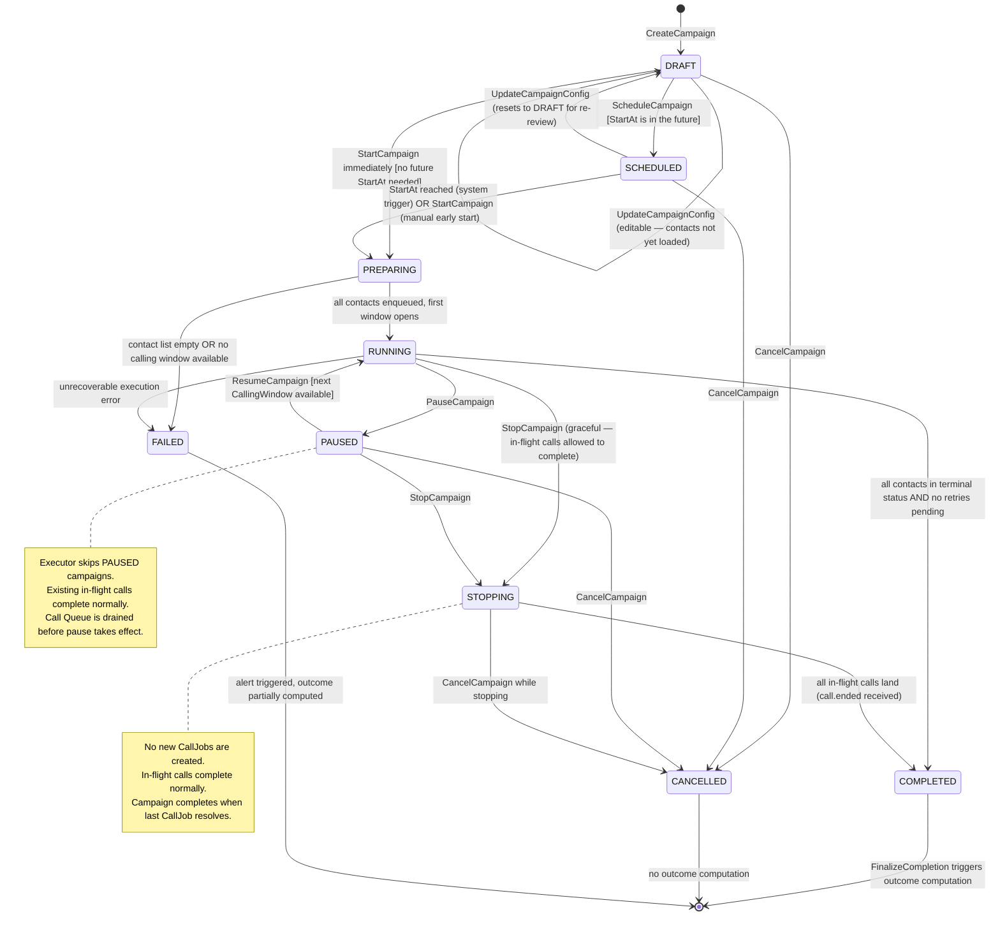

**Transition Guards:**
- `DRAFT → SCHEDULED`: `StartAt` must be in the future; contact list must be attached and READY.
- `SCHEDULED → PREPARING`: triggered by APScheduler when `StartAt` is reached (system-driven, no human command needed).
- `PREPARING → RUNNING`: all CampaignContacts are created from the ContactList; at least one CallingWindow is currently open or opens within 24 hours.
- `RUNNING → COMPLETED`: checked by executor at the end of each tick — all CampaignContacts are in terminal status (`COMPLETED`, `EXHAUSTED`, `DNC_SKIPPED`, `DISQUALIFIED`, `QUALIFIED`).
- `PAUSED → RUNNING`: next CallingWindow must be available; tenant quota must not be exceeded.
- `STOPPING → COMPLETED`: no PENDING or DISPATCHED CallJobs remain.

### 7.2 CampaignContact Lifecycle

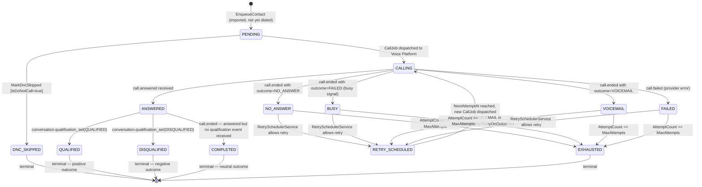

### 7.3 CallJob Lifecycle

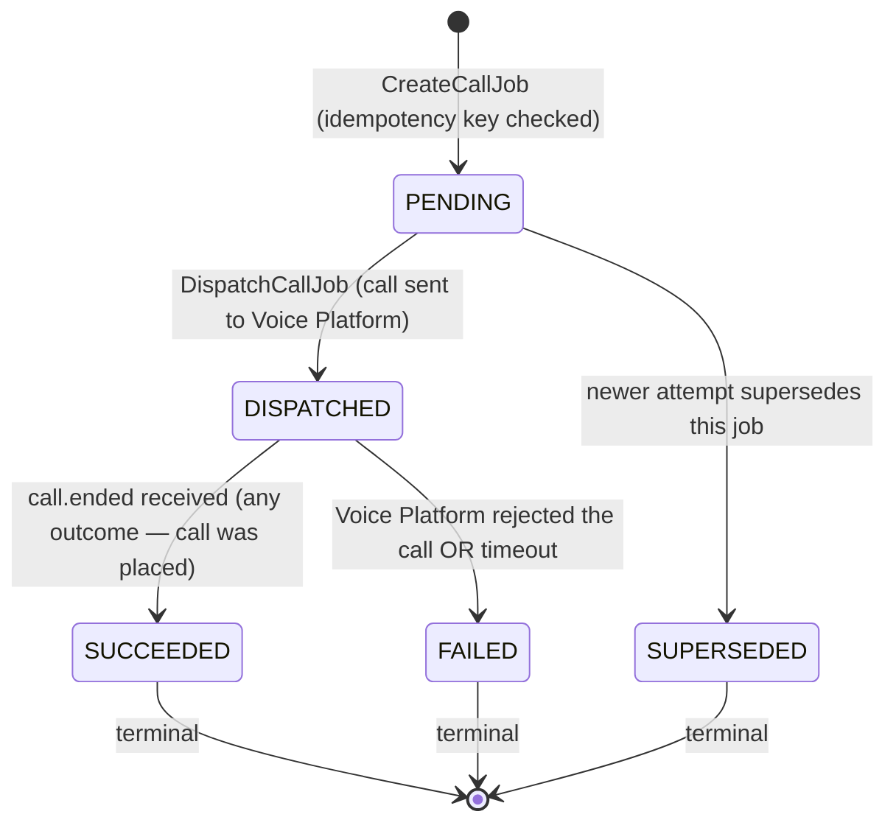

---

## 8. Policies

| Policy | Enforces |
|---|---|
| `AgentMustBePublished` | Campaign cannot reference a DRAFT or DEPRECATED Agent |
| `ContactListMustBeReady` | Campaign cannot be scheduled until its ContactList is READY |
| `ConcurrencyWithinQuota` | `ConcurrencyEnforcementService.check()` before each CallJob dispatch |
| `WithinCallingWindow` | `CallingWindowService.is_within_window()` checked at every executor tick |
| `NoDuplicateCallJob` | IdempotencyKey checked before creating a new CallJob |
| `DNCContactSkipped` | `IsDoNotCall = true` → `DNC_SKIPPED` immediately at enqueue |
| `RetryOnlyOnEligibleOutcomes` | `CallOutcome ∈ RetryPolicy.RetryOnOutcomes` required to schedule retry |
| `NoNewJobsWhileStopping` | Campaign in STOPPING state produces no new CallJobs |
| `RequiresPermission(permission)` | Authorization OHS from Phase 4A — all write commands |
| `PhoneNumberBelongsToTenant` | `PhoneNumberRef` must be a provisioned number for this Tenant |
| `EndAtNotExceeded` | If `SchedulingPolicy.EndAt` has passed, campaign transitions to COMPLETED even if contacts remain |

---

## 9. Specifications

```python
class RunnableCampaignSpecification(Specification[Campaign]):
    def is_satisfied_by(self, campaign: Campaign) -> bool:
        return campaign.status == CampaignStatus.RUNNING

class RetryEligibleContactSpecification(Specification[CampaignContact]):
    def __init__(self, retry_policy: RetryPolicy) -> None:
        self._policy = retry_policy
    def is_satisfied_by(self, contact: CampaignContact) -> bool:
        return (
            contact.status == ContactStatus.RETRY_SCHEDULED
            and contact.attempt_count < contact.max_attempts
            and contact.outcome in self._policy.retry_on_outcomes
        )

class DueForRetrySpecification(Specification[CampaignContact]):
    def __init__(self, now: datetime) -> None:
        self._now = now
    def is_satisfied_by(self, contact: CampaignContact) -> bool:
        return (
            contact.status == ContactStatus.RETRY_SCHEDULED
            and contact.next_attempt_at is not None
            and contact.next_attempt_at <= self._now
        )

class TerminalCampaignContactSpecification(Specification[CampaignContact]):
    TERMINAL_STATUSES = frozenset({
        ContactStatus.QUALIFIED, ContactStatus.DISQUALIFIED, ContactStatus.COMPLETED,
        ContactStatus.EXHAUSTED, ContactStatus.DNC_SKIPPED,
    })
    def is_satisfied_by(self, contact: CampaignContact) -> bool:
        return contact.status in self.TERMINAL_STATUSES
```

---

## 10. Scheduling — Detail

### 10.1 One-Time vs. Recurring Campaigns

| Campaign type | `IsRecurring` | `EndAt` | Behaviour |
|---|---|---|---|
| Immediate | false | null | Starts when manually triggered; ends when contacts exhausted |
| Scheduled one-time | false | optional | Starts at `StartAt`; ends when contacts exhausted or `EndAt` reached |
| Recurring | true | required | Restarts automatically on a new cycle; contact list is reloaded per cycle |

**Recurring campaign mechanics** are intentionally minimal in this DDD document: the `IsRecurring` flag exists on `SchedulingPolicy`; the full recurrence rule (e.g., "run every Monday at 09:00, reload the contact list from the same CRM filter") is an open question (OQ-4D-03) to be resolved before Phase 4E.

### 10.2 Timezone Enforcement

The `CallingWindowService` always converts `now` to the `SchedulingPolicy.Timezone` before evaluating windows. The platform stores all datetimes in UTC and converts only for window evaluation — a common source of bugs that the domain service's interface makes explicit.

### 10.3 Holiday Calendar

`HolidayCalendarRef` is a reference to a platform-maintained list of national/regional public holidays. On a holiday, no `CallingWindow` is active regardless of the window definition. Holiday calendars are a generic subdomain concern — they are immutable reference data, not campaign-specific configuration.

---

## 11. Domain Events — Full Catalogue

### 11.1 Campaign Events

| Event | Key Payload Fields | Consumed by |
|---|---|---|
| `campaign.created` | `campaign_id, tenant_id, name, agent_id` | Audit, Analytics |
| `campaign.config_updated` | `campaign_id, changed_fields` | Audit |
| `campaign.scheduled` | `campaign_id, start_at, end_at` | Audit, Analytics |
| `campaign.started` | `campaign_id, agent_version_id, total_contacts` | Audit, Analytics, Billing (start cost tracking) |
| `campaign.paused` | `campaign_id, paused_by, paused_at` | Audit, Analytics, Webhook |
| `campaign.resumed` | `campaign_id, resumed_by, resumed_at` | Audit, Analytics |
| `campaign.stopping` | `campaign_id, initiated_by` | Audit |
| `campaign.completed` | `campaign_id, completed_at, total_contacts, attempted` | Audit, Analytics, Billing, Webhook |
| `campaign.cancelled` | `campaign_id, cancelled_by, cancelled_at` | Audit, Analytics, Billing (finalise) |
| `campaign.failed` | `campaign_id, failure_reason` | Audit, Analytics, Webhook, Alert |

### 11.2 CampaignContact Events

| Event | Key Payload Fields | Consumed by |
|---|---|---|
| `campaign.contact.enqueued` | `campaign_id, contact_id, phone, attempt_number` | Audit |
| `campaign.contact.dnc_skipped` | `campaign_id, contact_id, phone` | Audit, Analytics |
| `campaign.contact.call_attempted` | `campaign_id, contact_id, call_id, attempt_number, outcome` | CRM (record Activity), Analytics, Billing |
| `campaign.contact.qualified` | `campaign_id, contact_id, call_id, qualification_reason` | CRM (qualify lead), Analytics, Webhook |
| `campaign.contact.disqualified` | `campaign_id, contact_id, call_id, reason` | CRM, Analytics |
| `campaign.contact.retry_scheduled` | `campaign_id, contact_id, next_attempt_at, attempt_count` | Audit, Analytics |
| `campaign.contact.exhausted` | `campaign_id, contact_id, total_attempts` | Audit, Analytics |

### 11.3 Import Events

| Event | Key Payload Fields | Consumed by |
|---|---|---|
| `import.job_created` | `job_id, tenant_id, campaign_ref, list_ref` | Audit |
| `import.job_completed` | `job_id, total_rows, processed_rows, skipped, dnc_skipped` | Audit, ContactList (→ READY), Webhook |
| `import.job_failed` | `job_id, failure_reason, processed_rows` | Audit, Webhook |

### 11.4 Outcome Events

| Event | Key Payload Fields | Consumed by |
|---|---|---|
| `campaign.outcome_computed` | `campaign_id, qualified, disqualified, answer_rate_pct, roi_pct, total_cost` | Audit, Analytics, Billing, Webhook |

---

## 12. Commands — Full Catalogue

### 12.1 Campaign Commands

```python
@dataclass(frozen=True)
class CreateCampaign:
    command_id: UUIDv7
    tenant_id: TenantId
    name: str
    description: str
    agent_id: AgentId
    phone_number_ref: TenantPhoneNumber
    scheduling_policy: SchedulingPolicy
    concurrency_policy: ConcurrencyPolicy
    rate_limit_policy: RateLimitPolicy
    retry_policy: RetryPolicy
    qualification_criteria: dict | None
    created_by: UserId

@dataclass(frozen=True)
class AttachContactList:
    command_id: UUIDv7
    campaign_id: CampaignId
    tenant_id: TenantId
    contact_list_id: ContactListId
    attached_by: UserId

@dataclass(frozen=True)
class ScheduleCampaign:
    command_id: UUIDv7
    campaign_id: CampaignId
    tenant_id: TenantId
    start_at: datetime
    scheduled_by: UserId

@dataclass(frozen=True)
class StartCampaign:
    command_id: UUIDv7
    campaign_id: CampaignId
    tenant_id: TenantId
    started_by: UserId

@dataclass(frozen=True)
class PauseCampaign:
    command_id: UUIDv7
    campaign_id: CampaignId
    tenant_id: TenantId
    paused_by: UserId

@dataclass(frozen=True)
class ResumeCampaign:
    command_id: UUIDv7
    campaign_id: CampaignId
    tenant_id: TenantId
    resumed_by: UserId

@dataclass(frozen=True)
class StopCampaign:
    command_id: UUIDv7
    campaign_id: CampaignId
    tenant_id: TenantId
    stopped_by: UserId

@dataclass(frozen=True)
class CancelCampaign:
    command_id: UUIDv7
    campaign_id: CampaignId
    tenant_id: TenantId
    cancelled_by: UserId
    reason: str
```

### 12.2 CampaignContact Commands

```python
@dataclass(frozen=True)
class EnqueueContact:
    command_id: UUIDv7
    campaign_id: CampaignId
    tenant_id: TenantId
    contact_ref: ContactId
    phone: E164PhoneNumber
    is_dnc: bool
    lead_score_snapshot: int | None

@dataclass(frozen=True)
class RecordCallAttempt:
    command_id: UUIDv7
    campaign_contact_id: CampaignContactId
    call_id: CallId
    attempt_number: int

@dataclass(frozen=True)
class RecordCallOutcome:
    command_id: UUIDv7
    campaign_contact_id: CampaignContactId
    call_id: CallId
    outcome: CallOutcome

@dataclass(frozen=True)
class RecordQualificationResult:
    command_id: UUIDv7
    campaign_contact_id: CampaignContactId
    result: QualificationResult

@dataclass(frozen=True)
class ScheduleRetry:
    command_id: UUIDv7
    campaign_contact_id: CampaignContactId
    next_attempt_at: datetime
```

### 12.3 Import Commands

```python
@dataclass(frozen=True)
class CreateImportJob:
    command_id: UUIDv7
    tenant_id: TenantId
    contact_list_id: ContactListId
    campaign_ref: CampaignId | None
    storage_ref: str          # S3 path of uploaded CSV
    created_by: UserId

@dataclass(frozen=True)
class UpdateImportProgress:
    command_id: UUIDv7
    job_id: CsvImportJobId
    processed_rows: int
    skipped_rows: int
    dnc_skipped_rows: int
    errors: list[ImportRowError]
```

---

## 13. Queries — Full Catalogue

```python
# Campaigns
GetCampaign(campaign_id: CampaignId, tenant_id: TenantId) -> CampaignDTO
ListCampaigns(tenant_id: TenantId, status: CampaignStatus | None, page: Page) -> Page[CampaignSummaryDTO]
GetCampaignProgress(campaign_id: CampaignId, tenant_id: TenantId) -> CampaignProgressDTO
    # returns: status counts (pending, calling, completed, exhausted, etc.) + live call count

# CampaignContacts
ListCampaignContacts(campaign_id: CampaignId, tenant_id: TenantId,
                     status: ContactStatus | None, page: Page) -> Page[CampaignContactDTO]
GetCampaignContact(cc_id: CampaignContactId, tenant_id: TenantId) -> CampaignContactDTO

# Import
GetImportJob(job_id: CsvImportJobId, tenant_id: TenantId) -> ImportJobDTO
ListImportJobs(tenant_id: TenantId, page: Page) -> Page[ImportJobSummaryDTO]

# Outcomes
GetCampaignOutcome(campaign_id: CampaignId, tenant_id: TenantId) -> CampaignOutcomeDTO
CompareCampaignOutcomes(campaign_ids: list[CampaignId], tenant_id: TenantId) -> list[CampaignOutcomeDTO]

# Queue state (operational)
GetCampaignQueueDepth(campaign_id: CampaignId, tenant_id: TenantId) -> QueueDepthDTO
    # reads from Redis — not PostgreSQL
GetLiveCampaignConcurrency(campaign_id: CampaignId, tenant_id: TenantId) -> int
    # reads from Redis concurrency counter
```

---

## 14. Application Services

### 14.1 CampaignApplicationService

```python
class CampaignApplicationService:
    async def create_campaign(self, cmd: CreateCampaign) -> CampaignId:
        # 1. Policy: RequiresPermission("campaign:create")
        # 2. Policy: AgentMustBePublished — load Agent from AgentRepository
        # 3. Policy: PhoneNumberBelongsToTenant
        # 4. CampaignFactory.create(cmd)
        # 5. UoW: save Campaign, publish CampaignCreated

    async def start_campaign(self, cmd: StartCampaign) -> None:
        # 1. Policy: RequiresPermission("campaign:start")
        # 2. Load Campaign — verify DRAFT or SCHEDULED status
        # 3. Policy: ContactListMustBeReady
        # 4. Load AgentVersionRef from Voice Platform's published agent
        # 5. Campaign.start(agent_version_ref) → PREPARING
        # 6. Enqueue: PrepareCampaignContacts Celery task (async bulk creation)
        # 7. UoW: save Campaign, publish CampaignStarted

    async def handle_campaign_completion_check(self, campaign_id: CampaignId) -> None:
        # Called by executor after each tick if status = STOPPING
        # Also checked periodically for RUNNING campaigns
        # 1. Load Campaign
        # 2. Check: any PENDING or DISPATCHED CallJobs? Any non-terminal CampaignContacts?
        # 3. If all terminal: Campaign.complete() → COMPLETED
        # 4. Enqueue: ComputeCampaignOutcome Celery task
```

### 14.2 CampaignExecutorService (Application Service — not Celery task)

```python
class CampaignExecutorService:
    """
    The domain-facing interface of the executor tick.
    The Celery task calls this service; domain logic stays here.
    """
    async def execute_tick(self, campaign_id: CampaignId) -> TickResult:
        # 1. Load Campaign — verify RUNNING
        # 2. CallingWindowService.is_within_window(policy, now)
        #    → if outside window, return TickResult(calls_dispatched=0)
        # 3. Pop due retries from Retry Queue (Redis sorted set)
        #    → push to Call Queue (Redis list)
        # 4. Load current concurrency counter from Redis
        # 5. Load tenant quota result from QuotaEnforcementService
        # 6. While queue non-empty AND ConcurrencyEnforcementService.check() = allowed:
        #    a. Pop next CampaignContactId from Call Queue
        #    b. Load CampaignContact
        #    c. IdempotencyKey check — skip if PENDING/DISPATCHED job exists
        #    d. Create CallJob (CreateCallJob command)
        #    e. DispatchCallJob → call Voice Platform's InitiateOutboundCallUseCase
        #    f. Increment Redis concurrency counter
        # 7. Return TickResult(calls_dispatched=N, queue_remaining=M)
```

### 14.3 CsvImportApplicationService

```python
class CsvImportApplicationService:
    async def process_import_batch(self, job_id: CsvImportJobId, rows: list[dict]) -> None:
        # 1. ImportRowValidationService.validate(row) for each row
        # 2. ContactLookupPort.is_dnc(phone) for each valid row
        # 3. FindOrCreateContact (CRM use case) for each valid, non-DNC row
        # 4. EnqueueContact (CampaignContact created) for each resolved contact
        # 5. UpdateImportProgress checkpoint every 500 rows
        # This method is called in batches by the Celery worker
```

---

## 15. Celery / Redis Domain Boundary

This section directly addresses the prompt's question: what belongs in the domain, application, infrastructure, Celery, and Redis respectively.

### 15.1 Domain Layer Responsibilities

- **Business rules** about when a campaign may run (calling windows, status transitions, invariants).
- **Retry policy evaluation** — whether a contact is eligible for retry and when.
- **Concurrency policy enforcement** logic — the pure scoring/checking function.
- **Idempotency key derivation** — it is a deterministic domain rule, not an infrastructure detail.
- **State machine transition logic** — Campaign and CampaignContact lifecycle.
- All **Domain Events** and **Commands** definitions.

**The domain never imports Celery, Redis, or any infrastructure primitive.**

### 15.2 Application Layer Responsibilities

- Orchestrates commands: loads aggregates, calls domain services, saves via repositories, publishes events.
- `CampaignExecutorService.execute_tick()` — coordinates the tick's operations using domain services and ports.
- `CsvImportApplicationService.process_import_batch()` — calls domain validation, then CRM port, then CampaignContact commands.
- Calls `QuotaEnforcementService` (Phase 4A OHS) before dispatching calls.
- Reads from Redis (concurrency counter, queue depth) via infrastructure ports — never directly imports `redis.py`.

### 15.3 Infrastructure Layer Responsibilities

- **Redis implementation** of `CallQueue` (Redis List) and `RetryQueue` (Redis Sorted Set).
- **Redis concurrency counter** (`campaign:concurrency:{tenant_id}:{campaign_id}`): INCR/DECR operations.
- **Celery task definitions**: thin shells that call the appropriate Application Service method, handle Celery-specific retry configuration, and emit task-level telemetry.
- **APScheduler job**: triggers the executor tick — it calls the Application Service, not domain logic directly.

### 15.4 Celery Responsibilities (Infrastructure — explicit)

| Celery Task | Application Service it calls | Domain logic it does NOT contain |
|---|---|---|
| `prepare_campaign_contacts_task(campaign_id)` | `CampaignApplicationService.prepare_contacts()` | Contact validation, DNC check |
| `execute_campaign_tick_task(campaign_id)` | `CampaignExecutorService.execute_tick()` | Window evaluation, concurrency check |
| `process_csv_import_batch_task(job_id, rows)` | `CsvImportApplicationService.process_import_batch()` | Row validation, deduplication |
| `compute_campaign_outcome_task(campaign_id)` | `CampaignApplicationService.compute_outcome()` | Outcome aggregation |
| `check_campaign_completion_task(campaign_id)` | `CampaignApplicationService.handle_campaign_completion_check()` | Terminal status evaluation |

**The golden rule:** a Celery task is allowed to do three things: (a) deserialize its arguments, (b) call one Application Service method, (c) handle Celery-specific errors (acks_late, max_retries). If it does more, it is carrying domain or application logic that does not belong there.

### 15.5 Redis Responsibilities (Infrastructure — explicit)

| Redis Key Pattern | Purpose | Owned by |
|---|---|---|
| `campaign:queue:{tenant_id}:{campaign_id}` | Call Queue (RPUSH / BLPOP) — CampaignContactIds ready to dial | Campaign Execution Infrastructure |
| `campaign:retry_queue:{tenant_id}:{campaign_id}` | Retry Queue (ZADD / ZRANGEBYSCORE) — scored by `next_attempt_at` unix timestamp | Campaign Execution Infrastructure |
| `campaign:concurrency:{tenant_id}:{campaign_id}` | Live call count (INCR on dispatch, DECR on call.ended) | Campaign Execution Infrastructure |
| `campaign:lock:{campaign_id}` | Distributed lock preventing concurrent executor ticks for the same campaign | Campaign Execution Infrastructure |
| `import:progress:{job_id}` | Live progress counter (INCR per processed row) — polled by frontend | CSV Import Infrastructure |

**None of these keys carry domain state.** If Redis were wiped, all authoritative state would be reconstructable from PostgreSQL. The Redis Retry Queue is the only case where loss could cause contacts to miss their retry window — mitigated by the periodic reconciliation task (§17 Sequence Diagrams, §18 Risks).

### 15.6 Domain / Infrastructure Boundary Diagram

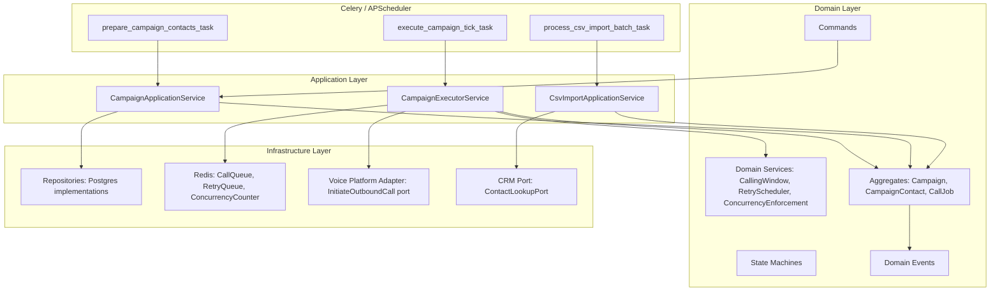

---

## 16. Repositories — Interface Definitions

```python
class CampaignRepository(Protocol):
    async def get_by_id(self, campaign_id: CampaignId, tenant_id: TenantId) -> Campaign | None: ...
    async def find_by_status(self, tenant_id: TenantId, status: CampaignStatus) -> list[Campaign]: ...
    async def find_due_for_start(self, now: datetime) -> list[Campaign]: ...  # SCHEDULED, StartAt <= now
    async def save(self, campaign: Campaign) -> None: ...

class CampaignContactRepository(Protocol):
    async def get_by_id(self, cc_id: CampaignContactId, tenant_id: TenantId) -> CampaignContact | None: ...
    async def find_by_campaign(self, campaign_id: CampaignId, tenant_id: TenantId,
                                status: ContactStatus | None, page: Page) -> Page[CampaignContact]: ...
    async def count_by_status(self, campaign_id: CampaignId, tenant_id: TenantId) -> dict[ContactStatus, int]: ...
    async def find_due_for_retry(self, campaign_id: CampaignId, tenant_id: TenantId,
                                  now: datetime) -> list[CampaignContact]: ...
    async def save(self, contact: CampaignContact) -> None: ...

class ContactListRepository(Protocol):
    async def get_by_id(self, list_id: ContactListId, tenant_id: TenantId) -> ContactList | None: ...
    async def save(self, contact_list: ContactList) -> None: ...

class CsvImportJobRepository(Protocol):
    async def get_by_id(self, job_id: CsvImportJobId, tenant_id: TenantId) -> CsvImportJob | None: ...
    async def save(self, job: CsvImportJob) -> None: ...

class CallJobRepository(Protocol):
    async def get_by_idempotency_key(self, key: IdempotencyKey, tenant_id: TenantId) -> CallJob | None: ...
    async def find_by_campaign_contact(self, cc_id: CampaignContactId, tenant_id: TenantId) -> list[CallJob]: ...
    async def count_active(self, campaign_id: CampaignId, tenant_id: TenantId) -> int: ...
    async def save(self, job: CallJob) -> None: ...

class CampaignOutcomeRepository(Protocol):
    async def get_by_campaign(self, campaign_id: CampaignId, tenant_id: TenantId) -> CampaignOutcome | None: ...
    async def save(self, outcome: CampaignOutcome) -> None: ...
```

---

## 17. Sequence Diagrams

### 17.1 CSV Import

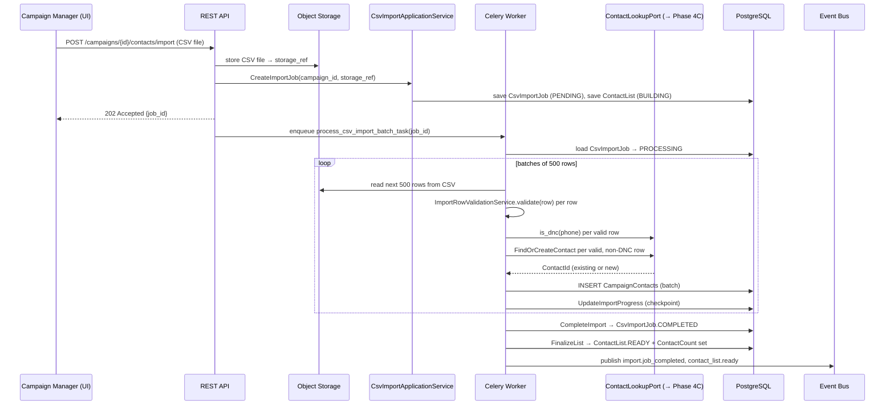

### 17.2 Campaign Creation

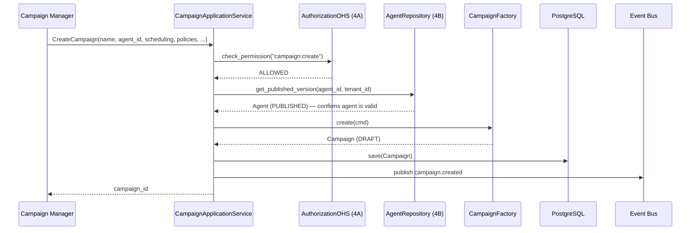

### 17.3 Campaign Scheduling and Start

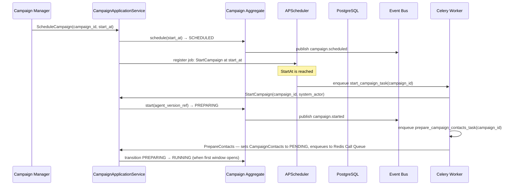

### 17.4 Campaign Execution Tick

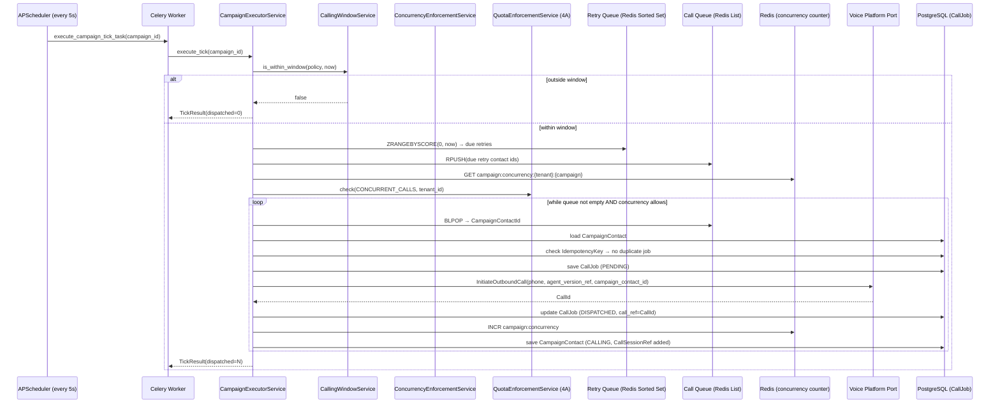

### 17.5 Call Outcome and Retry

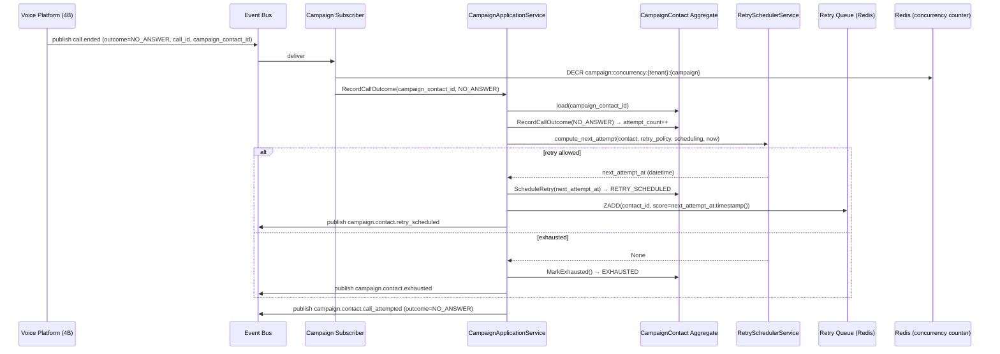

### 17.6 Campaign Pause

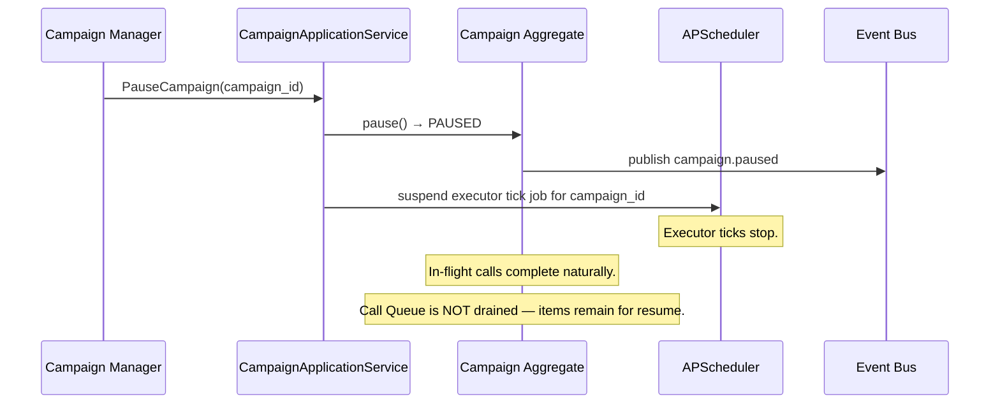

### 17.7 Campaign Resume

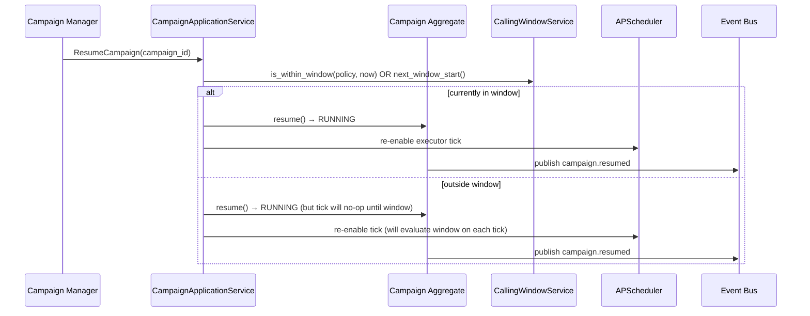

### 17.8 Campaign Completion

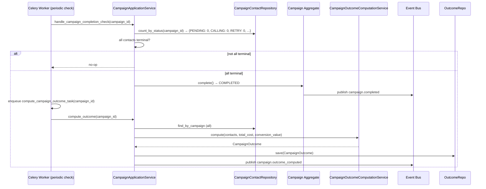

### 17.9 Lead Qualification Within Campaign

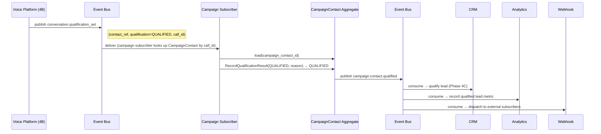

### 17.10 Campaign ROI Calculation

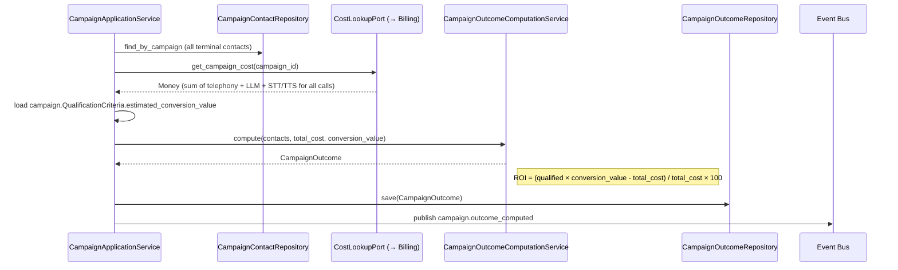

### 17.11 CSV Import with DNC Skipping

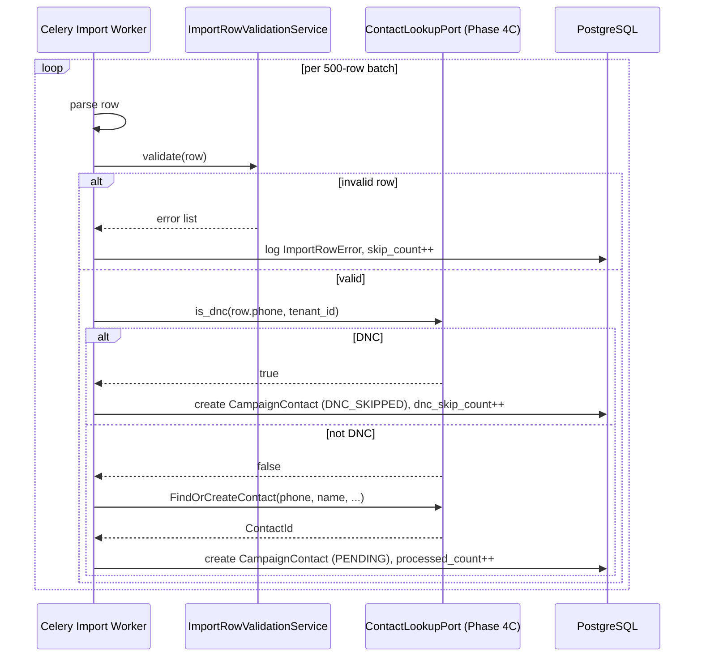

---

## 18. Domain Package Structure

```text
modules/
├── campaign_management/             # Campaign Management Context
│   ├── domain/
│   │   ├── aggregates/
│   │   │   └── campaign.py          # Campaign AggregateRoot
│   │   ├── value_objects/
│   │   │   ├── identifiers.py       # CampaignId
│   │   │   ├── campaign_status.py   # CampaignStatus + transition table
│   │   │   ├── campaign_name.py
│   │   │   ├── scheduling_policy.py # SchedulingPolicy, CallingWindow, DayOfWeek, LocalTime
│   │   │   ├── concurrency_policy.py
│   │   │   ├── rate_limit_policy.py
│   │   │   └── retry_policy.py
│   │   ├── events/campaign_events.py
│   │   ├── commands/campaign_commands.py
│   │   ├── factories/campaign_factory.py
│   │   ├── policies/campaign_policies.py
│   │   └── specifications/campaign_specifications.py
│   ├── application/
│   │   ├── use_cases/
│   │   │   ├── create_campaign.py
│   │   │   ├── schedule_campaign.py
│   │   │   ├── start_campaign.py
│   │   │   ├── pause_campaign.py
│   │   │   ├── resume_campaign.py
│   │   │   ├── stop_campaign.py
│   │   │   └── cancel_campaign.py
│   │   ├── queries/
│   │   │   ├── get_campaign.py
│   │   │   └── list_campaigns.py
│   │   └── ports/
│   │       ├── campaign_repository.py
│   │       └── agent_lookup_port.py   # reads Agent from Phase 4B
│   ├── infrastructure/
│   │   ├── models.py
│   │   └── repositories/sqlalchemy_campaign_repository.py
│   └── interface/
│       ├── rest/router.py
│       └── events/subscribers.py
│
├── campaign_execution/              # Campaign Execution Context
│   ├── domain/
│   │   ├── aggregates/
│   │   │   ├── campaign_contact.py  # CampaignContact AggregateRoot
│   │   │   └── call_job.py          # CallJob AggregateRoot
│   │   ├── value_objects/
│   │   │   ├── identifiers.py       # CampaignContactId, CallJobId, IdempotencyKey
│   │   │   ├── contact_status.py    # ContactStatus + transition table
│   │   │   ├── job_status.py
│   │   │   ├── call_outcome.py      # Reuses Phase 4B value object
│   │   │   └── qualification_result.py
│   │   ├── events/execution_events.py
│   │   ├── commands/execution_commands.py
│   │   ├── services/
│   │   │   ├── calling_window_service.py
│   │   │   ├── retry_scheduler_service.py
│   │   │   └── concurrency_enforcement_service.py
│   │   └── specifications/execution_specifications.py
│   ├── application/
│   │   ├── use_cases/
│   │   │   ├── enqueue_contact.py
│   │   │   ├── record_call_attempt.py
│   │   │   ├── record_call_outcome.py
│   │   │   ├── record_qualification_result.py
│   │   │   ├── schedule_retry.py
│   │   │   └── mark_exhausted.py
│   │   ├── services/
│   │   │   └── campaign_executor_service.py
│   │   ├── queries/
│   │   │   ├── get_campaign_progress.py
│   │   │   └── list_campaign_contacts.py
│   │   └── ports/
│   │       ├── campaign_contact_repository.py
│   │       ├── call_job_repository.py
│   │       ├── outbound_call_port.py       # → Phase 4B InitiateOutboundCallUseCase
│   │       ├── contact_lookup_port.py      # → Phase 4C FindOrCreateContact + is_dnc()
│   │       └── call_queue_port.py          # Redis-backed queue operations
│   ├── infrastructure/
│   │   ├── models.py
│   │   ├── repositories/
│   │   │   ├── sqlalchemy_campaign_contact_repository.py
│   │   │   └── sqlalchemy_call_job_repository.py
│   │   └── queue/
│   │       ├── redis_call_queue.py         # CallQueue Redis List impl
│   │       └── redis_retry_queue.py        # RetryQueue Redis Sorted Set impl
│   └── interface/
│       ├── tasks/
│       │   ├── execute_tick_task.py
│       │   └── prepare_contacts_task.py
│       └── events/subscribers.py           # call.ended, call.failed, conversation.qualification_set
│
├── csv_import/                      # CSV Import Context
│   ├── domain/
│   │   ├── aggregates/
│   │   │   ├── csv_import_job.py
│   │   │   └── contact_list.py
│   │   ├── value_objects/
│   │   │   ├── identifiers.py
│   │   │   ├── import_status.py
│   │   │   ├── list_status.py
│   │   │   └── import_row_error.py
│   │   ├── events/import_events.py
│   │   ├── commands/import_commands.py
│   │   └── services/import_row_validation_service.py
│   ├── application/
│   │   ├── use_cases/
│   │   │   ├── create_import_job.py
│   │   │   └── process_import_batch.py
│   │   ├── queries/get_import_job.py
│   │   └── ports/
│   │       ├── csv_import_job_repository.py
│   │       ├── contact_list_repository.py
│   │       └── csv_storage_port.py         # reads CSV from S3
│   ├── infrastructure/
│   │   ├── models.py
│   │   ├── repositories/
│   │   │   ├── sqlalchemy_csv_import_job_repository.py
│   │   │   └── sqlalchemy_contact_list_repository.py
│   │   └── storage/s3_csv_reader.py
│   └── interface/
│       ├── rest/router.py
│       ├── tasks/process_csv_batch_task.py
│       └── events/subscribers.py
│
└── campaign_outcomes/               # Outcome & ROI Context
    ├── domain/
    │   ├── aggregates/campaign_outcome.py
    │   ├── value_objects/
    │   │   ├── identifiers.py
    │   │   └── outcome_metrics.py    # counts, rates, ROI
    │   ├── events/outcome_events.py
    │   └── services/campaign_outcome_computation_service.py
    ├── application/
    │   ├── use_cases/compute_campaign_outcome.py
    │   ├── queries/
    │   │   ├── get_campaign_outcome.py
    │   │   └── compare_campaign_outcomes.py
    │   └── ports/
    │       ├── campaign_outcome_repository.py
    │       └── cost_lookup_port.py          # → Billing: total cost for a campaign
    ├── infrastructure/
    │   ├── models.py
    │   └── repositories/sqlalchemy_campaign_outcome_repository.py
    └── interface/
        ├── rest/router.py
        └── events/subscribers.py           # campaign.completed → trigger compute
```

---

## 19. Persistence Identification

| Aggregate | Store | Access Patterns | Notes |
|---|---|---|---|
| `Campaign` | PostgreSQL | By status (find RUNNING/SCHEDULED), by tenant | Small table — max ~10k active campaigns across platform |
| `CampaignContact` | PostgreSQL | By campaign + status, by next_attempt_at range | High-volume: millions of rows. Partition by `campaign_id` hash or range. |
| `ContactList` | PostgreSQL | By ContactListId, by tenant | Small table |
| `CsvImportJob` | PostgreSQL | By ContactListId, by tenant, by status | |
| `CallJob` | PostgreSQL | By IdempotencyKey, by CampaignContactId | Index on `idempotency_key` (unique). Auto-purge after 30 days. |
| `CampaignOutcome` | PostgreSQL | One per campaign (join on campaign_id) | Computed post-campaign; read-heavy for dashboards |
| Call Queue | Redis List | RPUSH / BLPOP per campaign | Not persisted — reconstructable from PENDING CampaignContacts |
| Retry Queue | Redis Sorted Set | ZADD / ZRANGEBYSCORE per campaign | Not persisted — reconstructable from RETRY_SCHEDULED CampaignContacts |
| Concurrency Counter | Redis Integer | INCR / DECR per campaign | Reconciled nightly against CallJob count |

**Redis loss recovery:** a nightly Celery task (`reconcile_campaign_queues_task`) reads all PENDING and RETRY_SCHEDULED CampaignContacts from Postgres and rebuilds the Redis queues. This guarantees at-most-24h disruption if Redis data is lost, and at-most-a-few-missed-retries in practice.

---

## 20. Cross-Domain Communication

| This domain | Other domain | Direction | Mechanism | What passes |
|---|---|---|---|---|
| Campaign Engine | Identity / Auth (4A) | Consumes | OHS `CheckPermission` | Before all write commands |
| Campaign Engine | Quota (4A) | Consumes | OHS `CheckQuota(CONCURRENT_CALLS)` | Before each call dispatch |
| Campaign Engine | Voice Platform (4B) | Consumes | Port `OutboundCallPort` → `InitiateOutboundCallUseCase` | Place outbound call |
| Campaign Engine | Voice Platform (4B) | Consumes (events) | `call.ended`, `call.failed` | Update CampaignContact outcome |
| Campaign Engine | Voice Platform (4B) | Consumes (events) | `conversation.qualification_set` | Qualify CampaignContact |
| Campaign Engine | CRM (4C) | Consumes | Port `ContactLookupPort.is_dnc()` | DNC check before enqueue |
| Campaign Engine | CRM (4C) | Consumes | Port `FindOrCreateContact` | During CSV import |
| Campaign Engine | CRM (4C) | Publishes | `campaign.contact.call_attempted`, `campaign.contact.qualified` | CRM records Activity, qualifies Lead |
| Campaign Engine | Billing (Phase 4E) | Publishes | `campaign.started`, `campaign.contact.call_attempted`, `campaign.completed` | Billing meters usage |
| Campaign Engine | Billing (Phase 4E) | Consumes | Port `CostLookupPort.get_campaign_cost()` | ROI computation |
| Campaign Engine | Analytics (Phase 4E) | Publishes | All campaign events | Dashboards |
| Campaign Engine | Webhook Engine (3E) | Publishes | `campaign.started/paused/completed/cancelled`, `campaign.contact.qualified` | External subscribers |
| Campaign Engine | Audit (4A) | Publishes | All events via Audit subscriber | |
| Workflow Engine (Phase 4E) | Campaign Engine | Workflow triggers campaign | ACL: Workflow sends `CreateCampaign` or `StartCampaign` command via ACL layer | Workflow may initiate campaigns as an action node |

---

## 21. Domain Decision Records

### DDR-4D-001: CampaignContact Is a Separate Aggregate from Campaign

**Decision:** `CampaignContact` is its own aggregate root with its own repository, not an embedded collection in `Campaign`.

**Rationale:** a Campaign may have millions of contacts. Embedding contacts would make the Campaign aggregate impossible to load in memory and every contact-level update (recording a call outcome) would lock the entire Campaign row. Contacts evolve independently — each CampaignContact follows its own dial/retry lifecycle regardless of what other contacts in the campaign are doing.

**Alternative rejected:** embed as a list with lazy loading. Rejected because "lazy loading a collection" of millions of items is still an unbounded aggregate — it just defers the explosion.

---

### DDR-4D-002: CallJob Carries an IdempotencyKey as a Domain Concept

**Decision:** the `IdempotencyKey` (SHA-256 of `CampaignId + CampaignContactId + AttemptNumber`) is a domain value object on the `CallJob` aggregate — not a database-level unique constraint added by engineers.

**Rationale:** the rule "never place two concurrent calls to the same contact for the same attempt" is a critical business invariant. If it lives only as a database constraint, it is invisible to domain engineers and can be violated by any code path that bypasses the domain. Making it a domain value object with an explicit invariant (`at most one PENDING/DISPATCHED job per IdempotencyKey`) makes the rule discoverable and enforceable at domain design time.

---

### DDR-4D-003: Redis Queue State Is Reconstructable — Not Authoritative

**Decision:** the Call Queue and Retry Queue in Redis are infrastructure optimisations — not sources of truth. PostgreSQL `CampaignContact.status` and `next_attempt_at` are the authoritative state. Redis queues are rebuilt from Postgres on crash recovery.

**Rationale:** Redis queues are faster for the executor tick (sub-millisecond BLPOP vs. millisecond Postgres query). But Redis data can be lost. Treating Redis as a cache of Postgres state means recovery is straightforward: rebuild the queue from contacts with `status = PENDING` and `status = RETRY_SCHEDULED AND next_attempt_at <= now`. Making Redis authoritative would mean Redis loss means losing queue state permanently.

---

### DDR-4D-004: Domain Services Are Pure; Celery Tasks Are Thin Shells

**Decision:** `CallingWindowService`, `RetrySchedulerService`, and `ConcurrencyEnforcementService` are pure functions with no I/O. Celery tasks call application service methods; they contain no business logic.

**Rationale:** placing business logic in Celery tasks makes it untestable without a running Celery worker. The calling window evaluation, for example, must be unit-testable against known datetimes (using the `Clock` port from Phase 3A §6.4) without any background task infrastructure. This also makes the domain logic reusable — a future real-time API endpoint can call the same application service without going through a Celery queue.

---

### DDR-4D-005: Agent Version Is Pinned at Campaign Start, Not at Each Call

**Decision:** `AgentVersionRef` is resolved once when the Campaign transitions to RUNNING and stored on the Campaign aggregate. Every call within the campaign uses this same pinned version — not the Agent's then-current published version.

**Rationale:** consistent with Phase 4B DDR-4B-003 (Agent Version is pinned at Call start). Extended here to the campaign level: if an agent configuration changes during a 3-hour campaign run, the calls already placed under the old configuration must not suddenly switch to a new prompt/tool set mid-campaign. The pinned version is the campaign's contract with its callers.

---

## 22. Architectural Trade-offs

| Trade-off | Choice | Cost | Benefit |
|---|---|---|---|
| CampaignContact as separate aggregate | Two saves per enqueue (Campaign unchanged; Contact saved) | Cross-aggregate queries for campaign-level aggregations | Unbounded contact collection doesn't contend with campaign-level ops |
| Redis queues as caches (not authoritative) | Recovery requires Postgres scan per campaign | Slightly slower recovery after Redis failure | No data loss on Redis failure; simpler disaster recovery |
| Tick-based executor (5s intervals) | Up to 5s delay between a slot freeing and the next call being placed | Acceptable for campaign-scale dialing | Simpler than event-driven slot-filling; no race conditions on concurrency counter |
| Idempotency key in domain | Extra SHA-256 computation per job creation | Tiny computational cost | Business invariant is enforced at domain design time, not just as a DB constraint |
| Agent version pinned at campaign start | Campaign cannot benefit from hot-fix agent deploys | Manual restart needed to pick up new agent version | Consistent call experience throughout campaign |
| ROI only computed post-completion | No real-time ROI during campaign | Delayed visibility | Simpler computation; avoids partial-data inaccuracies during running campaign |

---

## 23. Risks

| Risk | Likelihood | Impact | Mitigation |
|---|---|---|---|
| Redis queue lost mid-campaign | Low | Medium — up to 5min of missed retries | Nightly reconciliation + Redis AOF persistence (3F §16.1) |
| Concurrency counter drift (INCR without DECR) | Low | Medium — fewer calls than allowed | Nightly counter reconciliation against live CallJob count in Postgres |
| CSV file with millions of rows times out import worker | Medium | Medium | Batch-based processing (500 rows per Celery task), each batch independent |
| Campaign continues past EndAt due to tick granularity | Low | Low | EndAt enforcement is in the domain; tick checks on every cycle |
| DNC check stale (contact marked DNC after import) | Medium | Medium | DNC check at enqueue time (import) and at CallJob dispatch time |
| Campaign Agent Version deprecated after campaign start | Low | Low — version already pinned | Domain invariant: pinned version is immutable; deprecated Agent has no effect |
| Two concurrent executor ticks for the same campaign | Low | High — double-dialing | Distributed lock `campaign:lock:{campaign_id}` (Redis SETNX) held for the duration of each tick |

---

## 24. Open Questions

| # | Question | Owner | Blocks |
|---|---|---|---|
| OQ-4D-01 | Is there a regulatory requirement to store proof of DNC check at the time of dial (not just at import)? | Legal | DNC check logging in `CallJob` |
| OQ-4D-02 | Should the executor tick interval (5s) be configurable per-tenant or per-campaign? | Product | APScheduler configuration |
| OQ-4D-03 | Full recurring campaign semantics: what is the recurrence rule format? How is the contact list refreshed per cycle? | Product | `SchedulingPolicy.IsRecurring` mechanics |
| OQ-4D-04 | Should a paused campaign allow manual addition of new contacts? Or is the contact list locked at campaign start? | Product | `PREPARING → RUNNING` invariant |
| OQ-4D-05 | What is the platform-level maximum contacts per CSV import (memory/time constraint)? | Architecture | `ImportRowValidationService`, worker memory limits |
| OQ-4D-06 | Should campaign ROI be visible in real-time (progressive computation) or only after completion? | Product | `CampaignOutcomeComputationService` scheduling |
| OQ-4D-07 | Does the Campaign Engine need to support "do not retry if a different campaign has already contacted this lead in the last N days"? (Cross-campaign DNC) | Product | New `CrossCampaignDNCService` if required |
| OQ-4D-08 | Should campaign-level `QualificationCriteria` override the Agent's built-in criteria, or supplement it? | Product | Phase 4B `AgentVersion.QualificationCriteria` interaction |

---

## 25. Dependencies on Other Bounded Contexts

| Dependency | Direction | What Phase 4D needs |
|---|---|---|
| Identity / Auth (Phase 4A) | Upstream | `TenantId`, `UserId`, `Permission`, `CheckPermission` OHS, `CheckQuota(CONCURRENT_CALLS)` |
| Voice Platform (Phase 4B) | Upstream — call execution | `OutboundCallPort` → `InitiateOutboundCallUseCase` |
| Voice Platform (Phase 4B) | Upstream — events | `call.ended`, `call.failed`, `conversation.qualification_set` |
| CRM (Phase 4C) | Upstream — contact data | `ContactLookupPort.is_dnc()`, `FindOrCreateContact` use case |
| CRM (Phase 4C) | Downstream — CRM consumes | `campaign.contact.call_attempted`, `campaign.contact.qualified` |
| Audit (Phase 4A) | Downstream | All campaign events consumed by Audit subscriber |
| Webhook Engine (3E) | Downstream | All campaign lifecycle events dispatched to subscribers |
| Analytics (Phase 4E) | Downstream | All events for dashboards |
| Billing (Phase 4E) | Bidirectional | Phase 4D publishes usage events; Phase 4D calls `CostLookupPort` for ROI |
| Workflow Engine (Phase 4E) | Phase 4E triggers Phase 4D | Workflow action node calls `CreateCampaign` / `StartCampaign` via ACL |

---

## 26. What Phase 4E Must Consume From This Design

Phase 4E (Analytics, Billing, Workflow Builder DDD) must:

1. **Consume the full campaign event catalogue** (§11) for Analytics projections — especially `campaign.contact.call_attempted`, `campaign.contact.qualified`, `campaign.outcome_computed`.

2. **Implement `CostLookupPort`** (in Billing) — `get_campaign_cost(campaign_id: CampaignId) -> Money` returns the sum of all telephony/LLM/STT/TTS costs for a campaign's calls. Phase 4D calls this port during ROI computation.

3. **Billing must consume `campaign.contact.call_attempted`** — each attempted call is a metered event.

4. **Workflow Builder node type: StartCampaign** — a workflow can trigger a campaign as an action. The node executor calls `CreateCampaign` and `StartCampaign` through the Phase 4D application service's public use cases. The Workflow Engine must pass through an ACL that translates workflow-intent to campaign commands.

5. **Never import `Campaign`, `CampaignContact`, `CallJob` domain objects directly** — reference by `CampaignId`, `CampaignContactId` only.

6. **Use `CampaignId`, `CampaignContactId`, `ContactListId`, `CsvImportJobId`** as defined in this document's value objects.

---

## 27. Consistency Checks Against Phase 3 LLD and Prior DDD Phases

| Prior design | Phase 4D DDD | Consistent? | Notes |
|---|---|---|---|
| 3C §6.5 — Redis Call Queue as sorted set, 3C §6.6 Retry Queue | §15.5 Redis keys: Call Queue = Redis List, Retry Queue = Redis Sorted Set | ✅ Corrected | 3C §6.5 used Redis List (RPUSH/LPOP) for Call Queue and Sorted Set for Retry Queue. This document aligns with that; the "sorted set" mention in the section heading of 3C §6.5 was for the retry queue only. |
| 3C §6.7 Campaign Executor tick-based, ~5s | §14.2 `CampaignExecutorService.execute_tick()` | ✅ | Domain service now; tick scheduling is APScheduler (infrastructure) |
| 3C §6.3 CSV Import — batch progress, `CsvImportJob` | §4.4 `CsvImportJob` AggregateRoot, §17.1 sequence diagram | ✅ | |
| 3C §6.7 — `OutboundCallPort` adapter calls Voice Platform use case | §14.2 + §4.1.2 `outbound_call_port.py` | ✅ | Cross-module synchronous port pattern (3B §13, 3C §6.7) reused |
| 3B §6.3 — Campaign Engine decides *when*, Voice decides *how* | §17.4 — executor calls `InitiateOutboundCallUseCase` | ✅ | |
| 4B §11.2 — `call.ended` event consumed by Campaign | §17.5 — Campaign subscriber reacts to `call.ended` | ✅ | |
| 4B DDR-4B-003 — Agent version pinned at Call start | DDR-4D-005 — Agent version pinned at Campaign start | ✅ Extended | Campaign-level pinning is more conservative; each individual call uses the campaign's pinned version |
| 4C — CRM owns `DoNotCall` flag | §4.2 `IsDoNotCall` is a cached copy on `CampaignContact`; authoritative source is Phase 4C | ✅ | Cache is set at import time and re-checked at dispatch (from CRM lookup) |
| 4A §5.2 — `CheckQuota(CONCURRENT_CALLS)` before outbound calls | §14.2, §6.3 `ConcurrencyEnforcementService` checks both campaign limit AND tenant quota | ✅ | Two-layer enforcement per 3B §16 note |
| 3A §13.2 — Naming: no "Helper", "Manager", "Util" | All domain services named: `CallingWindowService`, `RetrySchedulerService`, `ConcurrencyEnforcementService` | ✅ | |
| 3F §21.2 — Blue-green deployment | Campaign state in Postgres is deployment-agnostic; Redis state survives pod replacement (Redis Cluster) | ✅ | No in-pod memory state; campaign can survive pod replacement between ticks |
