# Phase 4E — Domain-Driven Design: Knowledge, RAG, Workflow & AI Tools

| | |
|---|---|
| **Roadmap phase** | Phase 4 (Domain-Driven Design) — sub-phase 4E |
| **Status** | Draft v1.0, for review |
| **Source of truth (approved, not redesigned here)** | Phase 1 SRS, Phase 2 HLA, Phase 3A–3F LLD, Phase 4A–4D DDD |
| **Scope** | Knowledge Base, Document processing, RAG, Workflow Engine, Prompt Management, Tool Calling, Conversation Memory |
| **Explicitly out of scope** | Analytics internals, Billing internals — referenced as downstream consumers only |

---

## 0. How to Read This Document

This document is the authoritative domain design for the AI intelligence layer of the platform. It does not generate code. All implementation must honour the invariants and language defined here.

**Relationship to Phase 4B:** this document implements the server-side of the five ports that Phase 4B defined but left for Phase 4E to fill: `WorkflowExecutionPort`, `PromptRenderPort`, `ConversationMemoryPort`, `KnowledgeSearchPort`, and the LLM routing abstraction. The port signatures defined in Phase 4B §16 are the contracts — this document designs the aggregates, domain services, and application services that satisfy them.

**Relationship to Phase 4A:** inherits `TenantId`, `UserId`, `Permission`, `FeatureFlagEvaluationService`, `DomainEvent` envelope, `QuotaEnforcementService`.

**Relationship to Phase 4D:** the Campaign Engine does not directly interact with this domain. Indirectly, tools invoked by campaign calls (e.g., `lookupKnowledge`) route through this domain. The Workflow Engine may act as a Campaign trigger (Phase 4D OQ-4D-03 context) — covered in cross-domain §22.

---

## 1. Ubiquitous Language

| Term | Definition | Never call it |
|---|---|---|
| **Knowledge Base** | A named, tenant-scoped container of knowledge sources — the unit of configuration that agents query | "data store", "corpus", "knowledge pool" |
| **Knowledge Source** | A single ingested item within a Knowledge Base — one document, one FAQ set, one URL, or one CSV. The raw input before processing. | "file", "data source", "input" |
| **Document** | A processed Knowledge Source whose content has been parsed, chunked, embedded, and indexed for retrieval | "file", "asset" |
| **Document Chunk** | A semantically coherent fragment of a Document's text — the unit of retrieval and citation | "passage", "paragraph", "snippet" |
| **Embedding** | A dense numeric vector representing the semantic meaning of a Document Chunk — used for approximate nearest-neighbour search | "vector", "encoding" |
| **Ingestion Job** | A background job that processes one Knowledge Source through the pipeline: parse → chunk → embed → index | "processing job", "import job" |
| **Retrieval Query** | A natural-language question or statement submitted to the RAG system — translated to an embedding and matched against Document Chunks | "search query", "lookup" |
| **Retrieval Result** | An ordered list of scored, cited Document Chunks returned by a RAG search — the input to LLM context assembly | "search results", "knowledge context" |
| **Context Assembly** | The process of selecting and formatting the highest-ranked Retrieval Results into a block of text to be injected into an LLM prompt | "context injection", "prompt stuffing" |
| **Citation** | A reference from a Retrieval Result back to its source Document and Chunk — used for traceability and accuracy verification | "source", "reference" |
| **Workflow** | A tenant-configured directed graph of Nodes and Edges that governs how an AI Agent conducts a conversation | "flow", "script", "dialog tree" |
| **Workflow Version** | An immutable snapshot of a Workflow graph at the moment it was published — a live call always runs a pinned Version | "workflow revision", "flow version" |
| **Workflow Node** | A single step in a Workflow graph — carries a `NodeType` and type-specific configuration | "step", "block", "node" |
| **Workflow Edge** | A directed connection from one Node to another — may carry a condition that must evaluate to true for the edge to be followed | "transition", "connection", "arrow" |
| **Workflow Execution** | The runtime state of one conversation's progress through a Workflow Version — the cursor position plus accumulated slot values | "flow run", "execution instance" |
| **Slot** | A named, typed variable that accumulates values during a Workflow Execution — e.g., `caller_name`, `intent`, `appointment_time` | "variable", "field", "parameter" |
| **Directive** | The instruction a Workflow Execution issues to the Voice Orchestrator after evaluating a Node — one of: SPEAK, EXECUTE_TOOL, TRANSFER, END_CALL, WAIT, CONTINUE | "action", "command", "instruction" |
| **Prompt Template** | A Jinja2-style text template with named variables — stored in Prompt Management and rendered at call time | "system prompt", "prompt script" |
| **Prompt Version** | An immutable snapshot of a Prompt Template's content and variable schema — published once, immutable thereafter | "prompt revision", "version" |
| **Prompt Experiment** | An A/B test configuration that routes a percentage of sessions to different Prompt Versions and tracks outcomes | "A/B test", "prompt split test" |
| **Tool** | A named, schema-defined callable that the LLM may invoke during a conversation — built-in platform tools or custom external API tools | "function", "plugin", "skill" |
| **Tool Schema** | The JSON Schema definition of a Tool's input parameters and output — what the LLM reads to decide whether and how to call the tool | "function schema", "tool definition" |
| **Tool Credential** | An encrypted secret (API key, OAuth token) required by an external Tool — stored per-tenant, never in the domain model itself | "API key", "secret", "token" |
| **Session Memory** | The in-call memory of the current conversation — turn-by-turn transcript held in Redis hot-tier for the duration of the call | "short-term memory", "working memory" |
| **Customer Memory** | Persistent facts about a specific customer — accumulated across multiple calls and stored in Postgres | "long-term memory", "contact memory" |
| **Organization Memory** | Tenant-level facts available to all agents in the organisation — business hours, products, pricing | "knowledge base alternative", "org context" |
| **Memory Retrieval** | The process of loading and formatting relevant memory entries into the LLM context at the start of a turn | "context loading", "memory lookup" |
| **Memory Summary** | A compressed, LLM-generated narrative of prior turns — replaces the raw turn list when the context window is approaching its limit | "conversation summary", "turn summary" |
| **Embedding Model** | The ML model used to convert text into embedding vectors — must be consistent for a given Knowledge Base (cannot be changed without full reindex) | "encoder", "embedding API" |
| **Hybrid Search** | The combination of vector (semantic) search and full-text (keyword) search, merged via Reciprocal Rank Fusion | "combined search", "multi-modal search" |

---

## 2. Bounded Context Analysis and Classification

### 2.1 Why Not Seven Separate Contexts

The prompt asks us to evaluate seven potential bounded contexts. The correct boundary for this domain is **four**, not seven.

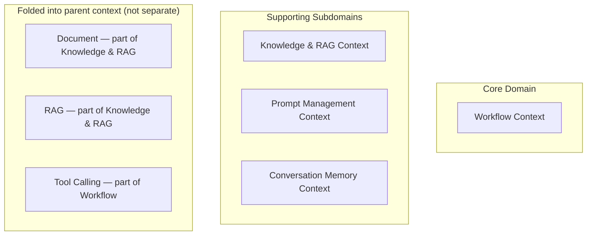

**Knowledge and Document are one context, not two.** A Document only exists to serve a Knowledge Base. Document processing (chunking, embedding, indexing) is the implementation of "what it means to add a document to a Knowledge Base." Separating them creates an artificial boundary with no corresponding expert disagreement — the same engineer who designs a Knowledge Base designs how documents are indexed in it.

**RAG is part of the Knowledge & RAG context, not separate.** RAG is the retrieval-side of the same context that owns the indexing-side. The query embedding, vector search, hybrid fusion, and context assembly all depend on the same Knowledge Base and Document Chunk models. A separate "RAG context" would have no aggregate of its own — it would just orchestrate the Knowledge context's own objects.

**Tool Calling is part of the Workflow context, not separate.** Phase 4B already defined `ToolDefinition` and `ToolExecution` aggregates in the `tool_execution` module. Phase 4E's Workflow context owns the node type `TOOL_CALL` that triggers those aggregates. The Tool's domain design was completed in Phase 4B §5.4 and §5.5. This document does not redesign it — it shows how Workflow nodes invoke it.

**Prompt Management is a separate supporting context.** Prompt templates, versioning, A/B experiments, and evaluation have their own lifecycle (draft → published → archived, experiment assignment, rollback) that is independent of Workflows or Knowledge Bases. The same Prompt may be referenced by multiple Agents and Workflows.

**Conversation Memory is a separate supporting context.** Memory has its own schema (session scope vs. customer scope), its own compression lifecycle, and its own retrieval pattern. It is consumed by the Voice Orchestrator (Phase 4B) directly via `ConversationMemoryPort` — not through the Workflow Engine.

| Context | Classification | Rationale |
|---|---|---|
| **Workflow** | **Core Domain** | The Workflow graph, its versioning, and its per-turn execution engine are the platform's most complex AI orchestration logic — no off-the-shelf system models it correctly. Node type extensibility, slot accumulation, and condition evaluation are bespoke. |
| **Knowledge & RAG** | **Supporting Subdomain** | Critical for agent quality but structurally well-bounded: ingest → chunk → embed → index → retrieve. The domain rules are clear; the complexity is in the providers (embedding API, vector search) behind the ports. |
| **Prompt Management** | **Supporting Subdomain** | Prompt versioning, variable resolution, and A/B assignment have real business rules (strict undefined variable rejection, immutable versions, per-session deterministic assignment). Worth a separate context because the same Prompt may be used across many Agents. |
| **Conversation Memory** | **Supporting Subdomain** | Memory has its own scopes, compression lifecycle, and retrieval contract. Distinct enough from Knowledge (which is static content) to warrant its own boundary — the same expert who manages conversation memory does not manage the Knowledge Base's chunking strategy. |

---

## 3. Context Map

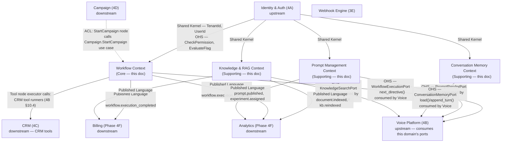

---

## 4. Knowledge & RAG Context

### 4.1 KnowledgeBase Aggregate

**Aggregate Root:** `KnowledgeBase`

**Rationale for boundary:** a Knowledge Base is the configuration unit — its name, embedding model, chunking strategy, and index version are all properties that must be consistent. Individual documents are separate aggregates (see §4.2) because a Knowledge Base with thousands of documents cannot embed them all without making the aggregate unmanageable.

```
KnowledgeBase (AggregateRoot)
├── KnowledgeBaseId             (Value Object — UUIDv7)
├── TenantId                    (Value Object)
├── Name                        (Value Object — 1–200 chars)
├── Description                 (Value Object — 0–500 chars)
├── EmbeddingModelRef           (Value Object — EmbeddingModelId — pinned at creation)
├── EmbeddingDimensions         (Value Object — integer — derived from EmbeddingModelRef)
├── ChunkingStrategy            (Value Object — ChunkingStrategy — see §4.1.1)
├── IndexVersion                (Value Object — integer — incremented on reindex)
├── Status                      (Value Object — KbStatus — ACTIVE | REINDEXING | DEGRADED)
├── DocumentCount               (Value Object — integer — maintained by event projection)
└── CreatedAt                   (Value Object — datetime)
```

**§4.1.1 ChunkingStrategy (Value Object):**
```
ChunkingStrategy
├── StrategyType     (Enum — FIXED_SIZE | SEMANTIC | PARAGRAPH | SENTENCE)
├── ChunkSizeTokens  (integer — target chunk size, 128–2048)
├── OverlapTokens    (integer — overlap between consecutive chunks, 0–512)
└── SplitOn          (nullable string — delimiter for PARAGRAPH/SENTENCE splitting)
```

**Invariants:**
1. `EmbeddingModelRef` is immutable after creation — changing the embedding model requires creating a new Knowledge Base (the existing vectors would be incompatible). A "migration" tool is a new-KB creation + copy, not an in-place update.
2. `EmbeddingDimensions` is derived from `EmbeddingModelRef` at creation time and is immutable.
3. A Knowledge Base in `REINDEXING` status continues to serve queries from the previous index version — the old index is only replaced when the new one is fully built.
4. `DocumentCount` is updated by event handlers consuming `document.indexed` and `document.deleted` — never set directly by commands.

**Commands:** `CreateKnowledgeBase`, `UpdateKnowledgeBaseSettings`, `TriggerReindex`, `ArchiveKnowledgeBase`
**Domain Events:** `KnowledgeBaseCreated`, `KnowledgeBaseSettingsUpdated`, `KnowledgeBaseReindexTriggered`, `KnowledgeBaseReindexCompleted`, `KnowledgeBaseArchived`
**Repository:** `KnowledgeBaseRepository` — tenant-scoped.

---

### 4.2 Document Aggregate

**Aggregate Root:** `Document`

**Rationale:** each Document has its own ingestion lifecycle (see §7.1 state machine), its own storage reference, and its own set of chunks. It is a natural aggregate boundary — all operations on a document (reprocess, archive, delete) target one Document.

```
Document (AggregateRoot)
├── DocumentId                  (Value Object — UUIDv7)
├── KnowledgeBaseRef            (Value Object — KnowledgeBaseId)
├── TenantId                    (Value Object)
├── SourceType                  (Value Object — SourceType — PDF|DOCX|TXT|CSV|URL|FAQ|WEBSITE)
├── SourceRef                   (Value Object — StorageRef — S3 path for files, URL for web sources)
├── OriginalFilename            (Value Object — nullable string)
├── Title                       (Value Object — nullable string — human label)
├── Status                      (Value Object — DocumentStatus — see §7.1)
├── IngestionJobRef             (Value Object — nullable IngestionJobId)
├── ChunkCount                  (Value Object — integer — set after chunking)
├── IndexedAt                   (Value Object — nullable datetime)
├── FailureReason               (Value Object — nullable string)
├── ContentHash                 (Value Object — SHA-256 of source content)
├── Metadata                    (Value Object — DocumentMetadata — key-value pairs for filtering)
└── CreatedAt                   (Value Object — datetime)
```

**Invariants:**
1. `ContentHash` is computed at upload time and used to detect duplicate uploads — a document with the same hash in the same Knowledge Base is rejected.
2. `ChunkCount` is set exactly once when the chunking phase completes — it is immutable thereafter unless the document is reprocessed.
3. A `DELETED` Document is never physically removed from the Document aggregate table — its `Status` is set to `DELETED` and its chunks are removed from the vector store. This satisfies the audit requirement.
4. `IngestionJobRef` is set when processing begins and cleared when the job reaches a terminal state.
5. `Metadata` keys must be non-empty strings; values must be strings, numbers, or booleans — the filtering contract for RAG queries.

**Commands:** `UploadDocument`, `StartIngestion`, `MarkChunked`, `MarkEmbedded`, `MarkIndexed`, `MarkFailed`, `ReprocessDocument`, `ArchiveDocument`, `DeleteDocument`
**Domain Events:** `DocumentUploaded`, `IngestionStarted`, `DocumentChunked`, `DocumentEmbedded`, `DocumentIndexed`, `DocumentIngestionFailed`, `DocumentArchived`, `DocumentDeleted`
**Repository:** `DocumentRepository` — tenant-scoped; queries by `KnowledgeBaseRef`, by `Status`.

---

### 4.3 IngestionJob Aggregate

**Aggregate Root:** `IngestionJob`

**Rationale:** ingestion is a multi-stage background pipeline. The job carries its own progress, error list, and retry count independently of the Document it processes. If the worker crashes after chunking but before embedding, the IngestionJob records where it left off.

```
IngestionJob (AggregateRoot)
├── IngestionJobId              (Value Object — UUIDv7)
├── DocumentRef                 (Value Object — DocumentId)
├── KnowledgeBaseRef            (Value Object — KnowledgeBaseId)
├── TenantId                    (Value Object)
├── Status                      (Value Object — JobStatus — PENDING|PARSING|CHUNKING|EMBEDDING|INDEXING|COMPLETED|FAILED)
├── CurrentStage                (Value Object — PipelineStage — same enum as Status minus PENDING/COMPLETED/FAILED)
├── AttemptCount                (Value Object — integer — retries on failure, max 3)
├── ParsedTextRef               (Value Object — nullable StorageRef — intermediate parsed text)
├── ChunksProduced              (Value Object — integer — set after CHUNKING)
├── EmbeddingsProduced          (Value Object — integer — set after EMBEDDING)
├── ErrorMessage                (Value Object — nullable string)
└── StartedAt                   (Value Object — nullable datetime)
```

**Invariants:**
1. `AttemptCount ≤ 3` — after 3 failures the job enters permanent FAILED status and triggers an alert.
2. Stage transitions are monotonic — PARSING → CHUNKING → EMBEDDING → INDEXING → COMPLETED. There is no backward transition within an attempt.
3. A COMPLETED IngestionJob is immutable.

**Commands:** `CreateIngestionJob`, `StartParsing`, `StartChunking`, `StartEmbedding`, `StartIndexing`, `CompleteIngestion`, `FailIngestion`, `RetryIngestion`
**Domain Events:** `IngestionJobCreated`, `IngestionJobCompleted`, `IngestionJobFailed`, `IngestionJobRetried`
**Repository:** `IngestionJobRepository` — tenant-scoped.

---

### 4.4 RAG — Domain Responsibilities

RAG is not a separate aggregate — it is a domain service and a set of ports. The domain owns the *rules* of retrieval; the infrastructure owns the *mechanics*.

```python
class RetrievalService:
    """
    Domain service for RAG query processing.
    Pure orchestration — receives pre-loaded KnowledgeBase config and
    calls ports for the actual embedding and search operations.
    """
    def assemble_context(
        self,
        query: RetrievalQuery,
        results: list[ScoredChunk],
        max_context_tokens: int,
    ) -> RetrievalContext:
        """
        Selects chunks that fit within max_context_tokens (measured by
        the domain's token estimator — a pure function).
        Formats them with citations.
        Returns RetrievalContext with formatted text + list[Citation].

        Domain invariant: no chunk is included without a Citation.
        """
        ...

    def reciprocal_rank_fusion(
        self,
        semantic_hits: list[ScoredChunk],
        keyword_hits: list[ScoredChunk],
        k: int = 60,
    ) -> list[ScoredChunk]:
        """
        Pure function — merges two ranked lists via RRF.
        score(d) = Σ 1 / (k + rank(d))
        No I/O — receives pre-computed lists.
        """
        ...
```

**Why RRF is a domain service method, not infrastructure:** the fusion formula (which signals to blend and by what formula) is a business decision — it determines what the agent "knows" and how it answers questions. If it were in the pgvector adapter, changing the ranking strategy would require changing infrastructure, not domain configuration. Placing it in the domain makes it testable with mock result lists.

**RAG Ports (defined here, implemented in infrastructure):**

```python
class EmbeddingPort(Protocol):
    async def embed(self, text: str, model_ref: EmbeddingModelId) -> EmbeddingVector: ...
    async def embed_batch(self, texts: list[str], model_ref: EmbeddingModelId) -> list[EmbeddingVector]: ...
    def dimensions(self, model_ref: EmbeddingModelId) -> int: ...

class VectorSearchPort(Protocol):
    async def search(
        self,
        query_vector: EmbeddingVector,
        kb_ids: list[KnowledgeBaseId],
        tenant_id: TenantId,
        top_k: int,
        metadata_filter: dict | None,
    ) -> list[ScoredChunk]: ...

    async def full_text_search(
        self,
        query_text: str,
        kb_ids: list[KnowledgeBaseId],
        tenant_id: TenantId,
        top_k: int,
    ) -> list[ScoredChunk]: ...

    async def upsert_chunks(
        self,
        document_id: DocumentId,
        kb_id: KnowledgeBaseId,
        tenant_id: TenantId,
        chunks: list[ChunkWithEmbedding],
    ) -> None: ...

    async def delete_chunks(
        self,
        document_id: DocumentId,
        tenant_id: TenantId,
    ) -> None: ...

class DocumentParserPort(Protocol):
    async def parse(self, source_ref: StorageRef, source_type: SourceType) -> ParsedDocument: ...

class ChunkerPort(Protocol):
    def chunk(self, text: str, strategy: ChunkingStrategy) -> list[TextChunk]: ...
```

---

## 5. Workflow Context

### 5.1 WorkflowDefinition Aggregate

**Aggregate Root:** `WorkflowDefinition`

**Rationale:** the Workflow graph — its nodes, edges, and the publishing contract — must be consistent as a unit. An unpublished draft change must not affect live calls. The full graph is embedded (not split across tables) because: (a) it is always read and written as a whole unit at publish time, and (b) even large workflows rarely exceed a few hundred nodes, which fits comfortably in a JSONB column.

```
WorkflowDefinition (AggregateRoot)
├── WorkflowId                  (Value Object — UUIDv7)
├── TenantId                    (Value Object)
├── Name                        (Value Object — 1–200 chars)
├── Description                 (Value Object — 0–500 chars)
├── Status                      (Value Object — WorkflowStatus — DRAFT|PUBLISHED|ARCHIVED)
├── PublishedVersionRef         (Value Object — nullable WorkflowVersionId)
├── DraftGraph                  (Entity — mutable, always the current editable state)
│   ├── EntryNodeId             (Value Object — NodeId)
│   ├── Nodes                   (list[WorkflowNode] — see §5.1.1)
│   └── Edges                   (list[WorkflowEdge] — see §5.1.2)
├── Versions                    (list[WorkflowVersion] — embedded, bounded, ~< 50)
│   └── WorkflowVersion (Entity)
│       ├── VersionId           (Value Object — WorkflowVersionId)
│       ├── VersionNumber       (Value Object — integer, monotonic)
│       ├── GraphJson           (Value Object — immutable JSON snapshot of DraftGraph)
│       ├── PublishedAt         (Value Object — datetime)
│       └── PublishedBy         (Value Object — UserId)
└── CreatedAt                   (Value Object — datetime)
```

**§5.1.1 WorkflowNode (Entity — embedded in DraftGraph):**
```
WorkflowNode
├── NodeId                      (Value Object — UUIDv7)
├── NodeType                    (Value Object — NodeType — see §5.1.3)
├── Label                       (Value Object — 0–100 chars)
└── Config                      (Value Object — NodeConfig — type-specific, see §5.1.4)
```

**§5.1.2 WorkflowEdge (Entity — embedded in DraftGraph):**
```
WorkflowEdge
├── EdgeId                      (Value Object — UUIDv7)
├── SourceNodeId                (Value Object — NodeId)
├── TargetNodeId                (Value Object — NodeId)
└── Condition                   (Value Object — nullable EdgeCondition)
    ├── Expression              (Value Object — safe expression string — see §5.3)
    └── OnSlot                  (Value Object — nullable SlotName — shorthand for slot comparison)
```

**§5.1.3 NodeType Enumeration:**
`GREETING | PROMPT | LLM | DECISION | CONDITION | BRANCH | KNOWLEDGE_SEARCH | TOOL_CALL | WEBHOOK | API_CALL | DELAY | TRANSFER | HUMAN_TRANSFER | END_CALL`

**§5.1.4 Representative NodeConfig shapes (abbreviated):**

| NodeType | Key Config Fields |
|---|---|
| `GREETING` | `greeting_template: str` |
| `PROMPT` | `prompt_ref: PromptId, inject_position: SYSTEM\|USER` |
| `LLM` | `prompt_ref: PromptId, tools_enabled: bool, kb_ids: list[KbId], max_turns: int\|None` |
| `DECISION` | `condition_expression: str, true_edge: NodeId, false_edge: NodeId` |
| `BRANCH` | `slot_name: SlotName, branches: dict[str, NodeId], default_edge: NodeId` |
| `KNOWLEDGE_SEARCH` | `kb_ids: list[KbId], query_template: str, result_slot: SlotName, top_k: int` |
| `TOOL_CALL` | `tool_name: ToolName, argument_template: dict, on_success_edge: NodeId, on_failure_edge: NodeId` |
| `WEBHOOK` | `url_template: str, method: GET\|POST, payload_template: dict, timeout_ms: int, result_slot: SlotName` |
| `DELAY` | `duration_ms: int` |
| `TRANSFER` | `number_expression: str` |
| `END_CALL` | `farewell_template: str, qualification_outcome: QUALIFIED\|DISQUALIFIED\|null` |

**Invariants:**
1. `EntryNodeId` must reference an existing Node in `DraftGraph.Nodes`.
2. All `Edge.TargetNodeId` and `Edge.SourceNodeId` must reference existing Nodes.
3. No unreachable Nodes — every Node must be reachable from `EntryNodeId` via at least one edge path.
4. No unconstrained cycles — a cycle is permitted only if the cycle path contains an LLM node with `max_turns != null` (the turn limit breaks the cycle).
5. `DECISION` nodes must have exactly two outgoing edges (true/false).
6. `END_CALL` nodes must have no outgoing edges.
7. `ARCHIVED` Workflow Definitions are immutable and cannot be published again.
8. `WorkflowVersion.GraphJson` is immutable once written.

**Commands:** `CreateWorkflow`, `UpdateDraftGraph`, `AddNode`, `RemoveNode`, `UpdateNodeConfig`, `AddEdge`, `RemoveEdge`, `PublishWorkflow`, `ArchiveWorkflow`
**Domain Events:** `WorkflowCreated`, `DraftGraphUpdated`, `WorkflowPublished`, `WorkflowArchived`
**Repository:** `WorkflowDefinitionRepository` — tenant-scoped.
**Transaction boundary:** all DraftGraph edits and publish operations on a single WorkflowDefinition aggregate.

---

### 5.2 WorkflowExecution Aggregate

**Aggregate Root:** `WorkflowExecution`

**Rationale:** one WorkflowExecution instance exists per live call session that is governed by a Workflow. It carries the runtime cursor (current node), accumulated slots, and per-node execution history. It is a separate aggregate from WorkflowDefinition because: (a) executions are created and destroyed frequently; (b) execution state updates (per-turn cursor movement) must not lock the WorkflowDefinition aggregate; (c) execution history (which nodes ran, what slots accumulated) is independently queryable for debugging.

```
WorkflowExecution (AggregateRoot)
├── ExecutionId                 (Value Object — UUIDv7)
├── WorkflowVersionRef          (Value Object — WorkflowVersionId — pinned at execution start)
├── SessionRef                  (Value Object — SessionId — Phase 4B session)
├── TenantId                    (Value Object)
├── Status                      (Value Object — ExecutionStatus — ACTIVE|COMPLETED|FAILED)
├── CurrentNodeId               (Value Object — NodeId — the cursor)
├── Slots                       (Value Object — SlotMap — dict[SlotName, SlotValue])
├── TurnCountAtNode             (Value Object — dict[NodeId, int] — for max_turns enforcement)
├── NodeExecutionHistory        (list[NodeExecution] — embedded, bounded by call length)
│   └── NodeExecution (Entity)
│       ├── NodeExecutionId     (Value Object — UUIDv7)
│       ├── NodeId              (Value Object)
│       ├── EnteredAt           (Value Object — datetime)
│       ├── ExitedAt            (Value Object — nullable datetime)
│       ├── Directive           (Value Object — nullable Directive — result of this node)
│       └── SlotUpdates         (Value Object — dict[SlotName, SlotValue])
├── StartedAt                   (Value Object — datetime)
└── CompletedAt                 (Value Object — nullable datetime)
```

**Invariants:**
1. `WorkflowVersionRef` is pinned at execution start and immutable — a live call always runs the same version even if the Workflow is re-published mid-call.
2. `CurrentNodeId` must always reference a Node that exists in the pinned `WorkflowVersion.GraphJson`.
3. `TurnCountAtNode[node_id]` cannot exceed the LLM node's `max_turns` — transition to the next node is forced when the limit is hit.
4. A COMPLETED or FAILED Execution is immutable.
5. `Slots` are accumulated monotonically — slot values may be updated but slots are never removed during an execution.

**Commands:** `StartExecution`, `AdvanceCursor`, `UpdateSlots`, `CompleteExecution`, `FailExecution`
**Domain Events:** `ExecutionStarted`, `NodeEntered`, `NodeExited`, `SlotUpdated`, `ExecutionCompleted`, `ExecutionFailed`
**Repository:** `WorkflowExecutionRepository` — tenant-scoped; queries by `SessionRef`.

---

### 5.3 Expression Safety

Workflow `Decision` and `Condition` nodes use user-authored condition expressions. As designed in Phase 3D §5.5, these are evaluated by a **whitelist-based safe evaluator** — not Python `eval()`.

**Permitted in expressions:**
- Field access on `slots.<name>`, `session.<field>`, `tool_results.<tool>.<field>`
- String and numeric literals
- Comparison operators: `==`, `!=`, `>`, `<`, `>=`, `<=`
- Boolean operators: `and`, `or`, `not`
- Membership test: `in` (against a literal list)
- `is null` / `is not null`

**Forbidden:**
- Imports, function calls (except a whitelist: `len()`, `str()`, `int()`), assignments, attribute access beyond the allowed namespaces, any Python built-in not explicitly whitelisted.

**This is validated at publish time (by `ValidateGraphUseCase`) AND at runtime.** A tampered graph that bypasses the publish validation still hits the runtime check.

---

### 5.4 Workflow Execution Domain Service

```python
class WorkflowExecutionService:
    """
    The per-turn evaluation engine.
    Pure orchestration — receives the execution state and the pinned graph;
    calls ports for tool execution, knowledge search, LLM, TTS.
    Returns a Directive.
    """
    def evaluate_node(
        self,
        execution: WorkflowExecution,
        graph: ParsedWorkflowGraph,
        context: ExecutionContext,
        executor_registry: NodeExecutorRegistry,
    ) -> NodeEvaluationResult:
        """
        Loads the current node from the graph.
        Dispatches to the appropriate NodeExecutor.
        Returns NodeEvaluationResult(directive, slot_updates, next_node_id | None).
        """
        ...

    def resolve_next_node(
        self,
        current_node: WorkflowNode,
        edges: list[WorkflowEdge],
        slots: SlotMap,
        expression_evaluator: ExpressionEvaluator,
    ) -> NodeId | None:
        """
        Pure function — evaluates edge conditions against current slots.
        Returns the NodeId to advance to, or None if the workflow is complete.
        """
        ...
```

**Why `evaluate_node` delegates to a `NodeExecutorRegistry`:** following Phase 3D §6.2's design, each NodeType has its own executor registered at DI startup — `LlmNodeExecutor`, `ToolCallNodeExecutor`, `KnowledgeSearchNodeExecutor`, etc. Adding a new node type (Phase 4E's open extension point) means adding one executor class, not modifying this service.

---

## 6. Prompt Management Context

### 6.1 PromptTemplate Aggregate

**Aggregate Root:** `PromptTemplate`

```
PromptTemplate (AggregateRoot)
├── PromptId                    (Value Object — UUIDv7)
├── TenantId                    (Value Object)
├── Name                        (Value Object — 1–200 chars, unique within tenant)
├── Status                      (Value Object — PromptStatus — DRAFT|PUBLISHED|ARCHIVED)
├── CurrentDraft                (Entity — mutable draft content)
│   ├── Content                 (Value Object — Jinja2 template string, max 50000 chars)
│   └── VariableSchema          (Value Object — list[PromptVariable])
│       └── PromptVariable
│           ├── Name            (Value Object — snake_case string)
│           ├── Type            (Value Object — STRING|INTEGER|BOOLEAN|LIST)
│           ├── Required        (Value Object — boolean)
│           └── DefaultValue    (Value Object — nullable)
├── ActiveVersionByEnvironment  (Value Object — dict[Environment, VersionNumber])
├── Versions                    (list[PromptVersion] — embedded, bounded)
│   └── PromptVersion (Entity)
│       ├── VersionId           (Value Object — PromptVersionId)
│       ├── VersionNumber       (Value Object — integer, monotonic)
│       ├── Content             (Value Object — immutable Jinja2 string)
│       ├── VariableSchema      (Value Object — immutable list[PromptVariable])
│       ├── PublishedAt         (Value Object — datetime)
│       └── PublishedBy         (Value Object — UserId)
└── CreatedAt                   (Value Object — datetime)
```

**Invariants:**
1. `PromptVersion.Content` is immutable once published.
2. `PromptVersion.VariableSchema` is immutable once published.
3. `ActiveVersionByEnvironment` maps each `Environment` to a `VersionNumber` that exists in `Versions`.
4. A `rollback(environment, target_version)` command does not delete the current version — it updates `ActiveVersionByEnvironment` to point to an earlier version.
5. `Content` must be valid Jinja2 — validated at publish time by `PromptValidationService`.
6. All variables referenced in `Content` must be declared in `VariableSchema` — no undeclared variable references.

**Commands:** `CreatePromptTemplate`, `UpdateDraftContent`, `PublishPromptVersion`, `SetActiveVersion`, `RollbackPrompt`, `ArchivePromptTemplate`
**Domain Events:** `PromptTemplateCreated`, `DraftContentUpdated`, `PromptVersionPublished`, `PromptRolledBack`, `PromptTemplateArchived`
**Repository:** `PromptTemplateRepository` — tenant-scoped; queries by `PromptId`, by `Name`.

---

### 6.2 PromptExperiment Aggregate

**Aggregate Root:** `PromptExperiment`

```
PromptExperiment (AggregateRoot)
├── ExperimentId                (Value Object — ExperimentId)
├── PromptRef                   (Value Object — PromptId)
├── TenantId                    (Value Object)
├── Name                        (Value Object — 1–200 chars)
├── Status                      (Value Object — ExperimentStatus — DRAFT|ACTIVE|COMPLETED|CANCELLED)
├── Variants                    (list[ExperimentVariant] — 2–4 variants, weights sum to 100)
│   └── ExperimentVariant (Entity)
│       ├── VariantId           (Value Object — VariantId)
│       ├── Label               (Value Object — e.g. "control", "variant_a")
│       ├── VersionRef          (Value Object — PromptVersionId)
│       └── WeightPct           (Value Object — integer — % of traffic, 1–98)
├── AssignmentBasis             (Value Object — SESSION_ID | USER_ID — determinism key)
└── StartedAt                   (Value Object — nullable datetime)
```

**Invariants:**
1. Variant weights must sum to exactly 100.
2. A minimum of 2 and maximum of 4 variants per experiment.
3. All `VersionRef`s must reference published versions of the same `PromptRef`.
4. An ACTIVE experiment cannot have variants added or removed — only `WeightPct` adjustments (with re-normalisation) are permitted.
5. Experiment assignment is deterministic per `(ExperimentId, AssignmentBasis)` — the same session always gets the same variant throughout the call.

**Commands:** `CreateExperiment`, `ActivateExperiment`, `AdjustVariantWeights`, `CompleteExperiment`, `CancelExperiment`
**Domain Events:** `ExperimentCreated`, `ExperimentActivated`, `ExperimentCompleted`, `ExperimentCancelled`

---

### 6.3 Prompt Domain Services

```python
class PromptRenderService:
    """
    Renders a PromptVersion's Content with supplied variables.
    Raises UndefinedVariableError for any required variable not supplied.
    Strict mode: any {{ variable }} not in VariableSchema is also an error.
    Returns RenderedPrompt(text, version_id, variant_id | None).
    """
    def render(
        self,
        version: PromptVersion,
        variables: dict[str, Any],
        variant_id: VariantId | None,
    ) -> RenderedPrompt: ...

class ExperimentAssignmentService:
    """
    Given an experiment and a session_id (or user_id per AssignmentBasis),
    returns the assigned VariantId deterministically via consistent hashing.
    Pure function — no I/O.
    """
    def assign(
        self,
        experiment: PromptExperiment,
        assignment_key: str,
    ) -> VariantId: ...

class PromptValidationService:
    """
    Validates a Jinja2 template string:
    - Parseable as valid Jinja2
    - All {{ variable }} references declared in VariableSchema
    - No forbidden Jinja2 constructs (import, exec, __builtins__)
    Pure function.
    """
    def validate(
        self,
        content: str,
        schema: list[PromptVariable],
    ) -> ValidationResult: ...
```

---

## 7. State Machines

### 7.1 Document Lifecycle

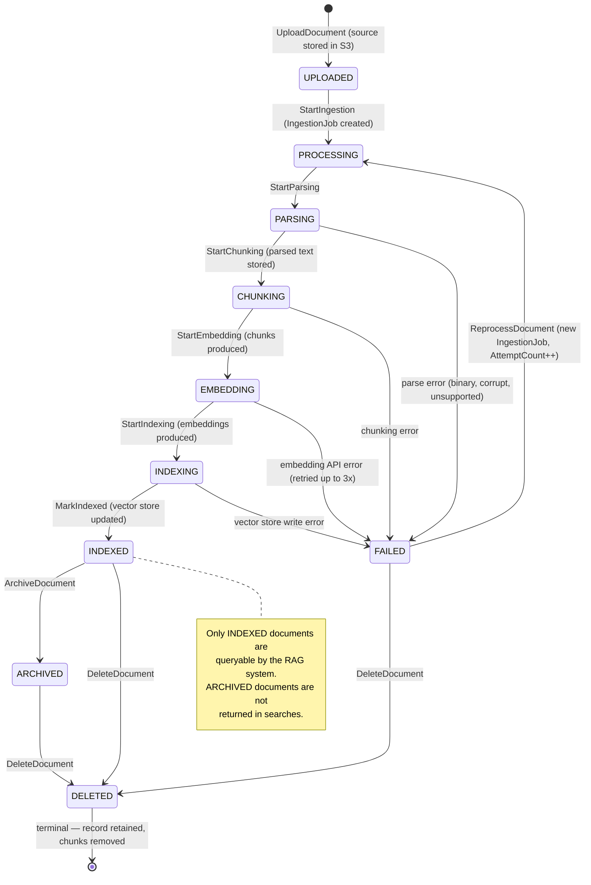

### 7.2 Workflow Definition Lifecycle

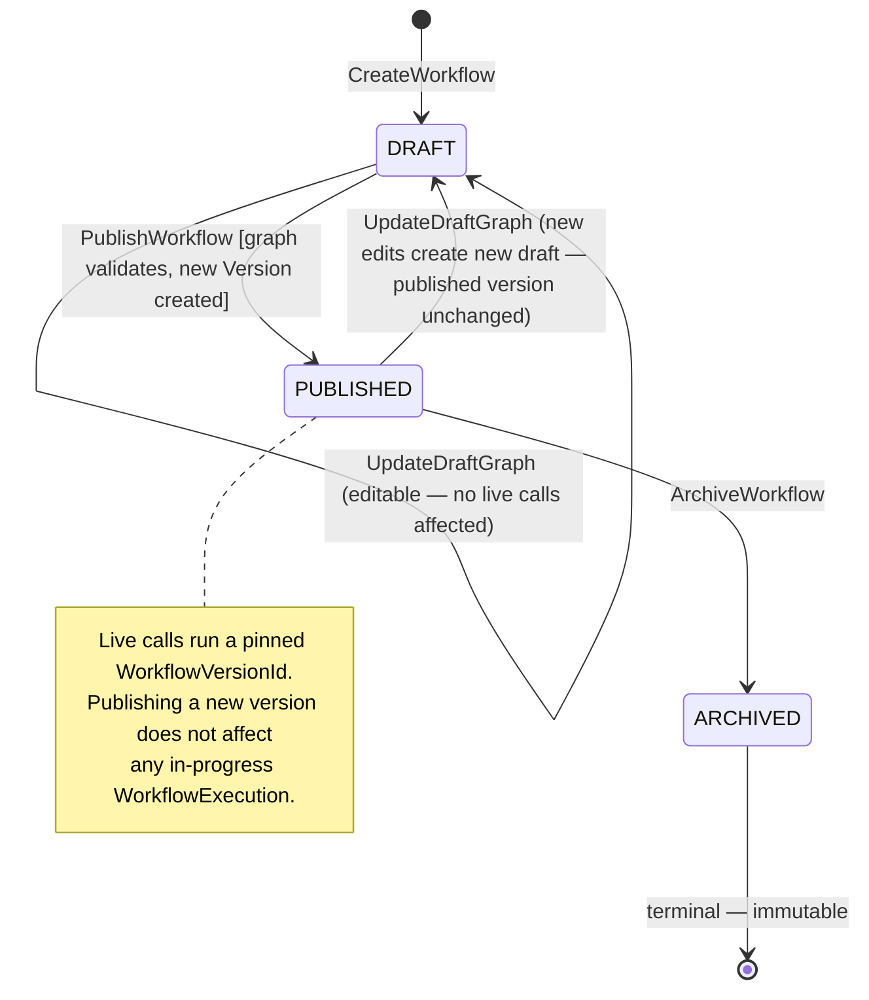

### 7.3 Workflow Execution Lifecycle

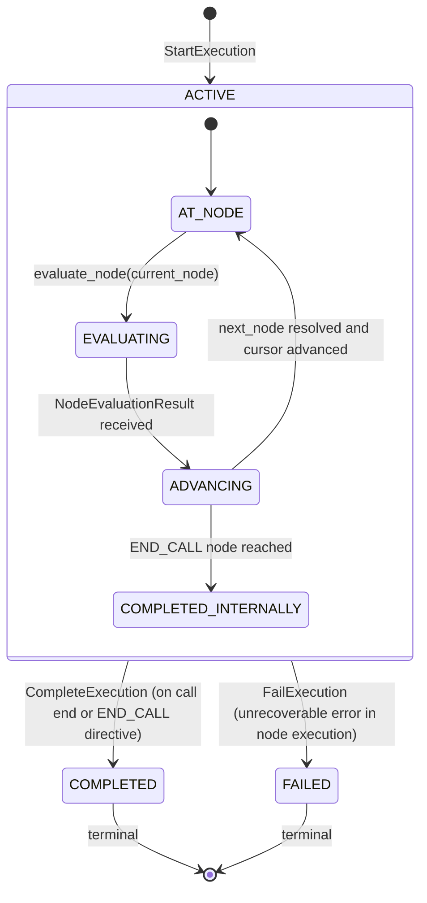

### 7.4 Prompt Version Lifecycle

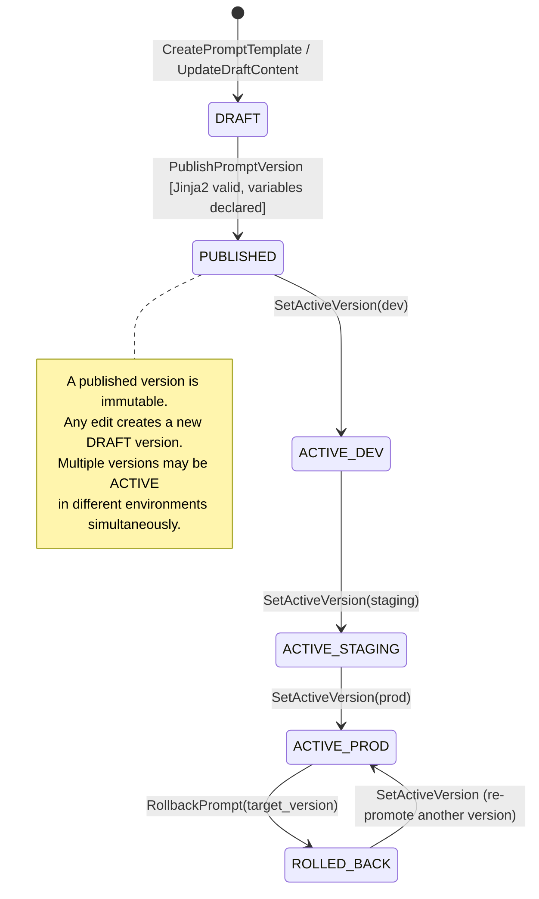

### 7.5 Memory Lifecycle

```mermaid
stateDiagram-v2
    [*] --> SESSION_ACTIVE: BeginConversation creates SessionMemory
    SESSION_ACTIVE --> SESSION_ACTIVE: AppendTurn (in-call, Redis hot-tier)
    SESSION_ACTIVE --> SESSION_SUMMARIZING: ConversationCompleted triggers summarization
    SESSION_SUMMARIZING --> SESSION_SUMMARIZED: SummarizeSession (LLM call, async)
    SESSION_SUMMARIZED --> [*]: session memory archived; summary persists in CustomerMemory

    [*] --> CUSTOMER_ACTIVE: CustomerMemory created on first call
    CUSTOMER_ACTIVE --> CUSTOMER_ACTIVE: UpdateFact (new fact from conversation)
    CUSTOMER_ACTIVE --> CUSTOMER_ACTIVE: UpdateLastSummary (on session summarization)
```

### 7.6 Tool Execution Lifecycle

*Reused from Phase 4B §7.4 (ToolExecution is defined there — not redesigned here):*

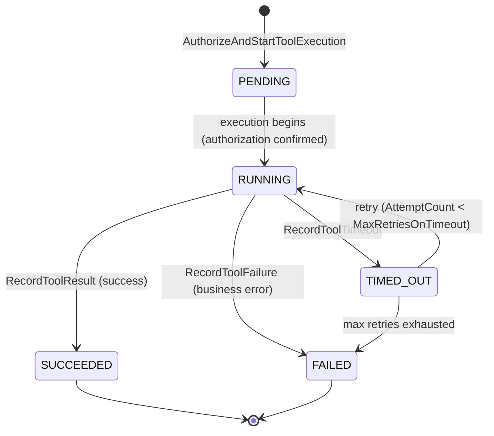

---

## 8. Conversation Memory Context

### 8.1 Memory Aggregates

**Two aggregate roots, not one:**

| Aggregate | Scope | Store | TTL |
|---|---|---|---|
| `SessionMemory` | One call session — the live transcript | Redis hot-tier + Postgres checkpoint | Call duration + archive |
| `CustomerMemory` | One contact across all calls | Postgres | Permanent |

**Why two separate aggregates (not one `Memory` with a `scope` field):** session memory is written dozens of times per call (once per turn) and queried once at session start. Customer memory is written rarely (once per call, at summarization) and queried once at session start. They have entirely different write patterns, TTLs, and compression lifecycles. A unified aggregate would optimize for neither.

```
SessionMemory (AggregateRoot)
├── SessionMemoryId             (Value Object — UUIDv7)
├── SessionRef                  (Value Object — SessionId — Phase 4B)
├── ConversationRef             (Value Object — ConversationId)
├── TenantId                    (Value Object)
├── ContactRef                  (Value Object — nullable ContactId — set if contact matched)
├── Turns                       (list[MemoryTurn] — embedded, append-only, ordered)
│   └── MemoryTurn (Entity)
│       ├── TurnId              (Value Object)
│       ├── SequenceNo          (Value Object — integer)
│       ├── Speaker             (Value Object — CALLER|AGENT)
│       └── Text                (Value Object — transcript text)
├── CompressionLevel            (Value Object — NONE|SUMMARIZED|COMPRESSED)
├── Summary                     (Value Object — nullable string — set after summarization)
├── StartedAt                   (Value Object — datetime)
└── CompletedAt                 (Value Object — nullable datetime)

CustomerMemory (AggregateRoot)
├── CustomerMemoryId            (Value Object — UUIDv7)
├── ContactRef                  (Value Object — ContactId)
├── TenantId                    (Value Object)
├── Facts                       (list[MemoryFact] — append/update, bounded ~< 100 facts)
│   └── MemoryFact (Entity)
│       ├── Key                 (Value Object — snake_case string — e.g. "caller_name")
│       ├── Value               (Value Object — string)
│       ├── Confidence          (Value Object — 0.0–1.0)
│       ├── Source              (Value Object — CALL:session_id | MANUAL)
│       └── RecordedAt          (Value Object — datetime)
├── LastCallSummary             (Value Object — nullable string)
├── LastCallAt                  (Value Object — nullable datetime)
└── UpdatedAt                   (Value Object — datetime)
```

**Invariants on CustomerMemory:**
1. Fact `Key` is unique within a CustomerMemory — a duplicate key updates the existing fact (by value + confidence + source + timestamp) rather than creating a second entry.
2. `Confidence` is in [0.0, 1.0].
3. A fact from a more recent source with higher confidence replaces the value from an older, lower-confidence source. A fact from a more recent source with lower confidence supplements rather than replaces (both kept, ordered by confidence).

**Invariants on SessionMemory:**
1. `SequenceNo` is monotonically increasing — no gaps, no duplicates.
2. A COMPLETED SessionMemory is immutable in its `Turns` list — the `Summary` field may still be set by the async summarization task.

---

### 8.2 Memory Domain Services

```python
class MemoryContextService:
    """
    Assembles the memory block to inject into the LLM system prompt.
    Enforces the context budget (max_memory_tokens).

    Assembly order (most to least valuable):
    1. Customer facts (compressed key-value)
    2. Last call summary
    3. Recent session turns (trimmed to fit budget)

    If total exceeds max_memory_tokens, drops oldest turns first,
    then compresses facts if still over budget.
    Never raises ContextWindowExceededError — always fits within budget
    by dropping the least valuable content.
    """
    def assemble(
        self,
        session_memory: SessionMemory,
        customer_memory: CustomerMemory | None,
        max_memory_tokens: int,
        token_estimator: TokenEstimator,
    ) -> ConversationMemory: ...
        # Returns ConversationMemory(customer_facts, last_summary, session_turns)

class MemorySummarizationService:
    """
    Domain logic for what goes into a memory summary.
    Determines the summarization prompt structure —
    the actual LLM call is made by the infrastructure adapter.
    Returns a SummarizationRequest that the LlmPort will execute.
    """
    def build_summarization_request(
        self,
        session_memory: SessionMemory,
    ) -> SummarizationRequest: ...
```

---

## 9. Value Objects — Complete Catalogue (New in This Document)

| Value Object | Type | Validation |
|---|---|---|
| `KnowledgeBaseId` | UUIDv7 | Valid UUID |
| `DocumentId` | UUIDv7 | Valid UUID |
| `IngestionJobId` | UUIDv7 | Valid UUID |
| `WorkflowId` | UUIDv7 | Valid UUID |
| `WorkflowVersionId` | UUIDv7 | Valid UUID |
| `ExecutionId` | UUIDv7 | Valid UUID |
| `NodeId` | UUIDv7 | Valid UUID |
| `EdgeId` | UUIDv7 | Valid UUID |
| `PromptId` | UUIDv7 | Valid UUID |
| `PromptVersionId` | UUIDv7 | Valid UUID |
| `ExperimentId` | UUIDv7 | Valid UUID |
| `VariantId` | UUIDv7 | Valid UUID |
| `SessionMemoryId` | UUIDv7 | Valid UUID |
| `CustomerMemoryId` | UUIDv7 | Valid UUID |
| `EmbeddingModelId` | String | Non-empty, e.g. `"openai/text-embedding-3-small"` |
| `EmbeddingVector` | list[float] | Non-empty, length = KnowledgeBase.EmbeddingDimensions |
| `KbStatus` | Enum | `ACTIVE \| REINDEXING \| DEGRADED` |
| `DocumentStatus` | Enum | See §7.1 state machine |
| `IngestionJobStatus` | Enum | `PENDING \| PARSING \| CHUNKING \| EMBEDDING \| INDEXING \| COMPLETED \| FAILED` |
| `WorkflowStatus` | Enum | `DRAFT \| PUBLISHED \| ARCHIVED` |
| `ExecutionStatus` | Enum | `ACTIVE \| COMPLETED \| FAILED` |
| `PromptStatus` | Enum | `DRAFT \| PUBLISHED \| ARCHIVED` |
| `ExperimentStatus` | Enum | `DRAFT \| ACTIVE \| COMPLETED \| CANCELLED` |
| `NodeType` | Enum | §5.1.3 |
| `SourceType` | Enum | `PDF \| DOCX \| TXT \| CSV \| URL \| FAQ \| WEBSITE` |
| `Environment` | Enum | `local \| staging \| production` |
| `VersionNumber` | Integer | ≥ 1, monotonically increasing |
| `SlotName` | String | `[a-z][a-z0-9_]{0,49}` |
| `SlotValue` | Union | `str \| int \| float \| bool \| list \| None` |
| `SlotMap` | dict[SlotName, SlotValue] | All keys valid SlotNames |
| `Directive` | Enum | `SPEAK \| EXECUTE_TOOL \| TRANSFER \| END_CALL \| WAIT \| CONTINUE` |
| `ContentHash` | String | SHA-256 hex digest (64 chars) |
| `DocumentMetadata` | dict[str, str \| int \| bool] | Keys non-empty strings |
| `ScoredChunk` | Compound | `(chunk_id, document_id, text, score: float, metadata: dict)` |
| `Citation` | Compound | `(document_id, document_title, chunk_id, chunk_text_preview)` |
| `RetrievalContext` | Compound | `(formatted_text: str, citations: list[Citation], token_count: int)` |
| `RenderedPrompt` | Compound | `(text: str, version_id: PromptVersionId, variant_id: VariantId \| None)` |
| `ConversationMemory` | Compound | `(customer_facts: str \| None, last_summary: str \| None, session_turns: str \| None)` |
| `MemoryFact.Key` | String | `[a-z][a-z0-9_]{0,49}`, unique per CustomerMemory |
| `TokenEstimator` | Protocol | `estimate(text: str, model: str) -> int` |
| `ParsedDocument` | Compound | `(text: str, metadata: dict, sections: list[str])` |
| `TextChunk` | Compound | `(text: str, char_start: int, char_end: int, metadata: dict)` |
| `ChunkWithEmbedding` | Compound | `(chunk: TextChunk, vector: EmbeddingVector)` |

---

## 10. Policies

| Policy | Context | Enforces |
|---|---|---|
| `EmbeddingModelImmutable` | Knowledge & RAG | `EmbeddingModelRef` cannot change after KB creation |
| `NoDuplicateDocumentContent` | Knowledge & RAG | Same `ContentHash` in same KB is rejected |
| `ArchivedDocumentNotQueryable` | Knowledge & RAG | ARCHIVED and DELETED documents excluded from search results |
| `PublishedGraphIsImmutable` | Workflow | `WorkflowVersion.GraphJson` cannot be modified after publish |
| `NoUnreachableNodes` | Workflow | Graph validation enforces reachability from EntryNodeId |
| `NoCyclesWithoutLimit` | Workflow | Cycles must pass through an LLM node with `max_turns` set |
| `EndCallNodeHasNoEdges` | Workflow | END_CALL nodes cannot have outgoing edges |
| `PromptVersionContentImmutable` | Prompt Management | Published `PromptVersion.Content` cannot be modified |
| `VariantWeightsSumTo100` | Prompt Management | `sum(variant.weight_pct) == 100` |
| `ToolMustBePermitted` | Workflow (Tool node) | Tool referenced in TOOL_CALL node must be in Agent's ToolPermissions |
| `RequiresPermission(permission)` | All | Phase 4A OHS `CheckPermission` before write commands |
| `EmbeddingQuotaNotExceeded` | Knowledge & RAG | Phase 4A `CheckQuota(KNOWLEDGE_DOCS)` before upload |

---

## 11. Domain Events — Full Catalogue

### 11.1 Knowledge & RAG Events

| Event | Key Payload | Consumed by |
|---|---|---|
| `knowledge_base.created` | `kb_id, tenant_id, name, embedding_model` | Audit, Analytics |
| `knowledge_base.reindex_triggered` | `kb_id, triggered_by` | Audit, (triggers background reindex job) |
| `knowledge_base.reindex_completed` | `kb_id, new_index_version, document_count` | Audit, Analytics |
| `document.uploaded` | `doc_id, kb_id, source_type, filename` | Audit, (triggers ingestion job creation) |
| `document.indexed` | `doc_id, kb_id, chunk_count, indexed_at` | Audit, Analytics, KnowledgeBase (document count update) |
| `document.ingestion_failed` | `doc_id, kb_id, failure_reason, attempt_count` | Audit, Analytics, Notification (if configured) |
| `document.deleted` | `doc_id, kb_id, deleted_by` | Audit, VectorStore (delete chunks) |

### 11.2 Workflow Events

| Event | Key Payload | Consumed by |
|---|---|---|
| `workflow.created` | `workflow_id, tenant_id, name` | Audit, Analytics |
| `workflow.published` | `workflow_id, version_id, version_number, published_by` | Audit, Analytics, Agent (cache invalidation) |
| `workflow.archived` | `workflow_id, archived_by` | Audit |
| `workflow.execution_started` | `execution_id, workflow_version_id, session_ref` | Audit |
| `workflow.execution_completed` | `execution_id, session_ref, total_nodes_visited, exit_node_type` | Audit, Analytics, Billing |
| `workflow.execution_failed` | `execution_id, session_ref, failed_node_id, error` | Audit, Analytics |
| `workflow.node_entered` | `execution_id, node_id, node_type, entered_at` | Analytics (internal, high frequency — not published to external bus) |

### 11.3 Prompt Management Events

| Event | Key Payload | Consumed by |
|---|---|---|
| `prompt.created` | `prompt_id, tenant_id, name` | Audit |
| `prompt.version_published` | `prompt_id, version_id, version_number, published_by` | Audit, Analytics, Cache invalidation |
| `prompt.rolled_back` | `prompt_id, environment, from_version, to_version, rolled_back_by` | Audit, Cache invalidation |
| `prompt.experiment_activated` | `experiment_id, prompt_id, variants` | Audit, Analytics |
| `prompt.experiment_completed` | `experiment_id, winning_variant_id` | Audit, Analytics |

### 11.4 Memory Events

| Event | Key Payload | Consumed by |
|---|---|---|
| `memory.session_created` | `session_memory_id, session_ref, conversation_ref` | Audit |
| `memory.session_summarized` | `session_memory_id, contact_ref, summary_length` | Audit, CustomerMemory (update last_summary) |
| `memory.customer_fact_updated` | `customer_memory_id, contact_ref, fact_key` | Audit |

---

## 12. Commands — Full Catalogue

### 12.1 Knowledge Commands

```python
@dataclass(frozen=True)
class CreateKnowledgeBase:
    command_id: UUIDv7; tenant_id: TenantId; name: str; description: str
    embedding_model_ref: EmbeddingModelId; chunking_strategy: ChunkingStrategy
    created_by: UserId

@dataclass(frozen=True)
class UploadDocument:
    command_id: UUIDv7; tenant_id: TenantId; kb_id: KnowledgeBaseId
    source_type: SourceType; storage_ref: StorageRef; title: str | None
    metadata: dict; uploaded_by: UserId

@dataclass(frozen=True)
class ReprocessDocument:
    command_id: UUIDv7; document_id: DocumentId; tenant_id: TenantId
    requested_by: UserId

@dataclass(frozen=True)
class DeleteDocument:
    command_id: UUIDv7; document_id: DocumentId; tenant_id: TenantId
    deleted_by: UserId
```

### 12.2 Workflow Commands

```python
@dataclass(frozen=True)
class CreateWorkflow:
    command_id: UUIDv7; tenant_id: TenantId; name: str; description: str
    created_by: UserId

@dataclass(frozen=True)
class UpdateDraftGraph:
    command_id: UUIDv7; workflow_id: WorkflowId; tenant_id: TenantId
    entry_node_id: NodeId; nodes: list[dict]; edges: list[dict]
    updated_by: UserId

@dataclass(frozen=True)
class PublishWorkflow:
    command_id: UUIDv7; workflow_id: WorkflowId; tenant_id: TenantId
    published_by: UserId
    # Graph is taken from current DraftGraph at publish time

@dataclass(frozen=True)
class StartExecution:
    command_id: UUIDv7; workflow_version_id: WorkflowVersionId
    session_ref: SessionId; tenant_id: TenantId

@dataclass(frozen=True)
class AdvanceCursor:
    command_id: UUIDv7; execution_id: ExecutionId; tenant_id: TenantId
    next_node_id: NodeId; slot_updates: dict; directive: Directive
```

### 12.3 Prompt Commands

```python
@dataclass(frozen=True)
class CreatePromptTemplate:
    command_id: UUIDv7; tenant_id: TenantId; name: str; created_by: UserId

@dataclass(frozen=True)
class UpdateDraftContent:
    command_id: UUIDv7; prompt_id: PromptId; tenant_id: TenantId
    content: str; variable_schema: list[dict]; updated_by: UserId

@dataclass(frozen=True)
class PublishPromptVersion:
    command_id: UUIDv7; prompt_id: PromptId; tenant_id: TenantId
    published_by: UserId

@dataclass(frozen=True)
class RollbackPrompt:
    command_id: UUIDv7; prompt_id: PromptId; tenant_id: TenantId
    environment: Environment; target_version_number: int; rolled_back_by: UserId
```

### 12.4 Memory Commands

```python
@dataclass(frozen=True)
class BeginSessionMemory:
    command_id: UUIDv7; session_ref: SessionId; conversation_ref: ConversationId
    tenant_id: TenantId; contact_ref: ContactId | None

@dataclass(frozen=True)
class AppendMemoryTurn:
    command_id: UUIDv7; session_memory_id: SessionMemoryId; tenant_id: TenantId
    speaker: Speaker; text: str; sequence_no: int

@dataclass(frozen=True)
class SummarizeSession:
    command_id: UUIDv7; session_memory_id: SessionMemoryId; tenant_id: TenantId
    # Async — triggered by conversation.completed event
```

---

## 13. Queries — Full Catalogue

```python
# Knowledge Base
GetKnowledgeBase(kb_id, tenant_id) -> KnowledgeBaseDTO
ListKnowledgeBases(tenant_id, page) -> Page[KbSummaryDTO]
SearchKnowledge(query, kb_ids, tenant_id, top_k, metadata_filter) -> RetrievalContext
    # This is the public face of the KnowledgeSearchPort

# Document
GetDocument(doc_id, tenant_id) -> DocumentDTO
ListDocuments(kb_id, tenant_id, status, page) -> Page[DocumentSummaryDTO]
GetIngestionJob(job_id, tenant_id) -> IngestionJobDTO

# Workflow
GetWorkflow(workflow_id, tenant_id) -> WorkflowDefinitionDTO
ListWorkflows(tenant_id, status, page) -> Page[WorkflowSummaryDTO]
GetWorkflowVersion(version_id, workflow_id, tenant_id) -> WorkflowVersionDTO
GetWorkflowExecution(execution_id, tenant_id) -> WorkflowExecutionDTO
    # Debug view — shows node history, current cursor, slots

# Prompt
GetPromptTemplate(prompt_id, tenant_id) -> PromptTemplateDTO
ListPromptTemplates(tenant_id, page) -> Page[PromptSummaryDTO]
GetPromptVersion(version_id, prompt_id, tenant_id) -> PromptVersionDTO
GetActivePromptVersion(prompt_id, environment, tenant_id) -> PromptVersionDTO

# Memory
GetCustomerMemory(contact_ref, tenant_id) -> CustomerMemoryDTO
```

---

## 14. Application Services

### 14.1 KnowledgeApplicationService

```python
class KnowledgeApplicationService:
    async def upload_document(self, cmd: UploadDocument) -> DocumentId:
        # 1. Policy: EmbeddingQuotaNotExceeded
        # 2. Compute ContentHash from stored file (via ObjectStorePort)
        # 3. Policy: NoDuplicateDocumentContent (load existing doc by hash)
        # 4. DocumentFactory.create(cmd, content_hash)
        # 5. UoW: save Document (UPLOADED), publish document.uploaded
        # 6. Enqueue: start_ingestion_task(document_id)

    async def search_knowledge(self, query: RetrievalQuery) -> RetrievalContext:
        # Hot path — called by Tool runner or Workflow node executor
        # 1. EmbeddingPort.embed(query.text, kb.embedding_model_ref)
        #    (cache hit likely for short repeated queries)
        # 2. Parallel: VectorSearchPort.search() + VectorSearchPort.full_text_search()
        # 3. RetrievalService.reciprocal_rank_fusion(semantic, keyword)
        # 4. RetrievalService.assemble_context(results, max_context_tokens)
        # 5. Return RetrievalContext
```

### 14.2 WorkflowApplicationService

```python
class WorkflowApplicationService:
    async def evaluate_next_directive(
        self,
        session_id: SessionId,
        latest_utterance: str,
    ) -> Directive:
        # Hot path — implements Phase 4B WorkflowExecutionPort
        # 1. Load WorkflowExecution from Redis hot-tier (or DB on miss)
        # 2. Parse pinned WorkflowVersion.GraphJson → ParsedWorkflowGraph
        # 3. WorkflowExecutionService.evaluate_node(execution, graph, context, registry)
        # 4. Apply slot updates, advance cursor
        # 5. Checkpoint execution to DB (async Celery task — not blocking)
        # 6. Return directive to Voice Orchestrator

    async def publish_workflow(self, cmd: PublishWorkflow) -> WorkflowVersionId:
        # 1. Policy: RequiresPermission("workflow:publish")
        # 2. Load WorkflowDefinition
        # 3. ValidateGraphUseCase: entry node exists, no unreachable nodes, no unconstrained cycles,
        #    all expressions are safe, all tool references exist, all prompt refs exist
        # 4. WorkflowDefinition.publish() → new WorkflowVersion with GraphJson snapshot
        # 5. UoW: save, publish workflow.published
```

### 14.3 PromptApplicationService

```python
class PromptApplicationService:
    async def render(
        self,
        prompt_id: PromptId,
        environment: Environment,
        variables: dict,
        session_id: str,
    ) -> RenderedPrompt:
        # Hot path — implements Phase 4B PromptRenderPort
        # 1. Load PromptTemplate (from Redis cache, keyed by prompt_id+environment)
        # 2. Check for active experiment: ExperimentAssignmentService.assign()
        # 3. Load PromptVersion (from cache — version is immutable so cache is permanent)
        # 4. PromptRenderService.render(version, variables, variant_id)
        # 5. Return RenderedPrompt (cached keyed on version_id + variable_hash, short TTL)
```

### 14.4 MemoryApplicationService

```python
class MemoryApplicationService:
    async def load_memory(
        self,
        session_id: SessionId,
        contact_ref: ContactId | None,
        max_tokens: int,
    ) -> ConversationMemory:
        # Hot path — blocking; implements Phase 4B ConversationMemoryPort.load()
        # 1. Load CustomerMemory(contact_ref) — from DB (small, fast)
        # 2. Load SessionMemory if prior session (DB) — last summary + recent turns
        # 3. MemoryContextService.assemble(session, customer, max_tokens)
        # 4. Return ConversationMemory

    async def append_turn(
        self,
        conversation_id: ConversationId,
        session_memory_id: SessionMemoryId,
        speaker: Speaker,
        text: str,
    ) -> None:
        # Fire-and-forget — implements Phase 4B ConversationMemoryPort.append_turn()
        # 1. RPUSH to Redis session turn list (fast, non-blocking)
        # 2. DB write deferred to conversation.completed event handler
```

---

## 15. Repositories — Interface Definitions

```python
class KnowledgeBaseRepository(Protocol):
    async def get_by_id(self, kb_id: KnowledgeBaseId, tenant_id: TenantId) -> KnowledgeBase | None: ...
    async def save(self, kb: KnowledgeBase) -> None: ...

class DocumentRepository(Protocol):
    async def get_by_id(self, doc_id: DocumentId, tenant_id: TenantId) -> Document | None: ...
    async def get_by_content_hash(self, hash: str, kb_id: KnowledgeBaseId, tenant_id: TenantId) -> Document | None: ...
    async def find_by_kb(self, kb_id: KnowledgeBaseId, tenant_id: TenantId, status: DocumentStatus | None, page: Page) -> Page[Document]: ...
    async def save(self, doc: Document) -> None: ...

class IngestionJobRepository(Protocol):
    async def get_by_id(self, job_id: IngestionJobId, tenant_id: TenantId) -> IngestionJob | None: ...
    async def save(self, job: IngestionJob) -> None: ...

class WorkflowDefinitionRepository(Protocol):
    async def get_by_id(self, workflow_id: WorkflowId, tenant_id: TenantId) -> WorkflowDefinition | None: ...
    async def get_published_version(self, version_id: WorkflowVersionId, tenant_id: TenantId) -> WorkflowVersion | None: ...
    async def save(self, wf: WorkflowDefinition) -> None: ...

class WorkflowExecutionRepository(Protocol):
    async def get_by_session(self, session_id: SessionId, tenant_id: TenantId) -> WorkflowExecution | None: ...
    async def save(self, execution: WorkflowExecution) -> None: ...

class PromptTemplateRepository(Protocol):
    async def get_by_id(self, prompt_id: PromptId, tenant_id: TenantId) -> PromptTemplate | None: ...
    async def get_active_version(self, prompt_id: PromptId, env: Environment, tenant_id: TenantId) -> PromptVersion | None: ...
    async def save(self, prompt: PromptTemplate) -> None: ...

class PromptExperimentRepository(Protocol):
    async def get_active_for_prompt(self, prompt_id: PromptId, tenant_id: TenantId) -> PromptExperiment | None: ...
    async def save(self, experiment: PromptExperiment) -> None: ...

class SessionMemoryRepository(Protocol):
    async def get_by_session(self, session_id: SessionId, tenant_id: TenantId) -> SessionMemory | None: ...
    async def save(self, memory: SessionMemory) -> None: ...

class CustomerMemoryRepository(Protocol):
    async def get_by_contact(self, contact_ref: ContactId, tenant_id: TenantId) -> CustomerMemory | None: ...
    async def save(self, memory: CustomerMemory) -> None: ...
```

---

## 16. Sequence Diagrams

### 16.1 Document Upload and Ingestion Pipeline

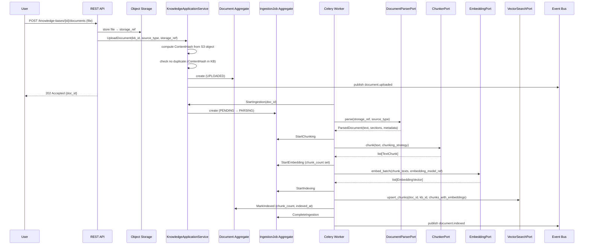

### 16.2 RAG Query During a Call Turn

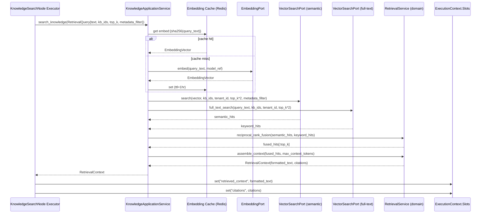

### 16.3 Workflow Publishing

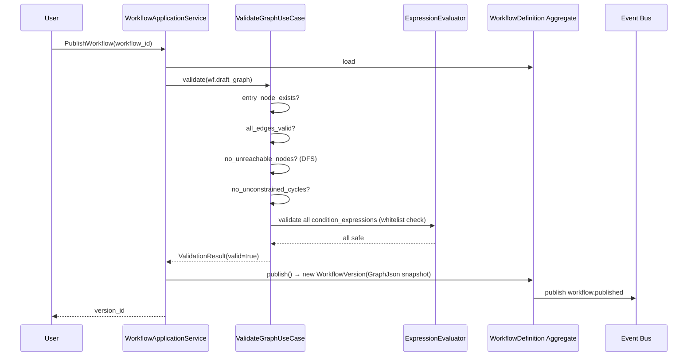

### 16.4 Workflow Execution Per Turn

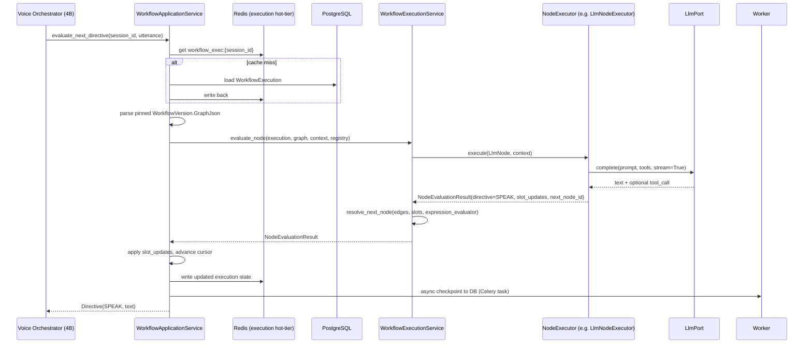

### 16.5 Conditional Workflow Branch

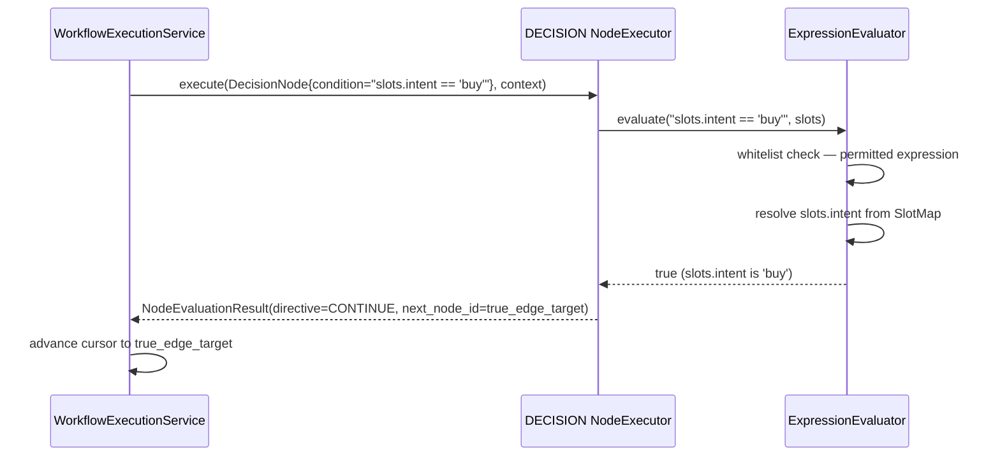

### 16.6 Prompt Versioning and Rollback

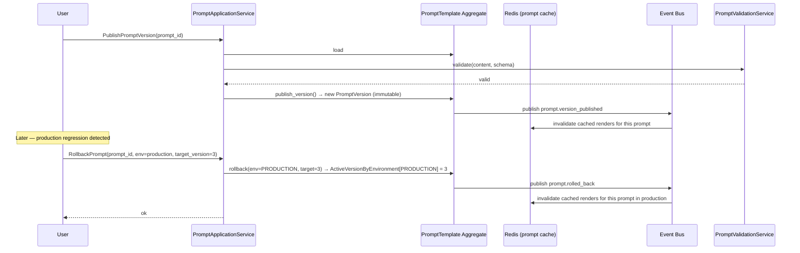

### 16.7 Conversation Memory Retrieval

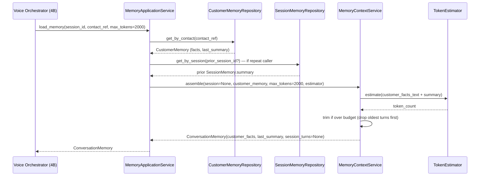

### 16.8 Memory Summary Creation (Post-Call)

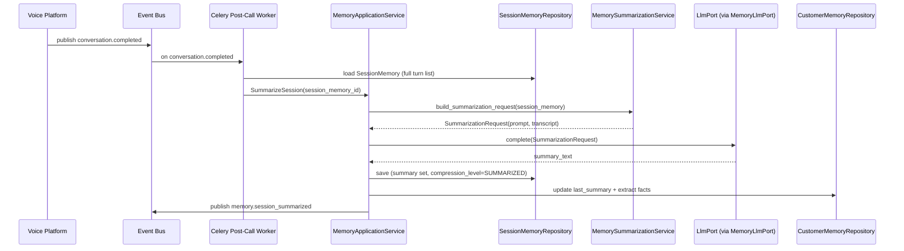

### 16.9 Tool Execution (Workflow TOOL_CALL Node)

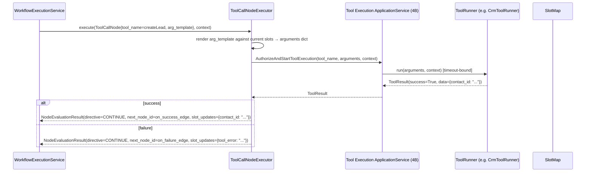

---

## 17. Domain Package Structure

```text
modules/
├── knowledge_rag/                   # Knowledge & RAG Context
│   ├── domain/
│   │   ├── aggregates/
│   │   │   ├── knowledge_base.py
│   │   │   ├── document.py
│   │   │   └── ingestion_job.py
│   │   ├── value_objects/
│   │   │   ├── identifiers.py
│   │   │   ├── kb_status.py
│   │   │   ├── document_status.py
│   │   │   ├── source_type.py
│   │   │   ├── chunking_strategy.py
│   │   │   ├── embedding_model_id.py
│   │   │   ├── embedding_vector.py
│   │   │   ├── scored_chunk.py
│   │   │   ├── retrieval_context.py
│   │   │   └── citation.py
│   │   ├── events/
│   │   │   ├── kb_events.py
│   │   │   └── document_events.py
│   │   ├── commands/
│   │   │   ├── kb_commands.py
│   │   │   └── document_commands.py
│   │   ├── services/
│   │   │   └── retrieval_service.py         # assemble_context, reciprocal_rank_fusion
│   │   └── policies/rag_policies.py
│   ├── application/
│   │   ├── use_cases/
│   │   │   ├── create_knowledge_base.py
│   │   │   ├── upload_document.py
│   │   │   ├── reprocess_document.py
│   │   │   ├── search_knowledge.py          # public face of KnowledgeSearchPort
│   │   │   └── delete_document.py
│   │   ├── queries/
│   │   │   ├── get_knowledge_base.py
│   │   │   └── list_documents.py
│   │   └── ports/
│   │       ├── knowledge_base_repository.py
│   │       ├── document_repository.py
│   │       ├── ingestion_job_repository.py
│   │       ├── embedding_port.py
│   │       ├── vector_search_port.py
│   │       ├── document_parser_port.py
│   │       ├── chunker_port.py
│   │       └── object_store_port.py
│   ├── infrastructure/
│   │   ├── models.py
│   │   ├── repositories/
│   │   │   ├── sqlalchemy_knowledge_base_repository.py
│   │   │   └── sqlalchemy_document_repository.py
│   │   ├── vector/pgvector_vector_search_adapter.py
│   │   ├── embedding/openai_embedding_adapter.py
│   │   ├── parsers/
│   │   │   ├── pdf_parser_adapter.py
│   │   │   ├── docx_parser_adapter.py
│   │   │   ├── csv_parser_adapter.py
│   │   │   ├── txt_parser_adapter.py
│   │   │   └── web_crawler_parser_adapter.py
│   │   └── chunker/fixed_size_chunker_adapter.py
│   └── interface/
│       ├── rest/router.py
│       └── events/subscribers.py
│
├── workflow_engine/                  # Workflow Context
│   ├── domain/
│   │   ├── aggregates/
│   │   │   ├── workflow_definition.py
│   │   │   └── workflow_execution.py
│   │   ├── entities/
│   │   │   ├── workflow_node.py
│   │   │   ├── workflow_edge.py
│   │   │   └── workflow_version.py
│   │   ├── value_objects/
│   │   │   ├── identifiers.py
│   │   │   ├── workflow_status.py
│   │   │   ├── execution_status.py
│   │   │   ├── node_type.py
│   │   │   ├── directive.py
│   │   │   ├── slot_map.py
│   │   │   └── edge_condition.py
│   │   ├── events/
│   │   │   ├── workflow_events.py
│   │   │   └── execution_events.py
│   │   ├── commands/
│   │   │   ├── workflow_commands.py
│   │   │   └── execution_commands.py
│   │   ├── services/
│   │   │   ├── workflow_execution_service.py    # per-turn evaluator
│   │   │   ├── expression_evaluator.py          # safe whitelist eval
│   │   │   └── graph_validator.py
│   │   └── policies/workflow_policies.py
│   ├── application/
│   │   ├── use_cases/
│   │   │   ├── create_workflow.py
│   │   │   ├── update_draft_graph.py
│   │   │   ├── publish_workflow.py
│   │   │   ├── evaluate_next_directive.py       # public face of WorkflowExecutionPort
│   │   │   └── start_execution.py
│   │   ├── queries/
│   │   │   ├── get_workflow.py
│   │   │   └── get_execution.py
│   │   └── ports/
│   │       ├── workflow_definition_repository.py
│   │       ├── workflow_execution_repository.py
│   │       └── node_executor_registry.py
│   ├── infrastructure/
│   │   ├── models.py
│   │   ├── repositories/
│   │   │   ├── sqlalchemy_workflow_definition_repository.py
│   │   │   └── sqlalchemy_workflow_execution_repository.py
│   │   ├── execution_cache.py                   # Redis hot-tier
│   │   └── node_executors/
│   │       ├── greeting_node_executor.py
│   │       ├── llm_node_executor.py
│   │       ├── decision_node_executor.py
│   │       ├── knowledge_search_node_executor.py
│   │       ├── tool_call_node_executor.py
│   │       ├── webhook_node_executor.py
│   │       └── end_call_node_executor.py
│   └── interface/
│       ├── rest/router.py
│       └── events/subscribers.py
│
├── prompt_management/               # Prompt Management Context
│   ├── domain/
│   │   ├── aggregates/
│   │   │   ├── prompt_template.py
│   │   │   └── prompt_experiment.py
│   │   ├── value_objects/
│   │   │   ├── identifiers.py
│   │   │   ├── prompt_status.py
│   │   │   ├── experiment_status.py
│   │   │   ├── prompt_variable.py
│   │   │   └── rendered_prompt.py
│   │   ├── events/prompt_events.py
│   │   ├── commands/prompt_commands.py
│   │   └── services/
│   │       ├── prompt_render_service.py
│   │       ├── prompt_validation_service.py
│   │       └── experiment_assignment_service.py
│   ├── application/
│   │   ├── use_cases/
│   │   │   ├── create_prompt_template.py
│   │   │   ├── publish_prompt_version.py
│   │   │   ├── rollback_prompt.py
│   │   │   ├── render_prompt.py                 # public face of PromptRenderPort
│   │   │   └── create_experiment.py
│   │   ├── queries/
│   │   │   └── get_prompt_template.py
│   │   └── ports/
│   │       ├── prompt_template_repository.py
│   │       └── prompt_experiment_repository.py
│   ├── infrastructure/
│   │   ├── models.py
│   │   ├── repositories/
│   │   │   └── sqlalchemy_prompt_template_repository.py
│   │   └── cache/redis_prompt_cache.py
│   └── interface/
│       ├── rest/router.py
│       └── events/subscribers.py
│
└── conversation_memory/             # Conversation Memory Context
    ├── domain/
    │   ├── aggregates/
    │   │   ├── session_memory.py
    │   │   └── customer_memory.py
    │   ├── value_objects/
    │   │   ├── identifiers.py
    │   │   ├── compression_level.py
    │   │   ├── memory_fact.py
    │   │   ├── conversation_memory.py
    │   │   └── summarization_request.py
    │   ├── events/memory_events.py
    │   ├── commands/memory_commands.py
    │   └── services/
    │       ├── memory_context_service.py
    │       └── memory_summarization_service.py
    ├── application/
    │   ├── use_cases/
    │   │   ├── load_memory.py              # public face of ConversationMemoryPort.load()
    │   │   ├── append_turn.py              # public face of ConversationMemoryPort.append_turn()
    │   │   └── summarize_session.py        # async post-call
    │   ├── queries/get_customer_memory.py
    │   └── ports/
    │       ├── session_memory_repository.py
    │       ├── customer_memory_repository.py
    │       └── memory_llm_port.py          # → LLM Router (summarization)
    ├── infrastructure/
    │   ├── models.py
    │   ├── repositories/
    │   │   ├── sqlalchemy_session_memory_repository.py
    │   │   └── sqlalchemy_customer_memory_repository.py
    │   ├── hot_tier/redis_session_memory.py
    │   └── llm/memory_llm_adapter.py      # calls LLM Provider Router's public use case
    └── interface/
        ├── rest/router.py
        └── events/subscribers.py          # conversation.completed → summarize_session
```

---

## 18. Persistence Identification

| Aggregate | Store | Access Patterns | Notes |
|---|---|---|---|
| `KnowledgeBase` | PostgreSQL | By KbId, by tenant | Small per org (~hundreds) |
| `Document` | PostgreSQL | By KbRef, by status, by content_hash | Partition by kb_id recommended at scale |
| `IngestionJob` | PostgreSQL | By DocumentRef, by status | Auto-purge COMPLETED jobs after 30d |
| `WorkflowDefinition` | PostgreSQL | By WorkflowId, by tenant | GraphJson in JSONB; versions list in JSONB |
| `WorkflowExecution` | PostgreSQL + Redis | By SessionRef — Redis hot-tier during call | Checkpoint per turn; Redis cleared on call end |
| `PromptTemplate` | PostgreSQL | By PromptId, by name | Versions in JSONB; active env map in JSONB |
| `PromptExperiment` | PostgreSQL | By PromptRef, by status | Experiment assignments in Redis |
| `SessionMemory` | Redis (turns, hot) + PostgreSQL (summary) | By SessionRef | Redis key: `session_memory:{session_id}`, turns as RLIST |
| `CustomerMemory` | PostgreSQL | By ContactRef, by tenant | Small — max ~100 facts per contact |
| Document Chunks + Embeddings | pgvector (`document_chunks`) | By vector ANN, by kb_id + tenant_id, by FTS | Phase 5 must specify HNSW index parameters |

---

## 19. Cross-Domain Communication

| This domain | Other domain | Direction | Mechanism |
|---|---|---|---|
| Workflow Engine | Voice Platform (4B) | Workflow supplies | `WorkflowExecutionPort` — `evaluate_next_directive()` |
| Prompt Management | Voice Platform (4B) | Prompt supplies | `PromptRenderPort` — `render()` |
| Conversation Memory | Voice Platform (4B) | Memory supplies | `ConversationMemoryPort` — `load()` / `append_turn()` |
| Knowledge & RAG | Voice Platform (4B) | KB supplies | `KnowledgeSearchPort` — `search()` via tool runner |
| Workflow Engine | Tool Execution (4B) | Workflow invokes tools | `ToolCallNodeExecutor` calls `AuthorizeAndStartToolExecution` |
| Workflow Engine | CRM (4C) | Workflow triggers CRM actions | Tool runners for CRM tools |
| Workflow Engine | Campaign Engine (4D) | Workflow triggers campaigns | ACL adapter wrapping `StartCampaign` use case |
| Knowledge & RAG | Analytics (Phase 4F) | KB publishes | `document.indexed`, `kb.reindex_completed` |
| Workflow Engine | Analytics (Phase 4F) | Workflow publishes | `workflow.execution_completed`, `workflow.node_entered` |
| Prompt Management | Analytics (Phase 4F) | PM publishes | `experiment.assigned`, `prompt.rolled_back` |
| All contexts | Audit (4A) | All publish | Audit subscriber consumes all domain events |
| All contexts | Billing (Phase 4F) | All publish | `workflow.execution_completed` (LLM tokens), `document.indexed` (embedding cost) |
| Memory | CRM (4C) | Memory informs CRM | `memory.session_summarized` → CRM creates AI_SUMMARY Note |

---

## 20. Domain Decision Records

### DDR-4E-001: RAG Is Not a Separate Bounded Context

**Decision:** RAG (query, retrieval, ranking, context assembly) is a set of domain services within the Knowledge & RAG bounded context, not a separate context.

**Rationale:** RAG has no aggregate of its own — it orchestrates objects (`Document`, `DocumentChunk`, `EmbeddingVector`) that already belong to the Knowledge context. Splitting RAG out would create a context with no aggregate root and a constant dependency on another context's internal objects — the strongest DDD signal for a wrong boundary.

---

### DDR-4E-002: WorkflowExecution Cursor Is Checkpointed Per Turn, Not Per Node-Step

**Decision:** `WorkflowExecution` is checkpointed to Postgres at the end of each completed Turn (when the Voice Orchestrator has received its Directive), not at every internal node traversal.

**Rationale:** a single Turn may traverse multiple Nodes (Greeting → Decision → LLM). Checkpointing every node step adds Postgres writes without providing meaningful recovery points — if a pod dies mid-node-traversal, the natural recovery is to re-run the full Turn from the last turn checkpoint. The only cost is one Turn's worth of repeated computation on recovery, which is acceptable.

---

### DDR-4E-003: Embedding Model Is Immutable Per Knowledge Base

**Decision:** `EmbeddingModelRef` cannot be changed after a Knowledge Base is created. Changing models requires a new Knowledge Base + full re-ingestion.

**Rationale:** vectors in the index and query-time embedding vectors must be produced by the same model — different models produce geometrically incomparable vectors. A partial migration (some chunks from model A, some from model B) would produce incoherent search results. The invariant enforces this constraint at the domain level before it causes a subtle data quality bug in production.

---

### DDR-4E-004: Prompt Version Content Is Immutable

**Decision:** a `PromptVersion` once published cannot be modified. Editing creates a new draft, publishing creates a new version.

**Rationale:** A/B experiment integrity depends on immutable versions — if a version's content could change, the experiment's assignment history would be meaningless. Rollback also depends on immutability — "roll back to version 3" must mean "restore exactly what version 3 said," not "what version 3 says now."

---

### DDR-4E-005: Session Memory Turn Appends Are Fire-and-Forget to Redis

**Decision:** `append_turn()` (implementing `ConversationMemoryPort`) writes to Redis only (RPUSH), not to Postgres, during the call. Postgres persistence of the full turn list is deferred to the post-call worker via `conversation.completed`.

**Rationale:** `append_turn()` is called after every Turn — potentially dozens of times per call. A Postgres write after every turn on a high-concurrency platform (tens of thousands of concurrent calls) would add significant database pressure with no benefit: the in-call turn list is not read by anything except the memory context assembler, which reads from Redis anyway. The maximum loss on pod death is one in-flight turn (not yet appended) — identical to the Conversation aggregate's own checkpoint policy.

---

### DDR-4E-006: Expression Safety Is Enforced at Both Publish and Runtime

**Decision:** workflow condition expressions are validated by the whitelist-based `ExpressionEvaluator` at publish time (by `ValidateGraphUseCase`) AND at runtime (by the DECISION/CONDITION node executor).

**Rationale:** a malicious or buggy actor may submit a workflow graph directly to the storage layer, bypassing the publish validation. The runtime check ensures that even a tampered `GraphJson` cannot execute unsafe expressions. This is defence-in-depth on the highest-risk user-authored input surface.

---

## 21. Architectural Trade-offs

| Trade-off | Choice | Cost | Benefit |
|---|---|---|---|
| Embedding model pinned at KB creation | New KB required to change models | Operational friction for model upgrades | No silent vector incompatibility |
| RRF fusion in domain | Pure function, no infrastructure dependency | Slightly more complex domain code | Ranking strategy is a testable business decision |
| Workflow execution checkpointed per turn, not per node | Up to one turn re-run on crash recovery | Node-level granularity not auditable | Fewer Postgres writes on the hot path |
| Prompt content immutable after publish | No in-place corrections possible | Must publish a new version to fix a typo | A/B and rollback integrity preserved |
| Session memory turns in Redis, not Postgres during call | Turn list lost on Redis failure (1 turn max) | Brief gap in post-call summary | Postgres not on the per-turn hot path |
| Expression evaluator whitelist | Cannot use arbitrary Python | Limits expressiveness of conditions | Prompt injection via workflow expressions is impossible |
| Four bounded contexts instead of seven | Fewer context boundaries to manage | RAG, Document, and Tools are "merged" | Avoids anemic contexts with no real aggregate |

---

## 22. Risks

| Risk | Likelihood | Impact | Mitigation |
|---|---|---|---|
| Embedding model deprecated by provider | Medium | High — existing KB vectors become orphaned | `EmbeddingModelRef` is a stable identifier; platform supports a re-index migration path |
| Workflow graph cycle causes infinite loop | Low | High — call never completes | `TurnCountAtNode` invariant + `max_turns` enforcement; also `EndAt` timeout on the Call level (Phase 4B) |
| Condition expression injection (malicious workflow) | Low | High | Whitelist evaluator at publish AND runtime (DDR-4E-006) |
| pgvector HNSW index degradation on high-insert rate | Medium | Medium — retrieval quality degrades | Bulk ingestion + offline rebuild strategy (Phase 5) |
| Memory summarization LLM failure post-call | Medium | Low — summary missing, raw turns retained | Celery retry; call still usable without summary |
| Large document causes chunking OOM | Low | Medium | Document size limit enforced at upload (max configurable, default 50 MB) |

---

## 23. Open Questions

| # | Question | Owner | Blocks |
|---|---|---|---|
| OQ-4E-01 | Which embedding models are approved for use at launch? (Review Note 3 from Phase 3D carried forward) | Product / Architecture | `EmbeddingModelId` whitelist, `EmbeddingPort` adapter selection |
| OQ-4E-02 | Should hybrid search weights (semantic vs. keyword split in RRF) be configurable per Knowledge Base or per query? | Product | `RetrievalService.reciprocal_rank_fusion` signature |
| OQ-4E-03 | Should `WorkflowExecution.NodeExecutionHistory` be stored for all calls (debug/audit) or only on error? | Product | Postgres storage volume estimate |
| OQ-4E-04 | What is the maximum number of active A/B experiments per Prompt per tenant? | Product | `PromptExperiment` invariant |
| OQ-4E-05 | Should CustomerMemory facts have an expiry (e.g., "caller name" valid for 1 year; "appointment preference" valid for 3 months)? | Product | `MemoryFact` value object TTL field |
| OQ-4E-06 | Should the Workflow Builder node type `WEBHOOK` support async (fire-and-forget) and sync (await response) modes? Currently only sync is modelled. | Product | `WebhookNodeExecutor` timeout/await strategy |
| OQ-4E-07 | When a Workflow reaches an `END_CALL` node with `qualification_outcome = QUALIFIED`, does this automatically trigger `SetQualificationStatus` in CRM, or does that happen only via the Voice Platform's `conversation.qualification_set` event? | Architecture | Avoid duplicate qualification signals |

---

## 24. Dependencies on Other Bounded Contexts

| Dependency | Direction | What Phase 4E needs |
|---|---|---|
| Identity / Auth (Phase 4A) | Upstream | `TenantId`, `UserId`, `Permission`, `CheckPermission` OHS, `FeatureFlagEvaluationService`, `DomainEvent` envelope |
| Voice Platform (Phase 4B) | Upstream — consumes this domain's ports | `WorkflowExecutionPort`, `PromptRenderPort`, `ConversationMemoryPort`, `KnowledgeSearchPort` |
| Tool Execution (Phase 4B) | Phase 4E Workflow calls Phase 4B tools | `ToolCallNodeExecutor` calls `AuthorizeAndStartToolExecution` |
| CRM (Phase 4C) | Phase 4E publishes memory summary | `memory.session_summarized` → CRM creates Note |
| Campaign (Phase 4D) | Phase 4E Workflow may trigger | `StartCampaign` via ACL (OQ-4D-03 resolution) |
| Audit (Phase 4A) | Phase 4E publishes → Audit consumes | All domain events |
| Analytics (Phase 4F) | Phase 4E publishes → Analytics consumes | KB and Workflow execution events |
| Billing (Phase 4F) | Phase 4E publishes → Billing consumes | Embedding API cost events, LLM cost via Workflow |

---

## 25. What Phase 4F Must Consume From This Design

Phase 4F (Analytics, Billing, Observability DDD — if designed) must:

1. **Consume `workflow.execution_completed`** for Analytics and Billing — this event carries the LLM token usage for the entire session's workflow, enabling per-call cost calculation.

2. **Consume `document.indexed`** for Analytics — document count and embedding API cost tracking.

3. **Consume `prompt.experiment_activated` and `prompt.version_published`** for Analytics — A/B experiment tracking requires knowing when experiments were active.

4. **Use `WorkflowId`, `WorkflowVersionId`, `ExecutionId`, `DocumentId`, `KnowledgeBaseId`, `PromptId`, `PromptVersionId`** as defined in this document.

5. **Never import domain objects from these four contexts directly** — reference by ID value objects only, via events or query use cases.

---

## 26. Consistency Checks Against Phase 3 LLD and Phase 4A–4D

| Prior design | Phase 4E DDD | Consistent? | Notes |
|---|---|---|---|
| 3D §5.3 — `WorkflowDefinition` with `SnapshotJson`, embedded Versions | §5.1 `WorkflowDefinition` aggregate — same structure | ✅ | |
| 3D §6.2 — `NodeExecutorRegistry` + open/closed extension | §5.4 `WorkflowExecutionService` delegates to `NodeExecutorRegistry` | ✅ | |
| 3D §6.3 — Two-tier execution state: Redis hot + Postgres per-turn checkpoint | §18 Persistence: `WorkflowExecution` Redis + Postgres | ✅ | |
| 3D §7.3 — Prompt render cache keyed on `version_id + variable_hash` | §14.3 `render_prompt` application service — same caching strategy | ✅ | |
| 3D §7.4 — A/B assignment: `hashlib.md5(session_id)` deterministic | §6.2 `ExperimentAssignmentService.assign()` — deterministic consistent hashing | ✅ Formalised | Domain service makes the determinism guarantee explicit |
| 3D §8.2 — `SessionMemory` + `CustomerMemory` separate aggregates | §8.1 — same two aggregates | ✅ | |
| 3D §8.5 — `append_turn()` fire-and-forget to Redis | DDR-4E-005 — confirmed and explained | ✅ Explicit rationale added | |
| 3D §9.3 — `EmbeddingPort` with `dimensions()` | §4.4 `EmbeddingPort` protocol — same interface | ✅ | |
| 3D §9.4 — pgvector HNSW + partial index on `(tenant_id, kb_id)` | §4.4 `VectorSearchPort` — impl in `pgvector_vector_search_adapter.py`; indexing is infrastructure, not domain | ✅ | |
| 3D §9.5 — RRF in `SearchUseCase` | §4.4 `RetrievalService.reciprocal_rank_fusion()` — promoted to domain service | ✅ Elevated | Correct layer — business rule, not application orchestration |
| 3D §5.5 — Expression safety: whitelist at publish AND runtime | §5.3 + DDR-4E-006 | ✅ Reinforced | |
| 4B §16 — Five port definitions: `WorkflowExecutionPort`, `PromptRenderPort`, `ConversationMemoryPort`, `KnowledgeSearchPort`, `LlmPort` | §4.4, §14.1–14.4 — all five implemented in this document's application services | ✅ | |
| 4B Review Note 1 — Workflow per-turn invocation resolved | §5.4 `WorkflowExecutionService.evaluate_node()` called per turn | ✅ Resolved | 4B Review Note 1 is now fully resolved |
| 4B Review Note 6 — Tool Calling cross-module sync calls must use target module's public use case | §16.9 — `ToolCallNodeExecutor` calls `AuthorizeAndStartToolExecution` use case | ✅ | |
| 3D Review Note 3 — Embedding provider not named | OQ-4E-01 — still open, properly forwarded | ⚠️ Still open | Must be resolved before Phase 24 |
| 4B DDR-4B-001 — Call and Conversation separate aggregates | Not redesigned — reused by reference | ✅ | |
| 4D OQ-4D-03 — Recurring campaign triggered by Workflow | §22 cross-domain: Workflow → Campaign via ACL | ✅ Partial | Mechanism defined; recurrence rule format still OQ-4D-03 in 4D |
