# Phase 4F — Domain-Driven Design: Billing, Usage, Integrations, Webhooks & Plugins

| | |
|---|---|
| **Roadmap phase** | Phase 4 (Domain-Driven Design) — sub-phase 4F |
| **Status** | Draft v1.0, for review |
| **Source of truth (approved, not redesigned here)** | Phase 1 SRS, Phase 2 HLA, Phase 3A–3F LLD, Phase 4A–4E DDD |
| **Scope** | Billing, Subscription, Usage Metering, Cost Tracking, Quotas, Integrations, Webhooks, Plugin SDK, API Access |
| **Deployment architecture reaffirmed** | Phase 2's modular-monolith-of-bounded-contexts decision stands — bounded contexts here are domain boundaries, not deployment boundaries |

---

## 0. How to Read This Document

This document is the authoritative domain design for the commercial platform layer and the extensibility platform. It is written for all engineering disciplines. It does not generate code.

**Deployment architecture note (from the prompt's requirement):** every context designed here is a bounded context — a domain boundary with its own ubiquitous language, aggregates, and invariants. None of them are automatically microservices. They are modules within the same two deployables (`apps/api` and `apps/worker`) established in Phase 2 and 3A. The module-boundary enforcement from Phase 3A §2.3 (import-linter CI gate) is what makes them real boundaries, not separate processes.

**Relationship to Phase 4A:** API Keys were introduced in Phase 4A as an `ApiKey` aggregate in the Identity & Authorization context. Phase 4F extends that with `APIKeyUsage` tracking (a separate aggregate here), without contradicting Phase 4A's design.

**Relationship to 3E:** Webhook Engine was designed structurally in Phase 3E §7. This document supplies the full DDD treatment that 3E's infrastructure design implements.

---

## 1. Ubiquitous Language

| Term | Definition | Never call it |
|---|---|---|
| **Billing Account** | The commercial entity attached to an Organisation that owns all financial records — subscriptions, invoices, payments. One per Organisation. | "account", "customer account" |
| **Subscription** | An Organisation's current commercial agreement — which Plan they are on, when it renews, and what it costs | "plan", "contract", "licence" |
| **Plan** | A product configuration that defines what a Subscription grants — included features, default Quotas, base price | "tier", "package", "product" |
| **Plan Version** | An immutable snapshot of a Plan at a point in time — a Subscription always references the Plan Version active when it was created or last changed | "pricing version", "plan snapshot" |
| **Subscription Item** | A line within a Subscription — base plan item plus any add-ons (extra phone numbers, additional seats, etc.) | "add-on", "line item" |
| **Invoice** | A formal record of charges for one billing cycle — generated at cycle end, payable by the customer | "bill", "statement" |
| **Invoice Line** | One charge within an Invoice — base plan fee, a usage overage, or a one-time item | "charge", "line item" |
| **Credit** | A negative-value adjustment applied to an Invoice — a refund credit, promotional credit, or error correction | "discount", "refund credit" |
| **Payment** | A successful settlement of an Invoice — records the amount, method, and timestamp | "charge", "transaction" |
| **Payment Attempt** | One try to charge a payment method — may succeed or fail | "charge attempt", "payment try" |
| **Payment Method** | A stored payment instrument (card, bank account) — represented in the domain by a `PaymentMethodRef` (an opaque token from the payment gateway) | "card", "bank account" |
| **Usage Event** | A domain-level record that something billable happened — a call was completed, tokens were consumed, an API request was made | "billing event", "metered event" |
| **Usage Record** | The aggregated total of a `UsageMetric` for an Organisation within a `UsagePeriod` — the source of truth for overage calculation | "usage total", "metered usage" |
| **Usage Metric** | The named dimension of consumption being tracked — e.g., `CALL_MINUTES`, `LLM_TOKENS`, `STT_SECONDS` | "metric", "dimension" |
| **UsagePeriod** | The time window over which usage is aggregated — aligned to the billing cycle (monthly by default) | "billing period", "metering window" |
| **Cost Entry** | A record of what the platform paid a provider for a specific unit of consumption — the platform's cost, not the customer's price | "provider cost", "cost record" |
| **Provider Cost** | The unit price the platform pays a provider (e.g., $0.0001 per LLM token to OpenAI) | "API cost", "wholesale cost" |
| **Customer Price** | What the platform charges the customer for the same unit — includes markup and margin | "retail price", "billed price" |
| **Margin** | `(Customer Price - Provider Cost) / Customer Price × 100%` — the platform's profit on a unit of consumption | "profit margin", "markup" |
| **Quota** | A ceiling on a specific UsageMetric — enforced before consumption to prevent overuse | "limit", "cap", "throttle" |
| **Quota Violation** | An attempt to consume beyond the Quota — results in a rejection of the initiating operation | "quota exceeded", "over limit" |
| **Integration** | A configured connection from a Tenant to an external system (Salesforce, Google Calendar, WhatsApp Business, etc.) | "connector", "connection", "integration app" |
| **IntegrationDefinition** | A platform-level descriptor of a supported integration — its name, capabilities, required credentials, and OAuth scopes. Immutable platform data. | "connector definition", "integration manifest" |
| **IntegrationConnection** | A Tenant's specific configured instance of an IntegrationDefinition — carries credential references and sync state | "integration instance", "connection record" |
| **IntegrationCapability** | A named action that an Integration supports — e.g., `crm.contact.create`, `calendar.event.book` | "feature", "action" |
| **CredentialRef** | An opaque reference to a secret stored in the secret manager — never the secret value itself in the domain | "token reference", "key reference" |
| **Webhook** | A subscription from a Tenant to a specific event topic — instructs the platform to HTTP-POST event payloads to an external URL | "callback", "outbound hook" |
| **WebhookDelivery** | One HTTP delivery attempt of a specific payload to a Webhook endpoint | "delivery attempt", "webhook call" |
| **Dead Letter** | A WebhookDelivery that has exhausted all retry attempts without a 2xx response | "failed delivery", "undelivered event" |
| **Plugin** | A third-party extension registered with the platform that adds capabilities (new tools, new integration adapters, new LLM providers) via the Plugin SDK | "extension", "app", "add-on" |
| **PluginManifest** | The declarative specification of a Plugin — its capabilities, required permissions, and the HTTP endpoint it exposes | "plugin spec", "plugin definition" |
| **PluginInstallation** | A Tenant's activated instance of a Plugin — carries the Plugin's configuration for that tenant | "plugin instance", "installed app" |
| **Plugin Capability** | What a Plugin is allowed to do — `CRM_CONNECTOR`, `TOOL_PROVIDER`, `PAYMENT_GATEWAY`, `KNOWLEDGE_PROVIDER`, `NOTIFICATION_PROVIDER`, `LLM_PROVIDER` | "plugin type", "capability" |

---

## 2. Bounded Context Analysis

### 2.1 Why Five Contexts, Not Ten

The prompt asks us to evaluate ten potential contexts. The correct boundary count is **five**, not ten.

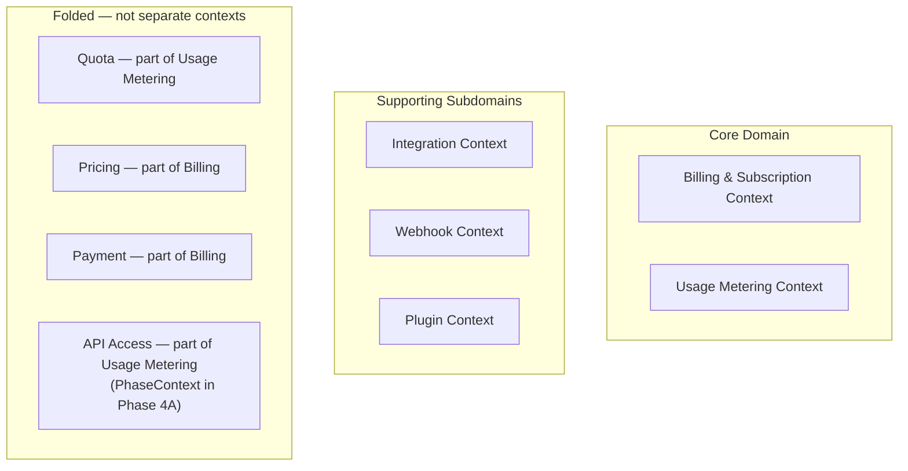

**Billing and Subscription merge:** a Subscription only exists within a BillingAccount. Plans, PlanVersions, Invoices, Credits, Payments, and PaymentAttempts all exist to fulfil the Subscription contract. The same domain expert (a billing engineer) owns all of these. Separating them creates an artificial boundary with constant cross-context calls and no corresponding language disagreement.

**Pricing folds into Billing:** Pricing is how Plans are structured — it is a sub-model of the Plan aggregate, not an independent context.

**Payment folds into Billing:** Payment is a state of the Invoice — the lifecycle of a bill from generated to paid. The Invoice aggregate carries Payment and PaymentAttempt as subordinate entities.

**Quota folds into Usage Metering:** a Quota only makes sense in relation to a UsageMetric — it is a ceiling on a metric. The same event (QuotaExceeded) that is the Quota's most important output is the Usage system's responsibility to raise.

**API Access:** Phase 4A already owns the `ApiKey` aggregate in the Identity & Authorization context. Phase 4F adds `APIKeyUsage` (a usage metering concern) — it does not create a new "API Access" context. That would violate Phase 4A's established design.

---

## 3. Context Map

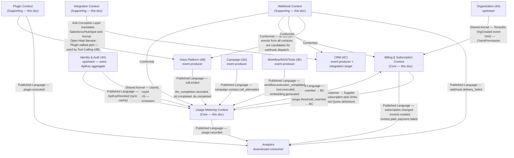

---

## 4. Billing & Subscription Context

### 4.1 BillingAccount Aggregate

**Aggregate Root:** `BillingAccount`

**Rationale:** one BillingAccount per Organisation — it is the container for all financial state. The Subscription, current Invoice, and payment methods are all subordinate to the BillingAccount's lifecycle.

```
BillingAccount (AggregateRoot)
├── BillingAccountId             (Value Object — UUIDv7)
├── OrganizationRef              (Value Object — OrganizationId — 1:1, immutable)
├── TenantId                     (Value Object)
├── BillingStatus                (Value Object — BillingStatus enum — see §4.1.1)
├── ActiveSubscriptionRef        (Value Object — nullable SubscriptionId)
├── DefaultPaymentMethodRef      (Value Object — nullable PaymentMethodRef — opaque gateway token)
├── BillingEmail                 (Value Object — EmailAddress)
├── BillingAddress               (Value Object — PostalAddress)
├── Currency                     (Value Object — ISO 4217 — set at creation, immutable)
├── CreditBalance                (Value Object — Money — sum of unapplied credits)
├── GracePeriodEndsAt            (Value Object — nullable datetime — on PAST_DUE status)
└── CreatedAt                    (Value Object — datetime)
```

**§4.1.1 BillingStatus:**
`HEALTHY | PAST_DUE | SUSPENDED | CANCELLED`

**Invariants:**
1. `Currency` is immutable after creation — all financial records for this account use the same currency.
2. `CreditBalance` is non-negative — credits cannot produce a negative balance.
3. A `SUSPENDED` BillingAccount's Organisation has all API calls rejected by the quota enforcement layer.
4. `GracePeriodEndsAt` is only set when `BillingStatus = PAST_DUE` — it is null for all other statuses.

**Commands:** `CreateBillingAccount`, `UpdateBillingContact`, `ApplyCredit`, `SuspendBillingAccount`, `ReactivateBillingAccount`
**Domain Events:** `BillingAccountCreated`, `CreditApplied`, `BillingAccountSuspended`, `BillingAccountReactivated`

---

### 4.2 Subscription Aggregate

**Aggregate Root:** `Subscription`

```
Subscription (AggregateRoot)
├── SubscriptionId               (Value Object — UUIDv7)
├── BillingAccountRef            (Value Object — BillingAccountId)
├── TenantId                     (Value Object)
├── PlanVersionRef               (Value Object — PlanVersionId — pinned at subscription creation)
├── Status                       (Value Object — SubscriptionStatus — see §7.1)
├── Items                        (list[SubscriptionItem] — embedded, bounded, ≤ 20 add-ons)
│   └── SubscriptionItem (Entity)
│       ├── ItemId               (Value Object — UUIDv7)
│       ├── ItemType             (Value Object — BASE | ADDON)
│       ├── PriceRef             (Value Object — PriceId)
│       └── Quantity             (Value Object — integer ≥ 1)
├── CurrentPeriodStart           (Value Object — date)
├── CurrentPeriodEnd             (Value Object — date)
├── TrialEndsAt                  (Value Object — nullable date)
├── CancelledAt                  (Value Object — nullable datetime)
├── CancellationReason           (Value Object — nullable string)
├── ScheduledChange              (Value Object — nullable ScheduledChange — pending upgrade/downgrade)
│   └── ScheduledChange
│       ├── NewPlanVersionRef    (Value Object — PlanVersionId)
│       └── EffectiveAt          (Value Object — date — applied at next period renewal)
└── CreatedAt                    (Value Object — datetime)
```

**Invariants:**
1. `PlanVersionRef` is pinned at subscription creation and only changes on an explicit plan change (never silently).
2. `ScheduledChange` is applied exactly once at the start of the next billing period — it is then cleared.
3. A `CANCELLED` Subscription is terminal — it cannot be reactivated. A new subscription must be created.
4. `CurrentPeriodEnd > CurrentPeriodStart` — always.
5. `TrialEndsAt`, if set, must be after `CreatedAt` and before the first `CurrentPeriodEnd`.

**Business Rules:**
- Upgrade (move to a higher plan): if applied mid-period, the platform issues a prorated Credit for the unused portion of the current plan and charges the new plan immediately. Modelled as `CancelCurrent + CreateNew` within a single Unit of Work, not a mutation of the Subscription aggregate.
- Downgrade (move to a lower plan): scheduled for the next period via `ScheduledChange` — the customer keeps the higher plan until the current period ends.
- Cancellation: effective at the end of the current period (standard) or immediately (for suspended accounts). Both transitions are captured in `CancelledAt`.

**Commands:** `CreateSubscription`, `ChangePlan`, `ScheduleDowngrade`, `ApplyScheduledChange`, `CancelSubscription`, `RenewSubscription`
**Domain Events:** `SubscriptionCreated`, `PlanChanged`, `DowngradeScheduled`, `SubscriptionRenewed`, `SubscriptionCancelled`, `TrialEnded`

---

### 4.3 Plan Aggregate

**Aggregate Root:** `Plan`

```
Plan (AggregateRoot)
├── PlanId                       (Value Object — UUIDv7)
├── Name                         (Value Object — e.g. "Starter", "Growth", "Enterprise")
├── IsActive                     (Value Object — boolean — inactive plans accept no new subs)
├── Versions                     (list[PlanVersion] — embedded, bounded, ~< 20 per plan)
│   └── PlanVersion (Entity)
│       ├── VersionId            (Value Object — PlanVersionId)
│       ├── VersionNumber        (Value Object — integer, monotonic)
│       ├── BasePrice            (Value Object — Money — per billing cycle)
│       ├── BillingCycle         (Value Object — BillingCycle — MONTHLY | ANNUAL)
│       ├── IncludedQuotas       (Value Object — dict[QuotaMetric, QuotaLimit])
│       ├── OverageRates         (Value Object — dict[QuotaMetric, Money per unit] — nullable per metric)
│       ├── Features             (Value Object — frozenset[FeatureKey])
│       └── EffectiveFrom        (Value Object — date)
└── CreatedAt                    (Value Object — datetime)
```

**Invariants:**
1. A `PlanVersion` is immutable once published — price changes require a new version.
2. `IncludedQuotas` and `OverageRates` define the contract for metering — they cannot be changed retroactively for existing subscriptions.
3. A Plan with active Subscriptions cannot be deactivated until all subscriptions are moved or cancelled.

**Commands:** `CreatePlan`, `PublishPlanVersion`, `DeactivatePlan`
**Domain Events:** `PlanCreated`, `PlanVersionPublished`, `PlanDeactivated`

---

### 4.4 Invoice Aggregate

**Aggregate Root:** `Invoice`

```
Invoice (AggregateRoot)
├── InvoiceId                    (Value Object — UUIDv7)
├── BillingAccountRef            (Value Object — BillingAccountId)
├── SubscriptionRef              (Value Object — SubscriptionId)
├── TenantId                     (Value Object)
├── PeriodStart                  (Value Object — date)
├── PeriodEnd                    (Value Object — date)
├── Status                       (Value Object — InvoiceStatus — see §7.2)
├── Lines                        (list[InvoiceLine] — embedded)
│   └── InvoiceLine (Entity)
│       ├── LineId               (Value Object — UUIDv7)
│       ├── LineType             (Value Object — BASE_FEE | OVERAGE | CREDIT | ADJUSTMENT)
│       ├── Description          (Value Object — string)
│       ├── Quantity             (Value Object — Decimal)
│       ├── UnitPrice            (Value Object — Money)
│       └── LineTotal            (Value Object — Money — Quantity × UnitPrice)
├── SubTotal                     (Value Object — Money — sum of BASE_FEE + OVERAGE lines)
├── TotalCredits                 (Value Object — Money — sum of CREDIT lines, non-negative)
├── TotalDue                     (Value Object — Money — SubTotal - TotalCredits)
├── PaymentAttempts              (list[PaymentAttempt] — embedded, bounded)
│   └── PaymentAttempt (Entity)
│       ├── AttemptId            (Value Object — UUIDv7)
│       ├── AttemptedAt          (Value Object — datetime)
│       ├── Amount               (Value Object — Money)
│       ├── PaymentMethodRef     (Value Object — PaymentMethodRef)
│       ├── GatewayRef           (Value Object — opaque gateway transaction ID)
│       └── Outcome              (Value Object — PaymentOutcome — SUCCEEDED | FAILED | PENDING)
├── PaidAt                       (Value Object — nullable datetime)
└── DueAt                        (Value Object — date)
```

**Invariants:**
1. `TotalDue = SubTotal - TotalCredits` — always computed, never set directly.
2. A PAID Invoice is immutable — no lines can be added or removed.
3. `TotalDue` must be ≥ 0 — credits cannot reduce an invoice below zero (excess credit goes to `BillingAccount.CreditBalance`).
4. `PaymentAttempt` may be added to a DRAFT or OPEN invoice only — not to a VOID or PAID invoice.
5. `Lines` must include exactly one `BASE_FEE` line per Subscription Item.

**Commands:** `GenerateInvoice`, `AddOverageLine`, `AddCreditLine`, `FinalizeInvoice`, `AttemptPayment`, `MarkPaid`, `VoidInvoice`
**Domain Events:** `InvoiceGenerated`, `OverageLineAdded`, `InvoiceFinalized`, `PaymentAttempted`, `PaymentSucceeded`, `PaymentFailed`, `InvoiceVoided`

---

### 4.5 Billing Domain Services

```python
class OverageCalculationService:
    """
    Given a UsagePeriod's UsageRecords and the active PlanVersion's IncludedQuotas,
    computes the list of overage Invoice Lines.

    Pure function — receives pre-loaded data.
    Called by the invoice generation application service.
    """
    def calculate_overages(
        self,
        usage_records: list[UsageRecord],
        plan_version: PlanVersion,
        period: UsagePeriod,
    ) -> list[InvoiceLine]: ...

class ProratedCreditService:
    """
    Computes the prorated credit when a customer upgrades mid-period.
    Credit = (days_remaining / days_in_period) × current_plan_base_price.
    Pure function.
    """
    def compute_credit(
        self,
        current_plan: PlanVersion,
        period: UsagePeriod,
        upgrade_at: date,
    ) -> Money: ...

class MarginAnalysisService:
    """
    Computes profit margin for an Organisation over a period.
    Margin = (billed_amount - provider_costs) / billed_amount × 100.
    Pure function — receives pre-loaded aggregates.
    """
    def compute_margin(
        self,
        invoice: Invoice,
        cost_entries: list[CostEntry],
    ) -> MarginResult: ...
```

---

## 5. Usage Metering Context

### 5.1 UsageRecord Aggregate

**Aggregate Root:** `UsageRecord`

**Rationale:** one UsageRecord per (TenantId, UsageMetric, UsagePeriod) triple. It accumulates the running total of a metric for the period. It is the system of record for billing and quota enforcement. The per-event `UsageEvent` records are write-once; the `UsageRecord` is the aggregate they contribute to.

```
UsageRecord (AggregateRoot)
├── UsageRecordId                (Value Object — composite: TenantId + Metric + PeriodStart)
├── TenantId                     (Value Object)
├── Metric                       (Value Object — UsageMetric enum — see §5.1.1)
├── Period                       (Value Object — UsagePeriod — start_date + end_date)
├── Quantity                     (Value Object — Decimal — accumulated total)
├── UnitLabel                    (Value Object — string — e.g. "minutes", "tokens", "requests")
├── LastEventAt                  (Value Object — datetime — timestamp of most recent contributing event)
└── UpdatedAt                    (Value Object — datetime)
```

**§5.1.1 UsageMetric Enumeration:**
`CALL_MINUTES | STT_SECONDS | TTS_CHARACTERS | LLM_PROMPT_TOKENS | LLM_COMPLETION_TOKENS | EMBEDDING_TOKENS | API_REQUESTS | STORAGE_GB | CAMPAIGN_CALLS | WORKFLOW_EXECUTIONS | TOOL_EXECUTIONS | KNOWLEDGE_RETRIEVALS | ACTIVE_AGENTS | ACTIVE_PHONE_NUMBERS`

**Invariants:**
1. `Quantity` is non-decreasing within a period — usage is never subtracted (corrections use a separate `UsageAdjustment` record).
2. `UsageRecordId` uniqueness is composite — only one record per (TenantId, Metric, PeriodStart).
3. At period rollover, a new `UsageRecord` is created with `Quantity = 0` — the old record is preserved for billing.

**Commands:** `IncrementUsage`, `AdjustUsage`
**Domain Events:** `UsageIncremented`, `UsageThresholdApproached` *(at 80%)*, `UsageExceeded` *(quota breach)*

---

### 5.2 UsageEvent Aggregate

**Aggregate Root:** `UsageEvent`

**Rationale:** `UsageEvent` is a write-once record of one billable occurrence. It differs from `UsageRecord` (which aggregates): `UsageEvent` carries the raw detail (which call, which provider, how many tokens) needed for cost analysis and debugging. They are stored separately so the high-frequency raw events can be partitioned/archived independently of the aggregated record.

```
UsageEvent (AggregateRoot — write-once)
├── UsageEventId                 (Value Object — UUIDv7)
├── TenantId                     (Value Object)
├── Metric                       (Value Object — UsageMetric)
├── Quantity                     (Value Object — Decimal)
├── SourceType                   (Value Object — EventSource — see §5.2.1)
├── SourceRef                    (Value Object — string — e.g. CallId, ConversationId)
├── ProviderId                   (Value Object — nullable string — e.g. "openai", "deepgram")
├── ProviderCost                 (Value Object — nullable Money — what platform paid)
├── OccurredAt                   (Value Object — datetime)
└── IdempotencyKey               (Value Object — SHA-256 of SourceRef + Metric + OccurredAt_truncated_minute)
```

**§5.2.1 EventSource Enumeration:**
`VOICE_CALL | LLM_COMPLETION | STT_COMPLETION | TTS_COMPLETION | EMBEDDING_GENERATION | API_REQUEST | CAMPAIGN_CALL | WORKFLOW_EXECUTION | TOOL_EXECUTION | KNOWLEDGE_RETRIEVAL | STORAGE_OPERATION`

**Invariants:**
1. `UsageEvent` is write-once — no updates.
2. `IdempotencyKey` is globally unique per tenant — duplicate events with the same key are silently discarded.
3. `ProviderCost` is recorded at the time of the event using the then-current provider rate — it is never recalculated retrospectively.

---

### 5.3 CostEntry Aggregate

**Aggregate Root:** `CostEntry`

**Rationale:** `CostEntry` separates what the platform *paid* providers from what it *charged* customers. This enables margin analysis per organisation, per campaign, and per provider — a direct `FR-AN-003` requirement from Phase 1.

```
CostEntry (AggregateRoot — write-once)
├── CostEntryId                  (Value Object — UUIDv7)
├── TenantId                     (Value Object)
├── Category                     (Value Object — CostCategory — LLM|TELEPHONY|STT|TTS|STORAGE|EMBEDDING)
├── ProviderId                   (Value Object — string)
├── Amount                       (Value Object — Money — what platform paid)
├── UnitCount                    (Value Object — Decimal)
├── UnitCost                     (Value Object — Money — Amount / UnitCount)
├── SourceRef                    (Value Object — string — correlates to UsageEvent.SourceRef)
└── OccurredAt                   (Value Object — datetime)
```

---

### 5.4 Quota Aggregate

**Aggregate Root:** `QuotaConfig`

**Why separate from UsageRecord:** `QuotaConfig` carries the *ceiling* (what the plan allows) and the *policy* (what happens when breached). `UsageRecord` carries the *current value*. Enforcement is a domain service that reads both.

```
QuotaConfig (AggregateRoot — one per TenantId + Metric)
├── QuotaConfigId                (Value Object — composite: TenantId + Metric)
├── TenantId                     (Value Object)
├── Metric                       (Value Object — UsageMetric)
├── Limit                        (Value Object — nullable QuotaLimit — null = unlimited)
├── OverageAllowed               (Value Object — boolean — if false, enforce hard stop)
├── AlertThresholdPct            (Value Object — integer 0–100 — when to fire threshold alert)
├── OverrideSource               (Value Object — OverrideSource — PLAN | ADMIN_OVERRIDE)
└── SetAt                        (Value Object — datetime)
```

**Invariants:**
1. `Limit = null` means unlimited — used for Enterprise plan.
2. If `OverageAllowed = false`, the quota is a hard stop — the initiating operation is rejected when `UsageRecord.Quantity >= Limit`.
3. If `OverageAllowed = true`, the quota is a soft stop — the operation proceeds but overage is billed per `PlanVersion.OverageRates`.

---

### 5.5 Usage Metering Domain Services

```python
class QuotaEnforcementService:
    """
    Checks whether a tenant may consume additional units of a metric.
    Reads current UsageRecord.Quantity and QuotaConfig.Limit.

    Returns: QuotaCheckResult(allowed: bool, current: Decimal, limit: Decimal | None, overage_allowed: bool)

    This service is the domain definition of FR-BILL-001 enforcement.
    The infrastructure implementation is in Phase 4A's redis-backed hot-counter
    (3B §16, 3E §6.2) — but the *rule* lives here.
    """
    def check(
        self,
        usage_record: UsageRecord,
        quota_config: QuotaConfig,
        requested_increment: Decimal,
    ) -> QuotaCheckResult: ...

class UsageAggregationService:
    """
    Given a list of UsageEvents for a period,
    computes the aggregate UsageRecord values.
    Used by the invoice generation and reconciliation tasks.
    Pure function.
    """
    def aggregate(
        self,
        events: list[UsageEvent],
        period: UsagePeriod,
        metric: UsageMetric,
    ) -> Decimal: ...

class ProviderCostLookupService:
    """
    Given a provider, metric, and quantity, returns the platform's cost.
    Provider rate tables are stored as infrastructure configuration —
    this service reads them via a ProviderRatePort.
    """
    def lookup(
        self,
        provider_id: str,
        metric: UsageMetric,
        quantity: Decimal,
    ) -> Money: ...
```

---

### 5.6 Usage Metering Architecture — Off Hot Path

The real-time voice path (Phase 4B) must not wait for billing operations. The metering pipeline is entirely asynchronous:

```
Voice Call completes
    → call.ended event (Phase 4B)
    → Billing Subscriber (Celery worker)
    → RecordUsageEvent(call_id, CALL_MINUTES, duration)
    → IncrementUsage(tenant_id, CALL_MINUTES, duration)
    → Redis counter INCR (enforcement hot-tier, 3B §16)
    → Postgres UsageEvent INSERT (audit + billing)
    → Postgres UsageRecord UPDATE (async, batched)
```

**Two writes, two purposes:**
- Redis counter: real-time enforcement (sub-millisecond read on the next call check).
- Postgres UsageEvent + UsageRecord: authoritative billing source, reconciled nightly.

**Why this is a domain decision, not infrastructure:** the choice to separate enforcement (Redis) from audit (Postgres) is a business rule about consistency trade-offs — we accept that the Redis counter may be slightly ahead of Postgres (by the processing lag of the Celery task). This is acceptable for metering; it would not be acceptable for a financial ledger. The domain documents this explicitly so the trade-off is a conscious decision, not an implementation detail.

---

## 6. Integration Context

### 6.1 IntegrationDefinition Aggregate

**Aggregate Root:** `IntegrationDefinition`

**Rationale:** the definition of a supported integration is platform-global immutable data — it is not tenant-specific. One `IntegrationDefinition` exists per supported external system (Salesforce, HubSpot, Google Calendar, etc.), managed by Platform Admins.

```
IntegrationDefinition (AggregateRoot)
├── IntegrationDefinitionId      (Value Object — stable string — e.g. "salesforce_crm")
├── DisplayName                  (Value Object — string)
├── Category                     (Value Object — IntegrationCategory — CRM|CALENDAR|COMMUNICATION|PAYMENT|STORAGE)
├── AuthMethod                   (Value Object — AuthMethod — OAUTH2 | API_KEY | BASIC)
├── Capabilities                 (list[IntegrationCapability] — e.g. [crm.contact.create, crm.deal.update])
├── RequiredScopes               (list[string] — OAuth scopes)
├── ManifestVersion              (Value Object — string — semver)
├── IsApproved                   (Value Object — boolean — platform Admin approval gate)
└── DocumentationUrl             (Value Object — nullable URL)
```

**Invariants:**
1. `IntegrationDefinitionId` is a stable, lowercase, underscore-delimited string — it never changes once published (it is referenced by IntegrationConnections).
2. An `IntegrationDefinition` with `IsApproved = false` cannot be connected by any tenant.

---

### 6.2 IntegrationConnection Aggregate

**Aggregate Root:** `IntegrationConnection`

**Rationale:** an `IntegrationConnection` is the tenant's specific configured instance of an `IntegrationDefinition`. It carries credential references (not the credentials themselves), sync state, and capability configuration.

```
IntegrationConnection (AggregateRoot)
├── IntegrationConnectionId      (Value Object — UUIDv7)
├── TenantId                     (Value Object)
├── DefinitionRef                (Value Object — IntegrationDefinitionId)
├── Status                       (Value Object — ConnectionStatus — see §7.5)
├── CredentialRef                (Value Object — CredentialRef — opaque secret manager reference)
├── Configuration                (Value Object — dict[string, string] — non-secret config)
│                                  (e.g. {"salesforce_instance_url": "https://..."})
├── EnabledCapabilities          (list[IntegrationCapability] — subset of Definition.Capabilities)
├── LastSyncAt                   (Value Object — nullable datetime)
├── LastSyncError                (Value Object — nullable string)
├── ConnectedAt                  (Value Object — datetime)
└── ConnectedByRef               (Value Object — UserId)
```

**Security rule:** `CredentialRef` is an opaque token (`secret_manager://org/{tenant_id}/integration/{connection_id}/token`) — the actual OAuth access/refresh token or API key lives in the secret manager (Phase 3F §7). The domain model never carries the raw credential value. This is a domain invariant, not just an implementation practice.

**Invariants:**
1. `CredentialRef` is never a plaintext secret — it is always an opaque reference string.
2. `EnabledCapabilities` must be a subset of `Definition.Capabilities`.
3. A `DISCONNECTED` IntegrationConnection is terminal — reconnection creates a new `IntegrationConnection`.

**Commands:** `ConnectIntegration`, `UpdateConfiguration`, `EnableCapability`, `DisableCapability`, `RefreshCredential`, `DisconnectIntegration`
**Domain Events:** `IntegrationConnected`, `IntegrationConfigUpdated`, `CredentialRefreshed`, `IntegrationDisconnected`, `IntegrationSyncFailed`
**Repository:** `IntegrationConnectionRepository` — tenant-scoped.

---

### 6.3 Integration Anti-Corruption Layer

The ACL is not an aggregate — it is an adapter in `integration/infrastructure/acl/`. Each integration's ACL translates that provider's wire format into platform domain commands.

**Example: Salesforce CRM ACL**
```
SalesforceWebhookPayload (Salesforce format)
    → SalesforceContactACL.translate()
    → CreateContact command (Phase 4C domain command)
```

The platform domain (Phase 4C CRM) never knows it is interacting with Salesforce — it only receives and processes `CreateContact` commands. The ACL is the only place that knows the Salesforce data format.

---

## 7. State Machines

### 7.1 Subscription Lifecycle

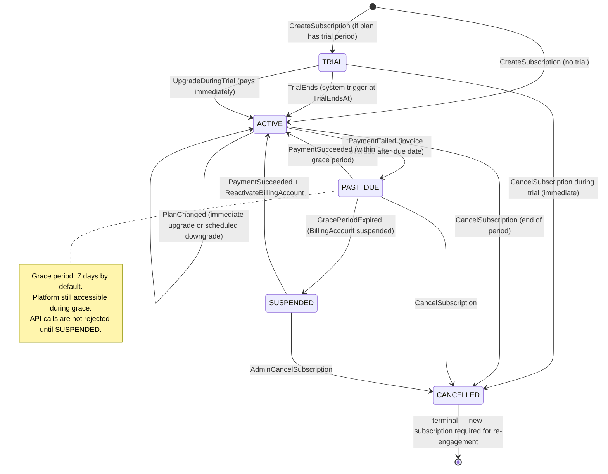

### 7.2 Invoice Lifecycle

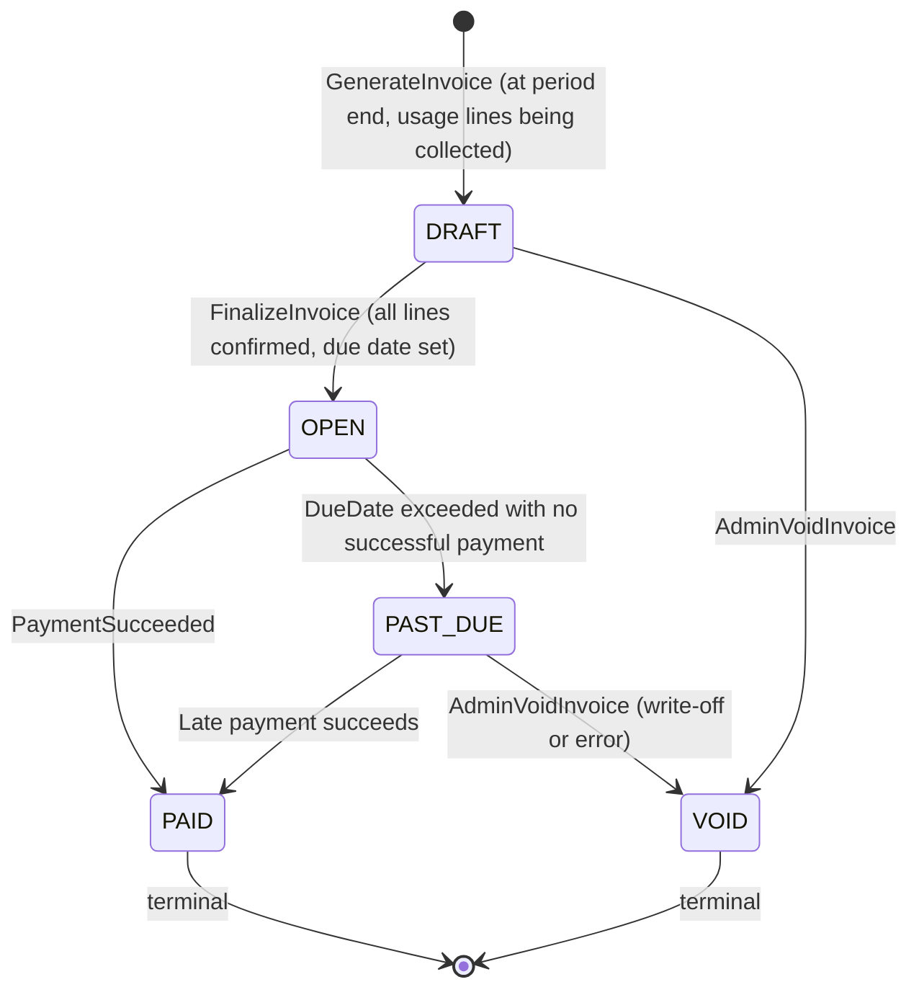

### 7.3 Payment Lifecycle

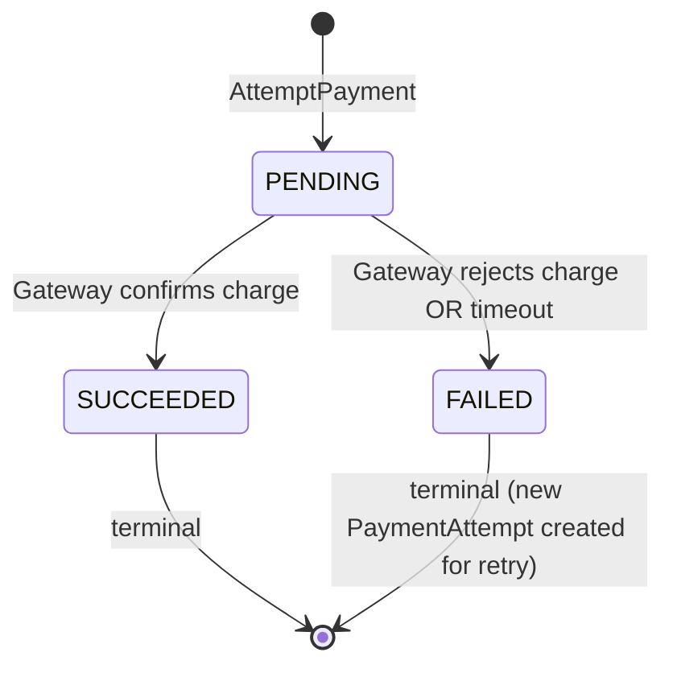

### 7.4 Webhook Delivery Lifecycle

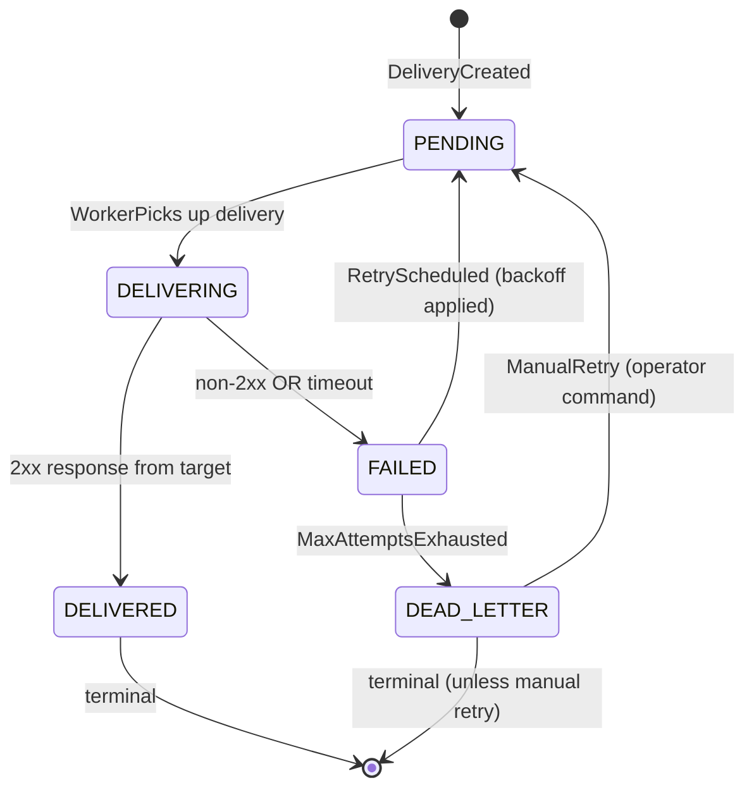

### 7.5 Integration Connection Lifecycle

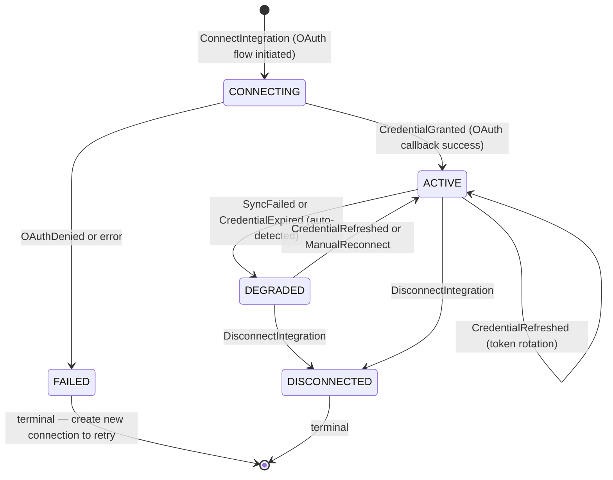

### 7.6 Plugin Lifecycle

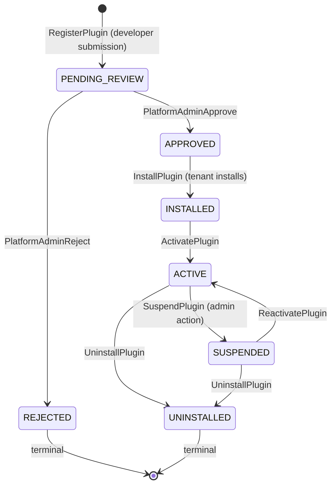

### 7.7 API Key Lifecycle

*Phase 4A owns the `ApiKey` aggregate and its ACTIVE → REVOKED lifecycle. Phase 4F adds the `APIKeyUsage` tracking aggregate — the key's own lifecycle state machine is in Phase 4A §5.4 and not redesigned here.*

---

## 8. Webhook Context

### 8.1 WebhookEndpoint Aggregate

**Aggregate Root:** `WebhookEndpoint`

```
WebhookEndpoint (AggregateRoot)
├── WebhookId                    (Value Object — UUIDv7)
├── TenantId                     (Value Object)
├── TargetUrl                    (Value Object — HttpsUrl — must be HTTPS)
├── SigningSecretRef             (Value Object — CredentialRef — opaque reference to HMAC secret)
├── Topics                       (Value Object — frozenset[EventTopic] — subscribed event topics)
├── Status                       (Value Object — WebhookStatus — ACTIVE | DISABLED | SUSPENDED)
├── RetryPolicy                  (Value Object — WebhookRetryPolicy — see §8.1.1)
├── CreatedByRef                 (Value Object — UserId)
├── LastDeliveryAt               (Value Object — nullable datetime)
└── CreatedAt                    (Value Object — datetime)
```

**§8.1.1 WebhookRetryPolicy (Value Object):**
```
WebhookRetryPolicy
├── MaxAttempts          (integer 1–10, default 7)
├── BackoffSchedule      (list[Duration] — [30s, 60s, 5m, 30m, 2h, 8h, 24h])
└── TimeoutMs            (integer 1000–30000, default 10000)
```

**Invariants:**
1. `TargetUrl` must be HTTPS — HTTP endpoints are rejected at creation.
2. `SigningSecretRef` is always an opaque reference — the raw HMAC secret is generated by the application service at creation and stored in the secret manager; the domain model never sees it.
3. A `SUSPENDED` WebhookEndpoint receives no new deliveries — pending deliveries already in the queue complete normally.
4. `Topics` must not be empty.

**Commands:** `CreateWebhookEndpoint`, `UpdateTopics`, `DisableWebhook`, `EnableWebhook`, `SuspendWebhook`, `DeleteWebhookEndpoint`
**Domain Events:** `WebhookEndpointCreated`, `WebhookTopicsUpdated`, `WebhookDisabled`, `WebhookSuspended`, `WebhookDeleted`

---

### 8.2 WebhookDelivery Aggregate

**Aggregate Root:** `WebhookDelivery`

**Rationale:** separate from `WebhookEndpoint` because deliveries accumulate without bound (one per event per subscriber) — embedding them in `WebhookEndpoint` would create an unbounded aggregate. Each delivery is also independently retryable.

```
WebhookDelivery (AggregateRoot)
├── DeliveryId                   (Value Object — UUIDv7, time-sortable)
├── WebhookRef                   (Value Object — WebhookId)
├── TenantId                     (Value Object)
├── EventTopic                   (Value Object — EventTopic — e.g. "call.completed")
├── PayloadJson                  (Value Object — string — the serialised event payload)
├── PayloadHash                  (Value Object — SHA-256 of PayloadJson — for deduplication)
├── Status                       (Value Object — DeliveryStatus — see §7.4)
├── AttemptCount                 (Value Object — integer)
├── NextAttemptAt                (Value Object — nullable datetime)
├── LastResponseCode             (Value Object — nullable integer)
├── LastResponseBodyPreview      (Value Object — nullable string — first 512 chars only)
└── CreatedAt                    (Value Object — datetime)
```

**Invariants:**
1. `PayloadJson` is immutable — the same payload is used for all retry attempts.
2. `AttemptCount ≤ RetryPolicy.MaxAttempts` (fetched from the webhook's policy).
3. `DEAD_LETTER` deliveries are retained for 30 days for inspection and manual retry.
4. `LastResponseBodyPreview` is capped at 512 chars to limit storage of untrusted external content.

**Commands:** `CreateDelivery`, `AttemptDelivery`, `RecordDeliverySuccess`, `RecordDeliveryFailure`, `ScheduleRetry`, `MarkDeadLetter`, `ManualRetry`
**Domain Events:** `DeliveryCreated`, `DeliverySucceeded`, `DeliveryFailed`, `DeliveryMarkedDeadLetter`, `ManualRetryRequested`

---

### 8.3 Webhook Domain Services

```python
class WebhookDispatchService:
    """
    Given a domain event, finds all active WebhookEndpoints subscribed to
    its topic (within the same TenantId) and creates one WebhookDelivery per endpoint.

    Pure domain service — no I/O. Returns list of CreateDelivery commands.
    The application service executes the commands and enqueues the Celery tasks.
    """
    def find_matching_endpoints(
        self,
        event_topic: EventTopic,
        tenant_id: TenantId,
        active_endpoints: list[WebhookEndpoint],
    ) -> list[WebhookEndpoint]: ...

class WebhookSignatureService:
    """
    Computes HMAC-SHA256 signature for a delivery payload.
    Called by the delivery infrastructure worker — not the domain.
    But defined here as a domain service to pin the algorithm as a business rule
    (changing the algorithm requires a domain change, not an infra change).

    signature = HMAC-SHA256(secret, f"ts={timestamp}.{payload}")
    Header: X-Platform-Signature: v1={hex_signature}
    """
    def compute_signature(
        self,
        payload: str,
        timestamp: int,
        secret: bytes,           # obtained from secret manager by the adapter
    ) -> str: ...
```

**Why `WebhookSignatureService` is in the domain:** the signing algorithm and header format are part of the Published Language with external webhook consumers. If the algorithm changes, external consumers' verification code breaks. This is a business contract — it belongs in the domain, not in a utility function that any engineer can silently change.

---

### 8.4 Webhook Event Topic Catalogue

Phase 4F defines the authoritative list of supported webhook topics — the Published Language of the platform's event-driven integration API.

| Topic | Originating context | Trigger |
|---|---|---|
| `call.started` | Voice (4B) | `call.initiated` |
| `call.completed` | Voice (4B) | `call.ended` |
| `call.failed` | Voice (4B) | `call.failed` |
| `call.transferred` | Voice (4B) | `call.transferred` |
| `lead.created` | CRM (4C) | `contact.created` with source = AI |
| `lead.qualified` | CRM (4C) | `contact.qualified` |
| `lead.disqualified` | CRM (4C) | `contact.disqualified` |
| `deal.created` | CRM (4C) | `deal.created` |
| `deal.won` | CRM (4C) | `deal.won` |
| `deal.lost` | CRM (4C) | `deal.lost` |
| `appointment.booked` | CRM (4C) | `appointment.booked` |
| `campaign.started` | Campaign (4D) | `campaign.started` |
| `campaign.completed` | Campaign (4D) | `campaign.completed` |
| `campaign.contact.qualified` | Campaign (4D) | `campaign.contact.qualified` |
| `invoice.created` | Billing (4F) | `invoice.generated` |
| `invoice.paid` | Billing (4F) | `payment.succeeded` |
| `payment.failed` | Billing (4F) | `payment.failed` |
| `usage.threshold_reached` | Usage (4F) | `usage_threshold_approached` |
| `subscription.changed` | Billing (4F) | `plan.changed`, `subscription.cancelled` |

**Topics are versioned:** each topic is `<resource>.<event>[.v2]` — a new version of a topic schema is a new topic string, not a breaking change to an existing one. Old topic subscriptions continue to deliver on the old schema.

---

## 9. Plugin Context

### 9.1 Plugin Aggregate

**Aggregate Root:** `Plugin`

```
Plugin (AggregateRoot)
├── PluginId                     (Value Object — UUIDv7)
├── DeveloperId                  (Value Object — TenantId — the developer's tenant)
├── Name                         (Value Object — 1–100 chars)
├── Slug                         (Value Object — unique platform-wide, URL-safe)
├── Status                       (Value Object — PluginRegistrationStatus — PENDING_REVIEW|APPROVED|REJECTED)
├── PublishedVersionRef          (Value Object — nullable PluginVersionId)
├── Versions                     (list[PluginVersion] — embedded, bounded)
│   └── PluginVersion (Entity)
│       ├── VersionId            (Value Object — PluginVersionId)
│       ├── SemVer               (Value Object — semantic version string)
│       ├── Manifest             (Value Object — PluginManifest — see §9.1.1)
│       ├── ApprovedAt           (Value Object — nullable datetime)
│       └── ApprovedBy           (Value Object — nullable UserId — Platform Admin)
└── CreatedAt                    (Value Object — datetime)
```

**§9.1.1 PluginManifest (Value Object — immutable after version approval):**
```
PluginManifest
├── BaseUrl                  (HttpsUrl — the plugin's HTTPS endpoint)
├── Capabilities             (list[PluginCapability])
├── RequiredPermissions      (list[Permission] — from Phase 4A's permission registry)
├── RateLimitPerMinute       (integer — max callouts per minute)
├── TimeoutMs                (integer — max 30000)
├── WebhookCallbackUrl       (nullable HttpsUrl — for async plugins)
└── MinPlatformVersion       (string — semver — minimum platform version required)
```

**Invariants:**
1. `PluginManifest.BaseUrl` must be HTTPS — no HTTP.
2. `RequiredPermissions` must be a subset of the platform's defined permission registry.
3. A `PluginVersion.Manifest` is immutable after approval — a change requires a new version.
4. `Slug` is globally unique across all Plugins and immutable.

**Commands:** `RegisterPlugin`, `SubmitVersion`, `ApproveVersion`, `RejectVersion`
**Domain Events:** `PluginRegistered`, `PluginVersionSubmitted`, `PluginVersionApproved`, `PluginVersionRejected`

---

### 9.2 PluginInstallation Aggregate

**Aggregate Root:** `PluginInstallation`

```
PluginInstallation (AggregateRoot)
├── InstallationId               (Value Object — UUIDv7)
├── PluginRef                    (Value Object — PluginId)
├── PluginVersionRef             (Value Object — PluginVersionId — pinned at installation)
├── TenantId                     (Value Object)
├── Status                       (Value Object — InstallationStatus — INSTALLED|ACTIVE|SUSPENDED|UNINSTALLED)
├── Configuration                (Value Object — dict[string, string] — non-secret plugin config)
├── CredentialRef                (Value Object — nullable CredentialRef — for plugins that need a key)
├── EnabledCapabilities          (list[PluginCapability] — subset of Manifest.Capabilities)
├── RateLimitOverride            (Value Object — nullable integer — per-tenant rate limit override)
├── InstalledByRef               (Value Object — UserId)
└── InstalledAt                  (Value Object — datetime)
```

**Invariants:**
1. `PluginVersionRef` is pinned at installation — auto-upgrade requires explicit `UpgradePlugin` command.
2. `EnabledCapabilities` must be a subset of the installed version's `Manifest.Capabilities`.
3. A `CredentialRef` is always an opaque reference — never a plaintext secret.
4. An `UNINSTALLED` installation is terminal.
5. A Plugin with `Manifest.RequiredPermissions` containing `PAYMENT_GATEWAY` can only be installed by an Admin with `billing:admin` permission.

**Commands:** `InstallPlugin`, `ActivatePlugin`, `SuspendPlugin`, `ReactivatePlugin`, `UninstallPlugin`, `UpgradePlugin`, `ConfigurePlugin`
**Domain Events:** `PluginInstalled`, `PluginActivated`, `PluginSuspended`, `PluginUninstalled`, `PluginUpgraded`

---

### 9.3 Plugin Security Model

| Layer | Mechanism |
|---|---|
| Authentication | Platform signs every callout with HMAC-SHA256 (`X-Platform-Signature`) using the installation's shared secret. Plugin verifies before acting. |
| Tenant isolation | Every callout carries `X-Platform-Tenant-Id` header. Plugin must scope all state by this header — the platform cannot enforce this inside the plugin's process. |
| Capability gating | The `ToolCallNodeExecutor` checks `EnabledCapabilities` before invoking a plugin tool. A plugin with `TOOL_PROVIDER` capability but no `CRM_CONNECTOR` capability cannot be used as a CRM connector. |
| Rate limiting | `Manifest.RateLimitPerMinute` is enforced by the platform before the HTTP callout using the Redis token bucket at `plugin:ratelimit:{tenant_id}:{plugin_id}` (Phase 3E §16). |
| Timeout | `Manifest.TimeoutMs` is a hard `asyncio.wait_for()` ceiling — not negotiable. |
| Secret isolation | Plugin credentials are stored in the secret manager per-tenant. The same plugin installed by two tenants has two separate CredentialRefs — they cannot share credentials. |
| Sandbox | Plugins run as external HTTP services — they never run code inside the platform's process (Phase 3E §8.1, DDR confirmed here). |

---

## 10. Commands — Consolidated

### 10.1 Billing Commands

```python
@dataclass(frozen=True)
class CreateSubscription:
    command_id: UUIDv7; tenant_id: TenantId; plan_version_id: PlanVersionId
    billing_account_id: BillingAccountId; payment_method_ref: PaymentMethodRef | None

@dataclass(frozen=True)
class ChangePlan:
    command_id: UUIDv7; subscription_id: SubscriptionId; tenant_id: TenantId
    new_plan_version_id: PlanVersionId; changed_by: UserId
    # Application service determines immediate vs. scheduled based on upgrade/downgrade direction

@dataclass(frozen=True)
class CancelSubscription:
    command_id: UUIDv7; subscription_id: SubscriptionId; tenant_id: TenantId
    reason: str; immediate: bool; cancelled_by: UserId

@dataclass(frozen=True)
class GenerateInvoice:
    command_id: UUIDv7; billing_account_id: BillingAccountId
    period_start: date; period_end: date

@dataclass(frozen=True)
class AttemptPayment:
    command_id: UUIDv7; invoice_id: InvoiceId; tenant_id: TenantId
    payment_method_ref: PaymentMethodRef

@dataclass(frozen=True)
class RecordUsageEvent:
    command_id: UUIDv7; tenant_id: TenantId; metric: UsageMetric
    quantity: Decimal; source_type: EventSource; source_ref: str
    provider_id: str | None; provider_cost: Money | None; occurred_at: datetime

@dataclass(frozen=True)
class SetQuotaConfig:
    command_id: UUIDv7; tenant_id: TenantId; metric: UsageMetric
    limit: QuotaLimit | None; overage_allowed: bool; set_by: UserId
```

### 10.2 Integration Commands

```python
@dataclass(frozen=True)
class ConnectIntegration:
    command_id: UUIDv7; tenant_id: TenantId; definition_id: IntegrationDefinitionId
    credential_ref: CredentialRef; configuration: dict; connected_by: UserId

@dataclass(frozen=True)
class DisconnectIntegration:
    command_id: UUIDv7; connection_id: IntegrationConnectionId; tenant_id: TenantId
    disconnected_by: UserId
```

### 10.3 Webhook Commands

```python
@dataclass(frozen=True)
class CreateWebhookEndpoint:
    command_id: UUIDv7; tenant_id: TenantId; target_url: str
    topics: frozenset[str]; created_by: UserId

@dataclass(frozen=True)
class ManualRetryDelivery:
    command_id: UUIDv7; delivery_id: DeliveryId; tenant_id: TenantId
    retried_by: UserId
```

### 10.4 Plugin Commands

```python
@dataclass(frozen=True)
class InstallPlugin:
    command_id: UUIDv7; tenant_id: TenantId; plugin_id: PluginId
    plugin_version_id: PluginVersionId; configuration: dict
    credential_ref: CredentialRef | None; installed_by: UserId

@dataclass(frozen=True)
class ActivatePlugin:
    command_id: UUIDv7; installation_id: InstallationId; tenant_id: TenantId
    enabled_capabilities: list[str]; activated_by: UserId
```

---

## 11. Queries — Consolidated

```python
# Billing
GetBillingAccount(tenant_id: TenantId) -> BillingAccountDTO
GetSubscription(tenant_id: TenantId) -> SubscriptionDTO
ListInvoices(tenant_id: TenantId, page: Page) -> Page[InvoiceSummaryDTO]
GetInvoice(invoice_id: InvoiceId, tenant_id: TenantId) -> InvoiceDTO

# Usage
GetUsageSummary(tenant_id: TenantId, period: UsagePeriod) -> UsageSummaryDTO
GetQuotaStatus(tenant_id: TenantId) -> list[QuotaStatusDTO]
GetCostBreakdown(tenant_id: TenantId, period: UsagePeriod) -> CostBreakdownDTO
    # returns: cost per provider, cost per metric, total cost, billed amount, margin

# Integrations
ListIntegrationDefinitions(category: IntegrationCategory | None) -> list[IntegrationDefinitionDTO]
ListConnections(tenant_id: TenantId) -> list[IntegrationConnectionDTO]
GetConnection(connection_id: IntegrationConnectionId, tenant_id: TenantId) -> IntegrationConnectionDTO

# Webhooks
ListWebhookEndpoints(tenant_id: TenantId) -> list[WebhookEndpointDTO]
GetWebhookDeliveries(webhook_id: WebhookId, tenant_id: TenantId, page: Page) -> Page[DeliveryDTO]
GetDeadLetterDeliveries(tenant_id: TenantId, page: Page) -> Page[DeliveryDTO]

# Plugins
ListApprovedPlugins(category: PluginCapability | None) -> list[PluginSummaryDTO]
ListInstallations(tenant_id: TenantId) -> list[InstallationDTO]

# API Key Usage (extends Phase 4A ApiKey)
GetAPIKeyUsage(api_key_id: ApiKeyId, tenant_id: TenantId, period: UsagePeriod) -> APIKeyUsageDTO
```

---

## 12. Domain Events — Full Catalogue

### 12.1 Billing Events

| Event | Key Payload | Consumed by |
|---|---|---|
| `billing.account_created` | `billing_account_id, tenant_id, currency` | Audit |
| `subscription.created` | `subscription_id, tenant_id, plan_version_id` | Audit, Analytics, Quota (seed configs from plan) |
| `subscription.plan_changed` | `subscription_id, old_plan_version, new_plan_version, effective_at` | Audit, Analytics, Quota (update limits), Webhook |
| `subscription.renewed` | `subscription_id, new_period_start, new_period_end` | Audit, Analytics |
| `subscription.cancelled` | `subscription_id, effective_at, reason` | Audit, Analytics, Webhook |
| `invoice.generated` | `invoice_id, billing_account_id, period, total_due` | Audit, Analytics, Webhook, Notification |
| `invoice.payment_succeeded` | `invoice_id, amount, payment_method_type` | Audit, Analytics, Webhook, Subscription (resolve PAST_DUE) |
| `invoice.payment_failed` | `invoice_id, attempt_count, will_retry` | Audit, Analytics, Webhook, Subscription (→ PAST_DUE) |
| `billing.credit_applied` | `billing_account_id, amount, reason` | Audit |

### 12.2 Usage Events

| Event | Key Payload | Consumed by |
|---|---|---|
| `usage.event_recorded` | `tenant_id, metric, quantity, source_type, source_ref, provider_cost` | Analytics, CostEntry creation |
| `usage.threshold_approached` | `tenant_id, metric, current_pct, limit` | Notification (warn admin), Webhook, Analytics |
| `usage.quota_exceeded` | `tenant_id, metric, current, limit` | Billing (overage if allowed), API Gateway (block if hard stop), Webhook, Analytics |

### 12.3 Integration Events

| Event | Key Payload | Consumed by |
|---|---|---|
| `integration.connected` | `connection_id, tenant_id, definition_id, capabilities` | Audit, Analytics |
| `integration.sync_failed` | `connection_id, tenant_id, error` | Audit, Notification, Webhook |
| `integration.disconnected` | `connection_id, tenant_id, definition_id` | Audit, Analytics |

### 12.4 Webhook Events

| Event | Key Payload | Consumed by |
|---|---|---|
| `webhook.endpoint_created` | `webhook_id, tenant_id, topics` | Audit |
| `webhook.delivery_succeeded` | `delivery_id, webhook_id, topic, attempt_count` | Audit, Analytics |
| `webhook.delivery_failed` | `delivery_id, webhook_id, topic, attempt_count, status_code` | Audit, Analytics |
| `webhook.delivery_dead_lettered` | `delivery_id, webhook_id, topic, total_attempts` | Audit, Analytics, Alert |

### 12.5 Plugin Events

| Event | Key Payload | Consumed by |
|---|---|---|
| `plugin.installed` | `installation_id, tenant_id, plugin_id, version_id` | Audit, Analytics |
| `plugin.activated` | `installation_id, tenant_id, enabled_capabilities` | Audit, Tool Registry (register tool endpoints) |
| `plugin.suspended` | `installation_id, tenant_id, reason` | Audit, Tool Registry (de-register) |
| `plugin.uninstalled` | `installation_id, tenant_id` | Audit, Tool Registry (de-register) |

---

## 13. Sequence Diagrams

### 13.1 Subscription Creation

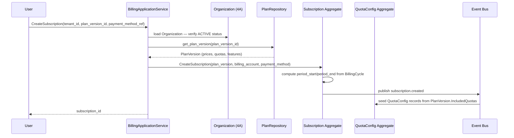

### 13.2 Call Usage → Billing

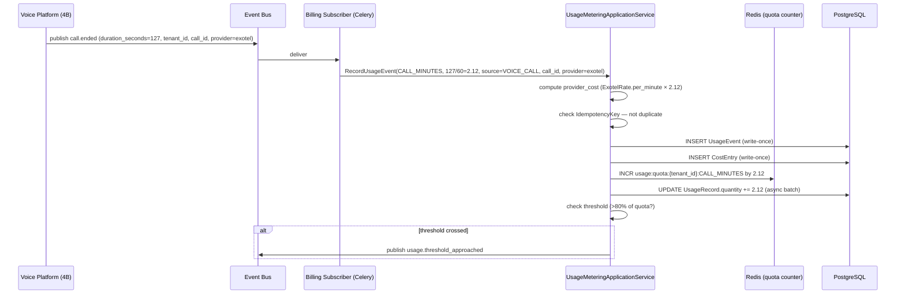

### 13.3 Invoice Generation

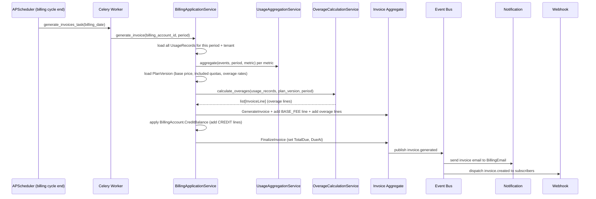

### 13.4 Quota Enforcement

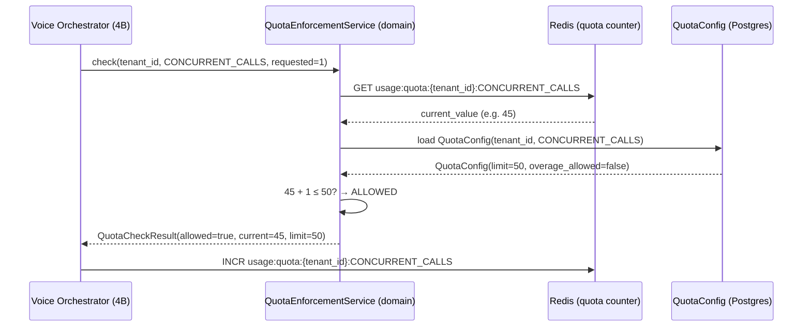

### 13.5 Webhook Delivery and Retry

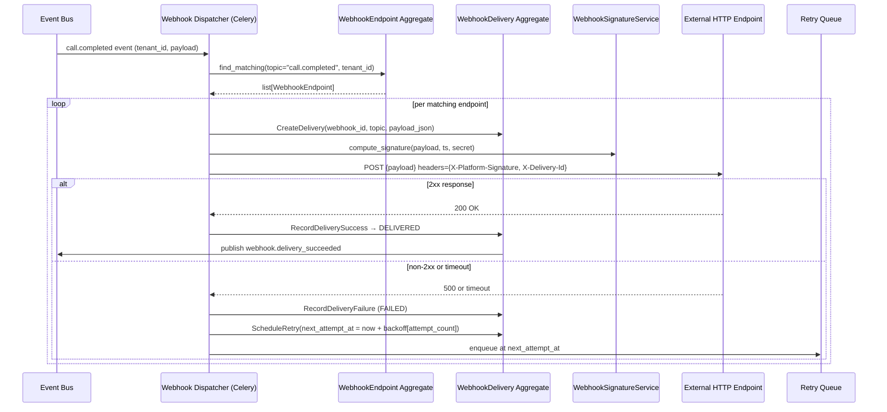

### 13.6 Plugin Installation and Execution

```mermaid
sequenceDiagram
    participant User
    participant AppSvc as PluginApplicationService
    participant Plugin as Plugin Aggregate
    participant Install as PluginInstallation Aggregate
    participant Auth as AuthorizationOHS (4A)
    participant SecMgr as Secret Manager
    participant Bus as Event Bus

    User->>AppSvc: InstallPlugin(plugin_id, version_id, config, credential)
    AppSvc->>Auth: check_permission("plugin:install")
    Auth-->>AppSvc: ALLOWED
    AppSvc->>Plugin: load + verify version APPROVED
    AppSvc->>SecMgr: store credential → CredentialRef
    AppSvc->>Install: InstallPlugin(plugin, version, tenant, credential_ref, config)
    Install->>Bus: publish plugin.installed
    User->>AppSvc: ActivatePlugin(installation_id, enabled_capabilities)
    AppSvc->>Install: ActivatePlugin → ACTIVE
    Install->>Bus: publish plugin.activated
    Bus->>ToolRegistry: register plugin tool endpoints for this tenant

    Note over AppSvc: Later — tool called during conversation
    Actor->>AppSvc: InvokePlugin(installation_id, endpoint, payload, tenant_id)
    AppSvc->>AppSvc: check RateLimit (Redis token bucket)
    AppSvc->>SecMgr: resolve credential_ref → signing_secret
    AppSvc->>AppSvc: sign payload (WebhookSignatureService)
    AppSvc->>Plugin: POST {payload} [timeout-bounded]
    Plugin-->>AppSvc: PluginResult
```

### 13.7 CRM Integration Connection

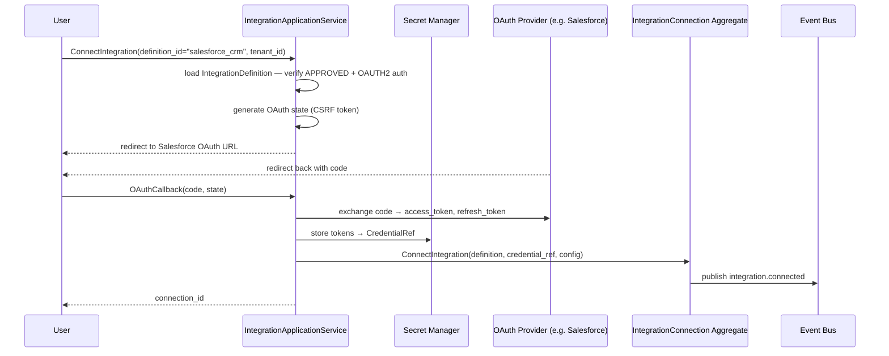

### 13.8 Subscription Upgrade

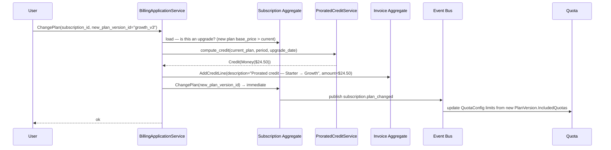

---

## 14. Domain Package Structure

```text
modules/
├── billing/                          # Billing & Subscription Context
│   ├── domain/
│   │   ├── aggregates/
│   │   │   ├── billing_account.py
│   │   │   ├── subscription.py
│   │   │   ├── plan.py
│   │   │   └── invoice.py
│   │   ├── value_objects/
│   │   │   ├── identifiers.py
│   │   │   ├── billing_status.py
│   │   │   ├── subscription_status.py
│   │   │   ├── invoice_status.py
│   │   │   ├── billing_cycle.py
│   │   │   ├── money.py               # reused from Phase 4A Shared Kernel
│   │   │   ├── payment_method_ref.py
│   │   │   └── scheduled_change.py
│   │   ├── events/billing_events.py
│   │   ├── commands/billing_commands.py
│   │   └── services/
│   │       ├── overage_calculation_service.py
│   │       ├── prorated_credit_service.py
│   │       └── margin_analysis_service.py
│   ├── application/
│   │   ├── use_cases/
│   │   │   ├── create_subscription.py
│   │   │   ├── change_plan.py
│   │   │   ├── cancel_subscription.py
│   │   │   ├── generate_invoice.py
│   │   │   ├── attempt_payment.py
│   │   │   └── apply_credit.py
│   │   ├── queries/
│   │   │   ├── get_subscription.py
│   │   │   └── get_invoices.py
│   │   └── ports/
│   │       ├── billing_account_repository.py
│   │       ├── subscription_repository.py
│   │       ├── plan_repository.py
│   │       ├── invoice_repository.py
│   │       └── payment_gateway_port.py
│   ├── infrastructure/
│   │   ├── models.py
│   │   ├── repositories/
│   │   │   ├── sqlalchemy_billing_account_repository.py
│   │   │   ├── sqlalchemy_subscription_repository.py
│   │   │   └── sqlalchemy_invoice_repository.py
│   │   └── payment/
│   │       └── stripe_payment_gateway_adapter.py   # or Razorpay — see OQ-4F-01
│   └── interface/
│       ├── rest/router.py
│       └── events/subscribers.py      # organization.created → create billing account
│
├── usage_metering/                    # Usage Metering Context
│   ├── domain/
│   │   ├── aggregates/
│   │   │   ├── usage_record.py
│   │   │   ├── usage_event.py
│   │   │   ├── cost_entry.py
│   │   │   └── quota_config.py
│   │   ├── value_objects/
│   │   │   ├── identifiers.py
│   │   │   ├── usage_metric.py
│   │   │   ├── usage_period.py
│   │   │   ├── event_source.py
│   │   │   ├── quota_limit.py
│   │   │   └── quota_check_result.py
│   │   ├── events/usage_events.py
│   │   ├── commands/usage_commands.py
│   │   └── services/
│   │       ├── quota_enforcement_service.py
│   │       ├── usage_aggregation_service.py
│   │       └── provider_cost_lookup_service.py
│   ├── application/
│   │   ├── use_cases/
│   │   │   ├── record_usage_event.py
│   │   │   ├── check_quota.py          # public OHS used by all other contexts
│   │   │   └── set_quota_config.py
│   │   ├── queries/
│   │   │   ├── get_usage_summary.py
│   │   │   └── get_cost_breakdown.py
│   │   └── ports/
│   │       ├── usage_record_repository.py
│   │       ├── usage_event_repository.py
│   │       ├── cost_entry_repository.py
│   │       ├── quota_config_repository.py
│   │       └── provider_rate_port.py    # reads provider rate tables
│   ├── infrastructure/
│   │   ├── models.py
│   │   └── repositories/
│   │       ├── sqlalchemy_usage_record_repository.py
│   │       └── sqlalchemy_usage_event_repository.py
│   └── interface/
│       ├── rest/router.py
│       └── events/subscribers.py      # all domain events from 4B–4E → record usage
│
├── integrations/                      # Integration Context
│   ├── domain/
│   │   ├── aggregates/
│   │   │   ├── integration_definition.py
│   │   │   └── integration_connection.py
│   │   ├── value_objects/
│   │   │   ├── identifiers.py
│   │   │   ├── connection_status.py
│   │   │   ├── auth_method.py
│   │   │   ├── integration_capability.py
│   │   │   └── credential_ref.py
│   │   ├── events/integration_events.py
│   │   └── commands/integration_commands.py
│   ├── application/
│   │   ├── use_cases/
│   │   │   ├── connect_integration.py
│   │   │   ├── disconnect_integration.py
│   │   │   └── refresh_credential.py
│   │   ├── queries/list_connections.py
│   │   └── ports/
│   │       ├── integration_definition_repository.py
│   │       ├── integration_connection_repository.py
│   │       └── oauth_provider_port.py
│   ├── infrastructure/
│   │   ├── models.py
│   │   ├── repositories/
│   │   │   └── sqlalchemy_integration_connection_repository.py
│   │   └── acl/                       # one ACL adapter per integration
│   │       ├── salesforce_acl.py
│   │       ├── hubspot_acl.py
│   │       ├── google_calendar_acl.py
│   │       └── zoho_acl.py
│   └── interface/
│       ├── rest/router.py             # OAuth callback endpoint here
│       └── events/subscribers.py
│
├── webhooks/                          # Webhook Context
│   ├── domain/
│   │   ├── aggregates/
│   │   │   ├── webhook_endpoint.py
│   │   │   └── webhook_delivery.py
│   │   ├── value_objects/
│   │   │   ├── identifiers.py
│   │   │   ├── webhook_status.py
│   │   │   ├── delivery_status.py
│   │   │   ├── event_topic.py
│   │   │   ├── webhook_retry_policy.py
│   │   │   └── credential_ref.py
│   │   ├── events/webhook_events.py
│   │   ├── commands/webhook_commands.py
│   │   └── services/
│   │       ├── webhook_dispatch_service.py
│   │       └── webhook_signature_service.py
│   ├── application/
│   │   ├── use_cases/
│   │   │   ├── create_webhook_endpoint.py
│   │   │   ├── dispatch_event.py
│   │   │   ├── attempt_delivery.py
│   │   │   └── manual_retry_delivery.py
│   │   ├── queries/get_webhook_deliveries.py
│   │   └── ports/
│   │       ├── webhook_endpoint_repository.py
│   │       ├── webhook_delivery_repository.py
│   │       └── http_delivery_port.py
│   ├── infrastructure/
│   │   ├── models.py
│   │   ├── repositories/
│   │   │   └── sqlalchemy_webhook_repositories.py
│   │   └── http/httpx_delivery_adapter.py
│   └── interface/
│       ├── rest/router.py
│       └── events/subscribers.py      # ALL domain events → dispatch_event
│
└── plugins/                           # Plugin Context
    ├── domain/
    │   ├── aggregates/
    │   │   ├── plugin.py              # Plugin + PluginVersion + PluginManifest
    │   │   └── plugin_installation.py
    │   ├── value_objects/
    │   │   ├── identifiers.py
    │   │   ├── plugin_capability.py
    │   │   ├── registration_status.py
    │   │   ├── installation_status.py
    │   │   └── credential_ref.py
    │   ├── events/plugin_events.py
    │   └── commands/plugin_commands.py
    ├── application/
    │   ├── use_cases/
    │   │   ├── register_plugin.py
    │   │   ├── install_plugin.py
    │   │   ├── activate_plugin.py
    │   │   ├── invoke_plugin.py        # public OHS used by Tool Calling (4B)
    │   │   └── uninstall_plugin.py
    │   ├── queries/list_plugins.py
    │   └── ports/
    │       ├── plugin_repository.py
    │       ├── plugin_installation_repository.py
    │       └── plugin_callout_port.py
    ├── infrastructure/
    │   ├── models.py
    │   ├── repositories/
    │   │   └── sqlalchemy_plugin_repositories.py
    │   └── callout/http_plugin_callout_adapter.py
    └── interface/
        ├── rest/router.py
        └── events/subscribers.py
```

---

## 15. Persistence Identification

| Aggregate | Store | Access Patterns | Phase 5 Notes |
|---|---|---|---|
| `BillingAccount` | Postgres | By TenantId (1:1) | Single row per tenant; index on `organization_ref` |
| `Subscription` | Postgres | By BillingAccountRef, by Status | Active subscription cached in Redis (short TTL) for fast plan-check |
| `Plan` / `PlanVersion` | Postgres | Read-heavy, rarely written | Long-lived cache in Redis acceptable |
| `Invoice` | Postgres | By BillingAccountRef, by Status, by period | Partition by period month at scale |
| `UsageRecord` | Postgres + Redis | By TenantId + Metric + Period; Redis hot counter | Composite PK; Redis counter reconciled nightly |
| `UsageEvent` | Postgres | Append-only; by SourceRef, by TenantId, by OccurredAt | Partition by month; archive after 90 days. High volume — see §8 below |
| `CostEntry` | Postgres | Append-only; by SourceRef, by Category | Partition by month; same as UsageEvent |
| `QuotaConfig` | Postgres | By TenantId + Metric (max 15 rows per tenant) | Small table; cached in Redis |
| `IntegrationDefinition` | Postgres | Read-only platform data; rarely changes | Cached at startup, refreshed on admin update |
| `IntegrationConnection` | Postgres | By TenantId, by DefinitionId | `credential_ref` is an opaque string — never a secret value |
| `WebhookEndpoint` | Postgres | By TenantId, by Topic | `signing_secret_ref` is opaque — actual secret in secret manager |
| `WebhookDelivery` | Postgres | By WebhookRef; by Status (DEAD_LETTER); by CreatedAt | Append-only; partition by month; purge DELIVERED after 30 days |
| `Plugin` | Postgres | By PluginId, by Status | Read-heavy; platform-global |
| `PluginInstallation` | Postgres | By TenantId, by Status | `credential_ref` is opaque |

---

## 16. Cross-Domain Communication

| This domain | Other domain | Direction | Mechanism |
|---|---|---|---|
| Billing | Organization (4A) | Billing consumes | `organization.created` → create BillingAccount |
| Billing | Subscription (self) | Internal | `subscription.created` → seed QuotaConfig from Plan |
| Usage Metering | Voice Platform (4B) | Usage consumes | `call.ended`, `llm_completion.recorded`, `stt.completed`, `tts.completed` |
| Usage Metering | Campaign (4D) | Usage consumes | `campaign.contact.call_attempted` |
| Usage Metering | Workflow/RAG (4E) | Usage consumes | `workflow.execution_completed`, `embedding.generated`, `tool.executed` |
| Usage Metering | Billing | Usage publishes | `usage.quota_exceeded`, `usage.threshold_approached` |
| Billing | Analytics | Billing publishes | All billing events |
| Usage | Analytics | Usage publishes | All usage events |
| Webhooks | ALL contexts | Conformist — dispatches their events | All domain events from all contexts |
| Plugins | Voice Platform (4B) | Plugins supply | `invoke_plugin` OHS called by ToolCallNodeExecutor |
| Integrations | CRM (4C) | Integrations supply (ACL) | External CRM events → Phase 4C domain commands |
| Audit (4A) | All contexts | ALL publish → Audit consumes | Every command and event audit trail |

---

## 17. Domain Decision Records

### DDR-4F-001: Billing and Subscription Are One Context

**Decision:** `BillingAccount`, `Subscription`, `Plan`, and `Invoice` are all within one bounded context — not split into "Billing", "Subscription", and "Payment" contexts.

**Rationale:** the same billing domain expert owns all of these. They share a tightly coupled lifecycle (a Subscription renewal creates an Invoice; a failed Payment transitions a Subscription to PAST_DUE). Splitting them would require constant cross-context synchronous calls and event choreography for operations that are semantically one thing: "bill this customer for their plan."

**Alternative rejected:** separate Subscription and Payment contexts. Rejected because the Invoice aggregate is the natural consistency boundary that spans both — it contains `SubscriptionItems` and `PaymentAttempts`. Splitting at that line would either duplicate data or require an anemic "Payment context" with no aggregate of its own.

---

### DDR-4F-002: CredentialRef Is a Domain Value Object, Not a String

**Decision:** All secrets (OAuth tokens, API keys, HMAC signing secrets, plugin credentials) are represented in the domain as a `CredentialRef` value object — an opaque reference string that points to a secret in the secret manager. The raw secret value never enters any domain aggregate.

**Rationale:** this is a domain invariant, not just a security practice. If a secret value ever appeared in a domain aggregate, it could be serialised into: a domain event payload (published to Redis Streams), an API DTO, a log line, or a Postgres JSON column. Making `CredentialRef` an explicit domain type enforces at the type level that the domain cannot accidentally operate on a raw secret. `CredentialRef` has no methods that return the secret — only infrastructure adapters call the secret manager to resolve it.

---

### DDR-4F-003: UsageEvent Is Write-Once, Separate from UsageRecord

**Decision:** raw usage events (`UsageEvent`) and aggregated totals (`UsageRecord`) are separate aggregates with separate tables.

**Rationale:** `UsageEvent` is the audit trail — it carries the source reference, provider cost, and idempotency key for every billable occurrence. `UsageRecord` is the billing computation — what the invoice generator reads. Merging them into one table would either make `UsageRecord` row-per-event (joining millions of rows for every invoice) or discard the raw detail. The separation enables: (a) fast aggregate reads for invoicing, (b) full detail for debugging and cost analysis, (c) independent partitioning/archival of high-volume events.

---

### DDR-4F-004: Webhook Signature Algorithm Is a Domain Rule

**Decision:** `WebhookSignatureService` lives in the domain, not in infrastructure.

**Rationale:** the HMAC-SHA256 signing formula and header format (`X-Platform-Signature: v1={hex}`) are part of the Published Language with external webhook consumers. If this were an infrastructure utility method, it could be silently changed, breaking all external consumers. By placing it in the domain, any change to the signing algorithm is a domain change that triggers a version bump in the topic/signature protocol — a conscious, documented decision.

---

### DDR-4F-005: Plugin Execution Is Always External HTTP, Never In-Process

**Decision:** confirms and extends Phase 3E DDR (§8.1). Plugins are external HTTP services — the platform makes a signed, timeout-bounded HTTP callout to the plugin's `BaseUrl`. No plugin code ever runs inside the platform's process.

**Rationale:** in-process plugin execution creates an unacceptable attack surface (plugin code can call Python builtins, access environment variables, exhaust memory) and a multi-tenancy risk (one plugin crashing could affect all tenants on a pod). HTTP callout is the only sandbox that provides genuine process isolation. The cost (network round-trip latency) is acceptable for tool executions and integration sync, and is prohibited for voice hot-path usage (enforced by the capability model in §9.3).

---

### DDR-4F-006: API Key Usage Tracking Is in Usage Metering, Not Identity

**Decision:** `APIKeyUsage` (how many API requests an API key made in a period) is a `UsageRecord` in the Usage Metering context, not an entity in Phase 4A's Identity context.

**Rationale:** Phase 4A's `ApiKey` aggregate owns the security lifecycle (issuance, revocation, authentication). Usage tracking is a metering concern — it involves incrementing a counter and raising quota events, which is exactly what the Usage Metering context does for every other metric. Adding usage tracking to the Identity context would violate its single responsibility. The link between the two is `ApiKeyId` as a `source_ref` on `UsageEvent`.

---

## 18. Architectural Trade-offs

| Trade-off | Choice | Cost | Benefit |
|---|---|---|---|
| Billing + Subscription + Payment in one context | Larger bounded context | Slightly more code per module | No cross-context coordination for billing lifecycle operations |
| UsageEvent separate from UsageRecord | Two tables, two writes per event | Storage overhead; dual write | Fast invoice generation; full audit trail; independent archival |
| Redis hot counter + Postgres audit for quota enforcement | Dual store | Nightly reconciliation needed | Sub-millisecond quota checks at scale; durable audit |
| CredentialRef as domain type | Every credential usage requires secret manager resolution | One extra network call per credential access | Secrets cannot accidentally leak into domain events, logs, or DTOs |
| Plugins as external HTTP only | Round-trip network latency per invocation | ~10–500ms overhead | Full process isolation; no blast-radius from plugin bugs/crashes |
| Webhook signature algorithm in domain | Domain engineers must own algorithm changes | Slightly unusual placement | Breaking changes to signature format are explicit, versioned domain changes |
| Five bounded contexts, not ten | Fewer module boundaries | Each module is larger | Avoids anemic contexts; no cross-context calls for same-expert operations |

---

## 19. Risks

| Risk | Likelihood | Impact | Mitigation |
|---|---|---|---|
| Redis quota counter drift from Postgres (pod crash between INCR and DB write) | Low | Medium — brief over-consumption | Nightly reconciliation task rebuilds Redis from Postgres `UsageRecord` |
| Payment gateway outage at invoice due date | Low | High — customer not charged | PaymentAttempt retry schedule (3 attempts over 7 days); grace period gives 7 days |
| Webhook DEAD_LETTER accumulation if subscriber system is down | Medium | Low — data retained | Manual retry command; Alertmanager fires on DEAD_LETTER volume |
| Plugin calling back into platform (SSRF via BaseUrl) | Low | High | `BaseUrl` must be HTTPS and must not resolve to platform-internal addresses — enforced at registration by `IntegrationDefinition` validator |
| CredentialRef secret manager access failure blocks integration sync | Medium | Medium — integration degraded | `IntegrationConnection` transitions to DEGRADED; retry with backoff |
| UsageEvent volume overwhelming Postgres at scale | Medium | High — insert latency | Partition `usage_events` by month; consider ClickHouse migration (Phase 3E Review Note 1) |

---

## 20. Open Questions

| # | Question | Owner | Blocks |
|---|---|---|---|
| OQ-4F-01 | Which payment gateway vendor is selected? (Stripe? Razorpay for INR?) | Product | `payment_gateway_port.py` adapter implementation |
| OQ-4F-02 | Does the platform bill in a single currency (USD) or support multi-currency billing? | Product | `BillingAccount.Currency` invariant, invoice generation |
| OQ-4F-03 | What is the grace period duration for PAST_DUE subscriptions? (default proposed: 7 days) | Product | `subscription.past_due → suspended` transition guard |
| OQ-4F-04 | Are plugin developers required to be verified organisations, or can anyone register a plugin? | Product / Legal | `RegisterPlugin` policy, `PENDING_REVIEW` approval workflow |
| OQ-4F-05 | Should Usage Events be queryable via the API by tenants (for their own debugging), or are they platform-internal only? | Product | Usage Event repository API surface, data exposure policy |
| OQ-4F-06 | What is the webhook topic versioning strategy when a payload schema changes? (topic v2 approach confirmed, details TBD) | Architecture | Webhook topic catalogue, API versioning policy |
| OQ-4F-07 | Should Integration connections support multiple active connections to the same definition (e.g., two Salesforce orgs for one platform tenant)? | Product | IntegrationConnection uniqueness invariant |

---

## 21. Dependencies on Other Bounded Contexts

| Dependency | Direction | What Phase 4F needs |
|---|---|---|
| Identity / Auth (Phase 4A) | Upstream | `TenantId`, `UserId`, `OrganizationId`, `ApiKeyId`, `EmailAddress`, `PostalAddress`, `Money`, `CheckPermission` OHS |
| Organization (Phase 4A) | Upstream — Billing consumes | `organization.created` event → create BillingAccount |
| Voice Platform (Phase 4B) | Upstream — Usage consumes | `call.ended`, LLM/STT/TTS completion events |
| Campaign (Phase 4D) | Upstream — Usage consumes | `campaign.contact.call_attempted` |
| Workflow/RAG/Tools (Phase 4E) | Upstream — Usage consumes | `workflow.execution_completed`, `embedding.generated`, `tool.executed` |
| All contexts | Downstream — Webhooks dispatches | All domain events from all contexts |
| All contexts | Downstream — Audit consumes | All events from this document |
| Plugins → Voice (Phase 4B) | Plugin supplies | `invoke_plugin` OHS consumed by ToolCallNodeExecutor |

---

## 22. What Phase 4G Must Consume From This Design

There is no Phase 4G defined in the approved roadmap — Phase 4F is the final DDD sub-phase before Phase 5 (Database Design). However, the following downstream consumers must correctly reference this design:

**Phase 5 (Database Design)** must:
1. Create `usage_events` and `cost_entries` tables partitioned by month (high-volume, append-only).
2. Create `usage_records` with a composite PK of `(tenant_id, metric, period_start)`.
3. Create `webhook_deliveries` with `created_at`-range partitioning and a 30-day TTL policy for DELIVERED records.
4. Create `quota_configs` as a small table with `(tenant_id, metric)` composite unique index.
5. Ensure `integration_connections.credential_ref` and `plugin_installations.credential_ref` columns are `NOT NULL` and validated to be non-empty reference strings — never plaintext secrets.
6. Note that `billing_accounts.currency` is a write-once column (set at insert, never updated).
7. Create the `plans` and `plan_versions` tables with appropriate version immutability enforcement (no UPDATE on version rows after `approved_at` is set).

---

## 23. Consistency Checks Against Phase 3 LLD and Phase 4A–4E

| Prior design | Phase 4F DDD | Consistent? | Notes |
|---|---|---|---|
| 3E §6.2 — `CheckQuotaUseCase` as the quota enforcement entry point | §5.5 `QuotaEnforcementService` domain service + `check_quota` application use case — same contract | ✅ | Domain service is now explicit; the 3E design was the application layer only |
| 3E §6.3 — Usage metering is event-driven; billing subscriber on event bus | §5.6 Usage Metering Architecture — confirmed and fully specified | ✅ | |
| 3E §6.5 — `PaymentGatewayPort` defined in Billing | §14 `payment_gateway_port.py` in `billing/application/ports/` | ✅ | |
| 3E §7 — Webhook Engine structure (subscription, delivery, HMAC) | §8.1–8.3 — full DDD treatment of same design | ✅ | DDR-4F-004 formalises why signature is in domain |
| 3E §8 — Plugin SDK as external HTTP service, not in-process | DDR-4F-005 | ✅ Reaffirmed | |
| 3E §16 Redis keys — `plugin:ratelimit:*`, `quota:usage:*` | §14 Persistence + §5.6 usage architecture — same key patterns | ✅ | |
| 4A §5.4 — `ApiKey` lifecycle (ACTIVE → REVOKED) | §7.7 — reused without redesign; `APIKeyUsage` is a separate Usage Metering aggregate | ✅ | DDR-4F-006 explains the boundary |
| 4A §6.5 — `QuotaEnforcementService` | §5.5 — same service, now owned by Usage Metering context | ✅ Clarified ownership | Previously described at 3A level; now explicitly in Usage Metering bounded context |
| 4B §16 — `ratelimit:outbound:{tenant_id}` Redis key owned by Voice Platform | §5.6 — concurrency counter complemented by quota enforcement service reading QuotaConfig | ✅ | Two-layer enforcement per 3B §16 note; not duplicated |
| 4C §22 — `CostLookupPort.get_campaign_cost()` consumed by Campaign (4D) for ROI | §11 Queries — `GetCostBreakdown` use case is the implementation | ✅ | |
| 4E §19 — Billing consumes `workflow.execution_completed` for LLM cost | §16 cross-domain — confirmed | ✅ | |
| 3F §7 — Secret management via External Secrets Operator | DDR-4F-002 — `CredentialRef` is an opaque reference; actual secret in secret manager | ✅ | |
| 3E Review Note 1 — ClickHouse activation trigger needed | §19 Risk: UsageEvent volume → Postgres pressure | ⚠️ Still open | OQ: decision on trigger is a Phase 5/22 concern; architecture is ready |
| 3F §21.3 — Billing migrations must be compatible with running old + new code during blue-green | `BillingAccount.Currency` write-once, `PlanVersion` immutable — both require no migration pattern beyond ADD COLUMN (never ALTER/DROP) | ✅ | |
