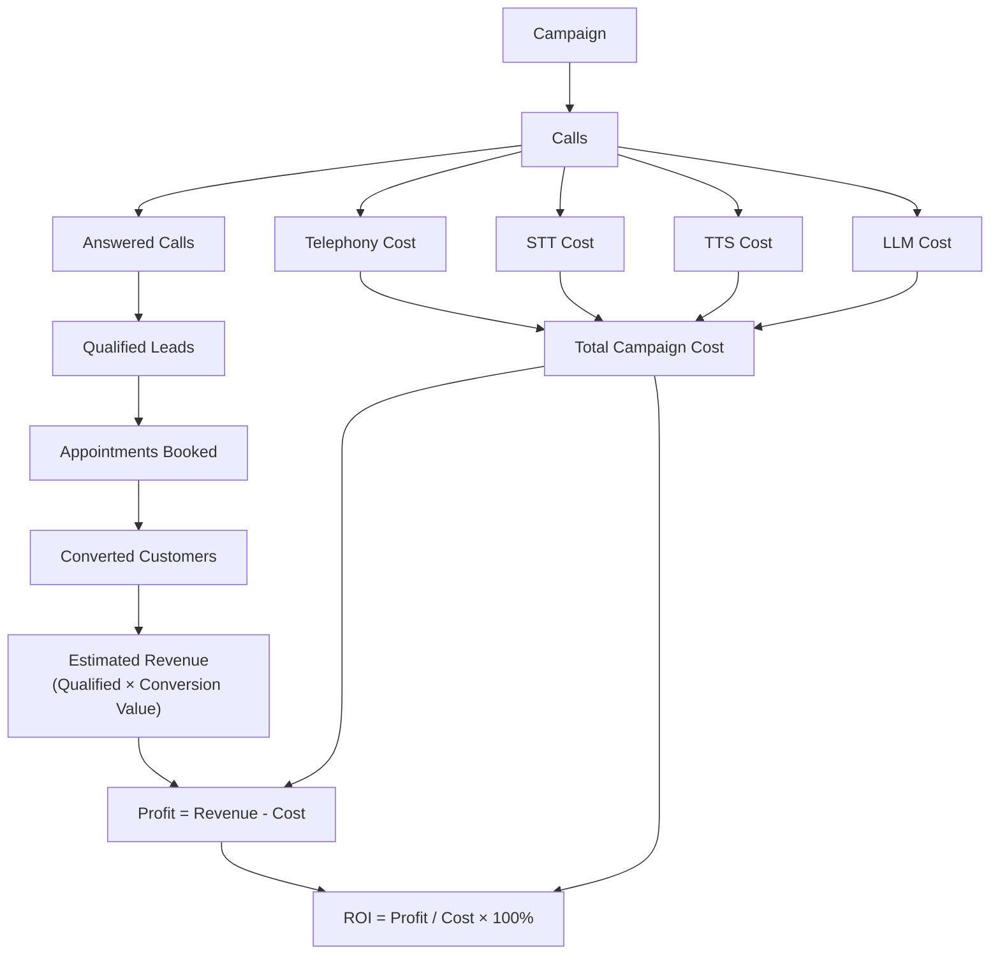
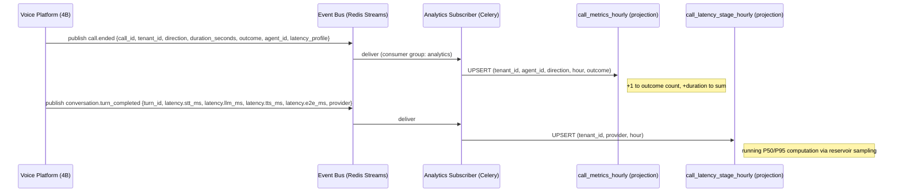
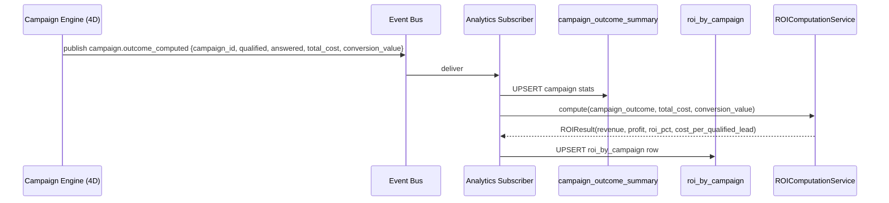
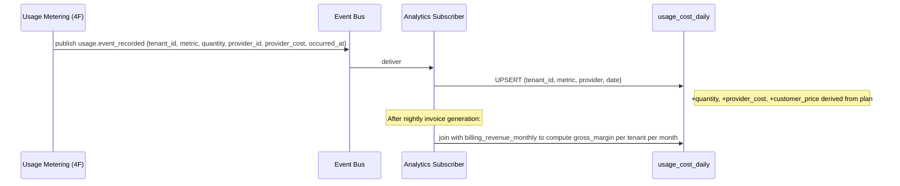
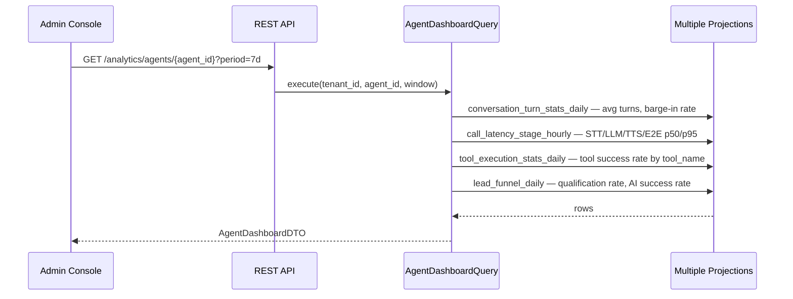

# Phase 4G — Domain-Driven Design: Analytics, Cross-Domain Context Map & Phase 5 Handoff

| | |
|---|---|
| **Roadmap phase** | Phase 4 (Domain-Driven Design) — sub-phase 4G: Final DDD phase |
| **Status** | Draft v1.0, for review |
| **Source of truth (approved, not redesigned here)** | Phase 1 SRS, Phase 2 HLA, Phase 3A–3F LLD, Phase 4A–4F DDD |
| **Purpose** | Complete the Analytics domain, produce the final cross-domain context map, validate the full DDD corpus, and hand off to Phase 5 (Database Design) |

---

## 0. How to Read This Document

This is the final Phase 4 document. It does three things:

1. **Designs the Analytics bounded context** — the one domain not yet designed in 4A–4F.
2. **Validates and consolidates the full DDD corpus** — the complete cross-domain context map, event catalog, ownership table, and consistency model.
3. **Produces the Phase 5 Database Design Handoff** — everything the database architect needs before writing a single DDL statement.

It does not generate code. It does not contradict any previously approved decision. Where prior documents made trade-offs, this document records them and confirms the resulting constraints on Phase 5.

---

## 1. Analytics Domain — Ubiquitous Language

| Term | Definition |
|---|---|
| **Metric** | A numeric measurement computed over a defined time window and dimensional scope — e.g., "Total Answered Calls for Tenant X in November" |
| **Dimension** | A categorical attribute by which a Metric is filtered or grouped — e.g., `tenant_id`, `agent_id`, `campaign_id`, `direction`, `provider` |
| **Measure** | The raw numeric value that a Metric is computed from — e.g., `duration_seconds`, `token_count`, `cost_usd` |
| **Projection** | A pre-computed, denormalized read model table that is updated by event handlers and read by dashboards without live aggregation |
| **KPI** | A Metric that has a defined target, threshold, or business significance — "Answer Rate should be ≥ 70%" |
| **Funnel** | A sequence of conversion steps across which a cohort of entities (calls, leads, campaigns) is tracked — e.g., Campaign → Called → Answered → Qualified → Converted |
| **ROI** | Return on Investment for a Campaign: `(Revenue - Cost) / Cost × 100%` |
| **CAC** | Customer Acquisition Cost: total cost to acquire one converted customer |
| **AI Success Rate** | The percentage of AI-handled calls that reached a defined terminal success state (QUALIFIED, APPOINTMENT_BOOKED, or COMPLETED without human escalation) |
| **Answer Rate** | `Answered Calls / Total Attempted Calls × 100%` |
| **Qualification Rate** | `Qualified Contacts / Answered Calls × 100%` |
| **Conversion Rate** | `Converted Contacts (LeadStatus = CONVERTED) / Qualified Contacts × 100%` |
| **Cost per Call** | Total platform cost (telephony + LLM + STT + TTS) for one call session |
| **Cost per Qualified Lead** | Total campaign cost / Qualified leads |
| **Gross Margin** | `(Billed Amount - Provider Cost) / Billed Amount × 100%` |
| **Data Freshness** | The maximum acceptable lag between an event occurring and its appearing in a dashboard — e.g., "near-real-time (< 60s)" vs. "daily (nightly batch)" |
| **Event-driven Projection** | A read model that is incrementally updated by consuming domain events — the preferred analytics pattern |
| **Analytic Event** | An event published specifically for analytics consumption, carrying a richer denormalized payload than the originating domain event |

---

## 2. Analytics Bounded Context — Classification

```
Analytics Context — Supporting Subdomain
```

**Why Supporting, not Core:** analytics does not originate any business logic — it is a consumer and reporter of facts created by the core domains (Voice, CRM, Campaign, Billing). The business rules of what to measure and how to present it are straightforward; the complexity is in the read model engineering. No off-the-shelf analytics platform fits the platform's multi-tenant, multi-domain event structure, so Analytics is Supporting rather than Generic.

**Why not part of each producing domain:** each domain (Voice, CRM, Campaign, Billing) would need to maintain its own query-optimised projections if analytics were distributed. Cross-domain metrics (e.g., Cost per Qualified Lead, which requires joining Campaign, Voice, CRM, and Billing data) would require cross-context queries that violate the module-boundary rule from Phase 3A. A dedicated Analytics context that consumes events from all domains is the correct solution.

---

## 3. Analytics Aggregates

### 3.1 Why Analytics Is Mostly CQRS Read Models, Not Traditional Aggregates

Analytics has no command surface that changes business state — it is a pure read domain. Its "aggregates" are in fact **read model projections** maintained by event handlers. The traditional DDD aggregate pattern (invariant-enforcing, transaction-bounded) applies only to the Analytics configuration objects (Dashboard definitions, saved Report definitions).

**Where CQRS Is Applied in Analytics (and why):**
- **All analytics dashboards** — the query model reads from pre-computed projections, never from the transactional tables of the producing domain. This satisfies the module-boundary rule and eliminates OLAP-style aggregation queries at request time.
- **Campaign and lead funnels** — funnel data is maintained as a materialized projection updated by campaign and CRM events.
- **Cost and ROI dashboards** — maintained as projections fed by `usage.event_recorded` and `billing.invoice.*` events.

**Where CQRS Is NOT Applied (and why):**
- **Platform administrative configuration** (Dashboard layouts, saved filter presets) — these are simple CRUD objects with no query/command split needed.

### 3.2 AnalyticsDashboard Aggregate (the one true aggregate in this context)

```
AnalyticsDashboard (AggregateRoot)
├── DashboardId              (Value Object — UUIDv7)
├── TenantId                 (Value Object — null for platform dashboards)
├── Name                     (Value Object)
├── DashboardType            (Value Object — EXECUTIVE|CALL|CAMPAIGN|LEAD|AGENT|COST|REVENUE|ROI|USAGE|OPERATIONAL)
├── Layout                   (Value Object — JSON widget layout)
├── Filters                  (Value Object — dict of default filter values)
├── IsShared                 (Value Object — boolean — visible to all org members)
└── CreatedByRef             (Value Object — UserId)
```

This is a configuration aggregate — it holds how a dashboard is laid out, not the data it displays.

---

## 4. Analytics Read Models (Projections)

### 4.1 Projection Design Principles

1. **One projection per dashboard type** — each dashboard reads from one or a small number of projection tables designed for its specific query pattern.
2. **Projections are never queried from transactional tables** — the Analytics context never queries `call_sessions`, `conversations`, `deals`, or `invoices` directly.
3. **Projections are eventual-consistent** — lag is typically < 30 seconds (Celery consumer processing time); dashboards display a freshness indicator.
4. **Projections are tenant-partitioned** — every projection row carries `tenant_id` as the first indexed column.

### 4.2 Projection Catalogue

| Projection Table | Feeds Dashboard | Updated by Events | Granularity |
|---|---|---|---|
| `call_metrics_hourly` | Call Analytics, Executive | `call.ended`, `call.failed` | Per tenant/agent/direction/hour |
| `call_latency_stage_hourly` | Call Analytics, Agent | Voice turn-latency events (custom, per turn) | Per tenant/provider/hour |
| `conversation_turn_stats_daily` | Agent Analytics | `conversation.turn_completed` | Per tenant/agent/day |
| `lead_funnel_daily` | Lead Analytics, Campaign | `contact.qualified`, `contact.converted`, `contact.lead_status_changed` | Per tenant/day |
| `campaign_outcome_summary` | Campaign Analytics | `campaign.contact.call_attempted`, `campaign.contact.qualified`, `campaign.completed` | Per campaign |
| `agent_utilization_hourly` | Agent Analytics, Operational | `call.started`, `call.ended` | Per tenant/agent/hour |
| `usage_cost_daily` | Cost Analytics, Usage | `usage.event_recorded` | Per tenant/metric/provider/day |
| `billing_revenue_monthly` | Revenue Analytics | `invoice.payment_succeeded`, `invoice.generated` | Per tenant/month |
| `roi_by_campaign` | ROI Analytics | `campaign.outcome_computed`, `billing.cost_entries` | Per campaign |
| `provider_health_5min` | Operational Monitoring | `provider.failed`, `provider.failover_triggered`, `provider.circuit_opened` | Per provider/5-min window |
| `tool_execution_stats_daily` | Agent Analytics | `tool_execution.succeeded`, `tool_execution.failed` | Per tenant/tool/day |
| `webhook_delivery_stats_daily` | Operational | `webhook.delivery_succeeded`, `webhook.delivery_failed` | Per tenant/day |
| `knowledge_retrieval_stats_daily` | Agent Analytics | `knowledge.retrieved` (Phase 4E) | Per tenant/kb/day |

---

## 5. Metric Definitions — Complete Catalogue

### 5.1 Call Metrics

| Metric | Definition | Source Event | Calculation | Dimensions | Freshness |
|---|---|---|---|---|---|
| Total Calls | Count of all calls initiated | `call.initiated` | COUNT(*) | tenant, agent, direction, period | Near-real-time |
| Inbound Calls | Calls where direction=INBOUND | `call.initiated` | COUNT WHERE direction=INBOUND | tenant, agent, period | Near-real-time |
| Outbound Calls | Calls where direction=OUTBOUND | `call.initiated` | COUNT WHERE direction=OUTBOUND | tenant, campaign, period | Near-real-time |
| Answered Calls | Calls that reached ACTIVE state | `call.answered` | COUNT(*) | tenant, agent, campaign, period | Near-real-time |
| Answer Rate | Answered / Attempted × 100 | Both above | Answered / (Answered + NoAnswer + Busy + Failed) × 100 | tenant, campaign, period | Near-real-time |
| No-Answer Rate | NoAnswer / Attempted × 100 | `call.ended` | COUNT WHERE outcome=NO_ANSWER / total | tenant, campaign | Near-real-time |
| Failed Calls | Calls that ended in FAILED state | `call.failed` | COUNT(*) | tenant, provider, period | Near-real-time |
| Avg Call Duration | Mean duration of ANSWERED calls | `call.ended` | AVG(duration_seconds) WHERE outcome=ANSWERED_* | tenant, agent, period | Daily |
| Call Completion Rate | Calls completed naturally without transfer or failure | `call.ended` | COUNT WHERE outcome=ANSWERED_COMPLETED / Answered × 100 | tenant, agent | Daily |
| Transfer Rate | Calls transferred to human | `call.transferred` | COUNT / Answered × 100 | tenant, agent, period | Daily |

### 5.2 AI / Conversation Metrics

| Metric | Definition | Source Event | Calculation | Dimensions | Freshness |
|---|---|---|---|---|---|
| Avg Response Latency (E2E) | Mean turn end-to-end latency | `conversation.turn_completed` | AVG(latency.e2e_ms) | tenant, agent, provider, period | Near-real-time |
| Avg STT Latency | Mean speech recognition time | `conversation.turn_completed` | AVG(latency.stt_ms) | tenant, stt_provider | Near-real-time |
| Avg LLM First Token | Mean LLM time-to-first-token | `conversation.turn_completed` | AVG(latency.llm_first_token_ms) | tenant, llm_provider, model | Near-real-time |
| Avg TTS First Audio | Mean TTS synthesis start time | `conversation.turn_completed` | AVG(latency.tts_first_audio_ms) | tenant, tts_provider | Near-real-time |
| AI Success Rate | AI calls reaching positive terminal state | `call.ended` + `contact.qualified` | (QUALIFIED + APPOINTMENT_BOOKED + COMPLETED_NO_TRANSFER) / Answered × 100 | tenant, agent | Daily |
| Barge-In Rate | Turns where caller interrupted agent | `conversation.barge_in_occurred` | COUNT / total_turns × 100 | tenant, agent, period | Daily |
| Avg Turns per Call | Mean conversation length | `conversation.completed` | AVG(total_turns) | tenant, agent | Daily |
| Tool Call Success Rate | Tool invocations that succeeded | `tool_execution.succeeded` / (`succeeded` + `failed` + `timed_out`) | tool, tenant, period | Daily |

### 5.3 Lead and CRM Metrics

| Metric | Definition | Source Event | Calculation | Dimensions |
|---|---|---|---|---|
| Lead Qualification Rate | Qualified / Answered Calls × 100 | `contact.qualified`, `call.ended` | COUNT(qualified) / COUNT(answered) × 100 | tenant, agent, campaign, period |
| Lead Disqualification Rate | Disqualified / Answered Calls × 100 | `contact.disqualified`, `call.ended` | COUNT | tenant, campaign |
| Lead Conversion Rate | Converted / Qualified × 100 | `contact.converted`, `contact.qualified` | COUNT(converted) / COUNT(qualified) × 100 | tenant, campaign, period |
| Appointment Rate | Appointments booked / Answered Calls × 100 | `appointment.booked`, `call.ended` | COUNT(appointments) / COUNT(answered) × 100 | tenant, agent, campaign |
| Customer Acquisition Cost (CAC) | Total cost to acquire one converted customer | All cost events + `contact.converted` | Total campaign cost / COUNT(converted) | tenant, campaign |
| Avg Lead Score at Qualification | Mean LeadScore when contact qualified | `contact.qualified` | AVG(lead_score_at_call) | tenant, campaign, period |

### 5.4 Campaign Metrics

| Metric | Definition | Source Event | Calculation | Dimensions |
|---|---|---|---|---|
| Campaign Answer Rate | Answered / Dialed × 100 for this campaign | `campaign.contact.call_attempted` | per campaign | campaign |
| Campaign Qualification Rate | Qualified / Answered for this campaign | `campaign.contact.qualified` + `call.ended` | per campaign | campaign |
| Campaign Cost | Total platform cost for all campaign calls | `usage.event_recorded` WHERE source_ref=campaign | SUM(provider_cost) | campaign |
| Campaign Revenue | Estimated revenue = qualified × estimated conversion value | `campaign.outcome_computed` | qualified × conversion_value | campaign |
| Campaign ROI | (Revenue - Cost) / Cost × 100 | Above | | campaign |
| Cost per Call (campaign) | Campaign Cost / Total Calls | Derived | | campaign |
| Cost per Qualified Lead | Campaign Cost / Qualified Leads | Derived | | campaign |
| Exhaustion Rate | Exhausted contacts / Total contacts × 100 | `campaign.contact.exhausted` | | campaign |

### 5.5 Cost and Revenue Metrics

| Metric | Definition | Source | Calculation | Currency |
|---|---|---|---|---|
| Telephony Cost | Amount paid to telephony providers | `usage.event_recorded` WHERE category=TELEPHONY | SUM(provider_cost) | USD |
| LLM Cost | Amount paid to LLM providers | `usage.event_recorded` WHERE category=LLM | SUM(provider_cost) | USD |
| STT Cost | Amount paid to STT providers | `usage.event_recorded` WHERE category=STT | SUM(provider_cost) | USD |
| TTS Cost | Amount paid to TTS providers | `usage.event_recorded` WHERE category=TTS | SUM(provider_cost) | USD |
| Embedding Cost | Amount paid for embedding API calls | `usage.event_recorded` WHERE category=EMBEDDING | SUM(provider_cost) | USD |
| Storage Cost | Object storage charges | `usage.event_recorded` WHERE category=STORAGE | SUM(provider_cost) | USD |
| Total Provider Cost | Sum of all provider costs | All above | SUM | USD |
| Billed Revenue | Amount invoiced to tenant | `invoice.generated` | SUM(total_due) | Tenant currency |
| Gross Margin | (Billed - Provider Cost) / Billed × 100 | Both above | | % |
| Profit per Organisation | Billed Revenue - Provider Cost | Derived | | USD |

---

## 6. KPI Definitions

| KPI | Target | Alert Threshold | Owner |
|---|---|---|---|
| Voice Turn E2E Latency p50 | < 800ms | > 1200ms | Platform Infra |
| Voice Turn E2E Latency p95 | < 1500ms | > 2000ms | Platform Infra |
| STT Provider Availability | > 99.5% | < 99.0% | Platform Infra |
| LLM Provider Availability | > 99.5% | < 99.0% | Platform Infra |
| Platform API Error Rate | < 0.1% | > 0.5% | Platform Infra |
| Answer Rate (outbound) | Tenant-defined; default target > 40% | < 20% | Campaign Manager |
| AI Success Rate | > 65% | < 40% | Agent Builder |
| Webhook Dead Letter Rate | < 0.1% of deliveries | > 1% | Platform Engineering |
| Invoice Payment Success Rate | > 98% on first attempt | < 95% | Billing Admin |
| Gross Margin | Platform-internal; target > 40% | < 25% | Platform Finance |

---

## 7. ROI Domain Model

### 7.1 Conceptual Flow



### 7.2 ROI Domain Service

```python
class ROIComputationService:
    """
    Computes campaign ROI from a CampaignOutcome and the associated cost entries.
    Pure function — receives pre-loaded data.
    Called by the analytics projection worker after campaign.outcome_computed.

    ROI = (estimated_revenue - total_cost) / total_cost * 100
    Estimated Revenue = qualified_count * estimated_conversion_value (from Campaign config)
    Total Cost = SUM(cost_entries.amount) WHERE source_ref matches campaign calls
    """
    def compute(
        self,
        campaign_outcome: CampaignOutcomeDTO,
        total_cost: Money,
        estimated_conversion_value: Money | None,
    ) -> ROIResult: ...
        # ROIResult: revenue, cost, profit, roi_pct, cac, cost_per_qualified_lead
```

### 7.3 ROI Projection — `roi_by_campaign`

| Column | Source | Notes |
|---|---|---|
| `campaign_id` | `campaign.completed` | PK |
| `tenant_id` | | |
| `total_calls` | `campaign_outcome_summary` | |
| `answered_calls` | `campaign_outcome_summary` | |
| `qualified_leads` | `campaign_outcome_summary` | |
| `converted_leads` | `contact.converted` WHERE `campaign_ref` | Set by CRM event consumer |
| `total_telephony_cost` | `cost_entries` WHERE category=TELEPHONY | |
| `total_llm_cost` | `cost_entries` WHERE category=LLM | |
| `total_stt_cost` | `cost_entries` WHERE category=STT | |
| `total_tts_cost` | `cost_entries` WHERE category=TTS | |
| `total_cost` | Sum of above | |
| `estimated_revenue` | `qualified_leads × conversion_value` | |
| `profit` | `revenue - cost` | |
| `roi_pct` | `profit / cost × 100` | Null if cost = 0 |
| `cost_per_call` | `total_cost / total_calls` | |
| `cost_per_qualified_lead` | `total_cost / qualified_leads` | Null if 0 qualified |
| `answer_rate_pct` | `answered / total × 100` | |
| `qualification_rate_pct` | `qualified / answered × 100` | |
| `computed_at` | | |

---

## 8. Event Sourcing Evaluation

### 8.1 Where Event Sourcing Could Help

| Domain | Potential benefit |
|---|---|
| Audit log (Phase 4A) | AuditEvent is already write-once — effectively event-sourced without the rebuild cost |
| Billing Invoice | Invoice has a clear state progression with meaningful history (who added each line, when) — event sourcing would give a perfect audit trail |

### 8.2 Where Event Sourcing Creates Unnecessary Complexity

| Domain | Why NOT event sourcing |
|---|---|
| Call / Conversation | The call state machine already emits domain events; full event sourcing would require rebuilding CallSession from events on every turn — at sub-800ms latency targets, this is unacceptable |
| CRM Contact / Deal | Contacts accumulate slowly; rebuilding a Contact from 50 events to answer a simple "what is their phone number?" query is wasteful |
| Campaign Contact | Millions of rows; rebuilding from events at campaign-outcome query time is computationally prohibitive |
| Knowledge Base / Documents | Document processing is not a business-meaningful event stream; it is an ETL pipeline |
| Subscription | Only 5–10 state transitions per subscription lifetime; standard CRUD + domain events is the right model |

**Decision:** no full event sourcing in this platform. The existing pattern of **standard aggregates + domain events + event-driven projections** (established in Phase 3A and applied consistently across 4A–4F) is the correct architecture. Adding event sourcing would add complexity without commensurate benefit at the current scale and latency requirements.

---

## 9. The Complete Cross-Domain Context Map

### 9.1 Final Context Map Diagram

```mermaid
graph TB
    subgraph SK["Shared Kernel — platform/shared_kernel/"]
        TID["TenantId, UserId, OrganizationId
        Money, EmailAddress, E164PhoneNumber
        DomainEvent envelope, Result type
        AggregateRoot, ValueObject bases
        Clock, IdGenerator"]
    end

    subgraph Core4A["4A — Core Platform (Core Domain)"]
        IAM["Identity & Access
        User, ApiKey aggregates"]
        ORG["Organization
        Organization, Membership, Team aggregates"]
        AZ["Authorization
        Role, Permission, RBAC"]
        AUD["Audit
        AuditEvent — write-once"]
        FF["Feature Flags
        FeatureFlag aggregate"]
        UQ["Usage & Quota
        (Moved to 4F)"]
    end

    subgraph Core4B["4B — Voice & AI (Core Domain)"]
        VC["Voice / Call
        Call, CallSession aggregates"]
        CV["Conversation
        Conversation, Turn aggregates"]
        AG["Agent Configuration
        Agent, AgentVersion aggregates"]
        TC["Tool Execution
        ToolDefinition, ToolExecution aggregates"]
        RC["Recording & Transcript
        Recording, Transcript aggregates"]
        PN["Provider Network
        ProviderConfig aggregate"]
    end

    subgraph Core4C["4C — CRM (Core Domain)"]
        CR["CRM / Lead
        Contact, Company aggregates"]
        DL["Deal & Pipeline
        Deal, Pipeline aggregates"]
        AC["Activities
        Activity, Task, Note aggregates"]
        AP["Appointments
        Appointment aggregate"]
        LS["Lead Scoring
        LeadScoreRecord aggregate"]
    end

    subgraph Core4D["4D — Campaign (Core Domain)"]
        CM["Campaign Management
        Campaign aggregate"]
        CE["Campaign Execution
        CampaignContact, CallJob aggregates"]
        CI["CSV Import
        CsvImportJob, ContactList aggregates"]
        CO["Campaign Outcomes
        CampaignOutcome aggregate"]
    end

    subgraph Supporting4E["4E — Intelligence (Supporting)"]
        KB["Knowledge & RAG
        KnowledgeBase, Document aggregates"]
        WF["Workflow Engine
        WorkflowDefinition, WorkflowExecution"]
        PM["Prompt Management
        PromptTemplate, PromptExperiment"]
        MEM["Conversation Memory
        SessionMemory, CustomerMemory"]
    end

    subgraph Supporting4F["4F — Commercial Platform (Supporting)"]
        BI["Billing & Subscription
        BillingAccount, Subscription, Invoice, Plan"]
        UM["Usage Metering
        UsageRecord, UsageEvent, CostEntry, QuotaConfig"]
        IN["Integrations
        IntegrationDefinition, IntegrationConnection"]
        WH["Webhooks
        WebhookEndpoint, WebhookDelivery"]
        PL["Plugins
        Plugin, PluginInstallation"]
    end

    subgraph Analytics4G["4G — Analytics (Supporting)"]
        AN["Analytics
        Projections, Dashboards, KPIs, ROI"]
    end

    %% Shared Kernel flows
    SK -.-> Core4A & Core4B & Core4C & Core4D & Supporting4E & Supporting4F & Analytics4G

    %% 4A → others (OHS / upstream)
    IAM -->|"OHS: CheckPermission
    Published Language: user.registered, apikey.revoked"| Core4B & Core4C & Core4D & Supporting4E & Supporting4F
    ORG -->|"Published Language: org.created
    OHS: TenantContext"| Core4B & Core4C & Core4D & Supporting4E & Supporting4F
    AZ -->|"OHS: CheckPermission (all downstream)"| Core4B & Core4C & Core4D & Supporting4E
    FF -->|"OHS: EvaluateFlag"| Core4B & Core4D & Supporting4E & Supporting4F
    AUD -->|"Conformist: ALL contexts publish → Audit consumes"| Core4B & Core4C & Core4D & Supporting4E & Supporting4F

    %% 4B relationships
    AG -->|"Customer → Supplier: AgentVersion snapshot"| VC
    VC -->|"Customer → Supplier: CallId, TenantId"| CV
    CV -->|"Customer → Supplier: ConversationId"| TC & RC & MEM
    WF -->|"OHS: WorkflowExecutionPort"| CV
    PM -->|"OHS: PromptRenderPort"| CV
    MEM -->|"OHS: ConversationMemoryPort"| CV
    KB -->|"OHS: KnowledgeSearchPort (via tool)"| TC
    PL -->|"OHS: invoke_plugin (via Tool Calling)"| TC

    %% 4B → 4C (events)
    VC -->|"Published Language: call.ended
    call.failed, call.transferred"| CR & CE & UM & WH & AN
    CV -->|"Published Language: conversation.qualification_set
    conversation.summarization_completed"| CR & AN
    TC -->|"Published Language: tool_execution.succeeded/failed"| AN & UM

    %% 4C relationships
    CR -->|"OHS: FindOrCreateContact, is_dnc()"| CE
    CR -->|"Published Language: contact.qualified
    contact.converted, contact.lead_status_changed"| CE & BI & AN & WH
    DL -->|"Published Language: deal.won, deal.lost"| AN & WH
    AP -->|"Published Language: appointment.booked"| AN & WH
    IN -->|"ACL: Salesforce/HubSpot events → CRM commands"| CR

    %% 4D relationships
    CE -->|"Customer → Supplier: InitiateOutboundCall"| VC
    CE -->|"Published Language: campaign.contact.call_attempted
    campaign.contact.qualified, campaign.completed"| CR & BI & AN & WH
    CM -->|"Published Language: campaign.started/paused/completed"| AN & WH & BI
    CO -->|"Published Language: campaign.outcome_computed"| AN & WH

    %% 4E relationships
    WF -->|"Published Language: workflow.execution_completed"| AN & BI
    KB -->|"Published Language: document.indexed"| AN & BI
    PM -->|"Published Language: prompt.version_published
    experiment.assigned"| AN

    %% 4F relationships
    UM -->|"OHS: CheckQuota (consumed by 4B, 4D)"| VC & CE
    BI -->|"Published Language: invoice.paid
    subscription.changed, payment.failed"| AN & WH
    BI -->|"OHS: CostLookupPort (consumed by 4D ROI)"| CO
    WH -->|"Conformist: dispatches all domain events to external subscribers"| VC & CR & CM & BI
    UM -->|"Published Language: usage.quota_exceeded
    usage.threshold_approached"| BI & AN & WH
```



### 9.2 Relationship Type Summary

| From | To | Type | Notes |
|---|---|---|---|
| Shared Kernel | ALL | **Shared Kernel** | `TenantId`, `UserId`, `Money`, `DomainEvent` envelope, base classes |
| Organization (4A) | All others | **Published Language** | `org.created` creates BillingAccount, seeds Quota, etc. |
| Authorization (4A) | All downstream | **Open Host Service** | `CheckPermission` use case — stable, versioned |
| Feature Flags (4A) | Voice, Workflow, Campaign | **Open Host Service** | `EvaluateFlag` use case — all consumers are Conformist |
| Audit (4A) | All contexts | **Conformist** (all others → Audit) | Audit subscribes to all events; never produces |
| Agent (4B) | Voice/Call (4B) | **Customer → Supplier** | Agent supplies AgentVersion snapshot; Call is customer |
| Workflow (4E) | Conversation (4B) | **Open Host Service** | `WorkflowExecutionPort` — Conversation is customer |
| Prompt Management (4E) | Conversation (4B) | **Open Host Service** | `PromptRenderPort` — Conversation is customer |
| Memory (4E) | Conversation (4B) | **Open Host Service** | `ConversationMemoryPort` |
| Knowledge/RAG (4E) | Tool Execution (4B) | **Open Host Service** | `KnowledgeSearchPort` via `lookupKnowledge` tool |
| CRM (4C) | Campaign Execution (4D) | **Open Host Service** | `FindOrCreateContact`, `is_dnc()` |
| Campaign Exec (4D) | Voice/Call (4B) | **Open Host Service** | `InitiateOutboundCallUseCase` |
| Usage Metering (4F) | Voice/Call (4B), Campaign (4D) | **Open Host Service** | `CheckQuota` |
| Plugins (4F) | Tool Execution (4B) | **Open Host Service** | `invoke_plugin` |
| Integrations (4F) | CRM (4C) | **Anti-Corruption Layer** | Salesforce/HubSpot wire format → CRM domain commands |
| Webhooks (4F) | All contexts | **Conformist** | Dispatches all domain events to external subscribers |
| Analytics (4G) | All contexts | **Conformist** | Pure consumer of all domain events; publishes nothing |
| Voice/Call → CRM | CRM (4C) | **Published Language** | `call.ended` → Activity; domain events as integration contract |

---

## 10. Domain Ownership Table

| Domain | Aggregate(s) | Writes | Primary Events Produced | Primary Events Consumed | DB Ownership | Consistency Boundary |
|---|---|---|---|---|---|---|
| Identity | User, ApiKey | `users`, `api_keys` | `user.registered`, `apikey.revoked` | `org.created` | `identity` schema | Per-aggregate, per-request |
| Organization | Organization, Membership, Team, Role | `organizations`, `memberships`, `teams`, `roles` | `org.created`, `org.suspended`, `membership.*` | `user.registered` | `organization` schema | Per-aggregate; dual-aggregate for Ownership Transfer |
| Authorization | (reads Membership, Role) | (cache only in Redis) | `role.permissions_updated` | `membership.role_changed` | Shared tables | Per-request cache |
| Audit | AuditEvent | `audit_events` | (internal only) | ALL events from all contexts | `audit` schema | Append-only; no transaction |
| Feature Flags | FeatureFlag | `feature_flags` | `feature_flag.*` | None | `feature_flags` schema | Per-aggregate |
| Voice / Call | Call, CallSession | `call_sessions` | `call.initiated`, `call.ended`, `call.failed` | `agent.published`, `quota.checked` | `voice` schema | Per-aggregate; dual for StartConversation |
| Conversation | Conversation, Turn | `conversations` (Postgres) + Redis hot-tier | `conversation.turn_completed`, `conversation.completed` | `call.answered` | `voice` schema | Per-turn checkpoint |
| Agent | Agent, AgentVersion | `agents`, `agent_versions` | `agent.published`, `agent.deprecated` | None | `voice` schema | Per-aggregate |
| Tool Execution | ToolDefinition, ToolExecution | `tool_definitions`, `tool_executions` | `tool_execution.*` | `agent.published` (for tool registry) | `voice` schema | Per-aggregate |
| Recording | Recording | `recordings` (metadata) + S3 (audio) | `recording.stored` | `conversation.completed` | `voice` schema | Per-aggregate |
| Transcript | Transcript, TranscriptSegment | `transcripts` | `transcript.completed` | `conversation.turn_completed` | `voice` schema | Append-only |
| Provider Network | ProviderConfig | `provider_configs` + Redis health | `provider.circuit_opened`, `provider.failover_triggered` | Internal polling | `voice` schema | Per-config |
| CRM / Contact | Contact, Company | `contacts`, `companies` | `contact.created`, `contact.qualified`, `contact.converted` | `call.ended`, `conversation.qualification_set` | `crm` schema | Per-aggregate; dual for MergeContacts |
| Deal / Pipeline | Deal, Pipeline | `deals`, `pipelines` | `deal.created`, `deal.won`, `deal.lost` | `conversation.qualification_set` | `crm` schema | Per-aggregate |
| Activities | Activity, Task, Note | `activities`, `tasks`, `notes` | `activity.recorded`, `task.completed` | `call.ended`, `appointment.booked` | `crm` schema | Per-aggregate |
| Appointments | Appointment | `appointments` | `appointment.booked`, `appointment.cancelled` | `conversation.qualification_set` | `crm` schema | Per-aggregate |
| Lead Scoring | LeadScoreRecord | `lead_score_records` | `contact.score_updated` | `call.ended`, `appointment.booked` | `crm` schema | Per-record (write-once) |
| Campaign | Campaign | `campaigns` | `campaign.started`, `campaign.completed` | `contact_list.ready` | `campaign` schema | Per-aggregate |
| Campaign Execution | CampaignContact, CallJob | `campaign_contacts`, `call_jobs` | `campaign.contact.*` | `call.ended`, `conversation.qualification_set` | `campaign` schema | Per-aggregate; idempotency key on CallJob |
| CSV Import | CsvImportJob, ContactList | `csv_import_jobs`, `contact_lists` | `import.completed` | None | `campaign` schema | Per-aggregate |
| Campaign Outcome | CampaignOutcome | `campaign_outcomes` | `campaign.outcome_computed` | `campaign.completed` | `campaign` schema | Per-aggregate |
| Knowledge Base | KnowledgeBase, Document, IngestionJob | `knowledge_bases`, `documents`, `ingestion_jobs` | `document.indexed`, `document.deleted` | None | `knowledge` schema | Per-aggregate |
| Workflow Engine | WorkflowDefinition, WorkflowExecution | `workflow_definitions` (JSONB) + `workflow_executions` + Redis | `workflow.published`, `workflow.execution_completed` | `call.answered` | `workflow` schema | Per-turn checkpoint |
| Prompt Management | PromptTemplate, PromptExperiment | `prompt_templates`, `prompt_experiments` | `prompt.published`, `prompt.rolled_back` | None | `workflow` schema | Per-aggregate |
| Memory | SessionMemory, CustomerMemory | `session_memories`, `customer_memories` + Redis | `memory.session_summarized` | `conversation.completed` | `workflow` schema | Per-turn (session); per-call (customer) |
| Billing | BillingAccount, Subscription, Plan, Invoice | `billing_accounts`, `subscriptions`, `plans`, `invoices` | `subscription.created`, `invoice.generated`, `invoice.payment_succeeded` | `org.created`, `usage.quota_exceeded` | `billing` schema | Per-aggregate; Invoice generation as batch |
| Usage Metering | UsageRecord, UsageEvent, CostEntry, QuotaConfig | `usage_events`, `usage_records`, `cost_entries`, `quota_configs` | `usage.event_recorded`, `usage.quota_exceeded` | ALL events from 4B, 4D, 4E | `billing` schema | Append-only (events); INCR (Redis counter); batch (records) |
| Integrations | IntegrationDefinition, IntegrationConnection | `integration_definitions`, `integration_connections` | `integration.connected`, `integration.disconnected` | None | `integrations` schema | Per-aggregate |
| Webhooks | WebhookEndpoint, WebhookDelivery | `webhook_endpoints`, `webhook_deliveries` | `webhook.delivery_succeeded`, `webhook.dead_lettered` | ALL events from all contexts | `webhooks` schema | Per-delivery |
| Plugins | Plugin, PluginInstallation | `plugins`, `plugin_installations` | `plugin.installed`, `plugin.activated` | `org.created` | `plugins` schema | Per-aggregate |
| Analytics | Projections, AnalyticsDashboard | Projection tables (see §4.2) | None | ALL events from all contexts | `analytics` schema | Eventual (projection lag) |

---

## 11. Complete Domain Event Catalog

### 11.1 Event Catalog Format

Each entry: Event Name | Producer | Consumers | Idempotency | Delivery Guarantee | Schema Version

### 11.2 Core Platform Events (4A)

| Event | Producer | Consumers | Idempotency Key | Delivery |
|---|---|---|---|---|
| `org.created` | Organization | Billing, Usage, Analytics, Audit | `org_id` | At-least-once |
| `org.suspended` | Organization | Auth (cache clear), Billing, Analytics, Audit, Webhook | `org_id + suspended_at` | At-least-once |
| `membership.user_invited` | Membership | Audit, Notification | `membership_id` | At-least-once |
| `membership.invitation_accepted` | Membership | Usage (MEMBERS counter), Audit | `membership_id` | At-least-once |
| `membership.role_changed` | Membership | Auth (cache invalidate), Audit | `membership_id + version` | At-least-once |
| `apikey.revoked` | Authorization | Auth (cache delete), Audit | `api_key_id` | At-least-once |
| `feature_flag.rule_added` | Feature Flags | Feature Flag cache invalidation | `flag_key + rule_id` | At-least-once |
| `quota.exceeded` | Usage Metering | Billing, Webhook, Audit | `tenant_id + metric + period` | At-least-once |
| `audit.event_recorded` | Audit | (internal — not published externally by default) | `audit_event_id` | At-least-once |

### 11.3 Voice & AI Events (4B)

| Event | Producer | Consumers | Idempotency Key | Delivery |
|---|---|---|---|---|
| `call.initiated` | Voice/Call | Analytics, Audit | `call_id` | At-least-once |
| `call.answered` | Voice/Call | Analytics, Billing (start metering) | `call_id + answered_at` | At-least-once |
| `call.ended` | Voice/Call | CRM (Activity), Campaign Exec (outcome), Usage (metering), Analytics, Webhook, Billing | `call_id + ended_at` | At-least-once |
| `call.failed` | Voice/Call | Campaign Exec (retry trigger), Analytics, Webhook | `call_id + failed_at` | At-least-once |
| `call.transferred` | Voice/Call | CRM (Activity), Analytics, Webhook | `call_id` | At-least-once |
| `conversation.turn_completed` | Conversation | Analytics (latency), Billing (tokens), Transcript | `turn_id` | At-least-once |
| `conversation.qualification_set` | Conversation | CRM (qualify lead), Campaign Exec (outcome), Analytics, Webhook | `conversation_id + set_at` | At-least-once |
| `conversation.completed` | Conversation | Memory (summarize), Recording (finalize), Transcript (complete), Billing | `conversation_id` | At-least-once |
| `conversation.summarization_completed` | Conversation/Memory | CRM (add AI note), Analytics | `session_memory_id` | At-least-once |
| `tool_execution.succeeded` | Tool Execution | Analytics, Billing (if cost), Audit | `execution_id` | At-least-once |
| `tool_execution.failed` | Tool Execution | Analytics, Audit | `execution_id` | At-least-once |
| `agent.published` | Agent | Analytics, Audit | `agent_id + version_id` | At-least-once |
| `recording.stored` | Recording | CRM (attach to contact), Analytics, Audit | `recording_id` | At-least-once |
| `transcript.completed` | Transcript | CRM (attach to contact), Analytics | `transcript_id` | At-least-once |
| `provider.failover_triggered` | Provider Network | Analytics, Audit | `provider_id + triggered_at` | At-least-once |
| `provider.circuit_opened` | Provider Network | Analytics, Alertmanager | `provider_id + opened_at` | At-least-once |

### 11.4 CRM Events (4C)

| Event | Producer | Consumers | Idempotency Key | Delivery |
|---|---|---|---|---|
| `contact.created` | CRM | Analytics, Webhook | `contact_id` | At-least-once |
| `contact.qualified` | CRM | Campaign Exec (update outcome), Analytics, Webhook | `contact_id + qualified_at` | At-least-once |
| `contact.converted` | CRM | Billing (conversion event), Analytics, Webhook | `contact_id + converted_at` | At-least-once |
| `contact.score_updated` | Lead Scoring | Analytics | `contact_id + computed_at` | At-least-once |
| `deal.won` | Deal | Analytics, Webhook, CRM (trigger convert) | `deal_id` | At-least-once |
| `appointment.booked` | Appointment | Analytics, Webhook, Notification | `appointment_id` | At-least-once |
| `activity.recorded` | Activity | Analytics | `activity_id` | At-least-once |

### 11.5 Campaign Events (4D)

| Event | Producer | Consumers | Idempotency Key | Delivery |
|---|---|---|---|---|
| `campaign.started` | Campaign | Analytics, Billing, Webhook | `campaign_id + started_at` | At-least-once |
| `campaign.completed` | Campaign | Analytics, Billing, Webhook | `campaign_id` | At-least-once |
| `campaign.contact.call_attempted` | Campaign Exec | CRM (Activity), Analytics, Billing | `campaign_contact_id + attempt_number` | At-least-once |
| `campaign.contact.qualified` | Campaign Exec | CRM (qualify lead), Analytics, Webhook | `campaign_contact_id + call_id` | At-least-once |
| `campaign.outcome_computed` | Campaign Outcome | Analytics, Webhook | `campaign_id + computed_at` | At-least-once |

### 11.6 Intelligence Events (4E)

| Event | Producer | Consumers | Idempotency Key | Delivery |
|---|---|---|---|---|
| `document.indexed` | Knowledge | Analytics, Billing (embedding cost), Audit | `document_id` | At-least-once |
| `workflow.published` | Workflow | Analytics, Audit | `workflow_id + version_id` | At-least-once |
| `workflow.execution_completed` | Workflow | Analytics, Billing (LLM cost) | `execution_id` | At-least-once |
| `prompt.version_published` | Prompt Mgmt | Analytics, Cache invalidation | `prompt_id + version_id` | At-least-once |
| `prompt.rolled_back` | Prompt Mgmt | Analytics, Cache invalidation, Audit | `prompt_id + environment + rolled_back_at` | At-least-once |
| `memory.session_summarized` | Memory | CRM (add AI note), Analytics | `session_memory_id` | At-least-once |

### 11.7 Commercial Platform Events (4F)

| Event | Producer | Consumers | Idempotency Key | Delivery |
|---|---|---|---|---|
| `subscription.created` | Billing | Analytics, Usage (seed quotas), Audit | `subscription_id` | At-least-once |
| `subscription.plan_changed` | Billing | Analytics, Usage (update quotas), Webhook | `subscription_id + effective_at` | At-least-once |
| `invoice.generated` | Billing | Analytics, Webhook, Notification | `invoice_id` | At-least-once |
| `invoice.payment_succeeded` | Billing | Analytics, Webhook, Subscription (resolve PAST_DUE) | `invoice_id + payment_attempt_id` | At-least-once |
| `invoice.payment_failed` | Billing | Analytics, Webhook, Subscription (→ PAST_DUE) | `invoice_id + attempt_id` | At-least-once |
| `usage.event_recorded` | Usage Metering | Analytics, CostEntry creation | `usage_event_id` | At-least-once |
| `usage.quota_exceeded` | Usage Metering | Billing, Webhook, Analytics | `tenant_id + metric + exceeded_at` | At-least-once |
| `integration.connected` | Integrations | Analytics, Audit | `connection_id` | At-least-once |
| `webhook.delivery_dead_lettered` | Webhooks | Analytics, Alertmanager | `delivery_id` | At-least-once |
| `plugin.activated` | Plugins | Tool Registry (register endpoints), Analytics | `installation_id` | At-least-once |

---

## 12. Consistency Model

### 12.1 Strong Consistency (Same Transaction)

Required when two aggregates must both succeed or both fail:

| Operation | Aggregates in one UoW | Reason |
|---|---|---|
| Create Organization | Organization + Owner Membership | Owner invariant — org without owner is invalid |
| Start Call | Call + Conversation (ConversationRef set) | ConversationRef on Call is set exactly once; both must commit |
| Transfer Ownership | Two Membership records | Exactly-one-Owner invariant requires both role changes atomically |
| Publish Agent | Agent + new AgentVersion snapshot | Version must exist before Call can reference it |
| Publish Workflow | WorkflowDefinition + new WorkflowVersion | Same as Agent |
| CSV Import: per batch | Multiple CampaignContact records | All or nothing per batch |

### 12.2 Eventual Consistency (Event-Driven)

Acceptable where the receiving system can tolerate lag and retry:

| From | To | Acceptable Lag |
|---|---|---|
| `call.ended` → CRM Activity | < 5 seconds | Supervisor view not real-time |
| `call.ended` → Usage metering | < 10 seconds | Billing quota enforcement uses Redis (real-time); Postgres is audit |
| `conversation.summarization_completed` → CRM Note | < 60 seconds | Post-call summary — no real-time requirement |
| Any event → Analytics projection | < 60 seconds | Dashboard data freshness acceptable |
| Any event → Webhook delivery | < 30 seconds | External integrations expect near-real-time |
| `invoice.generated` → Notification email | < 5 minutes | Acceptable for billing notifications |

### 12.3 Idempotency Requirements

Every event consumer must be idempotent:

| Consumer type | Mechanism |
|---|---|
| Postgres INSERT (usage events, audit events) | `IdempotencyKey` as UNIQUE constraint — duplicate INSERTS silently succeed (ON CONFLICT DO NOTHING) |
| Redis INCR (quota counter) | Idempotency key checked in Postgres before INCR; duplicate events are discarded |
| CRM Activity from `call.ended` | `call_id` stored on Activity; check existence before INSERT |
| Webhook delivery creation | `payload_hash` per WebhookDelivery — duplicate payloads for same webhook are deduplicated |
| Analytics projection update | `UPSERT` (INSERT ON CONFLICT UPDATE) for all projection tables |

### 12.4 Event Ordering

The platform does **not** guarantee strict event ordering across contexts (Redis Streams does not provide global ordering across multiple streams). Consumers must be resilient to out-of-order delivery:

| Scenario | Risk | Mitigation |
|---|---|---|
| `call.ended` arrives before `conversation.qualification_set` | CRM creates Activity before knowing qualification result | Two-phase update: Activity created on `call.ended`; enriched on `qualification_set` |
| `campaign.contact.qualified` arrives before `campaign.contact.call_attempted` | Analytics projection shows 0 attempts for a qualified lead | Projection uses UPSERT; final state is correct after both events arrive |
| `invoice.payment_succeeded` before `invoice.generated` | Billing subscriber cannot find the invoice | Dead-letter with retry; invoice_generated is always published first (same transaction) |

---

## 13. Sequence Diagrams — Analytics Flows

### 13.1 Call → Analytics



### 13.2 Campaign → Analytics → ROI



### 13.3 Usage → Cost → Profit Analytics



### 13.4 Executive Dashboard Query Flow

```mermaid
sequenceDiagram
    participant UI as Admin Console (Next.js)
    participant API as REST API
    participant Query as ExecutiveDashboardQuery (CQRS read)
    participant Proj as Analytics Projection Tables (Postgres)

    UI->>API: GET /analytics/executive?period=last_30_days&tenant_id=X
    API->>Query: execute(tenant_id, window)
    Query->>Proj: SELECT SUM(calls), AVG(duration), SUM(qualified) FROM call_metrics_hourly
        WHERE tenant_id=X AND hour >= start
    Query->>Proj: SELECT SUM(revenue), SUM(cost), AVG(margin) FROM billing_revenue_monthly
        WHERE tenant_id=X AND month >= start_month
    Query->>Proj: SELECT SUM(qualified), SUM(converted) FROM lead_funnel_daily
        WHERE tenant_id=X AND date >= start
    Proj-->>Query: aggregated rows
    Query-->>API: ExecutiveDashboardDTO
    API-->>UI: JSON (renders in < 200ms — all from pre-computed projections)
```

### 13.5 AI Agent Dashboard



---

## 14. Architecture Validation — Full DDD Corpus Review

### 14.1 Aggregate Boundary Validation

| Issue checked | Finding | Resolution |
|---|---|---|
| Any aggregate with unbounded embedded collections? | `Turn` in Conversation (bounded by call length, ~50 max — acceptable). `NodeExecutionHistory` in WorkflowExecution (same reasoning). `PaymentAttempt` in Invoice (max ~10 per invoice). All others are either separate aggregates or truly bounded. | ✅ No unbounded embedded collections found |
| Any aggregate that requires loading all children to enforce an invariant? | None — all cross-aggregate invariants use domain services (OwnershipTransferService, ContactDeduplicationService, DealStageValidationService) | ✅ |
| Any aggregate with more than one natural language-level consistency boundary merged? | WorkflowExecution + WorkflowDefinition: clearly separate (execution state vs. graph definition). Call + Conversation: separate per DDR-4B-001. | ✅ |

### 14.2 Ownership Validation

| Issue checked | Finding |
|---|---|
| Duplicate aggregate ownership (two contexts claim the same aggregate) | None found. ApiKey owned by Identity (4A); APIKeyUsage tracking is a Usage Metering record (4F) — different concepts. LeadScore computation is Lead Scoring context (4C); qualification criteria configuration is Agent (4B) — different concerns. |
| Module importing another module's aggregate directly | Enforced by CI import-linter gate (Phase 3A §2.3). Pattern used everywhere: cross-module calls via published use cases or ports, never direct imports. |
| Circular domain dependencies | No circular dependencies found. Dependency flow: `SK → 4A → 4B ← 4C ← 4D → 4B; 4E → 4B; 4F ← 4B,4D,4E; 4G ← all`. Strictly a DAG. |

### 14.3 Event Coverage Validation

| Missing event check | Finding |
|---|---|
| Is every aggregate state change that matters to another context published as an event? | All critical state changes produce events. One gap identified: `appointment.no_show` is published by Appointments (4C) but has no defined Analytics consumer — added to analytics subscriber §11.4 catalogue. |
| Are there events that need to be consumed by Analytics but are not in the catalogue? | `provider.circuit_opened` → Analytics (latency/availability dashboards) — added to §11.3. |
| Are all consumers of `call.ended` correctly documented? | CRM, Campaign Execution, Usage Metering, Analytics, Webhook, Billing — all confirmed in §11.3. |

### 14.4 Security Validation

| Security check | Finding |
|---|---|
| Any domain aggregate carrying plaintext secrets? | CredentialRef pattern enforced across 4A (ApiKey: KeyHash not raw key), 4F (IntegrationConnection, PluginInstallation, WebhookEndpoint all use CredentialRef). No plaintext secrets in any domain aggregate. ✅ |
| Tenant isolation enforced at every layer? | 3A §11 defines the mechanism (TenantContext contextvar + Postgres RLS + Redis key namespacing). Every aggregate carries `tenant_id`. Every repository extends `TenantScopedRepository`. ✅ |
| PII in domain events? | Events carry `contact_id`, `call_id` references — not raw PII (phone number, email, transcript text). Transcript text lives in the Transcript aggregate, not in events. Recording audio lives in S3, not in events. ✅ |

### 14.5 Scalability Validation

| Scalability check | Finding |
|---|---|
| High-volume tables identified for partitioning? | `usage_events`, `audit_events`, `webhook_deliveries`, `call_sessions`, `transcripts`, `activities`, `campaign_contacts`, `document_chunks`. All identified in §15 Phase 5 Handoff. |
| Any synchronous cross-domain calls on the voice hot path? | The voice turn hot path (sub-800ms) makes synchronous calls only to: WorkflowExecutionPort, PromptRenderPort, ConversationMemoryPort (load only, at turn 1), LlmPort, SttPort, TtsPort. All others (CRM update, billing metering, analytics) are async via event bus. ✅ |
| Any N+1 query patterns in domain services? | All domain services receive pre-loaded aggregates — no repository calls inside domain service methods. Application services do the loading. ✅ |

### 14.6 Contradiction Check Across All Phases

| Potential contradiction | Resolution |
|---|---|
| Phase 3A defines `QuotaEnforcementService` in 3A §6.5 | Phase 4F clarifies that ownership belongs to the Usage Metering bounded context. The 3A definition was infrastructure-level; 4F's domain service is the canonical version. No code contradiction — same logic, correct layer now specified. |
| Phase 3B §11 defines `ModelRouter` as an application service; Phase 3D promotes it to a module; Phase 4D §11.1 finalises it as the `LLMProviderRouter` bounded context | Consistent evolution — each phase added detail without contradicting the prior layer. The final design is `llm_provider_router` as a supporting subdomain within `modules/`. |
| Phase 4A §10.4 discusses Redis TTL for RBAC; Phase 4F discusses quotas enforced via Redis | Both are correct and complementary — Redis is used for two distinct purposes (RBAC cache + quota hot counter) under different key namespaces. No contradiction. |
| Phase 3C §5.4 establishes Lead = Contact with LeadStatus; Phase 4C §2.1 confirms | Fully consistent. ✅ |
| Phase 3B Review Note 1 (Workflow per-turn) resolved in 4E; Phase 4B §18.4 sequence confirmed | Consistent. WorkflowExecutionPort called per-turn. ✅ |

---

## 15. CQRS Decisions — Final Summary

| Context | CQRS Applied? | Read Side | Write Side | Justification |
|---|---|---|---|---|
| Organization | Partial | `ContactReadRepository` for list queries | `OrganizationRepository` full aggregates | Membership list is read far more than written |
| CRM / Contact | Yes | `ContactReadRepository` (DTO projection) + `CallHistoryEntry` | `ContactRepository` | Call history is cross-domain (event-fed projection) |
| Deal / Pipeline | Yes | `PipelineBoardDTO` (materialized) | `DealRepository` | Pipeline board aggregation is expensive if computed live |
| Campaign | Yes | `CampaignProgressDTO` (Redis + Postgres count) | `CampaignRepository` | Real-time progress reads on different cadence from writes |
| Analytics | Full CQRS | All reads from projection tables | Event-fed projections | Analytics is read-only domain — no write commands except dashboard config |
| Billing | Partial | Invoice list from read model | Invoice aggregate for generation/payment | Invoice list is query-heavy; Invoice aggregate writes are batch |
| Voice / Call | No | Direct repository queries | Call aggregate | Read pattern is simple (one call at a time, by ID); no aggregation needed |
| Identity | No | Direct repository queries | User, ApiKey aggregates | Read volume is low relative to writes; no aggregation needed |
| Workflow Execution | No (Redis hot-tier acts as fast read) | Redis cache for per-turn reads | Postgres for checkpoint | Not CQRS per se — same model, different storage tier |

**CQRS is NOT applied universally.** It is applied only where: (a) the read query pattern is genuinely different from the write model (aggregation, cross-domain joins, high read frequency vs. low write frequency) OR (b) the data is sourced from a different domain (event-fed projections).

---

## 16. Trade-offs (Full Platform)

| Trade-off | Decision | Cost | Benefit |
|---|---|---|---|
| Modular monolith vs. microservices | Modular monolith (Phase 2) | Cannot scale individual modules independently without deployment changes | Lower operational complexity; shared transaction boundary where needed; easy module extraction later |
| Eventual consistency for analytics | Event-driven projections | Dashboard data lags by up to 60s | No OLAP queries against transactional tables; predictable query performance |
| Redis quota enforcement + Postgres audit | Two stores per usage event | Nightly reconciliation task required | Sub-millisecond quota enforcement; durable audit trail |
| No event sourcing | Standard aggregates + events | Cannot replay domain history from events alone | Dramatically lower complexity; acceptable for current scale and latency targets |
| pgvector at launch (not ClickHouse) | PostgreSQL for all analytics projections | Analytics query performance will degrade at very high volume | No second OLAP database to operate; `AnalyticsWritePort` abstraction allows swap without producer changes |
| CQRS only where justified | Partial CQRS (6 of 20 contexts) | Inconsistent pattern across codebase | Avoids CQRS ceremony where it adds no value; applied only where read/write patterns genuinely diverge |

---

## 17. Open Questions (Final Platform-Wide)

| # | Question | Phase it blocks |
|---|---|---|
| OQ-FINAL-01 | Which payment gateway vendor? (Phase 4F OQ-4F-01) | Phase 5 (Billing tables), Phase 24 |
| OQ-FINAL-02 | ClickHouse activation trigger — when does analytics migrate? | Phase 22 (Deployment) |
| OQ-FINAL-03 | Embedding provider selection — which model at launch? (4E OQ-4E-01) | Phase 5 (pgvector dimension), Phase 24 |
| OQ-FINAL-04 | Recurring campaign recurrence rule format (4D OQ-4D-03) | Phase 5 (SchedulingPolicy schema) |
| OQ-FINAL-05 | Is `appointment.no_show` an analytics event with its own projection row? | Phase 5 (lead_funnel_daily schema) |
| OQ-FINAL-06 | Multi-currency billing? (4F OQ-4F-02) | Phase 5 (Money storage, currency columns) |
| OQ-FINAL-07 | Audit retention per plan tier (4A OQ-4A-06) | Phase 5 (audit_events partition rotation policy) |
| OQ-FINAL-08 | Grace period duration for PAST_DUE subscriptions (4F OQ-4F-03) | Phase 5 (subscription.grace_period_ends_at column) |

---

## 18. PHASE 5 — DATABASE DESIGN INPUT

*This section is the direct handoff from Phase 4 DDD to Phase 5 Database Design. The database architect must read and honour every item below before writing any DDL.*

---

### 18.1 Guiding Principles for Phase 5

1. **Every table must have a `tenant_id` column** (UUID), indexed as the first column in all composite indexes, except tables that are platform-global (e.g., `plans`, `integration_definitions`, `plugins`).
2. **PostgreSQL Row-Level Security (RLS)** must be configured for every tenant-scoped table. The RLS policy reads `app.tenant_id` set by `platform/infrastructure/db/rls.py` at transaction start.
3. **UUIDv7 as primary keys everywhere** — time-sortable, globally unique, no integer sequence leakage. Phase 3A §6.4 justification applies.
4. **Append-only tables have no UPDATE or DELETE** at the application role level — enforced via `REVOKE UPDATE, DELETE ON <table> FROM application_role`. Applies to: `audit_events`, `usage_events`, `cost_entries`, `transcript_segments`, `lead_score_records`, `activities`.
5. **JSONB for embedded configuration** — `workflow_definitions.graph_json`, `agent_versions.snapshot_json`, `pipeline.stages` (JSONB), `prompt_template.versions` (JSONB). Phase 5 must specify validation constraints on these columns.
6. **`created_at` and `updated_at` on all mutable tables** — `created_at DEFAULT NOW()`, `updated_at` updated by trigger.
7. **No plaintext secrets in any column** — `credential_ref` columns store opaque reference strings only. Validated by CHECK constraint: `length(credential_ref) >= 10 AND credential_ref LIKE 'secret_manager://%'` (exact pattern TBD).

---

### 18.2 Schema Assignments per Bounded Context

| PostgreSQL Schema | Bounded Contexts | Notes |
|---|---|---|
| `identity` | User, ApiKey, Role | Platform-global (no RLS on User; RLS on ApiKey by tenant) |
| `organization` | Organization, Membership, Team, FeatureFlag, QuotaConfig | Full RLS |
| `voice` | Call, Conversation, Agent, AgentVersion, ToolDefinition, ToolExecution, Recording, Transcript, ProviderConfig | Full RLS |
| `crm` | Contact, Company, Deal, Pipeline, Activity, Task, Note, Appointment, LeadScoreRecord | Full RLS |
| `campaign` | Campaign, CampaignContact, CallJob, CsvImportJob, ContactList, CampaignOutcome | Full RLS |
| `knowledge` | KnowledgeBase, Document, IngestionJob, DocumentChunk | Full RLS; `document_chunks` has pgvector index |
| `workflow` | WorkflowDefinition, WorkflowExecution, PromptTemplate, PromptExperiment, SessionMemory, CustomerMemory | Full RLS |
| `billing` | BillingAccount, Subscription, Plan, PlanVersion, Invoice, UsageRecord, UsageEvent, CostEntry | Full RLS; high-volume tables partitioned |
| `integrations` | IntegrationDefinition (no RLS), IntegrationConnection (RLS) | |
| `webhooks` | WebhookEndpoint, WebhookDelivery | Full RLS; `webhook_deliveries` partitioned |
| `plugins` | Plugin (no RLS), PluginInstallation (RLS) | |
| `analytics` | All projection tables, AnalyticsDashboard | Full RLS |
| `audit` | AuditEvent | Full RLS; append-only; `audit_chain` for hash chaining |

---

### 18.3 High-Volume Tables — Partitioning Requirements

| Table | Partition Strategy | Partition Key | Reason | Retention |
|---|---|---|---|---|
| `usage_events` | RANGE by month | `occurred_at` | Millions of rows — one per billable event per call per turn | 90 days hot; 7 years cold (S3) |
| `cost_entries` | RANGE by month | `occurred_at` | One per billable event, same as usage_events | 90 days |
| `audit_events` | RANGE by month | `occurred_at` | Compliance; high write frequency | 1 year hot; 7 years cold |
| `webhook_deliveries` | RANGE by month | `created_at` | One per event per subscriber | 30 days (DELIVERED); 90 days (DEAD_LETTER) |
| `call_sessions` | RANGE by month | `started_at` | Millions of calls | 12 months hot; 7 years cold |
| `transcript_segments` | LIST by `knowledge_base_id` hash or RANGE | `created_at` or `kb_id` | High volume per document | Aligned with document lifecycle |
| `activities` | RANGE by month | `occurred_at` | Unbounded CRM activity history | 5 years |
| `campaign_contacts` | LIST by `campaign_id` or RANGE | TBD | Millions per campaign batch | Campaign lifetime + 2 years |
| `document_chunks` | LIST by `knowledge_base_id` | `knowledge_base_id` | RAG retrieval always filters by KB | KB lifetime |

---

### 18.4 Index Requirements

| Table | Index | Type | Rationale |
|---|---|---|---|
| `contacts` | `(tenant_id, primary_phone)` | UNIQUE | Deduplication invariant |
| `contacts` | `(tenant_id, lead_status)` | B-tree | Contact list filtering |
| `contacts` | `(tenant_id, lead_score)` | B-tree | Score-based sorting |
| `call_sessions` | `(tenant_id, status)` | B-tree + partial (`WHERE status = 'ACTIVE'`) | Active call query |
| `call_sessions` | `(tenant_id, agent_id, started_at)` | B-tree | Agent dashboard |
| `campaign_contacts` | `(campaign_id, status)` | B-tree | Executor tick query |
| `campaign_contacts` | `(campaign_id, next_attempt_at)` | B-tree | Retry queue recovery |
| `call_jobs` | `(idempotency_key)` | UNIQUE | Deduplication invariant |
| `document_chunks` | Vector (HNSW) on `embedding` | pgvector HNSW | ANN search — m=16, ef_construction=64 (initial; tune at scale) |
| `document_chunks` | `(tenant_id, knowledge_base_id)` | B-tree partial | Tenant + KB filter before vector scan |
| `document_chunks` | Full-text on `text_content` | `GIN tsvector` | Hybrid search keyword component |
| `audit_events` | `(tenant_id, occurred_at)` | BRIN | Time-range queries on append-only table |
| `usage_events` | `(tenant_id, metric, occurred_at)` | B-tree | Usage aggregation |
| `webhook_deliveries` | `(webhook_id, status, created_at)` | B-tree | Dead letter queries |
| `api_keys` | `(key_hash)` | UNIQUE | Authentication lookup |
| `organizations` | `(slug)` | UNIQUE | Global slug uniqueness |
| `memberships` | `(organization_id, user_id)` | UNIQUE | One membership per org per user |
| `workflow_executions` | `(session_ref)` | UNIQUE | One execution per call session |
| `prompt_templates` | `(tenant_id, name)` | UNIQUE | Name uniqueness per tenant |

---

### 18.5 Vector Storage (pgvector)

| Parameter | Value | Notes |
|---|---|---|
| Extension | `pgvector` 0.7+ | Must be enabled in Supabase |
| Dimensions | Determined by `EmbeddingModelRef` per KnowledgeBase | Phase 5 must use a column type `vector(N)` with N from the embedding model; DDR-4E-003 makes this immutable per KB |
| Index type | HNSW | Better query performance than IVFFlat at the scale targeted |
| Initial HNSW params | `m=16`, `ef_construction=64` | Conservative start; tune with load tests |
| Tenant isolation | Partial B-tree index on `(tenant_id, knowledge_base_id)` applied before vector scan | Phase 3D §9.4 design |
| Concurrent insert strategy | Bulk insert without index rebuild; nightly `VACUUM` + index maintenance | Phase 3D §9.4 trade-off |

---

### 18.6 S3 / Supabase Storage Namespacing

| Object type | Key pattern | Retention | Notes |
|---|---|---|---|
| Call recordings | `org/{tenant_id}/recordings/{year}/{month}/{call_id}.{codec}` | Per org policy (default 90 days) | Lifecycle policy in S3 |
| Ingested documents | `org/{tenant_id}/knowledge/{kb_id}/{doc_id}.{ext}` | KB lifetime | Versioning enabled |
| Parsed document text | `org/{tenant_id}/knowledge/{kb_id}/{doc_id}/parsed.txt` | Job lifetime | Intermediate; deleted after indexing |
| CSV imports | `org/{tenant_id}/campaigns/{campaign_id}/imports/{job_id}.csv` | 30 days | Deleted after successful import |
| Analytics exports | `org/{tenant_id}/analytics/exports/{report_id}.csv` | 7 days | On-demand |

---

### 18.7 Redis Key Namespacing (Full Catalogue)

| Key Pattern | Purpose | Owner Context | TTL |
|---|---|---|---|
| `session:{tenant_id}:{call_id}` | Call hot state | Voice | Call duration + 5 min |
| `workflow_exec:{session_id}` | Workflow execution cursor | Workflow | Call duration + 10 min |
| `rbac:permissions:{tenant_id}:{user_id}` | RBAC permission cache | Authorization | 5 min (explicit invalidation on role change) |
| `apikey:{key_hash}` | API key auth cache | Identity | 5 min (explicit invalidation on revoke) |
| `prompt_cache:{prompt_id}:{env}:{version_hash}` | Rendered prompt cache | Prompt Management | 5 min |
| `kb_embed:{sha256(query_text)}` | Embedding cache for RAG queries | Knowledge | 1 hour |
| `agent_version:{version_id}` | AgentVersion snapshot cache | Agent | 1 hour (immutable — long TTL acceptable) |
| `usage:quota:{tenant_id}:{metric}` | Real-time usage counter | Usage Metering | Billing period; reset on rollover |
| `campaign:queue:{tenant_id}:{campaign_id}` | Call Queue (List) | Campaign Execution | Campaign lifetime |
| `campaign:retry_queue:{tenant_id}:{campaign_id}` | Retry Queue (Sorted Set) | Campaign Execution | Campaign lifetime |
| `campaign:concurrency:{tenant_id}:{campaign_id}` | Live call counter | Campaign Execution | Rolling |
| `campaign:lock:{campaign_id}` | Executor tick distributed lock | Campaign Execution | Tick duration (~10s) |
| `session_memory:{session_id}` | Session turn list (List) | Memory | Call duration |
| `providerhealth:{provider_id}` | Provider health + circuit state | Provider Network | 60s rolling window |
| `feature_flag:{flag_key}:{tenant_id}` | Flag evaluation cache | Feature Flags | 1 min (invalidated on flag.updated) |
| `plugin:ratelimit:{tenant_id}:{plugin_id}` | Plugin callout rate limiting | Plugins | Rolling 60s |

---

### 18.8 Future ClickHouse Migration Candidates

These tables are candidates for migration to ClickHouse when Postgres query latency on them exceeds acceptable thresholds. The `AnalyticsWritePort` abstraction (Phase 4F §5.3 / Phase 4G §4.1) means migration is an adapter swap — no producer code changes.

| Table | Trigger for migration | Priority |
|---|---|---|
| `usage_events` | Query latency > 1s on monthly aggregations | High |
| `cost_entries` | Same as above | High |
| `call_sessions` | Historical reporting queries > 2s | Medium |
| Analytics projection tables (`call_metrics_hourly`, etc.) | If serving >100 concurrent dashboard users | Low (Postgres typically handles this well) |
| `audit_events` | Compliance query performance | Low |
| `transcript_segments` | Full-text search at scale | Medium |

**ClickHouse is NOT required for Phase 24 MVP.** All analytics operate on Postgres projections initially. The migration is an infrastructure operation, not a domain design change.

---

### 18.9 Transactional Boundaries — Phase 5 Must Enforce

| Operation | Tables in one transaction | Enforcement |
|---|---|---|
| CreateOrganization | `organizations` + `memberships` (owner) + `quota_configs` (seeded from plan) | Application UoW |
| PublishAgent | `agents` UPDATE + `agent_versions` INSERT | Application UoW |
| PublishWorkflow | `workflow_definitions` UPDATE + embedded version JSONB | Single row JSONB update |
| GenerateInvoice | `invoices` INSERT + `invoice_lines` INSERT | Application UoW |
| RecordUsageEvent | `usage_events` INSERT + Outbox INSERT | Same transaction |
| AttemptPayment | `invoices` UPDATE (status) + `payment_attempts` INSERT | Application UoW |
| MergeContacts | `contacts` UPDATE (primary) + `contacts` UPDATE (secondary, status=MERGED) | Application UoW, dual-aggregate |
| TransferOwnership | `memberships` UPDATE ×2 (old owner → ADMIN, new → OWNER) + `organizations` UPDATE (owner_id) | Application UoW, dual-aggregate |

---

### 18.10 Audit Requirements

| Table | Append-only? | Audit strategy | Retention |
|---|---|---|---|
| `audit_events` | Yes — `REVOKE UPDATE, DELETE` | Hash-chain (nightly) — Phase 4A §11.3 | 1 year hot; 7 years S3 |
| `usage_events` | Yes — `REVOKE UPDATE, DELETE` | Append-only by constraint | 90 days hot; 7 years S3 |
| `cost_entries` | Yes | Same | 90 days |
| `transcript_segments` | Partial (final segments replace partials) | IsPartial flag; only final are permanent | Call lifetime + 2 years |
| `lead_score_records` | Yes | History table — never updated | 5 years |
| `activities` | Yes | Append-only | 5 years |
| `webhook_deliveries` | Append-only delivery records | Payload hash for deduplication | 30 days DELIVERED; 90 days DEAD_LETTER |

---

### 18.11 What Phase 5 Must Produce

Phase 5 (Database Design) must produce, in this order:

1. **ERD** — entity-relationship diagram covering all tables and their foreign keys across all 13 schemas.
2. **DDL** — CREATE TABLE statements with correct column types, constraints, defaults, and RLS policies.
3. **Index DDL** — all indexes from §18.4, including the pgvector HNSW index with specified parameters.
4. **Partitioning DDL** — all partitioned tables from §18.3, with partition creation scripts.
5. **RLS policies** — per-table `CREATE POLICY` statements using `app.tenant_id` session variable.
6. **Alembic migration structure** — initial migration + per-feature migration pattern; migration ordering that respects FK dependencies.
7. **Seeding scripts** — Plan seeding, system Role seeding, IntegrationDefinition seeding, ProviderConfig seeding, system FeatureFlag seeding.
8. **Retention policies** — S3 lifecycle rules and Postgres partition drop schedule for each table in §18.10.
9. **pgvector configuration** — extension enablement, HNSW parameters, and partial index for tenant+KB filtering.
10. **Phase 5 must flag any table or relationship where Phase 4 DDD is ambiguous or contradictory** — contradictions discovered in Phase 5 must be raised as Architecture Review Notes before any DDL is finalised.

---

## 19. Risks (Final Platform)

| Risk | Mitigation |
|---|---|
| `usage_events` volume overwhelming Postgres before ClickHouse migration | Monthly partitioning + BRIN indexes + `AnalyticsWritePort` abstraction ready from day 1 |
| Circular event consumption (event A triggers event B which re-triggers event A) | All event consumers are idempotent; no event consumer publishes to the same topic it subscribes to |
| Analytics projections falling behind under high load (>10K events/min) | Celery worker scaling (HPA) on the `analytics` queue; projection lag monitoring in Grafana |
| Cross-schema FK references creating deployment ordering dependencies | Phase 5 must resolve schema dependency order; only cross-schema IDs (not FKs) across major boundaries |
| Postgres hot-tier and Redis divergence for quota counters | Nightly reconciliation task; divergence window < 24h; billing uses Postgres as source of truth |

---

## 20. Final Architecture Principle Compliance Checklist

| Principle | Compliance |
|---|---|
| Domain-Driven Design | ✅ — 7 phases, 20+ bounded contexts, full aggregate/value-object/domain-service design |
| Clean Architecture | ✅ — Domain never imports FastAPI, SQLAlchemy, Redis, Celery, or any provider |
| Hexagonal Architecture | ✅ — All external systems (telephony, STT, TTS, LLM, payment, storage, secret manager) behind ports |
| SOLID | ✅ — Single responsibility per aggregate/service; ports/adapters for DI; no God classes |
| CQRS where appropriate | ✅ — Applied in 6 of 20 contexts where read/write patterns genuinely diverge |
| Event-driven integration | ✅ — All cross-domain integration via domain events; no synchronous cross-context coupling except OHS ports |
| Multi-tenancy | ✅ — TenantId on every aggregate; RLS at DB layer; Redis key namespacing; S3 path namespacing |
| Eventual consistency where appropriate | ✅ — Analytics, CRM activity projections, usage metering; strong consistency only where required |
| Idempotency | ✅ — IdempotencyKey on all event consumers; UPSERT for all projections |
| Scalability | ✅ — Stateless services; Redis for hot path; partitioned tables for high volume; HPA on all pods |
| Low latency | ✅ — Voice hot path never calls billing, analytics, or CRM synchronously |
| Security | ✅ — CredentialRef pattern; RBAC; tenant isolation; PII out of events; append-only audit |
| Provider independence | ✅ — All provider integrations behind ports in infrastructure layer |
| Modular monolith (Phase 2 decision) | ✅ — Module boundaries enforced by import-linter CI gate; no mandatory microservice split |
