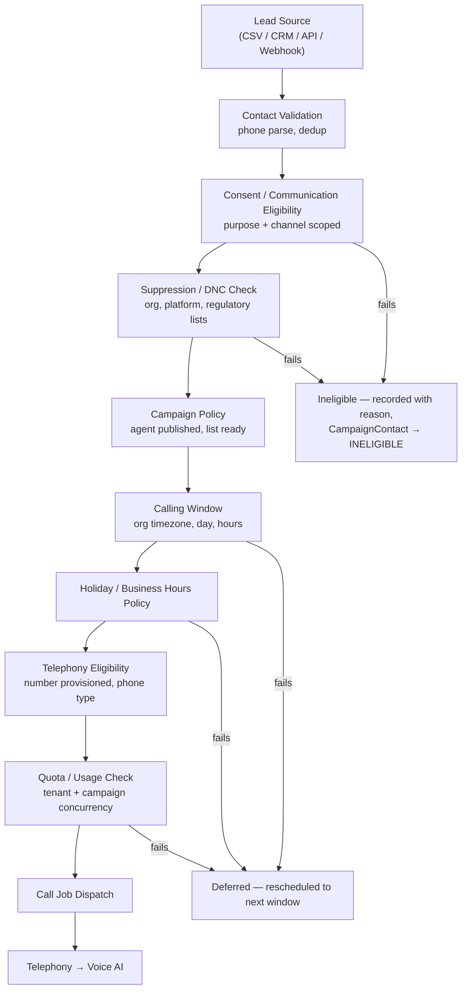
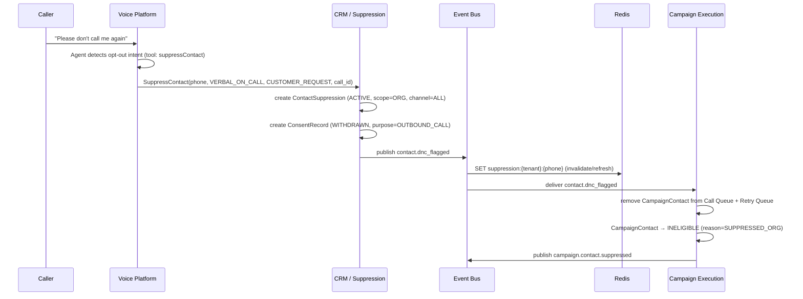

# Phase 4I — India-First Enterprise SaaS
## Final Product, Domain & Architecture Decision Closure

| | |
|---|---|
| **Document type** | Decision closure — not a redesign |
| **Status** | Final Phase 4 baseline, for approval before Phase 5 |
| **Baseline (authoritative, not re-opened)** | Phase 1 SRS, Phase 2 HLA, Phase 3A–3F LLD, Phase 4A–4H DDD |
| **Purpose** | Close the two Phase 4H blockers, establish India-first commercial and operational defaults, and produce the definitive Phase 5 Database Design handoff |
| **Deployment principle reaffirmed** | Bounded Context ≠ Microservice. Modular-monolith-first with three approved runtime boundaries: Core API, Voice Gateway, Background Worker. |

---

## 1. Executive Summary

This document closes Phase 4. It does not redesign anything. It makes the decisions that were deliberately deferred through 4A–4H, and it establishes India as the platform's default commercial, linguistic, and operational profile — without hard-coding India into domain logic.

**The two Phase 4H blockers are now CLOSED:**

| Blocker | Decision | Effect on Phase 5 |
|---|---|---|
| OQ-FINAL-03 — Embedding model | OpenAI `text-embedding-3-large`, explicitly requested at **1536 dimensions** via the API's `dimensions` parameter, cosine distance, HNSW index | `document_chunks.embedding` is `vector(1536)`; embedding provenance columns are mandatory |
| OQ-FINAL-06 — Multi-currency | **Multi-currency capable, INR-default.** Every persisted monetary value carries an explicit ISO-4217 currency code. No implicit platform currency. | Every money column is a `(amount NUMERIC, currency CHAR(3))` pair — never a bare number |

**Six additional decisions are closed in this document:**

1. **India-first defaults** are organisation-level configuration (`country=IN`, `currency=INR`, `timezone=Asia/Kolkata`, `locale=en-IN`), seeded as defaults — never as domain constants.
2. **Language priority** for V1 is Tamil → English → Telugu → Hindi, with a formal Language Evaluation Framework so Tamil quality is measured rather than assumed.
3. **Outbound eligibility is a first-class domain concern.** CSV import no longer flows directly to dialling; an explicit `OutboundEligibilityService` gates every call.
4. **Consent is purpose-and-channel scoped**, not a boolean. DNC/suppression is a first-class aggregate, not a flag on Contact.
5. **GST-ready billing** — tax is configuration-driven with no rates or thresholds encoded in schema or domain constants.
6. **Payments** go through `PaymentProviderPort` with Razorpay as the first adapter and Cashfree as the documented second.

**What changes structurally:** three new aggregates enter the baseline — `ContactSuppression`, `ConsentRecord`, and `LocalizationProfile` (organisation-level) — plus `TaxProfile` inside Billing. All four fit inside existing bounded contexts. **No new bounded context is created. No context becomes a microservice.**

**One genuine contradiction found** during validation, concerning the stated embedding dimension. It is resolvable without changing the decision (see §27.1) and does not block Phase 5.

**Final gate: PHASE 5 READY.**

---

## 2. India-First Product Decisions

### 2.1 What "India-First" Means Architecturally

India-first is a **defaults and evaluation-priority decision**, not a coupling decision. Concretely:

| Dimension | India-first means | India-first does NOT mean |
|---|---|---|
| Currency | INR is the seeded default for new organisations | INR is hard-coded anywhere in the domain |
| Timezone | `Asia/Kolkata` is the seeded default | Calling-window logic assumes IST |
| Phone | `IN` is the default `phone_country` for parsing | Phone logic assumes 10 digits or a `+91` prefix |
| Language | Tamil is first in the V1 evaluation queue | Language handling branches on `if language == "ta"` in the domain |
| Compliance | Indian telemarketing norms shape the default policy template | Indian regulatory rules are compiled into aggregates |
| Telephony | Exotel is the first production adapter | The domain knows Exotel exists |
| Payments | Razorpay is the first adapter | Billing aggregates carry Razorpay fields |
| Tax | GST fields exist in the tax profile model | GST rates or slabs are schema constants |
| Residency | An India-region deployment profile exists | Region names appear in domain logic |

**The test applied throughout:** a US-based organisation should be able to sign up on day one of global expansion and receive correct behaviour by changing configuration values only — no code change, no schema migration, no new bounded context.

### 2.2 The LocalizationProfile Concept

The platform needs one place where an organisation's operating context lives. Phase 4A's `Organization` aggregate already carries `Settings`; this document formalises a `LocalizationProfile` value object within it rather than creating a new aggregate.

```
LocalizationProfile (Value Object — embedded in Organization.Settings)
├── CountryCode              (ISO 3166-1 alpha-2 — default "IN")
├── Currency                 (ISO 4217 — default "INR")
├── Timezone                 (IANA — default "Asia/Kolkata")
├── Locale                   (BCP 47 — default "en-IN")
├── PhoneCountry             (ISO 3166-1 alpha-2 for phone parsing — default "IN")
├── PrimaryLanguage          (BCP 47 — default "en-IN")
├── SupportedLanguages       (ordered list[BCP 47] — default ["ta-IN","en-IN"])
├── BusinessHours            (list[TimeWindow] — org's operating hours)
├── DefaultCallingWindows    (list[CallingWindow] — default outbound windows)
├── HolidayCalendarRef       (nullable HolidayCalendarId — default "IN-national")
├── TaxProfileRef            (nullable TaxProfileId — see §12)
├── CompliancePolicyRef      (nullable CompliancePolicyId — see §7)
└── DataResidencyProfile     (Value Object — STANDARD | INDIA_ENTERPRISE | REGIONAL)
```

**Why a value object inside Organization, not a new aggregate:** every field here is read together, written together, and has no independent lifecycle. It is the organisation's operating configuration — inseparable from the organisation itself. Creating a separate aggregate would add a join to every call-setup path for no consistency benefit.

**Invariants:**
1. `Currency` is set at organisation creation and is **write-once** — changing an organisation's billing currency mid-life would corrupt historical invoice comparability. A currency change requires a documented migration procedure, not a field update.
2. `SupportedLanguages` must contain at least one entry, and `PrimaryLanguage` must appear in it.
3. `Timezone` must be a valid IANA identifier — validated at the value-object boundary.
4. `CountryCode` and `PhoneCountry` may differ (an Indian company calling UK numbers) — this is legal and must not be constrained.

### 2.3 Seeding vs. Hard-Coding

Phase 5 must seed these defaults in the organisation-creation path, not in column `DEFAULT` clauses where the default expresses a business assumption. Specifically:

- `organizations.currency` — no column default. Set explicitly by `CreateOrganizationUseCase` from the signup context. A column default of `'INR'` would silently mis-assign currency to a future US tenant whose signup flow forgot to set it.
- `organizations.timezone` — column default `'Asia/Kolkata'` is acceptable (a wrong timezone is recoverable; a wrong currency is not).
- `organizations.country_code` — no column default, same reasoning as currency.

---

## 3. Market Strategy

### 3.1 Positioning Statement

The platform is an **India-first enterprise AI voice automation platform** — a multi-tenant SaaS combining telephony, real-time voice AI, CRM, campaign automation, RAG, workflow automation, human handoff, analytics, ROI attribution, usage billing, and enterprise integrations.

It is explicitly not positioned as a chatbot, a call-centre product, a CRM, a telephony wrapper, or an LLM wrapper. Each of those is a component; the product is the integration of all of them with commercial accountability (cost, margin, ROI) attached.

### 3.2 Target Segments (V1)

| Segment | Primary use cases | Language profile |
|---|---|---|
| Indian SMB sales teams | Outbound cold calling, lead qualification, appointment booking | Tamil + English, Hindi + English |
| Indian services businesses (clinics, education, real estate) | Inbound reception, appointment booking, follow-up | Regional + English |
| Indian NBFC / collections | Outbound reminders, payment follow-up | Regional + English, high compliance sensitivity |
| Indian D2C / e-commerce | Order confirmation, survey, win-back campaigns | Hindi + English, Tamil + English |
| Indian enterprise (mid-market) | All of the above with CRM integration and data residency requirements | Multi-language, India Enterprise deployment profile |

### 3.3 Global Readiness Constraint

The architecture is global-ready by construction: every India-specific behaviour is expressed as configuration on `LocalizationProfile`, `CompliancePolicy`, `TaxProfile`, or a provider adapter. Global expansion is a matter of adding adapters (telephony, payment) and policy templates — not of restructuring domains.

---

## 4. Language Strategy

### 4.1 V1 Language Priority

| Rank | Language | BCP 47 | V1 status |
|---|---|---|---|
| 1 | Tamil | `ta-IN` | Priority evaluation — see §4.4 |
| 2 | English (India) | `en-IN` | Baseline |
| 3 | Telugu | `te-IN` | V1 target |
| 4 | Hindi | `hi-IN` | V1 target |

**Future (architecture must accommodate without redesign):** Kannada, Malayalam, Marathi, Bengali, Gujarati, Punjabi, Odia, Assamese, and others.

### 4.2 The Language Configuration Model

Phase 4B already established `VoiceConfig.Language` and `VoiceConfig.TamilCodeSwitching`. This document generalises the latter — a Tamil-specific boolean does not scale to twelve languages.

```
LanguagePolicy (Value Object — on AgentVersion.VoiceConfig)
├── PrimaryLanguage          (BCP 47 — the language the agent opens in)
├── FallbackLanguage         (BCP 47 — used when detection is inconclusive)
├── AllowedLanguages         (ordered list[BCP 47] — languages the agent may switch to)
├── CodeSwitchingEnabled     (boolean — permits mixed-language utterances)
├── LanguageDetectionMode    (STATIC | FIRST_UTTERANCE | CONTINUOUS)
├── PronunciationLexiconRef  (nullable LexiconId — brand names, product names)
└── ScriptPreference         (NATIVE | LATIN | MIXED — e.g. Tamil script vs. Tanglish)
```

**Migration note for Phase 5:** `VoiceConfig.TamilCodeSwitching` (Phase 4B §5.3.1) is **superseded** by `LanguagePolicy.CodeSwitchingEnabled` + `AllowedLanguages`. This is a generalisation, not a contradiction — the Tamil-specific flag becomes `AllowedLanguages = ["ta-IN","en-IN"], CodeSwitchingEnabled = true`. Phase 4B's `TamilCapableProviderSpecification` generalises to `LanguageCapableProviderSpecification(language)`.

### 4.3 Code-Switching Is the Default Assumption

The domain must never assume a conversation stays in one language. Real Indian conversations mix:

| Pattern | Example shape |
|---|---|
| Tanglish | Tamil grammar with English nouns, verbs, and numbers |
| Hinglish | Hindi grammar with English technical and commercial terms |
| Telugu + English | Regional grammar with English product names and digits |
| Numeric switching | Digits, dates, amounts, and phone numbers spoken in English inside a regional sentence |
| Proper-noun switching | Brand names, place names, and person names in English or transliterated |

**Domain implication:** `Utterance.DetectedLanguage` (Phase 4B §5.2) must be understood as the *dominant* language of the utterance, not the exclusive one. A new value object records the full picture:

```
LanguageObservation (Value Object — on Turn.Utterance)
├── DominantLanguage         (BCP 47)
├── DetectedLanguages        (list[BCP 47] — all languages present)
├── CodeSwitchDetected       (boolean)
└── DetectionConfidence      (0.0–1.0)
```

### 4.4 Tamil-First Language Evaluation Framework

Tamil receives dedicated evaluation because English benchmark performance does not predict Tamil quality. This is a domain-level framework, not an ad-hoc test suite.

**Evaluation dimensions — each must be scored per provider, per language:**

| Dimension | What is measured | Why it matters commercially |
|---|---|---|
| Word Error Rate (WER) | STT accuracy on native-script Tamil | Baseline comprehension |
| Code-switch WER | STT accuracy on Tanglish utterances | Most real conversations are mixed |
| Numeric accuracy | Digits, amounts, phone numbers, dates | A wrong phone number destroys a lead |
| Named-entity accuracy | Person names, place names, brand names | Wrong name = failed rapport |
| Address accuracy | Indian address components, PIN codes | Appointment and delivery use cases |
| Acronym handling | EMI, KYC, GST, NBFC spoken in Tamil context | Domain vocabulary |
| TTS naturalness (MOS) | Subjective listener score for Tamil output | Caller trust and completion rate |
| TTS pronunciation | English words inside Tamil sentences | The most common failure mode |
| Prosody / pause handling | Natural pauses, question intonation | Barge-in behaviour depends on it |
| Regional accent tolerance | Chennai, Coimbatore, Madurai, Jaffna variants | Coverage across the Tamil-speaking market |
| Endpointing accuracy | Correct detection of utterance end in Tamil cadence | Directly affects perceived latency |

**Domain model for evaluation results:**

```
LanguageEvaluationRecord (AggregateRoot — platform-scoped, not tenant-scoped)
├── EvaluationId             (UUIDv7)
├── Language                 (BCP 47)
├── ProviderId               (ProviderId)
├── ProviderModelRef         (string — e.g. STT model name)
├── Capability               (STT | TTS | LLM)
├── EvaluationSetRef         (string — versioned reference corpus identifier)
├── Scores                   (list[EvaluationScore])
│   └── EvaluationScore
│       ├── Dimension        (enum — from the table above)
│       ├── Value            (Decimal)
│       └── Unit             (WER_PCT | MOS | ACCURACY_PCT | MS)
├── EvaluatedAt              (datetime)
├── Verdict                  (APPROVED | CONDITIONAL | REJECTED)
└── Notes                    (string)
```

**Where it lives:** Provider Network supporting subdomain within Voice & AI (Phase 4H ADR-REVIEW-01). It is platform-scoped reference data — not tenant data — and it feeds `ProviderSelectionService` (Phase 4B §8.2) as an input to the `LanguageCapableProviderSpecification`.

**Business rule:** a provider with `Verdict = REJECTED` for a language is excluded from selection for that language. A provider with `Verdict = CONDITIONAL` may be selected only when no APPROVED provider is available, and the selection emits `provider.conditional_language_selection` for observability.

### 4.5 Pronunciation Lexicon

Brand names, product names, and domain acronyms need explicit pronunciation control — especially English words embedded in Tamil TTS output.

```
PronunciationLexicon (AggregateRoot — tenant-scoped)
├── LexiconId                (UUIDv7)
├── TenantId                 (TenantId)
├── Language                 (BCP 47)
├── Entries                  (list[LexiconEntry] — bounded, ≤ 500)
│   └── LexiconEntry
│       ├── SourceText       (string — the written form)
│       ├── Phonetic         (string — IPA or provider-neutral phoneme string)
│       └── EntryKind        (BRAND | PRODUCT | ACRONYM | PERSON | PLACE)
└── UpdatedAt                (datetime)
```

**Provider-neutrality rule:** the lexicon stores a provider-neutral phonetic representation. Each TTS adapter translates it to the provider's own SSML or lexicon format. The domain never stores ElevenLabs-specific markup.

---

## 5. Telephony Strategy

### 5.1 Abstraction Confirmed

Phase 4B §16 already defines `TelephonyPort`. This document confirms and closes the provider sequencing.

```
Domain (Call, CallSession, CallDirection, CallStatus, CallTransfer)
    ↓ depends on
TelephonyPort (Protocol — application layer)
    ↓ implemented by
ExotelAdapter  |  TwilioAdapter  |  TelnyxAdapter  |  PlivoAdapter  |  SipAdapter
```

**V1 production adapter: Exotel.** Selected as the first Indian telephony integration. Twilio, Telnyx, Plivo, and generic SIP remain the documented expansion path from Phase 1's approved stack.

### 5.2 What the Domain Knows

| Domain concept | Provider concept it must NOT absorb |
|---|---|
| `Call`, `CallSession` | Exotel CallSid semantics, Exotel app flow IDs |
| `ProviderCallRef` (opaque string) | Exotel's specific ID format or structure |
| `CallDirection` | Exotel's inbound/outbound webhook shape |
| `CallStatus` state machine | Exotel status string vocabulary |
| `CallTransfer` | Exotel's dial/bridge verb syntax |
| `Recording` + `StorageRef` | Exotel recording URL structure |
| `MediaStreamHandle` | Exotel WebSocket frame format, codec negotiation |

**Enforcement:** the Telephony Anti-Corruption Layer (`voice/infrastructure/adapters/acl/telephony_webhook_acl.py`, Phase 4B §19) is the only file permitted to parse provider-specific payloads. The import-linter CI gate (Phase 3A §2.3) must include a rule that no module outside `*/infrastructure/adapters/**` imports any provider SDK.

### 5.3 Phone Number Model — Closed

**Canonical internal representation: E.164.** Example: `+919876543210`.

```
PhoneNumber (Value Object — Shared Kernel)
├── E164Value                (string — canonical, always with + and country code)
├── PhoneCountry             (ISO 3166-1 alpha-2 — derived at parse time)
├── PhoneType                (MOBILE | LANDLINE | VOIP | TOLL_FREE | UNKNOWN)
└── IsValid                  (boolean — parse-time validation result)
```

**Prohibited in domain logic:**
- Any assumption of 10-digit length
- Any string manipulation of the `91` prefix
- Any regex that encodes an Indian numbering plan
- Any comparison of phone numbers by string equality on non-canonical forms

**Parsing rule:** all inbound phone strings (CSV import, API, CRM sync, telephony webhook) pass through a single `PhoneNumberParser` in the Shared Kernel, which takes the raw string plus a default `PhoneCountry` (from `LocalizationProfile.PhoneCountry`) and returns a canonical `PhoneNumber` or a validation failure. This is the only place a country-specific numbering assumption is applied, and it is applied as a *parsing hint*, not a validation rule.

**Additional persisted attributes (Phase 5):**

| Field | Purpose |
|---|---|
| `phone_e164` | Canonical value — the unique key |
| `phone_country` | Derived country code |
| `phone_type` | Mobile / landline / VOIP — informs channel eligibility |
| `phone_verified` | Whether the number has been confirmed reachable |
| `phone_normalized_at` | When parsing last ran (for re-parse on parser upgrade) |
| `communication_status` | REACHABLE / UNREACHABLE / INVALID — from call outcomes |
| `dnc_status` | Denormalised suppression indicator (authoritative source is §8) |

---

## 6. Outbound Calling Strategy

### 6.1 The Eligibility Pipeline — Now Mandatory

Phase 4D designed campaign execution as: contact → queue → concurrency check → dial. This document inserts a mandatory eligibility layer. **CSV import must never flow directly to dialling.**



### 6.2 OutboundEligibilityService — New Domain Service

```
OutboundEligibilityService  (Campaign Execution context — pure function)

evaluate(
    contact_snapshot: ContactEligibilitySnapshot,
    campaign: Campaign,
    localization: LocalizationProfile,
    compliance_policy: CompliancePolicy,
    suppression_state: SuppressionState,
    consent_state: ConsentState,
    quota_result: QuotaCheckResult,
    now: datetime,
) -> EligibilityDecision
```

**`EligibilityDecision` is a three-way result, not a boolean:**

| Outcome | Meaning | CampaignContact effect |
|---|---|---|
| `ELIGIBLE` | All gates passed | Proceed to CallJob creation |
| `DEFERRED(retry_at, reason)` | Temporarily blocked (outside window, quota full, holiday) | Requeue at `retry_at` |
| `INELIGIBLE(reason, permanent)` | Permanently blocked (DNC, consent withdrawn, invalid number) | Terminal status `INELIGIBLE` |

**Why three-way and not boolean:** conflating "not now" with "never" is the single most common source of both compliance failures (dialling someone who should never be dialled) and revenue loss (permanently dropping a contact who was merely outside the calling window). The distinction must be explicit in the domain type.

**`EligibilityReason` enumeration:**
`CONSENT_ABSENT | CONSENT_WITHDRAWN | SUPPRESSED_ORG | SUPPRESSED_PLATFORM | SUPPRESSED_REGULATORY | PHONE_INVALID | PHONE_TYPE_DISALLOWED | OUTSIDE_CALLING_WINDOW | HOLIDAY | BUSINESS_HOURS | QUOTA_EXCEEDED | CONCURRENCY_LIMIT | CAMPAIGN_POLICY | AGENT_NOT_PUBLISHED | NUMBER_NOT_PROVISIONED | ATTEMPT_LIMIT_REACHED`

### 6.3 Re-Check at Dispatch — Not Only at Enqueue

Phase 4D §4.2 caches `IsDoNotCall` on `CampaignContact` at import time. That cache can go stale during a long campaign.

**Closed decision:** eligibility is evaluated **twice**:
1. **At enqueue** — full evaluation; permanently ineligible contacts never enter the queue.
2. **At dispatch** — a fast re-check of the mutable gates only (suppression, consent, calling window, quota) immediately before `CallJob` dispatch.

The dispatch-time re-check reads suppression and consent state from Redis (hot path, sub-millisecond) with Postgres as the authoritative source, following the same two-tier pattern already approved for quota counters in Phase 4F §5.6.

**Redis keys added to the approved namespace catalogue:**

| Key | Purpose | TTL |
|---|---|---|
| `suppression:{tenant_id}:{phone_e164}` | Fast suppression lookup at dispatch | 1 hour, invalidated on `contact.dnc_flagged` |
| `consent:{tenant_id}:{contact_id}:{purpose}` | Fast consent lookup at dispatch | 1 hour, invalidated on consent change |

### 6.4 Campaign Types Supported

All Phase 4D campaign types remain, each now subject to the eligibility pipeline: cold campaigns, CRM-driven campaigns, CSV campaigns, follow-up campaigns, lead qualification campaigns, appointment campaigns, survey campaigns, and support campaigns.

---

## 7. Compliance Strategy

### 7.1 Responsibility Boundary — Explicit

**The platform provides compliance controls. The platform does not provide compliance.**

| Platform provides | Organisation remains responsible for |
|---|---|
| Consent capture, storage, and evidence retention | Having a lawful basis for its calling programme |
| DNC and suppression enforcement | Registering with and honouring applicable regulatory registries |
| Calling-window and holiday enforcement | Determining the correct windows for its jurisdiction and use case |
| Recording disclosure and consent policy enforcement | The content and adequacy of its disclosure |
| Audit trail with tamper evidence | Producing records to regulators when required |
| Campaign blocking when configured policy fails | Configuring policy that reflects its legal obligations |
| Compliance events and warnings | Acting on warnings |
| Data retention, deletion, and export mechanisms | Its retention schedule and data subject responses |

**Product and legal implication (documented, not implemented here):** platform marketing and contractual documents must never state or imply that using the software guarantees legal compliance. The correct framing is that the platform provides technical controls and enforcement mechanisms that support the customer's compliance programme.

### 7.2 CompliancePolicy — Organisation-Level Configuration

```
CompliancePolicy (AggregateRoot — tenant-scoped, Organization context)
├── CompliancePolicyId       (UUIDv7)
├── TenantId                 (TenantId)
├── PolicyName               (string)
├── RequireConsentForOutbound (boolean — default true for IN)
├── RequiredConsentPurposes  (list[ConsentPurpose] — which purposes gate outbound)
├── RecordingPolicy          (DISABLED | ENABLED | REQUIRES_CONSENT | REQUIRES_DISCLOSURE)
├── RecordingDisclosureRef   (nullable PromptId — the disclosure the agent speaks)
├── AllowedCallingWindows    (list[CallingWindow] — hard ceiling, campaigns cannot exceed)
├── HolidayCalendarRef       (nullable HolidayCalendarId)
├── AllowedPhoneTypes        (set[PhoneType] — e.g. exclude TOLL_FREE)
├── MaxAttemptsPerContact    (integer — per rolling window)
├── AttemptWindowDays        (integer — the rolling window length)
├── SuppressionScope         (ORG | ORG_AND_PLATFORM)
├── BlockOnPolicyFailure     (boolean — hard stop vs. warn-and-proceed)
├── DataRetentionProfileRef  (nullable RetentionProfileId — see §9)
└── PolicyVersion            (integer — incremented on change, for evidence)
```

**Key design points:**

- `AllowedCallingWindows` on the policy is a **ceiling**. A campaign's own `SchedulingPolicy.CallingWindows` (Phase 4D §4.1.1) must be a subset. The eligibility service intersects them; a campaign cannot widen its window beyond organisational policy.
- `BlockOnPolicyFailure = true` means the campaign cannot start if policy validation fails. `false` means it starts with a recorded warning event. The default for India is `true`.
- `PolicyVersion` increments on every change so that a historical call can be evaluated against the policy that was in force at the time — essential for evidence.

### 7.3 Compliance Events

| Event | Producer | Consumers | Purpose |
|---|---|---|---|
| `compliance.policy_updated` | Organization | Audit, Analytics, Campaign (revalidate running campaigns) | Policy change trail |
| `compliance.campaign_blocked` | Campaign Mgmt | Audit, Notification, Analytics, Webhook | Campaign failed policy validation |
| `compliance.eligibility_denied` | Campaign Exec | Audit, Analytics | A contact was refused with a reason |
| `compliance.recording_disclosure_played` | Voice | Audit | Evidence that disclosure occurred |
| `compliance.consent_withdrawn` | CRM/Consent | Campaign Exec, Audit, Webhook, Analytics | Immediate suppression trigger |

`compliance.eligibility_denied` is high-volume (one per denied contact). It is a **domain event** consumed internally by Audit and Analytics, not published to the external webhook bus by default — a tenant can opt in.

---

## 8. Consent & DNC Strategy

### 8.1 ConsentRecord — Purpose and Channel Scoped

A single boolean cannot express "consented to be called about their loan application, but not to marketing WhatsApp messages." Consent is a tuple.

```
ConsentRecord (AggregateRoot — tenant-scoped, CRM context)
├── ConsentId                (UUIDv7)
├── TenantId                 (TenantId)
├── SubjectRef               (ContactId — the data subject)
├── Purpose                  (ConsentPurpose — see §8.2)
├── Channel                  (CommunicationChannel — VOICE | SMS | WHATSAPP | EMAIL | ANY)
├── Status                   (GRANTED | WITHDRAWN | EXPIRED | UNKNOWN)
├── Source                   (ConsentSource — see §8.3)
├── SourceRef                (nullable string — CallId, form ID, import batch ID)
├── Evidence                 (ConsentEvidence value object — see §8.4)
├── ObtainedAt               (nullable datetime)
├── WithdrawnAt              (nullable datetime)
├── ExpiresAt                (nullable datetime)
├── PolicyVersionRef         (integer — the CompliancePolicy version in force)
└── RecordedAt               (datetime)
```

**Invariants:**
1. A `ConsentRecord` is **append-only**. Withdrawing consent creates a new record with `Status = WITHDRAWN`; it never mutates the granting record. The full history is the evidence.
2. The effective consent for a `(SubjectRef, Purpose, Channel)` triple is the most recent record by `RecordedAt`.
3. `Status = GRANTED` requires a non-null `ObtainedAt` and non-empty `Evidence`.
4. `Status = WITHDRAWN` requires a non-null `WithdrawnAt`.
5. A record with `ExpiresAt` in the past is treated as `EXPIRED` regardless of stored status — evaluated at read time, never by a background mutation.

**Why append-only:** consent history is the evidence. A mutable consent row can be edited to show consent that never existed, or to erase a withdrawal. Append-only makes the record defensible.

### 8.2 ConsentPurpose Enumeration

`OUTBOUND_CALL | MARKETING | TRANSACTIONAL | RECORDING | FOLLOW_UP | WHATSAPP_MESSAGING | SMS_MESSAGING | EMAIL_MESSAGING | DATA_PROCESSING | AI_INTERACTION`

Purposes are extensible. The enumeration is domain data; adding a purpose does not change any aggregate structure.

### 8.3 ConsentSource Enumeration

`WEB_FORM | VERBAL_ON_CALL | SMS_REPLY | WHATSAPP_OPT_IN | EMAIL_CONFIRMATION | CONTRACT | CSV_IMPORT_ASSERTED | API_ASSERTED | EXISTING_RELATIONSHIP | MANUAL_ENTRY`

**Important distinction:** `CSV_IMPORT_ASSERTED` and `API_ASSERTED` mean *the organisation asserts consent exists* — the platform did not observe it. These sources carry weaker evidence and the compliance policy may require stronger sources for certain purposes. This distinction must be preserved and must be visible in compliance reporting.

### 8.4 ConsentEvidence Value Object

```
ConsentEvidence (Value Object)
├── EvidenceKind             (RECORDING_REF | TRANSCRIPT_REF | FORM_SUBMISSION | MESSAGE_REF | DOCUMENT_REF | ASSERTION)
├── ReferenceUri             (nullable string — StorageRef or internal ID; never a raw secret)
├── CapturedAt               (datetime)
├── CapturedByRef            (nullable UserId — null for system-captured)
└── Attestation              (nullable string — for ASSERTION kind: who asserted and how)
```

### 8.5 ContactSuppression — First-Class Aggregate

`contacts.dnc = true` is insufficient. Suppression has scope, source, reason, and sometimes expiry — and the same phone number may be suppressed for one organisation but not another.

```
ContactSuppression (AggregateRoot — tenant-scoped, CRM context)
├── SuppressionId            (UUIDv7)
├── TenantId                 (TenantId — null only for PLATFORM scope entries)
├── PhoneE164                (string — suppression keys on phone, not ContactId)
├── ContactRef               (nullable ContactId — set when a contact is known)
├── Scope                    (SuppressionScope — ORG | PLATFORM | REGULATORY)
├── Channel                  (CommunicationChannel — VOICE | SMS | WHATSAPP | EMAIL | ALL)
├── Reason                   (SuppressionReason — see §8.6)
├── Source                   (SuppressionSource — see §8.7)
├── SourceRef                (nullable string — CallId, import ID, registry batch ID)
├── Status                   (ACTIVE | LIFTED | EXPIRED)
├── EffectiveFrom            (datetime)
├── ExpiresAt                (nullable datetime — null = permanent)
├── LiftedAt                 (nullable datetime)
├── LiftedByRef              (nullable UserId)
└── RecordedAt               (datetime)
```

**Why suppression keys on `PhoneE164`, not `ContactId`:** a person who asks not to be called should stay suppressed even if their Contact record is deleted, merged, or re-imported from a fresh CSV. Keying on the phone number makes suppression survive CRM record churn — which is exactly the failure mode that causes repeat unwanted calls.

**Invariants:**
1. A `PLATFORM` or `REGULATORY` scope suppression cannot be lifted by a tenant user — only by a Platform Admin with explicit permission.
2. `Status = LIFTED` requires `LiftedAt` and `LiftedByRef`.
3. `ExpiresAt`, when set, must be after `EffectiveFrom`.
4. Suppression records are **append-only** for `ACTIVE → LIFTED` transitions; the original record retains its history rather than being deleted.

### 8.6 SuppressionReason Enumeration

`CUSTOMER_REQUEST | REGULATORY_REGISTRY | COMPLAINT | INVALID_NUMBER | REPEATED_NO_ANSWER | HARD_BOUNCE | FRAUD_SUSPECTED | ORG_POLICY | LEGAL_HOLD | CONSENT_WITHDRAWN`

### 8.7 SuppressionSource Enumeration

`VERBAL_ON_CALL | IVR_OPT_OUT | SMS_STOP | WHATSAPP_BLOCK | EMAIL_UNSUBSCRIBE | ADMIN_ACTION | CSV_IMPORT | API | REGULATORY_SYNC | AUTOMATED_RULE`

### 8.8 Suppression Enforcement Flow



**This confirms and extends Phase 4H's ISSUE-03 correction.** `contact.dnc_flagged` remains authoritative and its Campaign Execution consumer is now fully specified.

### 8.9 Suppression and Consent in the Voice Hot Path

Neither suppression nor consent evaluation blocks the real-time voice turn loop. Both are checked at:
- **Campaign enqueue** (async, in the worker)
- **CallJob dispatch** (Redis read, sub-millisecond, before the call is placed)

They are never consulted mid-conversation. The `suppressContact` tool invoked during a call writes asynchronously through the normal tool-execution path (Phase 4B §5.5) and does not block the turn.

---

## 9. Data Residency & Privacy Strategy

### 9.1 Deployment Profiles

```
DataResidencyProfile (Value Object — on LocalizationProfile)
├── ProfileKind              (STANDARD | INDIA_ENTERPRISE | REGIONAL)
├── RegionRef                (nullable string — an abstract region identifier, not a cloud region name)
├── ResidencyScope           (set[ResidencyScopeItem])
└── ContractedAt             (nullable date — when residency was contractually agreed)
```

`ResidencyScopeItem`: `PRIMARY_DATABASE | CACHE | OBJECT_STORAGE | RECORDINGS | BACKUPS | LOGS | ANALYTICS | VECTOR_STORE`

**Three profiles:**

| Profile | Meaning |
|---|---|
| `STANDARD` | Default multi-tenant SaaS deployment; no contractual residency commitment |
| `INDIA_ENTERPRISE` | Data stores and object storage deployed in an India region per the customer's contract |
| `REGIONAL` | Future profile for other jurisdictions |

### 9.2 Region-Agnostic Domain Rule

`RegionRef` is an **abstract identifier** (e.g. `"in-primary"`), resolved to an actual cloud region by infrastructure configuration. No AWS, Azure, or GCP region string ever appears in domain code, domain events, or aggregate fields.

**Enforcement:** the mapping from `RegionRef` to concrete region lives in `platform/infrastructure/config/regions.py` and is read only by infrastructure adapters (storage, database routing, backup scheduling).

### 9.3 Privacy Capabilities — Reusing Existing Contexts

Per the instruction to avoid unnecessary new bounded contexts, privacy capabilities map onto existing ones:

| Privacy capability | Owning context | Mechanism |
|---|---|---|
| Purpose | CRM (Consent) | `ConsentRecord.Purpose` |
| Consent evidence | CRM (Consent) | `ConsentEvidence` |
| Retention | Organization (Compliance) + per-context | `RetentionProfile` on CompliancePolicy; enforced by partition rotation and S3 lifecycle |
| Deletion | Each owning context | Soft-delete with tombstone; hard-delete via a coordinated deletion workflow |
| Export | Analytics + each owning context | Read-model export job producing a per-subject archive |
| Access control | Authorization (4A) | Existing RBAC |
| Audit | Audit (4A) | Existing append-only `AuditEvent` |
| Data minimisation | All contexts | Design rule: PII stays out of events (Phase 4H §7.3) |
| Tenant isolation | All contexts | Existing RLS + namespacing |
| Residency | Organization | `DataResidencyProfile` |
| Policy version reference | Organization | `CompliancePolicy.PolicyVersion` |

**Data subject workflow (conceptual, Phase 5 designs the tables):**

```
Data Subject Request
    ↓
Identify subject across contexts (by phone / email / ContactId)
    ↓
Resolve scope (CRM, Voice, Recording, Transcript, Memory, Analytics)
    ↓
Legal-hold check (suppression LEGAL_HOLD, active dispute)
    ↓
Execute (export | delete | rectify)
    ↓
Evidence record + audit event
```

**A `DataSubjectRequest` aggregate is added to the Organization context** (not a new bounded context) with states `RECEIVED → VERIFYING → IN_PROGRESS → COMPLETED | REJECTED | ON_HOLD`.

### 9.4 Retention Profile

```
RetentionProfile (Value Object — on CompliancePolicy)
├── RecordingRetentionDays   (integer — default 90)
├── TranscriptRetentionDays  (integer — default 365)
├── MemoryRetentionDays      (nullable integer — null = indefinite)
├── ActivityRetentionDays    (integer — default 1825)
├── AuditRetentionDays       (integer — default 365 hot; cold archive separate)
└── UsageEventRetentionDays  (integer — default 90 hot)
```

These become the inputs to Phase 5's partition-drop schedule and S3 lifecycle rules. Values are configuration, not schema constants.

---

## 10. Billing Strategy

### 10.1 Hybrid Model Confirmed

```
Subscription base fee
    + Included usage allowances (per metric, from PlanVersion)
    + Usage overage (per metric, at PlanVersion.OverageRates)
    + One-time / add-on items
    − Credits
    + Tax (see §12)
    = Invoice Total Due
```

This is Phase 4F's model, confirmed unchanged.

### 10.2 Usage Dimensions — Final V1 List

| Metric | Unit | Source event |
|---|---|---|
| `CALL_MINUTES` | minutes | `call.ended` |
| `AI_MINUTES` | minutes | `conversation.completed` (billable AI handling time) |
| `STT_SECONDS` | seconds | STT completion (turn-level) |
| `TTS_CHARACTERS` | characters | TTS completion (turn-level) |
| `LLM_PROMPT_TOKENS` | tokens | `conversation.turn_completed` |
| `LLM_COMPLETION_TOKENS` | tokens | `conversation.turn_completed` |
| `EMBEDDING_TOKENS` | tokens | `document.indexed`, RAG query embedding |
| `CAMPAIGN_CALLS` | calls | `campaign.contact.call_attempted` |
| `WORKFLOW_EXECUTIONS` | executions | `workflow.execution_completed` |
| `TOOL_EXECUTIONS` | executions | `tool_execution.succeeded` |
| `KNOWLEDGE_RETRIEVALS` | queries | RAG search |
| `STORAGE_GB` | GB-months | storage measurement job |
| `API_REQUESTS` | requests | API gateway |
| `ACTIVE_AGENTS` | count | measured at period boundary |
| `ACTIVE_PHONE_NUMBERS` | count | measured at period boundary |

### 10.3 Off-Hot-Path Rule Reaffirmed

Phase 4F §5.6's asynchronous metering pipeline stands unchanged:

```
Voice event → Event Bus → Billing Subscriber (Celery)
    → UsageEvent INSERT (Postgres, append-only, idempotency-keyed)
    → CostEntry INSERT (Postgres, append-only)
    → Redis quota counter INCR (enforcement hot-tier)
    → UsageRecord UPDATE (batched)
```

No billing write occurs synchronously in the voice turn loop.

---

## 11. INR / Multi-Currency Decision — CLOSED

### 11.1 The Decision

**The platform is multi-currency capable with INR as the V1 default. There is no implicit platform currency.**

Rejected alternatives and why:

| Alternative | Why rejected |
|---|---|
| Single-currency INR only | Blocks global expansion; every future currency becomes a schema migration |
| USD internal, INR display | Introduces FX conversion into the billing path; historical invoices become non-reproducible when rates change; the customer's contracted amount is INR, so storing USD is storing a derived value as if it were the source |
| Currency at tenant level only, bare numeric columns | Loses currency at the row level; a currency change or a data migration silently reinterprets historical amounts |

### 11.2 Money Convention — Mandatory for Phase 5

```
Money (Value Object — Shared Kernel)
├── Amount                   (Decimal — exact, never float)
└── Currency                 (ISO 4217 alpha-3 — e.g. "INR", "USD")
```

**Rules Phase 5 must enforce:**

1. **Every persisted monetary value is a pair.** A column named `amount` must be accompanied by a `currency` column, or the value must live in a composite type. No bare monetary numeric columns.
2. **`NUMERIC(18,4)` for amounts.** Not `FLOAT`, not `MONEY` (PostgreSQL's `MONEY` type carries a session-dependent locale assumption — disqualifying). Four decimal places accommodate per-token and per-second unit costs, which are far below currency minor units.
3. **`CHAR(3)` for currency**, constrained by a `CHECK` against an ISO 4217 whitelist maintained as reference data.
4. **Arithmetic across currencies is a domain error.** `Money.__add__` raises `CurrencyMismatchError` if the currencies differ. There is no implicit conversion anywhere in the domain.
5. **Currency is captured at write time from the owning `BillingAccount`.** An `Invoice`, `InvoiceLine`, `CostEntry`, or `Payment` records the currency in force when it was created — it is never recomputed.

### 11.3 Provider Cost vs. Customer Price — Different Currencies

This is a real and common case: the platform pays OpenAI in USD and bills an Indian customer in INR.

**Decision:** `CostEntry.Amount` is stored in the **provider's billing currency** (typically USD) with that currency recorded. `InvoiceLine.UnitPrice` and `LineTotal` are stored in the **customer's currency** (INR). Margin analysis (`MarginAnalysisService`, Phase 4F §4.5) therefore requires an FX rate.

```
CostEntry adds:
├── Amount                   (Money — in provider currency, e.g. USD)
├── AmountInBillingCurrency  (nullable Money — converted, in tenant currency)
├── FxRateUsed               (nullable Decimal)
├── FxRateSource             (nullable string — rate provider identifier)
└── FxRateAt                 (nullable datetime — when the rate was captured)
```

**Rule:** the FX rate used for a cost conversion is **recorded on the row**, never looked up retrospectively. A margin report run today for last quarter must reproduce last quarter's numbers exactly. Storing the rate makes historical reporting deterministic.

`FxRate` is reference data managed by an `FxRatePort` — an infrastructure port with an initial adapter that can be a manually-maintained rate table. It is deliberately not a live-market integration in V1.

### 11.4 What Is Explicitly Not in V1

- Customer-facing multi-currency invoicing (one organisation billed in two currencies)
- Automatic FX hedging or rate-locking
- Live FX market data feeds

The architecture accommodates all three without redesign; they are not V1 scope.

---

## 12. GST-Ready Billing Decision

### 12.1 Design Principle

**No tax rate, slab, threshold, or regulatory constant appears in the database schema or in domain constants.** Tax is computed by a rules engine reading configuration. This is the only design that survives regulatory change without a migration.

### 12.2 TaxProfile

```
TaxProfile (AggregateRoot — tenant-scoped, Billing context)
├── TaxProfileId             (UUIDv7)
├── TenantId                 (TenantId)
├── TaxRegime                (string — e.g. "IN_GST", "US_SALES_TAX", "EU_VAT", "NONE")
├── IsRegistered             (boolean — e.g. GST-registered)
├── RegistrationNumber       (nullable string — GSTIN, VAT number, EIN)
├── RegistrationVerifiedAt   (nullable datetime)
├── PlaceOfSupply            (nullable string — Indian state code for GST; jurisdiction elsewhere)
├── BillingAddress           (PostalAddress)
├── ExemptionRef             (nullable string — exemption certificate reference)
├── ExemptionValidUntil      (nullable date)
├── DefaultTaxCategoryRef    (nullable TaxCategoryId — HSN/SAC for the platform's service)
└── UpdatedAt                (datetime)
```

**`RegistrationNumber` is stored as-is with a format-validation rule per regime.** GSTIN format validation belongs to a `TaxRegistrationValidator` adapter keyed by regime — not to a regex in the aggregate.

### 12.3 TaxRule — Configuration, Not Schema

```
TaxRule (AggregateRoot — platform-scoped reference data)
├── TaxRuleId                (UUIDv7)
├── Regime                   (string — "IN_GST")
├── TaxCategoryRef           (TaxCategoryId — maps to HSN/SAC)
├── SupplierJurisdiction     (string — platform's registered jurisdiction)
├── RecipientJurisdiction    (string — nullable; null = any)
├── Components               (list[TaxComponent])
│   └── TaxComponent
│       ├── ComponentCode    (string — "CGST" | "SGST" | "IGST" | "CESS" | "VAT")
│       ├── RatePercent      (Decimal)
│       └── AppliesTo        (TAXABLE_VALUE | ANOTHER_COMPONENT)
├── EffectiveFrom            (date)
├── EffectiveTo              (nullable date)
└── RuleVersion              (integer)
```

**Why `Components` is a list, not fixed CGST/SGST/IGST columns:** an intra-state Indian supply splits into CGST + SGST; an inter-state supply is IGST; other regimes have entirely different component structures. Fixed columns would encode today's GST structure into the schema — precisely what must be avoided.

### 12.4 Tax Computation Domain Service

```
TaxComputationService  (Billing context — pure function)

compute(
    taxable_lines: list[InvoiceLine],
    tax_profile: TaxProfile,
    applicable_rules: list[TaxRule],
    supply_date: date,
) -> TaxComputationResult
```

`TaxComputationResult` returns a list of `TaxLine` entries (one per component per taxable line group), the total tax, and the rule versions applied. **Rule versions are recorded on the invoice** so a historical invoice can be explained.

### 12.5 Invoice Extensions for India

```
Invoice adds:
├── TaxProfileSnapshot       (Value Object — TaxProfile fields as at invoice date)
├── PlaceOfSupply            (nullable string)
├── TaxLines                 (list[TaxLine])
├── TotalTax                 (Money)
├── TaxRuleVersionsApplied   (list[integer])
├── InvoiceNumber            (string — sequential per organisation per fiscal year)
├── InvoiceKind              (TAX_INVOICE | CREDIT_NOTE | DEBIT_NOTE | PROFORMA)
├── RelatedInvoiceRef        (nullable InvoiceId — for credit/debit notes)
└── EInvoiceRef              (nullable string — reserved for future e-invoicing IRN)
```

**Invoice numbering:** sequential, gapless, per organisation, per fiscal year, with the fiscal-year boundary as configuration (India's is 1 April; others differ). Phase 5 must implement this as a dedicated sequence table with row-level locking — not a Postgres `SEQUENCE`, because sequences leak gaps on rollback and gapless numbering is a common statutory expectation.

`TotalDue` becomes `SubTotal − TotalCredits + TotalTax`.

### 12.6 Future E-Invoicing

`EInvoiceRef` and a `TaxDocumentSubmission` aggregate stub are reserved. No e-invoicing integration is built in V1. The architecture requires no Billing redesign to add it — a `TaxAuthorityPort` with a regime-specific adapter is the extension point.

---

## 13. Payment Provider Decision

### 13.1 Abstraction

```
Domain (Payment, PaymentAttempt, PaymentStatus, PaymentMethodRef, Refund, Settlement)
    ↓
PaymentProviderPort (Protocol)
    ↓
RazorpayAdapter  |  CashfreeAdapter  |  <future adapters>
```

**V1 first adapter: Razorpay.** Second documented adapter: Cashfree. Both are India-oriented; the port is not.

### 13.2 Port Interface

```python
class PaymentProviderPort(Protocol):
    async def create_payment_intent(
        self, invoice_ref: InvoiceId, amount: Money,
        payment_method_ref: PaymentMethodRef | None, tenant_id: TenantId,
    ) -> PaymentIntentResult: ...

    async def capture(self, provider_payment_ref: str) -> PaymentCaptureResult: ...

    async def refund(
        self, provider_payment_ref: str, amount: Money, reason: str,
    ) -> RefundResult: ...

    async def get_status(self, provider_payment_ref: str) -> PaymentStatusResult: ...

    async def verify_webhook(self, payload: bytes, signature: str) -> WebhookVerification: ...
```

### 13.3 Provider Metadata Isolation

Provider-specific fields never enter core aggregates. They live in a bounded metadata container:

```
PaymentAttempt (Entity — on Invoice)
├── AttemptId                (UUIDv7)
├── Amount                   (Money)
├── PaymentMethodRef         (PaymentMethodRef — opaque gateway token)
├── ProviderId               (string — "razorpay" | "cashfree")
├── ProviderPaymentRef       (string — opaque)
├── ProviderMetadata         (JSONB — provider-specific, never read by domain logic)
├── Outcome                  (SUCCEEDED | FAILED | PENDING)
├── FailureCode              (nullable string — normalised platform code, not provider code)
├── AttemptedAt              (datetime)
└── SettledAt                (nullable datetime)
```

**`FailureCode` is normalised.** Each adapter maps its provider's error vocabulary to a platform enumeration (`INSUFFICIENT_FUNDS | CARD_DECLINED | AUTHENTICATION_FAILED | NETWORK_ERROR | GATEWAY_ERROR | INVALID_METHOD | EXPIRED_METHOD`). Domain retry logic branches on the normalised code, never on a Razorpay error string.

### 13.4 India Payment Methods

Razorpay and Cashfree both support UPI, cards, net banking, wallets, and mandates (eNACH / UPI AutoPay) for subscription auto-debit. `PaymentMethodRef` is opaque to the domain; `PaymentMethodKind` (`CARD | UPI | NETBANKING | WALLET | MANDATE | BANK_TRANSFER`) is a domain enumeration used for display and for policy (e.g. "subscriptions require a mandate-capable method").

### 13.5 Webhook Verification

Payment provider webhooks are verified by the adapter using the provider's signature scheme, with the secret resolved through `CredentialRef` (Phase 4F DDR-4F-002). An unverified webhook is discarded and logged — it never reaches a domain command.

---

## 14. Embedding Model Decision — CLOSED

### 14.1 The Decision

| Parameter | Value |
|---|---|
| Provider | OpenAI |
| Model | `text-embedding-3-large` |
| **Vector dimensions** | **1536** (explicitly requested — see §14.2) |
| Distance metric | Cosine similarity |
| Index | HNSW |
| Storage | Supabase PostgreSQL + pgvector |
| Purpose | Multilingual enterprise RAG |
| Priority languages | Tamil, English, Telugu, Hindi |

### 14.2 Critical Implementation Note — Dimension Must Be Requested Explicitly

**This is the one genuine contradiction found during validation, and it is resolvable without changing the decision.**

`text-embedding-3-large` produces **3072 dimensions by default**. The 1536-dimension representation is obtained by passing the API's `dimensions` parameter — the model supports shortened embeddings natively (a Matryoshka-style property), and a 1536-dimension `text-embedding-3-large` vector is a valid, high-quality representation.

**What this means for implementation:**

1. `OpenAIEmbeddingAdapter` **must** pass `dimensions=1536` on every embedding call — both for document ingestion and for query embedding. Omitting it returns 3072-dimension vectors that will fail to insert into a `vector(1536)` column.
2. The adapter must **assert** the returned vector length matches the configured dimension and fail loudly on mismatch. A silent dimension mismatch is the worst possible failure mode — it corrupts an index that is expensive to rebuild.
3. `EmbeddingProviderPort.dimensions(model_ref)` (Phase 4E §4.4) returns the **configured** dimension for the model reference, not the model's native default.
4. Phase 5's `document_chunks.embedding` column is `vector(1536)`.

**Recommendation for Phase 5 to consider (does not change this decision):** if the 1536-vs-3072 trade-off is revisited later, the versioning mechanism in §14.4 handles it cleanly — a 3072-dimension variant becomes a new `EmbeddingVersion` with its own storage, not an in-place change.

### 14.3 Abstraction

```
Domain (KnowledgeBase, Document, DocumentChunk)
    ↓
EmbeddingProviderPort (Protocol)
    ↓
OpenAIEmbeddingAdapter  |  <future adapters>
```

The domain never imports the OpenAI SDK. The model name and dimension are configuration metadata resolved through `EmbeddingVersion` (§14.4) — not constants scattered through the codebase.

### 14.4 Embedding Versioning — Mandatory

```
EmbeddingVersion (AggregateRoot — platform-scoped reference data)
├── EmbeddingVersionId       (UUIDv7)
├── VersionLabel             (string — e.g. "v1-openai-3large-1536")
├── Provider                 (string — "openai")
├── ModelName                (string — "text-embedding-3-large")
├── Dimension                (integer — 1536)
├── DistanceMetric           (COSINE | L2 | INNER_PRODUCT)
├── LanguageCoverage         (list[BCP 47] — languages validated for this version)
├── Status                   (ACTIVE | DEPRECATED | RETIRED)
├── MigrationStatus          (nullable — NOT_STARTED | IN_PROGRESS | VALIDATING | COMPLETE)
├── CreatedAt                (datetime)
└── RetiredAt                (nullable datetime)
```

**Every generated embedding records its provenance.** `DocumentChunk` carries:

| Field | Purpose |
|---|---|
| `embedding_version_ref` | Which `EmbeddingVersion` produced this vector |
| `embedding_provider` | Denormalised for query convenience |
| `embedding_model` | Denormalised |
| `embedding_dimension` | Denormalised — enables validation |
| `content_hash` | SHA-256 of the chunk text — detects whether re-embedding is needed |
| `embedded_at` | When |

### 14.5 Dimension Incompatibility Rule — Absolute

**Vectors of different dimensions must never share a vector column.** pgvector's `vector(N)` type enforces this at the database level, but the rule is a domain rule first:

- A `KnowledgeBase` pins its `EmbeddingVersion` at creation (Phase 4E DDR-4E-003, confirmed).
- Changing embedding version requires a **migration**, never an in-place overwrite.
- If a future model uses a different dimension, Phase 5's schema must accommodate it via **a separate versioned vector column or a separate partition/table** — not by widening or reinterpreting the existing column.

**Migration path:**

```
V1 embeddings (ACTIVE)
    ↓ new EmbeddingVersion created (status ACTIVE, MigrationStatus NOT_STARTED)
Re-embed corpus into new version storage (MigrationStatus IN_PROGRESS)
    ↓
Validate retrieval quality against the Language Evaluation Framework (VALIDATING)
    ↓
Cut over query path to new version (MigrationStatus COMPLETE)
    ↓
V1 marked DEPRECATED, then RETIRED after a retention window
```

Both versions coexist during migration. Queries route to the version pinned on the `KnowledgeBase`. No silent overwrite occurs at any point.

### 14.6 Language Coverage Caveat

The embedding model's multilingual quality for Tamil, Telugu, and Hindi must be **measured**, not assumed — the same principle as §4.4. `EmbeddingVersion.LanguageCoverage` records which languages have been validated. Retrieval quality evaluation for Indian languages is a V1 task, and its results may inform a V2 embedding decision.

---

## 15. RAG Decision

### 15.1 Pipeline Confirmed

```
Source (PDF | DOCX | CSV | Website | FAQ | Plain text | Knowledge article)
    ↓ DocumentParserPort
Parsing
    ↓
Cleaning / normalisation
    ↓ ChunkerPort
Chunking (per KnowledgeBase.ChunkingStrategy)
    ↓
Metadata attachment (source, section, language, custom filters)
    ↓ EmbeddingProviderPort (dimensions=1536)
Embedding
    ↓ VectorSearchPort
Vector storage (pgvector, HNSW, cosine)
    ↓
Retrieval (ANN) + full-text (GIN) in parallel
    ↓ RetrievalService.reciprocal_rank_fusion
Fusion
    ↓
Metadata filtering
    ↓
Reranking (optional — port defined, no V1 adapter required)
    ↓ RetrievalService.assemble_context
Context assembly with citations
    ↓
LLM
```

This is Phase 4E's design, confirmed with the embedding decision now closed.

### 15.2 Multilingual RAG Considerations

| Concern | Handling |
|---|---|
| Document language | `Document.Metadata` records detected language; retrieval can filter or boost by language |
| Query language differs from document language | Cross-lingual retrieval is the embedding model's responsibility; measured per §14.6 |
| Mixed-language documents | Chunking preserves natural boundaries; each chunk records its dominant language |
| Tamil script vs. transliterated Tamil | Both are embedded as-is; the pronunciation lexicon (§4.5) is a TTS concern, not a retrieval concern |
| Full-text search for Tamil | PostgreSQL `tsvector` has limited Tamil stemming; keyword search contributes less for Tamil than for English. Fusion weighting should account for this — flagged as a Phase 5/Phase 10 tuning item, not a blocker |

### 15.3 Isolation and Traceability Confirmed

Tenant isolation, knowledge base isolation, document versioning, embedding versioning, document deletion (removes chunks from the vector store), re-indexing, source traceability, and citation metadata — all per Phase 4E, unchanged.

---

## 16. Voice / AI Decision

### 16.1 Abstractions Confirmed Unchanged

`TelephonyPort`, `SpeechToTextPort`, `TextToSpeechPort`, `LlmPort`, `WorkflowExecutionPort`, `PromptRenderPort`, `ConversationMemoryPort`, `KnowledgeSearchPort`, `RecordingStoragePort` — all as defined in Phase 4B §16 and Phase 4E.

Provider failover, circuit breaker, latency measurement, and provider health evaluation — all as defined in Phase 4B §7.5 and §8.4.

### 16.2 LLM Provider Architecture — No New Bounded Context

Confirmed per Phase 4H ADR-REVIEW-01: the LLM router is the **Provider Network** supporting subdomain inside Voice & AI. It is not a separate bounded context and does not become one.

**Provider selection inputs (Phase 4B §8.2, extended for language):**

| Input | Source |
|---|---|
| Cost | `ProviderConfig` rate data |
| Latency | `ProviderConfig.P50LatencyMs` (Redis-backed) |
| Availability | `ProviderConfig.HealthState`, `CircuitState` |
| Capability | `ProviderConfig` capability flags |
| **Language support** | `LanguageEvaluationRecord.Verdict` for the required language |
| Task | Turn kind (conversation, summarisation, classification) |
| Tenant configuration | `AgentVersion.ModelConfig.PreferredProvider`, `FallbackProviders` |
| Fallback ordering | `ModelConfig.FallbackProviders` |

### 16.3 Hot-Path Isolation Reaffirmed

The real-time voice path remains isolated from: billing writes, analytics writes, CRM writes, campaign writes, webhook delivery, and non-critical storage operations. All are event-driven and asynchronous. Phase 4H §9.1's validated hot-path inventory stands unchanged.

**Additions from this document that must NOT enter the hot path:**
- Suppression and consent evaluation → checked at campaign dispatch (before the call), never during a turn
- Tax computation → invoice generation only
- FX rate lookup → cost recording only, asynchronous
- Language evaluation records → read at provider selection (Redis-cached), never computed live

### 16.4 Latency Target Confirmed

Sub-800ms p50 turn end-to-end where achievable. In-process components confirmed to stay in-process with the Voice Gateway: Voice Orchestrator, Workflow per-turn evaluation, prompt rendering, provider selection, tool execution dispatch, and memory load preparation.

**No latency-sensitive module becomes a microservice.**

### 16.5 Memory — Load at Call Setup

Phase 4H ADR-REVIEW-03 confirmed: `ConversationMemory.load()` occurs during `StartConversation` / call setup, overlapping with telephony connection establishment — not at the start of the first turn. This remains the required implementation direction for Phase 9.

Memory privacy controls and retention are now governed by `RetentionProfile.MemoryRetentionDays` (§9.4).

---

## 17. Campaign Decision

### 17.1 Execution Flow — Final

```
Campaign
  ↓
Campaign Contacts (from CSV | CRM filter | API)
  ↓
Eligibility Engine  ← NEW mandatory gate (§6)
  ↓
Suppression / DNC Check
  ↓
Consent Check
  ↓
Calling Window (org policy ∩ campaign policy)
  ↓
Holiday / Business Hours Policy
  ↓
Quota / Concurrency Check
  ↓
Call Job (idempotency-keyed)
  ↓
Telephony → Voice AI
  ↓
Outcome
  ↓
Lead Qualification
  ↓
CRM Update (async, event-driven)
  ↓
Revenue / Conversion Attribution
  ↓
Cost Attribution
  ↓
ROI
```

**Everything from "Outcome" onward is asynchronous.** None of it occurs inside the voice request.

### 17.2 CampaignContact Status — Extended

Phase 4D §7.2's state machine gains one terminal status:

`PENDING | CALLING | ANSWERED | NO_ANSWER | BUSY | VOICEMAIL | FAILED | RETRY_SCHEDULED | QUALIFIED | DISQUALIFIED | COMPLETED | EXHAUSTED | DNC_SKIPPED | **INELIGIBLE**`

`INELIGIBLE` is terminal and carries an `EligibilityReason`. It differs from `DNC_SKIPPED` (which is one specific ineligibility cause) by covering the full reason enumeration from §6.2.

**`DNC_SKIPPED` is retained** rather than folded into `INELIGIBLE`, because DNC counts are a distinct compliance metric that must be reportable separately.

### 17.3 Campaign Policy Validation at Start

Before a campaign transitions `DRAFT → SCHEDULED` or `→ PREPARING`, a policy validation runs:

| Check | Failure effect (BlockOnPolicyFailure=true) |
|---|---|
| Agent is PUBLISHED | Block |
| Campaign calling windows ⊆ org policy windows | Block |
| Required consent purposes are configured | Block |
| Phone number is provisioned for the tenant | Block |
| Recording policy is consistent with org policy | Block |
| Estimated contact volume within quota | Warn |

Failure emits `compliance.campaign_blocked` with the failing checks enumerated.

### 17.4 ROI Attribution Confirmed

Phase 4G §7's ROI model stands, with currency handling from §11.3 applied: campaign cost is aggregated in the tenant's billing currency using recorded FX rates; revenue is in the tenant's currency; ROI is currency-consistent.

---

## 18. Analytics Decision

### 18.1 Existing Architecture Confirmed

Phase 4G's Analytics context — pure CQRS read domain, 13 event-fed projections, no write commands except dashboard configuration — is unchanged.

### 18.2 India-Specific Analytics Dimensions Added

| Dimension | Added to projections | Notes |
|---|---|---|
| `language` | `call_metrics_hourly`, `conversation_turn_stats_daily`, `campaign_outcome_summary` | Enables Tamil vs. English vs. Telugu vs. Hindi comparison |
| `phone_country` | `call_metrics_hourly` | Distinguishes domestic from international calling |
| `calling_timezone` | `campaign_outcome_summary` | Campaign performance by operating timezone |
| `currency` | `usage_cost_daily`, `billing_revenue_monthly`, `roi_by_campaign` | Mandatory — see §11 |
| `eligibility_reason` | New projection `campaign_eligibility_daily` | Compliance reporting: how many contacts were refused and why |
| `suppression_count` | `campaign_eligibility_daily` | DNC suppression volume |
| `consent_status` | `campaign_eligibility_daily` | Consent coverage of the contact base |

### 18.3 New Projection — `campaign_eligibility_daily`

| Column | Source |
|---|---|
| `tenant_id`, `campaign_id`, `date` | Key |
| `evaluated_count` | `compliance.eligibility_denied` + eligible dispatches |
| `eligible_count` | Dispatched calls |
| `ineligible_count` | By `EligibilityReason` |
| `deferred_count` | Rescheduled |
| `suppressed_count` | Reason ∈ suppression reasons |
| `consent_missing_count` | Reason = `CONSENT_ABSENT` |
| `consent_withdrawn_count` | Reason = `CONSENT_WITHDRAWN` |
| `outside_window_count` | Reason = `OUTSIDE_CALLING_WINDOW` |

### 18.4 New Projection — `language_performance_daily`

| Column | Purpose |
|---|---|
| `tenant_id`, `agent_id`, `language`, `date` | Key |
| `calls`, `answered`, `qualified` | Volume and conversion by language |
| `avg_turn_e2e_ms`, `p95_turn_e2e_ms` | Latency by language (Tamil STT may differ materially from English) |
| `avg_stt_confidence` | Recognition quality proxy |
| `code_switch_turn_pct` | How often callers mix languages |
| `barge_in_rate_pct` | Endpointing quality proxy by language |
| `ai_success_rate_pct` | Outcome quality by language |

**This projection is the operational counterpart to §4.4's evaluation framework** — the framework measures providers offline; this projection measures production reality.

### 18.5 Data Minimisation Rule

**No sensitive demographic data is collected for analytics purposes.** Region/state dimensions are included only where lawfully available and explicitly configured by the organisation — never inferred from phone number prefixes or call content. Caste, religion, gender, and comparable attributes are out of scope entirely and must not appear in any projection.

### 18.6 Storage Confirmed

PostgreSQL projections for V1. ClickHouse remains a future migration for high-volume tables via `AnalyticsWritePort`. **No ClickHouse in V1.**

---

## 19. Security Decision

### 19.1 All Phase 4A–4H Security Decisions Confirmed Unchanged

JWT, OAuth, RBAC, API keys, RLS, `CredentialRef`, Secret Manager, TLS, encryption at rest, audit, tenant isolation, provider secret isolation, plugin permissions, webhook HMAC, no secrets in domain events, no plaintext credentials.

### 19.2 Additions From This Document

| Addition | Security handling |
|---|---|
| `ConsentEvidence.ReferenceUri` | Storage reference only — never a raw document or secret |
| `TaxProfile.RegistrationNumber` (GSTIN) | Business identifier, not a secret; encrypted at rest with the rest of the row; masked in logs |
| `PaymentAttempt.ProviderMetadata` | Must never contain card numbers, CVVs, or full bank details; adapters strip these before persistence |
| `PaymentProviderPort` webhook secrets | `CredentialRef` per Phase 4F DDR-4F-002 |
| `PronunciationLexicon` entries | May contain customer brand names — tenant-scoped, RLS-protected |
| `LanguageEvaluationRecord` | Platform-scoped; contains no tenant data or PII |
| `DataSubjectRequest` | Contains subject identifiers — highest sensitivity; access restricted to a dedicated permission |

### 19.3 New Permissions

| Permission | Grants |
|---|---|
| `compliance:read` | View compliance policy, eligibility reports |
| `compliance:manage` | Edit compliance policy, calling windows, retention profile |
| `suppression:read` | View suppression lists |
| `suppression:manage` | Add suppression entries |
| `suppression:lift` | Lift an org-scope suppression (never platform/regulatory scope) |
| `consent:read` | View consent records and evidence |
| `consent:manage` | Record consent on behalf of a subject |
| `data_subject:manage` | Handle data subject requests |
| `tax:manage` | Edit tax profile, GSTIN |
| `analytics:read` | Per Phase 4H ADR-REVIEW-02 |
| `analytics:cost_read` | Per Phase 4H ADR-REVIEW-02 |
| `analytics:platform_read` | Per Phase 4H ADR-REVIEW-02 |

### 19.4 New Audit ActionKinds

Added to Phase 4A §5.8.1: `CONSENT_RECORDED`, `CONSENT_WITHDRAWN`, `SUPPRESSION_ADDED`, `SUPPRESSION_LIFTED`, `COMPLIANCE_POLICY_UPDATED`, `CAMPAIGN_BLOCKED_BY_POLICY`, `TAX_PROFILE_UPDATED`, `DATA_SUBJECT_REQUEST_RECEIVED`, `DATA_SUBJECT_REQUEST_COMPLETED`, `EMBEDDING_VERSION_MIGRATED`, plus the plugin lifecycle kinds from Phase 4H ISSUE-11 (`PLUGIN_REGISTERED`, `PLUGIN_VERSION_APPROVED`, `PLUGIN_VERSION_REJECTED`, `PLUGIN_INSTALLED`, `PLUGIN_UNINSTALLED`).

---

## 20. Final Architecture Decision Register

| ADR | Decision | Rationale | Status |
|---|---|---|---|
| **ADR-INDIA-001** | **India-first market strategy.** India is the default commercial and operational profile; global expansion is a configuration matter, not a redesign. | Concentrates V1 product decisions on one market's realities (language, telephony, compliance, payments) without foreclosing expansion. | CLOSED |
| **ADR-INDIA-002** | **INR-first billing.** INR is the seeded default currency for new organisations. | The V1 customer base contracts in INR; storing a converted USD amount would make invoices non-reproducible. | CLOSED |
| **ADR-INDIA-003** | **Multi-currency architecture.** Every persisted monetary value carries an explicit ISO 4217 code. No implicit platform currency. Cross-currency arithmetic raises a domain error. | Single-currency designs require a schema migration per new market. Currency-at-tenant-level-only silently reinterprets historical rows. | CLOSED |
| **ADR-INDIA-004** | **Indian language priority: Tamil → English → Telugu → Hindi**, extensible to further Indian languages without structural change. | Focuses limited V1 evaluation capacity; `LanguagePolicy` generalises so adding a language is configuration. | CLOSED |
| **ADR-INDIA-005** | **Tamil-first language evaluation.** A formal Language Evaluation Framework scores providers per language across 11 dimensions; `REJECTED` providers are excluded from selection for that language. | English benchmarks do not predict Tamil quality. Without measurement, Tamil quality is an assumption. | CLOSED |
| **ADR-INDIA-006** | **India telephony provider abstraction.** `TelephonyPort` with adapters; no provider concept enters the domain. | Provider independence is a Phase 1 architectural principle; Indian telephony is a competitive, changing market. | CLOSED |
| **ADR-INDIA-007** | **Exotel is the first production Indian telephony adapter.** Twilio, Telnyx, Plivo, SIP remain the documented expansion path. | Established Indian coverage; the port makes the choice reversible. | CLOSED |
| **ADR-INDIA-008** | **India compliance control model.** The platform provides controls; the organisation retains legal responsibility. `CompliancePolicy` is org-level configuration with versioning for evidence. | Encoding regulatory rules as domain constants creates liability and breaks on every regulatory change. | CLOSED |
| **ADR-INDIA-009** | **DNC / suppression architecture.** `ContactSuppression` is a first-class append-only aggregate keyed on `PhoneE164`, with scope, reason, source, and optional expiry. Re-checked at dispatch, not only at enqueue. | A boolean on Contact loses suppression when the contact is deleted, merged, or re-imported — the exact cause of repeat unwanted calls. | CLOSED |
| **ADR-INDIA-010** | **Consent / evidence architecture.** `ConsentRecord` is append-only and scoped by `(subject, purpose, channel)`, with typed evidence and the compliance policy version in force. | One boolean cannot express purpose-specific consent; a mutable record is not defensible evidence. | CLOSED |
| **ADR-INDIA-011** | **India enterprise data residency.** Three deployment profiles (`STANDARD`, `INDIA_ENTERPRISE`, `REGIONAL`); `RegionRef` is an abstract identifier resolved by infrastructure. | Enterprise deals require residency commitments; hard-coding cloud regions into domain logic would make the domain non-portable. | CLOSED |
| **ADR-INDIA-012** | **GST-ready billing.** `TaxProfile` + `TaxRule` with a component list; no rate, slab, or threshold in schema or domain constants. Gapless per-org per-fiscal-year invoice numbering. | Fixed CGST/SGST/IGST columns encode today's GST structure into the schema. Rules change; schemas should not have to. | CLOSED |
| **ADR-INDIA-013** | **Payment provider abstraction.** `PaymentProviderPort`; Razorpay first adapter, Cashfree second. Provider metadata isolated in JSONB; failure codes normalised. | Payment provider terms and availability change; the domain must not carry Razorpay's error vocabulary. | CLOSED |
| **ADR-INDIA-014** | **OpenAI `text-embedding-3-large` is the V1 embedding model**, accessed through `EmbeddingProviderPort`. | Strong multilingual coverage; already an approved provider in the Phase 1 stack. Closes Phase 4H OQ-FINAL-03. | CLOSED |
| **ADR-INDIA-015** | **1536-dimensional vector representation**, obtained by explicitly passing `dimensions=1536` to the OpenAI API. The adapter must assert the returned length. | Halves index size and query cost versus 3072 with modest quality trade-off. The explicit-request requirement is critical — the model's default is 3072. | CLOSED |
| **ADR-INDIA-016** | **HNSW index with cosine similarity.** Initial parameters `m=16`, `ef_construction=64`. | Best query performance at target scale; cosine is the correct metric for normalised text embeddings. | CLOSED |
| **ADR-INDIA-017** | **Embedding versioning and re-indexing.** `EmbeddingVersion` aggregate; every chunk records provider, model, dimension, version, and content hash. Different dimensions never share a vector column. Migration is versioned coexistence, never silent overwrite. | Embedding models improve; without versioning, an upgrade is a destructive rebuild with no rollback and no validation window. | CLOSED |
| **ADR-INDIA-018** | **Modular monolith remains the deployment strategy.** Three runtime boundaries: Core API, Voice Gateway, Background Worker. No bounded context becomes a microservice in V1. | Every context has an existing port/adapter seam, so extraction stays available as a deployment change rather than a domain redesign. | CLOSED |
| **ADR-INDIA-019** | **Outbound eligibility is a mandatory domain gate.** `OutboundEligibilityService` returns a three-way `ELIGIBLE / DEFERRED / INELIGIBLE` decision; evaluated at enqueue and re-checked at dispatch. | Conflating "not now" with "never" causes both compliance failures and revenue loss. CSV-to-dial without a gate is the single highest-risk pattern in outbound calling. | CLOSED |
| **ADR-INDIA-020** | **`LocalizationProfile` is a value object on `Organization`**, not a new aggregate or bounded context. | Every field is read and written together with the organisation and has no independent lifecycle; a separate aggregate would add a join to call setup for no consistency benefit. | CLOSED |

---

## 21. Final Bounded Context Baseline

**30 bounded contexts. No additions. No microservice conversions.** New aggregates from this document are placed inside existing contexts.

| # | Bounded Context | Business Responsibility | Aggregate Roots | Runtime | India Considerations |
|---|---|---|---|---|---|
| 1 | Identity & Access | Authentication, users, API keys | User, ApiKey | Core API | — |
| 2 | Organization | Tenancy, membership, teams, **localization, compliance policy, data subject requests** | Organization, Membership, Team, **CompliancePolicy**, **DataSubjectRequest** | Core API | `LocalizationProfile` VO; India defaults seeded |
| 3 | Authorization | RBAC, roles, permissions | Role | Core API | New compliance/consent/tax permissions |
| 4 | Audit | Tamper-evident action trail | AuditEvent | Core API + Worker | New compliance ActionKinds |
| 5 | Feature Flags | Progressive rollout | FeatureFlag | Core API | — |
| 6 | Usage & Quota | Consumption ceilings | QuotaConfig, QuotaUsage | Worker | — |
| 7 | Voice & Call | Call lifecycle, sessions | Call | Voice Gateway | E.164 canonical; Exotel adapter |
| 8 | Conversation | Turn loop, qualification | Conversation | Voice Gateway | `LanguageObservation` on Utterance |
| 9 | Agent Configuration | Agent versioning, voice config | Agent | Core API | `LanguagePolicy` replaces Tamil-specific flag |
| 10 | Tool Execution | Tool schema, authorization, execution | ToolDefinition, ToolExecution | Voice Gateway | `suppressContact` tool added |
| 11 | Recording & Transcript | Audio + transcript artifacts | Recording, Transcript | Worker | Recording policy per `CompliancePolicy` |
| 12 | Provider Network | Provider health, routing, **language evaluation** | ProviderConfig, **LanguageEvaluationRecord** | Voice Gateway | Tamil evaluation gates selection |
| 13 | CRM / Lead & Contact | Contacts, companies, **consent, suppression** | Contact, Company, **ConsentRecord**, **ContactSuppression** | Core API + Worker | Suppression keyed on phone, not contact |
| 14 | Deal & Pipeline | Opportunities | Deal, Pipeline | Core API | INR deal values |
| 15 | Activities & Tasks | Interaction history | Activity, Task, Note | Core API + Worker | — |
| 16 | Appointments | Scheduling | Appointment | Core API + Worker | IST default timezone |
| 17 | Lead Scoring | Score computation and history | LeadScoreRecord | Worker | — |
| 18 | Custom Fields | Tenant schema extension | CRMFieldDefinitionSet | Core API | — |
| 19 | Campaign Management | Campaign config and lifecycle | Campaign | Core API | Policy validation at start |
| 20 | Campaign Execution | Dialling, retry, **eligibility** | CampaignContact, CallJob | Worker | `OutboundEligibilityService`; `INELIGIBLE` status |
| 21 | CSV Import | Bulk contact ingestion | CsvImportJob, ContactList | Worker | Phone parsing with `IN` default hint |
| 22 | Campaign Outcomes | Results and ROI | CampaignOutcome | Worker | INR cost and revenue |
| 23 | Knowledge & RAG | Ingestion, chunking, retrieval, **embedding versions** | KnowledgeBase, Document, IngestionJob, **EmbeddingVersion** | Core API + Worker | 1536-dim; multilingual validation |
| 24 | Workflow Engine | Graph definition and per-turn execution | WorkflowDefinition, WorkflowExecution | Voice Gateway (in-process) | — |
| 25 | Prompt Management | Templates, versions, experiments, **lexicon** | PromptTemplate, PromptExperiment, **PronunciationLexicon** | Core API | Tamil pronunciation control |
| 26 | Conversation Memory | Session and customer memory | SessionMemory, CustomerMemory | Voice Gateway + Worker | Retention per `RetentionProfile` |
| 27 | Billing & Subscription | Plans, subscriptions, invoices, payments, **tax** | BillingAccount, Subscription, Plan, Invoice, **TaxProfile**, **TaxRule** | Core API + Worker | INR default; GST-ready; Razorpay |
| 28 | Usage Metering | Usage events, cost, quota | UsageRecord, UsageEvent, CostEntry | Worker | FX rate recorded on cost rows |
| 29 | Integrations | External system connections | IntegrationDefinition, IntegrationConnection | Core API + Worker | Indian CRM adapters (Zoho) prioritised |
| 30 | Webhooks | Outbound event delivery | WebhookEndpoint, WebhookDelivery | Worker | — |
| 31 | Plugins | Third-party extensions | Plugin, PluginInstallation | Core API + Worker | — |
| 32 | Analytics | Read models, dashboards, ROI | AnalyticsDashboard + projections | Core API + Worker | Language and eligibility dimensions |

*(Contexts 1–30 per Phase 4H's approved list; Plugins and Analytics complete the enumeration. The count of distinct contexts is unchanged from Phase 4H — the table above enumerates them at finer granularity for clarity.)*

---

## 22. Final Aggregate / Data Ownership Baseline

### 22.1 New Aggregates Added by This Document (9)

| # | Aggregate | Owning Context | Scope | Persistence Notes |
|---|---|---|---|---|
| 57 | `CompliancePolicy` | Organization | Tenant | Versioned; policy version recorded on consent and calls |
| 58 | `DataSubjectRequest` | Organization | Tenant | Sensitive; restricted permission |
| 59 | `ConsentRecord` | CRM | Tenant | **Append-only** |
| 60 | `ContactSuppression` | CRM | Tenant (+ platform scope rows) | **Append-only** for status transitions; keyed on `phone_e164` |
| 61 | `LanguageEvaluationRecord` | Provider Network | Platform | Reference data; no PII |
| 62 | `PronunciationLexicon` | Prompt Management | Tenant | Bounded ≤ 500 entries |
| 63 | `EmbeddingVersion` | Knowledge & RAG | Platform | Reference data |
| 64 | `TaxProfile` | Billing | Tenant | Contains GSTIN — masked in logs |
| 65 | `TaxRule` | Billing | Platform | Reference data; versioned by `EffectiveFrom` |

**Total aggregate roots: 65** (56 from Phase 4H + 9 above).

### 22.2 New Value Objects

`LocalizationProfile`, `DataResidencyProfile`, `RetentionProfile`, `LanguagePolicy`, `LanguageObservation`, `ConsentEvidence`, `EligibilityDecision`, `EligibilityReason`, `TaxComponent`, `TaxLine`, `PhoneNumber` (formalised in Shared Kernel), `FxRate` fields on `CostEntry`.

### 22.3 Modified Existing Aggregates

| Aggregate | Change | Nature |
|---|---|---|
| `Organization` | Adds `LocalizationProfile`, `CompliancePolicyRef` | Additive |
| `AgentVersion.VoiceConfig` | `TamilCodeSwitching` → `LanguagePolicy` | Generalisation (superseding) |
| `Turn.Utterance` | Adds `LanguageObservation` | Additive |
| `Contact` | `DoNotCall` becomes a denormalised read of `ContactSuppression` | Semantics clarified; authoritative source moves |
| `CampaignContact` | Adds `INELIGIBLE` status + `EligibilityReason` | Additive |
| `Invoice` | Adds tax fields, invoice numbering, invoice kind | Additive |
| `CostEntry` | Adds FX fields | Additive |
| `DocumentChunk` | Adds embedding provenance fields | Additive |
| `BillingAccount` | `Currency` confirmed write-once | Constraint clarified |

**No aggregate is removed. No aggregate boundary changes.**

---

## 23. Final Event Baseline

### 23.1 Events Confirmed Unchanged

The complete Phase 4H §17 catalogue stands, including the corrections made there: `contact.dnc_flagged` present, `contact.merged` with a Campaign Execution consumer, `conversation.turn_completed` with explicit Usage Metering idempotency, `appointment.no_show` with an Analytics consumer.

`call.ended` remains the canonical call-completion event name (`call.completed` is the external webhook topic alias, per Phase 4F §8.4).

### 23.2 New Events

| Event | Producer | Consumers | Type | Idempotency Key |
|---|---|---|---|---|
| `consent.recorded` | CRM | Audit, Analytics, Campaign Exec (cache refresh) | Integration | `consent_id` |
| `consent.withdrawn` | CRM | Campaign Exec (immediate suppression), Audit, Webhook, Analytics | Integration | `consent_id` |
| `suppression.added` | CRM | Campaign Exec (queue removal), Audit, Analytics, Webhook | Integration | `suppression_id` |
| `suppression.lifted` | CRM | Campaign Exec (cache refresh), Audit | Integration | `suppression_id + lifted_at` |
| `campaign.contact.ineligible` | Campaign Exec | Analytics, Audit | Domain | `campaign_contact_id + reason` |
| `compliance.policy_updated` | Organization | Campaign Mgmt (revalidate), Audit, Analytics | Integration | `policy_id + version` |
| `compliance.campaign_blocked` | Campaign Mgmt | Audit, Notification, Analytics, Webhook | Integration | `campaign_id + blocked_at` |
| `compliance.eligibility_denied` | Campaign Exec | Audit, Analytics | Domain (high volume, not externally published by default) | `campaign_contact_id + evaluated_at` |
| `compliance.recording_disclosure_played` | Voice | Audit | Domain | `call_id` |
| `embedding.version_created` | Knowledge | Audit, Analytics | Domain | `embedding_version_id` |
| `embedding.migration_completed` | Knowledge | Audit, Analytics | Integration | `embedding_version_id` |
| `tax.profile_updated` | Billing | Audit | Integration | `tax_profile_id + updated_at` |
| `data_subject.request_received` | Organization | Audit, Notification | Integration | `request_id` |
| `data_subject.request_completed` | Organization | Audit | Integration | `request_id` |
| `provider.conditional_language_selection` | Provider Network | Analytics, Audit | Domain | `call_id + provider_id` |

### 23.3 Event Infrastructure Confirmed

**Redis Streams remains the approved event mechanism.** Kafka remains a future infrastructure evolution if throughput requires it. No new event infrastructure is introduced.

---

## 24. Final Storage Baseline

| Store | Role | V1 Decision |
|---|---|---|
| Supabase PostgreSQL | Primary transactional store, all 13 schemas | **Confirmed** |
| pgvector | Vector storage inside PostgreSQL, `vector(1536)`, HNSW, cosine | **Confirmed** |
| Redis | Hot-tier session state, caches, quota counters, queues, distributed locks, **suppression/consent cache** | **Confirmed** |
| S3 / Supabase Storage | Recordings, documents, CSV uploads, exports | **Confirmed** |
| ClickHouse | High-volume analytics | **Deferred — not in V1**; `AnalyticsWritePort` keeps the path clean |

**Explicitly rejected:** MongoDB (no), separate vector database (no), ClickHouse for V1 transactional analytics (no).

---

## 25. Phase 5 Database Handoff

*This section supersedes and extends Phase 4G §18 and Phase 4H §18. It is the definitive input to Phase 5. No SQL, no ORM models, no migrations here.*

### 25.1 Schemas — 13, Unchanged

`identity`, `organization`, `voice`, `crm`, `campaign`, `knowledge`, `workflow`, `billing`, `integrations`, `webhooks`, `plugins`, `analytics`, `audit`

New aggregates map as follows: `CompliancePolicy` + `DataSubjectRequest` → `organization`; `ConsentRecord` + `ContactSuppression` → `crm`; `LanguageEvaluationRecord` → `voice`; `PronunciationLexicon` → `workflow`; `EmbeddingVersion` → `knowledge`; `TaxProfile` + `TaxRule` → `billing`.

### 25.2 India Localization Fields

| Table | Fields |
|---|---|
| `organizations` | `country_code` (no default), `currency` (no default, **write-once**), `timezone` (default `Asia/Kolkata`), `locale` (default `en-IN`), `phone_country` (default `IN`), `primary_language`, `supported_languages` (array), `data_residency_profile`, `region_ref`, `compliance_policy_id`, `tax_profile_id` |
| `compliance_policies` | Per §7.2, including `allowed_calling_windows` (JSONB), `holiday_calendar_ref`, `retention_profile` (JSONB), `policy_version` |

### 25.3 Currency Conventions — Mandatory

1. Every monetary column pairs `NUMERIC(18,4)` amount with `CHAR(3)` currency.
2. No `FLOAT`. No PostgreSQL `MONEY` type.
3. `CHECK` constraint on currency against an ISO 4217 reference table.
4. Tables affected: `invoices`, `invoice_lines`, `tax_lines`, `payment_attempts`, `refunds`, `credits`, `cost_entries`, `plan_versions` (base price, overage rates), `campaign_outcomes` (cost, revenue), `deals` (value), and all analytics projections carrying money.
5. `cost_entries` additionally carries `amount_in_billing_currency`, `fx_rate_used`, `fx_rate_source`, `fx_rate_at`.

### 25.4 Tax / GST Fields

| Table | Key fields |
|---|---|
| `tax_profiles` | `tax_regime`, `is_registered`, `registration_number` (GSTIN), `registration_verified_at`, `place_of_supply`, `billing_address` (JSONB), `exemption_ref`, `exemption_valid_until`, `default_tax_category_ref` |
| `tax_rules` | `regime`, `tax_category_ref`, `supplier_jurisdiction`, `recipient_jurisdiction`, `components` (JSONB list), `effective_from`, `effective_to`, `rule_version` — **platform-scoped, no RLS** |
| `tax_categories` | HSN/SAC reference data — platform-scoped |
| `invoices` | `tax_profile_snapshot` (JSONB), `place_of_supply`, `total_tax_amount` + `total_tax_currency`, `tax_rule_versions_applied` (array), `invoice_number`, `invoice_kind`, `related_invoice_id`, `e_invoice_ref` |
| `tax_lines` | `invoice_id`, `invoice_line_id`, `component_code`, `rate_percent`, `taxable_amount` + currency, `tax_amount` + currency |
| `invoice_number_sequences` | `tenant_id`, `fiscal_year`, `next_number` — row-locked for gapless allocation |

**Rule:** no tax rate, slab, or threshold appears as a column default, CHECK constant, or enum value.

### 25.5 Consent Fields

`consent_records`: `consent_id`, `tenant_id`, `subject_contact_id`, `purpose`, `channel`, `status`, `source`, `source_ref`, `evidence` (JSONB), `obtained_at`, `withdrawn_at`, `expires_at`, `policy_version_ref`, `recorded_at`

- **Append-only** — `REVOKE UPDATE, DELETE` from the application role.
- Index: `(tenant_id, subject_contact_id, purpose, channel, recorded_at DESC)` — supports "latest effective consent" lookup.

### 25.6 DNC / Suppression Fields

`contact_suppressions`: `suppression_id`, `tenant_id` (nullable for PLATFORM scope), `phone_e164`, `contact_id` (nullable), `scope`, `channel`, `reason`, `source`, `source_ref`, `status`, `effective_from`, `expires_at`, `lifted_at`, `lifted_by_ref`, `recorded_at`

- **Append-only** for status transitions.
- Index: `(tenant_id, phone_e164, status)` — the dispatch-time lookup.
- Index: `(phone_e164, scope, status)` where `scope IN ('PLATFORM','REGULATORY')` — partial index for cross-tenant suppression.
- **RLS note:** platform-scope rows have `tenant_id IS NULL` and must be visible to all tenants for enforcement purposes while remaining non-editable. Phase 5 must design this policy carefully — a naive `tenant_id = app.tenant_id` policy would hide platform suppressions.

### 25.7 Language Fields

| Table | Fields |
|---|---|
| `agent_versions` | `language_policy` (JSONB — primary, fallback, allowed, code-switching, detection mode, lexicon ref, script preference) |
| `conversations` / `turns` | `dominant_language`, `detected_languages` (array), `code_switch_detected`, `detection_confidence` |
| `documents` | `detected_language` in metadata |
| `language_evaluation_records` | `language`, `provider_id`, `provider_model_ref`, `capability`, `evaluation_set_ref`, `scores` (JSONB), `evaluated_at`, `verdict` — **platform-scoped, no RLS** |
| `pronunciation_lexicons` | `tenant_id`, `language`, `entries` (JSONB) |
| Analytics projections | `language` dimension on `call_metrics_hourly`, `conversation_turn_stats_daily`, `campaign_outcome_summary`, plus new `language_performance_daily` |

### 25.8 Phone Normalization Fields

Every table storing a phone number stores: `phone_e164` (canonical, the unique/index key), `phone_country`, `phone_type`, `phone_verified`, `phone_normalized_at`, `communication_status`.

Tables affected: `contacts`, `campaign_contacts`, `call_sessions` (from/to), `contact_suppressions`, `tenant_phone_numbers`.

**Uniqueness:** `contacts` unique on `(tenant_id, phone_e164)` — this is the deduplication invariant from Phase 4C, restated with the canonical column name.

### 25.9 Embedding Fields — Definitive

| Table | Fields |
|---|---|
| `embedding_versions` | `embedding_version_id`, `version_label`, `provider`, `model_name`, `dimension`, `distance_metric`, `language_coverage` (array), `status`, `migration_status`, `created_at`, `retired_at` — **platform-scoped** |
| `knowledge_bases` | `embedding_version_ref` (**immutable after creation**), `embedding_dimension` (denormalised for validation) |
| `document_chunks` | `embedding vector(1536)`, `embedding_version_ref`, `embedding_provider`, `embedding_model`, `embedding_dimension`, `content_hash`, `embedded_at`, `text_content`, `chunk_metadata` (JSONB), `language` |

**Vector index:** HNSW on `embedding`, `vector_cosine_ops`, `m=16`, `ef_construction=64`.
**Pre-filter index:** B-tree on `(tenant_id, knowledge_base_id)`.
**Full-text index:** GIN on `to_tsvector(text_content)`.

**Absolute rule for Phase 5:** `document_chunks.embedding` is `vector(1536)`. If a future embedding version uses a different dimension, it requires separate versioned storage — never a column alteration. Phase 5 should note this constraint prominently in the schema documentation.

### 25.10 Billing / Usage / Cost Tables

Per Phase 4F and Phase 4H, with currency conventions from §25.3 applied throughout. `usage_events` and `cost_entries` remain append-only and monthly-partitioned.

### 25.11 Campaign Tables

Per Phase 4D and Phase 4H, plus:
- `campaign_contacts.status` gains `INELIGIBLE`
- `campaign_contacts.eligibility_reason` (nullable)
- `campaign_contacts.last_eligibility_checked_at`
- `campaigns.compliance_validated_at`, `campaigns.compliance_warnings` (JSONB)

### 25.12 Compliance / Audit Tables

- `compliance_policies` (versioned)
- `data_subject_requests`
- `audit_events` — extended `ActionKind` enumeration per §19.4; append-only, monthly-partitioned, hash-chained

### 25.13 Data Residency Metadata

`organizations.data_residency_profile`, `organizations.region_ref`, `organizations.residency_scope` (array), `organizations.residency_contracted_at`. **No cloud region names.**

### 25.14 Retention

Driven by `CompliancePolicy.RetentionProfile` (§9.4). Phase 5 translates these into partition-drop schedules and S3 lifecycle rules. Defaults: recordings 90d, transcripts 365d, activities 1825d, audit 365d hot, usage events 90d hot.

### 25.15 Partitioning — Unchanged from Phase 4H, Plus Two

| Table | Strategy | Key |
|---|---|---|
| `usage_events` | RANGE monthly | `occurred_at` |
| `cost_entries` | RANGE monthly | `occurred_at` |
| `audit_events` | RANGE monthly | `occurred_at` |
| `webhook_deliveries` | RANGE monthly | `created_at` |
| `call_sessions` | RANGE monthly | `started_at` |
| `campaign_contacts` | LIST | `campaign_id` |
| `document_chunks` | LIST | `knowledge_base_id` |
| `activities` | RANGE monthly | `occurred_at` |
| `transcript_segments` | RANGE monthly | `created_at` |
| **`consent_records`** | RANGE monthly | `recorded_at` — append-only, grows with contact base |
| **`contact_suppressions`** | *Not partitioned in V1* | Volume is bounded by suppressed-contact count; revisit if it exceeds ~10M rows |

### 25.16 Indexes — Additions to Phase 4H's List

| Table | Index | Purpose |
|---|---|---|
| `contacts` | `(tenant_id, phone_e164)` UNIQUE | Deduplication |
| `contact_suppressions` | `(tenant_id, phone_e164, status)` | Dispatch-time check |
| `contact_suppressions` | `(phone_e164, scope, status)` partial WHERE scope != 'ORG' | Platform/regulatory lookup |
| `consent_records` | `(tenant_id, subject_contact_id, purpose, channel, recorded_at DESC)` | Latest effective consent |
| `campaign_contacts` | `(campaign_id, status, next_attempt_at)` | Executor tick + retry |
| `invoices` | `(tenant_id, fiscal_year, invoice_number)` UNIQUE | Gapless numbering |
| `document_chunks` | HNSW on `embedding` (cosine) | ANN retrieval |
| `document_chunks` | `(tenant_id, knowledge_base_id)` | Pre-filter |
| `language_evaluation_records` | `(language, provider_id, capability, evaluated_at DESC)` | Provider selection input |
| `tax_rules` | `(regime, tax_category_ref, effective_from DESC)` | Rule resolution |

### 25.17 Cross-Schema References — Unchanged

**No cross-schema foreign keys.** Logical UUID references across bounded-context schema boundaries. FK constraints permitted within a schema.

### 25.18 S3 Namespaces — Additions

All under `org/{tenant_id}/`:

| Path | Content |
|---|---|
| `recordings/{year}/{month}/{call_id}.{codec}` | Call recordings |
| `knowledge/{kb_id}/{doc_id}.{ext}` | Source documents |
| `campaigns/{campaign_id}/imports/{job_id}.csv` | CSV uploads |
| `analytics/exports/{report_id}.csv` | Report exports |
| **`consent/{consent_id}/{evidence_id}.{ext}`** | Consent evidence artifacts |
| **`data_subject/{request_id}/export.zip`** | Data subject export packages |
| **`invoices/{fiscal_year}/{invoice_number}.pdf`** | Rendered tax invoices |

### 25.19 Redis Namespaces — Additions

| Key | Purpose | TTL |
|---|---|---|
| `suppression:{tenant_id}:{phone_e164}` | Dispatch-time suppression check | 1h; invalidated on `suppression.added` / `suppression.lifted` |
| `consent:{tenant_id}:{contact_id}:{purpose}` | Dispatch-time consent check | 1h; invalidated on consent events |
| `localization:{tenant_id}` | Org localization profile cache | 15m |
| `compliance_policy:{tenant_id}` | Compliance policy cache | 15m; invalidated on `compliance.policy_updated` |
| `lang_eval:{language}:{capability}` | Provider language verdicts | 1h |
| `fx_rate:{from}:{to}` | FX rate cache | 24h |

All existing Phase 4G §18.7 keys remain authoritative.

### 25.20 ClickHouse Migration Candidates — Unchanged

`usage_events` (highest priority), `cost_entries`, `call_sessions` historical, analytics projections at extreme volume. **Not in V1.** `AnalyticsWritePort` keeps migration adapter-only.

---

## 26. Phase 5 Readiness Checklist

| # | Prerequisite | Status |
|---|---|---|
| 1 | Embedding provider, model, and dimension confirmed | ✅ **CLOSED** — OpenAI `text-embedding-3-large` @ 1536 (explicitly requested) |
| 2 | Currency strategy confirmed | ✅ **CLOSED** — multi-currency capable, INR default, explicit currency per row |
| 3 | Tax model confirmed | ✅ **CLOSED** — GST-ready, configuration-driven |
| 4 | Payment provider abstraction confirmed | ✅ **CLOSED** — `PaymentProviderPort`, Razorpay first |
| 5 | Consent model confirmed | ✅ **CLOSED** — purpose + channel scoped, append-only |
| 6 | DNC / suppression model confirmed | ✅ **CLOSED** — first-class aggregate, phone-keyed |
| 7 | Compliance responsibility boundary confirmed | ✅ **CLOSED** — controls provided, liability retained by customer |
| 8 | Language strategy confirmed | ✅ **CLOSED** — Tamil-first, `LanguagePolicy` generalised |
| 9 | Data residency model confirmed | ✅ **CLOSED** — three profiles, region-agnostic domain |
| 10 | Phone normalization confirmed | ✅ **CLOSED** — E.164 canonical, single parser |
| 11 | 13 schemas confirmed | ✅ Unchanged |
| 12 | Partitioning strategy confirmed | ✅ 9 + `consent_records` |
| 13 | Append-only table list confirmed | ✅ + `consent_records`, `contact_suppressions` |
| 14 | Index requirements documented | ✅ Phase 4H list + §25.16 additions |
| 15 | Cross-schema FK prohibition confirmed | ✅ Unchanged |
| 16 | Redis namespace catalogue confirmed | ✅ + 6 new keys |
| 17 | S3 namespace catalogue confirmed | ✅ + 3 new paths |
| 18 | ClickHouse boundary confirmed | ✅ Not in V1 |
| 19 | Aggregate roots enumerated | ✅ 65 total |
| 20 | Event catalogue confirmed | ✅ Phase 4H catalogue + 15 new events |
| 21 | Permissions enumerated | ✅ + 12 new permissions |
| 22 | Audit ActionKinds enumerated | ✅ + 15 new kinds |
| 23 | Deployment boundaries confirmed | ✅ Core API, Voice Gateway, Worker — no microservice conversion |
| 24 | No circular dependencies | ✅ Confirmed Phase 4H §6.2; new aggregates introduce none |
| 25 | Voice hot path unpolluted | ✅ Confirmed §16.3 |

**No unresolved blockers remain.**

---

## 27. Final Architecture Validation

Only genuine contradictions are listed. Manufactured issues are excluded.

### 27.1 CONTRADICTION-01 — Embedding Dimension vs. Model Default

| Field | Detail |
|---|---|
| **Document** | This document (4I), §14.1 |
| **Section** | Embedding Model Decision |
| **Problem** | The decision specifies `text-embedding-3-large` with 1536 dimensions. That model's **native default output is 3072 dimensions**. The 1536 representation is valid and supported, but only when the API's `dimensions` parameter is explicitly passed. If an implementer takes the model name at face value and omits the parameter, the adapter returns 3072-dimension vectors that cannot be inserted into a `vector(1536)` column. |
| **Impact** | **High if undetected at implementation time.** Insert failures during ingestion (best case) or, if the column were sized to 3072 to "fix" the errors, an index built at double the intended size and cost with no explicit decision. |
| **Correction** | Retain the decision as stated. Add three implementation requirements, now recorded in §14.2: (1) `OpenAIEmbeddingAdapter` must pass `dimensions=1536` on every call, ingestion and query alike; (2) the adapter must assert the returned vector length equals the configured dimension and fail loudly on mismatch; (3) `EmbeddingProviderPort.dimensions()` returns the **configured** dimension, not the model's native default. Phase 5 must annotate the `document_chunks.embedding` column definition with this constraint. |
| **Blocks Phase 5?** | **No.** The column is `vector(1536)` either way; this is an adapter-implementation requirement, recorded for Phase 9/Phase 10. |

### 27.2 CONTRADICTION-02 — Tamil Flag Superseded

| Field | Detail |
|---|---|
| **Document** | Phase 4B §5.3.1 vs. this document §4.2 |
| **Section** | `VoiceConfig.TamilCodeSwitching` vs. `LanguagePolicy` |
| **Problem** | Phase 4B defines a Tamil-specific boolean `TamilCodeSwitching`. This document generalises it to `LanguagePolicy` with `AllowedLanguages` + `CodeSwitchingEnabled`. Two representations of the same concept now exist in the corpus. |
| **Impact** | **Low.** A documentation inconsistency, not a structural conflict. If unaddressed, Phase 5 might create both a `tamil_code_switching` boolean column and a `language_policy` JSONB column. |
| **Correction** | `LanguagePolicy` **supersedes** `TamilCodeSwitching`. Phase 5 creates `agent_versions.language_policy` (JSONB) and does **not** create a `tamil_code_switching` column. Phase 4B's `TamilCapableProviderSpecification` generalises to `LanguageCapableProviderSpecification(language)`. |
| **Blocks Phase 5?** | **No.** Resolved here. |

### 27.3 CONTRADICTION-03 — Contact.DoNotCall Authority

| Field | Detail |
|---|---|
| **Document** | Phase 4C §4.1 vs. this document §8.5 |
| **Section** | `Contact.DoNotCall` boolean vs. `ContactSuppression` aggregate |
| **Problem** | Phase 4C treats `Contact.DoNotCall` as the authoritative DNC flag. This document makes `ContactSuppression` authoritative and keys it on `phone_e164` rather than `contact_id`. Two sources of truth would be a genuine correctness hazard. |
| **Impact** | **Medium if unaddressed.** Divergence between the flag and the suppression records would cause either unwanted calls (flag says false, suppression says suppressed) or lost revenue (the reverse). |
| **Correction** | `ContactSuppression` is **authoritative**. `Contact.DoNotCall` is retained as a **denormalised read-optimisation** maintained by the `suppression.added` / `suppression.lifted` event handlers. It is never written directly by any command, and no eligibility decision reads it — eligibility reads suppression state (Redis, backed by Postgres). Phase 5 must document the column as derived. |
| **Blocks Phase 5?** | **No.** Resolved here. |

### 27.4 CONTRADICTION-04 — Recording Policy Location

| Field | Detail |
|---|---|
| **Document** | Phase 4B §5.6 vs. this document §7.2 |
| **Section** | `Recording.RecordingPolicy` (from OrgSettings) vs. `CompliancePolicy.RecordingPolicy` |
| **Problem** | Phase 4B places recording policy on the `Recording` aggregate, sourced from "OrgSettings". This document places it on `CompliancePolicy`. The source of truth is ambiguous. |
| **Impact** | **Low.** Both point to organisation-level configuration; the question is which object holds it. |
| **Correction** | `CompliancePolicy.RecordingPolicy` is authoritative. `Recording.RecordingPolicy` remains a **snapshot copied at recording creation** — matching the existing Phase 4B invariant that `RetentionPolicy` is copied at creation and does not change if the plan changes mid-recording. Consistent pattern, no structural change. |
| **Blocks Phase 5?** | **No.** Resolved here. |

### 27.5 Checks Performed With No Contradiction Found

| Check | Result |
|---|---|
| Phase 1 SRS requirements vs. this document's decisions | Consistent — no requirement contradicted |
| Phase 2 modular-monolith deployment decision | Reaffirmed (ADR-INDIA-018); no context converted to a service |
| Phase 3A layering and import rules | Consistent — new aggregates follow existing layer placement |
| Phase 3B voice hot-path budget | Consistent — nothing added to the hot path (§16.3) |
| Phase 3D workflow and RAG design | Consistent — embedding decision fits the existing port |
| Phase 3E webhook and plugin design | Consistent — new events use existing dispatch mechanism |
| Phase 3F deployment and secrets | Consistent — residency uses abstract `RegionRef`; secrets use `CredentialRef` |
| Phase 4A shared kernel and permissions | Extended additively; no redefinition |
| Phase 4C aggregate boundaries | Extended additively; `Contact` boundary unchanged |
| Phase 4D campaign execution flow | Extended with an eligibility gate; state machine additive |
| Phase 4E RAG pipeline and versioning | Confirmed; embedding decision closes its open question |
| Phase 4F billing, `CredentialRef`, plugin sandbox | Extended additively; all patterns preserved |
| Phase 4G context map and event catalogue | Extended additively; no relationship type changed |
| Phase 4H validation findings | All corrections carried forward and preserved |
| Circular dependency check on 9 new aggregates | None introduced — all sit within existing contexts and communicate via existing ports and events |

---

## 28. Final Gate Decision

```
PHASE 4 STATUS

India-first architecture:
APPROVED

DDD:
APPROVED

Embedding decision:
APPROVED

Billing decision:
APPROVED

Compliance architecture:
APPROVED

Database handoff:
READY

Overall:

PHASE 5 READY
```

**No decisions remain that prevent Phase 5 from beginning.**

The four contradictions identified in §27 are all resolved within this document and none blocks database design. The two Phase 4H blockers — embedding model and multi-currency — are closed by ADR-INDIA-014/015 and ADR-INDIA-003 respectively.

**One implementation requirement to carry forward prominently:** the OpenAI embedding adapter must explicitly request `dimensions=1536` and assert the returned vector length. This is an adapter concern for Phase 9/10, not a schema concern, but a silent failure here would be expensive to detect and expensive to correct.

Phase 5 — Database Design may proceed.
