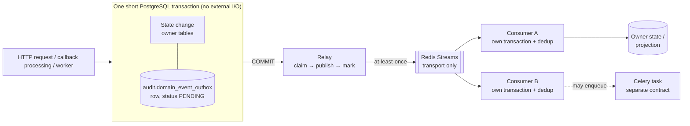

# Phase 7A — Event Architecture & Standards

## 1. Document Control

| Field | Value |
|---|---|
| Document | `docs/phase-07-event-architecture/7A-Event-Architecture-and-Standards.md` |
| Phase / subphase | Phase 7 — Event Architecture (roadmap `docs/product/PROJECT_ROADMAP.md` L37–L39), subphase 7A |
| Nature | Architecture standards and invariants. No application code, no SQL, no migration, no schema, no payload, no topology. |
| Status | Draft for independent review. This document does **not** declare itself frozen; freezing is an independent-review act (7L reconciles all of Phase 7). |
| Date | 2026-09-26 |
| Normative keywords | **MUST**, **MUST NOT**, **SHOULD**, **MAY** carry RFC 2119 meaning. Every rule has a stable ID (`<AREA>-nn`). |
| Supersedes | Nothing. 7A adds standards on top of the frozen Phase 1–6 baseline and changes none of it. |

### 1.1 Verified input baseline

| Artifact | SHA-256 | Lines | Verified |
|---|---|---:|---|
| `docs/phase-06-api-design/API-IMPLEMENTATION-READINESS.md` (AIR) | `81dd63dc3160b1eb642ab524b5159794fdc1f0aec74602987b45eb97097a54e2` | 2484 | match |
| `docs/phase-06-api-design/PHASE-06-FINAL-VALIDATION-AND-FREEZE.md` (certificate) | `574d4c05ec88969c0439359484f62404662d0c58b0c27d85ee2f1aa9fdc37a5a` | 640 | match |
| `FINAL-API-RECONCILIATION.md` (FAR) | `5853982e7209d84f097405c6ad149f180013d6351645db3aaa7297553addbc3f` | — | match |
| `API-MASTER-INDEX.md` (AMI) | `cb033a2f334aee1563d05e6db535b9d1a17038cf163ff4ea6925313cf9756c38` | — | match |
| `API-AUTHORIZATION-MATRIX.md` (AAM) | `f61d2d742a3193803c36cf7b9b9f78ce974da35fac94c61ce238b334dfd94843` | — | match |
| `API-ERROR-CATALOG.md` (AEC) | `2505acda65a07d98247bb2cbd5d3e28421bbf6cc75f7cfd0fff1ba07d7f65c7a` | — | match |
| `API-VERSIONING-STRATEGY.md` (AVS) | `ad3341ce73e5459783e7a00ff8ecb2cf04e1e8a93112ab2565bdbd6813ab222f` | — | match |
| `docs/product/PROJECT_ROADMAP.md` | `23df5f236b7c9bc3da56c5336b3297471f2a30fe01b8a6e9a748fca54533254e` | 145 | match |

Migration baseline: 112 SQL files and 112 Alembic revisions under `docs/phase-05-database-design/5K/migrations/`; root `001_5B`, head `112_5H5`; no migration 113 exists and 7A creates none.

---

## 2. Purpose

7A sets the architecture standards that every asynchronous and event mechanism in the platform must obey. It covers durable domain events, the transactional outbox, the relay, Redis Streams, Celery work, realtime WebSocket push, provider callbacks, public webhooks and audit.

7A answers **what must always be true**. It does not answer **how it is configured**. Stream names, payloads, retry numbers and worker topology belong to 7B–7K (§35).

Phase 6 froze *which* mechanisms exist and *which* routes produce *which* events (AIR §18 L981, §18.2 L1256). 7A turns those frozen facts into binding standards so that 7B–7K cannot diverge from them.

---

## 3. Scope

In scope:

1. The taxonomy of asynchronous mechanisms and the boundaries between them (§9).
2. Durability, delivery, idempotency, ordering and consistency standards (§10–§22).
3. Ownership, tenancy, security, privacy and residency invariants (§23–§25, §32).
4. Principles for schema versioning, failure handling, replay and observability (§26–§29).
5. Invariants for the voice-latency and billing-safety boundaries (§30–§31).
6. Traceability from Phase 6 to Phase 7 and ownership of each Phase-7 subphase (§34–§35).
7. The ADR register, deferred decisions, threat review, validation checklist and findings (§36–§42).

---

## 4. Non-Goals

7A does **not**:

- reopen Phase 6, redesign any API, or change any frozen event producer or consumer;
- modify any migration, or create migration 113, a new outbox table or a duplicate outbox under another schema;
- define payload JSON, the envelope field list, a schema registry, stream names or counts, consumer-group names, MAXLEN or TTL, shards, polling intervals, batch sizes, lock timeouts, retry delays or counts, DLQ storage, a replay API, an inbox schema, or retention durations (all deferred, §38);
- catalogue, rename or invent events (the catalog belongs to 7B);
- choose a vendor, a broker change (e.g. Kafka) or a regional topology;
- touch `DEP-6D-05` (platform ring/hold timeout values) or `DEP-6D-10` (fallback TTS provider). These are known future Voice owner decisions (AIR L17, §34.2 L2072). They are not 7A decisions, and 7A neither consumes nor constrains them;
- produce application code, tests, Docker files, generated schemas, SDKs or OpenAPI files.

---

## 5. Authority Hierarchy

Authority is assigned **per semantic concern**, not by a single global ranking. The order below says which kind of source owns which kind of fact. It is not a rule that a row always overrides every row beneath it on every topic. 7A never silently rewrites a source. It records any discrepancy as a finding (§41) or a deferred decision (§37, §38).

| Order | Authority | What it owns |
|---:|---|---|
| 1 | Product / roadmap authority: `PROJECT_ROADMAP`, product principles, approved owner decisions | Product intent, phase sequencing, and the exact questions that approved owner decisions settle |
| 2 | Phase-6 owner documents 6A–6M | **Primary owners of API and domain semantics** for their bounded context, including producers, consumers and event semantics |
| 3 | Phase-5 database authority: 5-series design, canonical SQL `001`–`112` (incl. `077_5J1.sql`), Alembic revisions, executed controlled amendments | Data facts, constraints and schema-level numeric defaults. Numeric defaults are schema facts, not Phase-7 choices |
| 4 | Phase-6 closure and reconciliation artifacts: FAR, AMI, AAM, AEC, AVS, AIR, the Phase-6 final certificate | They **reconcile, index and validate** 6A–6M (route inventory, classification counts, versioning axes). They do **not** globally supersede 6A–6M |
| — | Phase-4 DDD (4A–4I), Phase-3 LLD (3A–3F), Phase-2 HLA, Phase-1 SRS | Design intent, refined by the more specific owners above |
| — | This document (7A) | Standards inside the space the sources above leave open |
| — | 7B–7L | Details inside 7A standards |

Rule AUTH-01: A later Phase-7 subphase **MUST NOT** contradict 7A. If one needs to, it **MUST** raise a governed amendment of 7A; it must not diverge silently.

Rule AUTH-02 (conflict resolution): Resolve conflicts using the owning source for that semantic concern, controlled later amendments, and narrowly scoped explicit owner-approved closure decisions (AUTH-03). Closure indexes/summaries do not independently redefine an owner contract.

Rule AUTH-03 (narrow exception): Explicit owner-approved closure decisions may supersede only the exact ambiguity/conflict recorded in that owner-decision entry. This category holds two distinct sets:

- **AIR closure decisions**: the seven decisions recorded in AIR §34.1 (§34.1.1–§34.1.7), with their resulting mappings in AIR §34.5 and §34.6. They are AIR-OD-01, AIR-OD-02, AIR-P0-EVT-01, AIR-P0-EVT-02, AIR-P0-EVT-03, AIR-P0-EVT-04 and AIR-OD-03.
- **AVS owner decisions**: AVS-OD-01…AVS-OD-11, recorded in AVS (API-VERSIONING-STRATEGY).

AVS owner decisions are not AIR decisions, and AIR closure decisions are not AVS decisions. Each decision in either set binds only its recorded question and scope. None is a general grant of precedence over 6A–6M. 7A does not alter the substance of any of them.

Rule AUTH-04: No closure artifact outranks the owning 6A–6M document for event semantics in general. For example, AIR or AMI does not override 6D or 6K on a question that no owner-decision entry settles. Where two owner documents conflict and no owner decision covers the conflict, 7A does not pick a winner. The conflict is recorded as a deferred blocking decision (for example FOD-7B-01, §37).

Rule AUTH-05: The §6 baseline (counts, classes, producers) is AIR's reconciliation of 6A–6M together with the owner decisions under AUTH-03. 7A preserves that baseline unchanged. Preserving it does not give AIR authority over the owner documents beyond the reconciliation it records.

---

## 6. Frozen Phase-6 Baseline

### 6.1 Route event classification (AIR §18.2 L1260–L1273)

| Classification | Count |
|---|---:|
| OUTBOX_REQUIRED | 75 |
| OUTBOX_CONDITIONAL | 2 (AMI-6B-036, AMI-6J-011) |
| OUTBOX_WORKER_EMITTED | 1 (AMI-6H-018) |
| OUTBOX_NONE | 265 |
| DIRECT_REDIS_STREAM | 20 (AMI-6C-003 … AMI-6C-037; 6C §20 L1046–L1061) |
| WS_ONLY | 1 (AMI-6D-005, `call.transferring`) |
| PUBLIC_WEBHOOK_DELIVERY | 2 (AMI-6J-025, AMI-6J-028) |
| PROVIDER_CALLBACK | 3 (AMI-6D-021, AMI-6J-014, AMI-6K-023) |
| EVENT_TRIGGER_UNRESOLVED | 0 |
| **Σ** | **369** |

`CC-15` (routes that can create an outbox row in the request transaction) = OUTBOX_REQUIRED 75 + OUTBOX_CONDITIONAL 2 = **77** (AIR L1273, L889). The 191 business-state mutation routes are **not** the producer set (AIR L1273).

### 6.2 Four frozen event-trigger owner decisions (AIR §34.5 L2103–L2156)

| ID | Decision | Frozen producer fact 7A preserves |
|---|---|---|
| AIR-P0-EVT-01 | Option B | AMI-6F-008 emits `document.uploaded` on its single PENDING → PROCESSING transition, with a same-transaction outbox INSERT. Ingestion is enqueued after commit. No S3 HEAD, hash, parse or embedding runs while the transaction is open. AMI-6F-007 is OUTBOX_NONE. Consumers: Analytics 6L and Billing 6K, deduplicating on `event_id`. |
| AIR-P0-EVT-02 | Option C | AMI-6F-012 (reprocess) emits **no** request event. It enqueues ingestion directly; the ingestion worker emits `document.indexed` / `document.ingestion_failed`. `document.uploaded` is not re-emitted. `IngestionJobRetried` is a 4E DDD concept only and is not a transported event. |
| AIR-P0-EVT-03 | Option B | The campaign executor emits `campaign.started` in the PREPARING → RUNNING transaction, with the final `total_contacts`. The Start request (AMI-6H-007) validates, pins the AgentVersion, sets PREPARING, commits and enqueues `prepare_campaign_contacts_task`. It writes no outbox row. Consumer: Billing. |
| AIR-P0-EVT-04 | Option B | AMI-6J-004 returns `201 CONNECTING`, never ACTIVE. The activation worker validates credentials outside any DB transaction. On success it runs one short transaction calling `integrations.fn_activate_integration_connection` (`101_5I1.sql:280`) and writing one `integration.connected` outbox row. On failure, `integrations.fn_fail_integration_connection` (`101_5I1.sql:327`) sets FAILED and emits no event. Consumer: WebhookDispatchService; internal only, not webhook-eligible (6J L1916). |

The seven AIR owner decisions are AIR-OD-01, AIR-OD-02, AIR-P0-EVT-01…04 and AIR-OD-03 (the hybrid audit action-kind mapping, AIR §34.6 L2158). 7A leaves all seven unaffected.

### 6.3 The existing outbox (Phase 5, frozen)

`audit.domain_event_outbox` (`077_5J1.sql:48`, PostgreSQL 18) is **the** transactional outbox. Its schema facts, cited here only as facts:

- `id` is a UUID v7 and doubles as the `event_id`.
- Columns: `event_type`, `event_version INT DEFAULT 1`, nullable `organization_id`, `aggregate_type` / `aggregate_id`, and `payload JSONB` (≤ 262144 bytes).
- Time and state columns: `occurred_at`; `status` ∈ PENDING / CLAIMED / PUBLISHED / FAILED; `attempt_count`; `max_attempts` (default 10, range 1–20); `available_at`; `claimed_by` / `claimed_at`; `published_at`; `last_attempt_at`; `last_error`.
- Functions:
  - `audit.fn_claim_outbox_events()` uses `FOR UPDATE SKIP LOCKED` (6C L257), with defaults `p_limit` 50 and claim timeout 300 s.
  - `audit.fn_mark_outbox_published()` is a compare-and-set.
  - `audit.fn_mark_outbox_failed()` applies backoff and moves the row to terminal FAILED at `max_attempts`.
- Trigger `trg_outbox_tenant_check`.
- Grants: INSERT to `app_api` / `app_worker`; UPDATE / DELETE to `app_platform_admin`.
- Documented cleanup windows: PUBLISHED after 7 days, FAILED after 30 days.

These numbers are frozen Phase-5 defaults. 7A neither selects nor endorses them as Phase-7 tuning (§38, F-09).

### 6.4 The eight frozen mechanisms (AIR §18 L981–L995)

The eight mechanisms are: (1) transactional outbox, (2) Redis Streams, (3) Celery async jobs, (4) APScheduler, (5) public outbound webhooks, (6) provider callbacks, (7) audit events and (8) WebSocket push. AIR states that Phase 7 "implements this table. It does not redesign it" (AIR L983).

### 6.5 Phase-7 entry gate (AIR §32 L1881)

The gate passed 14/14.

- Phase 7 **inherits** the outbox table and claim function, at-least-once delivery, the distinct §18 mechanisms, the per-owner catalogs, the §18.2 classification, AX-D (WS message/event versioning only)/AX-E/AX-F, and WS non-durability.
- Phase 7 **decides** stream naming, consumer groups, retention, relay cadence and worker topology.
- Phase 7 **must not** add routes, error codes, permissions, tables or migrations.

### 6.6 Preserved architecture invariants (AIR §38.1 L2420)

7A carries these forward unchanged:

- a modular monolith (6D L136), where a bounded context is not a microservice (6J L58);
- PostgreSQL 18, and the outbox exists;
- no transaction spans external I/O (6A §35 L910);
- raw WebSocket for voice (6A L702);
- Exotel sits behind the provider abstraction (6D L420);
- SIP is RELEASE-TRAIN (6L L1123);
- a shared CONCURRENT_CALLS pool;
- financial calculations are server-authoritative (6K L2182);
- provider cost and margin stay internal (6K §24 L2029);
- versioning axes are independent (AVS L336);
- only V1 exists (AVS L258).

---

## 7. Architectural Drivers

| Driver | Source | Consequence for 7A |
|---|---|---|
| No lost committed fact | HLA §7.7 L211 (outbox avoids the dual-write bug); AIR §18 row 1 | Durable events are written atomically with state (§11–§12) |
| Cheap, already-approved infrastructure | HLA §7.7 L209 (Redis Streams already in stack) | Redis Streams is the transport; no new broker (§14) |
| Sub-second conversational voice | 6D L915 / L1019 / L1893 (≤ 750 ms is a target, not yet achieved; DEP-6D-11 RT validation in P23/P24) | No bus on the media path (§30) |
| Multi-tenant SaaS | 6A §23 L595; 5J §6 L184 | Tenant context cannot be forged; consumers re-establish it (§24) |
| Monetary correctness | 6K §22 L1943–L1975; DEC-6K-02 | Replay-safe, server-authoritative billing consumers (§31) |
| India-first compliance and residency | 4I §9 L577; ADR-INDIA-011 L1300; SRS NFR-COMPLY-001 L280 | No cross-region bus; residency scopes cover cache and logs (§32) |
| Independent deployability of workers | AIR §31 DAG (P7 → P9…P20) | Rolling-deploy compatibility (§33) |

---

## 8. Principles

| ID | Principle |
|---|---|
| PR-01 | **PostgreSQL is authoritative for transactional business state**, lifecycle metadata, relational invariants and transactional outbox state. Where the frozen storage contract assigns binary object bytes to object storage, object storage is authoritative for those bytes, and they are not transient. Redis, Celery and WebSocket are never authoritative. Analytics/read projections are derived unless explicitly frozen otherwise (§22.4). |
| PR-02 | **State and its durable event commit together or not at all.** The mechanism is the existing outbox. |
| PR-03 | **Durable delivery is at-least-once, and no mechanism is exactly-once.** Guarantees are mechanism-specific (§20.2); class D and F are best-effort. Correctness comes from idempotent consumers. |
| PR-04 | **Mechanisms are distinct.** An event is not a task, not an audit record, not a webhook, not a callback and not a socket message. |
| PR-05 | **The owner of a fact owns its event contract.** Consumers never redefine it. |
| PR-06 | **No transaction spans external I/O.** Sequential short transactions only; no 2PC. |
| PR-07 | **Tenant context comes from trusted state, not from a payload.** |
| PR-08 | **Minimum necessary data.** No secrets or credentials in events; minimum PII. |
| PR-09 | **The voice media path carries no bus.** |
| PR-10 | **Standards now, numbers later.** 7A fixes invariants; 7B–7K fix values. |
| PR-11 | **Decisions with meaningful alternatives are never silently taken.** |

---

## 9. Mechanism Taxonomy

The spec's nine classes (A–I) map onto AIR's eight frozen mechanisms. The difference is only granularity: the spec splits AIR mechanism #1 into three durable sub-classes, and AIR splits scheduling (#4) out of Celery. Neither changes a frozen fact (F-01).

| Class | Name | AIR §18 # | AIR §18.2 classes | Durable? | Definition |
|---|---|---|---|---|---|
| **A** | Transactional durable domain event | #1 → #2 | OUTBOX_REQUIRED (75) | Yes | Request transaction writes state + one outbox row atomically |
| **B** | Conditional durable domain event | #1 → #2 | OUTBOX_CONDITIONAL (2) | Yes, on the named branch | Outbox row written only on a named success branch inside the same transaction (AMI-6B-036 when ≥ 1 session revoked; AMI-6J-011 on activation success) |
| **C** | Worker-emitted durable domain event | #1 → #2 | OUTBOX_WORKER_EMITTED (1) + worker notes (AMI-6F-012, AMI-6H-007, AMI-6J-004) | Yes | A worker's own transaction writes state + outbox row; it is **never** a direct Redis publish and never attributed to the enqueuing HTTP request (AIR L1258) |
| **D** | Direct Redis Stream event | #2 | DIRECT_REDIS_STREAM (20); 6D L1234 high-frequency classes | **No** | Post-commit publish without an outbox row; non-durable; never also claimed as durable (AIR §18 row 2) |
| **E** | Celery task / command; scheduled trigger | #3, #4 | (enqueue side of worker notes) | Job row durable; message not a fact | Work to do; APScheduler is a timer trigger only and never a REST hop (6H L221) |
| **F** | Realtime push | #8 | WS_ONLY (1) | **No** | Raw WebSocket push to platform-owned sessions; sequence-numbered, best-effort; clients re-read REST after a gap (6D L629) |
| **G** | Public (outbound) webhook | #5 | PUBLIC_WEBHOOK_DELIVERY (2) | Delivery row durable | Signed, at-least-once external delivery to tenant endpoints with dead-letter (6A §28.1 L756) |
| **H** | Provider callback (inbound) | #6 | PROVIDER_CALLBACK (3) | Dedup row durable | External ingress: verify → dedup → fast ACK → process; processing may produce class A/C events (AIR L1309, L1371, L1382) |
| **I** | Audit | #7 | AUDIT_SYNC / AUDIT_ASYNC (AIR §18.1) | Yes (immutable) | Accountability record via `audit.fn_insert_audit_event()`; sync, async, conditional, or written by provider-domain processing (5J §14.5 L808–L835) |

Rule TAX-01: Every asynchronous artifact in Phase 7 **MUST** belong to exactly one class A–I. A 7B–7K design that needs an artifact outside A–I **MUST** raise a governed amendment.

Rule TAX-02: The five CALLBACK-surface routes (AIR §10) are not all class H. AMI-6B-013 (OAuth login callback) produces no event. AMI-6J-011 (OAuth integration callback) is class B. Classification follows AIR §18.2, not route surface.

---

## 10. Logical Event Architecture

### 10.1 Durable path (classes A, B, C)



### 10.2 Mechanism separation — not one generic bus

```
 ┌─────────── PostgreSQL (authoritative business state) ────────┐
 │ owner tables │ domain_event_outbox │ audit_events │ job rows │
 │ webhook_deliveries │ inbound_webhook_events │ dedup ledgers │
 └───────┬───────────────┬─────────────────┬──────────┬─────────┘
         │ relay (A/B/C) │ fn_insert_audit │ enqueue  │
         ▼               │  (I, not a bus) ▼          │
  [Redis Streams] ◄──(D direct, non-durable)   [Celery broker] (E)
         │                                          │
         ▼                                          ▼
   domain consumers ──► 6J delivery worker ──► tenant HTTPS endpoint (G, signed)

  Provider ──HTTPS──► callback route (H: verify→dedup→ACK) ──► processing tx (A/C)

  Voice gateway ──raw WS──► caller media leg     (F: media, never on any bus)
  Platform ──raw WS──► browser/supervisor UI     (F: non-durable push; re-read REST)
```

Every arrow is a different contract with its own guarantee. None of them substitutes for another.

### 10.3 Durability invariants

| ID | Invariant |
|---|---|
| DUR-01 | A class A/B/C state change and its outbox row **MUST** commit in the same PostgreSQL transaction: all or nothing. |
| DUR-02 | A durable event **MUST NOT** be published to Redis or any transport before its originating transaction commits (no publish-before-commit). |
| DUR-03 | Redis availability **MUST NOT** gate the commit. A Redis outage delays delivery but never blocks or rolls back a business transaction. |
| DUR-04 | No external I/O (Redis, HTTP, S3, provider, Celery broker) **MAY** occur inside the transaction that writes an outbox row (6A §35 L910; AIR §12). |
| DUR-05 | A committed outbox row **MUST NOT** be lost. It remains in PostgreSQL until it is published or reaches the documented terminal state. |
| DUR-06 | Durable delivery is at-least-once. No component **MAY** claim exactly-once delivery (§20). |

---

## 11. Durable Domain Event Standard

| ID | Standard |
|---|---|
| EVT-01 | A durable domain event states a **past-tense business fact** that an owning bounded context has committed (e.g. `document.uploaded`, `document.indexed`, `campaign.started`, `integration.connected`). |
| EVT-02 | A durable event **MUST** carry a stable identity (`event_id` = outbox `id`, UUID v7) that never changes across relay retries, redelivery or replay. |
| EVT-03 | A durable event **MUST** identify its type, type-version (the existing outbox `event_version`; this is **not** AVS AX-D, §26), owning aggregate, occurrence time and tenant scope (organization, or explicitly platform-scoped). Exact field names are deferred to 7C. |
| EVT-04 | A payload **MUST** be self-sufficient for consumers only to the extent the owner's contract states. Consumers needing current state **MUST** read it from the owner's authoritative store rather than trust stale payload data for decisions. |
| EVT-05 | The producer set is frozen by AIR §18.2 and §34.5. 7A adds no producer, removes none and moves none. |
| EVT-06 | A mutation is not an event. Only routes and workers named in the frozen catalogs produce events (AIR L1258). |

---

## 12. Transactional Outbox Standard

| ID | Standard |
|---|---|
| OUT-01 | `audit.domain_event_outbox` (`077_5J1.sql:48`) is the single transactional outbox. No replacement table, duplicate outbox, per-context outbox copy or alternate schema **MAY** be introduced. |
| OUT-02 | Producers **MUST** write outbox rows only through the grants the schema already defines (`app_api` / `app_worker` INSERT). Status transitions **MUST** use the existing functions (`fn_claim_outbox_events`, `fn_mark_outbox_published`, `fn_mark_outbox_failed`). |
| OUT-03 | Class C worker-emitted events use the same outbox from the worker's own transaction. Workers **MUST NOT** publish class A/B/C events directly to Redis. |
| OUT-04 | An outbox row is written **once per business fact**. A retried request carrying the same HTTP `Idempotency-Key`, a retried worker, or a replayed job **MUST NOT** write a second row for the same fact. Owner idempotency contracts (6A §16; per-owner job rows) enforce this. |
| OUT-05 | Payloads **MUST** respect the existing 262144-byte bound and the security rules of §25. Large content is referenced by a governed reference, never inlined. |
| OUT-06 | Outbox cleanup is **not** business or audit retention (§32.3). |
| OUT-07 | The outbox table has no RLS and is not partitioned (Phase-5 fact). Tenant scoping of rows is enforced by `trg_outbox_tenant_check` and by consumers (§24). Partitioning or RLS changes are out of 7A scope. |

---

## 13. Publisher / Relay Standard

The relay moves committed outbox rows to the transport. 7D owns its design. 7A fixes what it must guarantee.

| ID | The relay MUST |
|---|---|
| REL-01 | find only eligible rows (committed, PENDING, due per `available_at`, or reclaimable after an expired claim); |
| REL-02 | claim safely against concurrent relay instances, using the existing `fn_claim_outbox_events()` (`SKIP LOCKED`); |
| REL-03 | publish to the transport **after** claiming and **outside** any business transaction; |
| REL-04 | tolerate duplicates. A publish whose acknowledgement is uncertain **MAY** be repeated, so the same `event_id` can appear on the stream more than once; |
| REL-05 | record progress only through the existing schema (`fn_mark_outbox_published` CAS, `fn_mark_outbox_failed`); |
| REL-06 | recover after a crash with no committed row lost: an expired claim becomes claimable again; |
| REL-07 | keep committed events safe in PostgreSQL throughout a Redis outage and resume once Redis returns; |
| REL-08 | never mutate a row's `event_id`, `event_type`, `event_version`, `organization_id` or `payload` when publishing. |

Deferred to 7D: process topology, polling interval, batch size, claim lease duration, publish batching, relay metrics names and any tuning of Phase-5 defaults (§38).

---

## 14. Redis Streams Role

| ID | Standard |
|---|---|
| RS-01 | Redis Streams is the **transport** for durable events relayed from the outbox and for class D direct events. It is **not** a source of truth (AIR §18 row 2; 6D L1234). |
| RS-02 | Nothing **MAY** treat stream contents, stream position or pending-entry lists as authoritative business state. Recovery always reads PostgreSQL. |
| RS-03 | Stream retention is transport retention. It is **never** business, audit or legal retention (§32.3). |
| RS-04 | Consumer groups **SHOULD** be used where several instances of one logical consumer share work. The group layout is deferred to 7E. |
| RS-05 | Class D direct-stream events **MUST** stay distinguishable from durable events. A consumer **MUST NOT** assume a class D event is durable, and no class D event **MAY** also be claimed as durable. |
| RS-06 | Redis Streams **MUST NOT** carry audio, media frames or per-frame voice signals (3B L62; §30). |
| RS-07 | The transport is behind an adapter seam (HLA §7.7 L209, "adapter swap, not a domain change"). A broker change such as Kafka is **not** part of V1. Any such change is a future governed decision (F-13). |

Confirmation of Phase 3's open item: 3A Review Note 1 (L52, L935) asked Phase 7 to confirm Redis Streams as the event-bus medium. AIR §18 row 2 already froze Redis Streams as the transport ("Redis role frozen by 6A §21/§28"). 7A records that inheritance and makes no new choice (ADR-7A-06, F-14).

Deferred to 7E: stream names and count, per-type or per-context stream layout, sharding, cluster topology, MAXLEN / TTL, group names, pending-entry reclaim policy, memory sizing and autoscaling.

---

## 15. Celery Task / Command Role

| ID | Standard |
|---|---|
| CEL-01 | Celery carries **commands / work**: background and long-running jobs, scheduled work, provider operations, ingestion (e.g. `ingest document`), campaign preparation (`prepare_campaign_contacts_task`), credential validation and retries. |
| CEL-02 | **A Celery task is never a domain event.** A task message says "do this". An event says "this happened". |
| CEL-03 | A consumer **MAY** enqueue a task, and a worker **MAY** produce a durable event (class C, via the outbox). These are two separate contracts with separate identities. |
| CEL-04 | Job state is read from the owner's DB job row. No Celery task ID is exposed as an API identifier (AIR §18 row 3; 6A §18.1 L473). |
| CEL-05 | A task is enqueued only after the transaction that creates its job row commits, "if and only if this statement actually returns a row" (6J L953). |
| CEL-06 | Task retries **MUST** respect the owner's idempotency contract. A retried task **MUST NOT** emit a second durable event for the same fact (OUT-04). |
| CEL-07 | APScheduler (class E) is a timer trigger. It calls in-process application services, never the platform's own REST API, and it is never the source of truth (6H L221). |
| CEL-08 | **Mandatory post-commit work durability.** Mandatory post-commit asynchronous work whose loss would violate a frozen business, security, audit, billing, compliance, or lifecycle invariant MUST have a durable recoverable work-intent or deterministic reconciliation mechanism. Correctness MUST NOT depend solely on a one-shot in-process Celery enqueue performed after database commit. |
| CEL-09 | **Allowed mechanism families** for CEL-08 (7A chooses none; the choice per flow belongs to 7D / 7G / 7K and the owning flow design): an existing durable job/work row; an outbox event consumed into work; a transactional task/outbox pattern; periodic reconciliation; a durable state-machine scan; or another source-backed trigger. 7A creates no table and no migration for this. Optional or best-effort work (work whose loss violates no frozen invariant) is exempt from CEL-08. |
| CEL-10 | **Broker acceptance boundary.** Celery's at-least-once delivery begins only after the broker or work mechanism durably accepts the task. Broker redelivery does not close the pre-enqueue gap: if the process dies after `COMMIT` and before the task is submitted, no broker ever holds the task, and only the CEL-08 mechanism can recover it (FM-12, FM-13). |

Deferred to 7G/7K: queue names, worker pools, prefetch, visibility timeouts, retry counts and delays, and autoscaling.

### 15.1 Terminology

| Term | Meaning | Examples |
|---|---|---|
| **Event** | Immutable past-tense fact, owned by one context | `document.uploaded`, `document.indexed`, `campaign.started`, `integration.connected` |
| **Command / task** | Request to perform work; may fail or be retried | prepare campaign contacts, ingest document, validate credentials, retry a delivery |
| **Notification** | A delivery or view concern: how a fact is shown or sent to a human or external system | WS push, email, tenant webhook delivery |

---

## 16. WebSocket / Realtime Boundary

| ID | Standard |
|---|---|
| WS-01 | Raw WebSocket is the standard for **all** realtime channels, including voice media (`/ws/v1/voice/media/{session_id}`) and dashboard/supervisor push (6A §27.1 L700–L704, ADR-6A-05 FINAL). No Socket.IO server is built (AIR L666). |
| WS-02 | WS push is **not durable** and not a system of record. Clients **MUST** recover by re-reading REST after a gap or a "cursor too old" condition (6D L629; AIR §18 row 8). |
| WS-03 | Non-audio channels use the 6A §27.3 envelope (L721). `sequence` is per connection/subscription for gap detection only. `event_id` is the dedup key. Cross-context ordering is not guaranteed (4G §12.4). |
| WS-04 | Voice audio has no mid-stream resume. A dropped media WS ends the call, and the reaper emits `call.failed` through the durable path (6A §27.2 L708). |
| WS-05 | A WS push **MAY** be triggered by a committed durable event or by a post-commit request step (e.g. WS_ONLY `call.transferring`, AMI-6D-005). A WS push **MUST NOT** replace a durable event where the owner catalog requires one. |
| WS-06 | No call control over WS (ADR-6D-05, 6D L1911). WS authorization and tenant isolation follow 6A §27.4 L746. |

Socket.IO wording: the 7A spec mentions a "Socket.IO dashboard/supervisor role where frozen". AIR §38.1 records this as "distinct where frozen | 6A L704 | HOLDS". 6A froze raw WebSocket for all channels. The Socket.IO role is therefore satisfied only to the extent 6A froze it. A thin raw-WebSocket wrapper/client MAY be used for browser ergonomics, but `socket.io-client`, Socket.IO protocol framing, and Engine.IO negotiation MUST NOT be used against these frozen raw-WebSocket endpoints. There is no Socket.IO backend (F-02, Minor-7A-01; AIR F-09).

---

## 17. Provider Callback Boundary

| ID | Standard |
|---|---|
| CB-01 | Provider callbacks are **ingress**. They are not internal transport, and a provider payload is not an internal event schema. |
| CB-02 | Signature/state verification **MUST** precede any state change. Callbacks are never bearer-authenticated (AIR §18 row 6; 6A §28.2 L774). |
| CB-03 | Callbacks **MUST** be deduplicated durably before processing (`webhooks.inbound_webhook_events` UNIQUE `(organization_id, provider_slug, provider_event_id)`, `062_5I:38`, or the owner's frozen equivalent, e.g. billing payment-webhook dedup `102_5H2`). |
| CB-04 | Accept fast, process asynchronously (RECEIVED → PROCESSING → PROCESSED / FAILED / SKIPPED). Heavy work runs after the ACK (6J L965). |
| CB-05 | Processing translates provider facts through the owner's anti-corruption layer (6D L420) into the owner's own state changes. Any resulting domain event is class A/C through the outbox (AIR L1309, L1382). |
| CB-06 | Tenant identity for a callback is resolved from platform-held state (e.g. the connection, call or payment record the verified callback references), never from an unverified payload field (§24). |
| CB-07 | Callback ingress is not subject to tenant rate limits (6A §28.2). Backpressure is owned by 7K. |

---

## 18. Public Webhook Boundary

| ID | Standard |
|---|---|
| WH-01 | Public webhooks are **external delivery** to tenant-owned endpoints outside the platform trust boundary. They are not the internal bus. |
| WH-02 | Delivery is driven from committed events by the 6J delivery pipeline. It **MUST NOT** be called synchronously inside any business transaction. |
| WH-03 | The 6A §28.1 / 6J §21 contract is frozen: at-least-once, signed (`X-Platform-Signature: v1={hex_signature}` together with `X-Platform-Timestamp`; canonical input per WH-07), dead-letter, replay as a new delivery row with `replay_of_delivery_id`, history immutable, `event_id` as the stable identity, no ordering across types. |
| WH-04 | Only topics in the frozen external catalog (6J §19; 19 topics, AX-E) are webhook-eligible. An internal event (e.g. `integration.connected`, 6J L1916) **MUST NOT** be serialized to tenants unless the owner catalog says so. |
| WH-05 | External serialization is intentionally scoped. The webhook payload is a deliberate projection of the internal fact and never a raw dump of an outbox row. It excludes secrets, internal refs, and cost/margin data (6K §24 L2029). |
| WH-06 | The signing canonical input (AX-F) **MUST** be preserved byte-for-byte as frozen. |
| WH-07 | **Webhook canonical signing input (frozen: 6J §21.2 L823; AVS SG-01; Phase-6 certificate L181).** See the block below. `raw_request_body` is the exact raw HTTP request-body bytes. It is **not** parsed JSON, normalized JSON, reserialized JSON, pretty-printed JSON, an object/dict serialization, or JSON canonicalized after parsing. The `payload_json` shorthand in 6A L764 and 6J L799 names these same bytes: the envelope serialized once and sent unchanged (6J L799). The normative form is the one below. |
| WH-08 | **Raw-body verification.** Webhook signature verification **MUST** operate on the exact raw request-body bytes received from the HTTP transport. The body **MUST NOT** be parsed and reserialized before signature verification. On the sending side, the signed bytes **MUST** be exactly the bytes sent (6J L799). |
| WH-09 | **Timestamp source.** The timestamp value used in the canonical input is the exact validated `X-Platform-Timestamp` value required by the frozen webhook contract. No other timestamp field is used. Verifiers use constant-time comparison and the frozen 5-minute replay window (6J L823; AVS SG-01). 7A does not redefine that window. |
| WH-10 | **Plugin-callout canonical input is different (frozen: 6J L1009; AVS SG-06; Phase-6 certificate L182).** Plugin callouts are signed with HMAC-SHA256 using the installation's own shared secret over `ts={unix_timestamp}.{method}.{canonical_request_path}.{raw_body}`, sent with the same `X-Platform-Signature: v1=` and `X-Platform-Timestamp` header family. Only the algorithm and header family are shared (SG-06); the signed material differs. Implementations **MUST NOT** reuse the webhook canonical-input builder for plugin callouts or the plugin-callout canonical-input builder for public webhooks. |
| WH-11 | **Verification order.** The exact signed bytes **MUST NOT** be destroyed or altered before verification. Only the safe metadata lookup the owning contract requires (for example, resolving the endpoint or installation and its secret reference) **MAY** precede verification, and it must leave the retained raw bytes untouched. Payload processing happens only after successful verification. |
| WH-12 | 7A describes the frozen scheme and changes nothing in it. There is no `v2`, no new algorithm, no JSON canonicalization, no change to secret storage or rotation (SG-07), no change to the replay window and no new signature header (VER-06; SG-03…SG-05). |

Frozen canonical signing inputs:

```text
Public webhook (WH-07):
HMAC-SHA256(
    signing_secret,
    f"ts={X-Platform-Timestamp}.{raw_request_body}"
)

Plugin callout (WH-10), distinct:
ts={unix_timestamp}.{method}.{canonical_request_path}.{raw_body}
```

Conceptual verification order (WH-08, WH-11):

```text
HTTP request received
        ↓
retain exact raw request-body bytes
        ↓
read/validate X-Platform-Timestamp + X-Platform-Signature headers
        ↓
construct the frozen canonical signing input for this mechanism (WH-07 or WH-10)
        ↓
verify HMAC (constant-time comparison)
        ↓
only after successful verification: parse/process payload per the owning contract
```

Deferred to 7H: worker concurrency, backoff jitter within the 6J schedule, egress pool and the endpoint-health policy.

---

## 19. Audit Boundary

| ID | Standard |
|---|---|
| AUD-01 | Audit answers **who** did **what**, **when**, to **which resource**, for **which purpose**. It is an accountability record, not a domain event and not a bus (AIR §18 row 7; 5J §14.5 L808; 6D L1231). |
| AUD-02 | The only write path is `audit.fn_insert_audit_event()` (5J §5.1 L138). Audit rows are immutable. The hash chain is computed nightly by `audit.fn_compute_chain_hash()`, never at write time. |
| AUD-03 | A **synchronous** audit failure rolls back the business mutation (auth, API keys, break-glass, DSR, admin, the listed voice/agent/tool and guarded billing operations, 5J §14.5). |
| AUD-04 | An **asynchronous** audit write is post-commit and retried, never best-effort. A failure in the *event transport* is recovered by the outbox, not by audit. |
| AUD-04a | **Async-audit recoverability.** A mandatory asynchronous audit write is mandatory post-commit work under CEL-08. Its dispatch **MUST** be recoverable if it is lost before broker submission (FM-13) through a durable work-intent or deterministic reconciliation mechanism (CEL-09). Retries after broker acceptance alone do not satisfy this. 7A chooses no mechanism; 7D / 7G / 7I own the design (DD-21). |
| AUD-05 | Consumers **MUST NOT** subscribe to `audit.audit_events` as an event feed, and producers **MUST NOT** use audit rows to signal other contexts. |
| AUD-06 | An operation may legitimately produce an audit row **and** a durable event in one transaction (e.g. `RECORDING_DELETED` audit + `recording.deleted` outbox row, 6D L1231). They are separate records with separate purposes. |
| AUD-07 | AIR-OD-03's hybrid action-kind mapping (AIR §34.6) is unaffected. |

---

## 20. Delivery Semantics

| ID | Standard |
|---|---|
| DEL-01 | The **durable** Phase-7 paths are **at-least-once**: relay → Redis Streams → consumer for classes A/B/C, public webhook delivery, and Celery work once the broker or work mechanism has durably accepted it (CEL-10). The guarantee is mechanism-specific (§20.2). It does **not** extend to class D or F (DEL-05), to the Celery pre-enqueue window (CEL-08…CEL-10) or to provider-callback ingress (class H). |
| DEL-02 | Duplicates are expected and normal: relays retry, acknowledgements can be uncertain, consumers crash between effect and ack, and operators replay. |
| DEL-03 | **Every side-effecting event consumer MUST be designed for idempotent processing.** |
| DEL-04 | No document, code comment, metric or API **MAY** promise exactly-once delivery, exactly-once processing or global deduplication. |
| DEL-05 | Class D and F are best-effort and non-durable. They **MUST NOT** be used for facts whose loss would violate an invariant, unless a frozen owner source says otherwise, in which case the tension is recorded as a deferred blocking decision (FOD-7B-01, §37). |

### 20.1 The exactly-once statement

> **The platform does not claim end-to-end exactly-once distributed processing.**

Correctness is built from:

1. the atomic outbox (DUR-01);
2. at-least-once durable transport (DEL-01, §20.2);
3. stable event identity (EVT-02);
4. idempotent consumers (§21);
5. concurrency control in PostgreSQL (row locks, CAS, `SKIP LOCKED`, unique constraints);
6. owner business invariants (state machines, guarded functions).

A consumer **MAY** achieve a *local* transactional once-only effect: a dedup insert and the effect committed in one PostgreSQL transaction (e.g. 5J §8.2; `crm.fn_claim_event`). That is a local property of one database transaction. It **MUST NOT** be described as distributed exactly-once. The same applies to 6D's "exactly-once logical call identity" (6D L1511), which is explicitly bounded: physical provider submission during an ambiguous failure is **not** guaranteed once-only.

### 20.2 Delivery guarantee by mechanism

This matrix clarifies scope only. It does not change any Phase-6 classification (§6), does not turn DIRECT_REDIS_STREAM into outbox events and does not make WebSocket messaging durable.

| Mechanism | Class / §6 classification | Delivery / durability model |
|---|---|---|
| Transactional outbox → internal durable transport | A / OUTBOX_REQUIRED (75) | At-least-once |
| Conditional durable outbox | B / OUTBOX_CONDITIONAL (2) | At-least-once when produced |
| Worker-emitted durable event | C / OUTBOX_WORKER_EMITTED (1) | At-least-once when durably committed |
| Celery work (mandatory) | E | At-least-once only after durable broker/work acceptance (CEL-10). The pre-enqueue gap is **not** at-least-once and is protected by CEL-08/CEL-09 (FM-12, FM-13) |
| Public webhook delivery | G / PUBLIC_WEBHOOK_DELIVERY (2) | At-least-once under the frozen 6J retry/delivery contract (WH-03) |
| Direct Redis Stream signal | D / DIRECT_REDIS_STREAM (20) | Best-effort and non-durable end-to-end, unless an owning frozen contract explicitly gives stronger durability (DEL-05; FOD-7B-01) |
| Realtime WebSocket message | F / WS_ONLY (1) and other WS push | Best-effort and non-durable; clients re-read REST after a gap (WS-02) |
| Provider callback | H / PROVIDER_CALLBACK (3) | External ingress. Verification, durable dedup and replay/idempotency rules apply (CB-02…CB-04). This is not an internal delivery guarantee |

---

## 21. Idempotency

| ID | Standard |
|---|---|
| IDM-01 | Every durable event has a stable identity (`event_id`) that redelivery and replay preserve (EVT-02). |
| IDM-02 | Every side-effecting consumer **MUST** make repeated processing of the same `event_id` harmless: either a dedup record committed in the same transaction as the effect, or an effect that is naturally idempotent (UPSERT to a deterministic key, guarded state transition). |
| IDM-03 | Domain-appropriate protection is **mandatory** for these consumer families: **Billing** (exact `source_event_id` idempotency, `<outbox_event_id>:<metric>` for multi-metric events, 6K §22.2 L1959 / L1968); **CRM** (`crm.event_consumer_dedup` + `crm.fn_claim_event`, `094_5D3`); **webhook delivery** (`event_id` stable per delivery; 6A §28.1); **call scheduling / placement** (6D dispatch keys and `provider_request_ref`, 6D L1504–L1511; campaign double-charge protection 6K §13.4 L1694); **workflow** (workflow execution identity; DEP-6K-05 discriminator carried, §34). |
| IDM-04 | Dedup keys **MUST** include the tenant scope where the owner's ledger does (e.g. 5J §8.1 `event_type::source_event_id::organization_id`). |
| IDM-05 | A dedup ledger's retention **MUST** cover at least the replay horizon it protects (e.g. 5J §8.3: 90 days for analytics). Replay beyond a ledger's horizon **MUST** use the owner's documented rebuild mode (5J §12.3), never raw redelivery. |
| IDM-06 | Per-context dedup ledgers are frozen facts. 7A mandates **the property**, not a universal inbox table. Any shared inbox schema is deferred to 7F/7G (F-05). |

---

## 22. Ordering & Consistency

### 22.1 Ordering

| ID | Standard |
|---|---|
| ORD-01 | There is **no global ordering** across event types, aggregates, streams or contexts (4G §12.4 L653; 6A §28.1). |
| ORD-02 | Ordering dependencies **MUST** be explicit in the consuming contract (e.g. "enrich on `qualification_set` after `call.ended`"). None may be implicit. |
| ORD-03 | Timestamps (`occurred_at`, publish time) **MUST NOT** be used to order events across aggregates. Within one aggregate, ordering relies on the owner's state machine or version, not on arrival order. |
| ORD-04 | Consumers **MUST** tolerate delay, retry and reordering. An older event arriving late **MUST NOT** corrupt state. Techniques include guarded state transitions, commutative projections (5J §7.3), two-phase enrichment (4G §12.4) and version checks. |
| ORD-05 | Partitioning or keyed ordering (per aggregate or per tenant) is deferred to 7E/7F. 7A guarantees none. |
| ORD-06 | Frozen stronger-ordering statements are respected at their exact scope and not generalised. Two exist: WS `sequence` per connection for gap detection (6A §27.3), and 4G §12.4's note that `invoice.generated` is written before payment can succeed. The latter is a producer-side causal fact, **not** a transport ordering guarantee, and 4G itself prescribes dead-letter-with-retry for the reverse arrival (F-17). |

### 22.2 Consistency

| ID | Standard |
|---|---|
| CON-01 | **Strong** consistency holds within one PostgreSQL transaction (4G §12.1 L615). |
| CON-02 | **Eventual** consistency holds across bounded contexts (4G §12.2 L628). |
| CON-03 | Projections and read models (analytics, CRM activity, dashboards) **MUST NOT** be used to validate commands. Validation reads the owner's authoritative tables. |
| CON-04 | There is no synchronous distributed coupling: a transaction never waits on another context's consumer (6C L256: "the response never waits on the consumer"). |
| CON-05 | The 4G §12.2 lag figures are Phase-4 indicative targets. They are not SLOs, and 7J owns any SLO (F-16). |

### 22.3 Transactions

| ID | Standard |
|---|---|
| TX-01 | Multi-step flows use **sequential short transactions** with external I/O between them (TX-NET/TX-SEQ, 12 routes; 29 post-commit continuations; TP-13 `202` = job row + worker transaction; AIR §12). |
| TX-02 | No two-phase commit, no XA and no distributed ACID imitation. Cross-step recovery uses owner state machines, guarded functions and compensations the owners already define. |

### 22.4 Source of truth

| ID | Standard |
|---|---|
| SOT-01 | PostgreSQL is authoritative for transactional business state, lifecycle metadata, relational invariants and transactional outbox state. |
| SOT-02 | Not authoritative: Redis (streams, caches, counters, locks, denylist), the Celery broker and task state, and WS session state. Analytics/read projections are derived unless explicitly frozen otherwise. Webhook delivery records are delivery truth, not business truth. |
| SOT-03 | Frozen exceptions keep their frozen scope. Examples: the Redis access-token denylist and Redis quota counters are enforcement mechanisms whose authoritative inputs live in PostgreSQL (6B §12.4; 4G §12.2/§12.3). 7A does not widen them. |
| SOT-04 | Object storage is authoritative for binary object bytes (recordings, documents, exports) where the frozen storage contract assigns them. PostgreSQL owns the metadata, reference and lifecycle of those objects. Object bytes are **not** transient and are not treated as reconstructible from events. Data residency (§32) applies to object storage as it does to PostgreSQL. |

| Store | Role | Authoritative? |
|---|---|---|
| PostgreSQL domain tables | Business state, lifecycle metadata, relational invariants | **Yes** |
| PostgreSQL outbox (`audit.domain_event_outbox`) | Publication obligation | **Yes** |
| Object storage | Object bytes (recordings, documents, exports) where the frozen storage contract assigns them | **Yes** (bytes); PostgreSQL owns metadata, reference and lifecycle |
| Redis Streams | Transport | **No** |
| Celery broker / task state | Work delivery | **No** |
| WebSocket | Realtime transport | **No** |
| Analytics / read projections | Derived | **No**, unless explicitly frozen otherwise |
| Audit tables (`audit.audit_events`) | Audit record | **Yes** for the audit record, but **NOT** the domain-event bus (AUD-05) |

---

## 23. Event Ownership

| ID | Standard |
|---|---|
| OWN-01 | The bounded context that owns the aggregate owns the event's name, meaning, payload contract, version and producer (AIR §18 row 1: "every owner domain's Domain Events / Outbox section"). |
| OWN-02 | Consumers (Billing, Analytics, CRM, webhook delivery, the Redis naming scheme in 7E) **MUST NOT** redefine, rename, repurpose or re-emit another context's event as their own. |
| OWN-03 | A bounded context is not a microservice. The platform is a modular monolith (6D L136; 6J L58). Ownership is a contract boundary, not a deployment boundary. |
| OWN-04 | Event names follow the existing lower-case dotted convention (`<aggregate>.<past_tense_fact>`, e.g. `campaign.contact.call_attempted`). 7A records the convention only. It renames nothing and invents nothing, and the full catalog belongs to 7B. |
| OWN-05 | Frozen events are not bulk-renamed. Any rename or new event requires the owning source's governed amendment. |

---

## 24. Tenant Isolation

| ID | Standard |
|---|---|
| TEN-01 | Every durable event is either organization-scoped (organization identity present) or **explicitly** platform-scoped (organization absent by design, e.g. platform-admin actions). An absent organization **MUST NOT** mean "unknown". |
| TEN-02 | Organization context **MUST NOT** be forgeable by consumer payload alone. It originates from the producing transaction's trusted tenant context (6A §23 L595; `trg_outbox_tenant_check`). Consumers establish their DB tenant context from the trusted envelope scope and **MUST** verify that referenced resources belong to that organization before acting. |
| TEN-03 | A consumer **MUST NOT** deliver, project or act on one tenant's event within another tenant's scope. Cross-tenant fan-out is prohibited except for explicitly platform-scoped consumers. |
| TEN-04 | Consumers run under the least-privileged DB role and **MUST NOT** bypass RLS, guarded functions, owner authorization or owner invariants because "the event said so". |
| TEN-05 | Observability (logs, metrics, traces, dashboards) **MUST** be tenant-safe: no tenant can see another tenant's event data, and high-cardinality tenant identifiers in metrics are governed by 7J. |
| TEN-06 | Envelope field names for tenant scope are deferred to 7C. |

---

## 25. Security / Privacy

| ID | Standard |
|---|---|
| SEC-01 | Event payloads, stream entries, task arguments, webhook bodies, logs and metrics **MUST NOT** contain secrets, API credentials, bearer/refresh/access tokens, provider secret material or raw secret-manager values. Only opaque references (e.g. `CredentialRef`, `signing_secret_ref`) **MAY** appear. |
| SEC-02 | Identifiers that are not bearer credentials (e.g. JTI lists in `identity.forced_revocation_required`) are permitted where the frozen owner contract requires them. They **MUST NOT** be logged beyond need. |
| SEC-03 | Minimum necessary PII. Prefer IDs over names, phone numbers and emails, and never carry transcripts or recordings where a reference suffices. |
| SEC-04 | Sensitive media (recordings, transcripts) follows the frozen permission model. Events carry references resolved through owner-authorized access (6A §29), never media bytes. Signed/presigned URLs are temporary bearer capabilities: they **MUST NOT** appear in any event, stream entry, task argument, webhook body, log or trace (6A L581). |
| SEC-05 | Handlers **MUST NOT** bypass authorization or invariants (TEN-04). |
| SEC-06 | External serialization (webhooks, plugins) is intentionally scoped (WH-05). Internal-only fields never leak outward. |
| SEC-07 | Logs and metrics **MUST NOT** expose secrets or PII. Payload logging is off by default. |
| SEC-08 | Operator actions on the event system (replay, DLQ release, manual republish) are privileged, authorized and audited (§28). |
| SEC-09 | India-region data residency is respected (§32). |

Deferred to 7I: the classification scheme per field, redaction rules and DSR (erasure) interaction with retained events.

---

## 26. Schema-Versioning Principles

| ID | Standard |
|---|---|
| VER-01 | Internal durable event schema versions (the existing outbox `event_version INT DEFAULT 1`, `077_5J1.sql`) are **independent** of `/api/v1` (AVS L322, AX-R03 L338). `/v1` in a URL never implies event version 1, or vice versa. `/api/v1` is never used as an internal event schema version. |
| VER-02 | **AX-D governs WebSocket message/event versioning only.** It is coupled to AX-C and the WS lifecycle: a breaking WS event change requires a new WS major (AX-R04 L339; AVS-OD-11), and advancing `version` for a breaking change within `/ws/v1` is prohibited (CM-WS-04). WebSocket event versioning is also independent of REST API versioning. |
| VER-03 | **7C design requirement (not a 7A algorithm).** 7C **MUST** define the compatibility policy for the internal durable `event_version`: what counts as additive and what counts as breaking, coexistence, producer upgrade, consumer upgrade and migration of backlog. 7A requires only that compatibility is **explicit** and that breaking evolution uses an explicit controlled mechanism defined in 7C. 7A does not freeze any rule for when the number changes. |
| VER-04 | No silent repurposing of a field or event name. Ever. |
| VER-05 | Webhook topics (AX-E) evolve only through a successor topic `X.vN` (CM-WH-02). Repurposing or removal is prohibited (CM-WH-03/04; 6J L1634). All 19 topics are at version 1, and no successor exists. |
| VER-06 | The webhook signature scheme (AX-F, `v1=`) is not changed in place, and a successor header is prohibited pending an owning-source amendment (SG-09; CM-WH-07…12). |
| VER-07 | 7A defines no V2 schema and no version bump. Envelope, version representation (the INT vs analytics TEXT registry, F-03) and the internal compatibility policy are deferred to 7C (DD-03, DD-22). |
| VER-08 | **Internal durable event_version ≠ AVS AX-D.** No 7A–7L document **MAY** describe AX-D as the version axis of internal durable domain events. |

### 26.1 Versioning matrix

| Surface | Governed by |
|---|---|
| Public REST | AVS AX-A |
| Internal REST | AVS AX-B |
| WebSocket path major | AVS AX-C |
| WebSocket message/event version | AVS AX-D |
| Public webhook topic | AVS AX-E |
| Signature version | AVS AX-F |
| Provider callbacks | AVS AX-G |
| Internal durable domain event `event_version` | Existing outbox field; compatibility policy deferred to 7C |

Each row is independent of `/api/v1` except where AVS itself couples AX-A to the REST path.

---

## 27. Failure Model

These scenarios are **invariants** that 7G (retry/DLQ/replay) and 7K (recovery/capacity) must satisfy.

| # | Scenario | Required outcome |
|---:|---|---|
| FM-01 | Redis down, PostgreSQL up | Business transactions commit. Outbox rows accumulate PENDING, and the relay resumes after recovery. Nothing is lost (DUR-03, REL-07). Class D/F signals during the outage may be lost; this is accepted because they are non-durable by contract. |
| FM-02 | PostgreSQL commit succeeds, and the publisher has not run yet or crashes before publishing | The row stays PENDING/CLAIMED. The relay picks it up, or the claim expires and another relay claims it (REL-06). |
| FM-03 | Publisher publishes, then crashes before recording progress, or the acknowledgement is uncertain | The relay may republish, and consumers dedupe on `event_id` (REL-04, IDM-02). |
| FM-04 | Duplicate publish | Harmless by IDM-02. |
| FM-05 | Consumer crashes before its effect commits | The message is redelivered and processed normally. |
| FM-06 | Consumer commits its effect, then crashes before ack | Redelivery hits the dedup gate: no second effect. |
| FM-07 | Poison message (always fails) | It is bounded, isolated and made visible. It **MUST NOT** block the stream or starve other tenants. It is parked for operator action, never silently dropped (7G). The outbox FAILED state is the publisher-side terminal state (F-04). |
| FM-08 | Backlog | Lag is visible and alertable (§29), consumers catch up without violating invariants, and producers are not blocked (DUR-03). Backpressure design belongs to 7K. |
| FM-09 | External provider unavailable | Work is retried per the owner contract with no transaction held open. The circuit breaker follows 6A §21 L550. |
| FM-10 | Replay after partial processing | Already-applied effects are skipped by dedup; the remaining effects apply once (§28). |
| FM-11 | Deploy while a backlog exists | The new code processes old-version events (DPL-04). Nothing is dropped or reinterpreted. |
| FM-12 | DB commit succeeds → application process dies before initial task enqueue | For **mandatory** work (CEL-08), the work is recovered from its durable work-intent or deterministic reconciliation mechanism (CEL-09). Broker redelivery cannot recover it, because the broker never received it (CEL-10). For optional or best-effort work, the loss is accepted by contract. |
| FM-13 | Business commit succeeds → mandatory async audit dispatch is lost before broker submission | The audit write is recovered through AUD-04a's durable work-intent or deterministic reconciliation. It is never silently lost, and retries after broker acceptance alone do not satisfy AUD-04a. |

#### 27.1 Coverage of the required failure cases

| # | Required case | Covered by |
|---:|---|---|
| 1 | PostgreSQL commit succeeds; outbox publisher has not run | FM-02 |
| 2 | Redis unavailable after durable outbox commit | FM-01 |
| 3 | Publisher crashes after publish but before acknowledgement/progress | FM-03, FM-04 |
| 4 | Consumer crashes before acknowledgement | FM-05 |
| 5 | Consumer side effect completes, then consumer crashes before acknowledgement | FM-06 |
| 6 | DB commit succeeds but application dies before mandatory Celery task enqueue | FM-12 (CEL-08, CEL-10) |
| 7 | DB commit succeeds but mandatory async-audit work is never submitted | FM-13 (AUD-04a) |
| 8 | Poison message | FM-07 |
| 9 | Backlog | FM-08 |
| 10 | Provider unavailable | FM-09 |
| 11 | Replay after partial processing | FM-10 |

7A requires recoverability for cases 6 and 7 wherever correctness requires the work. It does not implement the mechanism.

---

## 28. Replay Principles

| ID | Standard |
|---|---|
| RPL-01 | Replay is a **deliberate operator or system action**, never an accidental side effect of normal retries. |
| RPL-02 | Handlers are **not assumed harmless**. Replay relies on IDM-02, and a handler that is not idempotent **MUST NOT** be a replay target. |
| RPL-03 | Strict protection for **billing, payment, call placement and webhook** consumers: replay **MUST NOT** create duplicate charges or usage, duplicate payments, a second physical call, or an unintended tenant-visible duplicate. Webhook replay creates a new delivery row, and `event_id` is preserved for tenant dedup (6A §28.1). |
| RPL-04 | Replay is **authorized, observable and audited**: who, what range, why, and the outcome. |
| RPL-05 | Replay **never mutates history**. Outbox rows, audit rows, delivery histories and dedup ledgers are not rewritten to make a replay "fit". |
| RPL-06 | Replay beyond a dedup horizon uses the owner's rebuild mode (5J §12.3 L616). |

Deferred to 7G: the replay API or tooling, selection scope and rate limits.

---

## 29. Observability Principles

The chain **MUST** be traceable end to end:

```
request / callback / worker → transaction → outbox row → relay publish → stream entry → consumer → action
```

| ID | Each hop MUST make available |
|---|---|
| OBS-01 | event identity (`event_id`) and event type/version |
| OBS-02 | correlation ID (from the originating request/job) and causation ID (the event or command that caused this one) |
| OBS-03 | producer context (owning context, route or worker, tenant scope in tenant-safe form) |
| OBS-04 | event age (now − `occurred_at`) and processing latency |
| OBS-05 | publish attempts and consumer attempts |
| OBS-06 | consumer lag and outbox backlog |
| OBS-07 | failure reason (classified, redacted per SEC-07) |
| OBS-08 | replay visibility (replayed-from, operator) and dead-letter / parked-message visibility |

Names, cardinality budgets, dashboards and alert thresholds are deferred to 7C (envelope fields) and 7J (operations). P21 Observability covers relay metrics and projection lag (AIR §31).

---

## 30. Voice-Latency Boundary

| ID | Standard |
|---|---|
| VOX-01 | ≤ 750 ms end-to-end conversational latency is a **target**, not an achieved or guaranteed figure (6D L915 / L1019 / L1893; DEP-6D-11 validated in P23/P24). |
| VOX-02 | **No audio or media** travels through the outbox, Celery, Redis Streams or webhooks. The per-call audio pipeline stays in-process over raw WS (3B L62; 6D; AIR §19). |
| VOX-03 | Nothing on the hot path waits on event publication, consumer processing or any REST hop. Events emitted by the voice context are written without adding synchronous work to the turn loop. |
| VOX-04 | High-frequency per-turn signals follow their frozen classes (`conversation.turn_completed` and `transcript.segment_added` are never outbox-routed, 6D L1234). 7A does not reclassify them. The durability of `conversation.turn_completed` as a billing input is FOD-7B-01, deferred and blocking for 7B freeze (§37). |
| VOX-05 | DEP-6D-05 and DEP-6D-10 are untouched. |

---

## 31. Billing Safety

> **An event can notify Billing that a fact happened; it cannot provide an untrusted client-authoritative monetary result.**

| ID | Standard |
|---|---|
| BIL-01 | Prices, agreements and totals are computed server-side by Billing from its own authoritative data (6K L2182; AIR L1578). A payload amount is never trusted as the charge. |
| BIL-02 | Usage is computed server-side from owner facts (usage records `050_5H:46`). |
| BIL-03 | Minutes are exact `duration_seconds / 60` with no ceiling (DEC-6K-02). The period value is `ROUND(SUM(seconds)/60, 4)` (6K §22.3 L1975). |
| BIL-04 | Finalized invoices are immutable. Late usage or adjustments go to the next invoice (CC-09, CC-10). |
| BIL-05 | Provider cost and margin are confidential. They never appear in tenant-visible events or webhooks (6K §24 L2029). |
| BIL-06 | Redelivery or replay **MUST NOT** duplicate billing, by exact idempotency (6K §22.2 L1959; `<outbox_event_id>:<metric>` L1968) and campaign double-charge protection (6K §13.4 L1694). |
| BIL-07 | Billing must not lose legitimate billable usage and must never double-charge because of duplicate delivery, retry, replay, or ambiguity between direct-stream and durable event semantics. Where frozen sources disagree on whether a billable signal is durable, the conflict is a deferred blocking decision (FOD-7B-01, §37) that 7B must resolve before it freezes. 7A selects no remedy. |
| BIL-08 | The wired billing producers are frozen: `call.ended` → CALL_MINUTES, `campaign.contact.call_attempted` → CAMPAIGN_CALLS, `conversation.turn_completed` → LLM/STT/TTS. TOOL_EXECUTIONS and KNOWLEDGE_RETRIEVALS remain unwired (DEP-6K-01/02). 7A wires nothing. |

---

## 32. Data Residency / Regionality

### 32.1 India-first invariants

| ID | Standard |
|---|---|
| RES-01 | Residency profiles are `STANDARD`, `INDIA_ENTERPRISE` and `REGIONAL` (4I §9 L577–L596; ADR-INDIA-011 L1300). Domain logic uses the abstract `RegionRef`, never region names. |
| RES-02 | For `INDIA_ENTERPRISE` tenants, event copies in every in-scope store (`ResidencyScopeItem` includes CACHE, LOGS and ANALYTICS, 4I L589), including outbox, streams, task payloads, logs and dead-letter/parked messages, **MUST** stay within the contracted region. |
| RES-03 | **No global cross-region event bus.** Events do not replicate across regions by default. Any future cross-region flow requires an explicit governed decision. |
| RES-04 | Compliance flows (suppression / DNC, consent, DSR) remain auditable through the audit boundary (§19). |
| RES-05 | INR billing and currency rules are owned by 6K/4I and are unaffected by transport. |
| RES-06 | Global expansion is a future concern. Nothing in 7A assumes a single region forever or a multi-region topology now. |

Detailed regional topology is deferred to 7K.

### 32.2 Scale considerations (no invented figures)

7A publishes no TPS, throughput or sizing numbers. 7E/7K **MUST** design for these load shapes: campaign start bursts, many concurrent calls and their `call.*` events, CRM imports, RAG ingestion bursts, webhook fan-out bursts, consumer lag and backpressure, Redis outage and catch-up after it. Any number they introduce **MUST** be sourced or measured.

### 32.3 Retention separation

Each of these retentions is independent. None implies another:

- **business-data** retention (owner tables);
- **audit** retention (5J);
- **outbox cleanup** (Phase-5 documented windows);
- **Redis stream** retention (7E);
- **DLQ / parked-message** retention (7G);
- **webhook delivery** retention (6A §28.1: dead letters 90 days);
- **replay metadata** retention (7G);
- **dedup-ledger** retention (IDM-05).

Redis retention is **never** legal or business retention. Durations are deferred (§38).

---

## 33. Deployment Compatibility

| ID | Standard |
|---|---|
| DPL-01 | There is no simultaneous-deploy assumption. Producers, relays and consumers deploy independently. |
| DPL-02 | Consumers **MUST** tolerate every change that the 7C compatibility policy classifies as compatible (VER-03). |
| DPL-03 | Breaking changes require the explicit controlled mechanism that 7C defines (VER-03). |
| DPL-04 | A backlog written by the old version **MUST** remain processable by the new version. |
| DPL-05 | No silent reinterpretation of existing events, fields or states across deploys. |

---

## 34. Phase-6 → Phase-7 Traceability

### 34.1 Classification ownership

| Classification | Count | Phase-7 owner |
|---|---:|---|
| OUTBOX_REQUIRED | 75 | 7B / 7D |
| OUTBOX_CONDITIONAL | 2 | 7B / 7D |
| OUTBOX_WORKER_EMITTED | 1 | 7B / 7D |
| OUTBOX_NONE | 265 | validation only |
| DIRECT_REDIS_STREAM | 20 | 7B / 7E |
| WS_ONLY | 1 | 7B + realtime contract |
| PUBLIC_WEBHOOK_DELIVERY | 2 | 7B / 7H |
| PROVIDER_CALLBACK | 3 | ingress / 7H |
| EVENT_TRIGGER_UNRESOLVED | 0 | must remain 0 |
| **Σ** | **369** | |

**CC-15 = 77** (75 + 2).

### 34.2 Carried Phase-6 items with a P7 touchpoint (AIR §31 L1788)

| Item | Nature | 7A disposition | Owner |
|---|---|---|---|
| DEP-6K-01 / DEP-6K-02 | TOOL_EXECUTIONS / KNOWLEDGE_RETRIEVALS usage producers unwired | Preserved. BIL-08 / IDM-03 apply when wired | 7B (catalog) → P20 |
| DEP-6K-05 | Workflow LLM-usage discriminator (field shape) | Preserved (6K L2916). No choice made | 7B → P13 |
| 6A R-4 | Realtime / latency validation | Preserved | 7K → P23 |
| 6K §54.5 | "P7 not required; transport only if chosen" | Preserved; 7A mandates nothing for it | 7B |
| 6L §55-5 | Analytics projection feed | Preserved; §21, §29 apply | 7F / 7J |
| AIR-P0-EVT-01…04 | Producer decisions | Preserved exactly (§6.2) | 7B / 7D |
| AIR-OD-03 | Audit action kinds | Unaffected (AUD-07) | — |
| DEP-6D-05 / DEP-6D-10 | Voice owner decisions | Untouched (§4) | Voice (not Phase 7) |

AIR's phase DAG (P7 → P9, P10, P11, P12, P13, P17, P18, P19, P20) is unchanged.

---

## 35. Phase-7 Subphase Ownership

The roadmap names Phase 7 "Event Architecture" with no subphases (roadmap L37–L39). The 7A–7L split below is spec-defined within roadmap P7 and does not conflict with it. The roadmap is not edited (F-10).

| Subphase | Owns |
|---|---|
| **7A** | Architecture standards and invariants (this document) |
| **7B** | Event taxonomy, catalog and ownership (per-event class, producer, consumers; F-06, F-07; **FOD-7B-01 resolution, §35.1**) |
| **7C** | Envelope and versioning (field names, version representation, correlation/causation fields; F-03) |
| **7D** | Outbox and relay implementation design inside the existing schema |
| **7E** | Redis topology: streams, groups, retention, sharding (F-12) |
| **7F** | Consumer idempotency and ordering patterns; inbox decision (F-05) |
| **7G** | Retry, DLQ, poison handling and replay (F-04) |
| **7H** | External delivery: public webhooks, provider-callback processing, plugins |
| **7I** | Security, privacy and compliance of events |
| **7J** | Observability and operations |
| **7K** | Failure recovery, capacity, backpressure and regional topology |
| **7L** | Final Phase-7 reconciliation and freeze |

### 35.1 7B entry contract

7B inherits FOD-7B-01 (§37) as an open, blocking decision. **7B FREEZE BLOCKER UNTIL RESOLVED.**

**7B MUST NOT reach READY/FROZEN status while FOD-7B-01 remains unresolved.**

Before 7B can freeze, it must resolve FOD-7B-01 through the owner or a governed amendment, and it must establish deterministic ownership for all of the following:

| # | Item 7B must settle |
|---:|---|
| 1 | Which contract governs `conversation.turn_completed`: its class, producer, durability and consumers |
| 2 | How Billing ingests usage durably |
| 3 | Which event or work identity Billing uses for idempotency, in a form that exists under the chosen route |
| 4 | How duplicates are handled (BIL-06, BIL-07) |
| 5 | The loss and recovery model for legitimate billable usage |
| 6 | The canonical source: durable outbox, direct stream plus reconciliation, or another owner-approved architecture |

7A chooses none of these. Producer classes stay frozen until an owner decision or governed amendment changes them (§6).

---

## 36. ADR Register

| ID | Decision | Source / rationale | Consequences | Later owner |
|---|---|---|---|---|
| ADR-7A-01 | The existing `audit.domain_event_outbox` is the single transactional outbox boundary for durable events (classes A/B/C) | `077_5J1.sql:48`; AIR §18 row 1; HLA §7.7 L211 | No new or duplicate outbox. Workers use it too | 7D |
| ADR-7A-02 | Durable delivery is at-least-once (mechanism-specific, §20.2), and there is no exactly-once claim | 6C L259; AIR §18 | Duplicates are designed for | 7F / 7G |
| ADR-7A-03 | Every side-effecting consumer is idempotent | 4G §12.3 L641; 6C L259 | Per-context dedup or natural idempotency is mandatory | 7F |
| ADR-7A-04 | Event ≠ task. Celery carries commands, and events are facts | AIR §18 rows 1/3; 6A §18 | Separate identities and contracts | 7B / 7G |
| ADR-7A-05 | Audit ≠ event bus | AIR §18 row 7; 5J §5.1 L138; 6D L1231 | No consumer reads audit as a feed | 7I |
| ADR-7A-06 | Redis Streams is transport, not truth (inherited; closes 3A Review Note 1) | AIR §18 row 2; 6D L1234; 3A L935 | Recovery reads PostgreSQL. Stream retention ≠ legal retention | 7E |
| ADR-7A-07 | No bus in the voice media path | 3B L62; 6A §27.1; 6D | Audio stays in-process over raw WS | 7K |
| ADR-7A-08 | PostgreSQL is authoritative for transactional business state, lifecycle metadata and outbox state. Object storage is authoritative for the binary object bytes that the frozen storage contract assigns to it. Redis, Celery and WS are never authoritative (§22.4) | AIR §38.1; 6D L1234; PR-01 | Projections never validate commands. Object bytes are not treated as transient or reconstructible from events | all |
| ADR-7A-09 | AX-D covers WebSocket message/event versioning only. The internal durable outbox `event_version` is a separate axis, and its compatibility policy belongs to 7C. Both are independent of `/api/v1` (§26.1) | AVS L322–L339; `077_5J1.sql:48` | No `/v1` ↔ event-v1 coupling. AX-D is never applied to internal durable events | 7C / 7H |
| ADR-7A-10 | No transaction spans external I/O. Sequential short transactions, no 2PC | 6A §35 L910; AIR §12 | Relay and webhook work happen post-commit | 7D / 7H |
| ADR-7A-11 | Tenant context is never forgeable by payload | 6A §23; `trg_outbox_tenant_check` | Consumers re-establish and verify scope | 7I |
| ADR-7A-12 | No global ordering; ordering dependencies are explicit | 4G §12.4 L653; 6A §28.1 | Consumers are reorder-tolerant | 7F |
| ADR-7A-13 | Callbacks are ingress, and webhooks are external delivery | 6A §28.2 / §28.3 | Neither is internal transport | 7H |
| ADR-7A-14 | Mechanism taxonomy A–I maps onto AIR's eight mechanisms | AIR §18; spec §9 | Every artifact is classified exactly once | 7B |
| ADR-7A-15 | Authority is resolved per semantic concern. 6A–6M own API and domain semantics. Closure artifacts reconcile and validate but do not globally supersede them, except for the exact scope of an explicit owner-approved closure decision, whether an AIR closure decision or an AVS owner decision (§5 AUTH-03) | Freeze-gate remediation P1-7A-01 | Owner-document conflicts become deferred blocking decisions (FOD-7B-01), not silent closure overrides | all |
| ADR-7A-16 | Mandatory post-commit work needs durable intent or deterministic reconciliation. A one-shot enqueue is not enough, and broker redelivery does not cover the pre-enqueue gap (CEL-08…CEL-10, AUD-04a) | Freeze-gate remediation P1-7A-03 | The mechanism is chosen per flow, and no table is added in 7A | 7D / 7G / 7K |

ADR count: **16**.

---

## 37. Owner Decision Register

**Current owner decisions required for 7A: 0.**

7A found no decision that meets all the criteria for an immediate owner decision: materially affects correctness, durability, tenancy or cost; has several legitimate options; and **cannot safely be deferred**. Every choice with meaningful alternatives is deferred to a named subphase (§38). None was silently selected.

The following decision is recorded so it is not lost. It is **not** a Minor finding and **not** a current 7A owner decision. It is a **DEFERRED BLOCKING OWNER/ARCHITECTURE DECISION FOR 7B**:

| Field | Content |
|---|---|
| ID | FOD-7B-01 |
| Title | conversation.turn_completed durability and Billing ingestion contract |
| Status | **OPEN / DEFERRED / BLOCKING FOR 7B FREEZE**. 7B FREEZE BLOCKER UNTIL RESOLVED |
| Blocking rule | **7B MUST NOT reach READY/FROZEN status while FOD-7B-01 remains unresolved.** |
| Conflicting owner sources | 6D L1234: the signal is high-frequency, goes directly to Redis and is never outbox-routed. 6K L1968: the Billing idempotency key is `<outbox_event_id>:<metric>`. 6K L2511: Billing consumes "Redis Streams (outbox-published)". Both 6D and 6K are primary owner documents (§5 AUTH-04), and no closure artifact settles the conflict |
| Invariant to satisfy | BIL-07 |
| Solution space | Durable outbox, direct stream plus reconciliation, a dual path, or another owner-approved architecture. **7A selects none, recommends none, and ranks none** |
| Must be settled by 7B before it freezes | §35.1 items 1–6 |
| Why 7A can proceed | No 7A standard depends on the answer. BIL-07 and §35.1 bind whichever option is chosen, and producer classes stay unchanged |

Preserved, not 7A decisions: **DEP-6D-05** (ring/hold timeout values) and **DEP-6D-10** (fallback TTS vendor). No value or vendor is chosen.

---

## 38. Deferred Decisions

| ID | Deferred item | Owner |
|---|---|---|
| DD-01 | Event payload contents per event | 7B |
| DD-02 | Envelope JSON / field names (identity, tenant, correlation, causation) | 7C |
| DD-03 | Schema registry, if any; version representation (INT vs TEXT) | 7C |
| DD-04 | Stream names and count; per-type vs per-context layout | 7E |
| DD-05 | Sharding, partition keys, cluster topology | 7E / 7K |
| DD-06 | MAXLEN / TTL / stream retention | 7E |
| DD-07 | Consumer-group names and layout | 7E |
| DD-08 | Autoscaling and memory sizing | 7E / 7K |
| DD-09 | Relay polling interval, batch size, claim lock timeout (tuning of Phase-5 defaults) | 7D |
| DD-10 | Retry delays and counts (relay, consumer, task) | 7G |
| DD-11 | DLQ / parked-message storage and handling | 7G |
| DD-12 | Replay API / tooling | 7G |
| DD-13 | Inbox (consumer dedup) schema, if any shared one is needed | 7F / 7G |
| DD-14 | Retention durations (stream, DLQ, replay metadata, dedup) | 7E / 7G / 7I |
| DD-15 | Direct-stream class D consumers and any durability promotion | 7B / 7E |
| DD-16 | FOD-7B-01: `conversation.turn_completed` durability and Billing ingestion contract. **Blocking for 7B freeze** (§35.1, §37) | 7B (owner decision) |
| DD-17 | Observability names, cardinality, SLOs, alerts | 7J |
| DD-18 | Regional topology details | 7K |
| DD-19 | Field-level data classification and redaction | 7I |
| DD-20 | Backpressure and capacity figures | 7K |
| DD-21 | Mandatory post-commit work dispatch durability: which mechanism each flow uses (durable work-intent, transactional/outbox-backed dispatch, or deterministic reconciliation), including mandatory async audit (CEL-08…CEL-10, AUD-04a, FM-12, FM-13) | 7D / 7G / 7K + per-flow design (7I for audit) |
| DD-22 | Internal durable event `event_version` compatibility policy: additive vs breaking, coexistence, producer/consumer upgrade, schema migration (VER-03, VER-08) | 7C |

Deferred count: **22**.

---

## 39. Threat Review

| ID | Threat | Standards that mitigate | Detail owner |
|---|---|---|---|
| T-01 | Cross-tenant event delivery | TEN-01, TEN-03, IDM-04, RES-02 | 7I / 7F |
| T-02 | Spoofed tenant in payload | TEN-02, CB-06, `trg_outbox_tenant_check` | 7I |
| T-03 | Consumer privilege escalation (acting beyond owner authz) | TEN-04, SEC-05 | 7I |
| T-04 | Replay abuse (re-triggering side effects) | RPL-01…RPL-05, IDM-02 | 7G |
| T-05 | Duplicate or lost financial effects | BIL-06, BIL-07, IDM-03, RPL-03; FOD-7B-01 (blocking for 7B) | 7B / 7F / 7G |
| T-06 | Secret leakage via events, logs or webhooks | SEC-01, SEC-07, WH-05 | 7I |
| T-07 | PII in logs and metrics | SEC-03, SEC-07, TEN-05 | 7I / 7J |
| T-08 | Malicious webhook ingress (forged callback) | CB-02, CB-03 | 7H |
| T-09 | Callback replay | CB-03 dedup; 6A §28.1 5-minute `ts` guidance for outbound | 7H |
| T-10 | Poison-message exhaustion | FM-07 | 7G |
| T-11 | Unbounded backlog / resource exhaustion | FM-08, OBS-06, §32.2 | 7K |
| T-12 | Unauthorized operator replay | SEC-08, RPL-04 | 7G / 7I |
| T-13 | Silent loss of mandatory post-commit work or audit (pre-enqueue crash) | CEL-08…CEL-10, AUD-04a, FM-12, FM-13 | 7D / 7G / 7I / 7K |
| T-14 | Signature verification broken or weakened by parse/reserialize, a wrong timestamp source or webhook/plugin input conflation | WH-07…WH-12 | 7H |

---

## 40. Validation Checklist

| # | Check | Result | Evidence |
|---:|---|---|---|
| V-01 | AIR SHA-256 matches | PASS | §1.1 |
| V-02 | Certificate SHA-256 matches | PASS | §1.1 |
| V-03 | No frozen document changed | PASS | Filesystem comparison against the pre-task snapshot |
| V-04 | 112 SQL / 112 Alembic migrations | PASS | §1.1 |
| V-05 | No migration 113 | PASS | §1.1 |
| V-06 | 369 routes | PASS | §6.1 |
| V-07 | EVENT_TRIGGER_UNRESOLVED = 0 | PASS | §6.1, §34.1 |
| V-08 | CC-15 = 77 | PASS | §6.1, §34.1 |
| V-09 | Four EVT owner decisions preserved | PASS | §6.2 |
| V-10 | Seven AIR owner decisions unaffected | PASS | §6.2 |
| V-11 | Outbox not duplicated | PASS | OUT-01 |
| V-12 | At-least-once stated | PASS | DEL-01 |
| V-13 | No exactly-once claim | PASS | DEL-04, §20.1 |
| V-14 | Idempotency required | PASS | DEL-03, IDM-02 |
| V-15 | Redis not truth | PASS | RS-01, SOT-02 |
| V-16 | Celery tasks not called events | PASS | CEL-02 |
| V-17 | Audit not the bus | PASS | AUD-01, AUD-05 |
| V-18 | Callbacks are ingress | PASS | CB-01 |
| V-19 | Webhooks are external delivery | PASS | WH-01 |
| V-20 | Voice outside the bus | PASS | VOX-02 |
| V-21 | Internal `event_version` and AX-D both independent of `/api/v1` | PASS | VER-01, VER-02, §26.1 |
| V-22 | No topology frozen | PASS | §14, DD-04…DD-08 |
| V-23 | No retry/DLQ numbers chosen | PASS | DD-10, DD-11; §6.3 cites only frozen schema defaults |
| V-24 | No owner decision silently taken | PASS | §37 |
| V-25 | No phase file modified | PASS | Filesystem comparison |
| V-26 | Only 7A created | PASS | Filesystem comparison |
| V-27 | P0 = 0 | PASS | §41 |
| V-28 | P1 = 0 | PASS | §41 |
| V-29 | Authority resolved per semantic concern; closure artifacts do not globally supersede 6A–6M; the owner-decision exception is narrow | PASS | §5 AUTH-02…AUTH-04 |
| V-30 | FOD-7B-01 is open, deferred and blocking for 7B freeze, and no route is selected | PASS | §35.1, §37 |
| V-31 | Durable intent is required for mandatory post-commit work | PASS | CEL-08…CEL-10 |
| V-32 | Pre-enqueue crash and lost async audit are in the failure model | PASS | FM-12, FM-13, §27.1 |
| V-33 | AX-D is WS-only; internal `event_version` policy is deferred to 7C | PASS | VER-02, VER-03, VER-08, §26.1 |
| V-34 | Source-of-truth matrix is precise | PASS | PR-01, §22.4 |
| V-35 | Object-storage bytes are authoritative, not transient | PASS | SOT-04 |
| V-36 | No Socket.IO client, framing or Engine.IO on raw-WS endpoints | PASS | WS-01 paragraph |
| V-37 | Webhook canonical input matches frozen Phase 6 (`X-Platform-Timestamp`, `raw_request_body`) | PASS | WH-07, WH-09 |
| V-38 | Raw-body verification; no parse/reserialize before verification | PASS | WH-08, WH-11 |
| V-39 | Webhook and plugin-callout canonical inputs are distinct and not conflated | PASS | WH-10 |
| V-40 | Delivery guarantees are mechanism-specific; class D/F are best-effort | PASS | PR-03, DEL-01, §20.2 |
| V-41 | Closure-decision terminology distinguishes AIR closure decisions from AVS owner decisions | PASS | §5 AUTH-03 |

---

## 41. Findings

Severity follows spec §50. **P0 = 0. P1 = 0 open (6 resolved: P1-7A-01…06). Minor = 19 (16 dispositioned F-rows + Minor-7A-01…03 resolved).** Each Minor is either a pure clarification or deferred later-phase detail. None undermines a 7A standard.

| ID | Sev | Finding | Disposition |
|---|---|---|---|
| F-01 | Minor | The spec's nine-class taxonomy (A–I) differs in granularity from AIR's eight mechanisms | Mapped in §9; no frozen fact changed |
| F-02 | Minor | The spec mentions a Socket.IO dashboard/supervisor role. 6A ADR-6A-05 (FINAL) made raw WS the standard for all realtime, and no Socket.IO server is built (AIR F-09, AIR L666) | WS-01 follows 6A; a thin client library at most |
| F-03 | Minor | Outbox `event_version` is INT, while the analytics ingestion ledger uses a TEXT version with a registry | Deferred to 7C (DD-03) |
| F-04 | Minor | Outbox FAILED is a publisher-side terminal state; no consumer-side DLQ is defined yet | Deferred to 7G (DD-11) |
| F-05 | Minor | Consumer dedup ledgers are per-context (CRM `094_5D3`, analytics 5J §8–§9, inbound webhooks `062_5I:38`, billing `102_5H2`); there is no universal inbox | IDM-06 mandates the property; the schema decision is deferred to 7F/7G |
| F-06 | Minor | The 20 DIRECT_REDIS_STREAM events are non-durable and have "none currently" as consumers (AIR L1282ff.) | Any durable consumer requires governed reclassification (DD-15, 7B/7E) |
| F-07 | Minor | `data_subject_request.*` member names are not catalogued (6C §20) | Not invented; 7B |
| F-08 | Minor | DEP-6K-05 (workflow LLM-usage discriminator) is still open | Carried to 7B → P13 (§34.2) |
| F-09 | Minor | Phase-5 numeric defaults exist (outbox `p_limit` 50, claim 300 s, `max_attempts` 10, cleanup 7/30 days; webhook `max_attempts` 7, dead letters 90 days) | Cited as schema facts only. Tuning belongs to 7D/7G |
| F-10 | Minor | The roadmap defines no Phase-7 subphases | 7A–7L are spec-defined within P7; the roadmap is not edited |
| F-12 | Minor | 6C L257 describes relaying to "the `organization.created` Redis Streams topic", which is illustrative per-type wording | Stream naming is not frozen by 7A; 7E owns it (DD-04) |
| F-13 | Minor | HLA §7.7 says "upgradeable to Kafka" | No broker change in V1; the adapter seam is preserved (RS-07) |
| F-14 | Minor | 3A Review Note 1 (L52, L935) asks Phase 7 to confirm Redis Streams | Closed by inheritance from AIR §18 row 2 (ADR-7A-06); no new choice |
| F-15 | Minor | 4G §12.3 dedupes webhook creation by `payload_hash`; 6A §28.1 uses `event_id` as the stable identity | 6A, the owning source for this concern, governs (§5 AUTH-02); 7H |
| F-16 | Minor | 4G §12.2 lag figures could be misread as SLOs | CON-05: indicative only; 7J |
| F-17 | Minor | 4G §12.4 says `invoice.generated` "is always published first" | ORD-06: a producer-side causal fact, not a transport ordering guarantee |

F-11, formerly a Minor, is retired. P1-7A-02 reclassified it as FOD-7B-01, a deferred blocking owner/architecture decision (§37).

### 41.1 Freeze-gate remediation findings

| ID | Sev | Finding | Fix | Status |
|---|---|---|---|---|
| P1-7A-01 | P1 | The authority ladder ranked closure artifacts globally above 6A–6M | §5 now resolves authority per semantic concern (AUTH-01…AUTH-05), and the owner-decision exception is narrow; ADR-7A-15 | RESOLVED |
| P1-7A-02 | P1 | The 6D/6K conflict over `conversation.turn_completed` was classed as a Minor | FOD-7B-01 is now deferred and blocking for 7B freeze (§35.1, §37); BIL-07 was restated; F-11 is retired | RESOLVED |
| P1-7A-03 | P1 | Post-commit Celery dispatch had a pre-enqueue loss window for mandatory work, including async audit | CEL-08…CEL-10, AUD-04a, FM-12, FM-13, DD-21; ADR-7A-16 | RESOLVED |
| P1-7A-04 | P1 | AX-D was applied to internal durable events, and 7A froze a compatibility algorithm | VER-01…VER-08, §26.1 matrix; policy deferred to 7C (DD-22); DPL-02/03; ADR-7A-09 | RESOLVED |
| P1-7A-05 | P1 | "PostgreSQL is the source of truth" overstated PostgreSQL's role and implied object bytes were transient | PR-01, §22.4 SOT-01…SOT-04 and the matrix; ADR-7A-08 | RESOLVED |
| Minor-7A-01 | Minor | The Socket.IO wording could be read as allowing a Socket.IO client or protocol on raw-WS endpoints | The WS-01 paragraph now prohibits `socket.io-client`, Socket.IO framing and Engine.IO | RESOLVED |
| P1-7A-06 | P1 | Webhook signature canonical-input mismatch. WH-03 carried the stale 6A L764 shorthand `ts={unix_timestamp}.{payload_json}` instead of the frozen `ts={X-Platform-Timestamp}.{raw_request_body}` (6J L823; AVS SG-01). It risked verifiers that parse and reserialize the body, which breaks verification | WH-03 corrected; WH-07…WH-12 state the exact input, raw-body verification, the timestamp source, the distinct plugin input, the verification order and no scheme change; T-14; V-37…V-39 | RESOLVED |
| Minor-7A-02 | Minor | DEL-01 said every Phase-7 transport is at-least-once, which covered the best-effort class D/F mechanisms too | PR-03 and DEL-01 are scoped to durable paths; §20.2 gives the per-mechanism matrix; ADR-7A-02 wording aligned; no classification changed | RESOLVED |
| Minor-7A-03 | Minor | AUTH-03 grouped AVS-OD decisions under "AIR closure decisions" | AUTH-02/03 use "explicit owner-approved closure decisions" and list AIR closure decisions and AVS owner decisions as distinct sets; ADR-7A-15 aligned | RESOLVED |

---

## 42. 7A Freeze-Gate Readiness

| Gate | Status |
|---|---|
| P0 findings | 0 |
| P1 findings | 0 (P1-7A-01…P1-7A-06 resolved) |
| Minor findings | 19 (16 dispositioned + Minor-7A-01…Minor-7A-03 resolved) |
| Current owner decisions required for 7A | 0 |
| Known future decision (deferred, blocking for 7B) | 1: FOD-7B-01, OPEN / DEFERRED / BLOCKING FOR 7B FREEZE |
| ADRs | 16 (ADR-7A-01…ADR-7A-16) |
| Deferred decisions | 22 (DD-01…DD-22) |
| Frozen baselines | 369 / CC-15 = 77 / unresolved 0 / 112 migrations, head `112_5H5`, no 113 — unchanged |
| Phase-6 artifacts | Unmodified |
| Next step | Independent review of 7A. 7B is not started by this document, and 7B cannot freeze until FOD-7B-01 is resolved. |

7A EVENT ARCHITECTURE & STANDARDS = READY FOR INDEPENDENT REVIEW
